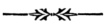
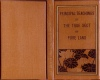

  
[Intangible Textual Heritage](../../index)  [Buddhism](../index) 
[Index](index)  [Next](ptpl01) 

------------------------------------------------------------------------

[Buy this Book at
Amazon.com](https://www.amazon.com/exec/obidos/ASIN/B0029U2W0U/internetsacredte)

------------------------------------------------------------------------

  
*Principal Teachings of The True Sect of Pure Land*, by Yejitsu Okusa,
\[1915\], at Intangible Textual Heritage

------------------------------------------------------------------------

# PRINCIPAL TEACHINGS

###### OF

## THE TRUE SECT

###### OF

### PURE LAND

 

#### KYŌTO

#### THE ŌTANIHA HONGWANJI

#### \[1915\]

Scanned, proofed and formatted by John Bruno Hare at Intangible Textual
Heritage, October 2008. This text is in the public domain in the US
because it was published prior to 1923.

 
[  
Click to enlarge](img/cover.jpg)  
Cover  

  [  
Click to enlarge](img/title.jpg)  
Title Page  

  [  
Click to enlarge](img/pl01.jpg)  
The Gateway to the Shrine at Higashi-Ōtani.  

  [  
Click to enlarge](img/pl02.jpg)  
The Higashi Hongwanji Temple at Karasumaru.  

------------------------------------------------------------------------

[Next: Preface](ptpl01)
