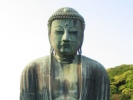

  
[Intangible Textual Heritage](../../index)  [Buddhism](../index) 
[Index](index)  [Next](rosa01) 

------------------------------------------------------------------------

[Buy this Book at
Amazon.com](https://www.amazon.com/exec/obidos/ASIN/B00295RH64/internetsacredte)

------------------------------------------------------------------------

  
*The Religion of the Samurai*, by Kaiten Nukariya, \[1913\], at
Intangible Textual Heritage

------------------------------------------------------------------------

# THE RELIGION OF THE SAMURAI

### A STUDY OF ZEN PHILOSOPHY AND DISCIPLINE IN CHINA AND JAPAN

###### BY

## KAITEN NUKARIYA

##### PROFESSOR OF KEI-O-GI-JIKU UNIVERSITY AND OF

##### SO-TO-SHU BUDDHIST COLLEGE, TOKYO

### \[1913\]

###### Scanned, proofed and formatted at ith.oarc.science, September 2000, by John Bruno Hare. This text is in the public domain in the US because it was published prior to 1923.

------------------------------------------------------------------------

[Next: Contents](rosa01)
