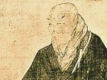

  
[Intangible Textual Heritage](../../index)  [Buddhism](../index) 
[Index](index)  [Previous](sahw10)  [Next](sahw12) 

------------------------------------------------------------------------

[Buy this Book at
Amazon.com](https://www.amazon.com/exec/obidos/ASIN/1428600353/internetsacredte)

------------------------------------------------------------------------

  
*Shinran and His Work*, by Arthur Lloyd, \[1910\], at Intangible Textual
Heritage

------------------------------------------------------------------------

p. 77

### Chapter IX.

### *Hōzō Biku*.

(§§ 40–46)

We now come to one of the most interesting features of the Shinshu
system.

Amitābha, the Unoriginate, the Boundless in Power and in Love, the Being
through Whom the worlds were made, in accordance with the operation of
the Law which He Himself had given, and through which alone He manifests
Himself to the world, looked down from His Abode and beheld with
compassion the miseries of blind and ignorant creatures. He resolved to
save them, to bring them back to Himself from their ceaseless
entanglements with Life and Death, and, to do so, determined to become
man and live as man among the creatures he had come to save. He emptied
Himself [\*](#fn_76), therefore, of His Divinity
and appeared on earth as a King's Son. He emptied Himself of His Royal
State, and became a monk, and then, coming into the presence of the
Buddha of his time [†](#fn_77)—*Sejizai-ō-butsu*
(in Sanskrit, Lokes’vara Rāja), "the King-Buddha, Lord of the World,"
made the Vow [‡](#fn_78) on which the Shinshu
believer

p. 78

pins his faith. The Vow having been registered, long ages of expiatory
labours ensued. These labours were entirely borne as man. Amitābha had
emptied Himself of his glory and become Hōzō the monk. None of his
contemporaries knew who it was that dwelt concealed beneath that humble
form, for the Supreme had emptied Himself and veiled His glory. It was
as *man for man* that He must work out the task of Man's Salvation.

Having accomplished that work, [\*](#fn_79) He
returned to where He was before, and received a Name more precious even
than that which he had borne originally. *Amida Nyorai*, as the Japanese
call him, had become *Namu-Amida-Butsu*. [†](#fn_80) The name signifies the import of the work
accomplished. Amida is no longer merely the Infinite, the God afar off,
but the Infinite that has become Finite, that has worked out man's
Salvation, that has conquered death (*amrita*) [‡](#fn_81) and that remains the personified and
personal object of the believer's worship and thanksgiving. It requires
no great ingenuity to recognize the wonderful parallels to the Story of
*our* Redemption as we humbly believe it.

The question arises, Is Hōzō Biku a historical personage or not? The
author of *Shinshu Hyakuwa* is quite certain that he is. We believe in
his historicity,

p. 79

he says, on the sole testimony of Sakyamuni, which ought to be
sufficient for us, inasmuch as it is quite as strong as the evidence
that we actually have for the historicity of the early Emperors of Japan
and of many Sages and Saints in Chinese and European history. (§ 42). It
is true that *Hōzō Biku* may have been the creature of S’akyamuni's
fancy: that would not necessarily imply that he had had no real
existence,—for there are many creatures of the imagination that may
claim a practically real and true existence. (David Copperfield, to wit,
for whose historicity the Town Council of Dover has made itself
responsible, by affixing to the wall of a house in the Market Square a
tablet indicating the spot where David sat whilst waiting for his Aunt.)
Historicity is not the sole Test of Truth, it is only a spiritual
short-sightedness that would induce us to think so [\*](#fn_82) (§ 43). When Hōzō lived, and when he
fulfilled his Vow, we have no means of determining: the statements of
the Sūtra vary between a period of ten kalpas ago and a period, still
more remote, of indefinite magnitude. In things religious there are no
distinctions of time, near or remote, [†](#fn_83) a thousand years are but as one day, and
we must be content with a general expression that it took place at some
period of remote antiquity. What is of the utmost importance for us to
believe is that the

p. 80

personal continuity has never been broken, that the one thread of
identical personality runs through the whole series of events connected
with the Redemption of Man, that as the Amida, Who, from His abode in
Heaven, looked down with compassion on sinful mankind, is identical with
Hōzō the monk who made his Vow to accomplish salvation so, through all
the time that the Vow was in the working-out, the personal identity
remained constant and unchanged. The Hōzō of the period of His
Humiliation (to use a Christian term for the Buddhist \# *in-i*) was the
same as the Hōzō of the period of His Glorification \# *kwa-i*), when,
having wrought deliverance for man, He received His new name of
*Namu-Amida Butsu*, the Infinite Being that has become finite and has
worked out man's salvation (§ 45). The glorified and ascended Amida must
therefore still be looked upon as a Personal Being, the distinctive
personality which He assumed when He appeared on earth as Hōzō has
continued with Him and has passed for ever out of this world into those
spiritual realms into which *Namu-Amida Butsu* entered on the day on
which Hōzō Biku's labours were finally accomplished (§ 46).

I believe that I have honestly set forth the teachings about Hōzō Biku,
as laid down in the Shinshu Hyakuwa. I may perhaps be allowed to
formulate the conclusions that I draw from a very long study of the
subject.

The testimony of S’akyamuni must always be a very weighty matter, for
the Indian Sage was not one that spoke lightly and rashly, but always
with due deliberation and with tremendous authority.

p. 81

\[paragraph continues\] But no other
evidence than S’akyamuni's authority is alleged for the Hōzō story, and
Buddhists are not all of one mind as to the genuineness of the Sutras
in. which it is contained. The Southern Buddhists know nothing of the
books, and there is not a shred of outside historical evidence to
support the story they tell. There is, also, no gainsaying the fact that
the Shinshu themselves are obliged to confess that the doctrine lay
dormant for five centuries after S’akyamuni's death and never showed its
face until about the end of the first, or beginning of the second,
century of the Christian era, and that in regions where Christianity had
already then been preached. On the other hand, however, those who reject
these Scriptures, as not being genuine, bring forward no alternative
supposition or theory to account for these books having come into
existence. We are, therefore, constrained to admit that the only account
hitherto given of the origin of these Sutras is that they are the
genuine records of actual teachings of S’akyamuni. Those who reject this
view have advanced no other theory to take its place.

I therefore, for the time, and until I see proof to the contrary, accept
them as genuine records of S’akyamuni's teachings. The story of Hōzō
Biku is true, at any rate in the sense that it is in accordance with a
universally felt want of our human nature, to which it supplies an
answer. It states an everlasting fact,—"so it is written, so it must
needs be,"—that there is only one way in which the Redemption of Mankind
can take place. God must become man, must suffer and labour as man, must
conquer sin and death in man, must open the

p. 82

way for man by faith. S’akyamuni, who had come forth, says Shinran, that
he might preach Amida, did so with the eye of the genuine Seer, who
gazes on the Eternal Verities and beholds the Present and the Future as
though they were the Past,—and as he preached he framed his vision into
a prophecy. To my mind there is nowhere, in the whole range of ancient
religious literature, a more clear and distinct prophecy about the
Person and Work of Christ, than that which is contained in the story of
Hōzō Biku as I have tried to set it forth accurately and carefully from
Shinshu writings.

I do not ask my readers to accept my conclusions hastily and without due
consideration. I only venture to ask that the question be investigated,
carefully and prayerfully, by all those, whether Christian or Buddhist,
who are concerned in the religious [welfare](errata.htm#7) of Japan. I
believe the identification which I have pointed out to be one of prime
importance: it will indeed be a day of gladness when we realize that we
of the East and West are children, in a very special sense, of One
Father, and servants of One Lord. I do not expect any speedy recognition
of the truth of what I have here brought forward. The truth can always
afford to wait for recognition. And when recognized it always tends to
the bettering and uplifting of the world.

------------------------------------------------------------------------

### Footnotes

[77:\*](sahw11.htm#fr_76) Dr. Anezaki reminds me
that there is a similar *Kenosis* spoken of in the case of S’akyamuni.

[77:†](sahw11.htm#fr_77) A list of 81 Buddhas is
given, Sacred Books of the East, vol. XLIX, *Description of Sukhavati*
p. 6. They are not Buddhas in the sense in which Amitābha is one, merely
perfectly enlightened Human Teachers.

[77:‡](sahw11.htm#fr_78) For Amida's Vow see
*ibid*. pp. 12–24

[78:\*](sahw11.htm#fr_79) Hōzo's life is
summarized in the work already quoted pp. 24–27.

[78:†](sahw11.htm#fr_80) *Shinshu Hyakuwa*, §
14, speaks of the Vow as the *Chōsemujō no Hongwan*, and of Amida as
*Dai jihi-emman no Myōhō-ō*—"the mysterious spiritual king that has
perfected mercy."

[78:‡](sahw11.htm#fr_81) In the Shingon books
Amida is generally *Amrita*, "the One that has Immortality."

[79:\*](sahw11.htm#fr_82) The Nichiren Sect (the
subject is constantly alluded to in the Nichiren Organ, the Myōshū)
frequently charges the Shinshu with the absence of historical warrant
for their interpretations of Buddhism.

[79:†](sahw11.htm#fr_83) *Enkin kokon no
shabetsu nashi*. cf. the expression in the N.T. "the Lamb slain from the
foundation of the world."

------------------------------------------------------------------------

[Next: Chapter X. Shinnyo Hōshō.](sahw12)
