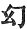

  
[Intangible Textual Heritage](../../index)  [Buddhism](../index) 
[Index](index)  [Previous](sbe1902)  [Next](sbe1904) 

------------------------------------------------------------------------

p. 1

# FO-SHO-HING-TSAN-KING.

## A METRICAL VERSION

###### OF THE

#### LIFE OF BUDDHA BY MA-MENG-PU-SA.

##### (A*S*VAGHOSHA BODHISATTVA.)

# KIOUEN I.

### VARGA 1. THE BIRTH.

(There was) a descendant of the Ikshvâku [1](#fn_13) (family), an invincible [2](#fn_14) *S*âkya monarch, pure in mind (mental
gifts) and of unspotted virtue, called therefore 'Pure-rice'
(*S*uddhodana). . 1

Joyously reverenced by all men (or, 'beings'), as the new moon (is
welcomed by the world), the king indeed (was) like the heaven-ruler
*S*akra [3](#fn_15), his queen like (the divine)
*S*a*k*î. . 2

Strong and calm of purpose as the earth, pure in mind as the water-lily,
her name, figuratively assumed, Mâyâ, she was in truth incapable of
class-comparison. . 3

p. 2

On her in likeness as the heavenly queen descended the spirit and
entered her womb. A mother, but free from grief or pain, (she was)
without any false or illusory [1](#fn_16) mind.
. 4

Disliking the clamorous ways of the world, (she remembered) the
excellent garden of Lumbinî, a pleasant spot, a quiet forest retreat,
(with its) trickling fountains, and blooming flowers and fruits. . 5

Quiet and peaceful, delighting in meditation, respectfully she asked the
king for liberty to roam therein; the king, understanding her earnest
desire, was seized with a seldom-felt anxiety (to grant her request).
. 6

He commanded his kinsfolk, within and without (the palace), to repair
with her to that garden shade; and now the queen Mâyâ knew that her time
for child-bearing was come. . 7

She rested calmly on a beautiful couch, (surrounded by) a hundred
thousand female attendants; (it was) the eighth day of the fourth moon,
a season of serene and agreeable character. .
8

Whilst she (thus) religiously observed [2](#fn_17) the rules of a pure discipline,
Bodhisattva was born from her right side, (come) to deliver the world,
constrained by great pity, without causing his mother pain or anguish.
. 9

As king Yu-liu [3](#fn_18) was born from the
thigh, as king Pi-t’au [4](#fn_19) was born from
the hand, as king Man-to [5](#fn_20)

p. 3

was born from the top of the head, as king Kia-*k*’*h*a [1](#fn_21) was born from the arm-pit, . 10

So also was Bodhisattva on the day of his birth produced from the right
side; gradually emerging from the womb, he shed in every direction the
rays of his glory. . 11

As one (born) from recumbent space [2](#fn_22),
and not through the gates of life, through countless kalpas, practising
virtue, self-conscious he came forth to life, without confusion. . 12

Calm and collected, not falling headlong (was he born), gloriously
manifested, perfectly adorned, sparkling with light he came from the
womb [3](#fn_23), as when the sun first rises
(from the East). . 13

(Men) indeed regarded [4](#fn_24) his exceeding
great glory, yet their sight remained uninjured: he allowed them to
gaze, the brightness of his person concealed for the time, as when we
look upon the moon in the heavens. . 14

His body, nevertheless, was effulgent with light, and like the sun which
eclipses the shining of the lamp, so the true gold-like beauty of
Bodhisattva shone forth and was diffused everywhere. . 15

Upright and firm and unconfused in mind, he deliberately took seven
steps [5](#fn_25), the soles of his feet

p. 4

resting evenly upon the ground as he went, his footmarks remained bright
as seven stars. . 16

Moving like the lion, king of beasts, and looking earnestly towards; the
four quarters, penetrating to the centre the principles of truth, he
spake thus with the fullest assurance: .
17

'This birth is in the condition of a Buddha [1](#fn_26); after this I have done with renewed
birth; now only am I born this once, for the purpose of saving all the
world.' . 18

And now from the midst of heaven there descended two streams of pure
water, one warm, the other cold, and baptized his head [2](#fn_27), causing refreshment to his body. . 19

And now he is placed in the precious palace hall, a jewelled couch for
him to sleep upon, and the heavenly kings with their golden flowery
hands hold fast the four feet of the bed. .
20

Meanwhile the Devas in space, seizing their jewelled canopies,
attending, raise in responsive harmony their heavenly songs, to
encourage him to accomplish his perfect purpose [3](#fn_28). . 21

Then the Nâga-râ*g*as filled with joy, earnestly desiring to show their
reverence for the most excellent law [4](#fn_29), as they had paid honour to the former
Buddhas, now went to meet Bodhisattva; .
22

p. 5

They scattered before him Mandâra flowers, rejoicing with heartfelt joy
to pay such religious homage; (and so, again,) Tathâgata having appeared
in the world, the *S*uddha [1](#fn_30) angels
rejoiced with gladness; . 23

With no selfish or partial joy, but for the sake of religion they
rejoiced, because creation [2](#fn_31), engulfed
in the ocean of pain, was now to obtain perfect release. . 24

Then the precious Mountain-râ*g*a, Sume(ru) [3](#fn_32), firmly holding this great earth [4](#fn_33) when Bodhisattva appeared in the world,
was swayed by the wind of his perfected merit. .
25

On every hand the world was greatly shaken, as the wind drives the
tossing boat; so also the minutest atoms of sandal perfume, and the
hidden sweetness of precious lilies, . 26

Floated on the air and rose through space and then commingling came back
to earth; so again the garments of Devas descending from heaven touching
the body, caused delightful thrills of joy; .
27

The sun and moon with constant course redoubled the brilliancy of their
light, whilst in the world the

p. 6

fire's gleam of itself prevailed without the use of fuel. . 28

Pure water, cool and refreshing from the springs, flowed here-and there,
self-caused; in the palace all the waiting women were filled with joy at
such an unprecedented event. . 29

Proceeding all in company, they drink and bathe themselves; in all arose
calm and delightful thoughts; countless inferior Devas (bhûtas),
delighting in religion, like clouds assembled. .
30

In the garden of Lumbinî, filling the spaces between the trees, rare and
special flowers, in great abundance, bloomed out of season. . 31

All cruel and malevolent kinds of beings, together conceived a loving
heart; all diseases and afflictions among men without a cure applied, of
themselves were healed. . 32

The various cries and confused sounds of beasts were hushed and silence
reigned; the stagnant water of the river-courses flowed apace, whilst
the polluted streams became clear and pure. .
33

No clouds gathered throughout the heavens, whilst angelic music,
self-caused, was heard around; the whole world of sentient creatures
enjoyed peace and universal tranquillity. .
34

Just as when a country visited by desolation, suddenly obtains .an
enlightened ruler, so when Bodhisattva was born, he came to remove the
sorrows of all living things. . 35

Mâra [1](#fn_34), the heavenly monarch, alone
was grieved and rejoiced not. The Royal Father (*S*uddhodana)

p. 7

beholding his son [1](#fn_35), strange and
miraculous [2](#fn_36), as to his birth, . 36

Though self-possessed and assured in his soul, was yet moved with
astonishment and his countenance changed, whilst he alternately weighed
with himself the meaning (of such an event), now rejoiced and now
distressed. . 37

The queen-mother beholding her child, born thus contrary to laws of
nature, her timorous woman's heart was doubtful; her mind through fear,
swayed between extremes: . 38

Not distinguishing the happy from the sad portents, again and again she
gave way to grief [3](#fn_37); and now the aged
women of the world, (of the 'long night [4](#fn_38)') in a confused way supplicating heavenly
guidance, . 39

Implored the gods to whom their rites were paid, to bless the child;
(cause peace to rest upon the royal child.) Now there was at this time
in the grove, a certain soothsayer [5](#fn_39),
a Brahman, . 40

Of dignified mien and wide-spread renown, famed for his skill and
scholarship: beholding the signs [6](#fn_40),
his

p. 8

heart rejoiced, and he exulted at the miraculous event. . 41

Knowing the king's mind to be somewhat perplexed, he addressed him
(thus) with truth and earnestness, 'Men born in the world, chiefly
desire to have a son the most renowned [1](#fn_41); . 42

'But now the king, like the moon when full, should feel in himself a
perfect joy, having begotten an unequalled [2](#fn_42) son, (for by this the king) will become
illustrious among his race; . 43

'Let then his heart be joyful and glad, banish all anxiety and doubt,
the spiritual omens that are everywhere, manifested indicate for your
house and dominion a course of continued prosperity [3](#fn_43). . 44

'The most excellently endowed child now born will bring deliverance to
the entire world [4](#fn_44), none but a
heavenly teacher has a body such as this [5](#fn_45), golden colour’d, gloriously resplendent.
. 45

'One endowed with such transcendent marks, must reach the state of
"Samyak [6](#fn_46)-Sambodhi," or if he be
induced to engage in worldly delights, then he must become a universal
monarch [7](#fn_47); .
46

p. 9

'Everywhere recognised as the ruler of the great earth, mighty in his
righteous government, as a monarch ruling the four empires [1](#fn_49), uniting under his sway all other rulers;
. 47

'As among all lesser lights, the sun's brightness is by far the most
excellent. But if he seek a dwelling among the mountain forests, with
single heart searching for deliverance [2](#fn_50), . 48

'Having arrived at the perfection of true wisdom, he will become
illustrious [3](#fn_51) throughout the world;
for as mount Sumeru is monarch among all mountains, . 49

'Or, as gold is chief among all precious things, or, as the ocean is
supreme among all streams [4](#fn_52), or, as
the moon is first among the stars, or, as the sun is brightest of all
luminaries, . 50

'So Tathâgata, born in the world, is the most eminent [5](#fn_53) of men; his eyes clear and expanding [6](#fn_54), the lashes both above and below moving
with the lid, . 51

'The iris of the eye of a clear blue colour [7](#fn_55), in shape like the moon when half full,
such characteristics as these, without contradiction, foreshadow the
most excellent condition of perfect (wisdom).' 52.

p. 10

At this time the king addressed the twice-born [1](#fn_56), 'If it be as you say, with respect to
these miraculous signs, that they indicate such consequences, . 53

'Then no such case has happened with former kings, nor down to our time
has such a thing occurred.' The Brahman addressed the king thus, 'Say
not so; for it is not right; . 54

'For with regard to renown and wisdom, personal celebrity, and worldly
substance, these four things indeed are not to be considered according
to precedent or subsequence; . 55

'But whatever is produced according to nature [2](#fn_57), such things are liable to the law of
cause and effect: but now whilst I recount some parallels let the king
attentively listen; . 56

'Bh*ri*gu, Aṅgira [3](#fn_58) (Aṅgiras?), these
two of *Ri*shi family [4](#fn_59), having passed
many years apart from men, each begat an excellently-endowed son, . 57

'B*ri*haspati with *S*ukra, skilful in making royal treatises, not
derived from former families (or, tribes); .
58

'Sârasvata, the *Ri*shi, whose works [5](#fn_60)
have long disappeared, begat a son, Po-lo-sa [6](#fn_61), who compiled illustrious Sutras [7](#fn_62) and Shâstras; .
59

p. 11

'That which now we know and see, is not therefore dependent on previous
connection; Vyâsa, the *Ri*shi, the author of numerous treatises, . 60

'After his death had among his descendants, Poh-mi (Vâlmîki), who
extensively collected Gâthâ sections; Atri, the *Ri*shi, not
understanding the sectional treatise on medicine, . 61

'Afterwards begat Âtreya, who was able to control diseases; the
twice-born *Ri*shi Kusi (Ku*s*ika), not occupied with heretical
treatises, . 62

'Afterwards (begat) Kia-ti-na râ*g*a, who thoroughly understood
heretical systems; the sugar-cane monarch [1](#fn_63), who began his line, could not restrain
the tide of the sea, . 63

'But Sagara-râ*g*a, his descendant, who begat a thousand royal sons, he
could control the tide of the great sea so that it should come no
further. . 64

'*G*anaka, the *Ri*shi, without a teacher acquired power of abstraction.
All these, who obtained such renown, acquired powers of themselves [2](#fn_64); . 65

'Those distinguished before, were afterwards forgotten; those before
forgotten, became afterwards distinguished [3](#fn_65); kings like these and godlike *Ri*shis
have no need of family inheritance, . 66

'And therefore the world need not regard those going before or
following. So, mighty king! is it with you, you should experience true
joy of heart, . 67

'And because of this joy should banish for ever doubt or anxiety.' The
king hearing the words

p. 12

of the seer was glad, and offered him increased gifts [1](#fn_66). . 68

'Now have I begotten a valiant (excellent) son (he said), who will
establish a wheel authority, whilst I, when old and grey-headed, will go
forth to lead a hermit's life [2](#fn_67), . 69

'So that my holy king-like son may not give up the world and wander
through mountain forests.' And now near the spot within the garden,
there was a *Ri*shi, leading the life of an ascetic [3](#fn_68); . 70

His name was Asita, wonderfully skilful in the interpretation of signs;
he approached the gate of the palace; the king (beholding him)
exclaimed, 'This is none other but Brahmadeva, .
71

'Himself enduring penance from love of true religion, these two
characteristics [4](#fn_69) so plainly visible
as marks of his austerities.' Then the king was much rejoiced; . 72

And forthwith he invited him within the palace, and with reverence set
before him entertainment, whilst he, entering the inner palace, rejoiced
only (in prospect of) seeing the royal child. .
73

Although surrounded by the crowd of court-ladies, yet still he was as if
in desert solitude; and now they place a preaching throne and pay him
increased honour and religious reverence, .
74

As Antideva râ*g*a reverenced the priest Vasish*th*a. Then the king
addressing the *Ri*shi, said, 'Most fortunate am I, . 75

'Great *Ri*shi! that you have condescended to

p. 13

come here to receive from me becoming gifts and reverence; I pray you
therefore enter on your exhortation.' . 76

Thus requested and invited the *Ri*shi felt unutterable joy, and said,
'All hail, ever victorious monarch! possessed of all noble (virtuous)
qualities [1](#fn_70), .
77

'Loving to meet the desires of those who seek, nobly generous in
honouring the true law, conspicuous as a race for wisdom and humanity,
with humble mind you pay me homage, as you are bound. . 78

'Because of your righteous deeds in former lives [2](#fn_71), now are manifested these excellent
fruits; listen to me, then, whilst I declare the reason of the present
meeting. . 79

'As I was coming on the sun's way [3](#fn_72), I
heard the Devas in space declare that the king had born to him
(begotten) a royal son, who would arrive at perfect intelligence [4](#fn_73); . 80

'Moreover I beheld such other portents [5](#fn_74), as have

p. 14

constrained me now to seek your presence; desiring to see the *S*âkya
monarch who will erect the standard of the true law.' . 81

The king hearing the *Ri*shi's. words was fully assured; escaping from
the net of doubt, he ordered an attendant to bring the prince, to
exhibit him to the *Ri*shi. . 82

The *Ri*shi, beholding the prince, the thousand-rayed wheel on the soles
of his feet, the web-like filament between his fingers [1](#fn_75), between his eyebrows the white [2](#fn_76) wool-like prominence, . 83

His privy parts hidden as those of the horse, his complexion bright and
lustrous; seeing these wonderful birth-portents, the seer wept and
sighed deeply. . 84

The king beholding the tears of the *Ri*shi, thinking of his son, his
soul was overcome, and his breath fast held his swelling heart. Thus
alarmed and ill at ease, . 85

Unconsciously he arose from his seat, and, bowing his head at the
*Ri*shi's feet he addressed him in these words, 'This son of mine, born
thus wonderfully, . 86

'Beautiful in face, and surpassingly graceful, little different from the
gods in form, giving promise of superiority in the world, ah! why has he
caused thee grief and pain? . 87

'Forbid it, that my son should die! (should be short-lived!)--(the
thought) creates in me grief and

p. 15

anxiety; that one athirst, within reach of the eternal draught [1](#fn_77), should after all reject and lose it! sad
indeed! . 88

'Forbid it, he should lose his wealth and treasure! dead to his house!
lost to his country! for he who has [2](#fn_78)
a prosperous son in life, gives pledge that his country's weal is well
secured; . 89

'And then, coming to die, my heart will rest content, rejoicing in the
thought. of offspring surviving me; even as a man possessed of two eyes,
one of which keeps watch, while the other sleeps; . 90

'Not like the frost-flower of autumn, which though it seems to bloom, is
not a reality. A man who, midst his tribe and kindred, deeply loves a
spotless son, . 91

'At every proper time in recollection of it has joy; O! that you would
cause me to revive [3](#fn_79)!' The *Ri*shi,
knowing the king-sire to be thus greatly afflicted at heart, . 92

Immediately addressed the Maharâ*g*a: 'Let not the king be for a moment
anxious! the words I have spoken to the king, let him ponder these, and
not permit himself to doubt; . 93

'The portents now are as they were before, cherish

p. 16

then no other thoughts! But recollecting I myself am old, on that
account I could not hold my tears; . 94

'For now my end is coming on. But this son of thine will rule the world,
born for the sake of all that lives [1](#fn_81)!
this is indeed one difficult to meet with; .
95

'He shall give up his royal estate, escape from the domain of the five
desires  [2](#fn_82), with resolution and with
diligence practise austerities, and then awakening, grasp the truth.
. 96

'Then constantly, for the world's sake (all living things), destroying
the impediments of ignorance and darkness, he shall give to all enduring
light, the brightness of the sun of perfect wisdom. . 97

'All flesh submerged in the sea of sorrow; all diseases collected as the
bubbling froth; decay and age like the wild billows; death like the
engulfing ocean; . 98

'Embarking lightly in the boat of wisdom he will save the world from all
these perils, by wisdom stemming back the flood. His, pure teaching like
to the neighbouring shore, . 99

'The power of meditation, like a cool lake, will be enough for all the
unexpected birds; thus deep and full and wide is the great river of the
true law; . 100

'All creatures parched by the drought of lust may freely drink thereof,
without stint; those

p. 17

enchained in the domain of the five desires, those driven along by many
sorrows, . 101

'And deceived amid the wilderness of birth and death, in ignorance of
the way of escape, for these Bodhisattva has been born in the world, to
open out a way of salvation [1](#fn_83). . 102

'The fire of lust and covetousness, burning with the fuel of the objects
of sense, (on the flames) he has caused the cloud of his mercy to rise,
so that the rain of the law may extinguish them. . 103

'The heavy gates of gloomy unbelief, fast kept by covetousness and lust,
within which are confined all living things, he opens and gives free
deliverance. . 104

'With the tweezers of his diamond wisdom he plucks out the opposing
principles of lustful desire. In the self-twined meshes of folly and
ignorance all flesh poor and in misery, helplessly (lying), . 105

'The king of the law has come forth, to rescue these from bondage. Let
not the king in respect of this his son encourage in himself one thought
of doubt or pain; . 106

'But rather let him grieve on account of the world, led captive by
desire, opposed to truth; but I, indeed, amid the ruins of old age and
death, am far removed from the meritorious condition of the holy
one [2](#fn_84), .
107

'Possessed indeed of powers of abstraction, yet

p. 18

not within reach of the gain he will give, to be derived from his
teaching as the Bodhisattva; not permitted to hear his righteous law,
. 108

'My body worn out, after death, alas! (destined) to be born as a
Deva [1](#fn_85) still liable to the three
calamities (old age, decay, and death), (therefore I weep).' The king
and all his household attendants, hearing the words of the *Ri*shi,
. 109

Knowing the cause of his regretful sorrow, banished from their minds all
further anxiety: 'And now (the king. said) to have begotten this
excellent son, gives me rest at heart; .
110

'But that he should leave his kingdom and home, and practise the life of
an ascetic, not anxious to ensure the stability of the kingdom, the
thought of this still brings with it pain.' .
111

At this time the *Ri*shi, turning to the king with true words, said, 'It
must be even as the king anticipates, he will surely arrive at perfect
enlightenment.' . 112

Thus having appeased every anxious heart among the king's household,
(the *Ri*shi) by his own inherent spiritual power ascended into space
and disappeared. . 113

At this time *S*uddhodana râ*g*a, seeing the excellent marks (predictive
signs) of his son, and, moreover, hearing the words of Asita, certifying
that which would surely happen, . 114

Was greatly affected with reverence to the child, he redoubled measures
for its protection, and (was

p. 19

filled) with constant thought; (moreover) he issued decrees through the
empire, to liberate all captives in prison, 115.

According to the custom when a (royal) son was born, giving the usual
largess, in agreement with the directions of the Sacred Books, and
extending his gifts to all; (or, all these things he did completely).
. 116

The child [1](#fn_86) when ten days old, (his
father's) mind being now quite tranquil, he announced a sacrifice to all
the gods, and prepared to give liberal offerings to all the religious
bodies; . 117

*S*râma*n*as and Brâhma*n*as invoked by their prayers a blessing from
the gods, whilst he bestowed gifts on the royal kinspeople and the
ministers and the poor within the country; .
118

The women who dwelt in the city or the villages, (all those who needed)
cattle or horses or elephants or money, each, according to his
necessities, was liberally supplied; . 119

Then selecting by divination a lucky time, they took the child back to
his own palace; with a double-feeding white-pure-tooth [2](#fn_87), carried in a richly-adorned chariot
(cradle), . 120

With ornaments of every kind and colour round his neck; shining with
beauty, exceedingly resplendent with unguents. The queen embracing

p. 20

him in her arms, going around, worshipped the heavenly spirits. . 121

Afterwards she remounted her precious chariot, surrounded by her waiting
women; the king, with his ministers and people, and all the crowd of
attendants, leading the way and following, .
122

Even as the ruler of heaven, *S*akra, is surrounded by crowds of Devas;
as Mahe*s*vara, when suddenly his six-faced child was born, . 123

Arranging every kind of present, gave gifts, and asked for blessings; so
now the king, when his royal son was born, made all his arrangements in
like manner; . 124

So Vai*s*rava*n*a, the heavenly king, when Nalakûvara [1](#fn_88) was born, surrounded by a concourse of
Devas, was filled with joy and much gladness; .
125

So the king, now the royal prince was born, in the kingdom of Kapila,
his people and all his subjects were likewise filled with joy. . 126

------------------------------------------------------------------------

### Footnotes

[1:1](sbe1903.htm#fr_13) The Ikshvâku
(sugar-cane) family of Potala. *S*uddhodana was the father of the
Bodhisattva.

[1:2](sbe1903.htm#fr_14) Wou-shing; this is the
equivalent for the A*g*itavatî (river). But it here refers to the
*S*âkyas, as a race of *K*akravartin monarchs.

[1:3](sbe1903.htm#fr_15) Or, like *S*akra, king
of Devas, the husband of *S*a*k*î.

[2:1](sbe1903.htm#fr_16) Here there seems to be
a play on the word wan  ,
which is the equivalent for Mâyâ or illusion. The Sanskrit text reads
Mâyâpagatâ-iva Mâyâ, i.e. Mâyâ without deceit.

[2:2](sbe1903.htm#fr_17) Or, (the season for)
religiously observing the rules of abstinence.

[2:3](sbe1903.htm#fr_18) Aurva.

[2:4](sbe1903.htm#fr_19) P*ri*thu, born from the
arm of Vena.

[2:5](sbe1903.htm#fr_20) Mândhât*ri*.

[3:1](sbe1903.htm#fr_21) Kakshîvat. These names
are supplied from the Sanskrit text.

[3:2](sbe1903.htm#fr_22) This may also be
translated 'as one who falls from space,' i.e. miraculously born from
space.

[3:3](sbe1903.htm#fr_23) He passed from the womb
to be born. The idea seems to be that though conceived in the womb, he
was born supernaturally from the side.

[3:4](sbe1903.htm#fr_24) Kwan-tsai, weighed and
considered.

[3:5](sbe1903.htm#fr_25) These seven steps are
frequently figured by seven lotus-marks. I-tsing refers to such marks at
Nâlanda, where Buddha walked seven steps, forward and backward; they are
also figured on the p. 4 cloth held by the
attendants at the birth of Bodhisattva. See Tree and Serpent Worship,
plate lxv, figure 2, middle scene.

[4:1](sbe1903.htm#fr_26) This birth is a
Buddha-birth.

[4:2](sbe1903.htm#fr_27) He was thus consecrated
to be a king; see Childers, Pâli Dict., sub Abhisi*ñk*ati; also Eitel,
Handbook, sub Mûrddhâbhishikta.

[4:3](sbe1903.htm#fr_28) Inviting him to perfect
the way of Buddha.

[4:4](sbe1903.htm#fr_29) That is, 'to advance
the cause of true religion.'

[5:1](sbe1903.htm#fr_30) The *S*uddha-vâsas,
'beings dressed in pure garments.' A class of heavenly beings, supposed
to take peculiar interest in the religious welfare of men.

[5:2](sbe1903.htm#fr_31) 'Creation,' in the
sense of 'all that lives.'

[5:3](sbe1903.htm#fr_32) Sumeru, written also
Sumě and Meru. The primeval mountain; the Alborz, Atlas, or Olympus of
other tribes. It is explained as 'the high, or resplendent, mountain.'
On it was the heaven of the gods (the thirty-three gods).

[5:4](sbe1903.htm#fr_33) It would seem from this
that the original idea of Sumeru was 'the mountain of Heaven;' the
visible heaven, or firmament, which 'firmly holds the earth.'

[6:1](sbe1903.htm#fr_34) Mâra, the king of the
world of desire. According to the Buddhist theogony he is the god of
sensual love. He holds the p. 7 world in sin.
He was the enemy of Buddha, and endeavoured in every way to defeat him.
He is also described as the king of death.

[7:1](sbe1903.htm#fr_35) Beholding his 'born
son,' or 'begotten son.'

[7:2](sbe1903.htm#fr_36) K’i-teh, truly unique
(Williams' Diet.) Mi tsang yau, unseen before, miraculous.

[7:3](sbe1903.htm#fr_37) The text seems to point
to alternately recurring hope and grief.

[7:4](sbe1903.htm#fr_38) The text here is
difficult. I take *Kh*ang-suh to be equal to *Kh*ang-yê, which is a
frequent expression to denote the 'long night' of transmigration or
ignorance. If this be not so, then *Kh*ang-suh may be simply 'aged.'

[7:5](sbe1903.htm#fr_39) *Kh*i Siang, a
discerner of signs or portents.

[7:6](sbe1903.htm#fr_40) That is, either the
signs on the child's body, or the occurrences attending his birth.

[8:1](sbe1903.htm#fr_41) Or, a most victorious
son; or, a son most renowned.

[8:2](sbe1903.htm#fr_42) K’i-teh, truly unique;
strange or wonderful; ([p. 7](#page_7), n. 2.)

[8:3](sbe1903.htm#fr_43) Increasing or advancing
prosperity.

[8:4](sbe1903.htm#fr_44) Must assuredly save the
world.

[8:5](sbe1903.htm#fr_45) A body, such a
masterpiece.

[8:6](sbe1903.htm#fr_46) *Kh*ing-hsio, perfect
illumination, Samyak-Sambuddha; or, as in the text.

[8:7](sbe1903.htm#fr_47) A wheel-turning
monarch. A monarch like the sun 'that flies as he goes;' the old conceit
of a king of the age of gold [a](#fn_48); the
expectation of peace and prosperity resulting from the universal
authority of such a righteous king, is an old, perhaps a primitive, one.
The *K*akravartin is the eastern form of the myth.

[8:a](sbe1903.htm#fr_48) That is, probably, 'a
golden (wheel) king.'

[9:1](sbe1903.htm#fr_49) The four empires, that
is, the four continents or quarters of the world.

[9:2](sbe1903.htm#fr_50) Deliverance, that is,
from sin; or sorrow the result of sin (moksha).

[9:3](sbe1903.htm#fr_51) Shine universally; as
the light of the sun.

[9:4](sbe1903.htm#fr_52) The ocean is always in
Buddhist works, as in Homer, associated with 'flowings.' The expression
in the Chinese, liu-hai, corresponds exactly with Ὠκεανοῖο ῥέεθρα.

[9:5](sbe1903.htm#fr_53) The most worshipful.

[9:6](sbe1903.htm#fr_54) Widening more and more.

[9:7](sbe1903.htm#fr_55) Of a deep purple or
violet colour,

[10:1](sbe1903.htm#fr_56) That is, the Brahman
wearing the twice-born thread.

[10:2](sbe1903.htm#fr_57) Or, whatever is born
according to the nature of things.

[10:3](sbe1903.htm#fr_58) I restore these names
according to the Sanskrit text, supplied by Professor Max Miller.

[10:4](sbe1903.htm#fr_59) That is, belonging to
the *Ri*shi tribe; in other words, 'these two *Ri*shis.'

[10:5](sbe1903.htm#fr_60) Or, it may, perhaps
more correctly, be rendered 'separated by a long period from Sutras or
Shâstras,' or, when these works had long been lost.

[10:6](sbe1903.htm#fr_61) Is this Parâ*s*ara,
the reputed father of Vyâsa? (see Max Müller's Ancient Sanskrit
Literature, p. 479.)

[10:7](sbe1903.htm#fr_62) Illustrious Sûtras
(Ming King) may possibly refer to the Vedas, but the five vidyâs are
also called by this name (Jul. II, 73).

[11:1](sbe1903.htm#fr_63) That is, the first of
the Ikshvâku monarchs who reigned at Potala (Tatta) at the mouth of the
Indus.

[11:2](sbe1903.htm#fr_64) Or, were born by their
own power.

[11:3](sbe1903.htm#fr_65) Or, the former were
better, the later inferior; the former inferior, the later better.

[12:1](sbe1903.htm#fr_66) Or, extended his
religious offerings.

[12:2](sbe1903.htm#fr_67) Leaving my home will
practise a pure (Brahman) life.

[12:3](sbe1903.htm#fr_68) Practising
austerities.

[12:4](sbe1903.htm#fr_69) That is, 'purity' and
'penance.'

[13:1](sbe1903.htm#fr_70) The Chinese symbol
'teh' properly means 'virtue,' as in the title of Laou Tseu's work,
Tau-teh-king. But in Buddhist books it generally corresponds with the
Sanskrit gu*n*a, in the sense of a 'quality' or 'characteristic.'

[13:2](sbe1903.htm#fr_71) The expression suh
*kh*ih points to conduct in former conditions of existence. It properly
means 'a night's rest' or 'a lodging one night' (Williams), but in
Buddhist books it commonly refers to abodes or conditions of life,
occupied during the night (long night) of transmigration.

[13:3](sbe1903.htm#fr_72) Following the way of
the sun.

[13:4](sbe1903.htm#fr_73) Complete the way of
true wisdom (Sambodhi or Sambuddha).

[13:5](sbe1903.htm#fr_74) Such miraculous
portents going before. It would seem from Asita's description that he
came from the East following the sun, and as he came he saw before him
miraculous portents.

[14:1](sbe1903.htm#fr_75) Or, his fingers and
his toes.

[14:2](sbe1903.htm#fr_76) That is, the ûr*n*â.
This white wool-like mark seems to have been derived in the first
instance from the circle of hair on the forehead of the bull. Moschus
describes the bull that carried off Europa as having this 'silver white
circle' on his forehead.

[15:1](sbe1903.htm#fr_77) The 'eternal draught'
or 'sweet dew' of Ambrosia. This expression is constantly used in
Buddhist writings. It corresponds with the Pâli amata*m*, which Childers
explains as the 'drink of the gods.'

[15:2](sbe1903.htm#fr_78) Or, if I have.

[15:3](sbe1903.htm#fr_79) This *s*loka may be
translated otherwise thus: 'A man among all his kindred loves deeply a
spotless [a](#fn_80) son; at this time, in
recollection thereof, speaking, cause me to revive;' or the latter lines
may still be rendered, 'in memory of what you said before, cause me now,
by speaking as before, to revive.'

[15:a](sbe1903.htm#fr_80) Wou-kwo-tseu; either
'a faultless son' or 'nothing beyond his son.'

[16:1](sbe1903.htm#fr_81) This line may be also
rendered 'because he has done with birth, therefore he is born.' The
text is full of such double-meanings.

[16:2](sbe1903.htm#fr_82) The five desires, or
five appetites of sight, smell, taste, hearing, and touch.

[17:1](sbe1903.htm#fr_83) The word 'salvation'
corresponds to the Sanskrit moksha, deliverance or escape. The garden of
Lumbinî is sometimes called the 'garden of deliverance,' because Maya
was there delivered of her child.

[17:2](sbe1903.htm#fr_84) Or, removed from an
opportunity of reaping merit by the teaching of the holy one.

[18:1](sbe1903.htm#fr_85) The condition of the
highest Deva, according to Buddhism, does not exempt him from re-birth;
subject to the calamities incident on such a renewal of life.

[19:1](sbe1903.htm#fr_86) 'Shing-tseu,' the born
or begotten child.

[19:2](sbe1903.htm#fr_87) I am unable to
translate this line except literally,' two-feeding white pure ivory (or,
tooth),' ’rh fan pih tsing ’nga. \[I am informed, however, by Professor
Max Müller that it refers to the 'elephant' The elephant is called
dvipa, the twice-drinker, corresponding to ’rh fan (for ’rh yin), the
double-feeder (drinker), in the Chinese.\]

[20:1](sbe1903.htm#fr_88) Na-lo-kiu-po.
Nalakûvara was the son of Vai*s*rava*n*a.

------------------------------------------------------------------------

[Next: Varga 2. Living in the Palace](sbe1904)
