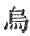
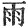
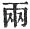
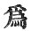
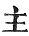
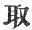
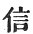

  
[Intangible Textual Heritage](../../index)  [Buddhism](../index) 
[Index](index)  [Previous](sbe1910)  [Next](sbe1912) 

------------------------------------------------------------------------

### VARGA 9. THE MISSION TO SEEK THE PRINCE.

The king now suppressing (regulating) his grief, urged an his great
teacher and chief minister, as one urges on with whip a ready horse, to
hasten onwards as the rapid stream; . 665

Whilst they fatigued, yet with unflagging effort, come to the place of
the sorrow-giving grove; then laying on one side the five outward
marks [1](#fn_234) of dignity and regulating
well their outward gestures, . 666

They entered the Brahmans' quiet hermitage, and paid reverence to the
*Ri*shis. They, on their part, begged them to be seated, and repeated
the law for their peace and comfort. . 667

Then forthwith they addressed the *Ri*shis and said: 'We have on our
minds a subject on which we would ask (for advice). There is one who is
called *S*uddhodana râ*g*a, a descendant of the famous Ikshvâku family,
. 668

'We are his teacher and his minister, who instruct him in the sacred
books as required. The king indeed is like Indra (for dignity); his son,
like *K*e-yan-to (*G*ayanta), . 669

'In order to escape old age, disease, and death, has become a hermit,
and depends on this; on his account have we come hither, with a view to
let your worships know of this.' . 670

Replying, they said: 'With respect to this youth,.

p. 95

has he long arms and the signs of a great man? Surely he is the one who,
enquiring into our practice, discoursed so freely on the matter of life
and death. . 671

'He has gone to the abode of Arâ*d*a, to seek for a complete mode of
escape.' Having received this certain information, respectfully
considering the urgent commands of the anxious king, . 672

They dared not hesitate in their undertaking, but straightway took the
road and hastened on. Then seeing the wood in which the royal prince
dwelt, and him, deprived of all outward marks of dignity, . 673

His body still glorious with lustrous shining, as when the sun comes
forth from the black cloud [1](#fn_235); then
the religious teacher of the country and the great minister holding to
the true law, . 674

Put off from them their courtly dress, and descending from the chariot
gradually advanced, like the royal Po-ma-ti (? Bharata) and the *Ri*shi
Vasish*th*a, . 675

Went through the woods and forests, and seeing the royal prince Râma,
each according to his own prescribed manner, paid him reverence, as he
advanced to salute him; . 676

Or as *S*ukra, in company with Aṅgiras, with earnest heart paid
reverence, and sacrificed to Indra râ*g*a. .
677

Then the royal prince in return paid reverence to the . royal teacher
and the great minister, as the divine Indra placed at their ease *S*ukra
and Aṅgiras; . 678

p. 96

Then, at his command, the two men seated themselves before the prince,
as Pou-na (Punarvasû) and Pushya, the twin stars attend beside the moon;
. 679

Then the Purohita and the great minister respectfully explained to the
royal prince, even as Pi-li-po-ti (B*ri*haspati) spoke to that
*G*ayanta: . 680

'Your royal father, thinking of the prince, is pierced in heart, as with
an iron point; his mind distracted, raves in solitude; he sleeps upon
the dusty ground; . 681

'By night and day he adds to his sorrowful reflections; his tears flow
down like the incessant rain; and now to seek you out, he has sent us
hither. Would that you would listen with attentive mind; . 682

'We know that you delight to act religiously; it is certain, then,
without a doubt, this is not the time for you to be a hermit (to enter
the forest wilds); a feeling of deep pity consumes our heart! . 683

'You, if you be indeed, moved by religion, ought to feel some pity for
our case; let your kindly feelings flow abroad, to comfort us who are
worn at heart; . 684

'Let not the tide of sorrow and of sadness completely overwhelm the
outlets of our heart; as the torrents (which roll down) the grassy
mountains; or the calamities of tempest, fiery heat, and lightning;
. 685

'For so the grieving heart has these four sorrows, turmoil and drought;
passion and overthrow. But come! return to your native place, the time
will arrive when you can go forth again as a recluse. . 686

'But now to disregard your family duties, to turn against father and
mother, how can this be called

p. 97

love and affection? that love which overshadows and embraces all. . 687

'Religion requires not the wild solitudes; you can practise a hermit's
duties in your home; studiously thoughtful, diligent in expedients, this
is to lead a hermit's life in truth. . 688

A shaven head, and garments soiled with dirt,--to wander by yourself
through desert wilds,--this is but to encourage constant fears, and
cannot be rightly called "an awakened hermit's (life)." . 689

'Would rather we might take you by the hand, and sprinkle [1](#fn_236)water on your head, and crown you with a
heavenly diadem, and place you underneath a flowery canopy, . 690

'That all eyes might gaze with eagerness upon you; after this, in truth,
we would leave our home with joy. The former kings Teou-lau-ma (Druma?),
A-neou-*k*e-o-sa (Anu*g*asa or Anu*d*âsa), .
691

'Po-*k*e-lo-po-yau (Va*g*rabâhu), Pi-po-to-’an-ti (Vaibhrâ*g*a),
Pi-ti-o-ke-na (Vatâ*g*ana?), Na-lo-sha-po-lo (Narasavara?), . 692

'All these several kings refused not the royal crown, the jewels, and
the ornaments of person; their hands and feet were adorned with gems,
. 693

'Around them were women to delight and please, these things they cast
not from them, for the sake of escape; you then may also come back home,
and undertake both necessary duties [2](#fn_237); . 694

'Your mind prepare itself in higher law, whilst for the sake of earth
you wield the sceptre; let there be no more weeping, but comply with
what we say, and let us publish it; . 695

p. 98

'And having published it with your authority, then you may return and
receive respectful welcome. Your father and your mother, for your sake,
in grief shed tears like the great ocean; .
696

'Having no stay and no dependence now--no source from which the *S*âkya
stem may grow--you ought, like the captain of the ship, to bring it
safely across to a place of safety. . 697

'The royal prince Pi-san-ma, as also Lo-me-po-ti, they respectfully
attended to the command of their father, you also should do the *s*ame!
. 698

'Your loving mother who cherished you so kindly, with no regard for
self, through years of care, as the cow deprived of her calf, weeps and
laments, forgetting to eat or sleep; . 699

'You surely ought to return to her at once, to protect her life from
evil; as a solitary bird, away from its fellows, or as the lonely
elephant, wandering through the jungle, .
700

'Losing the care of their young, ever think of protecting and defending
them, so you the only child, young and defenceless, not knowing what you
do, bring trouble and solicitude; . 701

'Cause, then, this sorrow to dissipate itself; as one who rescues the
moon [1](#fn_238) from being devoured, so do
you reassure the men and women of the land, and remove from them the
consuming grief, . 702

'(And suppress) the sighs that rise like breath to heaven, which cause
the darkness that obscures their sight; seeking you, as water, to quench
the fire, the fire quenched, their eyes shall open.' . 703

p. 99

Bodhisattva, hearing of his father the king, experienced the greatest
distress of mind, and sitting still, gave himself to reflection; and
then, in due course, replied respectfully: .
704

'I know indeed that my royal father is possessed of a loving and
deeply [1](#fn_239) considerate mind, but my
fear of birth, old age, disease, and death has led me to disobey, and
disregard his extreme kindness. . 705

'Whoever neglects right consideration about his present life, and
because he hopes to escape in the end, therefore disregards all
precautions (in the present), on this man comes the inevitable doom of
death. . 706

'It is the knowledge of this, therefore, that weighs . with me, and
after long delay has constrained me to a hermit's life; hearing of my
father, the king, and his grief, my heart is affected with increased
love; . 707

But yet, all is like the fancy of a dream, quickly reverting to
nothingness. Know then, without fear of contradiction, that the nature
of existing things is not uniform; . 708

'The cause of sorrow is not necessarily  [2](#fn_240) the relationship of child with parent,
but that which produces the pain of separation, results from the
influence of delusion [3](#fn_241); . 709

'As men going along a road suddenly meet mid-way with others, and then a
moment more are separated, each one going his own way [4](#fn_242), . 710

p. 100

'So by the force of concomitance, relationships are framed, and then,
according to each one's destiny [1](#fn_243),
there is separation; he who thoroughly investigates this false
connection of relationship ought not to cherish in himself grief; . 711

'In this world there is rupture of family love, in another life (world)
it is sought for again; brought together for a moment, again rudely
divided [2](#fn_244), everywhere the fetters of
kindred are formed [3](#fn_245)! . 712

'Ever being bound, and ever being loosened! who can sufficiently lament
such constant separations; born into the world [4](#fn_246), and then gradually changing, constantly
separated by death and then born again. .
713

'All things which exist in time must perish [5](#fn_247), the forests and mountains all things
thus exist [6](#fn_248); in time are born all
sensuous things (things possessing the five desires), so is it both with
worldly substance [7](#fn_249) and with time.
. 714

'Because, then, death pervades all time, get rid of death [8](#fn_250), and time will disappear. You desire to

p. 101

make me king, and it is difficult to resist the offices of love; . 715

'But as a disease (is difficult to bear) without medicine, so neither
can I bear (this weight of dignity); in every condition, high or low, we
find folly and ignorance, (and men) carelessly following the dictates of
lustful passion; . 716

'At last, we come [1](#fn_251) to live in
constant fear; thinking anxiously of the outward form, the spirit
droops; following the ways of men  [2](#fn_252), the mind resists the right [3](#fn_253); but, the conduct of the wise is not so.
. 717

'The sumptuously ornamented [4](#fn_254) and
splendid palace (I look upon) as filled with fire; the hundred dainty
dishes (tastes) of the divine kitchen, as mingled with destructive
poisons; . 718

'The lily growing on the tranquil lake, in its midst harbours countless
noisome insects; and so the towering abode of the rich is the house of
calamity; the wise will not dwell therein. .
719

'In former times illustrious kings, seeing the many crimes of their home
and country, affecting as with poison the dwellers therein, in sorrowful
disgust sought comfort in seclusion [5](#fn_255); . 720

'We know, therefore, that the troubles of a royal estate are not to be
compared with the repose of a religious life; far better dwell in the
wild mountains [6](#fn_256), and eat the herbs
like the beasts of the field; . 721

p. 102

'Therefore I dare not dwell in the wide [1](#fn_257) palace, for the black snake has its
dwelling there. I reject the kingly estate and the five desires
\[desires of the senses\], to escape such sorrows I wander thro’ the
mountain wilds. . 722

'This, then, would be the consequence of compliance, that I; who,
delighting in religion, am gradually getting wisdom [2](#fn_258), should now quit these quiet woods, and
returning home, partake of sensual pleasures, .
723

'And thus by night and day increase [3](#fn_259) my store of misery. Surely this is not
what should be done! that the great leader of an illustrious tribe,
having left his home from love of religion, .
724

'And for ever turned his back upon tribal honour [4](#fn_260), desiring to confirm his purpose as a
leader [5](#fn_261),--that he,--discarding
outward form, clad in religious garb, loving religious meditation,
wandering thro’ the wilds,-- 725

'Should now reject his hermit vestment, tread down his sense of proper
shame (and give up his aim). This, though I gained heaven's kingly
state, cannot be done! how much less to gain an earthly, though
distinguished [6](#fn_262), home! . 726

p. 103

'For having spued forth lust, passion, and ignorance, shall I return to
feed upon it? as a man might go back to his vomit! such misery, how
could I bear? . 727

'Like a man whose house has caught fire, by some expedient finds a way
to escape, will such a man forthwith go back and enter it again? such
conduct would disgrace a man [1](#fn_263)!
. 728

'So I, beholding the evils, birth, old age, and death, to escape the
misery, have become a hermit; shall I then go back and enter in, and
like a fool dwell in their company? . 729

'He who enjoys a royal estate and yet seeks rescue [2](#fn_264), cannot dwell thus, this is no place for
him; escape (rescue) is born from quietness and rest; to be a king is to
add distress and poison; . 730

'To seek for rest and yet aspire to royal condition is but a
contradiction, royalty and rescue, motion and rest, like fire and water,
having two principles [3](#fn_265), cannot be
united. . 731

'So one resolved to seek escape cannot abide possessed of kingly
dignity! and if you say a man may be a king [4](#fn_266), and at the same time prepare
deliverance for himself, 732}

'There is no certainty in this [5](#fn_267)! to
seek certain

p. 104

escape is not to risk it thus [1](#fn_268); it
is through this uncertain frame of mind that once a man gone forth is
led to go back home again; . 733

'But I, my mind is not uncertain [2](#fn_269);
severing the baited hook [3](#fn_270) of
relationship, with straightforward purpose [4](#fn_271), I have left my home. Then tell me, why
should I return again?' . 734

The great minister, inwardly reflecting, (thought), 'The mind of the
royal prince, my master [5](#fn_272), is full
of wisdom, and agreeable to virtue [6](#fn_273), what he says is reasonable and fitly
framed [7](#fn_274).' .
735

Then he addressed the prince and said: 'According to what your highness
states, he who seeks religion must seek it rightly; but this is not the
fitting time (for you); . 736

'Your royal father, old and of declining years, thinking of you his son,
adds grief to grief; you say indeed, "I find my joy in rescue. To go
back would be apostacy [8](#fn_275)." . 737

'But yet your joy denotes unwisdom [9](#fn_276), and argues want of deep reflection; you
do not see, because you seek the fruit, how vain to give up present
duty [10](#fn_277). .
738

p. 105

'There are some who say, There is "hereafter [1](#fn_278);" others there are who say, "Nothing
hereafter." So whilst this question hangs in suspense, why should a man
give up his present pleasure? . 739

'If perchance there is "hereafter," we ought to bear (patiently) what it
brings [2](#fn_279); if you say, "Hereafter is
not [3](#fn_280)," then there is not either
rescue (salvation)! . 740

'If you say, "Hereafter is," you would not say, "Salvation causes
it [4](#fn_281)." As earth is hard, or fire is
hot, or water moist, or wind is mobile, .
741

'"Hereafter" is just so. It has its own distinct nature. So when we
speak of pure and impure, each comes from its own distinctive nature.
. 742

'If you should say, "By some contrivance this can be removed," such an
[opinion](errata.htm#0) argues folly. Every root within the moral
world [5](#fn_282) (world or domain of conduct)
has its own nature predetermined; . 743

'Loving remembrance and forgetfulness, these have their nature fixed and
positive; so likewise

p. 106

age, disease, and death, these sorrows, who can escape by strategy [1](#fn_283)? (contrivance, upâya). . 744

'If you say, "Water can put out fire," or "Fire can cause water to boil
and pass away," (then this proves only that) distinctive natures may be
mutually destructive; but nature in harmony produces living things;
. 745

'So man when first conceived within the womb, his hands, his feet, and
all his separate members, his spirit and his understanding, of
themselves are perfected; but who is he who does it? . 746

'Who is he that points the prickly thorn? This too is nature,
self-controlling [2](#fn_284). And take again
the different kinds of beasts, these are what they are, without desire
(on their part [3](#fn_285)); . 747

'And so, again, the heaven-born beings, whom the self-existent
(I*s*vara) rules [4](#fn_286), and all the
world of his creation; these have no self-possessed power of expedients;
. 748

'For if they had a means of causing birth, there would be also (means)
for controlling death, and then what need of self-contrivance, or
seeking for deliverance? . 749

'There are those who say, "I [5](#fn_287)" (the
soul) is the cause of birth, and others who affirm, "I" (the soul) is
the cause of death. There are some who say,

p. 107

\[paragraph continues\] "Birth comes from
nothingness, and without any plan of ours we perish [1](#fn_288):" . 750

'Thus one is born a fortunate child, removed from poverty, of noble
family, or learned in testamentary lore of *Ri*shis, or called to offer
mighty sacrifices to the gods, . 751

'Born in either state, untouched by poverty, then their famous name
becomes to them "escape," their virtues handed down by name to us [2](#fn_289); yet if these attained their happiness
(found deliverance), . 752

'Without contrivance of their own, how vain and fruitless is the toil of
those who seek "escape." And you, desirous of deliverance, purpose to
practise some high expedient, . 753

'Whilst your royal father frets and sighs; for a short while you have
assayed the road, and leaving home have wandered thro’ the wilds, to
return then would not now be wrong; . 754

'Of old, king Ambarîsha for a long while dwelt in the grievous forest,
leaving his retinue and all his kinsfolk, but afterwards returned and
took the royal office; . 755

'And so Râma, son of the king of the country, leaving his country
occupied the mountains, but hearing he was acting contrary to
usage [3](#fn_290), returned [4](#fn_291) and governed righteously. . 756

p. 108

'And so the king of Sha-lo-po, called To-lo-ma (Druma) [1](#fn_292), father and son, both wandered forth as
hermits, but in the end came back again together; . 757

'So Po-’sz-tsau Muni (Vasish*th*a?), with On-tai-tieh (Âtreya?), in the
wild mountains practising as Brahma*k*ârins, these too returned to their
own country. . 758

'Thus all these worthies of a by-gone age, famous for their advance in
true religion, came back home and royally governed, as lamps
enlightening the world. . 759

'Wherefore for you to leave the mountain wilds, religiously to rule, is
not a crime.' The royal prince, listening to the great minister, loving
words without excess of speaking, . 760

Full of sound argument, clear and unconfused, with no desire to wrangle
after the way of the schools, with fixed purpose, deliberately speaking,
thus answered the great minister: . 761

'The question of being and not-being is an idle one, only adding to the
uncertainty of an unstable mind, and to talk of such matters I have no
strong (fixed) inclination [2](#fn_293); . 762

'Purity of life, wisdom, the practice of asceticism [3](#fn_294), these are matters to which I earnestly
apply myself [4](#fn_295), the world is full of
empty studies (discoveries) which our teachers in their office skilfully
involve; . 763

'But they are without any true principle, and I

p. 109

will none of them! The enlightened man distinguishes truth from
falsehood; but how can truth [1](#fn_296)
(faith) be born from such as those? . 764

'For they are like the man born blind, leading the blind man as a guide;
as in the night, as in thick darkness \[both wander on\], what recovery
is there for them? . 765

Regarding the question of the pure and impure, the world involved in
self-engendered doubt cannot perceive the truth; better to walk along
the way of purity, . 766

Or rather follow the pure law of self-denial, hate the practice of
impurity, reflect on what was said of old [2](#fn_297), not obstinate in one belief or one
tradition, . 767

'With sincere (empty) mind, accepting all true words, and ever banishing
sinful sorrow (i.e. sin, the cause of grief). Words which exceed
sincerity (simplicity of purpose) are vainly (falsely) spoken; the wise
man uses not such words. . 768

As to what you say of Râma and the rest, leaving their home, practising
a pure life, and then returning to their country, and once more mixing
themselves in sensual pleasures, . 769

'Such men as these walk vainly; those who are wise place no dependence
on them. Now, for your sakes, permit me, briefly, to recount this one
true principle (i.e. purpose) (of action): .
770

"The sun, the moon may fall to earth, Sumeru and all the snowy mountains
overturn, but I will never change my purpose; rather than enter a
forbidden place, . 771

p. 110

'"Let me be cast into the fierce fire; not to accomplish rightly (what I
have entered on), and to return once more to my own land, there to enter
the fire of the five desires, . 772

'"Let it befall me as my own oath records:"--so spake the prince, his
arguments as pointed as the brightness of the perfect sun; then rising
up he passed some distance off.' . 773

The Purohita and the minister, their words and discourse prevailing
nothing, conversed together, after which, resolving to depart on their
return, . 774

With great respect they quietly inform [1](#fn_298) the prince, not daring to intrude their
presence on him further; and yet regarding the king's commands, not
willing to return with unbecoming haste, .
775

They loitered quietly along the way, and whomsoever they encountered,
selecting those who seemed like wise men, they interchanged such
thoughts as move the learned, . 776

Hiding their true position, as men of title; then passing on, they
speeded on their way.

------------------------------------------------------------------------

### Footnotes

[94:1](sbe1911.htm#fr_234) The five marks of
dignity were the distinguishing robes of their office.

[95:1](sbe1911.htm#fr_235) The character which
I have translated 'black' is 
 which also means 'a crow.'

[97:1](sbe1911.htm#fr_236) I have here
substituted   for  .

[97:2](sbe1911.htm#fr_237) That is, the duties
of religion and also of the state.

[98:1](sbe1911.htm#fr_238) Referring to an
eclipse of the moon.

[99:1](sbe1911.htm#fr_239) Or, as we should
say, 'of deep consideration.'

[99:2](sbe1911.htm#fr_240) Or, does not
necessarily exist either in child or parent.

[99:3](sbe1911.htm#fr_241) Delusion is here
equivalent to 'moha.'

[99:4](sbe1911.htm#fr_242) This line may be
more literally translated 'each one acting for himself according to his
own purpose.' The words run thus, 'opposite purpose, private, of
himself.'

[100:1](sbe1911.htm#fr_243) The word for
'destiny' is li; it means the 'reason' or 'rule of action.'

[100:2](sbe1911.htm#fr_244) Or, separated in
opposite directions.

[100:3](sbe1911.htm#fr_245) In every place
(place-place) there is no (place) without relationships.

[100:4](sbe1911.htm#fr_246) From the moment of
conception (placed in the womb) gradually changing.

[100:5](sbe1911.htm#fr_247) All things (in)
time have death.

[100:6](sbe1911.htm#fr_248) The text is very
curt, 'mountains, forests, what (is there) without time.'

[100:7](sbe1911.htm#fr_249) Seeking wealth
(in?) time, even thus;' or, 'Seeking wealth and time, are even thus.'

[100:8](sbe1911.htm#fr_250) 'Exclude the laws
of death (sse fă), there will be no time.'

[101:1](sbe1911.htm#fr_251) In the end the body
(that is, the person) ever fearful.'

[101:2](sbe1911.htm#fr_252) Following the
multitude.

[101:3](sbe1911.htm#fr_253) The heart opposes
religion (fă).

[101:4](sbe1911.htm#fr_254) The seven-jewelled,
beautiful palace hall.

[101:5](sbe1911.htm#fr_255) Became hermits.

[101:6](sbe1911.htm#fr_256) In the mountains. I
take 'lin' in the expression 'shan lin' in this and other passages to be
the sign of the plural. It corresponds p. 103
with 'vana' so used in other languages (the Sinhalese, according to
Childers).

[102:1](sbe1911.htm#fr_257) The wide or deep
palace seems to refer to the well-guarded and secure condition of a
royal abode.

[102:2](sbe1911.htm#fr_258) Am gradually
increasing enlightenment.

[102:3](sbe1911.htm#fr_259) Here the increase
of sorrow is contrasted with the increase of wisdom, in the previous
verse.

[102:4](sbe1911.htm#fr_260) Or, on his
honourable, or renowned, tribe.

[102:5](sbe1911.htm#fr_261) Here the word
leader (*k*ang fu) refers to a religious leader, in contrast with a
leader of a tribe, or family.

[102:6](sbe1911.htm#fr_262) There seems to be a
fine and delicate sarcasm in these words.

[103:1](sbe1911.htm#fr_263) 'How would such a
man be not accounted insignificant (tim, a dot or spot).

[103:2](sbe1911.htm#fr_264) I have translated
'kiai tuh,' rescue; it means rescue from sorrow, or deliverance in the
sense of salvation.

[103:3](sbe1911.htm#fr_265) Two, or different,
principles (li).

[103:4](sbe1911.htm#fr_266) A man may occupy a
kingly estate.

[103:5](sbe1911.htm#fr_267) This is still
opposed to certainty; or, this cannot be established.

[104:1](sbe1911.htm#fr_268) Certain escape, or
certainty in escape, is not thus.

[104:2](sbe1911.htm#fr_269) But now I have
attained to certainty.

[104:3](sbe1911.htm#fr_270) That is, taking the
bait off the hook of relationship; the love of kindred is the bait.

[104:4](sbe1911.htm#fr_271) Using a right (or
straight) expedient (upâya).

[104:5](sbe1911.htm#fr_272) The purpose of the
prince, the master (kang fu).

[104:6](sbe1911.htm#fr_273) Deep in knowledge,
virtuously accordant.

[104:7](sbe1911.htm#fr_274) Or, has reasonable
sequence (cause and effect).

[104:8](sbe1911.htm#fr_275) Fi-fă, opposed to
religion; or, a revulsion from religion.

[104:9](sbe1911.htm#fr_276) Although you
rejoice, it comes forth from no-wisdom.

[104:10](sbe1911.htm#fr_277) This is a free
rendering; the original is, 'in fă kwan,' which means 'present religious
consideration.'

[105:1](sbe1911.htm#fr_278) A discussion now
begins as to the certainty or otherwise of 'a hereafter;' the words in
the text which I have translated 'hereafter,' are 'heou shai,' i.e.
after world. The phrase seems to correspond with the Pâli 'paro loko,'
as in the sentence, 'N’ ev’ atthi na n’ atthi paro loko' (see Childers'
Pâli Dict., sub voce na).

[105:2](sbe1911.htm#fr_279) We ought to trust
it, whatever it is.

[105:3](sbe1911.htm#fr_280) These two lines may
also be translated thus, 'If you say the after world is nothingness,
then nothingness is also rescue (from the present world).'

[105:4](sbe1911.htm#fr_281) This seems to mean
that if we say there is another world, we cannot mean that escape from
the present world is the cause of the future. Literally and word for
word, 'Not-say-escape-the cause.'

[105:5](sbe1911.htm#fr_282) 'The word 'root'
here means 'sense.' The sentence seems to mean 'every sense united with
its object,'

[106:1](sbe1911.htm#fr_283) The word translated
'strategy' is of very frequent occurrence. It means contrivance, use of
means to an end.

[106:2](sbe1911.htm#fr_284) Tsz’ in, 'of
itself.'

[106:3](sbe1911.htm#fr_285) This line seems to
mean that these beasts are made, or come into being, without desire on
their part.

[106:4](sbe1911.htm#fr_286) I have supposed
that the symbol   in the
text is for  , but the
first symbol may be retained, and then the passage would mean 'whom the
self-existent made.'

[106:5](sbe1911.htm#fr_287) The word 'I' here
seems to mean 'the self,' or, the soul.

[107:1](sbe1911.htm#fr_288) I have taken the
symbol 'iu' here in the sense of 'without,' like the Latin 'careo.'

[107:2](sbe1911.htm#fr_289) The sense seems to
be that the great name and renown of such persons handed down through
successive generations is 'salvation' or 'deliverance;' no t the reward
of another world, but the immortal character of their good deeds in
this.

[107:3](sbe1911.htm#fr_290) So I translate the
expression 'fung-tsuh-li,' usage-separation.

[107:4](sbe1911.htm#fr_291) There is a symbol
here which may denote the name of the p. 108
place to which he returned; 'wei' is often used in the composition of
proper names, especially those ending in 'vastu.'

[108:1](sbe1911.htm#fr_292) Drumâksha, king of
the *S*âlvas.

[108:2](sbe1911.htm#fr_293)   = upâdâna.

[108:3](sbe1911.htm#fr_294) Or, purely and
wisely to practise self-denial (mortification).

[108:4](sbe1911.htm#fr_295) Or, these are the
certainties I for myself know.

[109:1](sbe1911.htm#fr_296) The word 'sin'
  may mean faith or truth.

[109:2](sbe1911.htm#fr_297) Consider what has
been handed down.

[110:1](sbe1911.htm#fr_298) They breathe it to
the prince.

------------------------------------------------------------------------

[Next: Varga 10. Bimbasâra Râ*g*a Invites The Prince](sbe1912)
