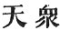

  
[Intangible Textual Heritage](../../index)  [Buddhism](../index) 
[Index](index)  [Previous](sbe1914)  [Next](sbe1916) 

------------------------------------------------------------------------

### VARGA 13. DEFEATS MÂRA.

The great *Ri*shi, of the royal tribe of *Ri*shis, beneath the Bodhi
tree firmly established, resolved by oath to perfect the way of complete
deliverance. . 1036

The spirits, Nâgas, and the heavenly multitude [1](#fn_389), all were filled with joy; but Mâra
Devarâ*g*a, enemy of religion, alone was grieved, and rejoiced not;
. 1037

Lord of the five desires [2](#fn_390), skilled
in all the arts of warfare, the foe of those who seek deliverance,
therefore his name is rightly given Pi*s*una [3](#fn_391). . 1038

Now this Mâra râ*g*a had three daughters, mincingly beautiful and of a
pleasant countenance, in every way fit by artful ways to enflame a man
with love, highest in this respect among the Devîs. . 1039

The first was named Yuh-yen (lust-pollution), the second Neng-yueh-*g*in
(able to delight a man),

p. 148

the third Ngai-loh [1](#fn_392) (love joy).
These three, at this time, advanced together, .
1040

And addressed their father Pi*s*una and said: 'May we not know the
trouble that afflicts you?' The father calming his feelings, addressed
his daughters thus: . 1041

'The world has now a great Muni, he has taken a strong oath as a helmet,
he holds a mighty bow in his hand, wisdom is the diamond shaft he uses,
. 1042

'His object is to get the mastery in the world, to ruin and destroy my
territory (domain); I am myself unequal to him, for all men will believe
in him, . 1043

'And all find refuge in the way of his salvation; then will my land be
desert and unoccupied. But as when a man transgresses the laws of
morality, his body (or, he himself) is then empty (i.e. unprotected),
. 1044

'So now, the eye of wisdom, not yet opened (in this man), whilst my
empire still has peace (quiet), I will go and overturn his purpose, and
break down and divide the ridge-pole (of his house) [2](#fn_393).' . 1045

Seizing then his bow and his five arrows, with all his retinue of male
and female attendants, he went to that grove of 'fortunate rest' with
the vow that the world (all flesh) should not find peace [3](#fn_394). . 1046

Then seeing the Muni, quiet and still (silent), preparing to cross the
sea of the three worlds, in his left hand grasping his bow, with his
right hand pointing his arrow, . 1047

p. 149

He addressed Bodhisattva and said: 'Kshatriya! rise up quickly! for you
may well fear! your death is at hand; you may practise your own
religious system [1](#fn_395), . 1048

'But let go this effort after the law of deliverance (for others); wage
warfare in the field of charity [2](#fn_396) as
a cause of merit, appease the tumultuous world, and so in the end reach
your reward in heaven; . 1049

'This is a way renowned and well established, in which former saints
(victors) have walked, *Ri*shis and kings and men of eminence; but this
system of penury and alms-begging is unworthy of you. . 1050

'Now then if you rise not, you had best consider with yourself, that if
you give not up your vow, and tempt me to let fly an
[arrow](errata.htm#1), . 1051

'How that Aila, grandchild of Soma [3](#fn_397), by one of these arrows just touched, as
by a fanning of the wind, lost his reason and became a madman; . 1052

'And how the *Ri*shi Vimala, practising austerities, hearing the sound
of one of these darts, his heart possessed by great fear, bewildered and
darkened he lost his true nature; . 1053

'How much less can you--a late-born one--hope to escape this dart of
mine. Quickly arise then! if hardly you may get away! . 1054

'This arrow full of rankling poison, fearfully insidious where it
strikes a foe! See now! with all my force, I point it! and are you
resting in the face of such calamity? .
1055

'How is it that you fear not this dread arrow? say! why do you not
tremble?' Mâra uttered such fear-inspiring threats, bent on overawing
Bodhisattva. . 1056

p. 150

But Bodhisattva's heart remained unmoved; no doubt, no fear was present.
Then Mâra instantly discharged his arrow, whilst the three women came in
front; . 1057

Bodhisattva regarded not the arrow, nor considered ought the women
three. Mâra râ*g*a now was troubled much with doubt, and muttered thus
'twixt heart and mouth: . 1058

'Long since the maiden of the snowy mountains, shooting at Mahe*s*vara,
constrained him to change his mind; and yet Bodhisattva is unmoved,
. 1059

'And heeds not even this dart of mine, nor the three heavenly women!
nought prevails to move his heart or raise one spark of love within him.
. 1060

'Now must I assemble my army-host, and press him sore by force;' having
thought thus awhile, Mâra's army suddenly assembled round; . 1061

Each (severally) assumed his own peculiar form; some were holding
spears, others grasping swords, others snatching up trees, others
wielding diamond maces; (thus were they) armed with every sort of
weapon; . 1062

Some had heads like hogs, others like fishes, others like asses, others
like horses; some with forms like snakes or like the ox or savage tiger;
lion-headed, dragon-headed, (and like) every other kind of beast; . 1063

Some had many heads on one body-trunk, with faces having but a single
eye, and then again with many eyes; some with great-bellied mighty
bodies, . 1064

And others thin and skinny, bellyless; others long-legged,
mighty-knee’d; others big-shanked

p. 151

and fat-calved; some with long and claw-like nails; . 1065

Some were headless, breastless, faceless; some with two feet and many
bodies; some with big faces looking every way; some pale and
ashy-coloured, . 1066

Others colour’d like the bright star rising, others steaming fiery
vapour, some with ears like elephants, with humps like mountains, some
with naked forms covered with hair, . 1067

Some with leather skins for clothing, their faces party-coloured,
crimson and white; some with tiger skins as robes, some with snake skins
over them, . 1068

Some with tinkling bells around their waists, others with twisted
screw-like hair, others with hair dishevelled covering the body, some
breath-suckers, . 1069

Others body-snatchers, some dancing and shrieking awhile, some jumping
onwards with their feet together, some striking one another as they
went, . 1070

Others waving (wheeling round) in the air, others flying and leaping
between the trees, others howling, or hooting, or screaming, or whining,
with their evil noises shaking the great earth; .
1071

Thus this wicked goblin troop encircled on its four sides the Bodhi
tree; some bent on tearing his body to pieces, others on devouring it
whole; . 1072

From the four sides flames belched forth, and fiery steam ascended up to
heaven; tempestuous winds arose on every side [1](#fn_398); the mountain forests shook and quaked;
. 1073

p. 152

Wind, fire, and steam, with dust combined, (produced) a pitchy darkness,
rendering all invisible. And now the Devas well affected to the law, and
all the Nâgas and the spirits (kwei-shin), .
1074

All incensed at this host of Mâra, with anger fired, wept tears of
blood; the great company of *S*uddhavâsa gods, beholding Mâra
tempting [1](#fn_399) Bodhisattva, . 1075

Free from low-feeling, with hearts undisturbed by passion, moved by pity
towards him and commiseration, came in a body to behold the Bodhisattva,
so calmly seated and so undisturbed, .
1076

Surrounded with an uncounted host of devils, shaking the heaven and
earth with sounds ill-omened. Bodhisattva silent and quiet in the midst
remained, his countenance as bright as heretofore, unchanged; . 1077

Like the great lion-king placed amongst all the beasts howling and
growling round him (so he sat), a sight unseen before, so strange and
wonderful! . 1078

The host of Mâra hastening, as arranged, each one exerting his utmost
force, taking each other's place in turns, threatening every moment to
destroy him, . 1079

Fiercely staring, grinning with their teeth, flying tumultuously,
bounding here and there; but Bodhisattva, silently beholding them,
(watched them) as one would watch the games of children; . 1080

And now the demon host waxed fiercer and more angry, and added force to
force, in further conflict; grasping at stones they could not lift, or
lifting them, they could not let them go; .
1081

p. 153

Their flying spears, lances, and javelins, stuck fast in space, refusing
to descend; the angry thunder-drops and mighty hail, with these, were
changed into five-colour’d lotus flowers, .
1082

Whilst the foul poison of the dragon snakes was turned to
spicy-breathing air. Thus all these countless sorts of creatures,
wishing to destroy the Bodhisattva, . 1083

Unable to remove him from the spot, were with their own weapons wounded.
Now Mâra had an aunt-attendant whose name was Ma-kia-ka-li (Mâha Kâlî?),
. 1084

Who held a skull-dish in her hands, and stood in front of Bodhisattva,
and with every kind of winsome gesture, tempted to lust the Bodhisattva.
. 1085

So all these followers of Mâra, possessed of every demon-body form,
united in discordant uproar, hoping to terrify Bodhisattva; . 1086

But not a hair of his was moved, and Mâra's host was filled with sorrow.
Then in the air the crowd of angels (spirits), their forms invisible,
raised their voices, saying: . 1087

'Behold the great Muni; his mind unmoved by any feeling of resentment,
whilst all that wicked Mâra race, besotted, are vainly bent on his
destruction; . 1088

'Let go your foul and murderous thoughts against that silent Muni,
calmly seated! You cannot with a breath move the Sumeru mountain; . 1089

'Fire may freeze, water may burn, the roughened earth may grow soft and
pliant, but ye cannot hurt the Bodhisattva! Thro’ ages past disciplined
by suffering, . 1090

Bodhisattva rightly trained in thought, ever

p. 154

advancing in the use of "means," pure and illustrious for wisdom, loving
and merciful to all, . 1091

'These four conspicuous (excellent) virtues cannot with him be rent
asunder, so as to make it hard or doubtful whether he gain the highest
wisdom. . 1092

'For as the thousand rays of yonder sun must drown the darkness of the
world, or as the boring wood must kindle fire, or as the earth deep-dug
gives water, . 1093

'So he who perseveres in the "right means," by seeking thus, will find.
The world without instruction, poisoned by lust and hate and ignorance,
. 1094

'Because he pitied "flesh," so circumstanced, he sought on their account
the joy of wisdom. Why then would you molest and hinder one who seeks to
banish sorrow from the world? . 1095

'The ignorance that everywhere prevails is due to false pernicious books
(sûtras), and therefore Bodhisattva, walking uprightly, would lead and
draw men after him. . 1096

'To obscure and blind the great world-leader, this undertaking is
impossible [1](#fn_400), for ’tis as though in
the Great Desert a man would purposely mislead the merchant-guide; . 1097

'So "all flesh" having fallen into darkness, ignorant of where they are
going, for their sakes he would light the lamp of wisdom; say then! why
would you extinguish it? . 1098

'All flesh engulphed and overwhelmed in the great sea of birth and
death, this one prepares the boat of wisdom; say then! why destroy and
sink it? . 1099

'Patience is the sprouting of religion, firmness

p. 155

its root, good conduct is the flower, the enlightened heart the boughs
and branches, . 1100

'Wisdom supreme the entire tree, the "transcendent law [1](#fn_401)" the fruit, its shade protects all
living things; say then! why would you cut it down? . 1101

'Lust, hate, and ignorance, (these are) the rack and bolt, the yoke
placed on the shoulder of the world; through ages long he has practised
austerities to rescue men from these their fetters, . 1102

'He now shall certainly attain his end, sitting on this
right-established throne; (seated) as all the previous Buddhas, firm and
compact like a diamond; . 1103

'Though all the earth were moved and shaken, yet would this place be
fixed and stable; him, thus fixed and well assured, think not that you
can overturn. . 1104

'Bring down and moderate your mind's desire, banish these high and
envious thoughts, prepare yourselves for right reflection, be patient in
your services.' . 1105

Mâra hearing these sounds in space, and seeing Bodhisattva still
unmoved, filled with fear and banishing his high and supercilious
thoughts, again took up his way to heaven above; . 1106

Whilst all his host (were scattered), o’erwhelmed with grief and
disappointment, fallen from their high estate, ’reft of their warrior
pride, their warlike weapons and accoutrements thrown heedlessly and
cast away 'mid woods and deserts. . 1107

Like as when some cruel chieftain slain, the hateful

p. 156

band is all dispersed and scattered, so the host of Mâra disconcerted,
fled away. The mind of Bodhisattva (now reposed) peaceful and quiet.
. 1108

The morning sun-beams brighten with the dawn, the dust-like mist
dispersing, disappears; the moon and stars pale their faint light, the
barriers of the night are all removed, .
1109

Whilst from above a fall of heavenly flowers pay their sweet tribute to
the Bodhisattva. 1110.

------------------------------------------------------------------------

### Footnotes

[147:1](sbe1915.htm#fr_389)  .

[147:2](sbe1915.htm#fr_390) I. e. king of
sensuality.

[147:3](sbe1915.htm#fr_391) The wicked one.

[148:1](sbe1915.htm#fr_392) See Childers, sub
Mâro, for the name of the daughters. In Sanskrit, Rati, Prîti, and
T*ri*sh*n*â.

[148:2](sbe1915.htm#fr_393) 'I will return to
the house . . . . , he findeth it swept and garnished, but empty.'

[148:3](sbe1915.htm#fr_394) Should not find
'rest.' There is a play on the word.

[149:1](sbe1915.htm#fr_395) Or, a system of
religion for yourself.

[149:2](sbe1915.htm#fr_396) Religious
almsgiving.

[149:3](sbe1915.htm#fr_397) Ai*d*a, the
grandson of Soma (i.e. Purûravas, the lover of Urva*s*î?).

[151:1](sbe1915.htm#fr_398) Kik for pien?

[152:1](sbe1915.htm#fr_399) Confusing.

[154:1](sbe1915.htm#fr_400) In the sense of
'not commendable.'

[155:1](sbe1915.htm#fr_401) Anuttara-dharma.

------------------------------------------------------------------------

[Next: Varga 14. O-Wei-San-Pou-Ti (Abhisambodhi)](sbe1916)
