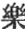
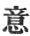

  
[Intangible Textual Heritage](../../index)  [Buddhism](../index) 
[Index](index)  [Previous](sbe1916)  [Next](sbe1918) 

------------------------------------------------------------------------

### VARGA 15. TURNING THE LAW-WHEEL [3](#fn_439).

Tathâgata piously composed and silent, radiant with glory, shedding
light around, with unmatched dignity advanced alone, as if surrounded by
a crowd of followers. . 1200

Beside the way he encountered a young Brahman [4](#fn_440), whose name was Upaka [5](#fn_441); struck [6](#fn_442) with the

p. 169

deportment of the Bhikshu, he stood with reverent mien on the road side;
. 1201

Joyously he gazed at such an unprecedented sight, and then, with closed
hands, he spake [1](#fn_443) as follows: 'The
crowds who live around are stained with sin, without a pleasing feature,
void of grace, . 1202

'And the great world's heart is everywhere disturbed; but you alone,
your senses all composed, with visage shining as the moon when full,
seem to have quaffed the water of the immortals' stream; . 1203

'The marks of beauty yours, as the great man's (Mahâpurusha); the
strength of wisdom, as an all-sufficient (independent) king's
(samrâ*g*); what you have done must have been wisely done, what then
your noble tribe and who your master?' .
1204

Answering he said, 'I have no master; no honourable tribe; no point of
excellence [2](#fn_444); self-taught in this
profoundest doctrine, I have arrived at superhuman wisdom [3](#fn_445). . 1205

'That which behoves the world to learn, but through the world no learner
found, I now myself

p. 170

and by myself [1](#fn_446) have learned
throughout; ’tis rightly called Sambodhi (*k*ing kioh); . 1206

'That hateful family of griefs the sword of wisdom has destroyed; this
then is what the world has named, and rightly named, the "chiefest
victory." . 1207

'Through all Benares soon will sound the drum of life, no stay is
possible--I have no name [2](#fn_447)--nor do I
seek profit or pleasure, . 1208

'But simply to declare the truth; to save men (living things) from pain,
and to fulfil my ancient oath, to rescue all not yet delivered. . 1209

'The fruit of this my oath is ripened now, and I will follow out my
ancient vow. Wealth, riches, self all given up, unnamed, I still am
named "Righteous Master [3](#fn_448)." . 1210

'And bringing profit to the world (empire), I also have the name "Great
Teacher [4](#fn_449);" facing sorrows, not
swallowed up by them, am I not rightly called Courageous Warrior? . 1211

'If not a healer of diseases, what means the name of Good Physician?
seeing the wanderer, not showing him the way, why then should I be
called "Good Master-guide?" . 1212

'Like as the lamp shines in the dark, without a

p. 171

purpose of its own, self-radiant, so burns the lamp of the Tathâgata,
without the shadow of a personal feeling. .
1213

'Bore wood in wood, there must be fire; the wind blows of its own free
self in space; dig deep and you will come to water; this is the rule of
self-causation. . 1214

'All the Munis who perfect wisdom, must do so at Gayâ; and in the Kâ*s*i
country they must first turn the Wheel of Righteousness.' . 1215

The young Brahman Upâka, astonished, breathed the praise of such strange
doctrine [1](#fn_450), and called to mind like
thoughts he had before experienced [2](#fn_451); lost in thought at the wonderful
occurrence, . 1216

At every turning of the road he stopped to think; embarrassed in every
step he took. Tathâgata proceeding slowly onwards, came to the city of
Kâ*s*i, . 1217

The land so excellently adorned as the palace of *S*akradevendra; the
Ganges and Bara*n*â [3](#fn_452), two twin
rivers flowed amidst; . 1218

The woods and flowers and fruits so verdant, the peaceful cattle
wandering together, the calm retreats

p. 172

free from vulgar noise, such was the place where the old *Ri*shis dwelt.
. 1219

Tathâgata glorious and radiant, redoubled the brightness of the place;
the son of the Kau*nd*inya tribe (Kau*nd*inya-kulaputra), and next
Da*s*abalakâ*s*yapa, . 1220

And the third Vâshpa, the fourth A*s*va*g*it, the fifth called Bhadra,
practising austerities as hermits, . 1221

Seeing from far Tathâgata approaching, sitting together all engaged in
conversation, (said), 'This Gautama, defiled by worldly indulgence,
leaving the practice of austerities, .
1222

'Now comes again to find us here, let us be careful not to rise in
salutation, nor let us greet him when he comes, nor offer him the
customary refreshments; . 1223

'Because he has broken his first vow, he has no claim to hospitality;'
\[for men on seeing an approaching guest by rights prepare things for
his present and his after wants, . 1224

They arrange a proper resting-couch, and take on themselves care for his
comfort.\] [1](#fn_453) Having spoken thus and
so agreed, each kept his seat, resolved and fixed. . 1225

And now Tathâgata slowly approached, when, to! these men unconsciously,
against their vow, rose and invited him to take a seat; offering to take
his, robe and Pâtra, . 1226

They begged to wash and rub his feet, and asked him what he required
more; thus in everything attentive, they honour’d him and offered all to
him as teacher. . 1227

They did not not cease however to address him

p. 173

still as Gautama, after his family [1](#fn_454). Then spake the Lord to them and said:
'Call me not after my private name, . 1228

'For it is a rude and careless way of speaking to one who has obtained
Arhatship [2](#fn_455); but whether men respect
or disrespect me, my mind is undisturbed and wholly quiet; . 1229

'But you [3](#fn_456)--your way is not so
courteous, let go, I pray, and cast away your fault. Buddha can save the
world; they call him, therefore, Buddha; .
1230

'Towards all living things, with equal heart he looks as children, to
call him then by his familiar name is to despise a father; this is
sin [4](#fn_457).' .
1231

Thus Buddha, by exercise of mighty love, in deep compassion spoke to
them; but they, from ignorance and pride, despised the only wise [5](#fn_458) and true one's words. . 1232

They said that first he practised self-denial, but having reached
thereby no profit, now giving rein to body, word, and thought [6](#fn_459), how by these means (they asked) has he
become a Buddha? . 1233

Thus equally entangled by doubts, they would not credit that he had
attained the way. Thoroughly versed in highest truth, full of
all-embracing wisdom, . 1234

p. 174

Tathâgata on their account briefly declared to them the one true way;
the foolish masters practising austerities, and those who love to
gratify their senses, . 1235

He pointed out to them these two distinctive classes [1](#fn_460), and how both greatly erred. 'Neither of
these (he said) has found the way of highest wisdom, nor are their ways
of life productive of true rescue. 1236.

'The emaciated devotee by suffering produces in himself confused and
sickly thoughts, not conducive even to worldly knowledge, how much less
to triumph over sense! . 1237

'For he who tries to light a lamp with water, will not succeed in
scattering the darkness, (and so the man who tries) with worn-out body
to trim the lamp of wisdom shall not succeed, nor yet destroy his
ignorance or folly. . 1238

'Who seeks with rotten wood to evoke the fire will waste his labour and
get nothing for it; but boring hard wood into hard, the man of skill
forthwith gets fire for his use; . 1239

'In seeking wisdom then it is not by these austerities a man may reach
the law of life. But (likewise) to indulge in pleasure is opposed to
right, this is the fool's barrier against wisdom's light; . 1240

'The sensualist cannot comprehend the Sûtras or the *S*âstras, how much
less the way of overcoming all desire! As some man grievously afflicted
eats food not fit to eat, . 1241

'And so in ignorance aggravates his sickness, so

p. 175

how can he get rid of lust who pampers lust? Scatter the fire amid the
desert grass, dried by the sun, fanned by the wind, . 1242

'The raging flames who shall extinguish? Such is the fire of
covetousness and lust (or, hankering lust), I, then, reject both these
extremes, my heart keeps in the middle way. .
1243

'All sorrow at an end and finished, I rest at peace, all error put away;
my true sight [1](#fn_461) greater than the
glory of the sun, my equal and unvarying wisdom [2](#fn_462), vehicle of insight, . 1244

'Right words [3](#fn_463) as it were a
dwelling-place, wandering through the pleasant groves of right
conduct [4](#fn_464), making a right life [5](#fn_465) my recreation, walking along the right
road of proper means [6](#fn_466), . 1245

'My city of refuge in right recollection [7](#fn_467), and my sleeping couch right
meditation [8](#fn_468); these are the eight
even and level roads [9](#fn_469) by which to
avoid the sorrows of birth and death; .1246

'Those who come forth by these means from the slough, doing thus, have
attained the end; such shall fall neither on this side or the other,
amidst the sorrow-crowd of the two periods [10](#fn_470). . 1247

'The tangled sorrow-web of the three worlds by this road alone can be
destroyed; this is my own way, unheard of before; by the pure eyes of
the true law, . 1248

p. 176

'Impartially seeing the way of escape, I, only I, now first make known
this way; thus I destroy the hateful company of T*ri*sh*n*â's [1](#fn_471) host, the sorrows of birth and death,
old age, disease, . 1249

'And all the unfruitful aims of men, and other springs of suffering.
There are those who warring against desire are still influenced by
desire; who whilst possessed of body, act as tho’ they had none; . 1250

'Who put away from themselves all sources of true merit, briefly will I
recount their sorrowful lot. Like smothering a raging fire, though
carefully put out, yet a spark left, .
1251

'So in their abstraction, still the germ of "I [2](#fn_472)," the source [3](#fn_473) of great sorrow still surviving,
perpetuates the suffering caused by lust (t*ri*sh*n*â), and the evil
consequences of every kind of deed survive; .
1252

'These are the sources of further pain, but let these go and sorrow
dies, even as the seed of corn taken from the earth and deprived of
water dies; . 1253

'The concurrent causes not uniting, then the bud and leaf cannot be
born; the intricate bonds of every kind of existence, from the Deva down
to the evil ways of birth, . 1254

'Ever revolve and never cease; all this is produced from covetous
desire; falling from a high estate to lower ones, all is the fault of
previous deeds; . 1255

'But destroy the seed of covetousness and the rest, then there will be
no intricate binding, but all

p. 177

effect of deeds destroyed, the various degrees of sorrow then will end
for good; . 1256

'Having this, then, we must inherit that; destroying this, then that is
ended too; no birth, old age, disease, or death; no earth, or water,
fire, or wind; . 1257

'No beginning, end, or middle; and no deceptive systems of philosophy;
this is the standpoint of wise men and sages; the certain and exhausted
termination, (complete Nirvâ*n*a). . 1258

'Such do the eight right ways declare; this one expedient has no
remains; that which the world sees not, engrossed by error (I declare),
. 1259

'I know the way to sever all these sorrow-sources; the way to end them
is by right reason, meditating on these four highest truths, following
and perfecting this highest wisdom. . 1260

'This is what means the "knowing" sorrow; this is to cut off the cause
of all remains of being; these destroyed, then all striving, too, has
ended, the eight right ways have been assayed. .
1261

'(Thus, too), the four great truths have been acquired, the eyes of the
pure law completed. In these four truths, the equal (i.e. true or right)
eyes not yet born, . 1262

'There is not mention made of gaining true deliverance, it is not said
what must be done is done, nor that all (is finished), nor that the
perfect truth has been acquired. . 1263

'But now because the truth is known, then by myself is known
"deliverance gained," by myself is known that "all is done," by myself
is known "the highest wisdom."' . 1264

And having spoken thus respecting truth, the

p. 178

member of the Kau*nd*inya family, and eighty thou-sand of the Deva host,
were thoroughly imbued with saving knowledge; .
1265

They put away defilement from themselves, they got the eyes of the pure
law; Devas and earthly masters thus were sure, that what was to be done
was done. . 1266

And now with lion-voice he joyfully enquired, and asked Kau*nd*inya,
'Knowest thou yet?' Kau*nd*inya forthwith answered Buddha, 'I know the
mighty master's law;' . 1267

And for this reason, knowing it, his name was Â*gñ*âta Kau*nd*inya
(â*gñ*âta, known). Amongst all the disciples of Buddha, he was the very
first in understanding. . 1268

Then as he understood the sounds of the true law, hearing (the words of)
the disciple--all the earth spirits together raised a shout triumphant,
'Well done! deeply seeing (the principles of) the law, . 1269

'Tathâgata, on this auspicious day, has set revolving that which never
yet revolved, and far and wide, for gods and men, has opened the gates
of immortality [1](#fn_474). . 1270

'(Of this wheel) the spokes are the rules of pure conduct; equal
contemplation, their uniformity of length; firm wisdom is the tire;
modesty and thoughtfulness, the rubbers (sockets in the nave in which
the axle is fixed); . 1271

'Right reflection is the nave; the wheel itself the law of perfect
truth; the right truth now

p. 179

has gone forth in the world, not to retire before another teacher.'
. 1272

Thus the earth spirits shouted, the spirits of the air took up the
strain, the Devas all joined in the hymn of praise, up to the highest
Brahma heaven. . 1273

The Devas of the triple world, now hearing what the great *Ri*shi
taught, in intercourse together spoke, 'The widely-honoured Buddha moves
the world! . 1274

'Wide-spread, for the sake of all that lives, he turns the wheel of the
law of complete purity'' The stormy winds, the clouds, the mists, all
disappeared; down from space the heavenly flowers descended; . 1275

The Devas revelled in their joys celestial, filled with unutterable
gladness. . 1276

------------------------------------------------------------------------

### Footnotes

[168:3](sbe1917.htm#fr_439) Concerning this
expression, which means 'establishing the dominion of truth,' see
Childers, Pâli Dict., sub voce pavatteti.

[168:4](sbe1917.htm#fr_440) A Brahma*k*ârin, a
religious student, one who was practising a life of purity.

[168:5](sbe1917.htm#fr_441) Called 'Upagana' by
Burnouf (Introd. p. 389), and in the Lalita Vistara an Âgîvaka (hermit),
(Foucaux, 378). For some useful remarks on this person's character, see
Études Buddhiques (Leon Féer), pp. 15, 16, 17.

[168:6](sbe1917.htm#fr_442) So I construe
'*k*ih *k*i;' it means 'taken by,' or 'attracted by' the demeanour of
the mendicant (Bhikshu). This incident is introduced as the first
instance of Buddha's mendicant life and its influence on others.

[169:1](sbe1917.htm#fr_443) Or, 'he questioned
thus.'

[169:2](sbe1917.htm#fr_444) 'Nothing that has
been conquered.'

[169:3](sbe1917.htm#fr_445) I have attained to
that which man has not attained. That is, I have arrived at superhuman
wisdom. It appears to me that this point in Buddha's history is a key to
the whole system of his religion. He professes to have grasped absolute
truth (the word 'absolute' corresponds with 'unfettered'); and by
letting go the finite, with its limitations and defilements, to have
passed into the free, boundless, unattached infinite.

[170:1](sbe1917.htm#fr_446) This assertion is a
fundamental one (see Mr. Rhys Davids' Dhamma-*k*akka-ppavattana-sutta,
Sacred Books of the East, vol. xi, throughout); so that Buddha disclaims
any revelation in the sense of the result of a higher wisdom than his
own. The cloud, in fact, of sin moved away, the indwelling of light, by
itself, revealed itself.

[170:2](sbe1917.htm#fr_447) 'I am a voice.'

[170:3](sbe1917.htm#fr_448) (Called by the)
not-called name, 'Master of righteousness.'

[170:4](sbe1917.htm#fr_449) Here follow a list
of names applied to Tathâgata in virtue of his office. He gives up his
name Gautama, and claims to be known only by his religious titles.

[171:1](sbe1917.htm#fr_450) Sighed 'oh!' and
praised in under tone the strange behaviour of Tathâgata.

[171:2](sbe1917.htm#fr_451) Or perhaps the
following translation is better: 'following in mind the circumstances
which led to the strange encounter.'

[171:3](sbe1917.htm#fr_452) The account in the
text makes the city of Benares to be between the Ganges and the Bara*n*â
or Vara*n*â; General Cunning-ham (Archæolog. Report, vol. i, p. 104)
says, 'The city of Benares is situated on the left bank, of the Ganges,
between the Barnâ Nadi on the north-east and the Asi Nâla on the
south-west. The Barnâ is a considerable rivulet which rises to the north
of Allahabad, and has a course of about 100 miles. The Asi is a mere
brook of no length.'

[172:1](sbe1917.htm#fr_453) This \[ \] seems to
be parenthetical.

[173:1](sbe1917.htm#fr_454) The address 'Bho
Gotama' or 'Gotama,' according to Childers (Pâli Dict. p. 150), was an
appellation of disrespect used by unconverted Brahmins in addressing
Buddha. The title Gautama Buddha is rarely met with in Northern
translations.

[173:2](sbe1917.htm#fr_455) The Arhat is the
highest grade among the Buddhist saints. See Burnouf, Introd. p. 295.

[173:3](sbe1917.htm#fr_456) Here the appeal is
to them as religious persons.

[173:4](sbe1917.htm#fr_457) Or, is the sin of
dishonouring a father.

[173:5](sbe1917.htm#fr_458) The true words of
the Only Enlightened; that is, of the Buddha.

[173:6](sbe1917.htm#fr_459)   for  .

[174:1](sbe1917.htm#fr_460) The two extremes.

[175:1](sbe1917.htm#fr_461) Samyag d*ri*sh*t*i.

[175:2](sbe1917.htm#fr_462) Samyak sa*m*kalpa.

[175:3](sbe1917.htm#fr_463) Samyag vâ*k*.

[175:4](sbe1917.htm#fr_464) Samyak karma.

[175:5](sbe1917.htm#fr_465) Samyag â*g*îva.

[175:6](sbe1917.htm#fr_466) Samyag vyâyâma.

[175:7](sbe1917.htm#fr_467) Samyak sm*ri*ti.

[175:8](sbe1917.htm#fr_468) Samyak samâdhi.

[175:9](sbe1917.htm#fr_469) The right roads
(orthodox ways).

[175:10](sbe1917.htm#fr_470) Or rather, of the
'two ages;' this age and the next.

[176:1](sbe1917.htm#fr_471) For some account of
T*ri*sh*n*â, Pâli Ta*n*ha, see Rhys Davids (op. cit.), p. 149 note.

[176:2](sbe1917.htm#fr_472) The germ of self;
that is, of individual existence.

[176:3](sbe1917.htm#fr_473) Having the nature
of great sorrow.

[178:1](sbe1917.htm#fr_474) The way or gate of
sweet dew.

------------------------------------------------------------------------

[Next: Varga 16. Bimbisâra Râ*g*a Becomes A Disciple](sbe1918)
