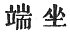

  
[Intangible Textual Heritage](../../index)  [Buddhism](../index) 
[Index](index)  [Previous](sbe1924)  [Next](sbe1926) 

------------------------------------------------------------------------

p. 257

# KIOUEN V.

### VARGA 23. BY SPIRITUAL POWER FIXING HIS (TERM OF) YEARS [1](#fn_692).

At this time the great men among the Li*kkh*avis [2](#fn_693), hearing that the lord of the world had
entered their country and was located in the Âmra garden, . 1783

(Went thither) riding in their gaudy chariots with silken canopies and
clothed in gorgeous robes, both blue and red and yellow and white, each
one with his own cognizance. . 1784

Accompanied by their body guard surrounding them, they went; others
prepared the road in front; and with their heavenly crowns and
flower-bespangled robes (they rode), richly dight with every kind of
costly ornament. . 1785

Their noble forms resplendent increased the glory of that garden grove;
now taking off the five distinctive

p. 258

ornaments [1](#fn_694), alighting from their
chariots, they advanced afoot. . 1786

Slowly thus with bated breath, their bodies reverent (they advanced).
Then they bowed down and worshipped Buddha's foot [2](#fn_695), and, a great multitude, they gathered
round the lord, shining as the sun's disc, full of radiance. . 1787

(There was) the lion Li*kkh*avi [3](#fn_696),
among the Li*kkh*avis the senior, his noble form (bold) as the lion's,
standing there with lion eyes, . 1788

But without the lion's pride, taught by the *S*âkya lion [4](#fn_697) (who thus began): 'Great and illustrious
personages, famed as a tribe for grace and comeliness! . 1789

'Put aside, I pray, the world's high thoughts, and now accept the
abounding lustre [5](#fn_698) of religious
teaching. Wealth and beauty, scented flowers and ornaments like these,
are not to be compared for grace with moral rectitude! . 1790

p. 259

'Your land productive and in peaceful quiet--this is your great renown;
but true gracefulness of body, and a happy people depend upon the heart
well-governed. . 1791

'Add but to this a reverent (joyful) feeling for religion, then (a
people's) fame is at its height! a fertile land and all the dwellers in
it, as a united body, virtuous [1](#fn_699)!
. 1792

'To-day then learn this virtue [2](#fn_700),
cherish with carefulness the people, lead them as a body in the right
way of rectitude [3](#fn_701), even as the
ox-king leads the way across the river-ford. .
1793

'If a man with earnest recollection ponder on things of this world and
the next, he will consider how by right behaviour [4](#fn_702) (right morals) he prepares, as the
result of merit, rest in either world. .
1794

'For all in this world will exceedingly revere him, his fame will spread
abroad through every part, the virtuous will rejoice to call him friend,
and the outflowings of his goodness will know no bounds for ever. . 1795

'The precious gems found in the desert wilds are all from earth
engendered; moral conduct, likewise, as the earth, is the great source
of all that is good [5](#fn_703). . 1796

p. 260

'By this, without the use of wings, we fly through space, we cross the
river needing not a handy boat; but without this a man will find it hard
indeed to cross (the stream of) sorrow (or, stay the rush of sorrow).
. 1797

'As when a tree with lovely flowers and fruit, pierced by some sharp
instrument, is hard to climb, so is it with the much-renowned for
strength and beauty, who break through the laws of moral rectitude!
. 1798

'Sitting upright in the royal palace (the palace of the conqueror) the
heart of the king was grave and majestic [1](#fn_704); with a view to gain the merit of a pure
and moral life, he became a convert of a great *Ri*shi. . 1799

'With garments dyed and clad with hair, shaved, save one spiral
knot [2](#fn_705) (he led a hermit's life),
but, as he did not rule himself with strict morality, he was immersed in
suffering and sorrow. . 1800

'Each morn and eve he used the three ablutions, sacrificed to fire and
practised strict austerity, let his body be in filth as the brute beast,
passed through fire and water, dwelt amidst the craggy rocks, . 1801

'Inhaled the wind, drank from the Ganges' stream, controlled himself
with bitter fasts--but all! far short of moral rectitude [3](#fn_706). . 1802

p. 261

'For though a man inure himself to live as any brute, he is not on that
account a vessel of the righteous law [1](#fn_707); whilst he who breaks the laws of right
behaviour invites detraction, and is one no virtuous man can love; . 1803

'His heart is ever filled (ever cherishes) with boding fear, his evil
name pursues him as a shadow. Having neither profit nor advantage in
this world, how can he in the next world reap content (rest)? . 1804

'Therefore the wise man ought to practise pure behaviour (morals);
passing through the wilderness of birth and death, pure conduct is to
him a virtuous guide. . 1805

'From pure behaviour comes self-power, which frees a man from (many)
dangers; pure conduct, like a ladder, enables us to climb to heaven.
. 1806

'Those who found themselves on right behaviour, cut off the source of
pain and grief; but they who by transgression destroy this mind, may
mourn the loss of every virtuous principle. .
1807

'(To gain this end) [2](#fn_708) first banish
every ground of

p. 262

\[paragraph continues\] "self;" this
thought of "self" shades every lofty (good) aim, even as the ashes that
conceal the fire, treading on which the foot is burned. . 1808

'Pride and indifference shroud this heart, too, as the sun is obscured
by the piled-up clouds; supercilious thoughts root out all modesty of
mind, and sorrow saps the strongest will. .
1809

'(As) age and disease waste youthful beauty, (so) pride of self destroys
all virtue; the Devas and Asuras, thus from jealousy and envy, raised
mutual strife. . 1810

'The loss of virtue and of merit which we mourn proceeds from "pride of
self," throughout; and as I am a conqueror (*G*ina) amid
conquerors [1](#fn_709), so he who (they who)
conquers self, is one with me. . 1811

'He who little cares to conquer self, is but a foolish master; beauty
(or, earthly things), family renown (and such things), all are utterly
inconstant, and what is changeable can give no rest of interval  [2](#fn_710). . 1812

p. 263

'If in the end the law of entire destruction (is exacted) what use is
there in indolence and pride? Covetous desire (lust) is the greatest
(source of) sorrow, appearing as a friend in secret ’tis our enemy.
. 1813

'As a fierce fire excited from within (a house), so is the fire of
covetous desire: the burning flame of covetous desire is fiercer far
than fire which burns the world (world-fire). .
1814

'For fire may be put out by water in excess, but what can overpower the
fire of lust? The fire which fiercely burns the desert grass (dies out),
and then the grass will grow again; . 1815

'But when the fire of lust burns up the heart, then how hard for true
religion there to dwell! for lust seeks worldly pleasures, these
pleasures add to an impure karman [1](#fn_711);
. 1816

'By this evil karman a man falls into perdition (evil way), and so there
is no greater enemy to man than lust. Lusting, man gives way to amorous
indulgence (lit. "lust, then it brings forth love"), by this he is led
to practise (indulge in) every kind of lustful longing; . 1817

'Indulging thus, he gathers frequent sorrow (all sorrow, or accumulated
sorrow, referring to the second of the "four truths"). No greater evil
(excessive evil) is there than lust. Lust is a dire disease, and the
foolish master stops (i.e. neglects) the medicine of wisdom. . 1818

'(The study of) heretical books not leading to

p. 264

right thought, causes the lustful heart to increase and grow, for these
books are not correct (pure) on the points of impermanency, the
non-existence of self, and any object (ground) for "self [1](#fn_712)." . 1819

'But a true and right apprehension through the power of wisdom, is
effectual to destroy that false desire (heretical longing), and
therefore our object (aim or purpose) should be to practise this true
apprehension. . 1820

'Right apprehension (views) once produced then there is deliverance from
covetous desire, for a false estimate of excellency produces a covetous
desire to excel, whilst a false view of demerit produces anger (and
regret); . 1821

'But the idea of excelling and also of inferiority (in the sense of
demerit) both destroyed, the desire to excel and also anger (on account
of inferiority) are destroyed. Anger! how it changes the comely face,
how it destroys the loveliness of beauty! .
1822

'Anger dulls (clouds) the brightness of the eye (or, the bright eye),
chokes all desire to hear the principles of truth, cuts and divides the
principle of family affection, impoverishes and weakens every worldly
aim [2](#fn_713). .
1823

p. 265

'Therefore let anger be subdued, yield not (a moment) to the angry
impulse (heart); he who can hold his wild and angry heart is well
entitled "illustrious charioteer." . 1824

'For men call such a one "illustrious team-breaker [1](#fn_714)" (who can) with bands restrain the
unbroken steed; so anger not subdued, its fire unquenched, the sorrow of
repentance burns like fire. . 1825

'A man who allows wild passion to arise within, himself first burns his
heart, then after burning adds the wind [2](#fn_715) thereto which ignites the fire again, or
not (as the case may be) [3](#fn_716). . 1826

'The pain of birth, old age, disease, and death press heavily upon the
world, but adding "passion" to the score, what is this but to increase
our foes when pressed by foes? . 1827

'But rather, seeing how the world is pressed by throngs of grief, we
ought to encourage in us love [4](#fn_717) (a
loving heart), and as the world (all flesh) produces grief on grief, so
should we add as antidotes unnumbered remedies.' . 1828

Tathâgata, illustrious in expedients, according to

p. 266

the disease, thus briefly spoke; even as a good physician in the world,
according to the disease, prescribes his medicine. . 1829

And now the Li*kkh*avis, hearing the sermon preached by Buddha, arose
forthwith and bowed at Buddha's feet, and joyfully they placed them on
their heads [1](#fn_718). . 1830

Then they asked both Buddha and the congregation on the morrow to accept
their poor religious offerings. But Buddha told them that already Âmrâ
(the lady) had invited him. . 1831

On this the Li*kkh*avis, harbouring thoughts of pride and
disappointment [2](#fn_719), (said): 'Why
should that one take away our profit?' But, knowing Buddha's heart to be
impartial and fair, they once again regained their cheerfulness. . 1832

Tathâgata, moreover, nobly (virtuously or illustriously) seizing the
occasion (or, following the right plan), appeasing them, produced within
a joyful heart; and so subdued, their grandeur of appearance came again,
as when a snake subdued by charms glistens with shining skin. . 1833

And now, the night being passed, the signs of dawn appearing, Buddha and
the great assembly go to the abode of Âmrâ, and having received her
entertainment, . 1834

They went on to the village of Pi-nau [3](#fn_720) (Beluva),

p. 267

and there he rested during the rainy season; the three months' rest
being ended, again he returned to Vai*s*âlî, .
1835

And dwelt beside the Monkey [1](#fn_721) Tank;
sitting there in a shady grove, he shed a flood of glory from his
person; aroused thereby, Mâra Pi*s*una .
1836

Came to the place where Buddha was, and with closed palms [2](#fn_722) exhorted him thus: 'Formerly, beside the
'Naira*ñg*anâ river, when you had accomplished your true and steadfast
aim, . 1837

(You said), "When I have done all I have to do, then will I pass at once
to Nirvâ*n*a;" and now you have done all you have to do, you should, as
then you said, pass to Nirvâ*n*a: . 1838

Then Buddha spake to Pi*s*una [3](#fn_723):
'The time of my complete deliverance is at hand, but let three months
elapse, and I shall reach Nirvâ*n*a.' .
1839

Then Mâra, knowing that Tathâgata had fixed the time for his
emancipation, his earnest wish being thus fulfilled, joyous returned to
his abode in heaven [4](#fn_724). . 1840

p. 268

Tathâgata, seated beneath a tree, straightway was lost in ecstasy, and
willingly rejected his allotted years, and by his spiritual power fixed
the remnant of his life. . 1841

On this, Tathâgata thus giving up his years, the great earth shook and
quaked through all the limits of the universe; great flames of fire were
seen around, . 1842

The tops of Sumeru were shaken (fell), from heaven there rained showers
of flying stones, a whirling tempest rose on every side, the trees were
rooted up and fell, . 1843

Heavenly music rose with plaintive notes, whilst angels for a time were
joyless. Buddha rising from out his ecstasy, announced to all the world:
. 1844

'Now have I given up my term of years; I live henceforth by power of
Samâdhi [1](#fn_725) (faith); my body like a
broken chariot stands, no further cause of "coming" or of "going;" . 1845

'Completely freed from the three worlds, I go enfranchised, as a chicken
from its egg.' . 1846

------------------------------------------------------------------------

### Footnotes

[257:1](sbe1925.htm#fr_692) This title may also
be rendered, 'By spiritual power stopping his years of life.' It
probably refers to the incident related by Mr. Rhys Davids (Sacred Books
of the East, vol. xi, p. 35), 'Let me now, by a strong effort of the
will, bend this sickness down and keep my hold on life till the allotted
time be come.' There is no mention, however, in the text of Buddha's
sickness, which caused the determination here referred to. The sickness
is mentioned in the Chinese copy of the Parinirvâ*n*a Sutra, which in
the main agrees with the Pâli.

[257:2](sbe1925.htm#fr_693) The Li*kkh*avis
were residents of Vai*s*âlî. I have shown else-where (Journal of the R.
A. S., Jan. 1882) that they were probably of Scythic origin. The account
given in the text of their gorgeous chariots, cognizances, &c. is quite
in keeping with the customs of the Northern nations. The account given
in the Mahâ-parinibbâna-Sutta is in agreement with the text (Sacred
Books of the East, vol. xi, p. 31).

[258:1](sbe1925.htm#fr_694) These five
distinctive ornaments were, probably, crowns, earrings, necklets,
armlets, and sandals.

[258:2](sbe1925.htm#fr_695) The worship of the
foot of Buddha is exemplified in many of the plates of the Sanchi and
Amarâvatî sculptures, where we see worshippers adoring the impression of
his foot on the stool before the throne (plates lxxi, &c.)

[258:3](sbe1925.htm#fr_696) This and following
lines are somewhat obscure, as it is not plain whether the reference is
to one, or all the Li*kkh*avis. I have preferred to refer it to one of
them, the chief or leader; for so we read in Spence Hardy's Manual, p.
282 'A number of the Lichawi princes then went to the king (i.e. the
chief of their tribe), whose name was Maha-li.' It would seem as if 'li'
were a component part of the name Li*kkh*avi, and meant 'a lion,'--the
chief would then be 'the great lion.' Compare the root 'ur' in the
Assyrian urmakh, 'great lion;' and the Hebrew layish, 'a great or strong
lion.'

[258:4](sbe1925.htm#fr_697) The *S*âkya lion
was Buddha, the lion of the *S*âkyas (*S*âkyasi*m*ha).

[258:5](sbe1925.htm#fr_698) The 'abounding
lustre,' that is, the additional glory or lustre of religion. The sermon
appears to be addressed principally against pride of person, and anger.

[259:1](sbe1925.htm#fr_699) Much of this
discourse seems to refer to the fertility of the land occupied by these
Li*kkh*avis in the valley of the Ganges, and to their good rules of
government. The character of their government is alluded to in pp. 3, 4,
Sacred Books of the East, vol. xi.

[259:2](sbe1925.htm#fr_700) The symbol 'tih,'
which I have translated by 'virtue,' means 'quality' (gu*n*a) or
'lustre' (te*g*as).

[259:3](sbe1925.htm#fr_701) The literal
rendering of this line is 'lead the body of them all in the clear and
right (path).'

[259:4](sbe1925.htm#fr_702) Right behaviour,
right morality, here refer to the Buddhist rules of right conduct
(*s*îla).

[259:5](sbe1925.htm#fr_703) All that is
illustrious (shen).

[260:1](sbe1925.htm#fr_704) This line is
difficult; I was prepared to regard 
 as a proper name. Dr. Legge, however, has kindly
suggested the translation in the text. But who is the king referred to?

[260:2](sbe1925.htm#fr_705) The spiral knot of
hair may be seen in many of the sculptures (e. g. plate lxx, Tree and
Serpent Worship).

[260:3](sbe1925.htm#fr_706) This is a free
rendering; I have supposed that the description throughout refers to the
'king' alluded to above; this line may mean, '(he did all this) having
put aside right morals.'

[261:1](sbe1925.htm#fr_707) A vessel of
righteousness.

[261:2](sbe1925.htm#fr_708) I have supplied
this, although the sentence would make complete sense without it. In the
context 'every ground of self' (’ngo sho) seems to refer to the aim
after selfish ends. The sermon from this point refers to 'pride of
self,' and its evil consequences; in the latter portion he joins hatred
or anger with pride; the whole reminds us of Milton's description:

         'Round he throws his baleful eyes  
That witnessed huge affliction and dismay  
Mixed with obdurate pride and steadfast hate.'  
                                 Paradise Lost, I; 57, 58.

\[paragraph continues\] Whilst the war of
Devas and Asuras is just Milton's idea when he says, p. 262

                           'Storming fury rose  
And clamour, such as heard in heaven till now  
Was never.'  
                                     Ibid. VI, 207-209.

[262:1](sbe1925.htm#fr_709) Here there is
allusion to Buddha's name 'Deva among Devas.' The construction of these
sentences is obscure on account of the varied use of the word 'I'
('ngo); this symbol is used sometimes, as in the line under present
consideration, as a pronoun, but in the next line it means the evil
principle of 'self.' I have found it difficult to avoid comparing this
use of the word 'I,' meaning the 'evil self,' with the phrase the
'carnal mind.' The question, in fact, is an open one, whether the
Buddhist teaching respecting the non-existence of 'I,' i.e. a personal
self or soul, may not justly be explained as consisting in the denial of
the reality of the 'carnal self.'

[262:2](sbe1925.htm#fr_710) I should like to
translate it no 'interval of rest,' but it seems to p. 263 mean the only rest given is momentary, no
rest from interval, i.e. constant change.

[263:1](sbe1925.htm#fr_711) The impure karma'
is, of course, the power of evil (in the character) to bring about
suffering by an evil birth.

[264:1](sbe1925.htm#fr_712) The meaning is,
that heretical books, i.e. books of the Brahmans and so on, teach no
sound doctrine as to the unreality of the world, the non-existence of a
'personal self,' and the impropriety of any personal selfish aim, and
therefore not teaching these, men who follow them are taken up with the
idea that there is reality in worldly pleasures, that there is a
personal self capable of enjoying them, and that the aim after such
enjoyment is a right aim. All this Buddha and his doctrine exclude.

[264:2](sbe1925.htm#fr_713) I am not sure
whether this is a right translation, it appears rather to contradict
Buddha's teaching about the unreality of the world; literally the line
is this, 'it makes the world what is light and poor.'

[265:1](sbe1925.htm#fr_714) This expression and
that in the verse preceding is allied to the Pâli purisadammasârathi,
'trainer or breaker-in of the human steer,' the unconverted man being
(as Childers says, Dict. sub voce puriso) like to a refractory bullock.
In the Northern books the comparison generally refers to a 'breaker-in
of horses,' derived doubtless from the associations of the Northern
people (converts to Buddhism), who excelled in chariot racing.

[265:2](sbe1925.htm#fr_715) The wind of
repentance, the frequent 'sighs' and moans of penitence.

[265:3](sbe1925.htm#fr_716) It seems to mean
that the wind may sometimes revive the fire, but sometimes not.

[265:4](sbe1925.htm#fr_717) This remedy of
'love' is a singular feature in the Buddhist doctrine.

[266:1](sbe1925.htm#fr_718) Placing the foot on
the head is a symbol of submission--the custom of putting relic-caskets
on the head is illustrated in Tree and Serpent Worship, plate xxxviii.

[266:2](sbe1925.htm#fr_719) 'We are outdone by
this mango girl,' Sacred Books of the East, vol. xi, p. 31.

[266:3](sbe1925.htm#fr_720) 'Now when the
Blessed One had remained as long as he wished at Ambapâli's grove, he
addressed Ânanda, and said, "Come, p. 267
Ânanda, let us go on to Beluva,"' Sacred Books of the East, vol. Xi, p.
34.

[267:1](sbe1925.htm#fr_721) The Marka*t*ahrada.

[267:2](sbe1925.htm#fr_722) Here the
description of Mâra, 'with closed palms,' leaves no doubt that the
figure in Tree and Serpent Worship (plate xxvi, fig. 1, 1st ed.)
represents Mâra in this scene, 'requesting Buddha to depart.' It is
satisfactory to know that the Buddhist idea of the appearance of 'the
Wicked One' (Pi*s*una) was not in agreement with our modern conception
of the form of Satan. He is here represented as a Deva, 'lord of the
world of desires' (kâmaloka).

[267:3](sbe1925.htm#fr_723) Compare this
account of Mâra's appeal with Rhys Davids (Pâli Suttas, p. 53).

[267:4](sbe1925.htm#fr_724) His abode in
heaven. He is represented in Tree and Serpent Worship (plate xxx, fig.
I) as standing on the platform above the p.
268 Trayastri*m*sas heaven (where the Devas are worshipping the
tiara),--this is his right place as lord of the world of desires.

[268:1](sbe1925.htm#fr_725) Rhys Davids says
samâdhi corresponds to the Christian faith, Buddhist Suttas, p. 145.

------------------------------------------------------------------------

[Next: Varga 24. The Differences of the Li*kkh*avis](sbe1926)
