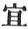
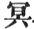

  
[Intangible Textual Heritage](../../index)  [Buddhism](../index) 
[Index](index)  [Previous](sbe1928)  [Next](sbe1930) 

------------------------------------------------------------------------

p. 309

### VARGA 27. PRAISING NIRVÂ*N*A.

At this time there was a Devaputra, riding on (or in) his thousand [1](#fn_829) white-swan palace [2](#fn_830) in the midst of space, who beheld the
Parinirvâ*n*a of Buddha. . 2115

This one, for the universal benefit of the Deva assembly, sounded forth
at large these verses (gâthas) on impermanence: 'Impermanency is the
nature of all (things), quickly born, they quickly die. . 2116

'With birth there comes the rush [3](#fn_831)
of sorrows, only in Nirvâ*n*a [4](#fn_832) is
there joy. The accumulated fuel heaped up by the power of karman [5](#fn_833) (deeds), this the fire of wisdom alone
can consume. . 2117

'Though the fame (of our deeds [6](#fn_834))
reach up to heaven as smoke, yet in time the rains which descend will
extinguish all, as the fire that rages at the kalpa's end is put out by
the judgment [7](#fn_835) (calamity) of water.'
. 2118

p. 310

Again there was a Brahma-*Ri*shi-deva, like a most exalted *Ri*shi (a
highest-principle *Ri*shi [1](#fn_836)),
dwelling in heaven, possessed of superior happiness, with no taint in
his bliss (heavenly inheritance), . 2119

Who thus sighed forth his praises of Tathâgata's Nirvâ*n*a, with his
mind fixed in abstraction as he spoke: 'Looking through all the
conditions of life (of the three worlds), from first to last nought is
free from destruction. . 2120

'But the incomparable seer dwelling in the world, thoroughly acquainted
with the highest truth [2](#fn_837), whose
wisdom grasps that which is beyond the (world's) ken [3](#fn_838), he it is who can save the
worldly-dwellers [4](#fn_839). . 2121

'He it is who can provide lasting escape (preservation) from the
destructive power of impermanence. But, alas! through the wide world,
all that lives is sunk in unbelief (heretical teaching).' . 2122

At this time Anuruddha, 'not stopped' (ruddha) [5](#fn_840) by the world, 'not stopped' from being
delivered

p. 311

(delivered and not stopped), the stream of birth and death for ever
'stopped [1](#fn_841)' (niruddha), . 2123

Sighed forth the praises of Tathâgata's Nirvâ*n*a: 'All living things
completely blind and dark [2](#fn_842)! the
mass of deeds (sa*m*skâra) all perishing (inconstant), even as the
fleeting cloud-pile [3](#fn_843)! . 2124

'Quickly arising and as quickly perishing! the wise man holds not to
such a refuge, for the diamond mace of inconstancy. can (even) overturn
the mountain of the *Ri*shi hermit [4](#fn_844)
(muni). . 2125

'How despicable and how weak the world! doomed to destruction, without
strength! Impermanence, like the fierce lion, can even spoil the
Nâga-elephant-great-*Ri*shi [5](#fn_845). . 2126

'Only the diamond curtain of Tathâgata can overwhelm [6](#fn_846) inconstancy! How much more should those
not yet delivered from desire (passion), fear and dread its power. . 2127

'From the six seeds there grows one sprout [7](#fn_847), one kind of water from the rain, the
origin of the

p. 312

four points [1](#fn_848) is far removed, five
kinds of fruit from the two "koo [2](#fn_849);"
. 2128

'The three periods (past, present, future) are but one in substance; the
Muni-great-elephant plucks up the great tree of sorrow, and yet he (even
he) cannot avoid the power of impermanence. .
2129

'For like the crested [3](#fn_850) (*s*ikhin)
bird delights (within) the pool (water) to seize the poisonous snake,
but when from sudden drought he is left in the dry pool, he dies; . 2130

'Or as the prancing steed advances fearlessly to battle, but when the
fight has passed goes back subdued and quiet; or as the raging fire
burns with the fuel, but when the fuel is done, expires; . 2131

'So is it with Tathâgata, his task accomplished he returns [4](#fn_851) to (find his refuge in) Nirvâ*n*a: just
as the shining of the radiant moon sheds everywhere its light and drives
away the gloom, 2132.

'All creatures grateful for its light, (then suddenly) it disappears
concealed by Sumeru; such is the case with Tathâgata, the brightness of
his wisdom lit up the gloomy darkness, .
2133

'And for the good of all that lives drove it away, when suddenly it
disappears behind the mountain of Nirvâ*n*a. The splendour of his fame
throughout the world diffused, . 2134

p. 313

'Had banished all obscurity, but like the stream that ever flows, it
rests not with us the illustrious charioteer with his seven prancing
steeds [1](#fn_852) flies through the host (and
disappears); . 2135

'The bright-rayed [2](#fn_853) Sûrya-deva,
entering the Yen-tsz’ [3](#fn_854) cave, was,
with the moon, surrounded with fivefold barriers; "all things that
live," deprived of light, . 2136

'Present their offerings to heaven; but from their sacrifice nought but
the blacken’d smoke ascends [4](#fn_855); thus
is it with Tathâgata, his glory hidden, the world has lost its light.
. 2137

'Rare was the expectancy of grateful love [5](#fn_856) that filled the heart of all that lives;
that love, reached its full limit, then was left to perish! . 2138

'The cords of sorrow all removed, we found the true and only way; but
now he leaves the tangled mesh of life, and enters on the quiet place!
. 2139

'His spirit (or, by spiritual power) mounting through space, he leaves
the sorrow-bearing vessel of his body! the gloom of doubt and the great

p. 314

\[paragraph continues\] (heaped-up)
darkness all dispelled, by the bright rays of wisdom! . 2140

'The earthy soil of sorrow's dust his wisdom's water purifies! no more,
no more, returns he here! for ever gone to the place of rest! . 2141

'(The power of) birth and death destroyed, the world (all things)
instructed in the highest doctrine! he bids the world rejoice in
(knowledge of) his law, and gives to all the benefit of wisdom! . 2142

'Giving complete rest to the world, the virtuous streams [1](#fn_857) flow forth! his fame known (spread)
throughout the world, shines still with increased splendour! . 2143

'How great his pity and his love to those who opposed his claims,
neither rejoicing in their defeat nor exulting in his own success [2](#fn_858). . 2144

'Illustriously controlling his feelings, all his senses completely
enlightened, his heart impartially observing events, unpolluted by the
six objects (or, fields) of sense! . 2145

'Reaching to that unreached before! obtaining that which man had not
obtained! with the water which he provided filling every thirsty soul!
. 2146

'Bestowing that which never yet was given, and providing a reward not
hoped for! his peaceful, well-marked person, perfectly knowing the
thoughts [3](#fn_859) (prayers) of all. . 2147

p. 315

'Not greatly moved either by loving or disliking! overcoming all enemies
by the force (of his love)! the welcome physician for all diseases, the
one destroyer of impermanency! . 2148

'All living things rejoicing in religion, fully satisfied [1](#fn_860)! obtaining all they need (seek), their
every wish (vow) fulfilled! . 2149

'The great master of holy wisdom once gone returns no more! even as the
fire gone out for want of fuel! . 2150

'(Declaring) the eight rules (noble truths?) without taint [2](#fn_861); overcoming the five [3](#fn_862) (senses), difficult to compose! with the
three [4](#fn_863) (powers of sight) seeing the
three (precious ones); removing the three (robbers, i.e. lust, anger,
ignorance); perfecting the three (the three grades of a holy life).
. 2151

'Concealing [5](#fn_864) the one (himself) and
obtaining the one (saintship)--leaping over the seven (bodhyaṅgas?) and
(obtaining) the long sleep; the end of all, the quiet, peaceful way; the
highest prize of sages and of saints! .
2152

p. 316

'Having himself severed the barriers of sorrow, now he is able to save
his followers, and to provide the draught of immortality (sweet dew) for
all who are parched with thirst! . 2153

'Armed with the heavy cuirass of patience, he has overcome all enemies!
(now) by the subtle principles of his excellent law (able to) satisfy
every heart. . 2154

'Planting a sacred seed (seed of holiness) in the hearts of those
practising virtue (worldly virtue [1](#fn_865))
impartially directing and not casting off those who are right or not
right (in their views)! . 2155

'Turning the wheel of the superlative law! received with gladness
through the world by those (the elect) who have in former conditions
implanted in themselves a love for religion, these all saved by his
preaching! . 2156

'Going forth [2](#fn_866) among men converting
those not yet converted; those who had not seen (learned) the truth,
causing them to see the truth! . 2157

'All those practising a false method (heretical) of religion, delivering
to them deep principles (of his religion)! preaching the doctrines of
birth and death and impermanency; (declaring that) without a
master [3](#fn_867) (teacher) there can be no
happiness! . 2158

'Erecting the standard of his great renown, overcoming and destroying
the armies of Mâra (all the Mâras)! advancing to the point of
indifference to

p. 317

pleasure or pain, caring not for life, desiring only rest (Nirvâ*n*a)!
2159.

'Causing those not yet converted to obtain conversion! those not yet
saved to be saved! those not yet at rest to find rest! those not yet
enlightened to be enlightened! . 2160

'(Thus) the Muni (taught) the way of rest for the direction of all
living things! alas! that any transgressing the way of holiness should
practise impure (not right) works. . 2161

'Even as at the end of the great kalpa, those holding the law who die
(or, are dead [1](#fn_868)), (when) the rolling
sound of the mysterious thunder-cloud severs the forests, upon these
there shall fall the rain of sweet dew (immortality). . 2162

'The little elephant breaks down the prickly forest, and by cherishing
it we know that it can profit men [2](#fn_869);
but the cloud that removes the sorrow of the elephant old-age [3](#fn_870), this none can bear [3](#fn_870). . 2163

'He by destroying systems of religion (sights, i.e. modes of seeing,
dar*s*anas) has perfected his

p. 318

system, in saving the world and yet saving! he has destroyed- the
teaching of heresy, in order to reach his independent (self-sufficient)
mode (way) \[of doctrine\]. . 2164

'And now he enters the great quiet (place)! no longer has the world a
protector or saviour! the great army host of Mâra-râ*g*a, rousing their
warrior (spirits), shaking the great earth, .
2165

'Desired to injure the honour’d Muni! but they could not move him, whom
in a moment now the Mâra "inconstancy" destroys. . 2166

'The heavenly occupants (Devas) everywhere assemble as a cloud! they
fill the space of heaven, fearing the endless (mastery of) birth and
death! their hearts are full of (give birth to) grief and dread! . 2167

'His Deva eyes clearly behold, without the limitations of near or
distant, the fruits of works discerned throughout, as an image perceived
in a mirror! . 2168

'His Deva ears perfect and discriminating throughout, hear all, though
far away (not near), mounting through space he teaches all the Devas,
surpassing his method (limit) of converting men! . 2169

'He divides his body still one in substance, crosses the water as if it
were not weak (to bear) [1](#fn_871)! remembers
all his former births, through countless kalpas none forgotten! . 2170

p. 319

'His senses (roots) wandering through the fields . of sense
(limits) [1](#fn_872), all these distinctly
remembered; knowing the wisdom learned in every (state of) mind, all
this perfectly understood! . 2171

'By spiritual discernment and pure mysterious wisdom equally
(impartially) surveying all (things)! every vestige of imperfection
(leak) removed! thus he has accomplished all (he had to do). . 2172

'By wisdom rejecting other spheres of life, his wisdom now completely
perfected, to! he dies! let the world, hard and unyielding, still,
beholding it, relent! . 2173

'All living things though blunt in sense, beholding him, receive the
enlightenment of wisdom! their endless evil deeds long past, as they
behold, are cancelled and completely cleansed! .
2174

'In a moment gone! who shall again exhibit qualities like his? no
saviour now in all the world--our hope cut off, our very breath (life)
is stopped and gone! . 2175

'Who now shall give us life again with the cool water (of his doctrine)?
his own great work accomplished, his great compassion now has ceased to
work for long (has long ceased or stopped)! .
2176

'The world ensnared in the toils of folly, who shall destroy the net?
who shall, by his teaching, cause the stream of birth and death to turn
again? . 2177

'Who shall declare the way of rest (to instruct)

p. 320

the heart of all that lives, deceived by ignorance? Who will point out
the quiet place, or who make known the one true doctrine (system of
doctrine)? . 2178

'All flesh suffering (receiving) great sorrow, who shall deliver, like a
loving father? Like the horse changing his master loses all
gracefulness, as he forgets his many words of guidance (so are we)!
. 2179

'As a king without a kingdom, such is the world without a Buddha! as a
disciple (a *S*râvaka, a "much hearer") with no power of dialectic
(distinguishing powers) left, or like a physician without wisdom, . 2180

'As men whose king has lost the marks of royalty (bright or glorious
marks), so, Buddha dead, the world has lost its glory! the gentle horses
left without a charioteer, the boat without a pilot left! . 2181

'The three divisions [1](#fn_873) of an army
left without a general! the merchantmen without a guide! the suffering
and diseased without a physician! a holy king (*k*akravartin) without
his seven insignia (jewels, ratnâni)! 218 .
2

'The stars without the moon! the loving years (the planet Jupiter?)
without the power of life!--such is the world now that Buddha, the great
teacher, dies!' . 2183

Thus (spake) the Arhat [2](#fn_874), all done
that should be done, all imperfections quite removed, knowing the meed
of gratitude, he was grateful therefore (spake gratefully of his
master); . 2184

Thus thinking of his master's love he spake!

p. 321

setting forth the world's great sorrow; whilst those, not yet freed from
the power of passion, wept with many tears, unable to control
themselves. . 2185

Yet even those who had put away all faults, sighed as they thought of
the pain of birth and death. And now the Malla host [1](#fn_875) hearing that Buddha had attained
Nirvâ*n*a, . 2186

With cries confused, wept piteously, greatly moved, as when a flight of
herons meet a hawk (kite). In a body now they reach the twin (*S*âla)
trees, and as they gaze upon Tathâgata dead (entered on his long sleep),
. 2187

Those features never again to awake to consciousness, they smote their
breasts and sighed to heaven; as when a lion seizing, on a calf, the
whole herd rushes on with mingled sounds. .
2188

In the midst there was one Malla, his mind enamoured of the righteous
law, who gazed with steadfastness upon the holy [2](#fn_876) law-king, now entered on the mighty
calm, . 2189

And said: 'The world was everywhere asleep, when Buddha setting forth
his law caused it to awake; but now he has entered on the mighty calm,
and all is finished in an unending sleep. .
2190

'For man's sake he had raised the standard of his law, and now, in a
moment, it has fallen; the sun of Tathâgata's wisdom spreading abroad
the lustre of its "great awakening [3](#fn_877)," . 2191

p. 322

'Increasing ever more and more in glory, spreading abroad the thousand
rays of highest knowledge, scattering and destroying all the gloom (of
earth), why has the darkness great come back again? . 2192

'His unequalled wisdom lightening the three worlds, giving eyes that all
the world might see, now suddenly (the world is) blind again,
bewildered, ignorant of the way; . 2193

'In a moment fallen the bridge of truth (that spanned) the rolling
stream of birth and death, the swelling flood of lust and rage and
doubt, and all flesh overwhelmed therein, for ever lost.' . 2194

Thus all that Malla host wept piteously and lamented; whilst some
concealed their grief nor spoke a word; others sank prostrate on the
earth; . 2195

Others stood silent, lost in meditation; others, with sorrowful heart,
groaned deeply. Then on a gold and silver gem-decked couch [1](#fn_878), richly adorned with flowers and scents,
. 2196

They placed the body of Tathâgata; a jewelled canopy they raised above,
and round it flags and streamers and embroidered banners; then using
every kind of dance and music [2](#fn_879),
. 2197

The lords and ladies of the Mallas followed

p. 323

along the road presenting offerings, whilst all the Devas scattered
scents and flowers, and raised the sound of drums and music in the
heavens. . 2198

Thus men and Devas shared one common sorrow, their cries united as they
grieved together. Entering the city, there the men and women, old and
young, completed their religious offerings. .
2199

Leaving the city, then, and passing through the Lung-tsiang gate [1](#fn_880), and crossing over the Hira*n*yavatî
river, they repaired to where the former Buddhas having died, had
*K*aityas raised to them [2](#fn_881). . 2200

There collecting ox-head sandal wood and every famous scented wood, they
placed the whole above the Buddha's body, pouring various scented oils
upon the pyre; . 2201

Then placing fire beneath to kindle it, three times they walked around;
but yet it burned not. At this time the great Kâ*s*yapa had taken his
abode at Râ*g*ag*ri*ha [3](#fn_882), . 2202

And knowing Buddha was about to die was coming thence with all his
followers; his pure mind, deeply moved, desired to see the body of the
lord; . 2203

And so, because of that his sincere wish, the fire went out and would
not kindle. Then Kâ*s*yapa and his followers coming, with piteous sighs
looked on the sight . 2204

p. 324

And reverenced at the master's feet; and then, forthwith, the fire burst
out. Quenched the fire of grief within; without, the fire has little
power to burn. 2205 '

Or though it burn the outside skin and flesh, the diamond true-bone
still remains. The scented oil consumed, the fire declines, the bones
they place within a golden pitcher; . 2206

For as the mystic world [1](#fn_883)
(dharma-dhâtu) is not destroyed, neither can these, the bones (of
Buddha), perish; the consequence (fruit) of diamond [2](#fn_884) wisdom, difficult to move as Sumeru.
. 2207

The relics which the mighty golden-pinioned bird cannot remove or
change, they place within the precious vase; to remain until the world
shall pass away; . 2208

And wonderful! the power of men (the world) can thus fulfil Nirvâ*n*a's
laws, the illustrious name of one far spread, is sounded thus throughout
the universe; . 2209

And as the ages roll, the long Nirvâ*n*a, by these, the sacred relics
(bones), sheds through the world its glorious light, and brightens up
the abodes of life. . 2210

He perished (quenched his splendour) in a moment! but these relics,
placed within the vase, the imperishable signs of wisdom, can overturn
the mount of sorrow; . 2211

p. 325

The body of accumulated griefs [1](#fn_885)
this imperishable mind (ki) can cause to rest, and banish once for ever
all the miseries of life. . 2212

Thus the diamond substance (body) was dealt with at the place of
burning. And now those valiant Mallas, unrivalled in the world for
strength, . 2213

Subduing all private animosities, sought escape from sorrow in the true
refuge. Finding sweet comfort in united love, they resolved to banish
every complaining thought. . 2214

Beholding thus the death of Tathâgata, they controlled their grieving
hearts, and with full strength of manly virtue dismissing every listless
thought, they submitted to the course (laws) of nature. . 2215

Oppressed by thoughts of grievous sorrow, they entered the city as a
deserted wild, holding the relics thus they entered, whilst from every
street were offered gifts. . 2216

They placed the relics then upon a tower [2](#fn_886), for men and Devas to adore. . 2217

------------------------------------------------------------------------

### Footnotes

[309:1](sbe1929.htm#fr_829) The symbol for
'thousand' is probably an error for the preposition 'u' upon.

[309:2](sbe1929.htm#fr_830) The ha*m*sa is the
vehicle of Brahmâ. The white ha*m*sa is probably the same.

[309:3](sbe1929.htm#fr_831) The accumulation,
or crowd of sorrows.

[309:4](sbe1929.htm#fr_832) Ts’ie mih, quiet
extinction, or the destruction ending in quietness.

[309:5](sbe1929.htm#fr_833) The collection of
the pile of fuel of the deeds (or beams) of conduct (sa*m*skâras).

[309:6](sbe1929.htm#fr_834) Or, simply, 'though
our fame;' or it may refer to the renown of Buddha.

[309:7](sbe1929.htm#fr_835) Referring to the
Buddhist account of the destruction and renovation of the universe; the
last 'calamity' or 'judgment' was the destruction by water.

[310:1](sbe1929.htm#fr_836) This may refer to
one of the highest *Ri*shis, or Pra*g*âpatî *Ri*shis, belonging to the
Vedic literature.

[310:2](sbe1929.htm#fr_837) Here is the same
phrase, 'ti yih i,' the first, or highest, truth, or principle of truth
(paramârtha).

[310:3](sbe1929.htm#fr_838) Whose wisdom sees
that which (*k*é) is above, or superior, (to man.)

[310:4](sbe1929.htm#fr_839) The difficulty is
to find a word in English corresponding to the Buddhist phrase 'all in
the world;' it is not only 'mankind' (Sacred Books of the East, vol. xi,
p. 183) that are invited to trust in Buddha, but all things that have
life. The Chinese phrase is '*k*ung sing,' all that lives.

[310:5](sbe1929.htm#fr_840) Not 'liu to,' where
'liu to' is equivalent to 'ruddha' in the proper name Anuruddha. I take
the word, therefore, in the sense of 'stopped'--it is used, of course,
as a figure of speech; so also in the next phrase. Anuruddha is here
taken as A-niruddha.

[311:1](sbe1929.htm#fr_841) Ni-liu-to, equal to
'niruddha.'

[311:2](sbe1929.htm#fr_842)   for  

[311:3](sbe1929.htm#fr_843) The Chinese 'feou'
means a 'floating' pile or mass, whether of clouds or fanciful worlds.
Hence its use in the later Buddhist development to mean a 'series of
worlds' (as in the successive stages of the pagoda).

[311:4](sbe1929.htm#fr_844) Or, the
*Ri*shi-hermit-mountain, referring probably to Buddha.

[311:5](sbe1929.htm#fr_845) Referring again to
Buddha.

[311:6](sbe1929.htm#fr_846) The literal
translation would be, 'only makes impermanence, destruction.' There may
be an error in the text, but this sense is sufficiently plain. The
meaning of the word 'curtain,' or, perhaps, 'standard,' is not quite so
evident in this connection, it is evidently used in opposition to the
'diamond mace,' in the preceding clause.

[311:7](sbe1929.htm#fr_847) This and the
following lines are obscure; the reference must be gathered from
Sanskrit rather than Chinese. The line before us, rendered literally, is
'six seeds, one bud.'

[312:1](sbe1929.htm#fr_848) The four 'yin' may
be the four points of the compass. But the text is without note or
comment.

[312:2](sbe1929.htm#fr_849) The Chinese symbol
'koo' means a 'libation cup.'

[312:3](sbe1929.htm#fr_850) The symbols
'shi-hi' correspond with Sanskrit *s*ikhin; I have therefore taken it in
the sense of 'crested.' There may be a bird, however, called *S*ikhin.

[312:4](sbe1929.htm#fr_851) The expression 'he
returns to Nirvâ*n*a' is unusual; I have therefore used the alternative
meaning which the symbol 'kwei' sometimes has, 'finding refuge in.'

[313:1](sbe1929.htm#fr_852) This passage is a
difficult one; if the construction is closely followed, the rendering
would be this,' The illustrious charioteer (with) his seven swift
steeds, the army host quickly (or, the wings of the army host) following
him about.' Possibly it must be connected with the lines which follow,
and refers to the saptâ*s*vavâhana of Sûrya.

[313:2](sbe1929.htm#fr_853) Kwong-kwong,
well-rayed.

[313:3](sbe1929.htm#fr_854) The Yen-tsz’ cave
is the fabulous hiding-place of the sun. The fable is a common one,
particularly in Japanese mythology. I do not know whether it is found in
Sanskrit literature.

[313:4](sbe1929.htm#fr_855) The reference in
this and the preceding lines is to the disappearance of the sun and
moon, and the darkness of the world, compared to the Nirvâ*n*a of
Tathâgata.

[313:5](sbe1929.htm#fr_856) This is a free
translation; I have taken 'tsiueh' as an intensitive particle.

[314:1](sbe1929.htm#fr_857) The streams of his
virtuous qualities.

[314:2](sbe1929.htm#fr_858) This verse again is
doubtful. The entire section (a hymn of praise in honour of the departed
Buddha) is couched in obscure, figurative language.

[314:3](sbe1929.htm#fr_859) His well-composed
and illustrious person, knowing perfectly all the reflections of men.
'Nim' is sometimes used to signify 'prayers' or 'aspirations.'

[315:1](sbe1929.htm#fr_860) Each one satisfied;
the sense seems to be that through him, i.e. Buddha, all things obtained
the completion of their religious desires.

[315:2](sbe1929.htm#fr_861) Or it may be by way
of exclamation, 'those eight rules which admit of no pollution!'
referring perhaps to the name 'the noble rules.'

[315:3](sbe1929.htm#fr_862) I suppose 'the
five' are the five senses. The expression 'difficult to compose' might
be also rendered 'the difficult to compose group.'

[315:4](sbe1929.htm#fr_863) Using (i) 'the
three,' and yet seeing the 'three.' The next line is, 'removing the
three,' and yet perfecting 'the three.'

[315:5](sbe1929.htm#fr_864) Or it may be
'treasuring the one,' where 'the one' may be the one duty of a religious
life; but it is difficult to interpret these paradoxes.

[316:1](sbe1929.htm#fr_865) The sense seems to
be, that in the case of those leading a virtuous life, i.e. a moral
life, the seeds of holiness take root.

[316:2](sbe1929.htm#fr_866) All these verses
might be introduced with some such exclamation as this, 'See! how he
went forth!' &c.

[316:3](sbe1929.htm#fr_867) Perhaps the word
'*k*u' might be rendered 'a ruling principle,' viz. of religion.

[317:1](sbe1929.htm#fr_868) The literal
translation of this passage is curious: 'Even as at the end of the great
kalpa, those holding the law, asleep; the mysterious cloud rolling forth
its cracking (thunder), riving the forests, there descends as rain sweet
dew.' The end of the great kalpa is the consummation of all things: 'the
religious who sleep' would mean the good who are dead; 'the cracking
thunder and riven forests' would point to a general overthrow; 'the rain
of sweet dew' seems to refer to the good who sleep, receiving
immortality, or perfection of life.

[317:2](sbe1929.htm#fr_869) 'The little
elephant' may mean 'the young elephant' in its literal sense; or it may
refer to 'the young disciple.' 'By cherishing it we know' may also be
rendered 'knowledge-cherishing' is able, &c.

[317:3](sbe1929.htm#fr_871) 'The cloud removing
the elephant old and sorrowful;' but what is 'the cloud' and who 'the
elephant?'

[318:1](sbe1929.htm#fr_872) This sentence may
perhaps be rendered thus, 'dividing his body yet one in substance,
wading through water and yet not weak,' but the allusion is obscure.
\[It refers, probably, to Buddha's miraculous powers.\]

[319:1](sbe1929.htm#fr_873) The meaning is, all
his births, in which his senses or material body took every kind of
shape; all these he knew. The figurative style of this 'hymn' may be
gathered from this one instance, where instead of saying 'all his
previous births' it is said 'his senses wandering through the field
(limits or boundaries) of sense.'

[320:1](sbe1929.htm#fr_874) Infantry, cavalry,
and chariots.

[320:2](sbe1929.htm#fr_875) That is, as it
seems, Anuruddha.

[321:1](sbe1929.htm#fr_876) The Mallas
(wrestlers) are termed 'lih-sse,' strong-masters, in Chinese. They dwelt
at Ku*s*inagara and Pavâ. The Li*kkh*avis are also called lih-sse.

[321:2](sbe1929.htm#fr_877) The holy law-king,
dharmarâ*g*a.

[321:3](sbe1929.htm#fr_878) The 'great
awakening' refers, of course, to Buddha as 'the awakened.'

[322:1](sbe1929.htm#fr_879) The 'gem-decked
couch' or palanquin is probably represented in plate lxiv, fig. 1 (Tree
and Serpent Worship, first edition). This is the procession of the couch
through Ku*s*inagara. The curly-haired men bearing it would indicate
that the Mallas and Li*kkh*avis of Vai*s*âlî were the same race.

[322:2](sbe1929.htm#fr_880) The use of 'dance
and music' at funerals is an old and well-understood custom. Compare
Sacred Books of the East, vol. xi, pp. 122, 123.

[323:1](sbe1929.htm#fr_881) The Nâga or
Nâga-Elephant gate.

[323:2](sbe1929.htm#fr_882) Had their
Nirvâ*n*a-*k*aityas erected. The account in the text does not agree with
the Southern account; but the popular Chinese record of the Nirvâ*n*a is
the same as the Pâli.

[323:3](sbe1929.htm#fr_883) He was between Pâvâ
and Ku*s*inagara, according to the common account.

[324:1](sbe1929.htm#fr_884) The dharma-dhâtu
(fă kai) is the mystic or ideal world of the Northern Buddhists.
Literally it is the 'limit (ὅπος) of dharma;' dharma being the universal
essence. This bears a striking resemblance to the gnostic (Valentinian)
theory of limitation of the Divine essence.

[324:2](sbe1929.htm#fr_885) Diamond wisdom,
indestructible wisdom.

[325:1](sbe1929.htm#fr_886) That is, the body
subject to accumulation of sorrow.

[325:2](sbe1929.htm#fr_887) 'In their council
hall with a lattice work of spears, and with a rampart of bows,' Sacred
Books of the East, vol. xi, p. 131.

------------------------------------------------------------------------

[Next: Varga 28. Division of the *S*arîras](sbe1930)
