  
[Intangible Textual Heritage](../../index)  [Buddhism](../index) 
[Index](index)  [Previous](sbe1932)  [Next](sbe1934) 

------------------------------------------------------------------------

p. 344

### NOTE II.

#### EXAMPLE OF THE STYLE OF THE EXPANDED SÛTRAS, AS TRANSLATED INTO CHINESE.

### PHÛ YAU KING.

#### KIOUEN II, § 1.

On the thirty-two miraculous signs which appeared on the eve of the
Birth of Bodhisattva.

Buddha addressed all the Bhikshus and said: Ten months having been
fulfilled, Bodhisattva being on the point of birth, at this time there
were manifested thirty-two miraculous signs. The first was this: (1) In
the after-garden all the trees spontaneously bore fruit. (2) The solid
earth produced blue lotus flowers as large as a chariot-wheel. (3) All
the decayed trees of the earth produced flowers and leaves. (4) The
heavenly spirits drawing the chariots adorned with curtains of seven
gems, arrived at the spot. (5) In the middle of the earth (or, in the
earth) 20,000 treasures of precious substances appeared of themselves.
(6) On every side, far and near, was perceived the agreeable fragrance
of celebrated perfumes (ming hiang 
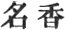 ). (7) From the snowy mountains there came forth 500
white lions, and arranging themselves in front by the gates of the city,
stood there without doing harm to any one. (8) Five hundred white
elephants, arranging themselves in front of the palace, stood there. (9)
The Devas caused a soft and perfumed rain to fall on every hand (the
four quarters, i.e. through the world). (10) There appeared in the
palace of the king spontaneously a water fountain possessed of the
hundred qualities of taste, fit to satisfy the wants of all who were
athirst. (11) The Nâga women appearing in the air with half their body
visible, remained thus. (12) Ten thousand Devîs, holding in their hands

p. 345

peacock-feather fans, remained thus above the palace-walls. (13) All the
Devîs, holding in their hands 10,000 golden pitchers full of sweet-dew
(nectar), remained fixed in space. (14) Ten thousand Devîs, holding in
their hands 10,000 vases full of scented water, proceeded and stopped in
the air \[ 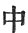 I suppose to
be omitted\]. (15) Ten thousand Devîs, holding in their hands standards
and parasols, stood at attention. (16) All the Devîs arranging
themselves in order stood still, whilst every kind of responsive music
sounded spontaneously through space. (17) The four great river-drains
(the four rivers flowing from the Anavatapta Lake?) remaining at rest,
ceased to flow. (18) The sun and moon (the palaces of the sun and moon
Devas) ceased to move. (19) The constellation Pushya descending, waited
in the rear of all the other stars (or, star-concourse). (20) A net-like
precious canopy entirely covered the palace of the king. (21) The divine
pearl of the bright moon hanging over the palace hall, shed abroad a
brilliant effulgence. (22) The lamps and fires of the palace were (by
the superior light without) no longer visible. (23) Baskets and articles
of dress appeared placed on their stands. (24) Articles of jewelry and
treasures of every kind of precious stone appeared of themselves. (25)
The five kinds of poisonous insects suddenly disappeared, whilst the
fortunate bird (or bird of good omen) soaring aloft poured forth
pleasant songs. (26) The pains inflicted in the different hells were
allayed. (27) The earth through a great movement became perfectly level
and smooth. (28) The four great highways and the narrower streets
appeared perfectly smooth and ornamented with flowers. (29) All valleys
and cavernous places were raised and became even. (30) The cruel designs
of those who fished in the waters or hunted on the land gave way in a
moment to a loving and merciful heart. (31) All the diseases to which
children newly born, such as blindness, deafness, &c., are liable, were
averted. (32) The tree-Devas, with half their bodies visible, appeared
to all beholders, their heads reverently inclined. Such were the
thirty-two miraculous signs which appeared on every side of the (palace)
enclosures, sufficient to cause wonder and admiration (in

p. 346

those who beheld them), as indications of the approaching period. At
this time the queen being about to give birth (to Bodhisattva), he, i.e.
Bodhisattva, by exciting the thought in her mind by his own spiritual
energy, caused her to arise at the first watch of the night, and having
robed herself to go with her attendants to the place where the king
was--(when she addressed him as follows):--'Listen to my words! for a
long time have I thought of entering the garden for the purpose of
religious meditation--supposing in every case, O Mahârâ*g*a! the idea is
not displeasing or troublesome to you; in which case I would at once
resort thither to reflect silently on the words of the sacred books.'
The king thereupon answered, 'Willingly do I consent, saintly lady, that
you should go forth to contemplate the flowers of the trees now in full
bloom--for at this season, around the palace and its lovely dwellings,
are countless kinds of trees, whose fruit and fragrant blossoms cannot
but afford unmixed delight (to all beholders).' The queen, hearing these
words, was filled with joy. Then the king commanded the precious chariot
known as the 'cloud-mother' to be prepared and decorated; followed by a
retinue of servants, and surrounded by attendant [1](#fn_917) women, thus the queen went forth to
behold the trees in the Lumbinî [2](#fn_918)
garden. The conductors of the inferior chariots were all similar in
appearance and colour, distinguished for their splendour as they rode,
dazzling the eyes of men. Two hundred white elephants followed and
preceded the cortége, all decorated with gems and pearls. The elephants
were furnished with six tusks. The king of the elephants, in the midst,
was covered with a golden network, to which bells were attached that
sounded melodiously [3](#fn_919) as the wind
blew them one against the other; in other respects also they were fully
caparisoned and armed. At this time there was concord and goodwill in
the world, an absence of a contentious spirit. Thus surrounded, the
queen wandered

p. 347

forth and reposed beneath the trees of the Lumbinî garden. Then
*S*akra-deva and Brahma-râ*g*a and the four heavenly kings descending
(flying) from their respective abodes, and scattering flowers, hastily
proceeded to the palace to ascertain the state of the case, and entering
the different apartments, caused the servants and attendants to receive
instructions (i.e. put the thought into their minds) to sweep and
prepare the way for the approach of the king on the queen's departure.
This being done and reported, the king was filled with joy, and entering
the palace of the female attendants, he spoke thus: 'You who desire to
give me satisfaction, and to impart joy, will do as I request; let there
be no differences among you, but let each one be ready to sit quietly
and reflect (on what I say). Decorate yourselves in your most dazzling
attire; and anoint yourselves (or, your garments) with the choicest
perfumes, pure and sweet; let your bodies be covered with countless
ornaments and gems whose sound is delightful to the ear and joy-giving
to the beholder, prepare for yourselves every kind of musical
instrument, cymbals and pipes and lutes and drums, of every sort, which
may accord in producing sweet music, so that the Devîs themselves
hearing it may have joy. Thus provided, attend the queen as she mounts
the lovely chariot; let male and female attendants alike, and the
elephants composing the cortége, be decorated in one way, and let no ill
sound or discordant note be heard to discompose the mind of the queen.'
And now the elephants and horses and the military attendants of every
kind, decorated as aforesaid, stood by the gate, and as the queen passed
through on her departure there was heard the sound as it were of a great
ocean, and the shouts of those who desired her ten thousand years,
whilst the ornaments which decorated the chariot, as it moved along,
gave forth propitious music. The lion throne, like that of the gods, was
composed of (the wood of) the four precious (gem) trees, covered with
(carved?) leaves and flowers of every possible description so as to
perfect it. And now the ducks and geese and the peacocks raised their
piteous notes in unison, whilst banners and flags decorated with the
seven precious substances were placed as a canopy over the chariot.

p. 348

\[paragraph continues\] Then the Devas who
dwell in space, surrounding the chariot as it advanced, likewise sang
together in melodious strains. As soon as the queen sat down upon the
lion throne the great universe (chiliocosm) was six times (or in six
manners) shaken, and all the Devas scattered flowers (as they cried):
'The holy one to-day is about to be born even here beneath a tree of the
Lumbinî (garden), it is he who is a god among gods.' The four heavenly
kings conduct the chariot, the divine *S*akra purifies and prepares the
way, whilst Brahma Devarâ*g*a leads on before, attended by a hundred
thousand Devas, who ever turn towards the chariot and adore (the queen)
with heads inclined.

And now the king, the father, seeing all this, was filled with joy in
his heart, and reflecting with himself he exclaimed: 'This (child) must
be in truth the king of gods and men, whom all the Devas, the four
heavenly kings, *S*akra and Brahma, attending, agree to honour; he must
indeed be one who shall attain to the condition of Buddha; for never yet
in the three worlds has one received such adoration, whether Deva or
Nâga or divine *S*akra or Brahma, and yet escaped with life (unsplit
head). Such a one then receiving these honours must of necessity in the
end prove himself a holy person (divine).' Thus the queen (advanced),
escorted by 84,000 chariots drawn by horses, the same number drawn by
elephants, and by the same number of chariot drivers, fully adorned, and
surrounded by soldiers, spearmen and halbard bearers of approved courage
and strength on the right hand and on the left, and by others in front
and rear, whilst before and behind was a surrounding concourse of 60,000
attendant women accompanied by 40,000 nobles all of the family of king
*S*uddhodana, whilst others, the attendants of 64,000 kings, took part
in the cortége that surrounded the mother of Bodhisattva. Moreover,
there were 84,000 female attendants of the Devas, the Nâgas, the
Gandharvas, the Kinnaras, Mahoragas, Asuras, all sumptuously decorated
with jewels and ornaments, provided with drums and musical instruments,
producing harmonious sounds although differing in character, whilst with
their voices they sang of the perfections (virtues) of Bodhisattva's
mother. Thus

p. 349

surrounded and attended they approach the Lumbinî grove, the road
prepared carefully and the ground perfumed with scented water and
covered with divine flowers, whilst the trees themselves budded forth
and blossomed and the scented oil of choicest sandal-wood was produced
on every side. This, indeed, was by the express interference of the
gods. And now the queen having arrived, descended [1](#fn_920) from her precious chariot, and
accompanied by Devas and Devîs she proceeded onwards through the garden,
whilst the trees in honour of her presence shed abroad their brilliant
hues and their fragrant scent. The queen now observed one tree of
conspicuous beauty, made perfect by every kind of pearl and precious
ornament. The stalks and twigs, the branches and leaves of this tree
were all in truth full of fragrance, whilst its lovely verdure spread
around on every side drooped to the ground, pliant and pure as silky
grass. Like a vestment of some heavenly being it covered the earth--even
as had been the case from old time with respect to the laws (relating to
the birth) of all the Buddhas. And now all the Devas and men, at once,
strike their drums, and from innumerable instruments the followers of
the queen join in the strain, as she goes forward and arrives beneath
the tree. By the influence of Bodhisattva the spirit inhabiting the tree
bending down a branch of its own accord rendered assistance to the
queen. All the Devas who inhabit space bending down their heads did
obeisance, the sun and moon shed abroad a pure unsullied light, whilst
the Devas and their female attendants, filled with admiration, gathered
round to render meritorious service (to the queen as she stood) beneath
the tree. Meantime the tree Deva was filled with joy in considering the
reason of the presence of all this vast multitude, and reasoned thus:
'Now may we all well endure to bear these bodies of ours, whilst we
employ them in rendering service and obedience, for from the lowest
hell [2](#fn_921) to the highest heavens of the
Trayastri*m*sas all sorrow must cease, all darkness disappear, whilst
now the holy one is about to be

p. 350

born. So it is the trees are covered with flowers and foliage, whilst
innumerable Devas gathered around do homage, and the great earth is
shaken in six ways. The sun and moon shed abroad a pure and serene
light, and music from innumerable instruments is heard around; yea,
moreover, all impure desire is put away, and all the Devas are filled
with joy; for to-day the holy one is to show his pity for all creatures,
and therefore Brahma and *S*akra and all the gods rejoice and worship;
this is the honourable one among men, whose merits surpass the sun and
moon. It is he, now dwelling in the womb, who shines forth like gold
with a brightness eclipsing the light of heaven; all the Devas, Brahma,
*S*akra and the rest, and all the denizens of the countless worlds of
space, putting away evil ways and thoughts, are now at peace, without
remnant of sorrow or grief; and therefore the Devas, countless in
number, offer the sacrifice of scattered flowers and music, and by their
indomitable might cause the very ground to produce of itself flowers
composed of the seven precious substances.' And now as Bodhisattva was
born from the right side of his mother, suddenly there appeared a
precious lotus flower on which he stood, and then taking seven steps he
declared in words of the Fan language (or, with the voice of
Brahma;--Brahmaghosha) the character of impermanency in accordance with
his (subsequent) teaching (and added): 'I am now about to save and
deliver all those in heaven and earth (above the heaven and below the
heaven), as the lord of Devas and men to deliver (detach) them from the
misery of (repeated) birth and death, as the highest in the universe
(the three worlds) to cause all creatures to arrive at the condition of
non-individuality (wu-wei) and thus obtain enduring rest.' Then
*S*akra-râ*g*a and Brahma caused every kind of scented water to descend
suddenly for the purpose of washing (the person of) Bodhisattva, whilst
the nine dragons who dwelt in space above, caused other scented streams
to descend for the purification of the holy master. The washing being
finished (he stood) perfectly pure in body and soul (heart), raised far
above the position which for the present he occupied as wayfarer, born
of a noble parentage, like a perfect and true gem

p. 351

uniting in itself every rare quality and excellency: about to turn the
wheel of the law, or as a wheel king (*K*akravartin) (if he continue in
the world (the three worlds)) to bring all the quarters (the ten
regions) under one over-shadowing government. And there arose in the
heart of *S*uddhodana-râ*g*a a rapturous exultation. At this time there
were born children of 5000 attendants (blue-clad), who were presented to
the king to become his personal guards (lih-sse, the words used
generally for vri*gg*i); 800 young nurses also were delivered of sons;
100,000 elephants likewise produced their young; (as many) white mares
produced their foals, their colour white as snow, their coats glossy and
smooth; (as many) yellow sheep produced their lambs. At the same time
there appeared two myriads of curtained precious chariots [1](#fn_922) for the holy one's use, (whilst those
who brought them), bending their heads, desired to know whither he would
go; and beyond all this the Devas caused innumerable apparitional forms
to present themselves, to offer various services, and caused a glorious
radiance to fill the place: 5000 Apsarases, their persons breathing
fragrance, each holding . a jar of scented unguents, came to the place
where stood the mother of Bodhisattva, 5000 others came to escort her to
the city, having flowers and heavenly garments, whilst many youths and
others came with jewels and ornaments for her person. Bodhisattva
arriving at the condition 'free from fear' must complete the way of
Buddha [2](#fn_923). Then Buddha addressed the
Bhikshus: At the time of Bodhisattva's birth, his mother was perfectly
at ease, no disagreeable malady or accompanying inconvenience disturbed
her; but she was in the condition which most became her. At the same
time, both in front and behind her, were 5000 female attendants
providing divine incense and holding scented oil as an offering to the
mother of Bodhisattva, whilst without intermission they paid her lowest
reverence: there were, moreover, 5000 female attendants who offered her
divine medicaments, 5000 others who presented her with

p. 352

jewels and necklets (or, precious necklaces), 5000 others who offered
her divine robes for her person, 5000 others who offered her (or,
attended her with) divine music, all these paid to her constant and
reverent attention.'

And now it came to pass that there were five *Ri*shis with supernatural
powers passing over this country through the air who suddenly appeared
in the presence of *S*uddhodanarâ*g*a [1](#fn_924). Buddha, moreover, addressed the
Bhikshus and said: 'At the time of Bodhisattva's birth, during seven
days from morning till evening, there was continual music, whilst all
the assembly offered a hundred different sorts of food beneath the
Lumbinî tree, presenting to the mother of Bodhisattva the fruits of
merit resulting from the exercise of the paramitâs of charity, morality,
patience, and perseverance. At this time 32,000 Brahma*k*ârins from day
to day, without intermission, offered their gifts without stint,
whatever (the mother of .Bodhisattva) desired; *S*akra-deva and Brahma,
assuming the appearance of young Brahmans (students), having taken
conspicuous places amongst the assembled Brahma*k*ârins, repeated these
Gâthâs:

"Having put an end to all evil ways of birth (in himself)  
He has now sent universal peace among men;  
All creatures enjoying concord and rest  
Are free from sorrow everywhere.  
As the brightness of the sun scatters darkness.  
So the glory of all the Devas withers,  
His glorious merit scatters all their brightness,  
And causes it to decay and disappear.  
(We do) not (now) consider the time when he shall have exhausted karman
(i.e. be born as a Buddha),  
Nor shall we hear again of such a time,  
For now the glory of Buddha has appeared,  
And he has become the great saint of the world;  
No more for him of labour or the ills of sense (dust),  
His loving heart compassionates all living creatures,  
And so innumerable Devas of the Brahma heaven (or, innumerable Brahma
devas)  
Have come to offer him boundless sacrifice.  
And therefore also the trees covered with flowers  
Rest in quiet upon the peaceful (or level) earth,  
(In proof that) all the world will come to him for refuge (salvation),  
And that all will fully rely on him.

p. 353

Just as in this lower world  
The lotus springs from the midst of the mire,  
Thus is Prabhâpâla [1](#fn_925) now born in the
world,  
About to nourish and govern all that lives.  
For like as a pliant delicate robe  
Is redolent with heavenly perfume,  
So if there he a man diseased or sick  
He will for his sake become 'the chief physician.'  
And as by his presence he has caused an absence of all lustful desire,  
And peace and goodwill dwell in the world of form,  
(And as) with hands clasped (all these) render him worship,  
He is surely worthy to be called the 'protector of all,'  
And as the Devas, and their followers, All with compliant hearts  
Mix freely with men in their common worship,  
He will be in truth the 'great master of all.'  
And as the pure unsullied water (rain)  
Is universally diffused and causes luxuriant vegetation,  
So by the right apprehension (samyakd*ri*sh*t*i) of the truth of this
one's doctrine,  
There shall ever be both rest and quiet."'

Buddha, moreover, addressed the Bhikshus and said: 'Seven days after the
birth of Bodhisattva his mother died.' On this the thought occurred to
the Bhikshus, it must have been on account of some fault on the part of
Bodhisattva that such an event occurred; on which Buddha resumed: Let
not such a thought present itself; and why? Because her destiny was even
so, that the birth of Bodhisattva should be the term of her life; and
hence at her birth, when she came down for the purpose of bearing
Bodhisattva in her womb, all the Devas attended her and provided her
with heavenly clothing and food. And it has ever been thus. The mothers
of all the Buddhas have always died seven days after their birth; and so
because at the time of Bodhisattva's birth the bodily functions of his
mother were all in perfect condition, she was born as the result of her
previous merit in the Trâyastri*m*sas heaven. And before this,
Bodhisattva not yet born, she had gone up thither, on which occasion all
the Devas attending her offered her a palace to dwell in, and awaiting
her in the great preaching hall they offered the queen 5000 pitchers
containing the rarest scented waters; 5000 Apsarases presented her with
thrones

p. 354

to sit on; 5000 others, holding caps of state in their hands, sprinkled
before her on the ground perfumed water; 50,000 Brahma devas, holding
golden pitchers, saluted her with expressions that she might live 10,000
years; 20,000 Nâgas with necklaced bodies, 20,000 white elephants with
pearl-covered bodies, 20,000 chariots with flags and jewelled canopies
surrounded-her, and behind these 40,600 armed attendants, heroes of
marked courage, and Bodhisattva himself in the rear. Moreover, on this
occasion there were countless thousand Devas, who caused to appear in
space in a moment yellow golden parapets, along which they offered
worship to the mother of Bodhisattva. On that night Bodhisattva was
conceived in the womb, on which occasion 20,000 damsels attendants on
Mâra, proceeding from the great and superbly-adorned palace of the
Kâmaloka heavens, and holding in their hands precious silken tissues,
came to the place to wait on the mother of Bodhisattva; and so likewise
20,000 men (male Devas?) with highly decorated bodies, to do honour to
the occasion. On that night between every two attendant women was one
Apsaras [1](#fn_926); the attendant women
beholding the beauty of her face felt the risings of desire. And now by
the power of the divine merit of Bodhisattva in the midst of this great
city of Kapilavastu, 500 nobles, all of the *S*âkya race, each laid the
foundation of a palace for residence, 500 in all, so that when he
entered the gates of the city, they addressed him as they paid him
reverence and said, Oh, would that Sarvârthasiddha would condescend to
enter this divine abode (place [2](#fn_927)),
this perfectly pure abode. Oh! thou whose eye beholds all things
(samanta*k*akshus), thou hast come down into this world (yeou = bhava),
(condescend to enter) this great palace called "Hu-tsing-fa"
(defend-pure-flower), a fitting residence for Bodhisattva.'

Then the great Brahma*k*ârins and the principle princes of

p. 355

the *S*âkya tribe addressing *S*uddhodana said, 'It would be perhaps
convenient if the prince would condescend to agree to enter these abodes
and remain in them (use them).' Bodhisattva therefore entered the 500
abodes. (Moreover they said, 'Who is there [1](#fn_928)) of conspicuous merit, and of complacent
disposition, who can protect and order (Bodhisattva) aright?' Then 500
*Kh*andakas [2](#fn_929), each one said, 'We
can nourish and cherish the prince.' But others replied, 'It is a
difficult task to train aright and lead into obedience one possessed of
such saintlike wisdom as the prince, especially such as are in the prime
of their beauty and youth, for when he begins to grow up who then will
be able to attend on him and direct him aright?' Then they all agreed
that Mahâpra*g*âpatî alone was able to nourish (the child), and with
loving heart to protect him from the heats and damps of his abode, and
to feed him with child's food (pap) by which he might grow to maturity.
Mahâpra*g*âpatî, the prince's maternal aunt, pure and faultless, she,
they said, is the one to protect and cherish, and ever be near the
person of the prince. Then *S*uddhodana-râ*g*a and the *S*âkya princes,
being all agreed on this point, went together to the abode of
Mahâpra*g*âpatî and expressed their wishes on the point: 'The prince's
mother being dead, we beg you, his maternal aunt, to take charge of him
and bring him up, that he may grow up (to manhood).' So Mahâpra*g*âpatî
undertook the office.

The king now called an assembly of the *S*âkyas, wishing to find out, by
enquiring of them, whether the prince was to be the lord of the kingdom,
or if he was to become a recluse; desiring to solve this doubt (he
called them together). Then the *S*âkyas all replied and said, 'We have
heard that in the snowy mountains there is a *Ri*shi, a Brahma*k*ârin,
called Asita (A-i-to), of advanced age, and possessed of much wisdom,
and thoroughly understanding all qualities and substances [3](#fn_930) (i.e. the nature of all things).'

p. 356

The king on hearing this was filled with joy, and caused a white
elephant to be sumptuously equipped for the purpose of bringing to the
place this learned man [1](#fn_931). Then all
the Devas and Nâgas and spirits assembled in countless numbers and in
various shapes accompanied the cortege as it left the city. Then Asita,
seeing the transformed appearances of the Devas, knew that
*S*uddhodana-râ*g*a had a holy son, whose spiritual (divine) glory
outshone that of all the Devas and men, and so his heart was rejoiced,
and he desired to go to behold him. On this the world-honoured one (i.e.
Buddha) again, for the sake of the assembly, repeated these Gâthâs:

'The Brahman *Ri*shi Asita  
Beholding the Devas flying thro’ space,  
Their forms beautiful and of golden colour,  
Seeing them, was filled with joy.  
Devas, Asuras, and Garu*d*as (golden-wings)  
Chanting [2](#fn_932) their praises in honour
of Buddha,  
Hearing these verses, how great his joy.  
Then looking by his divine sight thro’ the world,  
And considering the various examples of men of renown,  
Whose excellences were as the mountain tops,  
Or like the well-set and glossy flowers of the tree,  
Wherever dwelt the lord of the three worlds,  
There the wide-spreading earth would be level as the palm of the hand,  
There would be heavenly and unmixed joy,  
There would be abundance as the treasures of the sea king.  
Regarding thus the declarations ("reason," or "way") of the law,  
That one should come who would destroy evil and put an end to sorrow,  
Whilst he saw the Devas flying thro’ space,  
And listened to their melodious songs (sounds),  
Regarding these fortunate and rare occurrences,  
Asita looked through the world,  
And narrowly scanning (the territory of) Kapila (and the family of)
*S*uddhodana-râ*g*a [3](#fn_933),  
He saw that a child had there been born with fortunate signs.

p. 357

Seeing this, rejoicing he set out,  
And (arriving) stood at the king's palace gate;  
He beheld there an innumerable concourse of people,  
When spying out a servant (grey-clothes), he asked and said:  
"All hail! where dwells the king?  
I desire to have an audience with the lord of the kingdom;"  
The servant seeing the *Ri*shi venerable for age,  
With joy elated, entered the palace and delivered the message.  
The king then ordered him to cause the *Ri*shi to appear before him,  
And spreading a seat he went forthwith to meet him.  
Asita, hearing (the message), was glad at heart,  
And filled with a yearning desire [1](#fn_934),  
He asked where dwelt the lord, the holy one,  
For he was failing now in years and had but few to live.  
The king, commanding him to be seated,  
Asked him wherefore he had come [2](#fn_935)?  
Because (he said) of the many signs he had seen, he had come,  
Hearing of the excellency (superiority) of the son he had,  
The thirty-two signs on his body,  
He wished to behold him and inspect the fortunate indications,  
Therefore (he said again) have I come.  
"Welcome! (said the king) I rejoice (to see you) \[or, I rejoice (to
hear it)\].  
Now for a moment the child sleeps in peaceful rest,  
But wait for a little while until he wakes,  
And you shall see him beautiful as the moon at full."'

On this the mind of Asita being much perplexed, he replied to the king
in the following Gâthâs and said:

'From endless Kalpas  
With perseverance [3](#fn_936) accumulating
meritorious conduct,  
From time long past inspired with wisdom,  
How is it possible that such a one can again take his rest in sleep?  
Thro’ ages past exercising the virtue of charity,  
Feeling deep compassion for the poor,  
Grudging nothing which he possessed,  
How can such a one again seek rest in sleep?  
Reverencing the rules of pure conduct (*s*îla),  
Observing the moral law without transgression,  
Desiring to relieve and save all that lives,  
How can such a one still find rest in sleep?  
Always practising patience and equanimity,  
His mind harbouring no resentment,  
Controlling his heart (firm) like the solid earth,  
How can such a one still repose in sleep?  
Persevering steadily, as the moon from its first appearance,

p. 358

His eye ever looking onward without a moment's hesitation,  
Regarding the example of the Buddhas of the ten regions (the
universe),  
How can such a one again repose in sleep?  
With equal mind [1](#fn_937) ever lost in
contemplation (dhyâna),  
Without at any time disturbance or confusion,  
The mind fixed as a great mountain,  
How can such a one again repose in sleep?  
Possessed of wisdom (prâ*gñ*â) without limit,  
With divine penetration like the sun's brightness,  
Able to open out and explain every subject of enquiry,  
How can such a one again repose in sleep?  
Always cherishing the fourfold qualities [2](#fn_938),  
Practising love and pity, joy and equanimity  
Ceaselessly and without neglect as Brahma [3](#fn_939) himself,  
How can such a one again repose in sleep?  
Reverently practising the four gracious acts [4](#fn_940)--  
Benevolence, charity, humanity, and love--  
Doing all for the good of men and that they again may profit others,  
How can such a one again repose in sleep?  
Reverently performing the thirty-seven divisions [5](#fn_941),  
How can such a one again repose in sleep?  
Always exercising the cross-method of indirect means (upâya),  
Taking advantage of the occasion to open out and convert (explain and so
convert),  
Aiming in every turn to save the whole creation,  
How can such a one again repose in sleep?  
His heart always at perfect rest,  
His mind fixed with no approach to indifference,  
Entering thus on the deep and impenetrable samâdhi,  
How can such a one again repose in sleep?  
Seeing clearly the beginning and ending (of the history) of that and
this (i.e. of all),  
Beholding as though present all the Buddhas,  
Explaining that they (i.e. the Buddhas) are essentially without
beginning,  
How can such a one again repose in sleep?  
Ever practising (or using) the three gates of salvation,  
(Viz.) (the gate of) perfect void, without qualities, incessant effort
(prayer or vow),  
(Teaching) that the ideas of real existence (bhava),  
And the absence of such existence, are without solid foundation,  
How can such a one again repose in sleep? Great in love, of unfailing
compassion,

p. 359

As a boat of the law (vessel of religion) passing through the three
worlds,  
To save and deliver the living and the dead,  
How can such a one again repose in sleep?  
His religious merit (virtue) vast as space,  
Himself born in this lower world for the sake of all creatures,  
Under a vow to deliver these by means of the three vehicles [1](#fn_942),  
How can such a one again repose in sleep?  
Able to pass thro’ the vastness of space,  
Knowing the hidden depths of the wide sea,  
Able to count the number of every tree and shrub,  
How can such 'a one again repose in sleep?  
Let the king hear my words,  
The virtues (excellences) of his son are without compare,  
His wisdom infinite (beyond the number of the dust),  
How can such a one again repose in sleep?  
Descending as a god into his mother's womb,  
So as to save countless beings,  
Not omitting even the least in his intention,  
How can such a one again repose in sleep?'

And now Bodhisattva having awoke from his sleep and arisen,
Mahâpra*g*âpati, enfolding him in a white and silk-like robe, came with
him to the place where the king was. The king then offered to the
*Ri*shi (man of reason) a purse of gold and one of silver (yellow gold,
white silver), which he declined to receive. Then unfolding the robe in
which he was wrapped, (Asita) proceeded to observe the distinctive marks
on the person of the prince. Of these he perceived thirty-two, viz. his
entire body of a golden colour, on the summit of his head a fleshy
excrescence, his hair of a purplish dark colour [2](#fn_943); between the eyebrows a white soft hairy
circle, from the top of his head a bright light like that of the sun,
the iris of the eye of a deep blue, moving the eyes up and down with
ease, forty teeth in the mouth, the teeth white and even and square, the
jaw-bones wide and long, the tongue long and full, his breast and
shoulder broad and square like a lion's, his fingers long, his heels
full and round, the fingers and toes connected by a thin filament, the
wheel with a thousand spokes under the feet, that which ought to be
hidden [3](#fn_944) concealed,

p. 360

his leg (calf of leg) like the stag's [1](#fn_945), the hair of the head curling to the
right, every hair with a distinct opening, the hair or the skin soft and
pliant, free from perspiration [2](#fn_946), on
his breast the figure  .
Asita beholding these signs was overcome with emotion, the tears fell
from his eyes, and he was unable to speak. On this, the king and
Mahâpra*g*âpatî were moved at heart, and with reverence (closed hands)
addressed him thus: 'Is there then something unlucky? oh! tell us then
its purport.' With closed hands, and raised in reverence, he replied:
'Fortunate and without the least ill omen. Let me venture to felicitate
the king on the birth of this divine being (spiritual man). Undoubtedly
it was on this account that the heavens and earth were greatly shaken on
the evening of yesterday; and now as I understand the meaning of these
signs, I will tell the king. The child possesses the thirty-two marks of
a great man; if he remains in the world (i.e. a secular man) he will be
a holy wheel-king (*k*akravartin) to whom the seven precious things will
of themselves arrive, and his thousand sons will rule the world in
righteousness but if he leaves the world (i.e. becomes a recluse) he
will of himself become a Buddha (perfectly enlightened), and be the
saviour of all living things. And now because I am old, I shall
assuredly not in after days behold the Buddha, nor hear his sacred
instructions (sûtras), and therefore I give way to grief.' Then the
king, perfectly understanding his ability in interpreting signs, caused
a palace to be erected with three halls fit for the three seasons--each
in a different place--one for the cool season, and this he called the
Autumn Hall; one for the warm season, and this was the Cool Hall; one
for the winter season, and this was the Warm Hall: and then he selected
500 dancing women of rare beauty, neither too stout nor too thin,
neither too tall nor too short, neither too fair nor too dark, skilful
in all feminine arts and blandishments, all of them provided with pearl
and other famous

p. 361

jewelled necklaces for their persons. A hundred men, each in turn,
guarded the place by night. Before the several palaces were every kind
of sweet fruit trees, and between the trees tanks of water, in which
were every kind of aquatic flower, whilst an innumerable number (or a
large number) [1](#fn_947) of birds with
shining plumage and of different species (sounded their joyful notes on
every side). The king hoped thus to amuse and please the prince, so as
to prevent the rising of any desire to awaken reason (to become Buddha).
The palace windows were all well secured, and the gates on opening and
shutting could be heard at a distance of forty lis.

And now Buddha addressed the Bhikshus: 'When Bodhisattva was born, the
great-spirit illustrious Deva (i.e. Mahe*s*vara) addressed all the
pure-abode (Devas) \[i.e. the Suddhâvâsakâyikas\] (and said),
"Bodhisattva Mahâsattva (ta-sse) through countless ages having heaped up
merit and acquired (tied as in a string) virtuous conduct, by his purity
which has been to him a sacred enclosure [2](#fn_948), by his charity which has been
everywhere celebrated, by his moral conduct (*s*îla) purifying himself
throughout, diligently practising right conduct, his great love and pity
leading him willingly to undertake the protection of all creatures and
to lay a foundation of great rest (peace) in the world, Bodhisattva thus
persevering with unflagging determination to fulfil the great vow he
made in ages gone by before the Buddha then living (i.e. Dîpaṅkara) to
plant the root of all virtues in himself, to be distinguished by
possessing the glorious and holy substance of a hundred (sources) of
merit, by which to cause peace and agreement amongst all creatures, and
to cause them to rise above perverse thoughts (disagreements), and by.
perfect purity and rejection of all that is vile, in this way to lay the
foundation

p. 362

in himself for arriving at perfect wisdom, and (unfurl) the infinitely
high standard of religion for the rescue of those who profess only
natural powers (for their salvation), of himself to subdue (the evil
powers that govern) the great universe, to become the leader and guide
of gods and men, to perform fully that great sacrifice which directs men
in the way from ignorance, and leads them to accumulate the excellent
qualities of wisdom, to cut off the very source of repeated birth and
death, to put in motion and make manifest the great vehicle--this one
has just been born on the lower earth, and dwells in the king's
palace--; oh then! let all living things--putting aside all private
feelings or intentions), those who have arrived at wisdom and those not
yet arrived--go straightway and adore with bowed heads, let them admire
his merit and virtue, let them offer their sacrifice and bestow their
gifts; and as for the rest, those Devas who are not subject to religion,
but are puffed up in their own estimation, not knowing that the chief
true one is manifested to point out the great way, whose destiny is of
infinite worth, surpassing that of Bodhisattvas unknown in number, let
all these too come and adore, let them behold this land of the king of
the country of *S*râvastî [1](#fn_949),
let [2](#fn_950) them acquire merit by
declaring the wisdom and majesty of Sarvârthasiddha, who has been born
there, let them examine his true wisdom, and thus attain to the highest
method of salvation;" and then they chanted thus:

"The merits (virtues) of Siddhartha [3](#fn_951) are as the sea (for extent),  
And so declares Mahe*s*vara with propriety,  
Through ages too numerous to mention,  
Preparing to be accepted as the honourable among men.  
And now the countless host of the Devas of the pure abodes,  
With glorious bodies resplendent as gems,  
Are come with dignity and decorum in a body,

p. 363

To offer to the most honourable one, in person, their respectful
worship.  
These Devas, secure from the sufferings of the long night [1](#fn_952),  
Fixed (or safe) in the pure gate [2](#fn_953)
of all virtue,  
Glorious with (or like) precious jewels,  
Beautiful in appearance as the full moon,  
Shining with radiance, but not equal to the holy one,  
In reputation not to be compared with him,  
They dare not pass over the royal precinct,  
(Denizens of) the three worlds are unable to take so great
responsibility,  
Though from their persons issued such pure effulgence,  
Though their words were harmonious (sweet) beyond rivalry,  
Though richly (deeply) endowed with moray excellence  
Beyond all other Devas,  
Yet they could but offer to him their incomparable perfumes,  
(They could but) reverence and adore  
The Prince, unequalled for dignity,  
And sacrifice to him as a god among gods.  
Asita now informed (sent to) *S*uddhodana  
(This message), 'The sign-interpreter desires to be admitted to see  
The incomparably-beautiful divine holy one.'  
The king, hearing the message, rejoiced exceedingly;  
The gate-keeper respectfully announces, 'the king (desires you) to
enter.'  
The (sage), honoured by men, hearing this,  
His hand holding a flower, was glad,  
And like a divine person entered the holy abode.  
And now the king beholding him enter,  
Immediately rose with hands clasped together,  
And arranged for him a gilded jewelled couch,  
With the request that his excellency would sit on this (prepared)
couch;  
Immediately sitting, he examined carefully the four (quarters).  
The king then desired to know wherefore he had come.  
The child just born, his body replete with excellent tokens,  
His conduct true, this one I am come to see;  
Provided with marks and signs (indicating) his holy intelligence,  
Not knowing any cause to return quickly,  
Therefore do I wait here on the chair,  
Expecting to be permitted to behold the glorious marks and signs.  
And [3](#fn_954) now this attendant company (of
Devas) arriving,  
Quietly and joyfully they took their places above the Royal Prince,  
And with reverence they behold him;  
Lost in wonder, they reported to those without his unequalled (beauty)  
And now, at length, (when) the exceedingly excellent lord and master,  
Resplendent as gold, awaking, holy and graceful,  
Raised himself, and showed his countenance,

p. 364

They bowed their heads to hide their eclipsed glory.  
The old man (Asita), beholding him, rejoiced,  
His incalculable (top unseen) excellences and endowments,  
The white hair, unknown [1](#fn_955) among the
Devas,  
(A sign) that he would reach the condition of a Buddha and conquer all
the hosts of Mâra,  
(Seeing these) he sighed in astonishment at the very perfect (true)
excellences (virtues, adornments),  
Which were a sign that he would bring down and destroy the enticements
of the senses,  
And that the renowned (precious) Lion had come into the world,  
Who would destroy (curse) the pollutions of birth and death.  
Throughout the three worlds the fire of the three impurities (rages),  
From the act of thought springs up the pollution of the poisons,  
The rain of the law falling on the chiliocosm,  
As the water of life (am*ri*ta), destroys the fire of the senses;  
Armed with the cuirass of love, beholding  
(These sorrows) the workings (aroma) of pity (arises),  
And with his pliant, sweet voice of Brahma,  
He instructs fully the three thousand worlds;  
His mouth resounds the news of the great law as a drum;  
It is he who is able to destroy the teaching (sûtras) of the heretical
schools,  
And the complications,(bands) of all evil practices,  
His teaching, not being heard without avail,  
Shall mightily prevail for the reformation of the age,  
Like the shadow of a mighty tree,  
His powerful teaching shall overshadow the world;  
His wisdom able to survey the condition of all men,  
His knowledge by its brightness able to scatter all darkness,  
The only illustrious benefactor of Devas,  
The only source of purity and truth,  
Able to empty (the way of) wickedness and profit the way of heaven,  
The faultless treasure found amongst men.  
Then the assembled Devas, showering down flowers,  
Worshipped and turned round him to the right,  
After which, felicitating Buddha and the land of his birth,  
Ascending into the air, they returned to heaven."'

 

END OF KIOUEN II.

 

------------------------------------------------------------------------

### Footnotes

[346:1](sbe1933.htm#fr_919) The expression is
'tsae'  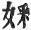.

[346:2](sbe1933.htm#fr_920) The Chinese is
'Lin-ping' for 'Lumbinî;' in the glossary the sound 'ping' is given as
equal to p(ing)-(m)i, i.e. 'pi.'

[346:3](sbe1933.htm#fr_921) The sounds produced
by gems striking one another. See glossary.

[349:1](sbe1933.htm#fr_922) I have substituted
 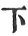 for  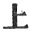 in the text.

[349:2](sbe1933.htm#fr_923) I have been obliged
here to substitute  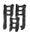 for
 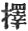.

[351:1](sbe1933.htm#fr_924) Before the word for
'precious,' the text has an expression kiau-lu, which is said to mean
curtain.

[351:2](sbe1933.htm#fr_925) This clause comes
in without any apparent connection with the context.

[352:1](sbe1933.htm#fr_926) These parenthetical
clauses appear to have crept into the text, and remained there without
any immediate connection.

[353:1](sbe1933.htm#fr_927) In Chinese
'hu-ming:' this was the name of Bodhisattva whilst resident in the
Tu*s*ita heaven.

[354:1](sbe1933.htm#fr_928) I take this from
the French translation of the Lalita Vistara; the Chinese expression is
 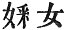.

[354:2](sbe1933.htm#fr_929) *K*u-ti en-*k*ü;
the French translation from the Tibetan renders this 'God above gods,'
and so in the next phrase, tsing-tsing-*k*ü, 'perfectly pure abode or
place,' the Tibetan refers this also to Bodhisattva, and translates it,
'Oh! thou pure being.' I do not see how to bring the Chinese text into
harmony with the Tibetan in this passage.

[355:1](sbe1933.htm#fr_930) I have been obliged
to supply this, the text being evidently corrupt.

[355:2](sbe1933.htm#fr_931) Ku-nih. This is the
transcription for *Kh*andaka, the coachman of Bodhisattva. It is
possible it may here represent' a personal attendant\_' only, whether
male or female. In the Lalita Vistara we read *S*âkyabadhû, the wives of
the *S*âkyas.

[355:3](sbe1933.htm#fr_932) I take siang here
in its usual (Buddhist) sense as equal to 'laksha*n*a' and fă as equal
to 'dharma' in the sense of 'substance.'

[356:1](sbe1933.htm#fr_933) Taou gin, this is
another instance of the use of this expression not for a Buddhist, but
for a religious man generally.

[356:2](sbe1933.htm#fr_934) Kun-to, which I can
only restore to *Kh*andas; in the sense of a verse or singing a verse.

[356:3](sbe1933.htm#fr_935) The sentence is
elliptical and difficult; literally rendered it would be 'scanning
Ka-i-pih-wang,' where I take Ka-i to be a form for Kapi(la) (just as the
expression Kiu-i, so commonly met with as the name of Bodhisattva's
wife, may be restored *t*o Gopî) and pih-wang (the white king) to be a
contracted form of *S*uddh(odana)-râ*g*a.

[357:1](sbe1933.htm#fr_936) Literally, 'in his
heart harbouring-hungry-void.'

[357:2](sbe1933.htm#fr_937) Why himself
invited, or condescended to come.

[357:3](sbe1933.htm#fr_938) Vîrya.

[358:1](sbe1933.htm#fr_939) Yih-sin generally
corresponds to the Sanskrit samyak; it denotes the condition enjoyed
during samâdhi.

[358:2](sbe1933.htm#fr_940) Viz. the four
qualities of heart named in the next line.

[358:3](sbe1933.htm#fr_941) Fan.

[358:4](sbe1933.htm#fr_942) Yan-hing, these
four are named in the line following.

[358:5](sbe1933.htm#fr_943) The thirty-seven
perfections necessary to the attainment of Bodhi. I have of thought it
necessary to name these in the text.

[359:1](sbe1933.htm#fr_944) That is, the three
degrees of *S*râvaka, Pratyeka Buddha, and Bodhisattva.

[359:2](sbe1933.htm#fr_945) This colour seems
to correspond with the Greek κύανος compare κυανο-χαίτης as applied to
Poseidon.

[359:3](sbe1933.htm#fr_946) Concealed, as in
the horse; but the whole of this part of the text is involved. This
refers to the thirteenth laksha*n*a, Koshopagatavasti*g*uhvatâ.

[360:1](sbe1933.htm#fr_947) There is a phrase
here used  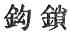 hook-lock,
which may possibly refer to the hooked form of the leg of the stag,
though this would hardly be a sign of beauty in a human being. \[It is
explained in the glossary as denoting the bones well knit together.\]

[360:2](sbe1933.htm#fr_948) Dust-water.

[361:1](sbe1933.htm#fr_949)  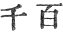 which is a phrase often used
for 'a great number;' see Notices on Chinese Grammar \[part i, by
Philo-Sinensis, Batavia. 1842\], p. 70; and compare Fă-hien, p. 161
(English edition), where M. Stanislas Julien has suggested another
reading.

[361:2](sbe1933.htm#fr_950) Taou-kang, reason
enclosure; this is the usual phrase for the Bodhi ma*nd*ala, or
enclosure round the Bodhi tree; it is difficult to translate in the
text.

[362:1](sbe1933.htm#fr_951) Tsang-yeh, increase
and augment. Used for *S*râvastî. Perhaps it should be Kapilavastu.

[362:2](sbe1933.htm#fr_952) In the original it
is 'let them &c. of born-time.' I take born-time to be a form of
Bodhisattva's name, 'Sarvârthasiddha,' because when this name was given
him, the king said, 'At the time of his birth all was prosperous.' But
it is obscure.

[362:3](sbe1933.htm#fr_953) Sing-shi.

[363:1](sbe1933.htm#fr_954) *K*ang-ye, viz. the
long night of pain.

[363:2](sbe1933.htm#fr_955) The expression
'gate,' e*g*.' gate of the law,' means generally a 'mode' or 'method'
(of salvation); hence the Devas are here said to be safe in the 'pure
mode' or 'method,' i.e. to be *S*uddhâvâsikas.

[363:3](sbe1933.htm#fr_956) Here the arrival of
the Devas is again referred to.

[364:1](sbe1933.htm#fr_957)  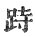 character of uncertain
signification.

------------------------------------------------------------------------

[Next: Note III. The Same Title Given to Different Works](sbe1934)
