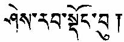

[Intangible Textual
Heritage](../../index) [Buddhism](../index) [Index](index) [Next](pref)

------------------------------------------------------------------------

# SHE-RAB DONG-BU

#### OR

## PRAJNYA DANDA

 

------------------------------------------------------------------------

#### BY LU-TRUB (NAGARJUNA)

------------------------------------------------------------------------

#### EDITED AND TRANSLATED BY MAJOR W. L. CAMPBELL, C.I.E., *Indian Army.*

------------------------------------------------------------------------

 

#### CALCUTTA:

##### THE CALCUTTA UNIVERSITY.

------------------------------------------------------------------------

##### 1919

------------------------------------------------------------------------

[Next](pref)
