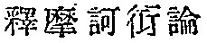
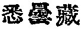

  
[Intangible Textual Heritage](../../index)  [Buddhism](../index) 
[Index](index)  [Previous](taf06)  [Next](taf08) 

------------------------------------------------------------------------

### NATIVITY AND PEREGRINATIONS.

There is not so much discordance in the traditions about the wanderings
of Açvaghosha as about his date, though indeed we do not have as yet any
means of ascertaining his birth-place, other than the statements

p. 18

of discordant authorities. According to Târanâtha, [1](#fn_33) he was a son of a rich Brahman called
Samghaguhya who married the tenth and youngest daughter of a merchant in
Khorta. As a youth, when thoroughly familiar with every department of
knowledge, he went to Odiviça, Gaura, Tîrahuti, Kâmarûpa, and some other
places, defeating everywhere his Buddhist opponents by his ingenious
logic.

All these places are situated in Eastern India, and among the Chinese
traditions the *Record of the Triratna* (*Li tai san pao chi*) as well
as the *Accounts of Buddha and the Patriarchs* (*Fo tsu tung chi*) agree
with Târanâtha in placing Açvaghosha's native land in the East; but the
*Life of Vasubandhu* makes Açvaghosha a native of Bhâshita in Çrâvastî,
while in Nâgârjuna's work, the *Mahâyânaçâstravyâkhyâ*   (*Shih mo ho yen lun*), he is
mentioned as having been born in Western India, Loka being the father
and Ghoṇâ the mother. The *Record of Buddha and the Patriarchs Under
Successive Dynasties* (*Fo tsu li tai t‘ung tsai*) agrees with neither
of the above statements, for it says ([*fasciculus*](errata.htm#3) 5):
"The twelfth patriarch, Açvaghosha Mahâsattva was a native of Vârâṇasî."
A further contradicting tradition is pointed out by Prof. S. Murakami in
one of his articles on the history of Buddhism, [2](#fn_34) quoting the *Shittanzô*   (*fas*. 1), which makes
Açvaghosha a man of South India.

p. 19

A majority of the traditions place his native country in East India; but
there is no means of confirming these. One thing, however, seems to be
certain, namely, that Açvaghosha was not born in the northern part of
India, which place is supposed by most Western Buddhist scholars to be
the cradle of the Mahâyâna school.

Wherever the native country of Açvaghosha may have been, both the
Chinese and Tibetan records agree that he made a journey to Central
India, or Magadha. it seems that every intellectual man in India, the
people of which, living in affluence, were not occupied with the cares
of making a living, sought to gain renown by dialectics and subtle
reasonings, and Açvaghosha, as a Brahman whose "intellectual
acquirements were wonderfully deep," and whose "penetrating insight was
matchless," [1](#fn_35) could not resist the
temptation. Not satisfied with his intellectual campaign against
commonplace Buddhists in his neighborhood, who were crushed down as
"rotten wood before a raging hurricane," [2](#fn_36) he went, according to a Chinese tradition,
to Pâṭaliputra, and according to the Tibetan, to Nâlanda. The *Life of
Açvaghosha* evidently refers to this fact when it states that Parçva,
the eleventh patriarch and eventual teacher of Açvaghosha, on being
informed of the paramount influence of the Brahman

p. 20

tîrthaka (i.e., Açvaghosha) in Central India and of the fact that his
conquest over Buddhists had silenced the bell (*ghanta*) in some
monastery (*vihâra*), journeyed from Northern India to convert the
bitterest opponent into a faithful follower of Buddha. He adds that
Açvaghosha left his home and lived henceforth in Central India. But
according to the *Transmission of the Dharmapitaka* (*Fu fa tsang
ch‘uan*, *fas*. 5) we find Açvaghosha even after his conversion still in
Pâṭaliputra, from which he was taken by King Kanishka to the latter's
own capital, Gandhâra, in the Northwest of India.

Thus all that we can say about the birth-place and wanderings of
Açvaghosha is: (1) he was a Brahman by birth either of South, or of
West, or of East, but not of North India; (2) he acquired in Central
India his highest reputation as a Brahman disputant, and, after his
conversion, as the greatest Buddha follower of the time, intellectually
as well as morally; (3) his later life was spent according to the
Chinese authority in the North where he wrote probably the
*Mahâlamkâra-sûtraçâstra* (*Book of Great Glory)* which describes
matters mostly relating to Western India.

------------------------------------------------------------------------

### Footnotes

[18:1](taf07.htm#fr_33) *Geschichte des
Buddhismus*, p. 90.

[18:2](taf07.htm#fr_34) The *Bukkyô Shirin*,
Vol. I., No. 6. 1894. Tokyo, Japan.

[19:1](taf07.htm#fr_35) The *Transmission of the
Dharmapitaka* (*Fu fa tsang ch‘uan*, *fas*. 5).

[19:2](taf07.htm#fr_36) The same as above.

------------------------------------------------------------------------

[Next: Appellations](taf08)
