  
[Intangible Textual Heritage](../../index)  [Buddhism](../index) 
[Index](index)  [Previous](taf29)  [Next](taf31) 

------------------------------------------------------------------------

p. 151

# GLOSSARY.

Activity-consciousness  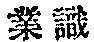
*yeh shih*, *karmavijñâna*? the assertion of the "Will to Live."

Affectional hindrance  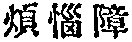
*fan nao chang*, *kleçâvarana*, hindrance to the attainment of Nirvâna,
arising from the assertion of the "Will to Live."

Affirmation, or Non-emptiness, 
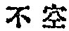 *pu k‘ung*, *açûnyatâ*, suchness as constituting the
basis of reality; it is equivalent to the Tathâgata's Womb.

All-conserving mind, The, 
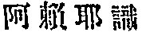, *a lai ya shih*, or *tsang shih*, or  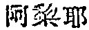 *a li ya*,  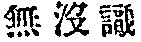 *mu mo shih*, *âlaya-vijñâna*,
a stage in the evolution of suchness, in which consciousness is awakened
to recognise a distinction between suchness and birth-and-death.

Aspiration  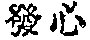 *fa hsin*,
*cittotpâda*, desire to attain the most perfect knowledge.

Âtman  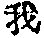 *wu*, (1)
ego-soul; (2) noumenon or thing-in-itself. Anâtman is a negative form of
the same.

Birth-and-death  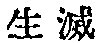 *shêng
mieh*, *samsâra*, the material principle in contradistinction to the
formal principle, suchness.

Consciousness  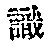 *shih*,
*vijñâna*, mentation in general.

Defilement  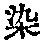, *jan*, a
cognisance of dual aspect of suchness; not necessarily moral or
intellectual fault.

Dharma  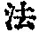 *fa*, (1) that
which subsists, or substance; (2) law, doctrine, or regulative
principle.

Dharmakâya  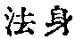 *fa shên*,
absolute being, or absolute knowledge when considered from the
idealistic point of view.

Ego  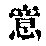 *i*, *manas*, the
subjective mind which believes consciously or unconsciously in the
existence of the ego-soul.

p. 152

Ego-consciousness  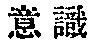 *i
shih*, *manovijñâna*, egocentric thoughts in general; the mind that
makes a deliberate assumption of a dualistic existence of the ego and
the non-ego,

Enlightenment  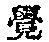 *chiao*
(*buddhi*?), another name for suchness, psychologically considered.

Evolving-consciousness  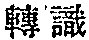
*chuan shih*, *pravrtti-vijñâna*, a state of suchness out of which
mentation in general evolves.

Ignorance  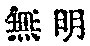 *wu ming*,
*avidya*, a state of suchness in its evolution; practically the same as
birth-and-death.

Intellectual hindrance  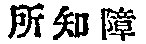
*so chih chang*, [*jñeyâvarana*](errata.htm#25), the hindrance to the
attainment of Nirvâna, which arises from intellectual prejudices.

Interrelated defilement  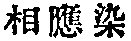
*hsiang ying jan*, a conscious assertion of dualism.

Karma-hindrance, *yeh chang*, *karmâvarana*, the hindrance in the way to
Nirvâna, that is brought forth by evil deeds done in previous lives.

Mahâyâna  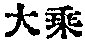 *tai chang*,
literally, great conveyance, another name for suchness.

Means. or expediency  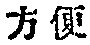
*fang pien*, *upâya*, when philosophically considered, the process of
evolution, whereby the unconditional suchness becomes conditional.

Mind  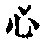 *hsin*, *citta*,
relative aspect of suchness. Soul, mind, and suchness are to a certain
extent synonymous, but in this translation the following distinction is
made: Suchness, when unqualified, signifies its absolute aspect and is
practically the same with the soul, while the term mind is used to
denote a state of suchness in its operation or evolution.

Negation, or emptiness  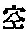
*k‘ung*, *çûnyatâ*, an aspect of suchness as transcending all forms of
[relativity](errata.htm#26).

Nirvâna  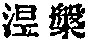 *nieh p‘an*, the
recognition of the truth or suchness.

Non-enlightenment  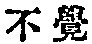 *pu
chiao* (*nirbuddhi*?), another name for ignorance, psychologically
considered. Non-enlightenment, defilement, birth-and-death, and
ignorance, are more or. less synonymous and interchangeable.

Non-particularisation  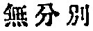
*wu fên pieh*, the subjective attitude that is free from a deliberate
assertion of dualism; i is similar in a sense to Lao-Tze's
"Non-assertion."

p. 153

Not-interrelated defilement 
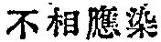 *pu hsiang ying jan*, an unconscious assertion of
dualism.

Particularisation-consciousness 
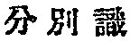 *fên pieh shih*, the consciousness that adheres to
the dual aspect of existence; a synonym of
phenomena-particularising-consciousness.

Prejudice  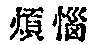 *fan nao*,
*âçrava* or *kleça*, the subjectivity that averts the due exercise of
will and intellect.

Samâdhi  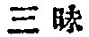 *san mei*, or
 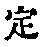 *ting*, literally
equilibrium, a state of consciousness in which all modes of mental
activity are in equilibrium.

Soul  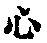 *hsin*, *hrdaya* or
*citta*, that which constitutes the kernel of things, but not in the
Christian conception of the word; a synonym of absolute suchness.

Soul as birth-and-death,  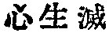
*hsin shêng mieh*, relative aspect of suchness as material principle; a
synonym of ignorance.

Soul as suchness  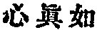 *hsin
chen ju*, absolute aspect of suchness as purely formal.

Subjectivity  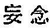 *wang
nien*, or  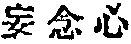 *wang nien
hsin*, or  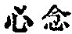 *hsin nien*,
or simply  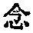 *nien*,
*smrti*, literally, recollection or memory, or  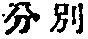 *fên piéh*, particularisation;
the mentation that is not in accordance with the conception of suchness.

Suchness  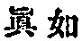 *chên ju*,
*bhûtatathatâ*, the highest reality, or the "purely formal" aspect of
existence.

Tathâgata's womb  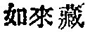 *ju lai
tsang*, *tathâgata-garbha*, a state of suchness as containing every
possible merit.

Totality of things  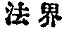 *fah
chieh*, *dharmadhâtu*, literally, the basis of things, that is, the
universe as a whole.

Vow  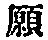 *yüan*, or  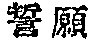 *shih yüan*, *pranidhâna*,
commonly translated prayer, but not in the Christian sense, for
Buddhists think that a vow or vehement desire has power enough to
achieve what is desired, according to their idealistic conception of the
world.

------------------------------------------------------------------------

[Next: Corrigenda](taf31)
