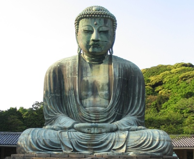

  
[Intangible Textual Heritage](../../index)  [Buddhism](../index) 

------------------------------------------------------------------------

[Buy this Book at
Amazon.com](https://www.amazon.com/exec/obidos/ASIN/B002D48Q84/internetsacredte)

------------------------------------------------------------------------

<table width="75%">
<colgroup>
<col style="width: 50%" />
<col style="width: 50%" />
</colgroup>
<tbody>
<tr class="odd">
<td width="50%" data-valign="TOP"></td>
<td width="50%" data-valign="CENTER"><h1 id="the-buddhist-catechism" data-align="CENTER">The Buddhist Catechism</h1>
<h2 id="by-henry-s.-olcott" data-align="CENTER">by Henry S. Olcott</h2>
<h4 id="section" data-align="CENTER">[1908]</h4></td>
</tr>
</tbody>
</table>

------------------------------------------------------------------------

[Contents](#contents)    [Start Reading](tbc00)    [Page
Index](pageidx)    [Text \[Zipped\]](tbc.txt.gz)

------------------------------------------------------------------------

|                                                                                                                           |
|---------------------------------------------------------------------------------------------------------------------------|
|  |

Colonel Henry Steel Olcott \[1832-1907\] was the first western Buddhist
convert, probably since antiquity. He co-founded the Theosophical
Society and was its first president. The only contributor to the 19th
century southern Buddhist revival who was born a Protestant, Olcott was
able to promote Eastern ideas to western society.

The Buddhist Catechism was Olcott's attempt to elucidate the basic
doctrines of Buddhism in an ecumenical way. This book is still in use
today in Sri Lanka. Olcott is fondly remembered in Sri Lanka and by
Theosophists world-wide.

------------------------------------------------------------------------

 [Title Page](tbc00)  
[Dedication](tbc01)  
[Contents](tbc02)  
[Certificates, First and Third-Third edition](tbc03)  
[Preface to the Thirty-Third Edition](tbc04)  
[Preface to the Thirty-Sixth Edition](tbc05)  
[Preface to the Fortieth Edition](tbc06)  
[Preface to the Forty-Second Edition](tbc07)  
[Part I. The Life of the Buddha](tbc08)  
[Part II. The Dharma or Doctrine](tbc09)  
[Part III. The Sangha](tbc10)  
[Part IV. The Rise and Spread of Buddhism](tbc11)  
[Part V. Buddhism and Science](tbc12)  
[Appendix](tbc13)  
[Bibliography](tbc14)  
