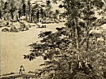

  
[Intangible Textual Heritage](../../index)  [Buddhism](../index) 
[Wisdom of the East](../../woe/index)  [Index](index) 
[Previous](tpol02)  [Next](tpol04) 

------------------------------------------------------------------------

  
*The Path of Light*, by L.D. Barnett, \[1909\], at Intangible Textual
Heritage

------------------------------------------------------------------------

p. 7

# THE PATH OF LIGHT

### INTRODUCTION

"WHEN the religion formerly received is rent by discords," remarks Bacon
in his subtle essay on the "Vicissitudes of Things," "and when the
holiness of the professors of religion is decayed and full of scandal,
and withal the times be stupid, ignorant, and barbarous, you may doubt
the springing up of a new sect; if then also there should arise any
extravagant and strange spirit to make himself author thereof. If a new
sect have not two properties, fear it not, for it will not spread: the
one is the supplanting, or the opposing of authority established—for
nothing is more popular than that; the other is the giving licence to
pleasures and a voluptuous life: for as for speculative heresies (such
as were in ancient times the Arians, and now the Arminians), though they
work mightily upon men's wits, they do not produce any great alteration
in States, except it be by the help of civil

p. 8

occasions. There be three manners of plantations of new sects: by the
power of signs and miracles; by the eloquence and wisdom of speech and
persuasion; and by the sword. For martyrdoms, I reckon them amongst
miracles, because they seem to exceed the strength of human nature; and
I may do the like of superlative and admirable holiness of life."

So far as his range of knowledge extended, Bacon's remarks are true. But
when we attempt to apply them to the history of Buddhism, we find that
they need considerable qualification. Buddhism arose in an age when "the
holiness of the professors of religion," the influence of the Brahman
hierarchy in India, was "decayed and full of scandal." But the times,
far from being "stupid, ignorant, and barbarous," were full of eager
intellectual and moral activity; on all sides ancient doctrines were
being reaffirmed by their professors and assailed by critics, while new
systems of thought were rising everywhere. The Buddha. himself was not
an "extravagant and strange spirit," but a man whose thought in
essentials was thoroughly in harmony with the ideas of Hinduism, and
whose character fulfilled a Hindu ideal. His Church did indeed endeavour
to supplant the authority of the Brahmans; but it sought to attain this
end neither by "the giving licence to pleasures and a voluptuous life,"
nor by the sword. Its marvellous success was clue to

p. 9

\[paragraph continues\] "the eloquence and
wisdom of speech and persuasion" and to "the superlative and admirable
holiness of life" of the Buddha.

About a hundred miles north from Benares, on the border of Nepal, where
the plain of the Ganges begins to rise to the uplands at the edge of the
mighty Himalayas, lies a little region which was once the home of the
Śākyas, a class of Kshatriyas, or men of the warrior caste. To
Suddhodana of Kapila-vastu, a nobleman of the Gautama family of this
tribe, was born about 660 B.C. a. son Siddhārtha. When he grew up
Siddhārtha likewise married and begot a son, Rāhula, by name. And then,
when he was about twenty-nine years of age, as tradition relates,
Siddhārtha became weary of the world and the flesh. The ghastly riddle
of Life—Life with its endless vicissitudes of phantom pleasure and
ever-renewed pain—was ceaselessly pressing itself upon him, as it has
pressed itself upon so many thousands of other Hindus, and he could find
no rest in his father's home. So he left the world, to become a
wandering beggar-student, in the hope of finding the key to the great
mystery in the teachings of some master of philosophic lore. But none of
the teachers whom he met could satisfy the hunger of his soul, and the
severest mortification of the flesh brought him no light.

One day, as he sat meditating in the shadow of a fig-tree, his long
searchings of heart came to

p. 10

an end, and the answer to the mystery of life was revealed to him.
Henceforth he was the Buddha, the Enlightened Seer, who had won the
perfect peace of spiritual knowledge, the Nirvāṇa [1](#fn_0); and the remaining years of his long life
were passed in imparting his teaching for the salvation of his
fellow-creatures, and thus founding the Buddhist Church, until about 482
B.C., full of years and honour, he departed to the supreme Nirvāṇa.

When we examine the doctrines which appear to have been taught by the
Buddha, [2](#fn_1) we see that they are founded
upon two ancient conceptions that are characteristic of Hindu thought:
the pessimistic idea of *Karma*, and the *Saṃsāra*, "works" and
"wandering." According to the usual Indian creed, the Universe is
tenanted by a countless number of souls in various degrees of elevation;
and each of them must pass through an endless number of births and
deaths in the most various kinds of bodies. Every moment of experience
that each soul undergoes in each incarnation is the direct result of an
act performed in a former birth or later, and in its turn bears fruit in
a future experience, thus forming a series of sorrows without beginning
and without

p. 11

end. For life, however pleasant it may seem, is in reality but a long
illusive agony, from which only the few escape who by their perfect
spiritual insight win to identity with the transcendental Being, Brahma.

Now the Buddha, according to the ancient tradition of the Pali Canon,
dissented from this teaching on one very important point. He denied that
there is a soul in the individual, and that there is a God, or Supreme
Being, working in the manifold phenomena of the universe. Of course he
believed in gods: no Hindu has ever seriously called them into question;
but the gods, according to him, differed only in degree from mankind,
and neither class possessed that permanent centre of thought, that
unchanging identity of consciousness, which we call "soul" or "self."
Our thoughts are never quite the same from second to second; our mental
life is only a series of causally connected instants of consciousness.
By this denial the Buddha thought that he could more readily remove the
moral and intellectual weakness of humanity which is founded upon the
conception "I am"; for if there is no real subject of thought, no "soul"
or "self," it cane of predicate its own existence, and therefore cannot
conceive selfish desire. And desire is the root of embodied life, and
therefore of all evil.

The Buddha therefore taught a "Middle Path,"

p. 12

equally remote from worldly ways and from extreme asceticism, the "Noble
Path of Eight Members." The members of this Path are as follows: *Right
Views*, or acceptance of the Buddha's teachings which we have above set
forth; *Right Desires*, or pure aspirations making for righteousness,
charity, and purity of heart; *Right Speech*; *Right conduct*; *Right
Livelihood*; *Right Effort*, or constant intentness to avoid lapses into
frailties of thought or conduct; *Right Mindfulness*, or continual
dwelling of the memory on the teachings of the Faith for the same
purpose; and *Right Ecstasy*, or spiritual exercises tending to promote
the peace and sanctity of the mind. This "Noble Path" is one of the four
"Noble Truths" which are the pillars of the Buddha's system—to wit, the
fact that life is miserable, the fact that its miser has a cause, the
fact that this cause can be killed and thereby the sorrow of life
removed, and the fact that the "Noble Path" is the only method that can
attain this end, for it destroys the selfish individualism inherent in
the human mind, the "original sin," and creates a universal knowledge
and sympathy and a spiritual calm and purity which are salvation.

The Buddha's doctrine as to the real nature of Being and consciousness
was expressed in a famous formula, called in Sanskrit
*Pratītya-samutpāda* and in Pali *Paṭichcha-samuppāda*,

p. 13

which means "origination in a causal series." The members of this series
are as follows

Ignorance (Sanskrit, *avidyā*; Pali, *avijjā*).

Conformations (Sanskrit, saṃskāras; Pali, *saṃkhārā*).

Consciousness (Sanskrit, *vijnāna*; Pali, *viraññāna*).

Name and Form (Sanskrit and Pali, *nāma-rūpa*).

Six sense-organs (Sanskrit, *shaḍ-āyatana*; Pali, *sa.lăyatana*).

Contact (Sanskrit, *sparśa*; Pali, *phassa*).

Feeling (Sanskrit and Pali, *vedaṇā*).

Desire (Sanskrit, *tṛishṇū*; Pali, *tanhă*).

Attraction (Sanskrit and Pali, *upādāna*).

Being (Sanskrit and Pali, *bhava*).

Birth (Sanskrit and Pali, *jāti*).

Age and Death (Sanskrit and Pali, *jară-maraṇa*), grief, lamentation,
pain, depression, and despair (Sanskrit,
*śoka-paridevana-duḥkka-daurmanasyau-upayāsa*).

There are very few dogmas in the whole history of philosophy and
religion that have been so copiously discussed and so differently
interpreted as this. It seems to be an attempt to show how individual
existences and consciousnesses arise in the cosmic process. According to
Buddhist teaching, there is no permanent "soul" and there is no real
"matter." There exists only an infinite number of series of
consciousnesses either potentially or actively in operation, and each
series consists of a succession of moments of

p. 14

consciousness, each moment being the direct resultant of its
predecessors. Now the force which directs this process in each series is
its *karma*, or "works," the influence of former activities, mostly in
previous births; it is by reason of its former karma that a train of
consciousness at a particular moment begins to develop itself into an
"individual," that is to say, a consciousness of being a particular
person, human, divine, or animal. So we may interpret the Buddha's
formula as a vague expression for the manner in which the individual
emerges from the ocean of cosmic being. First in order is "ignorance";
that is to say, when we analyse the operation of karma upon a train of
moments of consciousness, we find that its primary effect is to cause
ignorance, namely, the false belief held by this consciousness that it
is a "self," an ego, and the other consequent delusions. This ignorance,
in turn, issues in "conformations," the potentialities of love, hatred,
and the like weaknesses of the spirit, which are the resultants of
activities in previous individuated existences, and inspire to future
activities. Then emerges consciousness of finite being in general, and
from this issue "name and form," the conception of a definite world of
particulars. This leads to the evolution of the sense-organs, and the
union of these with the apparent world outside them produces sensation,
which issues in desire. In its turn desire leads to

p. 15

\[paragraph continues\] "attraction," the
attachment to individual life. So finite existence, *bhava*, is at last
reached, and the developed consciousness passes through the stages of
birth, disease, sorrow, and finally death. Then the process begins anew
under the guidance of the old karma, reinforced by that which has
resulted from the process that has just come to an end. If this
interpretation be right (and. it must be confessed that several others
are equally plausible), it is evident that the formula is by no means
satisfactory on all points; the causal connection between several of the
members in the series in the Pratītya-samutpāda is far from being clear,
and can only he regarded as a dogma—*past hoc, ergo propter hoc*.

An individual, according to Buddhist teaching, does not really exist;
but the semblance of an individual, the phenomenal personality, is a
fact that cannot be denied, and must be explained. The Buddhists explain
it by saying that it is a combination of Name and Form. In "Name" are
included all the subjective phenomena of thought, namely, feeling,
general notions, "conformations," and definite consciousness, which are
called "aggregations" (in Sanskrit, *skandhas*; in Pali, *khandhas*).
"Form," meaning the four elements of physical nature (earth, water,
fire, and air) and their products, is a fifth khandha. As we have seen,
the force that unites these five [khandhas](errata.htm#0) into an
apparent individual or personality

p. 16

is what is called in Sanskrit *karma*, in Pali *kamma*, the resultant of
all his previous acts. "When a man dies, the khandhas of which he is
constituted perish, but by the force of his kamma a new set of khandhas
instantly starts into existence, and a new being appears in another
world, who, though possessing different khandhas and a different form,
is in reality identical with the man just passed away, because his
kamma, is the same. Kamma, then, is the link that preserves the identity
of a being through all the countless changes which it undergoes in its
progress through Saṃśāra." [1](#fn_2) Now the
great purpose of Buddhism, like that of most Hindu faiths, is to enable
the believer to reach the perfect spiritual peace of Nirvāṇa, and thus
come to an end of the cycle of embodied births. To attain this object he
must destroy his kamma; and this can be done by walking in the "Noble
Path," which will infallibly lead him, either in his present birth or
later, to final salvation.

This is, in broad outline, the teaching of Buddhism as it is understood
by most Buddhists in Ceylon and Further India. In theory it verges upon
nihilistic idealism, for it regards all the data of finite experience as
pure subjective phenomena corresponding to no objective reality, and
created merely by the force of karma; there is no higher Power than
man's own will, and his karma to

p. 17

help him towards salvation. On the deepest mysteries of existence, the
origin of karma and the condition of the spirit after it has passed away
for ever from the cycle of births, Buddhism has nothing to tell us. In
practice it is a creed that fosters in its votaries in abundant measure
both the homely virtues of laic Life, and the higher spiritual
aspirations of asceticism; and its ideals are well expressed in one of
its best known texts, the Mangala-sutta of the Sutta-nipāta:

"Following not the foolish, following the learned, reverence for the
worshipful—this is the highest blessing."

"Dwelling in a meet land, merit from deeds clone of old, due heed to
one's own spirit—this is the highest blessing."

"Depth of learning, craftsmanship, gentle breeding well taught, words
well spoken—this is the highest blessing."

"Service to father and mother, the company of wife and child, and
peaceful pursuits—this is the highest blessing."

"Almsgiving and righteousness, the company of kinsfolk, blameless
works—this is the highest blessing."

"Withholding and withdrawing oneself from sin, abstinence from strong
drink, heedfulness in doing duty—this is the highest  blessing."

"Reverence and humility, cheerfulness and

p. 18

gratitude, listening in. due season to the Law—this is the highest
blessing."

"Long-suffering, gentleness of speech, sight of godly men, conversation
upon the Law in due season—this is the highest blessing."

"Mortification of the flesh and chastity, vision of the Noble Truths,
and winning to the Nirvāṇa —this is the highest blessing."

"He whose spirit is stirred not when he is touched by the shows of the
world, but abides unsorrowing, undefiled, and happy—this is the highest
blessing."

"They who do thus, and are never overwhelmed, come ever to
salvation—theirs is this highest blessing."

But an important question arises here. Are the doctrines which we have
outlined the original teaching of the Buddha, or do they not rather
represent the opinions of the school which formed the Pali Canon some
centuries after his death—a monastic fraternity with a strong bent
towards rationalism? Even in this Canon the teachings ascribed to the
Master are full of logical inconsistencies. What then was the Master's
own doctrine?

Certain knowledge on this point is impossible. But it seems most likely
that the Buddha's real attitude was somewhat like that of the positivist
and agnostic. He had no revelations to communicate on the highest
problems of philosophy and

p. 19

theology. Sometimes he seems to have inclined in his utterances to one
side, sometimes to another; but this was apparently for the sake of
argument, and there seems to be much truth in the tradition which
represents him as having forbidden his followers to speculate upon the
deepest question of life. Even of Nirvāṇa. he refused to give any
definition; when the question was bluntly put by an inquiring monk, he
was told that he would never know anything about it. It is even doubtful
whether his denial of the Self was an essential part of his doctrine, or
whether it was only adopted for purposes of controversy. His great aim
was practical. He sought to impart a remedy for the world's sorrow, to
teach his fellow-creatures an escape from. their karma and its fatal
fruit of earthly birth. This remedy was the utter destruction of desire,
even of the desire for salvation. It could be attained by the man or
woman who renounced the world, entered into the monastic order, followed
the "Noble Path," and in perfect calm and happiness of spirit waited
until death should open the portals of the unknowable, everlasting
Stillness from which there is no return. Karma and its resultant
metempsychosis were to him facts of practical experience, and could be
remedied by an empirical method, the suppression of desire under a
practical law of conduct; as to their metaphysical basis he made no
revelation. It

p. 20

is as the departed Teacher of the way to Nirvāṇa, as the Master, that he
is worshipped by the orthodox.

But there were other elements in the doctrine of early Buddhism which
could not fail to bear fruit. As we have already remarked, it lays
stress on the impermanence of beings: nothing finite exists in itself,
everything is a collection of skandhas temporarily united. It is, in
fact, a theory of "phenomenalism," and thus opened a way for development
in two directions. On the one hand there grow up a school of nihilism,
which dialectically established the non-existence of everything; on the
other hand arose an idealism which arrived at very similar conclusions.

In another and more practical issue the newer teaching departed from the
old. The Buddha Gautama, according to the doctrine of his Church, was
preceded by twenty-four other Buddhas, each of whom is supposed to have
preached the same Law in different ages of the world. Now a Buddha can
only attain the rank of Buddhahood after a long course of spiritual
progress in former births of the most various kinds. A being thus
destined to Buddhahood is called a *Bodhi-sattva*, or "creature of
enlightenment." At some point in his existence he has conceived an
aspiration to become a Buddha for the salvation of his fellow-creatures,
and thenceforth he advances in

p. 21

birth after birth to higher and higher sanctity in the practice of the
ten Perfections [1](#fn_3) until at last he is
born as the Buddha, preaches the Law, and passes away into the
everlasting stillness of Nirvāṇa. A vast amount of Buddhist literature
consists of *Jātakas*, or legends of the deeds in which the
Bodhi-sattvas proved their fitness for their high mission.

It was around these points that the breach arose which split the Church
into the divisions which we commonly and somewhat. inaccurately
distinguish as Northern and Southern Buddhism. The older Buddhism that
we have surveyed in. outline did not. give enough play for the elements
of mysticism and emotion that have always been strong in the Hindu
spirit. Its saints, the Arhats, were regularly ordained members of
monastic fraternities, who sought salvation for themselves and denied
Nirvāṇa to laymen; and though their deeds of charity and other
righteousness were incontestable, it was argued that their merit was
marred by this self-seeking. Its theology was very sober, according to
Indian standards; it tended towards intellectualism, and allowed little
room for the large and highly coloured mythological imagination in which
the

p. 22

\[paragraph continues\] Hindu thought
revels. Now during the early centuries of Buddhism the Vishnuite Church
grew rapidly, and the spirit that inspired it was stirring likewise in
Buddhism. This force was what the Hindus call *bhakti*, a passionate
emotional worship of a supreme God revealed on earth in human
personality. Many Buddhists also longed to find a supreme God, to whom
they could offer a worship of the heart, and whose personality could
satisfy their restless imaginations. Thus arose upon the old foundations
a new Church, a vast and gorgeous edifice of soaring fancy tenanted by
countless Buddhas and Bodhi-sattvas transfigured into a magnificent
brilliance of godhead and worshipped with a passionate fervour of
sell-surrendering love. The new Church held out to all alike the
dazzling hope of Buddhahood. Every man, however humble or sinful, might
become a Bodhisattva, a candidate for Buddhahood, and finally reach that
blessed end, if he would but will it so and hold to his purpose. Love
for the holy Buddhas and Bodhi-sattvas of the past, the omnipotent and
omnipresent hierarchy of Heaven, and love for his fellow-creatures,
manifested in perfect self-sacrifice for their needs, active compassion
and charity, were the prime requisites for salvation. Inspired by this
vivid energy, the new Buddhism speedily took possession of Northern
India, Tibet, Central Asia, and China.

p. 23

That this movement was antinomian and fraught with danger from the
first, is obvious. Its doctrine of love unfettered by considerations of
social expediency and ordinary morality, [1](#fn_4) and the wild luxuriance of its myth, were
capable of working harm as well as good, and in practice have often lent
themselves to the most disgraceful abuse. But on this dark side of the
picture we need not dwell here. It is enough that we should recognise
that the *Mahā-yāna*, the "Great Vehicle," as the new Church proudly
called itself, in opposition to the more primitive Buddhism, which it
scornfully styled *Hīna-yāna*, the "Little Vehicle," laid especial
stress upon the emotional side of religion and ethics, which had been
somewhat neglected in the latter school, and that it thus gained a novel
character and significance.

In the doctrine of the older schools the Buddha was a teacher whose
enlightenment raised him above all the gods, hut withal a man, who had
passed away from the world for ever, and could no more wield any
influence upon it, save as a holy and blessed memory. His Nirvāṇa was
the same as that of any other man who should attain it. He dispensed no
divine power to bring his followers to salvation; only their own efforts

p. 24

could win for them that goal. Man's destiny is moulded by his own acts,
his "karma," and each individual's karma concerns him alone, and cannot
be applied for the spiritual weal of another. Lastly, as we have already
remarked, salvation was confined to the monastic orders.

The Mahā-yāna changed almost everything. The Buddha now appeared as a
god of the first order, invested with all the qualities that the most
extravagant mythopœic imagination could suggest. Like the conception of
Christ in the Docetic schools, he was imagined as existing throughout
the whole of the cosmic period, in the "Body of Enjoyment" visible to
the beatified Bodhi-sattvas, and the "Body of Magic Form" revealed to
common mortals; and he was multiplied to infinity. Imagination created
countless periods and countless domains, each under the presidency of a
Buddha; and from the beginning of our era we observe that the historical
Gautama. Buddha, even in his most mythical disguise, begins to fall into
the background, whilst other figures of purely mythical origin become
the first favourites of popular fancy. The most conspicuous of these is
the Buddha Amitābha, "He of Infinite Light," a being of supreme
splendour and grace; for now the Buddhas have become active dispensers
of grace, at any rate from the standpoint of relative truth. Each Buddha
dwells in his paradise amidst a retinue of Bodhisattvas;

p. 25

of the latter the two highest in rank serve as the ministers of his
grace, constantly visiting the worlds under his rule in. the forms most
suitable to their purpose, in order to show their love for suffering
mortality by helping them in divers ways and leading them to paradise.
The paradise of Amitābha is *Sukāvatī*, "The Happy Place," a fairyland
which is tenanted by an entirely divine population dwelling in perfect
bliss. [1](#fn_5) Amitābha's chief minister is
Avalokiteśvara, a Bodhi-sattva who has taken a vow not to enter Nirvāṇa
until he has led thither all living creatures, and who for this supreme
grace is worshipped throughout the North with a corresponding fervour of
devotion. As a last development of this mythology, the Buddhas are
associated with Tārās, or Saviour-Ladies, who under the form of sexual
antithesis typify their consorts’ energy of grace.

The moral standpoint is likewise changed. The ideal is no longer the
calm, ascetic monk, waiting in cheerful tranquillity for the end, but
the Bodhi-sattva, the self-appointed votary seeking eagerly to procure
happiness for his fellow-creatures at any cost, even if he must
surrender his own. right to spiritual advancement as the price. For now
is affirmed the principle of

p. 26

*pariṇāmanā*: the karma of an individual is no longer confined to his
experience, but can be made to redound to the benefit of others. The
righteous can, of their own free will, sacrifice the merit of their own
good deeds for the happiness of their fellow-creatures. Strictly
speaking, as we shall see, the ideas of "self," "non-self," "happiness,"
and "suffering" are illusions. They are real only from the standpoint,
of relative truth. But this condition of imperfect reality is
inseparable from humanity; it must be accepted and made the basis of a
moral activity which by perfect self-sacrifice purifies the spirit from
the taint of finite error. And so Sānti-deva ends his Bodhichayāvatāra
with a chapter of prayer that the merit gained by him by his work may
not only uplift him to the higher grades of beatification as a
Bodhi-sattva, but may be also diverted for the benefit of
fellow-creatures.

"Through the blessing which comes to me for pondering upon the entrance
into the Path of Enlightenment, may all beings be brightened by walking
in Enlightenment. May all that are sick of body and soul in every region
find oceans of bliss and delight through my merits. Whilst embodied life
lasts on, may they never lack happiness, and for ever may the world win
the joy of the Sons of Enlightenment. In all the hells that are in the
spheres of the universe may creatures rejoice in the delights of
paradise. May

p. 27

they that are afflicted with cold find warmth, the heat-smitten he
cooled in the oceans raining from the mighty clouds of the Son of
Enlightenment. . . . May all skies be gracious to all wayfarers, and may
they encompass as they purpose the enterprise for which they journey.
May such as travel on ship achieve their desire, and come in happiness
to shore and rejoice with their kindred. May they who stray amid
wildernesses find company of travellers’ troops, and journey on without
dread of bandits and wild beasts. In the stress of sickness,
wildernesses, and the like may the heavenly powers guard the slumbering,
the distraught, and the heedless, the masterless, the young, and the
aged. May they be for ever saved from all mischance, dowered with faith,
understanding, and tenderness, and possessed of goodly shape and virtue.
May their storehouses never fail and their treasuries rise to the skies,
and may they live in freedom, without strife or affliction. May beings
of little strength win much strength, and the hapless creatures that are
of ill form become goodly. May all women in the world become men; and to
their estate may the humble come, and lose their vanity. Through this my
merit may all beings cease from every sin, and everlastingly do
righteousness, lacking not the Thought of Enlightenment, surrendering
themselves to the Path of Enlightenment, withholding their hands

p. 28

from the works of the Tempter, and be taken into the arms of the
Enlightened. May all creatures have boundless term of age; may they live
for ever in bliss, and the very name of death perish. May all regions
become filled with Buddhas and Sons of the Buddhas, [1](#fn_6) and lovely with groves of the Trees of
Desire ravishing the heart with the sound of the Law. . . As long as the
heavens and the earth abide, may I continue to overcome the world's
sorrows. May all the world's suffering be cast upon me, and may the
world be made happy by all the merits of the Bodhi-sattva."

In its metaphysics the Mahā-yāna carried to a logical conclusion the
nihilistic idealism that had begun to find expression in the older
schools. Its cardinal doctrine is that "all is void." Everything that is
conceived or can be conceived by the mind is but a subjective
imagination in constant flux, existing only in instants of the thought
of the subject and by virtue of his karma. No permanent reality can be
predicated of it, except that it is really "void." "There are five
skandhas, [2](#fn_7) and these he considered as
by their nature empty. Form is emptiness, and emptiness indeed is form.
. . . Thus perception, name, conception, acid knowledge also are
emptiness. Thus, O Śāriputra, all things have the character of
emptiness, they have no beginning, no end,

p. 29

they are faultless and not faultless, they are not imperfect and not
perfect. Therefore, O Śāriputra, hero in this emptiness there is no
form, no perception, no name, no concept, no knowledge. No eye, ear,
nose, tongue, body, and mind. No form, sound, smell, taste, touch, and
objects There is no knowledge., no ignorance, no destruction (of
ignorance). . . there is no decay and death, no destruction of decay and
death; there are not (the Four Truths, [1](#fn_8)
viz.) that there is pain, origin of pain, stoppage of pain, and the path
to it. There is no knowledge, no obtaining, no not-obtaining, of
Nirvāṇa. Therefore, O Śāriputra, as there is no obtaining (of Nirvāṇa),
a man who has approached the Prajnā-pāramitā, [2](#fn_9) of the Bodhisattvas dwells (for a time)
enveloped in consciousness. But when the envelopment of consciousness
has been annihilated, then he becomes free of all fear, beyond the reach
of change, enjoying final Nirvāṇa." [3](#fn_10)

Thus everything, even the most fundamental doctrines of Buddhism and the
existence of Buddhas and Bodhi-sattvas, is denied.

But the negation is not intended to be absolute. The Vedantic
metaphysicians could find no term to predicate of Brahma, the absolute,
transcendental

p. 30

\[paragraph continues\] Reality, but "Nay,
nay!" And it is rather in this sense that we should interpret the
negations of the Mahā-yāna philosophers. They predicate nothingness of
everything but that which is beyond all predication, the inconceivable,
transcendental All. They felt that this was a reality too vast for
words, a truth before which the thought must be still. But yet they felt
it as mysteriously revealing its existence in their moral consciousness,
as a divine glory faintly reflected in the soul of man, and they called
it the *Dharma-kāya*, the "Body of the Law"; for in the stillness of
this transcendental unity of joy and love and peace all spirits are one,
and this is the Law of the Buddha. Thus the Buddhists, like the
Vedantis, were able to accept two spheres of reality. One was the
absolute truth, the "Void"; the other was that of relative truth, in
which they could rear their edifices of doctrine and myth. Of the Buddha
and his Law they could, in transcendental truth, say only "No!" As
practical realities they affirmed them. heartily.

Being and thought are one, in the opinion of these Buddhist idealists;
in the objects of thought there dwells no reality except the thought
which conceives them. Now the highest Being is the "Void," and the
understanding of this is the "absolute truth," the "enlightenment"
(*bodhi*) or "perfect wisdom" (*prajnā-pāramitā*), which

p. 31.

is the peculiar possession of a Buddha. This knowledge is actually
realised by a Buddha in the ecstasy of his Nirvāṇa, where he dwells for
ever in the utter stillness of infinite thought. But it sometimes
happens that a Bodhi-sattva who, through the perfection of his wisdom
and righteousness, is ripe to enter Nirvāṇa, will not take this step,
for his abounding compassion urges him to remain in finite being, and to
soothe the sorrows of his fellow-creatures. His passage into Nirvāṇa, is
then potential, capable of being realised at his will. This
enlightenment in Nirvāṇa, actual or potential, together with the "Void"
which is its object and therefore is identical with it, is the
*Dharma-kāya*, the "Body of the Law."

But the needs of history and myth must also be satisfied; and the
Mahā-yāna achieved this by inventing two more conceptions, the
*Sambhoga-kāya*, or "Body of Enjoyment," and the *Nirmāṇa-kāya*, or
"Body of Magical Form."

Every Buddha has a domain of his own, or *buddha-kshetra*, a universe
under the rule of the Law preached by him. The magnificence of such a
domain is proportionate to the nobility of the deeds performed by its
ruling Buddha during his probation as a Bodhi-sattva. In these domains
the reigning Buddhas are revealed to their attendant Bodhi-sattvas in
gigantic radiant

p. 32

forms, surrounded by halos composed of magical figures of Buddhas. [1](#fn_11) These forms, though manifest to the
sanctified senses of the divine company, are essentially spiritual; and
the Buddhas wearing them are constantly teaching their holy Law to the
Bodhi-sattvas of highest rank, who appear in similarly transfigured
bodies. This beatific form is the *Sambhoga-kāya* or "Body of
Enjoyment." It is the fruit of the merit acquired by the Buddhas and
Bodhi-sattvas through countless deeds of liberality, long-suffering, and
virtue. It dwells in the celestial sphere until the far-away day when
the Buddha shall enter into his final Nirvāṇa; then in its place will
appear a *stūpa*, or monument-sanctuary, and the Buddha will rest in
perfect stillness.

In the case of the Buddhas this transfiguration is, strictly speaking,
illusory. The Buddhas have passed into Nirvāṇa, the Void; they are
identified with the "Body of the Law," in which finitude does not exist.
But the merit of their good deeds still lives on in the finite world,
and becomes a force working spontaneously for the happiness and welfare
of other creatures. It thus creates in the minds of the holy
Bodhisattvas the conception. of a "Sambhoga-kāya"

p. 33

of their Buddha revealing itself for their joy and instruction in
beatific form. [1](#fn_12)

While this theory of the "Body of Enjoyment" satisfied the hanger of the
imagination for visions of paradise, the doctrine of the "Body of
Magical Form" attempted to explain the appearance of Buddhas and
Bodhi-sattvas in the world of mortality. They never really appeared
among men, and never will so appear, according to the Buddhist sages;
they were but illusions, phantoms which the Buddhas and Bodhi-sattvas in
their "Bodies of Enjoyment" created from their compassion to help and
instruct the blind and sorrowing creatures of the world. Even as the
Buddhas’ merits have been turned to the profit of the Bodhi-sattvas by
conjuring up before their eyes the vision of their transfigured forms in
paradise, so this same force brings blessing to the lower classes of
beings by creating for them apparitions of Buddhas and Bodhi-sattvas
teaching the Law in the most diverse guises. And this idea has also its
metaphysical side. We have seen that, to the Buddhist philosopher, the
subject and the object of thought are really one, so that the
Dharma-kāya represents at once the Infinite and the understanding of the
Infinite.

p. 34

\[paragraph continues\] In the same way
the "Body of Magical Form" represents also the universal Intellect when,
under the influence of sa.*mskāras* or "conformations" resulting from
former moments of consciousness and will, it conceives its object as a
universe of finite forms. Thus the universal Intellect issues in what
appear to themselves to be individual minds dwelling in finite worlds
under the dispensation of the Buddhas. This seeming individuality and
finitude is the congenital illusion of the lower orders of creatures,
from which the Law of the Buddhas alone can uplift them to union with
the Absolute.

The current of mystic imagination which culminated in this bold theology
seems to have arisen early. Possibly it may, in a rudimentary form, have
been one of the elements of primitive Buddhism which were rejected as
heretical by the more puritanic schools of the "Hīna-yāna." Certainly it
was already well established before the Christian era, and the famous
Council of King Kanishka gave official recognition to the Mahā-yāna
doctrines, and apparently granted to them the royal favour. If modern
research is right in identifying the date of Kanishka's accession with
the initial date of the Samvat era, 58 B.C., then the Council
traditionally believed to have been held under his auspices must have
sat not many years afterwards.

To a somewhat later date may be ascribed a

p. 35

half-legendary, half-historical character that is of singular interest.
The real Nāgārjuna, the scholar who founded the Mādhyamika school, is
overshadowed by the legendary Nāgārjuna, the hero of a hundred myths in
which he figures as a miracle-working saint who propagated his doctrine
by the marvels of his magic. These wild legends have passed from
Buddhist circles into the common stock of Hindu tradition, where he has
become a typical sorcerer, to whom are ascribed many works on the black
art and divination, notably the popular Kaksha-puṭa.

The real work of Nāgārjuna, however, was much more respectable. He
systematised the old Mahā-yāna into the Mādhyamika school, which by its
vigorous dialectic became one of the most effective vehicles of Northern
Buddhism. And it is to a follower of his school, Śānti-deva, who lived
in the seventh century, or possibly somewhat earlier, that we owe two
works, the *Bodhicharyāvatāra* and the *Śikshā-samuchchaya*, in which
are embodied the keenest logic and the highest spiritual aspirations
attained by the Buddhism of the North.

The following pages contain an abridged translation of the original
Sanskrit of the *Bodhicharyāvatāra*, based upon two editions, that
contained in vol. ii. of the *Journal of the Buddhist Text Society*
(Calcutta, 1894) and that published with Pranjākara-mati's commentary by

p. 36

\[paragraph continues\] Professor L. de la
Vallee Poussin in the *Bibliotheca Indica*. [1](#fn_13) I have omitted a good deal of the text
where it seemed needlessly prolix, and the whole of the scholastic
disputation which makes up the bulk of the ninth chapter. But I hope
that oven in this curtailed form my translation will enable readers to
understand and fairly appreciate the fervent devotion and brotherly love
which make this little book, in spite of its errors, a lasting monument
of true religious emotion, "an everlasting possession."

------------------------------------------------------------------------

### Footnotes

[10:1](tpol03.htm#fr_0) See below, [p.
13](#page_13).

[10:2](tpol03.htm#fr_1) On this subject the
reader will do well to study the latest, and in several respects the
best, summary, *Bouddhisme; Opinions sur l’Histoire de la Dogmatique*,
by Professor L. do la Vallée Poussin. (Paris, 1909).

[16:1](tpol03.htm#fr_2) Childers, *Pali
Dictionary*, s.v. *khandho*.

[21:1](tpol03.htm#fr_3) The *Pāramitās*, or
Perfections, according to the chief Northern schools, are almsgiving,
morality, long-suffering, manliness, meditation, mystic insight
(prajnā), resolution, strength, knowledge, and skill in choice of means
(*upāya*).

[23:1](tpol03.htm#fr_4) In justice to some
theologians, such as Sānti-deva, it must be said that they endeavoured
to correct this antinomianism; but they hardly succeeded.

[25:1](tpol03.htm#fr_5) One of the most popular
Mahayanist texts is the Sukhāvatī-vyūha, which is detailed description
of this fairyland.

[28:1](tpol03.htm#fr_6) Bodhi-sattvas.

[28:2](tpol03.htm#fr_7) See above, [p.
15](#page_15).

[29:1](tpol03.htm#fr_8) See above, [p.
12](#page_12).

[29:2](tpol03.htm#fr_9) See above, [p.
16](#page_16).

[29:3](tpol03.htm#fr_10) From the Larger
*Prajnā-pāramitā-hridaya-sūtra*, translated in Sacred Books of the East,
vol. xlix.

[32:1](tpol03.htm#fr_11) Abundant illustration
will be found in the art of Northern Buddhism, especially in the
frescoes of the recently discovered temples of Chinese Turkestan.

[33:1](tpol03.htm#fr_12) This explanation is due
to M. L. de la Vallée Poussin, in his article *The Three Bodies of a
Buddha*, in the Journal of the Royal Asiatic Society, 1906, p. 943 foll.
The reader should also consult Suzuki's *Outlines of Mahā-yāna
Buddhism*.

[36:1](tpol03.htm#fr_13) I have much pleasure in
acknowledging my debt of gratitude to Professor Poussin's masterly
French translation of the text published in the *Revue d’Histoire et de
Littérature Religieuses*, vols. x.–xii. (1905-1907) under the title
*Bodhicaryāvatāra: Introduction à la Pratique des future Bouddhas*.

------------------------------------------------------------------------

[Next: Chapter I. The Praise of the Thought of Enlightenment](tpol04)

