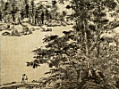

  
[Intangible Textual Heritage](../../index)  [Buddhism](../index) 
[Wisdom of the East](../../woe/index)  [Index](index) 
[Previous](tpol13) 

------------------------------------------------------------------------

  
*The Path of Light*, by L.D. Barnett, \[1909\], at Intangible Textual
Heritage

------------------------------------------------------------------------

p. 103

### APPENDIX

\[As an epilogue to the
*Bodhi-charyāvatāra*, I append a translation of the Kārikās, or metrical
summary of the main themes of Śānti-deva's other great work, the
*Śikshā-samuchchaya*. These verses consist of twenty-eight stanzas in
the *anushṭubh* metre, and may be taken as an epitome of the
*Bodhi-charyāvatāra*.\]

Since both I and my fellow-creatures dread and hate pain, what is the
peculiar quality of my Self, that I should care for it, rather than for
my fellow-men?

He that would make an end of sorrow and come to the bound of happiness
must stablish firmly the root of Faith and immovably set his thought
upon Enlightenment.

The Bodhi-sattva's rule of holiness developed from the Mahā-yāna.
Therefore one should know its principles, and so be free from evil.

p. 104

Surrender to all creatures thine own person [1](#fn_14) and thy pleasures, yea, and thy
righteousness too, in past, present, and future time; guard them, and
increase thy holiness.

For the enjoyment of fellow-creatures are sacrificed our own persons and
the like. If they be not guarded, how can they be enjoyed? and can that
be a gift that is not enjoyed?

Therefore to the end that fellow-creatures may have the enjoyment
thereof, one should protect his own person and the like, by leaving
never the Blest Friend and by studying ever the Scriptures.

Now what means it to guard one's own person? to shun mishap. How is this
all found? by shunning fruitless effort.

Fulfil this work ever by mindfulness. From deep reverence springs
mindfulness; and reverence, the glory of the chastened spirit, arises
from an understanding zeal.

"He that hath concentred thought understands

p. 105

what is as it verily is," said the Saint. Let the spirit turn away from
outward action, and fall never away from its stillness.

Steadfast throughout, mild of spirit, one Should by gentle address win
over worthy men, and thus become acceptable.

The worldly folk who scorn the scion of the Conqueror and accept him not
shall be broiled in all the hells, like fire hidden under ash.

Therefore the Conqueror in the *Ratna-megha* has told in brief the holy
rule: "Heedfully avoid that which gives displeasure to thy
fellow-creatures." [1](#fn_15)

Thus to care for one's own person with medicines, clothing, and the
like, if it be to indulge the lust of the flesh, leads to grievous
misfortune.

"Let man set himself to good deeds, and withal know the mean
throughout." Through this precept it is easy for him to guard his
enjoyment.

By quenching the lust for issues of thine own advantage, thy
righteousness will be well guarded. Regret not thy deeds, nor make a
public talk of them.

p. 106

The Bodhi-sattva will dread gain and honour, will shun exaltation; he
will have glad faith in the Law, and dismiss doubts,

When the body is made pure, it becomes wholesome for creatures to enjoy,
like perfect spotless rice.

As a crop of grain overgrown by weeds sinks under disease, and thrives
not, so a scion of the Buddha, if overcome by sin, cannot grow in grace.

What is the "cleansing of our person"? Cleansing it of evil and sin, in
obedience to the words of the Enlightened. If this endeavour be lacking,
hell awaits us.

Let men be long-suffering, and fain to hear the Law, then let them
withdraw to the forest, strain the thought on concentred effort, and
ponder upon the uncleanness of the flesh and the like.

Understand how to make clean thy enjoyments, until thy soul be cleansed.
Make thy merit pure by deeds full of the spirit of tenderness and the
Void. [1](#fn_16)

p. 107

Full many there are who will take from thee. If thou hast but little,
what of that? if it gives not full satisfaction, then it must be
increased.

What is increase of the body? increase of strength and energy*.*
Increase of enjoyment is from almsgiving full of the spirit of
tenderness and the. Void.

Firstly should a man with care establish firmly his resolution and
purpose; then with an attendant spirit of tenderness, he should strive
to increase his merit.

The rule of right conduct—worship and the like—should ever be reverently
observed. Let faith and the like be always practised, likewise brotherly
love and the remembrance of the Buddha.

In short, the weal of fellow-beings in all conditions, the godly gift
without worldly desire, and the Thought of Enlightenment cause
righteousness to increase.

Perfection arises from constancy in the heedful effort to make right
renunciations, by remembrance, by attention, and by true meditation.

 

 

PRINTED BY  
HAZELL, WATSON AND VINEY, LḌ.,  
LONDON AND AYELSBURY,  
ENGLAND

 

 

 

------------------------------------------------------------------------

### Footnotes

[104:1](tpol14.htm#fr_14) The word *ātma-bhāva*,
literally "condition of self," *i.e.* person or body, properly denotes
the plexus of concepts which collectively form the idea of an individual
being as conceived by himself.

[105:1](tpol14.htm#fr_15) Or, that whereby
fellow creatures lose their faith."

[106:1](tpol14.htm#fr_16) Acts are to be
inspired by knowledge of the Void and brotherly love, These two
requisites (*sambhāra*), the intellectual and the moral, are necessary
for spiritual advancement; one is of no avail without the other.

 
