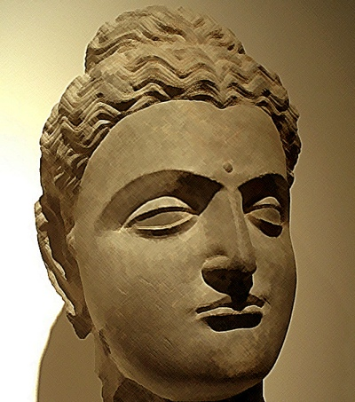

  
[Intangible Textual Heritage](../../index)  [Buddhism](../index) 

------------------------------------------------------------------------

[Buy this Book at
Amazon.com](https://www.amazon.com/exec/obidos/ASIN/B0025VLT8O/internetsacredte)

------------------------------------------------------------------------

<table width="75%">
<colgroup>
<col style="width: 50%" />
<col style="width: 50%" />
</colgroup>
<tbody>
<tr class="odd">
<td width="50%" data-valign="TOP"></td>
<td width="50%" data-valign="CENTER"><h1 id="the-buddhas-way-of-virtue" data-align="CENTER">The Buddha's Way of Virtue</h1>
<h2 id="by-w.d.c-wagiswara-and-k.j.-saunders" data-align="CENTER">by W.D.C Wagiswara and K.J. Saunders</h2>
<h4 id="section" data-align="CENTER">[1920]</h4></td>
</tr>
</tbody>
</table>

------------------------------------------------------------------------

[Contents](#contents)    [Start Reading](wov00)    [Page
Index](pageidx)    [Text \[Zipped\]](wov.txt.gz)

------------------------------------------------------------------------

|                                                                                                                           |
|---------------------------------------------------------------------------------------------------------------------------|
|  |

This is a translation of the Dhammapada, one of the central sacred texts
of Buddhism. This primary document embodies key concepts of Buddhism
expressed in simple parables and metaphors. This clarity has led to it
being one of the most popular of all Buddhist documents. This is part of
the [Wisdom of the East](../../woe/index) series.

------------------------------------------------------------------------

 [Title Page](wov00)  
[Table of Contents](wov01)  
[Introduction](wov02)  
[Note](wov03)  
[Editorial Note](wov04)  
[§ I: The Twin Truths](wov05)  
[§ II: Zeal](wov06)  
[§ III: The Mind](wov07)  
[§ IV: Flowers](wov08)  
[§ V: The Fool](wov09)  
[§ VI The Wise Man](wov10)  
[§ VII: The Arahat](wov11)  
[§ VIII: The Thousands](wov12)  
[§ IX: Vice](wov13)  
[§ X: Punishment](wov14)  
[§ XI: Old Age](wov15)  
[§ XII: Self](wov16)  
[§ XIII: The World](wov17)  
[§ XIV: The Buddha](wov18)  
[§ XV Bliss](wov19)  
[§ XVI: Affection](wov20)  
[§ XVII: Anger](wov21)  
[§ XVIII: Sin](wov22)  
[§ XIX: The Righteous](wov23)  
[§ XX: The Path](wov24)  
[§ XXI: Miscellany](wov25)  
[§ XXII: Hell](wov26)  
[§ XXIII: The Elephant](wov27)  
[§ XXIV: Desire](wov28)  
[§ XXV: The Bhikkhii](wov29)  
[§ XXVI](wov30)  
[Notes](wov31)  
[Illustrative Sayings of the Disciples of the Buddha](wov32)  
[Appendix: The Buddhist Ideal](wov33)  
[Advertisements](wov34)  
