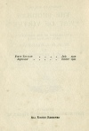

  
[Intangible Textual Heritage](../../index)  [Buddhism](../index) 
[Index](index)  [Next](wov01) 

------------------------------------------------------------------------

[Buy this Book at
Amazon.com](https://www.amazon.com/exec/obidos/ASIN/B0025VLT8O/internetsacredte)

------------------------------------------------------------------------

  
*The Buddha's Way of Virtue*, by W.D.C Wagiswara and K.J. Saunders,
\[1920\], at Intangible Textual Heritage

------------------------------------------------------------------------

p. 1 p. 2 p. 3

**The Wisdom of the East Series**

Edited by

**L. CRANMER-BYNG**

**Dr. S. A. KAPADIA**

# THE BUDDHA'S

# "WAY OF VIRTUE"

#### A TRANSLATION OF THE DHAMMAPADA

#### FROM THE PALI TEXT

### BY W. D. C. WAGISWARA

AND

### K. J. SAUNDERS

MEMBERS OF THE ROYAL ASIATIC SOCIETY, CEYLON
BRANCH

#### LONDON

#### JOHN MURRAY, ALBEMARLE STREET, W.

#### \[1920\]

#### THE BUDDHIST IDEAL

"Eschew all evil: cherish good: cleanse your inmost thoughts—this is the
teaching of Buddhas."

                                                                                                                                  *Dhammapada,*
183.

"Everything has two handles, the one by which it may be carried, the
other by which it may not… Lay hold of the handle by which it can be
carried."

                                                                                                                     Epictetus (*Encheiridion* xliii).

  [  
Click to enlarge](img/cover.jpg)  
Front cover and spine  

  [  
Click to enlarge](img/title.jpg)  
Title Page  

 
[  
Click to enlarge](img/verso.jpg)  
Verso  

p. 4 p. 5 p. 6

First Edition…*July* 1912

*Reprinted*…*October* 1920

**All Rights Reserved**

TO

N.P.C.

Scanned, proofed and formatted at Intangible Textual Heritage,
March-April 2009. This text is in the public domain in the US because it
was published prior to 1923.

------------------------------------------------------------------------

[Next: Table of Contents](wov01)
