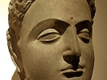

  
[Intangible Textual Heritage](../../index)  [Buddhism](../index) 
[Index](index)  [Previous](wov05)  [Next](wov07) 

------------------------------------------------------------------------

[Buy this Book at
Amazon.com](https://www.amazon.com/exec/obidos/ASIN/B0025VLT8O/internetsacredte)

------------------------------------------------------------------------

  
*The Buddha's Way of Virtue*, by W.D.C Wagiswara and K.J. Saunders,
\[1920\], at Intangible Textual Heritage

------------------------------------------------------------------------

p. 24

### § II

#### ZEAL

Zeal or earnestness (appamādo) plays an
important part in Buddhist Ethics. The way is steep, therefore let the
wayfarer play the man.

Zeal may be displayed either in strenuous mind-culture or in deeds of
piety—these are the equivalents of "Faith" and "Works" in the Buddhist
system.

21\. Zeal is the way to Nirvāna. Sloth is the day of death. The zealous
die not: the slothful are as it were dead.

22\. The wise who know the power of zeal delight in it, rejoicing in the
lot of the noble.

23\. These wise ones by meditation and reflection, by constant effort
reach Nirvāna, highest freedom.

24\. Great grows the glory of him who is zealous in meditation, whose
actions are pure and deliberate, whose life is calm and righteous and
full of vigour.

25\. By strenuous effort, by self-control, by

p. 25

temperance, let the wise man make for himself an island which the flood
cannot overwhelm.

26\. Fools in their folly give themselves to sloth: the wise man guards
his vigour as his greatest possession.

27\. Give not yourselves over to sloth, and to dalliance with delights:
he who meditates with earnestness attains great joy.

28\. When the wise one puts off sloth for zeal, ascending the high tower
of wisdom he gazes sorrowless upon the sorrowing crowd below! Wise
himself, he looks upon the fools as one upon a mountain-peak gazing upon
the dwellers in the valley.

29\. Zealous amidst the slothful, vigilant among the sleepers, go the
prudent, as a racehorse outstrips a hack.

30\. By zeal did Sakra reach supremacy among the gods. Men praise zeal;
but sloth is always blamed.

31\. A Bhikkhu who delights in zeal, looking askance at sloth, moves
onwards like a fire, burning the greater and the lesser bonds.

32\. A Bhikkhu who delights in zeal, looking askance at sloth, cannot be
brought low, but is near to Nirvāna. [\*](#fn_3)

------------------------------------------------------------------------

### Footnotes

[25:\*](wov06.htm#fr_3) Better, perhaps, "in the
very presence of Nirvāna"

------------------------------------------------------------------------

[Next: § III: The Mind](wov07)
