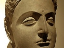

  
[Intangible Textual Heritage](../../index)  [Buddhism](../index) 
[Index](index)  [Previous](wov19)  [Next](wov21) 

------------------------------------------------------------------------

[Buy this Book at
Amazon.com](https://www.amazon.com/exec/obidos/ASIN/B0025VLT8O/internetsacredte)

------------------------------------------------------------------------

  
*The Buddha's Way of Virtue*, by W.D.C Wagiswara and K.J. Saunders,
\[1920\], at Intangible Textual Heritage

------------------------------------------------------------------------

p. 53

### § XVI

#### AFFECTION

209\. He who gives himself to vanity and
not to the truly profitable, shunning the true pursuit, and grasping at
pleasure, will come to envy him who has sought the true profit.

210\. Let no man cleave to what is pleasant or unpleasant: parting with
the pleasant is pain, and painful is the presence of the unpleasant.

211\. Take a liking to nothing; loss of the prize is evil. There are no
bonds for him who has neither likes nor dislikes.

212\. From attachment comes grief, from attachment comes fear. He who is
pure from attachment knows neither grief nor fear.

213\. From affection come grief and fear. He who is without affection
knows neither grief nor fear.

214\. From pleasure come grief and fear. He who is freed from pleasure
knows neither grief nor fear.

215\. From lust come grief and fear. He who is freed from lust knows
neither grief nor fear.

p. 54

216\. From desire come grief and fear. He who is free of desire knows
neither grief nor fear.

217\. The man of counsel and insight, of righteousness and truth, who
minds his own affairs, him the crowd holds dear.

218\. If a man's heart be set upon the Ineffable (Nirvāna), his mind
brought to perfection, and every thought freed from lust, he is called
the strong swimmer who forges his way against the stream.

219\. When, after long voyaging afar, one returns in safety home,
kinsfolk and friends receive him gladly;

220\. Even so his good deeds receive the good man, when he leaves this
world for the next, as kinsfolk greet a dear traveller.

------------------------------------------------------------------------

[Next: § XVII: Anger](wov21)
