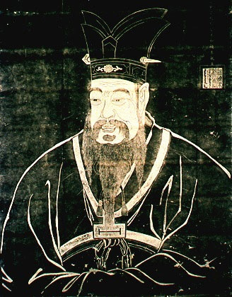

  
[Intangible Textual Heritage](../../index)  [Confucianism](../index) 

------------------------------------------------------------------------

[Buy this Book at
Amazon.com](https://www.amazon.com/exec/obidos/ASIN/1402152167/internetsacredte)

------------------------------------------------------------------------

<table width="75%">
<colgroup>
<col style="width: 50%" />
<col style="width: 50%" />
</colgroup>
<tbody>
<tr class="odd">
<td width="50%" data-valign="TOP"></td>
<td width="50%" data-valign="CENTER"><h1 id="the-book-of-filial-duty" data-align="CENTER">The Book of Filial Duty</h1>
<h2 id="by-ivan-chen" data-align="CENTER">by Ivan Chen</h2>
<h4 id="section" data-align="CENTER">[1908]</h4></td>
</tr>
</tbody>
</table>

------------------------------------------------------------------------

[Contents](#contents)    [Start Reading](bfd00)    [Page
Index](pageidx)    [Text \[Zipped\]](bfd.txt.gz)

------------------------------------------------------------------------

|                                                                                                                           |
|---------------------------------------------------------------------------------------------------------------------------|
|  |

This is a translation of the Hsio Ching, or the Book of Filial Duty. It
was written about 400 BCE, about a century following the death of
Confucius. The source edition of this etext was published in the [Wisdom
of the East](../../woe/index) series.

------------------------------------------------------------------------

 [Title Page](bfd00)  
[Table of Contents](bfd01)  
[Editorial Note](bfd02)  
[Introduction](bfd03)  
[The Doctrine of Filial Duty: Chapter I: The Meaning of Filial
Duty](bfd04)  
[Chapter II: The Filial Duty of an Emperor](bfd05)  
[Chapter III: The Filial Duty of Feudal Princes](bfd06)  
[Chapter IV: The Filial Duty of High Officers](bfd07)  
[Chapter V: The Filial Duty of the Literary Class](bfd08)  
[Chapter VI: The Filial Duty of Common People](bfd09)  
[Chapter VII: The Three Powers](bfd10)  
[Chapter VIII: Filial Duty in Government](bfd11)  
[Chapter IX: Government by the Sage](bfd12)  
[Chapter X: The Filial Duty of a Son](bfd13)  
[Chapter XI: The Five Punishments](bfd14)  
[Chapter XII: Amplification of the Important Doctrine](bfd15)  
[Chapter XIII: Amplification of the Highest Virtue](bfd16)  
[Chapter XIV: Amplification of Raising the Reputation](bfd17)  
[Chapter XV: The Question of Remonstrance in Connection With Filial
Duty](bfd18)  
[Chapter XVI: The Influence and Fruit of Filial Piety](bfd19)  
[Chapter XVII: Serving the Sovereign](bfd20)  
[Chapter XVIII: Mourning for One's Parents](bfd21)  
[The Twenty-Four Examples: No. I: The Filial Piety that influenced
Heaven](bfd22)  
[No. II: Affection shown in tasting Soups and Medicines](bfd23)  
[No. III: Gnawing her Finger pained his Heart](bfd24)  
[No. IV: Clad in a Single Garment, he was obedient to his
Mother](bfd25)  
[No. V: He carried Rice for his Parents](bfd26)  
[No. VI: With Sports and Embroidered Robes he amused his
Parents](bfd27)  
[No. VII: With Deer's Milk he supplied his Parents](bfd28)  
[No. VIII: He sold himself to bury his Father](bfd29)  
[No. IX: He hired himself out as a Labourer to support his
Mother](bfd30)  
[No. X: He fanned the Pillow and warmed the Bedclothes](bfd31)  
[No. XI: The Gushing Fountain and the Frisking Carp](bfd32)  
[No. XII: He carved Wood and served his Parents](bfd33)  
[No. XIII: For his Mother's Sake he would bury his Child](bfd34)  
[No. XIV: He seized the Tiger and saved his Father](bfd35)  
[No. XV: He collected Mulberries to support his Mother](bfd36)  
[No. XVI: He laid up the Oranges for his Mother](bfd37)  
[No. XVII: On hearing the Thunder he wept at the Tomb](bfd38)  
[No. XVIII: He wept to the Bamboos, and Shoots sprang up](bfd39)  
[No. XIX: He slept on Ice to procure Carp](bfd40)  
[No. XX: Wu Meng fed the Mosquitoes](bfd41)  
[No. XXI](bfd42)  
[No. XXII](bfd43)  
[No. XXIII: He resigned Office to seek his Mother](bfd44)  
[No. XXIV: He watched by his Mother's Bedside](bfd45)  
[Advertisements](bfd46)  
