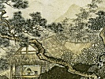

  
[Intangible Textual Heritage](../../index)  [Confucianism](../index) 
[Index](index)  [Previous](bop268)  [Next](bop270) 

------------------------------------------------------------------------

[Buy this Book at
Amazon.com](https://www.amazon.com/exec/obidos/ASIN/B0026P3UA4/internetsacredte)

------------------------------------------------------------------------

  
*The Book of Poetry*, tr. by James Legge, \[1876\], at Intangible
Textual Heritage

------------------------------------------------------------------------

#### VI

The *Chêng Min;* narrative. Celebrating the virtues of Chung Shan-fu,
who appears to have been one of the principal ministers of King Hsüan,
and his dispatch to the east, to fortify the capital of the state of
Ch‘i.

1Heaven made the
race of men, designed  
  With nature good and large;  
Functions of body, powers of mind,  
  Their duties to discharge.  
All men this normal nature own,  
Its normal virtue all men crown  
  With love sincere and true.  
Heaven by our sovereign's course was moved, p.
412  
And to aid him, its son approved,  
  Gave birth to Chung Shan-fu.

2Mild and admired,
this chief displays  
  Virtues that win the heart.  
His air and looks a wondrous grace  
  To all his ways impart.  
His rule of life the ancient law,  
To bear himself unmarred by flaw  
  With earnest mind he aims.  
In sympathy with our great Head,  
Abroad the royal will to spread  
  His constant service claims.

3The king gave
charge to Chung Shan-fu:—  
  "Hear now what I direct.  
As served your fathers, so serve you,  
  And me, your king, protect.  
Let all my lords your pattern see;  
Publish among them each decree;  
  Speak freely in my stead.  
Of what goes on inform my mind. p. 413  
Through you let all my measures find  
  Obedience promptly paid."

4Great was the
charge. Our hero hears,  
  And hastens to obey.  
Among the princes he appears;  
  Of each he marks the way.  
Who good, who bad, throughout the land,  
He clearly sees. With wisdom grand  
  He guards his life and fame.  
Nor day nor night he icily rests;  
The king's, the one man's, high behests  
  His soul with zeal inflame.

5Among the people
flies the word:  
  "What's soft men swallow fast;  
And what is for the teeth too hard  
  Out of their mouths they cast."  
But never yet did mortal trace  
In Chung Shan such ignoble case;  
  Nor soft nor hard he knows.  
The strong and fierce he does not dread;  
And on the poor or widowed head  
  Insult he never throws. p. 414

6Again the people
often say:—  
  "Virtue is very light?  
Light as a hair; yet few can bear  
  The burden of its weight."  
’Tis so; but Chung Shan, as I think,  
Needs not from virtue's weight to shrink,  
  That other men defies.  
Aid from my love his strength rejects.  
If the king's measures have defects,  
  What's needed he supplies.

7He asks the spirit
of the path  
  His blessing to send down.  
His steeds are strong; each soldier hath  
  A bravery like his own.  
Eastward they march; his charge is there.  
That city's bulwarks to repair,  
  How ardently he hies!  
List to the tinkling of his bells!  
Of his steeds' constant tramp it tells;—  
  The walls will soon arise. p. 415

8Yes, on to Ch‘i
the hero went,  
  With his four steeds so strong.  
Their eight bells told his purpose bold;—  
  He'll not be absent long!  
I, Yin Chi-fu, this song now sing.  
Like gentle breeze, O may it bring  
  To his unresting mind,  
’Mid all his toils and cares, some cheer!  
Yes, may our great Chung Shan find here  
  The comfort I designed!

------------------------------------------------------------------------

[Next: VII. Han Yi](bop270)
