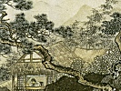

  
[Intangible Textual Heritage](../../index)  [Confucianism](../index) 
[Index](index)  [Previous](bop301)  [Next](bop303) 

------------------------------------------------------------------------

[Buy this Book at
Amazon.com](https://www.amazon.com/exec/obidos/ASIN/B0026P3UA4/internetsacredte)

------------------------------------------------------------------------

  
*The Book of Poetry*, tr. by James Legge, \[1876\], at Intangible
Textual Heritage

------------------------------------------------------------------------

#### VIII

The *Cho;* narrative. An ode in praise of King Wu.

Oh! powerful was the mighty host,  
  By which the throne to Chou was given.  
Wu nursed it, while the time was dark,  
  Submissive to the will of Heaven.  
But when the day propitious came,  
He armed himself, and marched to fame. p.
460  
And what the martial king achieved,  
  We have been favored to obtain.  
That we may rightly use the lot,  
  Which thou for us didst nobly gain,  
Thy course, O king, we on our part  
  Will follow with sincerest heart.

------------------------------------------------------------------------

[Next: IX. Huan](bop303)
