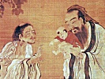

  
[Intangible Textual Heritage](../../index)  [Confucianism](../index) 
[Index](index)  [Previous](cair00)  [Next](cair02) 

------------------------------------------------------------------------

[Buy this Book at
Amazon.com](https://www.amazon.com/exec/obidos/ASIN/0404604161/internetsacredte)

------------------------------------------------------------------------

  
*Confucianism and Its Rivals*, by Herbert A. Giles, \[1915\], at
Intangible Textual Heritage

------------------------------------------------------------------------

p. v

### PREFACE

In the following Lectures an attempt is
made to exhibit chronologically, the principles and practice adopted by
Confucius as a heritage from antiquity and subsequently handed down
through twenty-four centuries, with certain modifications, until the
present day.

Beginning from the pure monotheism of a personal God, we ultimately
reach the substitution of Confucius and of his worship, with the almost
total disappearance of a supernatural Power. This development was not
effected with the consent of all parties concerned. Taoism, Buddhism,
Mazdaism, Judaism, Mahometanism, and Christianity under such varied
forms as Manichæism, Nestorianism, Roman Catholicism, and Protestantism,
each made its bid for the salvation of the Chinese, with results which
it is hoped may be gathered from this volume.

My best thanks are due to the Hibbert Trustees for allowing me an
opportunity of drawing attention, from a purely secular point of view,
to the religious struggles and problems of a people whose national life
dates back to prehistoric times and still shows no signs of decay.

HERBERT A. GILES.

CAMBRIDGE, 1*st*
*May*, 1915.

------------------------------------------------------------------------

[Next: Contents](cair02)
