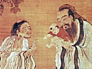

  
[Intangible Textual Heritage](../../index)  [Confucianism](../index) 
[Index](index)  [Previous](cair01)  [Next](cair03) 

------------------------------------------------------------------------

[Buy this Book at
Amazon.com](https://www.amazon.com/exec/obidos/ASIN/0404604161/internetsacredte)

------------------------------------------------------------------------

  
*Confucianism and Its Rivals*, by Herbert A. Giles, \[1915\], at
Intangible Textual Heritage

------------------------------------------------------------------------

p. vi p. vii

### CONTENTS

|                                                                                                                                                                                                                                                                                                                                                                                                                                                                                      |                                 |
|--------------------------------------------------------------------------------------------------------------------------------------------------------------------------------------------------------------------------------------------------------------------------------------------------------------------------------------------------------------------------------------------------------------------------------------------------------------------------------------|---------------------------------|
| LECTURE I                                                                                                                                                                                                                                                                                                                                                                                                                                                                            |                                 |
| B.C. 8000-1200                                                                                                                                                                                                                                                                                                                                                                                                                                                                       |                                 |
|                                                                                                                                                                                                                                                                                                                                                                                                                                                                                      | PAGE |
| The word "God"—The Canon of Changes—Revelation—The Diagrams—Divination—*T‘ien* = God—Anthropomorphism—Canon of History—*Shang Ti*, an alternative for *T‘ien*—*Shên* or *Shin*—Sacrifice—Ancestral worship—Canon of Poetry (or Odes)—Natural phenomena—Magic                                                                                                                                                                                                                         | [1](cair03.htm#page_1)          |
|                                                                                                                                                                                                                                                                                                                                                                                                                                                                                      |                                 |
| LECTURE II                                                                                                                                                                                                                                                                                                                                                                                                                                                                           |                                 |
| B.C. 1200-500                                                                                                                                                                                                                                                                                                                                                                                                                                                                        |                                 |
| The Chows—Hou Chi's miraculous birth—Sacrifices—*T‘ien* and *Shang Ti*—Impersonation of the dead—God in the Odes—Annals of the Lu State—The Commentary—Oaths—"Propriety"—Fear of God—Human sacrifices—Eclipses—Drought, famine, etc.—Spirits—The soul—Prayer                                                                                                                                                                                                                         | [33](cair04.htm#page_33)        |
|                                                                                                                                                                                                                                                                                                                                                                                                                                                                                      |                                 |
| LECTURE III                                                                                                                                                                                                                                                                                                                                                                                                                                                                          |                                 |
| B.C. 500-800                                                                                                                                                                                                                                                                                                                                                                                                                                                                         |                                 |
| Confucius—His beliefs—A chosen vessel—The will of God—Spiritual beings—Sacrifices to them—Divination, fasting, etc.—Mourning—Man born good—Points of contact with Christianity—Standard of Confucius—His inspiration—Esteemed by disciples—Mencius—His view of God—Spirits of mountains, etc.—Man's original nature—Confucianism not a "mere philosophy"                                                                                                                             | [65](cair05.htm#page_65)        |
| p. viii                                                                                                                                                                                                                                                                                                                                                                                                                                                  |                                 |
| LECTURE IV                                                                                                                                                                                                                                                                                                                                                                                                                                                                           |                                 |
| B.C. 300-200                                                                                                                                                                                                                                                                                                                                                                                                                                                                         |                                 |
|                                                                                                                                                                                                                                                                                                                                                                                                                                                                                      | PAGE |
| Mencius on man's nature—The philosopher Kao—The philosopher Hsün—His attitude towards the Deity—The philosophers Yang Chu and Mo Ti—Ch‘ü P‘ing—God in his poems—God Questions—Divination—T‘an Kung on burial, mourning, and divorce—The "First Emperor"—Burning of the Books—Ascent of Mt. T‘ai—Sacrifices—The god of the soil                                                                                                                                                       | [96](cair06.htm#page_96)        |
|                                                                                                                                                                                                                                                                                                                                                                                                                                                                                      |                                 |
| LECTURE V                                                                                                                                                                                                                                                                                                                                                                                                                                                                            |                                 |
| B.C. 200-A.D. 100                                                                                                                                                                                                                                                                                                                                                                                                                                                                    |                                 |
| Lao Tzŭ—His non-historical character—Chuang Tzŭ expounds his teachings—Life and death—The soul—God as the Ultimate Reality—God subordinate to *Tao*—The value of *Tao*—The prince of Huai-nan on Lao Tzŭ—A miracle—Alchemy—The elixir of life—Book attributed to Lao Tzŭ—The heterodox writers Yang Hsiung and Wang Ch‘ung—God not anthropomorphic                                                                                                                                   | [129](cair07.htm#page_129)      |
|                                                                                                                                                                                                                                                                                                                                                                                                                                                                                      |                                 |
| LECTURE VI                                                                                                                                                                                                                                                                                                                                                                                                                                                                           |                                 |
| A.D. 100-600                                                                                                                                                                                                                                                                                                                                                                                                                                                                         |                                 |
| Arrival of Buddhism—A miracle—Mission to India—Kâshiapmâdanga—Buddhachinga—Kumârajîva—Spread of the faith—*Manâyâna* and *Hînayâna*—The Diamond *Sûtra*—Fa Hsien's mission—Development of Taoism—Features common to Buddhism and Christianity—Taoism and Buddhism borrow from one another—Taoist papacy—Revival of Confucianism—The Confucian temple Mazdaism—Manichæism                                                                                                             | [165](cair08.htm#page_165)      |
|                                                                                                                                                                                                                                                                                                                                                                                                                                                                                      |                                 |
| LECTURE VII                                                                                                                                                                                                                                                                                                                                                                                                                                                                          |                                 |
| A.D. 600-1000                                                                                                                                                                                                                                                                                                                                                                                                                                                                        |                                 |
| The Nestorians—The Tablet—Buddhism at Court—Arrival of Bôdhidharma, the Patriarch—Buddhism prevails over Taoism—Both prohibited—Mission of Hsüan Tsang                                                                                                                                                                                                                                                                                                                               |                                 |
| p. ix                                                                                                                                                                                                                                                                                                                                                                                                                                                      |                                 |
|                                                                                                                                                                                                                                                                                                                                                                                                                                                                                      | PAGE |
| —The bone of Buddha and Han Wên-kung—Liu Tsung-yüan on Buddhism—His "God Answers"—Is there a God?—Buddhism out of favour—Mahometanism—Ascent of Mt. T‘ai—Vitality of Confucianism                                                                                                                                                                                                                                                                                                    | [196](cair09.htm#page_196)      |
|                                                                                                                                                                                                                                                                                                                                                                                                                                                                                      |                                 |
| LECTURE VIII                                                                                                                                                                                                                                                                                                                                                                                                                                                                         |                                 |
| A.D. 1000-1915                                                                                                                                                                                                                                                                                                                                                                                                                                                                       |                                 |
| Confucianism prevails—Impermanency of canonizations—Su Tung-p‘o's allusions to God—Chu Fu Tzŭ, the philosopher—His interpretation of "God"—On man's nature—Denounces Taoism and Buddhism—Shao Yung's location of God—Judaism—Ricci, S.J.—Jewish Tablet—Its inscription—Mahometanism—Roman Catholicism—A term question—The Sacred Edict—Protestantism—Another term question—Translations of the Bible—How made—Obstacles to Christianity—Call for a State religion—How to be supplied | [229](cair10.htm#page_229)      |
|                                                                                                                                                                                                                                                                                                                                                                                                                                                                                      |                                 |
| INDEX                                                                                                                                                                                                                                                                                                                                                                                                                                                                                | [266](cair11.htm#page_266)      |

------------------------------------------------------------------------

[Next: Lecture I. B.C. 3000-1200](cair03)
