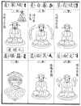
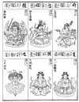
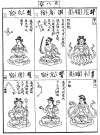
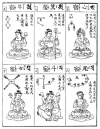
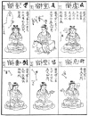
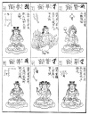
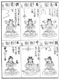
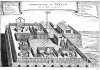

  
[Intangible Textual Heritage](../../index)  [Confucianism](../index) 
[Index](index)  [Previous](choc10)  [Next](choc12) 

------------------------------------------------------------------------

[Buy this Book at
Amazon.com](https://www.amazon.com/exec/obidos/ASIN/0875481558/internetsacredte)

------------------------------------------------------------------------

  
*Chinese Occultism*, by Paul Carus, \[1907\], at Intangible Textual
Heritage

------------------------------------------------------------------------

#### THE PERSONIFICATION OF STARS.

To the Chinese (as also in some respects to the Babylonians) the stars
are actual presences who sway the destinies of mankind, and we reproduce
here a series of illustrations from a Buddhist picture-book printed in
Japan. They are based upon ancient traditions ultimately derived from
Sumer and Accad, but we have at present no means to determine the
question of their history, especially as to their fate in China. One
thing, however, may be regarded as certain, viz., that their traditional
forms are prior to the calendar reform of the Jesuits. Hence we must
assume that they have been imported by the way on

p. 67

land either by the Buddhists from India, or through some earlier
civilising influences perhaps from ancient Babylon, or may be in later
times from Greece by way of Bactria and Tibet. An historical

  [  
Click to enlarge](img/06700.jpg)

connection of some kind or other with Western astronomy which also
derives its origin from ancient Babylon, can scarcely be doubted; for
the general similarities are too pronounced, and the more particular

p. 68

ones serve as obvious evidences which cannot be rejected, while the
differences afford suggestions in regard to their development and fate.

  [  
Click to enlarge](img/06800.jpg)

According to the Chinese and Japanese custom, the series begins in the
right upper corners and the order proceeds downwards and to the left.

The first figure represents the sun; the second, the moon. In

p. 69

the next row we see the polar star seated (like Buddha) on a lotus and
holding in his hands a wheel to indicate that he is the hub of the
heavens. As Buddha in the spiritual world, so the polar star

  [  
Click to enlarge](img/06900.jpg)

among the constellations is alone at rest while all other things in the
universe whirl round in unceasing rotation. In the same column is the
star of twilight-brightness, which may be either the morning or evening
star.

p. 70

The third row of the same page begins the series of stars that
constitute Ursa Major, popularly called "the dipper" in America and
known in China as "the bushel."

  [  
Click to enlarge](img/07000.jpg)

The satellite of the seventh star in Ursa Major is pictured as a smaller
companion in the right hand corner in the field of his bigger brother.
Since he stands at the very point of the constellation,

p. 71

his significance is in inverse proportion to his size, in a similar way
as Tom Thumb always takes the initiative in all deeds and proves to be
the saviour of his seven brothers.

  [  
Click to enlarge](img/07100.jpg)

The seven stars of Ursa Major are very conspicuous in the northern
firmament, and turn around in the sky like a big hand on the celestial
dial pointing out the hour in the clock work of the

p. 72

universe. There is a proverbial saying in China which incorporates the
popular Chinese view as follows:

"When the handle of the northern bushel (*Peh Tao*) points

  [  
Click to enlarge](img/07200.jpg)

east at nightfall it is spring throughout the land; when it points
south, it is summer; when west, it is autumn; and when north, winter."

The three stars ι, κ, λ. of Ursa Major are supposed to be the

p. 73

residence of the three councilor spirits mentioned in the *Kan Ying
P‘ien* as recording the deeds of men, and thus our constellation is
symbolically identified in the imagination of the Chinese, with divine
justice.

  [  
Click to enlarge](img/07300.jpg)

The seven planets are here increased after the precedence of Hindu
astrology by two three-headed figures called *Rahu* and *Ketu*, the
former being conceived as the head, and the latter as the tail of

p. 74

the dragon who is supposed to be responsible for solar and lunar
eclipses. Rahu represents the ascending and Ketu the descending nodes in
the ecliptic.

  [  
Click to enlarge](img/07400.jpg)

The nine personalities which correspond to the seven planets plus Rahu
and Ketu are in Hindu mythology called: Surya, the Sun; Chandra, the
moon; Mangala, Mars; Buddha, Mercury; Vrihaspati, Jupiter; Sukra, Venus;
Sani, Saturn; while Ketu and Rahu

p. 75

are identified with stars in the Dragon. Rahu is represented headless
and Ketu as a trunkless head. A representation of this Hindu notion is
found in Colonel Stuart's zodiac picture reproduced in Moor's *Hindu
Pantheon*, Plate XLVIII. It shows Surya the sun in the center drawn by
seven horses, with Aruna as charioteer. Surya in the colored original is
in gold, while Aruna is painted deep red. Chandra rides an antelope,
Mangala a ram, Buddha is seated on a

  [  
Click to enlarge](img/07500.jpg)  
A HINDU ZODIAC.  

carpet; Rahu and Ketu here interrupt the regular order, the former being
represented as riding on an owl, while the latter, a mere head, is
placed on a divan. Vrihaspati like Buddha is seated on an animal that
may have been intended for a cat, while Sani rides on a raven.

Next in order on our tables beginning with the second column

p. 76

  [  
Click to enlarge](img/07600.jpg)  
THE ARMILLARY SPHERES OF THE PEKING OBSERVATORY  

p. 77

of their fourth page, are the twenty-eight constellations mentioned
above which play an important part in Chinese occultism. The ap-

proximate outline of the constellation is indicated in each case above
the picture, and we see, for instance, why the fifteenth constellation
is called "astride," and the twenty-sixth, a "drawn bow."

We add here to our illustrations of stars a picture of Chih Nü and Keng
Niu, the stars Vega and Aquila on either side of the Milky Way, of which
Chinese folklore tells one of the prettiest fairytales of China. It is
briefly thus: The sun-god had a daughter Chili Nü (star Vega = α in
Lyre) who excelled by her skill in weaving and her industrial habits. To
recompense her he had her

  [  
Click to enlarge](img/07700.jpg)  
THE SPINNING DAMSEL AND COWHERD.  

A Chinese fairy tale of the star Vega. A native
illustration from Williams's *Middle Kingdom*.

married to Keng Niu the herdsman (constellation Aquila), who herded his
cattle on the silver stream of heaven (the Milky Way). As soon as
married, Chih Nü changed her habits for the worse; she forsook her loom
and gave herself up to merry-making and idleness. Thereupon her father
decided to separate the lovers by the stream and placed them each on one
side of the Milky Way, allowing the husband to meet his wife over a
bridge of many thousand magpies only once a year, on the seventh day of
the seventh month, which is a holy day in China even now.

We know that the Chinese government has kept an imperial

p. 78

  [  
Click to enlarge](img/07800.jpg)  
OBSERVATORY OF PEKING. GENERAL VIEW.  

p. 79

astronomer since prehistoric times, for the office is mentioned in the
earliest documents. The famous emperor Kang Hi erected

  [  
Click to enlarge](img/07900.jpg)

a new observatory which was built according to the instructions of the
Jesuit fathers whose learning at that time was highly respected

p. 80

  [  
Click to enlarge](img/08000.jpg)  
SPHERICAL ASTROLABE OF THE PEKING OBSERVATORY  

p. 81

in China. The instruments remained at Peking until the Boxer riots when
they were removed to Germany at the command of Emperor William.

Our illustrations will enable the reader to form a clear conception of
the instruments as well as the style in which they have been put up.
They stand on a high platform overlooking the city, surrounded by
battlements in the style of an old fortress. One general view is a
reproduction of an old cut at the time of the erection of the
observatory under the Jesuit fathers. The other one is a photograph made
in modern times and showing the instruments *in situ* before their
removal to Potsdam.

The gem of the collection is decidedly the spherical astrolabe which has
been made after the instructions of Ko Chow King, astronomer royal of
emperor Tai Tsu, of the Yüan dynasty, the founder of Peking. It is said
to be a marvel of Chinese art. In the general view we notice a quadrant
on the left-hand side between two light columns in French style. It is a
present of King Louis XIV sent to the emperor Kang Hi in the seventeenth
century. Among the instruments preserved in the shed there are some
curios of great artistic and historical value. The whole observatory as
it stood has always been regarded as one of the most noteworthy
treasures of the Tartar capital of the Celestial Empire.

------------------------------------------------------------------------

### Footnotes

[66:\*](choc10.htm#fr_41) We wish to express
here our indebtedness to the National Museum and its officers, and
especially to Prof. Otis T. Mason and Mr. George C. Maynard. for the
reproduction of characteristic specimens of this interesting collection.

------------------------------------------------------------------------

[Next: Prehistoric Connections](choc12)
