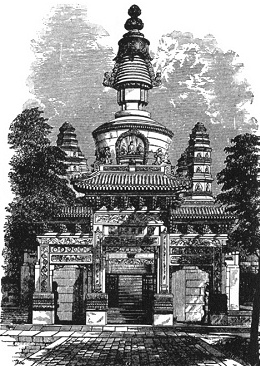

  
[Intangible Textual Heritage](../../index)  [Confucianism](../index) 

------------------------------------------------------------------------

[Buy this Book at
Amazon.com](https://www.amazon.com/exec/obidos/ASIN/0875481558/internetsacredte)

------------------------------------------------------------------------

<table width="75%">
<colgroup>
<col style="width: 50%" />
<col style="width: 50%" />
</colgroup>
<tbody>
<tr class="odd">
<td width="50%" data-valign="TOP"></td>
<td width="50%" data-valign="CENTER"><h1 id="chinese-occultism" data-align="CENTER">Chinese Occultism</h1>
<h2 id="by-paul-carus" data-align="CENTER">by Paul Carus</h2>
<h4 id="section" data-align="CENTER">[1907]</h4></td>
</tr>
</tbody>
</table>

------------------------------------------------------------------------

[Contents](#contents)    [Start Reading](choc00)    [Page
Index](pageidx)    [Text \[Zipped\]](choc.txt.gz)

------------------------------------------------------------------------

|                                                                                                                           |
|---------------------------------------------------------------------------------------------------------------------------|
|  |

This is an extended excerpt from a collection of essays by Paul Carus on
Chinese topics. Carus discusses the I Ching and other methods of
divination, the five Chinese elements (water, fire, wood, metal and
earth); the Chinese Zodiac, Fung-shui, the Lo-pan, the Chinese invention
of the magnetic compass, and the personification of constellations. He
gives ancient near eastern parallels, and proposes a speculative
diffusionist thesis for some aspects, particularly the calendrical
system. This essay serves as a good introduction to these topics, with
numerous illustrations and tables to fill in the details.

------------------------------------------------------------------------

 [Title Page](choc00)  

### Chinese Occultism

[The Yih System](choc01)  
[The Tablet of Destiny](choc02)  
[Divination](choc03)  
[Urim and Thummim](choc04)  
[P‘an-Ku](choc05)  
[The Five Elements](choc06)  
[Systems of Enumeration](choc07)  
[Feng-shui](choc08)  
[Lo-pan](choc09)  
[The Mariner's Compass a Chinese Invention](choc10)  
[The Personification of Stars](choc11)  
[Prehistoric Connections](choc12)  
