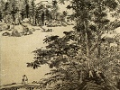

  
[Intangible Textual Heritage](../../index)  [Confucianism](../index) 
[Index](index)  [Previous](fol40)  [Next](fol42) 

------------------------------------------------------------------------

[Buy this Book on
Kindle](https://www.amazon.com/exec/obidos/ASIN/B002HRFBOE/internetsacredte)

------------------------------------------------------------------------

  
*A Feast of Lanterns*, by L. Cranmer-Byng, \[1916\], at Intangible
Textual Heritage

------------------------------------------------------------------------

### BELL HILL

In the ravine the water wanders through;  
Soundless it laps the stems of tall bamboo.  
Westward a tiny strip of green all scrolled  
With fairy pennons flaunting, red and gold.  
   Oh rare! Oh delicate is spring!  
Thatched roofs face one another. All day long  
Silent I dream. No bird breaks into song,  
   The very hills are slumbering.

------------------------------------------------------------------------

[Next: Songs of the Night](fol42)
