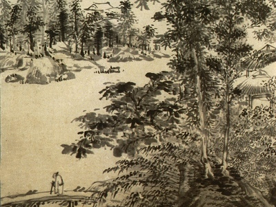

  
[Intangible Textual Heritage](../../index)  [Confucianism](../index) 

------------------------------------------------------------------------

[Buy this Book on
Kindle](https://www.amazon.com/exec/obidos/ASIN/B002HRFBOE/internetsacredte)

------------------------------------------------------------------------

<table width="75%">
<colgroup>
<col style="width: 50%" />
<col style="width: 50%" />
</colgroup>
<tbody>
<tr class="odd">
<td width="50%" data-valign="TOP"></td>
<td width="50%" data-valign="CENTER"><h1 id="a-feast-of-lanterns" data-align="CENTER">A Feast of Lanterns</h1>
<h2 id="by-l.-cranmer-byng" data-align="CENTER">by L. Cranmer-Byng</h2>
<h4 id="section" data-align="CENTER">[1916]</h4></td>
</tr>
</tbody>
</table>

------------------------------------------------------------------------

[Contents](#contents)    [Start Reading](fol00)    [Page
Index](pageidx)    [Text \[Zipped\]](fol.txt.gz)

------------------------------------------------------------------------

|                                                                                                                           |
|---------------------------------------------------------------------------------------------------------------------------|
|  |

This is a short anthology of translations of classic Chinese poetry,
including such favorites as Tu Fu and Li Po. This entry in the Wisdom of
the East series was written by L. Cranmer-Byng, the series editor. The
introduction discusses some of the cultural background of the symbolism
in these poems, including such symbols as the moon, flowers and dragons.

------------------------------------------------------------------------

 [Title Page](fol00)  
[Table of Contents](fol01)  
[Editorial Note](fol02)  

### Introduction

[Introduction](fol03)  
[Moon](fol04)  
[Flowers](fol05)  
[Dragons](fol06)  
[Sources of Inspiration](fol07)  
[Chinese Verse Form](fol08)  
[Epochs in Chinese Poetry](fol09)  
[Conclusion](fol10)  

 

[Lines From the Tomb of an Unknown Woman](fol11)  
[A Word From The Wind](fol12)  

### Wang Po

[A King of Tang](fol13)  

### Wang Wei

[While Roses Fall](fol14)  

### Li Po

[Li Po](fol15)  
[Along the Stream](fol16)  
[The Palace of Chao-Yang](fol17)  
[The Two Visits](fol18)  
[Spring Rhapsodies: I. Delight](fol19)  
[II. Sadness](fol20)  
[III. Sorrow](fol21)  
[Bright Autumntide](fol22)  

### Tu Fu

[Tu Fu](fol23)  
[In Exile](fol24)  
[The Ghost-Road](fol25)  
[Sailing Across Lake Mei-Pei](fol26)  

### Ch‘ang-Ch‘ien

[Ch‘ang-Ch‘ien](fol27)  
[The Tomb of Chao-Chün](fol28)  

### Ts‘ui Hao

[**B**oating Song of the Yo Eh](fol29)  

### Han Yü

[Disappointment](fol30)  

### Po Chü-i

[In Yung-Yang](fol31)  
[Rain at Dawn](fol32)  
[Myself](fol33)  
[Morning Studies](fol34)  
[The Little Crow](fol35)  
[At Forty-One](fol36)  
[A Night on Lake T‘ai](fol37)  

### Ou-Yang Hsiu

[Return](fol38)  
[The Pavillion of Abounding Joy](fol39)  
[Wild Geese](fol40)  
[Bell Hill](fol41)  
[Songs of the Night](fol42)  

### Wang An-Shih

[At the Parting Ways](fol43)  

### Su Tung-p‘o

[Dreaming at Golden Hill](fol44)  
[At the Kuang-Li Pavilion](fol45)  
[Farewell to Chao Tâ-Lin](fol46)  
[On the River at Hui-Ch‘ung](fol47)  

### Liu Tzu-Hui

[Listening to the Harp](fol48)  
[Autumn Moonlight](fol49)  

### Wen T‘ung

[Morning](fol50)  
[Evening](fol51)  

### Lu Yu

[Song of Three Gorges](fol52)  

### Liu Ch‘ang

[Autumn Thoughts](fol53)  
[On Waking From Sleep](fol54)  

### Anon

[Riding by Moonlight](fol55)  

### Liu Chi

[The Convent of Siang-Fu](fol56)  
[Night, Sorrow, and Song](fol57)  

### Yang Chi

[Lines Written in Exile](fol58)  

### Anon

[Plum Blossom](fol59)  
[Calycanthus Flower](fol60)  

### Yuan Mei

[Yuan Mei](fol61)  
[A Feast of Lanterns](fol62)  
[A Medley of Perfume](fol63)  
[Willow Flowers](fol64)  
[Illusion](fol65)  
[The Secret Land](fol66)  
[In an Old Library](fol67)  
[A Challenge From the Moon](fol68)  
[After the Rain](fol69)  
[Home](fol70)  

 

[Note](fol71)  
[Advertisements](fol72)  
