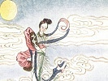

  
[Intangible Textual Heritage](../../index)  [Confucianism](../index) 
[Index](index)  [Previous](mlc09)  [Next](mlc11) 

------------------------------------------------------------------------

[Buy this Book at
Amazon.com](https://www.amazon.com/exec/obidos/ASIN/0486280926/internetsacredte)

------------------------------------------------------------------------

[Buy this Book on
Kindle](https://www.amazon.com/exec/obidos/ASIN/B0037Z6FKE/internetsacredte)

------------------------------------------------------------------------

  
*Myths and Legends of China*, by Edward T.C. Werner, \[1922\], at
Intangible Textual Heritage

------------------------------------------------------------------------

## Chapter VIII

# Myths of Fire

## The Ministry of Fire

The celestial organization of Fire is the fifth Ministry, and is
presided over by a President, Lo Hsüan, whose titular designation is
Huo-tê Hsing-chün, ‘Stellar Sovereign of the Fire-virtue,’ with five
subordinate ministers, four of whom are star-gods, and the fifth a
“celestial prince who receives fire”: Chieh-huo T’ien-chün. Like so many
other Chinese deities, the five were all ministers of the tyrant emperor
Chou.

It is related that Lo Hsüan was originally a Taoist priest known as
Yen-chung Hsien, of the island Huo-lung, ‘Fire-dragon.’ His face was the
colour of ripe fruit of the jujube-tree, his hair and beard red, the
former done up in the shape of a fish-tail, and he had three eyes. He
wore a red cloak ornamented with the *pa kua*; his horse snorted flames
from its nostrils and fire darted from its hoofs.

While fighting in the service of the son of the tyrant emperor, Lo Hsüan
suddenly changed himself into a giant with three heads and six arms. In
each of his hands he held a magic weapon. These were a seal which
reflected the heavens and the earth, a wheel of the five fire-dragons, a
gourd containing ten thousand fire-crows, and, in the other hands, two
swords which floated like smoke, and a column of smoke several thousands
of *li* long enclosing swords of fire.

## A Conflagration

Having arrived at the city of Hsi Ch’i, Lo Hsüan sent forth his
smoke-column, the air was filled with swords of fire, the ten thousand
fire-crows, emerging from the p. 237 gourd,
spread themselves over the town, and a terrible conflagration broke out,
the whole place being ablaze in a few minutes.

At this juncture there appeared in the sky the Princess Lung Chi,
daughter of Wang-mu Niang-niang; forthwith she spread over the city her
shroud of mist and dew, and the fire was extinguished by a heavy
downpour of rain. All the mysterious mechanisms of Lo Hsüan lost their
efficacy, and the magician took to his heels down the side of the
mountain. There he was met by Li, the Pagoda-bearer,  [1](#fn_27) who threw his golden pagoda into the air.
The pagoda fell on Lo Hsüan’s head and broke his skull.

## C’ih Ching-tzŭ

Of the various fire-gods, Ch’ih Ching-tzŭ, the principle of spiritual
fire, is one of the five spirits representing the Five Elements. He is
Fire personified, which has its birth in the south, on Mount Shih-t’ang.
He himself and everything connected with him—his skin, hair, beard,
trousers, cloak of leaves, etc.—are all of the colour of fire, though he
is sometimes represented with a blue cap resembling the blue tip of a
flame. He appeared in the presence of Huang Lao in a fire-cloud. He it
was who obtained fire from the wood of the mulberry-tree, and the heat
of this fire, joined with the moisture of water, developed the germs of
terrestrial beings.

## The Red Emperor

Chu Jung, though also otherwise personified, is generally regarded as
having been a legendary emperor who made his first appearance in the
time of Hsien p. 238 Yuan (2698–2598 B.C.).
In his youth he asked Kuang-shou Lao-jên, ‘Old Longevity,’ to grant him
immortality. “The time has not yet come,” replied Old Longevity; “before
it does you have to become an emperor. I will give you the means of
reaching the end you desire. Give orders that after you are dead you are
to be buried on the southern slope of the sacred mountain Hêng Shan;
there you will learn the doctrine of Ch’ih Ching-tzŭ and will become
immortal.”

The Emperor Hsien Yüan, having abdicated the throne, sent for Chu Jung,
and bestowed upon him the crown. Chu Jung, having become emperor, taught
the people the use of fire and the advantages to be derived therefrom.
In those early times the forests were filled with venomous reptiles and
savage animals; he ordered the peasants to set fire to the brushwood to
drive away these dangerous neighbours and keep them at a distance. He
also taught his subjects the art of purifying, forging, and welding
metals by the action of fire. He was nicknamed Ch’ih Ti, ‘the Red
Emperor.’ He reigned for more than two hundred years, and became an
Immortal, His capital was the ancient city of Kuei, thirty *li*
north-east of Hsin-chêng Hsien, in the Prefecture of K’ai-fêng Fu,
Honan. His tomb is on the southern slope of Heng Shan. The peak is known
as Chu Jung Peak. His descendants, who went to live in the south, were
the ancestors of the Directors of Fire.

## Hui Lu

The most popular God of Fire, however, is Hui Lu, a celebrated magician
who, according to the *Shên hsien t’ung chien*, lived some time before
the reign of Ti K’u (2436–2366 B.C.), the father of Yao the Great, and
had a p. 239 mysterious bird named Pi Fang
and a hundred other fire-birds shut up in a gourd. He had only to let
them out to set up a conflagration which would extend over the whole
country.

Huang Ti ordered Chu Jung to fight Hui Lu and also to subdue the rebel
Chih Yu. Chu Jung had a large bracelet of pure gold—a most wonderful and
effective weapon. He hurled it into the air, and it fell on Hui Lu’s
neck, throwing him to the ground and rendering him incapable of moving.
Finding resistance impossible, he asked mercy from his victor and
promised to be his follower in the spiritual contests. Subsequently he
always called himself Huo-shih Chih T’u, ‘the Disciple of the Master of
Fire.’

## The Fire-emperor

Shen Nung, the God of Agriculture, also adds to his other functions
those appertaining to the God of Fire, the reason being that when he
succeeded the Emperor Fu Hsi on the throne he adopted fire as the emblem
of his government, just as Huang Ti adopted the symbol of Earth. Thus he
came to be called Huo Ti, the ‘Fire-emperor.’ He taught his subjects the
use of fire for smelting metals and making implements and weapons, and
the use of oil in lamps, etc. All the divisions of his official
hierarchy were connected in some way with this element; thus, there were
the Ministers of Fire generally, the officers of Fire of the North,
South, etc. Becoming thus doubly the patron of fire, a second fire
symbol (*huo*) was added to his name, changing it from Huo Ti,
‘Fire-emperor,’ to Yen Ti, ‘Blazing Emperor,’ p.
240

------------------------------------------------------------------------

### Footnotes

[240:1](mlc10.htm#fr_27) See Chapter XII.

------------------------------------------------------------------------

[Next: Chapter IX. Myths of Epidemics, Medicine, Exorcism, Etc.](mlc11)

