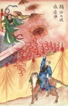
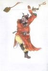

  
[Intangible Textual Heritage](../../index)  [Confucianism](../index) 
[Index](index)  [Previous](mlc10)  [Next](mlc12) 

------------------------------------------------------------------------

[Buy this Book at
Amazon.com](https://www.amazon.com/exec/obidos/ASIN/0486280926/internetsacredte)

------------------------------------------------------------------------

[Buy this Book on
Kindle](https://www.amazon.com/exec/obidos/ASIN/B0037Z6FKE/internetsacredte)

------------------------------------------------------------------------

  
*Myths and Legends of China*, by Edward T.C. Werner, \[1922\], at
Intangible Textual Heritage

------------------------------------------------------------------------

## Chapter IX

# Myths of Epidemics, Medicine, Exorcism, Etc.

## The Ministry of Epidemics

The gods of epidemics, etc., belong to the sixth, ninth, second, and
third celestial Ministries. The composition of the Ministry of Epidemics
is arranged differently in different works as Epidemics (regarded as
epidemics on earth, but as demons in Heaven) of the Centre, Spring,
Summer, Autumn, and Winter, or as the marshals clothed in yellow, green,
red, white, and blue respectively, or as the Officers of the East, West,
South, and North, with two additional members: a Taoist who quells the
plague, and the Grand Master who exhorts people to do right.

With regard to the Ministry of Seasonal Epidemics, it is related that in
the sixth moon of the eleventh year (A.D. 599) of the reign of Kao Tsu,
founder of the Sui dynasty, five stalwart persons appeared in the air,
clothed in robes of five colours, each carrying different objects in his
hands: the first a spoon and earthenware vase, the second a leather bag
and sword, the third a fan, the fourth a club, the fifth a jug of fire.
The Emperor asked Chang Chü-jên, his Grand Historiographer, who these
were and if they were benevolent or evil spirits. The official answered:
“These are the five powers of the five directions. Their appearance
indicates the imminence of epidemics, which will last throughout the
four seasons of the year.” “What remedy is there, and how am I to
protect the people?” inquired the Emperor. “There is no remedy,” replied
the official, “for epidemics are sent by Heaven.” During that year the
mortality was very great. The p. 241 Emperor
built a temple to the five persons, and bestowed upon them the title of
Marshals to the Five Spirits of the Plague. During that and the
following dynasty sacrifices were offered to them on the fifth day of
the fifth moon.

## The President of the Ministry

The following particulars are given concerning the President of the
Ministry, whose name was Lü Yüeh. He was an old Taoist hermit, living at
Chiu-lung Tao, ‘Nine-dragon Island,’ who became an Immortal. The four
members of the Ministry were his disciples. He wore a red garment, had a
blue face, red hair, long teeth, and three eyes. His war-horse was named
the Myopic Camel. He carried a magic sword, and was in the service of
Chou Wang, whose armies were concentrated at Hsi Ch’i. In a duel with
Mu-cha, brother of No-cha, he had his arm severed by a sword-cut. In
another battle with Huang T’ien-hua, son of Huang Fei-hu, he appeared
with three heads and six arms. In his many hands he held the celestial
seal, plague microbes, the flag of plague, the plague sword, and two
mysterious swords. His faces were green, and large teeth protruded from
his mouths. Huang T’ien-hua threw his magic weapon, Huo-lung Piao, and
hit him on the leg. Just at that moment Chiang Tzŭ-ya arrived with his
goblin-dispelling whip and felled him with a blow. He was able, however,
to rise again, and took to flight.

## The Plague-disseminating Umbrellas

Resolved to avenge his defeat, he joined General Hsü Fang, who was
commanding an army corps at Ch’uan-yün Kuan. Round the mountain he
organized p. 242 a system of entrenchments
and of infection against their enemies. Yang Chien released his
celestial hound, which bit Lü Yüeh on the crown of his head. Then Yang
Jên, armed with his magic fan, pursued Lü Yüeh and compelled him to
retreat to his fortress. Lü Yüeh mounted the central raised part of the
embattled wall and opened all his plague-disseminating umbrellas, with
the object of infecting Yang Jên, but the latter, simply by waving his
fan, reduced all the umbrellas to dust, and also burned the fort, and
with it Lü Yüeh.

Similar wonderful achievements are related in short notices in the *Fêng
shên yen i* of the four other officers of the Ministry.

Li P’ing, the sixth officer of the Ministry, met a like fate to that of
Lü Yüeh after having failed to induce the latter to abandon the cause of
the Shang dynasty for that of Chou.

## The Five Graduates

In Père Henri Doré’s *Recherches sur les Superstitions en Chine* is
given an interesting legend concerning five other gods of epidemics.
These gods are called the Wu Yüeh, ‘Five Mountains,’ and are worshipped
in the temple San-i Ko at Ju-kao, especially in outbreaks of contagious
diseases and fevers. A sufferer goes to the temple and promises
offerings to the gods in the event of recovery. The customary offering
is five small wheaten loaves, called *shao ping*, and a pound of meat.

  [  
Click to enlarge](img/p242.jpg)  
The Magic Umbrellas

The Wu Yüeh are stellar devils whom Yü Huang sent to be reincarnated on
earth. Their names were T’ien Po-hsüeh, Tung Hung-wên, Ts’ai Wên-chü,
Chao Wu-chên, and Huang Ying-tu, and they were reincarnated at
Nan-ch’ang Fu, Chien-ch’ang Fu, Yen-mên Kuan, Yang Chou, p. 243 and Nanking respectively. They were all
noted for their brilliant intellects, and were clever scholars who
passed their graduate’s examination with success.

When Li Shih-min ascended the throne, in A.D. 627, he called together
all the *literati* of the Empire to take the Doctor’s Examination in the
capital. Our five graduates started for the metropolis, but, losing
their way, were robbed by brigands, and had to beg help in order to
reach the end of their journey. By good luck they all met in the temple
San-i Ko, and related to each other the various hardships they had
undergone. But when they eventually reached the capital the examination
was over, and they were out in the streets without resources. So they
took an oath of brotherhood for life and death. They pawned some of the
few clothes they possessed, and buying some musical instruments formed
themselves into a band of strolling musicians.

The first bought a drum, the second a seven-stringed guitar, the third a
mandolin, the fourth a clarinet, and the fifth and youngest composed
songs.

Thus they went through the streets of the capital giving their concerts,
and Fate decreed that Li Shih-min should hear their melodies. Charmed
with the sweet sounds, he asked Hsü Mao-kung whence came this band of
musicians, whose skill was certainly exceptional. Having made inquiries,
the minister related their experiences to the Emperor. Li Shih-min
ordered them to be brought into his presence, and after hearing them
play and sing appointed them to his private suite, and henceforth they
accompanied him wherever he went.

## The Emperors Strategy

The Emperor bore malice toward Chang T’ien-shih, the Master of the
Taoists, because he refused to pay the p.
244 taxes on his property, and conceived a plan to bring about
his destruction. He caused a spacious subterranean chamber to be dug
under the reception-hall of his palace. A wire passed through the
ceiling to where the Emperor sat. He could thus at will give the signal
for the music to begin or stop. Having stationed the five musicians in
this subterranean chamber, he summoned the Master of the Taoists to his
presence and invited him to a banquet. During the course of this he
pulled the wire, and a subterranean babel began.

The Emperor pretended to be terrified, and allowed himself to fall to
the ground. Then, addressing himself to the T’ien-shih, he said: “I know
that you can at will catch the devilish hobgoblins which molest human
beings. You can hear for yourself the infernal row they make in my
palace. I order you under penalty of death to put a stop to their pranks
and to exterminate them.”

## The Musicians are Slain

Having spoken thus, the Emperor rose and left. The Master of the Taoists
brought his projecting mirror, and began to seek for the evil spirits.
In vain he inspected the palace and its precincts; he could discover
nothing. Fearing that he was lost, he in despair threw his mirror on the
floor of the reception-hall.

A minute later, sad and pensive, he stooped to pick it up; what was his
joyful surprise when he saw reflected in it the subterranean room and
the musicians! At once he drew five talismans on yellow paper, burned
them, and ordered his celestial general, Chao Kung-ming, to take his
sword and kill the five musicians. The order was promptly executed, and
the T’ien-shih informed the Emperor, who received the news with
ridicule, not p. 245 believing it to be true.
He went to his seat and pulled the wire, but all remained silent. A
second and third time he gave the signal, but without response. He then
ordered his Grand Officer to ascertain what had happened. The officer
found the five graduates bathed in their blood, and lifeless.

The Emperor, furious, reproached the Master of the Taoists. “But,”
replied the T’ien-shih, “was it not your Majesty who ordered me under
pain of death to exterminate the authors of this pandemonium?” Li
Shih-min could not reply. He dismissed the Master of the Taoists and
ordered the five victims to be buried.

## The Emperor Tormented

After the funeral ceremonies, apparitions appeared at night in the place
where they had been killed, and the palace became a babel. The spirits
threw bricks and broke the tiles on the roofs.

The Emperor ordered his uncomfortable visitors to go to the T’ien-shih
who had murdered them. They obeyed, and, seizing the garments of the
Master of the Taoists, swore not to allow him any rest if he would not
restore them to life.

To appease them the Taoist said: “I am going to give each of you a
wonderful object. You are then to return and spread epidemics among
wicked people, beginning in the imperial palace and with the Emperor
himself, with the object of forcing him to canonize you.”

One received a fan, another a gourd filled with fire, the third a
metallic ring to encircle people’s heads, the fourth a stick made of
wolves’ teeth, and the fifth a cup of lustral water.

The spirit-graduates left full of joy, and made their p. 246 first experiment on Li Shih-min. The first
gave him feverish chills by waving his fan, the second burned him with
the fire from his gourd, the third encircled his head with the ring,
causing him violent headache, the fourth struck him with his stick, and
the fifth poured out his cup of lustral water on his head.

The same night a similar tragedy took place in the palace of the Empress
and the two chief imperial concubines.

T’ai-po Chin-hsing, however, informed Yü Huang what had happened, and,
touched with compassion, he sent three Immortals with pills and
talismans which cured the Empress and the ladies of the palace.

## The Graduates Canonized

Li Shih-min, having also recovered his health, summoned the five
deceased graduates and expressed his regret for the unfortunate issue of
his design against the T’ien-shih. He proceeded: “To the south of the
capital is the temple San-i Ko. I will change its name to Hsiang Shan Wu
Yüeh Shên, ‘Fragrant Hill of the Five Mountain Spirits.’ On the
twenty-eighth day of the ninth moon betake yourselves to that temple to
receive the seals of your canonization.” He conferred upon them the
title of Ti, ‘Emperor.’

## The Ministry of Medicine

The celestial Ministry of Medicine is composed of three main divisions
comprising: (1) the Ancestral Gods of the Chinese race; (2) the King of
Remedies, Yao Wang; and (3) the Specialists. There is a separate
Ministry of Smallpox. This latter controls and cures smallpox, and the
establishment of a separate celestial Ministry is p.
247 significant of the prevalence and importance of the
affliction. The ravages of smallpox in China, indeed, have been
terrific: so much so, that, until recent years, it was considered as
natural and inevitable for a child to have smallpox as for it to cut its
teeth. One of the ceremonial questions addressed by a visitor to the
parent of a child was always *Ch’u la hua’rh mei yu*? “Has he had the
smallpox?” and a child who escaped the scourge was often, if not as a
rule, regarded with disfavour and, curiously enough, as a weakling.
Probably the train of thought in the Chinese mind was that, as it is the
fittest who survive, those who have successfully passed through the
process of “putting out the flowers” have proved their fitness in the
struggle for existence. Nowadays vaccination is general, and the number
of pockmarked faces seen is much smaller than it used to be—in fact, the
pockmarked are now the exception. But, as far as I have been able to
ascertain, the Ministry of Smallpox has not been abolished, and possibly
its members, like those of some more mundane ministries, continue to
draw large salaries for doing little or no work.

## The Medicine-gods

The chief gods of medicine are the mythical kings P’an Ku, Fu Hsi, Shên
Nung, and Huang Ti. The first two, being by different writers regarded
as the first progenitor or creator of the Chinese people, are
alternatives, so that Fu Hsi, Shên Nung, and Huang Ti may be said to be
a sort of ancestral triad of medicine-gods, superior to the actual God
or King of Medicine, Yao Wang. Of P’an Ku we have spoken sufficiently in
Chapter III, and with regard to Fu Hsi, also called T’ien Huang Shih,
‘the Celestial Emperor,’ the mythical sovereign and p. 248 supposed inventor of cooking, musical
instruments, the calendar, hunting, fishing, etc., the chief interest
for our present purpose centres in his discovery of the *pa kua*, or
Eight Trigrams. It is on the strength of these trigrams that Fu Hsi is
regarded as the chief god of medicine, since it is by their mystical
power that the Chinese physicians influence the minds and maladies of
their patients. He is represented as holding in front of him a disk on
which the signs are painted.

## The Ministry of Exorcism

The Ministry of Exorcism is a Taoist invention and is composed of seven
chief ministers, whose duty is to expel evil spirits from dwellings and
generally to counteract the annoyances of infernal demons. The two gods
usually referred to in the popular legends are P’an Kuan and Chung
K’uei. The first is really the Guardian of the Living and the Dead in
the Otherworld, Fêng-tu P’an Kuan (Fêng-tu or Fêng-tu Ch’êng being the
region beyond the tomb). He was originally a scholar named Ts’ui Chio,
who became Magistrate of Tz’ŭ Chou, and later Minister of Ceremonies.
After his death he was appointed to the spiritual post above mentioned.
His best-known achievement is his prolongation of the life of the
Emperor T’ai Tsung of the T’ang dynasty by twenty years by changing *i*,
‘one,’ into *san*, ‘three,’ in the life-register kept by the gods. The
term P’an Kuan is, however, more generally used as the designation of an
officer or civil or military attendant upon a god than of any special
individual, and the original P’an Kuan, ‘the Decider of Life in Hades,’
has been gradually supplanted in popular favour by Chung K’uei, ‘the
Protector against Evil Spirits.’

  [  
Click to enlarge](img/p248.jpg)  
P’an Kuan

p. 249

## The Exorcism of ‘Emptiness and Devastation’

The Emperor Ming Huang of the T’ang dynasty, also known as T’ang Hsüan
Tsung, in the reign-period K’ai Yüan (A.D. 712–742), after an expedition
to Mount Li in Shensi, was attacked by fever. During a nightmare he saw
a small demon fantastically dressed in red trousers, with a shoe on one
foot but none on the other, and a shoe hanging from his girdle. Having
broken through a bamboo gate, he took possession of an embroidered box
and a jade flute, and then began to make a tour of the palace, sporting
and gambolling. The Emperor grew angry and questioned him. “Your humble
servant,” replied the little demon, “is named Hsü Hao, ‘Emptiness and
Devastation,’” “I have never heard of such a person,” said the Emperor.
The demon rejoined, “Hsü means to desire Emptiness, because in Emptiness
one can fly just as one wishes; Hao, ‘Devastation,’ changes people’s joy
to sadness. “The Emperor, irritated by this flippancy, was about to call
his guard, when suddenly a great devil appeared, wearing a tattered
head-covering and a blue robe, a horn clasp on his belt, and official
boots on his feet. He went up to the sprite, tore out one of his eyes,
crushed it up, and ate it. The Emperor asked the newcomer who he was.
“Your humble servant,” he replied, “is Chung K’uei, Physician of
Tung-nan Shan in Shensi. In the reign-period Wu Tê (A.D. 618–627) of the
Emperor Kao Tsu of the T’ang dynasty I was ignominiously rejected and
unjustly defrauded of a first class in the public examinations.
Overwhelmed with shame, I committed suicide on the steps of the imperial
palace. The Emperor ordered me to be buried in a green robe \[reserved
for members of the imperial clan\], and out of gratitude for p. 250 that favour I swore to protect the sovereign
in any part of the Empire against the evil machinations of the demon Hsü
Hao.” At these words the Emperor awoke and found that the fever had left
him. His Majesty called for Wu Tao-tzŭ (one of the most celebrated
Chinese artists) to paint the portrait of the person he had seen in his
dream. The work was so well done that the Emperor recognized it as the
actual demon he had seen in his sleep, and rewarded the artist with a
hundred taels of gold. The portrait is said to have been still in the
imperial palace during the Sung dynasty.

Another version of the legend says that Chung K’uefs essay was
recognized by the examiners as equal to the work of the best authors of
antiquity, but that the Emperor rejected him on account of his extremely
ugly features, whereupon he committed suicide in his presence, was
honoured by the Emperor and accorded a funeral as if he had been the
successful first candidate, and canonized with the title of Great
Spiritual Chaser of Demons for the Whole Empire. p.
251

------------------------------------------------------------------------

[Next: Chapter X. The Goddess of Mercy](mlc12)

