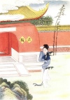

  
[Intangible Textual Heritage](../../index)  [Confucianism](../index) 
[Index](index)  [Previous](mlc11)  [Next](mlc13) 

------------------------------------------------------------------------

[Buy this Book at
Amazon.com](https://www.amazon.com/exec/obidos/ASIN/0486280926/internetsacredte)

------------------------------------------------------------------------

[Buy this Book on
Kindle](https://www.amazon.com/exec/obidos/ASIN/B0037Z6FKE/internetsacredte)

------------------------------------------------------------------------

  
*Myths and Legends of China*, by Edward T.C. Werner, \[1922\], at
Intangible Textual Heritage

------------------------------------------------------------------------

## Chapter X

# The Goddess of Mercy

## The Guardian Angel of Buddhism

As Mary is the guiding spirit of Rome, so is Kuan Yin of the Buddhist
faith.

According to a beautiful Chinese legend, Kuan Yin. when about to enter
Heaven, heard a cry of anguish rising from the earth beneath her, and,
moved by pity, paused as her feet touched the glorious threshold. Hence
her name ‘Kuan (Shih) Yin’ (one who notices or hears the cry, or prayer,
of the world).

Kuan Yin was at one time always represented as a man; but in the T’ang
dynasty and Five Dynasties we find him represented as a woman, and he
has been generally, though not invariably, so represented since that
time.

In old Buddhism Shâkyamuni was the chief god, and in many temples he
still nominally occupies the seat of honour, but he is completely
eclipsed by the God or Goddess of Mercy.

“The men love her, the children adore her, and the women chant her
prayers. Whatever the temple may be, there is nearly always a chapel for
Kuan Yin within its precincts; she lives in many homes, and in many,
many hearts she sits enshrined. She is the patron goddess of mothers,
and when we remember the relative value of a son in Chinese estimation
we can appreciate the heartiness of the worship. She protects in sorrow,
and so millions of times the prayer is offered, ‘Great mercy, great
pity, save from sorrow, save from suffering,’ or, as it is in the books,
‘Great mercy, great pity, save from misery, save from evil, broad,
great, efficacious, responsive Kuan Yin Buddha,’ She saves the
tempest-tossed p. 252 sailor, and so has
eclipsed the Empress of Heaven, who, as the female Neptune, is the
patroness of seamen; in drought the mandarins worship the Dragon and the
Pearly Emperor, but if they fail the bronze Goddess of Mercy from the
hills brings rain. Other gods are feared, she is loved; others have
black, scornful faces, her countenance is radiant as gold, and gentle as
the moon-beam; she draws near to the people and the people draw near to
her. Her throne is upon the Isle of Pootoo \[P’u T’o\], to which she
came floating upon a water-lily. She is the model of Chinese beauty, and
to say a lady or a little girl is a ‘Kuan Yin’ is the highest compliment
that can be paid to grace and loveliness. She is fortunate in having
three birthdays, the nineteenth of the second, sixth, and ninth moons.”
There are many metamorphoses of this goddess.

## The Buddhist Saviour

“She is called Kuan Yin because at any cry of misery she ‘hears the
voice and removes the sorrow.’ Her appellation is ‘Taking-away-fear
Buddha,’ If in the midst of the fire the name of Kuan Yin is called, the
fire cannot burn; if tossed by mountain billows, call her name, and
shallow waters will be reached. If merchants go across the sea seeking
gold, silver, pearls, and precious stones, and a storm comes up and
threatens to carry the crew to the evil devil’s kingdom, if one on board
calls on the name of Kuan Yin, the ship will be saved. If one goes into
a conflict and calls on the name of Kuan Yin, the sword and spear of the
enemy fall harmless. If the three thousand great kingdoms are visited by
demons, call on her name, and these demons cannot with an evil eye look
on a man. If, within, you have evil thoughts, p.
253 only call on Kuan Yin, and your heart will be purified, Anger
and wrath may be dispelled by calling on the name of Kuan Yin. A lunatic
who prays to Kuan Yin will become sane. Kuan Yin gives sons to mothers,
and if the mother asks for a daughter she will be beautiful. Two men—one
chanting the names of the 6,200,000 Buddhas, in number like the sands of
the Ganges, and the other simply calling on Kuan Yin—have equal merit.
Kuan Yin may take the form of a Buddha, a prince, a priest, a nun, a
scholar, any form or shape, go to any kingdom, and preach the law
throughout the earth.”

## Miao Chuang desires an Heir

In the twenty-first year of the reign of Ta Hao, the Great Great One, of
the Golden Heavenly Dynasty, a man named P’o Chia, whose first name was
Lo Yü, an enterprising kinglet of Hsi Yii, seized the throne for twenty
years, after carrying on a war for a space of three years. His kingdom
was known as Hsing Lin, and the title of his reign as Miao Chuang.

The kingdom of Hsing Lin was, so says the Chinese writer, situated
between India on the west, the kingdom of T’ien Cheng on the south, and
the kingdom of Siam on the north, and was 3000 *li* in length. The
boundaries differ according to different authors. Of this kingdom the
two pillars of State were the Grand Minister Chao Chen and the General
Ch’u Chieh. The Queen Pao Tê, whose maiden name was Po Ya, and the King
Miao Chuang had lived nearly half a century without having any male
issue to succeed to the throne. This was a source of great grief to
them. Po Ya suggested to the King that the God of Hua Shan, the sacred
mountain in the west, had the reputation of being always willing p. 254 to help; and that if he prayed to him and
asked his pardon for having shed so much blood during the wars which
preceded his accession to the throne he might obtain an heir.

Welcoming this suggestion, the King sent for Chao Chên and ordered him
to dispatch to the temple of Hua Shan the two Chief Ministers of
Ceremonies, Hsi Hêng-nan and Chih Tu, with instructions to request fifty
Buddhist and Taoist priests to pray for seven days and seven nights in
order that the King might obtain a son. When that period was over, the
King and Queen would go in person to offer sacrifices in the temple.

## Prayers to the Gods

The envoys took with them many rare and valuable presents, and for seven
days and seven nights the temple resounded with the sound of drums,
bells, and all kinds of instruments, intermingled with the voices of the
praying priests. On their arrival the King and Queen offered sacrifices
to the god of the sacred mountain.

But the God of Hua Shan knew that the King had been deprived of a male
heir as a punishment for the bloody hecatombs during his three years’
war. The priests, however, interceded for him, urging that the King had
come in person to offer the sacrifices, wherefore the God could not
altogether reject his prayer. So he ordered Ch’ien-li Yen,
‘Thousand-*li* Eye,’ and Shun-fêng Erh, ‘Favourable-wind Ear,’  [1](#fn_28) to go quickly and ascertain if there were
not some worthy person who was on the point of being reincarnated into
this world.

The two messengers shortly returned, and stated that p. 255 in India, in the Chiu Ling Mountains, in the
village of Chih-shu Yüan, there lived a good man named Shih
Ch’in-ch’ang, whose ancestors for three generations had observed all the
ascetic rules of the Buddhists. This man was the father of three
children, the eldest Shih Wên, the second Shih Chin, and the third Shih
Shan, all worthy followers of the great Buddha.

## The Murder of the Tais

Wang Chê, a brigand chief, and thirty of his followers, finding
themselves pursued and harassed by the Indian soldiers, without
provisions or shelter, dying of hunger, went to Shih Wên and begged for
something to eat. Knowing that they were evildoers, Shih Wên and his two
brothers refused to give them anything; if they starved, they said, the
peasants would no longer suffer from their depredations. Thereupon the
brigands decided that it was a case of life for life, and broke into the
house of a rich family of the name of Tai, burning their home, killing a
hundred men, women, and children, and carrying off everything they
possessed.

The local *t’u-ti* at once made a report to Yü Huang.

“This Shih family,” replied the god, “for three generations has given
itself up to good works, and certainly the brigands were not deserving
of any pity. However, it is impossible to deny that the three brothers
Shih, in refusing them food, morally compelled them to loot the Tai
family’s house, putting all to the sword or flames. Is not this the same
as if they had committed the crime themselves? Let them be arrested and
put in chains in the celestial prison, and let them never see the light
of the sun again.”

“Since,” said the messenger to the God of Hua Shan, p. 256 “your gratitude toward Miao Chuang compels
you to grant him an heir, why not ask Yü Huang to pardon their crime and
reincarnate them in the womb of the Queen Po Ya, so that they may begin
a new terrestrial existence and give themselves up to good works?” As a
result, the God of Hua Shan called the Spirit of the Wind and gave him a
message for Yü Huang.

## A Message for Yü Huang

The message was as follows: “King Miao Chuang has offered sacrifice to
me and begged me to grant him an heir. But since by his wars he has
caused the deaths of a large number of human beings, he does not deserve
to have his request granted. Now these three brothers Shih have offended
your Majesty by constraining the brigand Wang Che to be guilty of murder
and robbery. I pray you to take into account their past good works and
pardon their crime, giving them an opportunity of expiating it by
causing them all three to be reborn, but of the female sex, in the womb
of Po Ya the Queen.  [2](#fn_29) In this way
they will be able to atone for their crime and save many souls.” Yü
Huang was pleased to comply, and he ordered the Spirit of the North Pole
to release the three captives and take their souls to the palace of King
Miao Chuang, where in three years’ time they would be changed into
females in the womb of Queen Po Ya.

## Birth of the Three Daughters

The King, who was anxiously expecting day by day the birth of an heir,
was informed one morning that a p.
257 daughter had been born to him. She was named Miao Ch’ing. A
year went by, and another daughter was born. This one was named Miao
Yin. When, at the end of the third year, another daughter was born, the
King, beside himself with rage, called his Grand Minister Chao Chên and,
all disconsolate, said to him, “I am past fifty, and have no male child
to succeed me on the throne. My dynasty will therefore become extinct.
Of what use have been all my labours and all my victories?” Chao Chen
tried to console him, saying, “Heaven has granted you three daughters:
no human power can change this divine decree. When these princesses have
grown up, we will choose three sons-in-law for your Majesty, and you can
elect your successor from among them. Who will dare to dispute his right
to the throne?”

The King named the third daughter Miao Shan. She became noted for her
modesty and many other good qualities, and scrupulously observed all the
tenets of the Buddhist doctrines. Virtuous living seemed, indeed, to be
to her a second nature.

## Miao Shan’s Ambition

One day, when the three sisters were playing in the palace garden of
Perpetual Spring, Miao Shan, with a serious mien, said to her sisters,
“Riches and glory are like the rain in spring or the morning dew; a
little while, and all is gone. Kings and emperors think to enjoy to the
end the good fortune which places them in a rank apart from other human
beings; but sickness lays them low in their coffins, and all is over.
Where are now all those powerful dynasties which have laid down the law
to the world? As for me, I desire nothing more than a p. 258 peaceful retreat on a lone mountain, there
to attempt the attainment of perfection. If some day I can reach a high
degree of goodness, then, borne on the clouds of Heaven, I will travel
throughout the universe, passing in the twinkling of an eye from east to
west. I will rescue my father and mother, and bring them to Heaven; I
will save the miserable and afflicted on earth; I will convert the
spirits which do evil, and cause them to do good. That is my only
ambition.”

## Her Sisters Marry

No sooner had she finished speaking than a lady of the Court came to
announce that the King had found sons-in-law to his liking for his two
elder daughters. The wedding-feast was to be the very next day. “Be
quick,” she added, “and prepare your presents, your dresses, and so
forth, for the King’s order is imperative.” The husband chosen for Miao
Ch’ing was a First Academician named Chao K’uei. His personal name was
Tê Ta, and he was the son of a celebrated minister of the reigning
dynasty. Miao Yin’s husband-elect was a military officer named Ho Fêng,
whose personal name was Ch’ao Yang. He had passed first in the
examination for the Military Doctorate. The marriage ceremonies were of
a magnificent character. Festivity followed festivity; the newly-wed
were duly installed in their palaces, and general happiness prevailed.

## Miao Shan’s Renunciation

There now remained only Miao Shan. The King and Queen wished to find for
her a man famous for knowledge and virtue, capable of ruling the
kingdom, and worthy of being the successor to the throne. So the King
called p. 259 her and explained to her all
his plans regarding her, and how all his hopes rested on her.

“It is a crime,” she replied, “for me not to comply with my father’s
wishes; but you must pardon me if my ideas differ from yours.”

“Tell me what your ideas are,” said the King.

“I do not wish to marry,” she rejoined. “I wish to attain to perfection
and to Buddhahood. Then I promise that I will not be ungrateful to you.”

“Wretch of a daughter,” cried the King in anger, “you think you can
teach me, the head of the State and ruler of so great a people! Has
anyone ever known a daughter of a king become a nun? Can a good woman be
found in that class? Put aside all these mad ideas of a nunnery, and
tell me at once if you will marry a First Academician or a Military
First Graduate.”

“Who is there,” answered the girl, “who does not love the royal
dignity?—what person who does not aspire to the happiness of marriage?
However, I wish to become a nun. With respect to the riches and glory of
this world, my heart is as cold as a dead cinder, and I feel a keen
desire to make it ever purer and purer.”

The King rose in fury, and wished to cast her out from his presence.
Miao Shan, knowing she could not openly disobey his orders, took another
course. “If you absolutely insist upon my marrying,” she said, “I will
consent; only I must marry a physician.”

“A physician!” growled the King. “Are men of good family and talents
wanting in my kingdom? What an absurd idea, to want to marry a
physician!”

“My wish is,” said Miao Shan, “to heal humanity of all its ills; of
cold, heat, lust, old age, and all infirmities. I wish to equalize all
classes, putting rich and poor on p. 260 the
same footing, to have community of goods, without distinction of
persons. If you will grant me my wish, I can still in this way become a
Buddha, a Saviour of Mankind. There is no necessity to call in the
diviners to choose an auspicious day. I am ready to be married now.”

## She is Exiled to the Garden

At these words the King was mad with rage. “Wicked imbecile!” he cried,
“what diabolical suggestions are these that you dare to make in my
presence?”

Without further ado he called Ho T’ao, who on that day was officer of
the palace guard. When he had arrived and kneeled to receive the King’s
commands, the latter said: “This wicked nun dishonours me. Take from her
her Court robes, and drive her from my presence. Take her to the Queen’s
garden, and let her perish there of cold: that will be one care less for
my troubled heart.”

Miao Shan fell on her face and thanked the King, and then went with the
officer to the Queen’s garden, where she began to lead her retired
hermit life, with the moon for companion and the wind for friend,
content to see all obstacles overthrown on her way to Nirvāna, the
highest state of spiritual bliss, and glad to exchange the pleasures of
the palace for the sweetness of solitude.

## The Nunnery of the White Bird

After futile attempts to dissuade her from her purpose by the Court
ladies, her parents, and sisters, the King and Queen next deputed Miao
Hung and Ts’ui Hung to make a last attempt to bring their misguided
daughter to her senses. Miao Shan, annoyed at this renewed p. 261 solicitation, in a haughty manner ordered
them never again to come and torment her with their silly prattle. “I
have found out,” she added, “that there is a well-known temple at Ju
Chou in Lung-shu Hsien. This Buddhist temple is known as the Nunnery of
the White Bird, Po-ch’iao Ch’an-ssŭ. In it five hundred nuns give
themselves up to the study of the true doctrine and the way of
perfection. Go then and ask the Queen on my behalf to obtain the King’s
permission for me to retire thither. If you can procure me this favour,
I will not fail to reward you later.”

Miao Chuang summoned the messengers and inquired the result of their
efforts. “She is more unapproachable than ever,” they replied; “she has
even ordered us to ask the Queen to obtain your Majesty’s permission to
retire to the Nunnery of the White Bird in Lung-shu Hsien.”

The King gave his permission, but sent strict orders to the nunnery,
instructing the nuns to do all in their power to dissuade the Princess
when she arrived from carrying out her intention to remain.

## Her Reception at the Nunnery

This Nunnery of the White Bird had been built by Huang Ti, and the five
hundred nuns who lived in it had as Superior a lady named I Yu, who was
remarkable for her virtue. On receipt of the royal mandate, she had
summoned Chêng Chêng-ch’ang, the choir-mistress, and informed her that
Princess Miao Shan, owing to a disagreement with her father, would
shortly arrive at the temple. She requested her to receive the visitor
courteously, but at the same time to do all she could to dissuade her
from adopting the life of a nun. Having given these instructions, the
Superior, accompanied by p. 262 two novices,
went to meet Miao Shan at the gate of the temple. On her arrival they
saluted her. The Princess returned the salute, but said: “I have just
left the world in order to place myself under your orders: why do you
come and salute me on my arrival? I beg you to be so good as to take me
into the temple, in order that I may pay my respects to the Buddha.” I
Yu led her into the principal hall, and instructed the nuns to light
incense-sticks, ring the bells, and beat the drums. The visit to the
temple finished, she went into the preaching-hall, where she greeted her
instructresses. The latter obeyed the King’s command and endeavoured to
persuade the Princess to return to her home, but, as none of their
arguments had any effect, it was at length decided to give her a trial,
and to put her in charge of the kitchen, where she could prepare the
food for the nunnery, and generally be at the service of all. If she did
not give satisfaction they could dismiss her.

## She makes Offering to the Buddha

Miao Shan joyfully agreed, and proceeded to make her humble submission
to the Buddha. She knelt before Ju Lai, and made offering to him,
praying as follows: “Great Buddha, full of goodness and mercy, your
humble servant wishes to leave the world. Grant that I may never yield
to the temptations which will be sent to try my faith.” Miao Shan
further promised to observe all the regulations of the nunnery and to
obey the superiors.

  [  
Click to enlarge](img/p262.jpg)  
Miao Shan Reaches the Nunnery

## Spiritual Aid

This generous self-sacrifice touched the heart of Yü Huang, the Master
of Heaven, who summoned the Spirit of the North Star and instructed him
as follows: p. 263 “Miao Shan, the third
daughter of King Miao Chuang, has renounced the world in order to devote
herself to the attainment of perfection. Her father has consigned her to
the Nunnery of the White Bird. She has undertaken without grumbling the
burden of all the work in the nunnery. If she is left without help, who
is there who will be willing to adopt the virtuous life? Do you go
quickly and order the Three Agents, the Gods of the Five Sacred Peaks,
the Eight Ministers of the Heavenly Dragon, Ch’ieh Lan, and the *t’u-ti*
to send her help at once. Tell the Sea-dragon to dig her a well near the
kitchen, a tiger to bring her firewood, birds to collect vegetables for
the inmates of the nunnery, and all the spirits of Heaven to help her in
her duties, that she may give herself up without disturbance to the
pursuit of perfection. See that my commands are promptly obeyed.” The
Spirit of the North Star complied without delay.

## The Nunnery on Fire

Seeing all these gods arrive to help the novice, the Superior, I Yu,
held consultation with the choir-mistress, saying: “We assigned to the
Princess the burdensome work of the kitchen because she refused to
return to the world; but since she has entered on her duties the gods of
the eight caves of Heaven have come to offer her fruit, Ch’ieh Lan
sweeps the kitchen, the dragon has dug a well, the God of the Hearth and
the tiger bring her fuel, birds collect vegetables for her, the nunnery
bell every evening at dusk booms of itself, as if struck by some
mysterious hand. Obviously miracles are being performed. Hasten and
fetch the King, and beg his Majesty to recall his daughter.” p. 264

Chêng Chêng-ch’ang started on her way, and, on arrival, informed the
King of all that had taken place. The King called Hu Pi-li, the chief of
the guard, and ordered him to go to the sub-prefecture of Lung-shu Hsien
at the head of an army corps of 5000 infantry and cavalry. He was to
surround the Nunnery of the White Bird and burn it to the ground,
together with the nuns. When he reached the place the commander
surrounded the nunnery with his soldiers, and set fire to it. The five
hundred doomed nuns invoked the aid of Heaven and earth, and then,
addressing Miao Shan, said: “It is you who have brought upon us this
terrible disaster.”

“It is true,” said Miao Shan. “I alone am the cause of your
destruction.” She then knelt down and prayed to Heaven: “Great Sovereign
of the Universe, your servant is the daughter of King Miao Chuang; you
are the grandson of King Lun. Will you not rescue your younger sister?
You have left your palace; I also have left mine. You in former times
betook yourself to the snowy mountains to attain perfection; I came here
with the same object. Will you not save us from this fiery destruction?”

Her prayer ended, Miao Shan took a bamboo hairpin from her hair, pricked
the roof of her mouth with it, and spat the flowing blood toward Heaven.
Immediately great clouds gathered in all parts of the sky and sent down
inundating showers, which put out the fire that threatened the nunnery.
The nuns threw themselves on their knees and thanked her effusively for
having saved their lives.

Hu Pi-li retired, and went in haste to inform the King of this
extraordinary occurrence. The King, enraged, p.
265 ordered him to go back at once, bring his daughter in chains,
and behead her on the spot.

## The Execution of Miao Shan

But the Queen, who had heard of this new plot, begged the King to grant
her daughter a last chance. “If you will give permission,” she said, “I
will have a magnificent pavilion built at the side of the road where
Miao Shan will pass in chains on the way to her execution, and will go
there with our two other daughters and our sons-in-law. As she passes we
will have music, songs, feasting, everything likely to impress her and
make her contrast our luxurious life with her miserable plight. This
will surely bring her to repentance.”

“I agree,” said the King, “to counter-order her execution until your
preparations are complete.” Nevertheless, when the time came, Miao Shan
showed nothing but disdain for all this worldly show, and to all
advances replied only: “I love not these pompous vanities; I swear that
I prefer death to the so-called joys of this world.” She was then led to
the place of execution. All the Court was present. Sacrifices were made
to her as to one already dead. A Grand Minister pronounced the
sacrificial oration.

In the midst of all this the Queen appeared, and ordered the officials
to return to their posts, that she might once more exhort her daughter
to repent. But Miao Shan only listened in silence with downcast eyes.

The King felt great repugnance to shedding his daughter’s blood, and
ordered her to be imprisoned in the palace, in order that he might make
a last effort to save her. “I am the King,” he said; “my orders cannot
be lightly set aside. Disobedience to them p.
266 involves punishment, and in spite of my paternal love for
you, if you persist in your present attitude, you will be executed
to-morrow in front of the palace gate.”

The *t’u-ti*, hearing the King’s verdict, went with all speed to Yü
Huang, and reported to him the sentence which had been pronounced
against Miao Shan. Yü Huang exclaimed: “Save Buddha, there is none in
the west so noble as this Princess. To-morrow, at the appointed hour, go
to the scene of execution, break the swords, and splinter the lances
they will use to kill her. See that she suffers no pain. At the moment
of her death transform yourself into a tiger, and bring her body to the
pine-wood. Having deposited it in a safe place, put a magic pill in her
mouth to arrest decay. Her triumphant soul on its return from the lower
regions must find it in a perfect state of preservation in order to be
able to re-enter it and animate it afresh. After that, she must betake
herself to Hsiang Shan on P’u T’o Island, where she will reach the
highest state of perfection.”

On the day appointed, Commander Hu Pi-li led the condemned Princess to
the place of execution. A body of troops had been stationed there to
maintain order. The *t’u-ti* was in attendance at the palace gates. Miao
Shan was radiant with joy. “To-day,” she said, “I leave the world for a
better life. Hasten to take my life, but beware of mutilating my body.”

  [  
Click to enlarge](img/p266.jpg)  
The Tiger Carries Off Miao Shan.

The King’s warrant arrived, and suddenly the sky became overcast and
darkness fell upon the earth. A bright light surrounded Miao Shan, and
when the sword of the executioner fell upon the neck of the victim it
was broken in two. Then they thrust at her with a spear, but the weapon
fell to pieces. After that the King ordered that she be strangled with a
silken cord. A p. 267 few moments later a
tiger leapt into the execution ground, dispersed the executioners, put
the inanimate body of Miao Shan on his back, and disappeared into the
pine-forest. Hu Pi-li rushed to the palace, recounted to the King full
details of all that had occurred, and received a reward of two ingots of
gold.

## Miao Shan visits the Infernal Regions

Meantime, Miao Shan’s soul, which remained unhurt, was borne on a cloud;
when, waking as from a dream, she lifted her head and looked round, she
could not see her body. “My father has just had me strangled,” she
sighed. “How is it that I find myself in this place? Here are neither
mountains, nor trees, nor vegetation; no sun, moon, nor stars; no
habitation, no sound, no cackling of a fowl nor barking of a dog. How
can I live in this desolate region?”

Suddenly a young man dressed in blue, shining with a brilliant light,
and carrying a large banner, appeared and said to her: “By order of Yen
Wang, the King of the Hells, I come to take you to the eighteen infernal
regions.”

“What is this cursed place where I am now?” asked Miao Shan.

“This is the lower world, Hell,” he replied. “Your refusal to marry, and
the magnanimity with which you chose an ignominious death rather than
break your resolutions, deserve the recognition of Yü Huang, and the ten
gods of the lower regions, impressed and pleased at your eminent virtue,
have sent me to you. Fear nothing and follow me.”

Thus Miao Shan began her visit to all the infernal regions. The Gods of
the Ten Hells came to congratulate her. p.
268

“Who am I,” asked Miao Shan, “that you should deign to take the trouble
to show me such respect?”

“We have heard,” they replied, “that when you recite your prayers all
evil disappears as if by magic. We should like to hear you pray.”

“I consent,” replied Miao Shan, “on condition that all the condemned
ones in the ten infernal regions be released from their chains in order
to listen to me.”

At the appointed time the condemned were led in by Niu T’ou (‘Ox-head’)
and Ma Mien (‘Horse-face’), the two chief constables of Hell, and Miao
Shan began her prayers. No sooner had she finished than Hell was
suddenly transformed into a paradise of joy, and the instruments of
torture into lotus-flowers.

## Hell a Paradise

P’an Kuan, the keeper of the Register of the Living and the Dead,
presented a memorial to Yen Wang stating that since Miao Shan’s arrival
there was no more pain in Hell; and all the condemned were beside
themselves with happiness. “Since it has always been decreed,” he added,
“that, in justice, there must be both a Heaven and a Hell, if you do not
send this saint back to earth, there will no longer be any Hell, but
only a Heaven.”

“Since that is so,” said Yen Wang, “let forty-eight flag-bearers escort
her across the Styx Bridge \[Nai-ho Ch’iao\], that she may be taken to
the pine-forest to reenter her body, and resume her life in the upper
world.”

The King of the Hells having paid his respects to her, the youth in blue
conducted her soul back to her body, which she found lying under a
pine-tree. Having reentered it, Miao Shan found herself alive again. A
bitter sigh escaped from her lips. “I remember,” she p. 269 said, “all that I saw and heard in Hell. I
sigh for the moment which will find me free of all impediments, and yet
my soul has re-entered my body. Here, without any lonely mountain on
which to give myself up to the pursuit of perfection, what will become
of me?” Great tears welled from her eyes.

## A Test of Virtue

Just then Ju Lai Buddha appeared. “Why have you come to this place?” he
asked. Miao Shan explained why the King had put her to death, and how
after her descent into Hell her soul had re-entered her body. “I greatly
pity your misfortune,” Ju Lai said, “but there is no one to help you. I
also am alone. Why should we not marry? We could build ourselves a hut,
and pass our days in peace. What say you?” “Sir,” she replied, “you must
not make impossible suggestions. I died and came to life again. How can
you speak so lightly? Do me the pleasure of withdrawing from my
presence.”

“Well,” said the visitor, “he to whom you are speaking is no other than
the Buddha of the West. I came to test your virtue. This place is not
suitable for your devotional exercises; I invite you to come to Hsiang
Shan.”

Miao Shan threw herself on her knees and said: “My bodily eyes deceived
me. I never thought that your Majesty would come to a place like this.
Pardon my seeming want of respect. Where is this Hsiang Shan?”

“Hsiang Shan is a very old monastery,” Ju Lai replied, “built in the
earliest historical times. It is inhabited by Immortals. It is situated
in the sea, on P’u T’o Island, a dependency of the kingdom of Annam.
There you will be able to reach the highest perfection.” p. 270

“How far off is this island?” Miao Shan asked. “More than three thousand
*li*,” Ju Lai replied. “I fear,” she said, “I could not bear the fatigue
of so long a journey.” “Calm yourself,” he rejoined. “I have brought
with me a magic peach, of a kind not to be found in any earthly orchard.
Once you have eaten it, you will experience neither hunger nor thirst;
old age and death will have no power over you: you will live for ever.”

Miao Shan ate the magic peach, took leave of Ju Lai, and started on the
way to Hsiang Shan. From the clouds the Spirit of the North Star saw her
wending her way painfully toward P’u T’o. He called the Guardian of the
Soil of Hsiang Shan and said to him: “Miao Shan is on her way to your
country; the way is long and difficult. Do you take the form of a tiger,
and carry her to her journey’s end.”

The *t’u-ti* transformed himself into a tiger and stationed himself in
the middle of the road along which Miao Shan must pass, giving vent to
ferocious roars.

“I am a poor girl devoid of filial piety,” said Miao Shan when she came
up. “I have disobeyed my father’s commands; devour me, and make an end
of me.”

The tiger then spoke, saying: “I am not a real tiger, but the Guardian
of the Soil of Hsiang Shan. I have received instructions to carry you
there. Get on my back.”

“Since you have received these instructions,” said the girl, “I will
obey, and when I have attained to perfection I will not forget your
kindness.”

The tiger went off like a flash of lightning, and in the twinkling of an
eye Miao Shan found herself at the foot of the rocky slopes of P’u T’o
Island. p. 271

## Miao Shan attains to Perfection

After nine years in this retreat Miao Shan had reached the acme of
perfection. Ti-tsang Wang then came to Hsiang Shan, and was so
astonished at her virtue that he inquired of the local *t’u-ti* as to
what had brought about this wonderful result. “With the exception of Ju
Lai, in all the west no one equals her in dignity and perfection. She is
the Queen of the three thousand P’u-sa’s and of all the beings on earth
who have skin and blood. We regard her as our sovereign in all things.
Therefore, on the nineteenth day of the eleventh moon we will enthrone
her, that the whole world may profit by her beneficence.”

The *t’u-ti* sent out his invitations for the ceremony. The Dragon-king
of the Western Sea, the Gods of the Five Sacred Mountains, the
Emperor-saints to the number of one hundred and twenty, the thirty-six
officials of the Ministry of Time, the celestial functionaries in charge
of wind, rain, thunder, and lightning, the Three Causes, the Five
Saints, the Eight Immortals, the Ten Kings of the Hells—all were present
on the appointed day. Miao Shan took her seat on the lotus-throne, and
the assembled gods proclaimed her sovereign of Heaven and earth, and a
Buddha. Moreover, they decided that it was not meet that she should
remain alone at Hsiang Shan; so they begged her to choose a worthy young
man and a virtuous damsel to serve her in the temple.

The *t’u-ti* was entrusted with the task of finding them. While making
search, he met a young priest named Shan Ts’ai. After the death of his
parents he had become a hermit on Ta-hua Shan, and was still a novice in
the science of perfection. p. 272

Miao Shan ordered him to be brought to her. “Who are you?” she asked.

“I am a poor orphan priest of no merit,” he replied. “From my earliest
youth I have led the life of a hermit. I have been told that your power
is equalled only by your goodness, so I have ventured to come to pray
you to show me how to attain to perfection.”

“My only fear,” replied Miao Shan, “is that your desire for perfection
may not be sincere.”

“I have now no parents,” the priest continued, “and I have come more
than a thousand *li* to find you. How can I be wanting in sincerity?”

“What special degree of ability have you attained during your course of
perfection?” asked Miao Shan.

“I have no skill,” replied Shan Ts’ai, “but I rely for everything on
your great pity, and under your guidance I hope to reach the required
ability.”

“Very well,” said Miao Shan, “take up your station on the top of yonder
peak, and wait till I find a means of transporting you.”

## A Ruse

Miao Shan called the *t’u-ti* and bade him go and beg all the Immortals
to disguise themselves as pirates and to besiege the mountain, waving
torches, and threatening with swords and spears to kill her. “Then I
will seek refuge on the summit, and thence leap over the precipice to
prove Shan Ts’ai’s fidelity and affection.”

A minute later a horde of brigands of ferocious aspect rushed up to the
temple of Hsiang Shan. Miao Shan cried for help, rushed up the steep
incline, missed her footing, and rolled down into the ravine. Shan
Ts’ai, seeing her fall into the abyss, without hesitation flung himself
after her in order to rescue her. When he p.
273 reached her, he asked: “What have you to fear from the
robbers? You have nothing for them to steal; why throw yourself over the
precipice, exposing yourself to certain death?”

Miao Shan saw that he was weeping, and wept too. “I must comply with the
wish of Heaven,” she said.

## The Transformation of Shan Ts’ai

Shan Ts’ai, inconsolable, prayed Heaven and earth to save his
protectress. Miao Shan said to him: “You should not have risked your
life by throwing yourself over the precipice, I have not yet transformed
you. But you did a brave thing, and I know that you have a good heart.
Now, look down there.” “Oh,” said he, “if I mistake not, that is a
corpse.” “Yes,” she replied, “that is your former body. Now you are
transformed you can rise at will and fly in the air.” Shan Ts’ai bowed
low to thank his benefactress, who said to him: “Henceforth you must say
your prayers by my side, and not leave me for a single day.”

## ‘Brother and Sister’

With her spiritual sight Miao Shan perceived at the bottom of the
Southern Sea the third son of Lung Wang, who, in carrying out his
father’s orders, was cleaving the waves in the form of a carp. While
doing so, he was caught in a fisherman’s net, taken to the market at
Yüeh Chou, and offered for sale. Miao Shan at once sent her faithful
Shan Ts’ai, in the guise of a servant, to buy him, giving him a thousand
cash to purchase the fish, which he was to take to the foot of the rocks
at P’u T’o and set free in the sea. The son of Lung Wang heartily
thanked his deliverer, and on his return to the p.
274 palace related to his father what had occurred. The King
said: “As a reward, make her a present of a luminous pearl, so that she
may recite her prayers by its light at night-time.”

Lung Nü, the daughter of Lung Wang’s third son, obtained her
grandfather’s permission to take the gift to Miao Shan and beg that she
might be allowed to study the doctrine of the sages under her guidance.
After having proved her sincerity, she was accepted as a pupil. Shan
Ts’ai called her his sister, and Lung Nü reciprocated by calling him her
dear brother. Both lived as brother and sister by Miao Shan’s side.

## The King’s Punishment

After King Miao Chuang had burned the Nunnery of the White Bird and
killed his daughter, Ch’ieh Lan Buddha presented a petition to Yü Huang
praying that the crime be not allowed to go unpunished. Yü Huang, justly
irritated, ordered P’an Kuan to consult the Register of the Living and
the Dead to see how long this homicidal King had yet to live. P’an Kuan
turned over the pages of his register, and saw that according to the
divine ordinances the King’s reign on the throne of Hsing Lin should
last for twenty years, but that this period had not yet expired.  [3](#fn_30) “That which has been decreed is
immutable,” said Yü Huang, “but I will punish him by sending him
illness.” He called the God of Epidemics, and ordered him to afflict the
King’s body with ulcers, of a kind which could not be healed except by
remedies to be given him by his daughter Miao Shan.

The order was promptly executed, and the King could p. 275 get no rest by day or by night. His two
daughters and their husbands spent their time in feasting while he
tossed about in agony on his sick-bed. In vain the most famous
physicians were called in; the malady only grew worse, and despair took
hold of the patient. He then caused a proclamation to be made that he
would grant the succession to the throne to any person who would provide
him with an effectual remedy to restore him to health.

## The Disguised Priest-doctor

Miao Shan had learnt by revelation at Hsiang Shan all that was taking
place at the palace. She assumed the form of a priest-doctor, clothed
herself in a priest’s gown, with the regulation headdress and straw
shoes, and attached to her girdle a gourd containing pills and other
medicines. In this apparel she went straight to the palace gate, read
the royal edict posted there, and tore it down. Some members of the
palace guard seized her, and inquired angrily: “Who are you that you
should dare to tear down the royal proclamation?”

“I, a poor priest, am also a doctor,” she replied. “I read the edict
posted on the palace gates. The King is inquiring for a doctor who can
heal him. I am a doctor of an old cultured family, and propose to
restore him to health.”

“If you are of a cultured family, why did you become a priest?” they
asked. “Would it not have been better to gain your living honestly in
practising your art than to shave your head and go loafing about the
world? Besides, all the highest physicians have tried in vain to cure
the King; do you imagine that you will be more skilful than all the aged
practitioners?”

“Set your minds at ease,” she replied. “I have received from my
ancestors the most efficacious remedies, p.
276 and I guarantee that I shall restore the King to health,” The
palace guard then consented to transmit her petition to the Queen, who
informed the King, and in the end the pretended priest was admitted.
Having reached the royal bed-chamber, he sat still awhile in order to
calm himself before feeling the pulse, and to have complete control of
all his faculties while examining the King. When he felt quite sure of
himself, he approached the King’s bed, took the King’s hand, felt his
pulse, carefully diagnosed the nature of the illness, and assured
himself that it was easily curable.

## Strange Medicine

One serious difficulty, however, presented itself, and that was that the
right medicine was almost impossible to procure. The King showed his
displeasure by saying: “For every illness there is a medical
prescription, and for every prescription a specific medicine; how can
you say that the diagnosis is easy, but that there is no remedy?”

“Your Majesty,” replied the priest, “the remedy for your illness is not
to be found in any pharmacy, and no one would agree to sell it.”

The King became angry, believed that he was being imposed upon, and
ordered those about him to drive away the priest, who left smiling.

The following night the King saw in a dream an old man who said to him:
“This priest alone can cure your illness, and if you ask him he himself
will give you the right remedy.”

The King awoke as soon as these words had been uttered, and begged the
Queen to recall the priest. When the latter had returned, the King
related his dream, and begged the priest to procure for him the remedy
required. p. 277 “What, after all, is this
remedy that I must have in order to be cured?” he asked.

“There must be the hand and eye of a living person, from which to
compound the ointment which alone can save you,” answered the priest.

The King called out in indignation: “This priest is fooling me! Who
would ever give his hand or his eye? Even if anyone would, I could never
have the heart to make use of them.”

“Nevertheless,” said the priest, “there is no other effective remedy.”

“Then where can I procure this remedy?” asked the King.

“Your Majesty must send your ministers, who must observe the Buddhist
rules of abstinence, to Hsiang Shan, where they will be given what is
required.”

“Where is Hsiang Shan, and how far from here?”

“About three thousand or more *li*, but I myself will indicate the route
to be followed; in a very short time they will return.”

The King, who was suffering terribly, was more contented when he heard
that the journey could be rapidly accomplished. He called his two
ministers, Chao Chên and Liu Ch’in, and instructed them to lose no time
in starting for Hsiang Shan and to observe scrupulously the Buddhist
rules of abstinence. He ordered the Minister of Ceremonies to detain the
priest in the palace until their return.

## A Conspiracy that Failed

The two sons-in-law of the King, Ho Fêng and Chao K’uei, who had already
made secret preparations to succeed to the throne as soon as the King
should breathe p. 278 his last, learned with
no little surprise that the priest had hopes of curing the King’s
illness, and that he was waiting in the palace until the saving remedy
was brought to him. Fearing that they might be disappointed in their
ambition, and that after his recovery the King, faithful to his promise,
would give the crown to the priest, they entered into a conspiracy with
an unscrupulous courtier named Ho Li. They were obliged to act quickly,
because the ministers were travelling by forced marches, and would soon
be back. That same night Ho Li was to give to the King a poisoned drink,
composed, he would say, by the priest with the object of assuaging the
King’s pain until the return of his two ministers. Shortly after, an
assassin, Su Ta, was to murder the priest. Thus at one stroke both the
King and the priest would meet their death, and the kingdom would pass
to the King’s two sons-in-law.

Miao Shan had returned to Hsiang Shan, leaving in the palace the bodily
form of the priest. She saw the two traitors Ho Fêng and Chao K’uei
preparing the poison, and was aware of their wicked intentions. Calling
the spirit Yu I, who was on duty that day, she told him to fly to the
palace and change into a harmless soup the poison about to be
administered to the King and to bind the assassin hand and foot.

At midnight Ho Li, carrying in his hand the poisoned drink, knocked at
the door of the royal apartment, and said to the Queen that the priest
had prepared a soothing potion while awaiting the return of the
ministers. “I come,” he said, “to offer it to his Majesty.” The Queen
took the bowl in her hands and was about to give it to the King, when Yu
I arrived unannounced. Quick as thought he snatched the bowl from the
Queen and poured p. 279 the contents on the
ground; at the same moment he knocked over those present in the room, so
that they all rolled on the floor.

At the time this was happening the assassin Su Ta entered the priest’s
room, and struck him with his sword. Instantly the assassin, without
knowing how, found himself enwrapped in the priest’s robe and thrown to
the ground. He struggled and tried to free himself, but found that his
hands had been rendered useless by some mysterious power, and that
flight was impossible. The spirit Yu I, having fulfilled the mission
entrusted to him, now returned to Hsiang Shan and reported to Miao Shan.

## A Confession and its Results

Next morning, the two sons-in-law of the King heard of the turn things
had taken during the night. The whole palace was in a state of the
greatest confusion.

When he was informed that the priest had been killed, the King called
Ch’u Ting-lieh and ordered him to have the murderer arrested. Su Ta was
put to the torture and confessed all that he knew. Together with Ho Li
he was condemned to be cut into a thousand pieces.

The two sons-in-law were seized and ordered to instant execution, and it
was only on the Queen’s intercession that their wives were spared. The
infuriated King, however, ordered that his two daughters should be
imprisoned in the palace.

## The Gruesome Remedy

Meantime Chao Chên and Liu Ch’in had reached Hsiang Shan. When they were
brought to Miao Shan the ministers took out the King’s letter and read
it to her. p. 280 “I, Miao Chuang, King of
Hsing Lin, have learned that there dwells at Hsiang Shan an Immortal
whose power and compassion have no equal in the whole world. I have
passed my fiftieth year, and am afflicted with ulcers that all remedies
have failed to cure. To-day a priest has assured me that at Hsiang Shan
I can obtain the hand and eye of a living person, with which he will
prepare an ointment able to restore me to my usual state of health.
Relying upon his word and upon the goodness of the Immortal to whom he
has directed me, I venture to beg that those two parts of a living body
necessary to heal my ulcers be sent to me. I assure you of my
everlasting gratitude, fully confident that my request will not be
refused.”

The next morning Miao Shan bade the ministers take a knife and cut off
her left hand and gouge out her left eye. Liu Ch’in took the knife
offered him, but did not dare to obey the order. “Be quick,” urged the
Immortal; “you have been commanded to return as soon as possible; why do
you hesitate as if you were a young girl?” Liu Ch’in was forced to
proceed. He plunged in the knife, and the red blood flooded the ground,
spreading an odour like sweet incense. The hand and eye were placed on a
golden plate, and, having paid their grateful respects to the Immortal,
the envoys hastened to return.

When they had left, Miao Shan, who had transformed herself in order to
allow the envoys to remove her hand and eye, told Shan Ts’ai that she
was now going to prepare the ointment necessary for the cure of the
King. “Should the Queen,” she added, “send for another eye and hand, I
will transform myself again, and you can give them to her.” No sooner
had she finished speaking than she mounted a cloud and disappeared in
p. 281 space. The two ministers reached the
palace and presented to the Queen the gruesome remedy which they had
brought from the temple. She, overcome with gratitude and emotion, wept
copiously. “What Immortal,” she asked, “can have been so charitable as
to sacrifice a hand and eye for the King’s benefit?” Then suddenly her
tears gushed forth with redoubled vigour, and she uttered a great cry,
for she recognized the hand of her daughter by a black scar which was on
it.

## Half-measures

“Who else, in fact, but his child,” she continued amid her sobs, “could
have had the courage to give her hand to save her father’s life?” “What
are you saying?” said the King. “In the world there are many hands like
this.” While they thus reasoned, the priest entered the King’s
apartment. “This great Immortal has long devoted herself to the
attainment of perfection,” he said. “Those she has healed are
innumerable. Give me the hand and eye.” He took them and shortly
produced an ointment which, he told the King, was to be applied to his
left side. No sooner had it touched his skin than the pain on his left
side disappeared as if by magic; no sign of ulcers was to be seen on
that side, but his right side remained swollen and painful as before.

“Why is it,” asked the King, “that this remedy, which is so efficacious
for the left side, should not be applied to the right?” “Because,”
replied the priest, “the left hand and eye of the saint cures only the
left side. If you wish to be completely cured, you must send your
officers to obtain the right eye and right hand also.” The King
accordingly dispatched his envoys anew with a letter of thanks, and
begging as a further favour that p. 282 the
cure should be completed by the healing also of his right side.

## The King Cured

On the arrival of the envoys Shan Ts’ai met them in the mutilated form
of Miao Shan, and he bade them cut off his right hand, pluck out his
right eye, and put them on a plate. At the sight of the four bleeding
wounds Liu Ch’in could not refrain from calling out indignantly: “This
priest is a wicked man, thus to make a martyr of a woman in order to
obtain the succession!”

Having thus spoken, he left with his companion for the kingdom of Hsing
Lin. On their return the King was overwhelmed with joy. The priest
quickly prepared the ointment, and the King, without delay, applied it
to his right side. At once the ulcers disappeared like the darkness of
night before the rising sun. The whole Court congratulated the King and
eulogized the priest. The King conferred upon the latter the title
Priest of the Brilliant Eye. He fell on his face to return thanks, and
added: “I, a poor priest, have left the world, and have only one wish,
namely, that your Majesty should govern your subjects with justice and
sympathy and that all the officials of the realm should prove themselves
men of integrity. As for me, I am used to roaming about. I have no
desire for any royal estate. My happiness exceeds all earthly joys.”

Having thus spoken, the priest waved the sleeve of his cloak, a cloud
descended from Heaven, and seating himself upon it he disappeared in the
sky. From the cloud a note containing the following words was seen to
fall: “I am one of the Teachers of the West. I came to cure the King’s
illness, and so to glorify the True Doctrine.” p.
283

## The King’s Daughter

All who witnessed this miracle exclaimed with one voice: “This priest is
the Living Buddha, who is going back to Heaven!” The note was taken to
King Miao Chuang, who exclaimed: “Who am I that I should deserve that
one of the rulers of Heaven should deign to descend and cure me by the
sacrifice of hands and eyes?”

“What was the face of the saintly person like who gave you the remedy?”
he then asked Chao Chên.

“It was like unto that of your deceased daughter, Miao Shan,” he
replied.

“When you removed her hands and eyes did she seem to suffer?”

“I saw a great flow of blood, and my heart failed, but the face of the
victim seemed radiant with happiness.”

“This certainly must be my daughter Miao Shan, who has attained to
perfection,” said the King. “Who but she would have given hands and
eyes? Purify yourselves and observe the rules of abstinence, and go
quickly to Hsiang Shan to return thanks to the saint for this
inestimable favour. I myself will ere long make a pilgrimage thither to
return thanks in person.”

## The King and Queen taken Prisoners

Three years later the King and Queen, with the grandees of their Court,
set out to visit Hsiang Shan, but on the way the monarchs were captured
by the Green Lion, or God of Fire, and the White Elephant, or Spirit of
the Water, the two guardians of the Temple of Buddha, who transported
them to a dark cavern in the mountains. A terrific battle then took
place between the evil spirits on the one side and some hosts of
heavenly genii, who had p. 284 been summoned
to the rescue, on the other. While its issue was still uncertain,
reinforcements under the Red Child Devil, who could resist fire, and the
Dragon-king of the Eastern Sea, who could subdue water, finally routed
the enemy, and the prisoners were released.

## The King’s Repentance

The King and Queen now resumed their pilgrimage, and Miao Shan
instructed Shan Ts’ai to receive the monarchs when they arrived to offer
incense. She herself took up her place on the altar, her eyes torn out,
her hands cut off, and her wrists all dripping with blood. The King
recognized his daughter, and bitterly reproached himself; the Queen fell
swooning at her feet. Miao Shan then spoke and tried to comfort them.
She told them of all that she had experienced since the day when she had
been executed, and how she had attained to immortal perfection. She then
went on: “In order to punish you for having caused the deaths of all
those who perished in the wars preceding your accession to the throne,
and also to avenge the burning of the Nunnery of the White Bird, Yü
Huang afflicted you with those grievous ulcers. It was then that I
changed myself into a priest in order to heal you, and gave my eyes and
hands, with which I prepared the ointment that cured you. It was I,
moreover, who procured your liberty from Buddha when you were imprisoned
in the cave by the Green Lion and the White Elephant.”

## Sackcloth and Ashes

At these words the King threw himself with his face on the ground,
offered incense, worshipped Heaven, earth, the sun, and the moon, saying
with a voice broken by p. 285 sobs: “I
committed a great crime in killing my daughter, who has sacrificed her
eyes and hands in order to cure my sickness.”

No sooner were these words uttered than Miao Shan reassumed her normal
form, and, descending from the altar, approached her parents and
sisters. Her body had again its original completeness; and in the
presence of its perfect beauty, and at finding themselves reunited as
one family, all wept for joy.

“Well,” said Miao Shan to her father, “will you now force me to marry
and prevent my devoting myself to the attainment of perfection?”

“Speak no more of that,” replied the King. “I was in the wrong. If you
had not reached perfection, I should not now be alive. I have made up my
mind to exchange my sceptre for the pursuit of the perfect life, which I
wish to lead henceforth together with you.”

## The King renounces the Throne

Then, in the presence of all, he addressed his Grand Minister Chao Chên,
saying: “Your devotion to the service of the State has rendered you
worthy to wear the crown: I surrender it to you.” The Court proclaimed
Chao Chên King of Hsing Lin, bade farewell to Miao Chuang, and set out
for their kingdom accompanied by their new sovereign.

## Pardon of the Green Lion and the White Elephant

Buddha had summoned the White Elephant and the Green Lion, and was on
the point of sentencing them to eternal damnation when the compassionate
Miao Shan interceded for them. “Certainly you deserve no forgiveness,”
he said, “but I cannot refuse a request made by p.
286 Miao Shan, whose clemency is without limit. I give you over
to her, to serve and obey her in everything. Follow her.”

## Miao Shan becomes a Buddha

The guardian spirit on duty that day then announced the arrival of a
messenger from Yü Huang. It was T’ai-po Chin-hsing, who was the bearer
of a divine decree, which he handed to Miao Shan. It read as follows:
“I, the august Emperor, make known to you this decree: Miao Chuang, King
of Hsing Lin, forgetful alike of Heaven and Hell, the six virtues, and
metempsychosis, has led a blameworthy life; but your nine years of
penitence, the filial piety which caused you to sacrifice your own body
to effect his cure, in short, all your virtues, have redeemed his
faults. Your eyes can see and your ears can hear all the good and bad
deeds and words of men. You are the object of my especial regard.
Therefore I make proclamation of this decree of canonization.

“Miao Shan will have the title of Very Merciful and Very Compassionate
P’u-sa, Saviour of the Afflicted, Miraculous and Always Helpful
Protectress of Mortals. On your lofty precious lotus-flower throne, you
will be the Sovereign of the Southern Seas and of P’u T’o Isle.

“Your two sisters, hitherto tainted with earthly pleasures, will
gradually progress till they reach true perfection.

“Miao Ch’ing will have the title of Very Virtuous P’u-sa, the Completely
Beautiful, Rider of the Green Lion.

“Miao Yin will be honoured with the title of Very Virtuous and
Completely Resplendent P’u-sa, Rider of the White Elephant. p. 287

“King Miao Chuang is raised to the dignity of Virtuous Conquering
P’u-sa, Surveyor of Mortals.

“Queen Po Ya receives the title of P’u-sa of Ten Thousand Virtues,
Surveyor of Famous Women.

“Shan Ts’ai has bestowed upon him the title of Golden Youth.

“Lung Nü has the title of Jade Maiden.

“During all time incense is to be burned before all the members of this
canonized group.” p. 288

------------------------------------------------------------------------

### Footnotes

[288:1](mlc12.htm#fr_28) See Chapter IV.

[288:2](mlc12.htm#fr_29) This has reference to
the change of Kuan Yin from the masculine to the feminine gender,
already mentioned.

[288:3](mlc12.htm#fr_30) There is evidently a
mistake here, since the King was twenty when he ascended the throne and
fifty at the birth of Miao Shan.

------------------------------------------------------------------------

[Next: Chapter XI. The Eight Immortals](mlc13)

