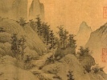

  
[Intangible Textual Heritage](../../index)  [Confucianism](../index) 
[Index](index)  [Previous](mtc02)  [Next](mtc04) 

------------------------------------------------------------------------

  
*More Translations from the Chinese*, by Arthur Waley, \[1919\], at
Intangible Textual Heritage

------------------------------------------------------------------------

p. 11 p. 12

### CH‘U YÜAN

#### (*Fourth Century* B.C.)

p. 13

### \[1\] THE GREAT SUMMONS

*When Ch‘ü Yüan had been exiled from the Court for nine years, he became
so despondent that he feared his soul would part from his body and he
would die. It was then that he made the poem called "The Great Summons,"
calling upon his soul not to leave him.*

    Green Spring receiveth  
    The vacant earth;  
    The white sun shineth;  
    Spring wind provoketh  
    To burst and burgeon  
    Each sprout and flower.  
In those dark caves where Winter lurketh  
    Hide not, my Soul!  
O Soul come back again! O, do not stray!

O Soul come back again and go not east or west, or north  
    or south!  
For to the East a mighty water drowneth Earth's other  
    shore;  
Tossed on its waves and heaving with its tides  
    The hornless Dragon of the Ocean rideth:  
Clouds gather low and fogs enfold the sea  
    And gleaming ice drifts past.  
O Soul go not to the East,  
To the silent Valley of Sunrise!

p. 14

O Soul go not to the South  
Where mile on mile the earth is burnt away  
And poisonous serpents slither through the flames;  
Where on precipitous paths or in deep woods  
Tigers and leopards prowl,  
And water-scorpions wait;  
Where the king-python rears his giant head.  
O Soul, go not to the South  
Where the three-footed tortoise spits disease!

O Soul go not to the West  
Where level wastes of sand stretch on and on;  
And demons rage, swine-headed, hairy-skinned,  
With bulging eyes;  
Who in wild laughter gnash projecting fangs.  
O Soul go not to the West  
Where many perils wait!

O Soul go not to the North,  
To the Lame Dragon's frozen peaks;  
Where trees and grasses dare not grow;  
Where a river runs too wide to cross  
And too deep to plumb,  
And the sky is white with snow  
And the cold cuts and kills.  
O Soul seek not to fill  
The treacherous voids of the north!

p. 15

O Soul come back to idleness and peace.  
In quietude enjoy  
The lands of Ching and Ch‘u.  
There work your will and follow your desire  
Till sorrow is forgot,  
And carelessness shall bring you length of days.  
O Soul come back to joys beyond all telling!

Where thirty cubits high at harvest-time  
The corn is stacked;  
Where pies are cooked of millet and bearded-maize.  
Guests watch the steaming bowls  
And sniff the pungency of peppered herbs.  
The cunning cook adds slices of bird-flesh,  
Pigeon and yellow-heron and black-crane.  
They taste the badger-stew.  
O Soul come back to feed on foods you love!

Next are brought  
Fresh turtle, and sweet chicken cooked in cheese  
Pressed by the men of Ch‘u.  
And pickled sucking-pig  
And flesh of whelps floating in liver-sauce  
With salad of minced radishes in brine;  
All served with that hot spice of southernwood  
The land of Wu supplies.  
O Soul come back to choose the meats you love!

p. 16

Roasted daw, steamed widgeon and grilled quail—  
On every fowl they fare.  
Boiled perch and sparrow broth,—in each preserved  
The separate flavour that is most its own.  
O Soul come back to where such dainties wait!

The four strong liquors are warming at the fire  
So that they grate not on the drinker's throat.  
How fragrant rise their fumes, how cool their taste!  
Such drink is not for louts or serving-men!  
And wise distillers from the land of Wu  
Blend unfermented spirit with white yeast  
And brew the *li* of Ch‘u.  
O Soul come back and let your yearnings cease!

Reed-organs from the lands of T‘ai and Ch‘in  
And Wei and Chēng  
Gladden the feasters, and old songs are sung:  
The "Rider's Song" that once  
Fu-hsi, the ancient monarch, made;  
And the harp-songs of Ch‘u.  
Then after prelude from the flutes of Chao  
The ballad-singer's voice rises alone.  
O Soul come back to the hollow mulberry-tree! [1](#fn_1)

Eight and eight the dancers sway,  
Weaving their steps to the poet's voice

p. 17

Who speaks his odes and rhapsodies;  
They tap their bells and beat their chimes  
Rigidly, lest harp and flute  
Should mar the measure.  
Then rival singers of the Four Domains  
Compete in melody, till not a tune  
Is left unsung that human voice could sing.  
O Soul come back and listen to their songs!

Then women enter whose red lips and dazzling teeth  
Seduce the eye;  
But meek and virtuous, trained in every art;  
Fit sharers of play-time,  
So soft their flesh and delicate their bones.  
O Soul come back and let them ease your woe!

Then enter other ladies with laughing lips  
And sidelong glances under moth-eye brows;  
Whose cheeks are fresh and red;  
Ladies both great of heart and long of limb,  
Whose beauty by sobriety is matched.  
Well-padded cheeks and ears with curving rim,  
High-arching eyebrows, as with compass drawn,  
Great hearts and loving gestures—all are there;  
Small waists and necks as slender as the clasp  
Of courtiers' brooches.  
O Soul come back to those whose tenderness  
Drives angry thoughts away!

p. 18

Last enter those  
Whose every action is contrived to please;  
Black-painted eyebrows and white-powdered cheeks.  
They reek with scent; with their long sleeves they brush  
The faces of the feasters whom they pass,  
Or pluck the coats of those who will not stay.  
O Soul come back to pleasures of the night!

A summer-house with spacious rooms  
And a high hall with beams stained red;  
A little closet in the southern wing  
Reached by a private stair.  
And round the house a covered way should run  
Where horses might be trained.  
And sometimes riding, sometimes going afoot  
You shall explore, O Soul, the parks of spring;  
Your jewelled axles gleaming in the sun  
And yoke inlaid with gold;  
Or amid orchises and sandal-trees  
Shall walk in the dark woods.  
O Soul come back and live for these delights!

Peacocks shall fill your gardens; you shall rear  
The roc and phoenix, and red jungle-fowl,  
Whose cry at dawn assembles river storks  
To join the play of cranes and ibises;

p. 19

Where the wild-swan all day  
Pursues the glint of idle king-fishers.  
O Soul come back to watch the birds in flight!

He who has found such manifold delights  
Shall feel his cheeks aglow  
And the blood-spirit dancing through his limbs.  
Stay with me, Soul, and share  
The span of days that happiness will bring;  
See sons and grandsons serving at the Court  
Ennobled and enriched.  
O Soul come back and bring prosperity  
To house and stock!

The roads that lead to Ch‘u  
Shall teem with travellers as thick as clouds,  
A thousand miles away.  
For the Five Orders of Nobility  
Shall summon sages to assist the King  
And with godlike discrimination choose  
The wise in council; by their aid to probe  
The hidden discontents of humble men  
And help the lonely poor.  
O Soul come back and end what we began!

Fields, villages and lanes  
Shall throng with happy men;  
Good rule protect the people and make known

p. 20

The King's benevolence to all the land;  
Stern discipline prepare  
Their natures for the soft caress of Art.  
O Soul come back to where the good are praised!

Like the sun shining over the four seas  
Shall be the reputation of our King;  
His deeds, matched only in Heaven, shall repair  
The wrongs endured by every tribe of men,—  
Northward to Yu and southward to Annam,  
To the Sheep's Gut Mountain and the Eastern Seas.  
O Soul come back to where the wise are sought!

Behold the glorious virtues of our King  
Triumphant, terrible;  
Behold with solemn faces in the Hall  
The Three Grand Ministers walk up and down,—  
None chosen for the post save landed-lords  
Or, in default, Knights of the Nine Degrees.  
At the first ray of dawn already is hung  
The shooting-target, where with bow in hand  
And arrows under arm,  
Each archer does obeisance to each,  
Willing to yield his rights of precedence.  
O Soul come back to where men honour still  
The name of the Three Kings. [2](#fn_2)

------------------------------------------------------------------------

### Footnotes

[16:1](mtc03.htm#fr_1) The harp.

[20:2](mtc03.htm#fr_2) Yü, T‘ang and Wēn, the
three just rulers of antiquity.

------------------------------------------------------------------------

[Next: Prose Letter](mtc04)

