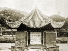

  
[Intangible Textual Heritage](../../index)  [Confucianism](../index) 
[Index](index)  [Previous](spc04)  [Next](spc06) 

------------------------------------------------------------------------

  
*Sacred Places in China*, by Carl F. Kupfer, \[1911\], at Intangible
Textual Heritage

------------------------------------------------------------------------

p. 27

### Kiu Hua Shan—Or The Nine-Lotus-Flower Mountain.

The traveler on a Yangtze River steamer,
passing from Wuhu to *Nganking*, will see about midway between these two
cities, and twenty-five miles from the southern bank, a long range of
mountains with unusually sharp, rugged peaks, the highest points of
which are probably not over five thousand feet above the Yangtze Valley.
The original name of this range was the "Nine Sons," but in the T’ang
Dynasty the celebrated poet, *Li Pah*, made the observation that nine
peaks were shaped like the lotus flower, hence it was called the
Nine-Lotus-Flower Mountain. In the whole range there are ninety-nine
peaks, the most conspicuous of which are:

*Tien-T’ai*, the Altar of Heaven.

*Fung Yung*, the Hibiscus Peak.

*Chung-Fung*, the Middle Peak.

*Hui-Sien*, the Peak of the Genii.

*Wu-lao-fung*, the Five Old Peaks.

*Tien-chii*, the Heavenly Pillar.

*Cheu-ran-fung*, the Wizard Peak.

*Shuang-fung*, the Twin Peaks.

*Tu-hun*, the Most Beautiful.

These peaks rise up keen and high, clothed in beautiful mantles of
eternal verdure, holding their heads up in the pure atmosphere, far
above the little petty trials and actions of men down in the valley.
There may be mountains far more imposing, but for variety of scenery and
richness of vegetation none can excel them. What a sight it must have
been when they were formed, and who can weary praising their beauty and
their greatness? We are not surprised that the

p. 28

heathen in his blindness seeks the home of his gods among these majestic
granite peaks.

A mere glance at the richness of the flora of these mountains and
valleys is of great interest to the lover of nature. We took note of
only a few specimens, but one fact must be kept in mind, that much of
the information obtained is tinged with mythological superstition.

*Huang-li-ta*, the yellow rice, which is said to grow high up the
valleys. It was originally brought from Siam by Ti Tsang-Wang, being
different from all other rice. It is very productive, of a reddish
yellow color, [fragrant](errata.htm#0), and soft.

*Chu-shih*, seed-producing bamboo. It happened twice during the *Ming*
Dynasty that the bamboo on these hills produced seeds. In spring and
summer they grow purple flowers, and in the autumn seed, like wheat.

*Shih chih*, the plant that contains the elixir of life. It grows high
up on the steep cliffs, and to obtain it ropes must be let down from the
top, upon which the adventurous climb up. When this plant is eaten, the
body becomes light, as if it could fly, and long life is assured. The
cliff upon which it grows is purple on the side facing the sun, and dark
on the opposite side.

*Chu tien*, the bamboo mat, is soft and white like mushrooms. When
cooked the juice from it is red like blood; the pulp is good for food,
and of pleasant taste.

*Chin ti tsa*, the golden ground tea. The growth is hollow like the
bamboo. The plant is supposed to have been brought from Siam by Ti Tsang
Wang.

*Ming Yuan Tsa*, the *Ming* fountain tea, so called because it only
grows at the *Ming* fountain, under the shadow of a hill. It does not
put forth leaves until the end of spring and the beginning of summer.
Its limbs are long, but do not spread out, and the color of its leaves
changes suddenly from purple to green. Only the water of the *Ming*
fountain can make good tea of these leaves.

p. 29

*Wu t’sai sung*, the pinus massoniana, has a hair-pin shaped leaf. The
seed of this tree is like small chestnuts, with three corners; the
kernel is fragrant. The origin is uncertain, some claiming that it also
was brought from Siam by *Ti Tsan Wang*.

*Chien t’sai sung*, the thousand autumn cedar, does not grow more than
two or three inches high, and has leaves like the cypress. It is at home
on the high, dry cliffs, and when apparently dead, if watered, it will
revive and become green again, like the *huan hun t’sao*, the soul
returning grass.

*Sien jen chu*, the sacred man's candle, is like the *wu t’ung* in
color. When full grown it can be spanned with one hand, and is not over
one foot high. It is so rich in sap that when dug up it will not dry
within one year. The burning of one limb will give light for several
hours. Dilettantes in fairy grottoes are supposed to use it for their
lights when performing their pious frauds in literature.

*Loh han poh*, the Lohan cypress, thujadolabrata. It grows only one or
two feet high, with leaves resembling the arbor vitae. The color is
kingfisher green.

*Fei hsien kai*, the sacred flying cover. The trunk of this tree grows
high and limbless. At the top only it has limbs growing down, like the
ribs of an umbrella. It compares in beauty with the wistaria chinensis,
the leaves being bright and variegated.

*Lo han t’iao*, the Lohan rope, grows high, and resembles the Chinese
juniper. The leaves are purple red, mingled with other colors, having a
white line in the center, and are over one foot long. When dry they roll
up like a rope, hence the name *t’iao*.

*P’u sa hsien*, the idol thread, with an abundance of fine limbs and
leaves drooping down almost to the ground, like threads. The leaves are
fragrant and of a kingfisher green color.

*Yü Nü Chang*, the beautiful woman's curtain, is an evergreen,

p. 30

and grows ten to twenty feet high. The leaves are long, bright, and
glossy, growing in circles, like a screen. It is found in the shade of
the rocks and cliffs, often standing in rows.

*Hsien chang fan*, the sacred palm fan, grows large leaves out of the
trunk, like the fans carried in processions. Two sides of the leaves are
similar and regular, being of deep green color and fragrant. It is often
found at the mouth of the caves.

*Chin ch’ien shu*, the golden cash tree, grows straight, twenty to
thirty feet high. The trunk is dark, and the limbs and leaves are green.
During summer and autumn fine thread-like limbs grow out of the larger
limbs. Around these drooping threads are little circles like Chinese
cash, some having from three to four, others as many as twelve such
cash.

*Nan t’ien Chu*, the Southern heavenly bamboo, nandina domestica. Like
all bamboo, it is hollow, and the nodes are far apart. In spring its
color is green, in autumn and winter it is red and purple. It flourishes
by the side of streams.

*Kwan yin chu*, the goddess of mercy bamboo, is of small growth, not
quite three feet high. Its leaves are fine, and their color bluish
green. It is an evergreen.

*Shih chu*, the stone bamboo, also called the dragon beard bamboo. It
grows a fine flower, and its color is red and purple.

*Chin pu yao*, the shaking golden step. It grows in abundance and
flowers profusely. Its leaves and flowers are always shaking, like the
aspen.

*Hsien kwei*, the sacred cassia, has leaves fine and soft, of reddish
and greenish colors. The color and shape of the flowers are like red
sacks, and the seed like red pearl. When damp with dew both flowers and
leaves emit a most pleasant fragrance.

*Yü yin lo*, the precious brooches. The flower is round

p. 31

  [  
Click to enlarge](img/03100.jpg)  
FOOTHILL BRIDGE.  

  [  
Click to enlarge](img/03101.jpg)  
THE BRIDGE TEMPLE.  

On a ridge 4,000 feet above the
[plain](errata.htm#1).

p. 32

and droops, like pure pearls. It grows along streams in clusters, like
the garden thyme.

*Po lan hua* grows over ten feet high, with long fine leaves; the calyx
is like the sunflower, and its fragrance is perceptible several *li*
off. It is said that when *Ti Tsan Wang* went to the Southern altar one
of these flowers fell into his patriarchal bowl. At other times this
flower had never been known to fall.

*So lo hua*, a species of sedge. The growth is of different sizes, both
large and small, quite different from all other plants. The leaves are
always in clusters of seven or nine each. The seed in shaped like the
face of a person, having eyes and eyebrows; and the flowers grow close
together like the peony tree; their fragrance resembles that of the
lotus flower.

*La hua*, the wax flower, is small, and always has fine, thick, soft
petals, like wax. Its color is red and yellow.

*Mo lien hua*, a species of jasmine. The Chinese claim that it produces
seed before it puts forth leaves. It blooms every month except November
and December. In color and fragrance it resembles the lotus, shedding
perfume on the passing air.

*Shui hsien hua* is like the jonquil or narcissus. It grows in dark
places, and even opens its flowers while partly covered with snow.

*Sung chu mei* is a strange freak in nature. It grows like the cypress,
but is hollow and has nodes like the bamboo and roots like the garlic.
It blooms like the plumtree, but is poisonous.

*Lung hu t’sao*, the dragon beard grass, grows three feet high and has a
fine stiff stem without nodes. It is found in abundance on the dizzy
heights of the mountain peaks, and is used for making fine mats.

*Kin chieh ch’ang pu*, the nine-pointed calamus, is found in
well-watered rocky places. The stem has nine nodes to one

p. 33

inch, and it is claimed that in the *T’ang* Dynasty some were seen with
from twelve to twenty-four nodes to an inch. It is regarded as a sacred
plant, and many Chinese poems have been written upon it. The leaves of
this plant, with those of artemesia, are hung on the door lintels in the
shape of a sword on the fifth day of the fifth moon; the Dragon
Festival, in remembrance of the famous rebel, *Huang Ch’ao*, whose
soldiers had orders to spare every family who exhibited a bunch of
artemesia and calamus at the door. When it is eaten by aged people their
gray hair will become black again.

"Floral apostles, that with dewy splendor  
   Blush without sin, and weep without a crime;  
 O! may I deeply learn, and ne'er surrender  
   Your love divine."

*Fung wei t’sao*, the male phoenix tail grass, is a fern with twin
leaves diverging into two branches like the tail of the phoenix. It is
claimed to possess cooling properties in medicine.

*Chin hsing t’sao*, the golden star plant, has golden specks on its
leaves, and black fibres like hair within the stem.

*Peh ho*, the lily flower, also called the devil's garlic. The bulb can
be eaten, and syrup is made from the juice.

*Huang chin*. The meaning of this name is yellow energy or spirit. It
grows in many other places, but these mountains produce the finest
quality. To eat the best quality prevents old age and disease, and
assures long life.

"Hail, blessed flowers;*  
 *Springing in valleys green and low,*  
 *And on the mountain high;*  
 *And in the wilderness,*  
 *Where no man passes by."

It is not, however, the beautiful natural scenery, nor is it the
richness of the flora of this mountain group that has made it famous
among the mountains of China, but a great personage, whose influence was
powerfully felt in shaping

p. 34

the Buddhist religion in China during the early centuries. Buddhist
history claims this person to have been a prince of Siam, who, becoming
weary of the pomp and vanity of court life, cultivated a love for the
Buddhist religion. He was the son of the king. His surname was *Gold*,
and he was called *Chiao Chio*. As a god he is called *Ti Tsan Wang*. In
the T’ang Dynasty, during the reign of *Chih Tê*, A.D. 754, he forsook
his luxurious home to live the life of a poor mendicant. Passing through
this unknown country he was attracted by the grandeur of the mountains,
and resolved to make them his home. He begged the magistrate of
*Tsingyanghsien* to give him a plot of land in area as large as his coat
would cover. The modest request was cheerfully granted, and he built a
little stone hut. He lived upon rice and white clay, and drank the
fresh, clear mountain water as an evidence of the purity of his desires.

His first adventure was to encounter a poisonous serpent. But the prince
remained quietly seated and undisturbed in meditation, offering no
resistance. Soon a beautiful woman came and made obeisance to him,
apologizing for the baseness of the serpent's action, saying, "The child
did not know what he was doing." As a compensation for the inconvenience
the serpent had given him, she caused fresh water to bubble out of a
rock near by, and to this day sparkling water flows from this rock. It
is called the Dragon Daughter Spring, for the beautiful woman was the
dragon's daughter, and the impudent serpent was her younger brother.

At *Tsingyanghsien*, a city near by, there lived a man named *Chü
Kochieh*, who, passing over the hills one day, saw the prince sitting in
a little stone hut with a tripod by his side, as a range for cooking his
food. Seeing this he was astonished, and bought for him a piece of land,
upon which he and *Shen Yü*, a pupil of the prince, built a temple for
him. In later years this temple was named "*Hua Ch’en Tsz*" by Imperial
permission.

p. 35

  [  
Click to enlarge](img/03500.jpg)  
TEMPLE OF REFRESHING DEW.  

  [  
Click to enlarge](img/03501.jpg)  
THE GOD LING KWANG AND INCENSE BURNERS BY THE WAYSIDE.  

p. 36

Many of his Siamese countrymen, having heard of their prince's fame
across the sea, followed him, and thus his disciples increased daily
from abroad and at home. They lived with him a like frugal life, eating
rice, millet, and white clay. When he had reached the age of ninety-nine
years, and felt that he must soon depart, he called his disciples
together. No sooner had they gathered around their beloved master than
they heard prolonged, inarticulate sound reverberating among the
mountains, and saw shafts of light scintillating along the horizon,
until it seemed as if the hills cleft apart, when suddenly he sank into
an open gap. They buried him where once stood the little stone hut, and
every three years the sarcophagus was opened and his body was found as
when living, his joints trembling and giving forth a rattling sound,
like golden chains. Thus it was considered beyond all doubt that he had
become a god, for flames of light issued from the place, and it was
called "the mount of spiritual light." A pagoda is erected over this
spot, and around the pagoda a temple is built. Here is the center of
interest, for in this pagoda rests the undecayed body of *Ti Tsang
Wang*. But to speak of the temples we must begin at the foot of the
mountains.

Approaching from the *Tatung* plain, the first station, *Er Shen Tien*,
Temple of the Holy One, is seen at a long distance. A night's lodging is
here desirable, if the pilgrim's season—September, October, and
November—is on. Bands of pilgrims, numbering from fifteen to one
hundred, rush by, as if in great haste. Their arrival is announced by a
most pitiable lamentation, calling out, "O idol, we, thy humble,
spiritual followers, put our trust in thee and burn incense." When they
have gathered around the altar, all kneeling, the leader beats a
sonorous gong as a signal to the idol, and chants in a lamenting tone:
"Saviour of the unseen world, save all the people from their sins and
suffering." After which all the others repeat it three times in a
similar pleading

p. 37

tone. A priest standing by the altar pronounces a benediction upon them
as they depart, for which, of course, he expects a few cash. In like
manner they make a complete round of all the temples, shrines, and
altars, over eighty in number. We can only mention a few.

Passing up a romantic valley other temples for lodging pilgrims are
seen, and after an ancient moss-covered bridge is crossed we are called
upon to pass through the First Gate to Heaven. As might be expected, it
is a very plain, humble structure. On the lintels of the door an
inscription reads: "Those who have arrived here are to be considered as
not outsiders, but as one of us." The chief idol here is *Ling Kwang*.
He was originally a traveling mendicant during the *Sung* Dynasty, and
became the first in rank of the twenty-six supernatural soldiers under
the control of the "Jade Emperor." Above his head is a searching
inscription: "*Shin wen er hsing*," (ask your own heart). He is believed
to be a subtle and wide-awake god, having a third eye in the middle of
his forehead. In another inscription it says of him: "With one stroke he
awakens all men, and with three eyes he overlooks all under heaven. He
helps people to gain their object in life with speed; his aid is as
quick as thought."

Having passed through the first heavenly gate, the road leads through a
dense bamboo grove, within which is located the Temple of Refreshing
Dew, a name doubtless suggested by the rich, beautiful foliage with
which it is surrounded. This monastery is gorgeously decorated and
covered with imperial tiles of various colors; it is also honored by a
tablet from *Kang Hsi*, and contains images of the Three Pure Ones, the
Eighteen Lohan, the Goddess of Mercy, and *Ti Tsang Wang*. When I
visited it a great Buddhist rally had just been held, at which two
hundred priests had taken orders. A few more *li* up the mountain side
the pilgrim enters the Second Heavenly Gate. This too is a small,
unpretentious building. The road leads through the temple. In the
passage is also a

p. 38

\[paragraph continues\] *Lingkwang*, and
in a dark and sooty compartment is a Shakjamuni Buddha. At this stage it
is claimed that all who accept Buddhism are moved upon and feel the
affinity. Happiness is promised to all who come, and virtue administered
to every pilgrim.

Beyond the second gate is the Dragon Pool Temple, an edifice of no
special renown. A few more steps and the weary pilgrim reaches the
Temple of the Southern Heavenly Gate, the half-way station. Such it is
in reality up this mountain path from the first temple up to the seat of
*Ti Tsang Wang*, and so it is in like manner the upward path of the
Buddhist religion from earth to the ethereal heaven, called the
beautiful and spiritual. Then the Temple of Ten Thousand Ages is seen,
and the Third Heavenly Gate is reached. Here the pilgrim is welcomed
under a large spacious passage, in which a god of riches and the king of
the dragons appear in most gaudily painted colors. An attempt at beauty
is also made in the inner hall, where the Goddess of Mercy with her
servants is enshrined.

Following the winding road up over a ridge we saw an unusual scene. A
*Lingkwang* of life-size was placed by the wayside, seated on a chair,
with an incense burner in front of him, and a broken one to his left.
The little basket by the burner betrayed the object of his appearance in
public—a few cash being in it.

A little farther on, over a thickly wooded knoll, the illuminated glory
of Buddha was seen—a restful valley nestled in the top of the mountain.
Approaching from the north the Principal Gate of Heaven is seen on the
opposite side of the valley. This gate leads to the Hall par excellence,
also called the Mortal Body's Precious Hall. Here rest the mortal
remains of *Ti Tsang Wang;* here his chief influence was exerted; and
here he is worshiped by millions of devotees.

This building is square. On the east and west sides stand the Ten Rulers
of Hades. In the southeast and south-west

p. 39

  [  
Click to enlarge](img/03900.jpg)  
HALL OF TRANSMIGRATION.  

  [  
Click to enlarge](img/03901.jpg)  
THE CENTENARIANS TEMPLE.  

  [  
Click to enlarge](img/03902.jpg)  
PAGODA OVER GATE OF HEAVEN.  

p. 40

corners are two Police of Hades, one having an ox-head and the other a
horse-head. In the northeast corners the civil and military judges
preside. In the center of this hall stands a square altar. Upon this
altar a pagoda is erected, which reaches up through the roof of the
building. On the south side of this altar are five images of *Ti Tsang
Wang* and two servants; on the north four images of *Ti Tsang* and six
servants; on the west two images of *Ti Tsang*, one Laughing Buddha, and
seven servants; on the east two images of *Ti Tsang* and two servants.

In front of this building and on the outside are these short
inscriptions relating to *Ti Tsang:* "The moral body pagoda;" "These
ornaments are precious ornaments;" "He confers grace upon all persons;"
"His blessing extends over all Asia;" "His divine power has been shown
in all directions;" "His intelligence in Buddhism was innate;" "The
lucky wheel of fate stopped here forever;" "All people receive his
divine favor;" "His kindness extends to all living beings;" "The divine
clouds shelter all;" "This is the most divine place between ten thousand
hills."

On the north, outside this building, are five large iron incense
holders. The two outer ones have horns and are five feet high and four
feet in diameter; the two inner are four feet high, and in the corner
stands an incense holder with a cover like a Chinese umbrella. Upon this
vessel pilgrims were rubbing cash, until they became bright. The belief
is that children who wear these cash around their necks will become
heroes. It is called the heavenly vessel. Around these incense burners
is the rallying place of all the pilgrims. Here they kneel under the
open sky and worship *Ti Tsang*, burning great quantities of sandal
wood.

Beyond this chief temple is the Hall of Transmigration. At the entrance
of the south door stand two black and red, ferocious-looking guards. At
the north door two yamên runners with ox and horse heads. In the
northeast corner is a

p. 41

scribe, who keeps the accounts of men's lives; by his side a fierce,
black image, holding a banner upon which is written: "Discriminate
between good and evil." In the northwest corner stands a military
officer holding a sword, upon which is inscribed: "The urgent warrant
will seize quickly," and in the southeast corner stands two devil-faced,
gaudily dressed yamên runners. The duty of these guards is to keep off
all wicked worshipers from *Ti Tsang Wang*. On the east and on the west
sides of this hall the ten divisions of Hades are represented, each
presided over by one of the ten kings. They are holding court and mete
out indescribably cruel punishments upon all criminals. Above these
courts, from the first to the tenth, are the following mottoes: "Lay thy
hand upon thy breast and examine thyself." "Here goodness and wickedness
must be distinguished." "Who has concealed anything from me?" "Who has
ever been forgiven by met" "You knew this condition before you came."
"Why do you have so much trouble?" "There is no place for repentance
here." "You can not do any better now." "The shore is just behind you,"
*i.e.*, when you could have reformed. A volume could be written upon
these ten courts. That no beneficent influence has resulted from these
terrible exhibitions of punishment, or is affecting the people at
present, is apparent by the callousness of the worshipers when passing
by these awful scenes of the future state. The reason no doubt is
because these punishments rest upon a false basis.

In the middle of the ninth Chinese month, when the autumn moon is full,
the visitor, standing on any of the surrounding peaks, can look down
upon a scene both beautiful and pitiable. All that the creative hand has
done is magnificent and grand, and the buoyant air makes one feel as if
the elixir of life had indeed entered one's veins; but. that mottled
throng down among the temples, the ceaseless thrilling echoes of the
thousands of worshipers hastening from altar to altar, calling to the
gods; the banging of boisterous

p. 42

blunderbusses and fire crackers, the din and noise of merchandise, and
the pleading and moaning of countless beggars, create an impression far
from what the valley is claimed to be—a fairy land. On our last visit we
saw in one day no less than seven thousand pilgrims passing these
altars. The great majority of them were young and middle aged men, but
often, too, very old women were seen laboring under great difficulty to
reach these heights. What weary travelers walk these roads! Occasionally
a well-dressed young man is seen, wearing a tinseled head-band in
apology for his mother, who has found it impossible to go herself. She
will wear this band after death and appear with it before *Ti Tsang* in
the next world. Recognizing the tinseled band, he will take it for
granted that she worshiped at his altar in this life. Even gods must be
deceived.

But nowhere can more misery be found in this or any land than is
congregated here in these mountains during the pilgrimage season. It has
become the harvest time of the maimed, halt, and decrepit of every
description from the adjoining country far and near. They have united
into an organized band, have built booths along the road from the foot
of the hills to the highest temple ground. Every one expects, and some
impertinently demand recognition from each pilgrim in the shape of small
cash. Brokers among them collect these small coins and return to the
foot of the mountain, where they sell one thousand of the small cash for
four hundred large ones to the newcomers.

The last devotional act of the pilgrim is performed when they re-embark
for home. On the bank of the river they kneel down, facing the mountain,
and once more in their weird tones they chant their petition to *Ti
Tsang Wang*—Earth's Hidden King.

------------------------------------------------------------------------

[Next: Poot’oo: China's Sacred Island](spc06)
