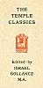
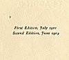

  
[Intangible Textual Heritage](../../index)  [Christianity](../index) 
[Index](index)  [Next](aah01) 

------------------------------------------------------------------------

[Buy this Book at
Amazon.com](https://www.amazon.com/exec/obidos/ASIN/B0026L7H7K/internetsacredte)

------------------------------------------------------------------------

  
*The Love Letters of Abelard and Heloise*, \[1901\], at Intangible
Textual Heritage

------------------------------------------------------------------------

###### THE TEMPLE CLASSICS Edited by ISRAEL GOLLANCZ M.A.

### THE LOVE LETTERS OF ABELARD AND HELOISE

#### PUBLISHED BY J.M. DENT AND CO.

#### ALDINE HOUSE, LONDON W.C.

#### \[1901\]

Scanned, proofed and formatted at Intangible Textual Heritage, September
2006, by John Bruno Hare. This text is in the public domain in the
United States because it was published prior to January 1st, 1923.

  [  
Click to enlarge](img/cover.jpg)  
Front Cover  

  [  
Click to enlarge](img/incov.jpg)  
Inside front cover  

 
[  
Click to enlarge](img/colo.jpg)  
Colophon  

  [  
Click to enlarge](img/front.jpg)  
Frontispiece: The tomb of Abelard and Heloise in the Cemetery of Père
Lachaise, Paris  

  [  
Click to enlarge](img/title.jpg)  
Title Page  

 
[  
Click to enlarge](img/verso.jpg)  
Verso  

------------------------------------------------------------------------

[Next: Introduction](aah01)
