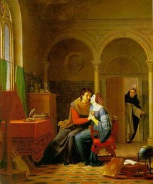

  
[Intangible Textual Heritage](../../index)  [Christianity](../index) 

------------------------------------------------------------------------

[Buy this Book at
Amazon.com](https://www.amazon.com/exec/obidos/ASIN/B0026L7H7K/internetsacredte)

------------------------------------------------------------------------

<table width="75%">
<colgroup>
<col style="width: 50%" />
<col style="width: 50%" />
</colgroup>
<tbody>
<tr class="odd">
<td width="50%" data-valign="TOP"> 
Abelard and Heloise Surprised by Abbot Fulbert, by Jean Vignaud, [1819] (Public Domain Image)</td>
<td width="50%" data-valign="CENTER"><h1 id="the-love-letters-of-abelard-and-heloise" data-align="CENTER">The Love Letters of Abelard and Heloise</h1>
<h5 id="trans.-by-anonymous-edited-by-israel-gollancz-and-honnor-morten" data-align="CENTER">Trans. by Anonymous, edited by Israel Gollancz and Honnor Morten</h5>
<h4 id="section" data-align="CENTER">[1901]</h4></td>
</tr>
</tbody>
</table>

------------------------------------------------------------------------

[Contents](#contents)    [Start Reading](aah00)    [Page
Index](pageidx)    [Text \[Zipped\]](aah.txt.gz)

------------------------------------------------------------------------

|                                                                                                                           |
|---------------------------------------------------------------------------------------------------------------------------|
|  |

Some have it that romantic love was an invention of the Middle Ages. If
so, then the true story of Pierre Abelard and Heloise is one of the
templates of this narrative. Both Abelard and Heloise were prominent
intellectuals of twelfth century France. Abelard, of noble birth and
eighteen years the senior of Heloise, was a prominent lecturer in
philosophy. Abelard was an adventurous thinker, and was constantly at
odds with the Church. On several occasions he was forced to recant and
burn his writings.

Heloise was a strong-willed and gifted woman who was fluent in Latin,
Greek and Hebrew, and came from a lower social standing than Abelard. At
age 19, and living under her uncle Fulbert's roof, Heloise fell in love
with Abelard, who she was studying under. Not only did they have a
clandestine affair of a sexual nature, they had a child, Astrolabe, out
of wedlock. Discovered by the Fulbert (who was a Church official),
Abelard was assaulted by a hired thug and castrated, and Heloise entered
a convent. Abelard was exiled to Brittany, where he lived as monk.
Eventually Heloise became abbess of the Oratory of the Paraclete, an
abbey which Abelard had founded.

It was at this time that they exchanged their famous letters, presented
in this book. The letters, originally written in Latin, are passionate
both in the remembrance of lost love, and the attempt to reconcile that
love with their respective monastic duty to remain chaste. The tension
between these two poles generates a huge amount of emotional
electricity.

This is the first web posting of the letters of Abelard and Heloise.
This includes a long poem by Alexander Pope about the lovers, notable
for the phrase 'eternal sunshine of the spotless mind,' ([p.
104](aah09.htm#page_104), in reference to Heloise) which was recently
used for a movie title.

--J.B. Hare, September 18th, 2006

------------------------------------------------------------------------

 [Title Page](aah00)  
[Introduction](aah01)  
[Contents](aah02)  
[Letter I.--Abelard to Philintus](aah03)  
[Letter II. Heloise to Abelard](aah04)  
[Letter III. Abelard to Heloise](aah05)  
[Letter IV.--Heloise to Abelard](aah06)  
[Letter V.--Heloise to Abelard](aah07)  
[Letter VI. Abelard to Heloise](aah08)  
[Appendix: Pope's 'Eloïsa to Abelard'](aah09)  
[From W. E. Henly's Prologue to Beau Austin](aah10)  
[Editorial Appendix](aah11)  
