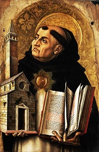

  
[Intangible Textual Heritage](../../../index) 
[Christianity](../../index)  [Aquinas](../index) 

------------------------------------------------------------------------

[Buy this Book at
Amazon.com](https://www.amazon.com/exec/obidos/ASIN/0870610635/internetsacredte)

------------------------------------------------------------------------

<table width="75%">
<colgroup>
<col style="width: 50%" />
<col style="width: 50%" />
</colgroup>
<tbody>
<tr class="odd">
<td width="50%" data-valign="TOP"> 
 (Public Domain Image)</td>
<td width="50%" data-valign="CENTER"><h1 id="summa-theologica" data-align="CENTER">Summa Theologica</h1>
<h2 id="by-st.-thomas-aquinas" data-align="CENTER">by St. Thomas Aquinas</h2>
<h3 id="translated-by-the-fathers-of-the-english-dominican-province" data-align="CENTER">Translated by The Fathers of the English Dominican Province</h3>
<h4 id="section" data-align="CENTER">[1947]</h4></td>
</tr>
</tbody>
</table>

------------------------------------------------------------------------

[Contents](#contents)    [Start Reading](sum000)

------------------------------------------------------------------------

|                                                                                                                           |
|---------------------------------------------------------------------------------------------------------------------------|
|  |

This is St. Thomas Aquinas' encylopedia-length work on Catholic
theology. This translation, considered of high quality, is in the public
domain in the United States due to lack of copyright renewal, as
required by law at the time.

------------------------------------------------------------------------

 

### Title Page

[Title Page](sum000)  

### First Part

[First Part](sum001)  

### Treatise on Sacred Doctrine (Q\[1\])

[Treatise on Sacred Doctrine (Q\[1\])](sum002)  
[Question. 1 - The Nature and Extent of Sacred Doctrine (Ten
Articles)](sum003)  

### Treatise on The One God (QQ\[2-26\])

[Treatise on The One God (QQ\[2-26\])](sum004)  
[Question. 2 - The Existence of God (Three Articles)](sum005)  
[Question. 3 - OF THE SIMPLICITY OF GOD (EIGHT ARTICLES)](sum006)  
[Question. 4 - THE PERFECTION OF GOD (THREE ARTICLES)](sum007)  
[Question. 5 - OF GOODNESS IN GENERAL (SIX ARTICLES)](sum008)  
[Question. 6 - THE GOODNESS OF GOD (FOUR ARTICLES)](sum009)  
[Question. 7 - THE INFINITY OF GOD (FOUR ARTICLES)](sum010)  
[Question. 8 - THE EXISTENCE OF GOD IN THINGS (FOUR ARTICLES)](sum011)  
[Question. 9 - THE IMMUTABILITY OF GOD (TWO ARTICLES)](sum012)  
[Question. 10 - THE ETERNITY OF GOD (SIX ARTICLES)](sum013)  
[Question. 11 - THE UNITY OF GOD (FOUR ARTICLES)](sum014)  
[Question. 12 - HOW GOD IS KNOWN BY US (THIRTEEN ARTICLES)](sum015)  
[Question. 13 - THE NAMES OF GOD (TWELVE ARTICLES)](sum016)  
[Question. 14 - OF GODS KNOWLEDGE (SIXTEEN ARTICLES)](sum017)  
[Question. 15 - OF IDEAS (THREE ARTICLES)](sum018)  
[Question. 16 - OF TRUTH (EIGHT ARTICLES)](sum019)  
[Question. 17 - CONCERNING FALSITY (FOUR ARTICLES)](sum020)  
[Question. 18 - THE LIFE OF GOD (FOUR ARTICLES)](sum021)  
[Question. 19 - THE WILL OF GOD (TWELVE ARTICLES)](sum022)  
[Question. 20 - GOD'S LOVE (FOUR ARTICLES)](sum023)  
[Question. 21 - THE JUSTICE AND MERCY OF GOD (FOUR ARTICLES)](sum024)  
[Question. 22 - THE PROVIDENCE OF GOD (FOUR ARTICLES)](sum025)  
[Question. 23 - OF PREDESTINATION (EIGHT ARTICLES)](sum026)  
[Question. 24 - THE BOOK OF LIFE (THREE ARTICLES)](sum027)  
[Question. 25 - THE POWER OF GOD (SIX ARTICLES)](sum028)  
[Question. 26 - OF THE DIVINE BEATITUDE (FOUR ARTICLES)](sum029)  

### Treatise on The Most Holy Trinity (QQ\[27-43\])

[Treatise on The Most Holy Trinity (QQ\[27-43\])](sum030)  
[Question. 27 - The Procession of the Divine Persons (Five
Articles)](sum031)  
[Question. 28 - THE DIVINE RELATIONS (FOUR ARTICLES)](sum032)  
[Question. 29 - THE DIVINE PERSONS (FOUR ARTICLES)](sum033)  
[Question. 30 - THE PLURALITY OF PERSONS IN GOD (FOUR
ARTICLES)](sum034)  
[Question. 31 - OF WHAT BELONGS TO THE UNITY OR PLURALITY IN GOD (FOUR
ARTICLES)](sum035)  
[Question. 32 - THE KNOWLEDGE OF THE DIVINE PERSONS (FOUR
ARTICLES)](sum036)  
[Question. 33 - OF THE PERSON OF THE FATHER (FOUR ARTICLES)](sum037)  
[Question. 34 - OF THE PERSON OF THE SON (THREE ARTICLES)](sum038)  
[Question. 35 - OF THE IMAGE (TWO ARTICLES)](sum039)  
[Question. 36 - OF THE PERSON OF THE HOLY GHOST (FOUR
ARTICLES)](sum040)  
[Question. 37 - OF THE NAME OF THE HOLY GHOST---LOVE (TWO
ARTICLES)](sum041)  
[Question. 38 - OF THE NAME OF THE HOLY GHOST, AS GIFT (TWO
ARTICLES)](sum042)  
[Question. 39 - OF THE PERSONS IN RELATION TO THE ESSENCE (EIGHT
ARTICLES)](sum043)  
[Question. 40 - OF THE PERSONS AS COMPARED TO THE RELATIONS OR
PROPERTIES (FOUR ARTICLES)](sum044)  
[Question. 41 - OF THE PERSONS IN REFERENCE TO THE NOTIONAL ACTS (SIX
ARTICLES)](sum045)  
[Question. 42 - OF EQUALITY AND LIKENESS AMONG THE DIVINE PERSONS (SIX
ARTICLES)](sum046)  
[Question. 43 - THE MISSION OF THE DIVINE PERSONS (EIGHT
ARTICLES)](sum047)  

### Treatise on The Creation (QQ\[44-49\])

[Treatise on The Creation (QQ\[44-49\])](sum048)  
[Question. 44 - The Procession of Creatures From God, and of the First
Cause of all Things (Four Articles)](sum049)  
[Question. 45 - THE MODE OF EMANATION OF THINGS FROM THE FIRST PRINCIPLE
(EIGHT ARTICLES)](sum050)  
[Question. 46 - OF THE BEGINNING OF THE DURATION OF CREATURES (THREE
ARTICLES)](sum051)  

### Treatise on The Distinction of Things In General (Q\[47\])

[Treatise on The Distinction of Things In General (Q\[47\])](sum052)  
[Question. 47 - Of The Distinctionn of Things In General (Three
Articles)](sum053)  

### Treatise on The Distinction of Good And Evil (Q\[48-49\])

[Treatise on The Distinction of Good And Evil (Q\[48-49\])](sum054)  
[Question. 48 - The Distinction of Things in Particular (Six
Articles)](sum055)  
[Question. 49 - THE CAUSE OF EVIL (THREE ARTICLES)](sum056)  

### TREATISE ON THE ANGELS (QQ\[50\]-64)

[TREATISE ON THE ANGELS (QQ\[50\]-64)](sum057)  
[Question. 50 - Of The Substance of The Angels Absolutely Considered
(Five Articles)](sum058)  
[Question. 51 - OF THE ANGELS IN COMPARISON WITH BODIES (THREE
ARTICLES)](sum059)  
[Question. 52 - OF THE ANGELS IN RELATION TO PLACE (THREE
ARTICLES)](sum060)  
[Question. 53 - OF THE LOCAL MOVEMENT OF THE ANGELS (THREE
ARTICLES)](sum061)  
[Question. 54 - OF THE KNOWLEDGE OF THE ANGELS (FIVE
ARTICLES)](sum062)  
[Question. 55 - OF THE MEDIUM OF THE ANGELIC KNOWLEDGE (THREE
ARTICLES)](sum063)  
[Question. 56 - OF THE ANGEL'S KNOWLEDGE OF IMMATERIAL THINGS (THREE
ARTICLES)](sum064)  
[Question. 57 - OF THE ANGEL'S KNOWLEDGE OF MATERIAL THINGS (FIVE
ARTICLES)](sum065)  
[Question. 58 - OF THE MODE OF ANGELIC KNOWLEDGE (SEVEN
ARTICLES)](sum066)  
[Question. 59 - THE WILL OF THE ANGELS (FOUR ARTICLES)](sum067)  
[Question. 60 - OF THE LOVE OR DILECTION OF THE ANGELS (FIVE
ARTICLES)](sum068)  
[Question. 61 - OF THE PRODUCTION OF THE ANGELS IN THE ORDER OF NATURAL
BEING (FOUR ARTICLES)](sum069)  
[Question. 62 - OF THE PERFECTION OF THE ANGELS IN THE ORDER OF GRACE
AND OF GLORY (NINE ARTICLES)](sum070)  
[Question. 63 - THE MALICE OF THE ANGELS WITH REGARD TO SIN (NINE
ARTICLES)](sum071)  
[Question. 64 - THE PUNISHMENT OF THE DEMONS (FOUR ARTICLES)](sum072)  

### TREATISE ON THE WORK OF THE SIX DAYS (QQ\[65\]-74)

[TREATISE ON THE WORK OF THE SIX DAYS (QQ\[65\]-74)](sum073)  
[Question. 65 - The Work of Creation of Corporeal Creatures (Four
Articles)](sum074)  
[Question. 66 - ON THE ORDER OF CREATION TOWARDS DISTINCTION (FOUR
ARTICLES)](sum075)  
[Question. 67 - ON THE WORK OF DISTINCTION IN ITSELF (FOUR
ARTICLES)](sum076)  
[Question. 68 - ON THE WORK OF THE SECOND DAY (FOUR ARTICLES)](sum077)  
[Question. 69 - ON THE WORK OF THE THIRD DAY (TWO ARTICLES)](sum078)  
[Question. 70 - OF THE WORK OF ADORNMENT, AS REGARDS THE FOURTH DAY
(THREE ARTICLES)](sum079)  
[Question. 71 - ON THE WORK OF THE FIFTH DAY (ONE ARTICLE)](sum080)  
[Question. 72 - ON THE WORK OF THE SIXTH DAY (ONE ARTICLE)](sum081)  
[Question. 73 - ON THE THINGS THAT BELONG TO THE SEVENTH DAY (THREE
ARTICLES)](sum082)  
[Question. 74 - ON ALL THE SEVEN DAYS IN COMMON (THREE
ARTICLES)](sum083)  

### TREATISE ON MAN (QQ\[75\]-102)

[TREATISE ON MAN (QQ\[75\]-102)](sum084)  
[Question. 75 - Of Man Who is Composed of a Spiritual and a Corporeal
Substance: And in the First Place, Concerning What Belongs to the
Essence of the Soul (Seven Articles)](sum085)  
[Question. 76 - OF THE UNION OF BODY AND SOUL (EIGHT
ARTICLES)](sum086)  
[Question. 77 - OF THOSE THINGS WHICH BELONG TO THE POWERS OF THE SOUL
IN GENERAL (EIGHT ARTICLES)](sum087)  
[Question. 78 - OF THE SPECIFIC POWERS OF THE SOUL (FOUR
ARTICLES)](sum088)  
[Question. 79 - OF THE INTELLECTUAL POWERS (THIRTEEN
ARTICLES)](sum089)  
[Question. 80 - OF THE APPETITIVE POWERS IN GENERAL (TWO
ARTICLES)](sum090)  
[Question. 81 - OF THE POWER OF SENSUALITY (THREE ARTICLES)](sum091)  
[Question. 82 - OF THE WILL (FIVE ARTICLES)](sum092)  
[Question. 83 - OF FREE-WILL (FOUR ARTICLES)](sum093)  
[Question. 84 - HOW THE SOUL WHILE UNITED TO THE BODY UNDERSTANDS
CORPOREAL THINGS BENEATH IT (EIGHT ARTICLES)](sum094)  
[Question. 85 - OF THE MODE AND ORDER OF UNDERSTANDING (EIGHT
ARTICLES)](sum095)  
[Question. 86 - WHAT OUR INTELLECT KNOWS IN MATERIAL THINGS (FOUR
ARTICLES)](sum096)  
[Question. 87 - HOW THE INTELLECTUAL SOUL KNOWS ITSELF AND ALL WITHIN
ITSELF (FOUR ARTICLES)](sum097)  
[Question. 88 - HOW THE HUMAN SOUL KNOWS WHAT IS ABOVE ITSELF (THREE
ARTICLES)](sum098)  
[Question. 89 - OF THE KNOWLEDGE OF THE SEPARATED SOUL (EIGHT
ARTICLES)](sum099)  
[Question. 90 - OF THE FIRST PRODUCTION OF MAN'S SOUL (FOUR
ARTICLES)](sum100)  
[Question. 91 - THE PRODUCTION OF THE FIRST MAN'S BODY (FOUR
ARTICLES)](sum101)  
[Question. 92 - THE PRODUCTION OF THE WOMAN (FOUR ARTICLES)](sum102)  
[Question. 93 - THE END OR TERM OF THE PRODUCTION OF MAN (NINE
ARTICLES)](sum103)  
[Question. 94 - OF THE STATE AND CONDITION OF THE FIRST MAN AS REGARDS
HIS INTELLECT (FOUR ARTICLES)](sum104)  
[Question. 95 - OF THINGS PERTAINING TO THE FIRST MAN'S WILL---NAMELY,
GRACE AND RIGHTEOUSNESS (FOUR ARTICLES)](sum105)  
[Question. 96 - OF THE MASTERSHIP BELONGING TO MAN IN THE STATE OF
INNOCENCE (FOUR ARTICLES)](sum106)  
[Question. 97 - OF THE PRESERVATION OF THE INDIVIDUAL IN THE PRIMITIVE
STATE (FOUR ARTICLES)](sum107)  
[Question. 98 - OF THE PRESERVATION OF THE SPECIES (TWO
ARTICLES)](sum108)  
[Question. 99 - OF THE CONDITION OF THE OFFSPRING AS TO THE BODY (TWO
ARTICLES)](sum109)  
[Question. 100 - OF THE CONDITION OF THE OFFSPRING AS REGARDS
RIGHTEOUSNESS (TWO ARTICLES)](sum110)  
[Question. 101 - OF THE CONDITION OF THE OFFSPRING AS REGARDS KNOWLEDGE
(TWO ARTICLES)](sum111)  
[Question. 102 - OF MAN'S ABODE, WHICH IS PARADISE (FOUR
ARTICLES)](sum112)  

### TREATISE ON THE CONSERVATION AND GOVERNMENT OF CREATURES (QQ\[103\]-119)

[TREATISE ON THE CONSERVATION AND GOVERNMENT OF CREATURES
(QQ\[103\]-119)](sum113)  
[Question. 103 - Of the Government of Things in General (Eight
Articles)](sum114)  
[Question. 104 - THE SPECIAL EFFECTS OF THE DIVINE GOVERNMENT (FOUR
ARTICLES)](sum115)  
[Question. 105 - OF THE CHANGE OF CREATURES BY GOD (EIGHT
ARTICLES)](sum116)  
[Question. 106 - HOW ONE CREATURE MOVES ANOTHER (FOUR
ARTICLES)](sum117)  
[Question. 107 - THE SPEECH OF THE ANGELS (FIVE ARTICLES)](sum118)  
[Question. 108 - OF THE ANGELIC DEGREES OF HIERARCHIES AND ORDERS (EIGHT
ARTICLES)](sum119)  
[Question. 109 - THE ORDERING OF THE BAD ANGELS (FOUR
ARTICLES)](sum120)  
[Question. 110 - HOW ANGELS ACT ON BODIES (FOUR ARTICLES)](sum121)  
[Question. 111 - THE ACTION OF THE ANGELS ON MAN (FOUR
ARTICLES)](sum122)  
[Question. 112 - THE MISSION OF THE ANGELS (FOUR ARTICLES)](sum123)  
[Question. 113 - OF THE GUARDIANSHIP OF THE GOOD ANGELS (EIGHT
ARTICLES)](sum124)  
[Question. 114 - OF THE ASSAULTS OF THE DEMONS (FIVE
ARTICLES)](sum125)  
[Question. 115 - OF THE ACTION OF THE CORPOREAL CREATURE (SIX
ARTICLES)](sum126)  
[Question. 116 - ON FATE (FOUR ARTICLES)](sum127)  
[Question. 117 - OF THINGS PERTAINING TO THE ACTION OF MAN (FOUR
ARTICLES)](sum128)  
[Question. 118 - OF THE PRODUCTION OF MAN FROM MAN AS TO THE SOUL (THREE
ARTICLES)](sum129)  
[Question. 119 - OF THE PROPAGATION OF MAN AS TO THE BODY (TWO
ARTICLES)](sum130)  

### First Part of the Second Part (FS) (QQ\[1\]-114)

[First Part of the Second Part (FS) (QQ\[1\]-114)](sum131)  

### Treatise On The Last End (QQ\[1\]-5)

[Treatise On The Last End (QQ\[1\]-5)](sum132)  
[Prologue](sum133)  
[Question. 1 - OF MAN'S LAST END (EIGHT ARTICLES)](sum134)  
[Question. 2 - OF THOSE THINGS IN WHICH MAN'S HAPPINESS CONSISTS (EIGHT
ARTICLES)](sum135)  
[Question. 3 - WHAT IS HAPPINESS (EIGHT ARTICLES)](sum136)  
[Question. 4 - OF THOSE THINGS THAT ARE REQUIRED FOR HAPPINESS (EIGHT
ARTICLES)](sum137)  
[Question. 5 - OF THE ATTAINMENT OF HAPPINESS (EIGHT
ARTICLES)](sum138)  

### TREATISE ON HUMAN ACTS: ACTS PECULIAR TO MAN (QQ\[6\]-21)

[TREATISE ON HUMAN ACTS: ACTS PECULIAR TO MAN (QQ\[6\]-21)](sum139)  
[Question. 6 - OF THE VOLUNTARY AND THE INVOLUNTARY (EIGHT
ARTICLES)](sum140)  
[Question. 7 - OF THE CIRCUMSTANCES OF HUMAN ACTS (FOUR
ARTICLES)](sum141)  
[Question. 8 - OF THE WILL, IN REGARD TO WHAT IT WILLS (THREE
ARTICLES)](sum142)  
[Question. 9 - OF THAT WHICH MOVES THE WILL (SIX ARTICLES)](sum143)  
[Question. 10 - OF THE MANNER IN WHICH THE WILL IS MOVED (FOUR
ARTICLES)](sum144)  
[Question. 11 - OF ENJOYMENT, WHICH IS AN ACT OF THE WILL (FOUR
ARTICLES)](sum145)  
[Question. 12 - OF INTENTION (FIVE ARTICLES)](sum146)  
[Question. 13 - OF CHOICE, WHICH IS AN ACT OF THE WILL WITH REGARD TO
THE MEANS (SIX ARTICLES)](sum147)  
[Question. 14 - OF COUNSEL, WHICH PRECEDES CHOICE (SIX
ARTICLES)](sum148)  
[Question. 15 - OF CONSENT, WHICH IS AN ACT OF THE WILL IN REGARD TO THE
MEANS (FOUR ARTICLES)](sum149)  
[Question. 16 - OF USE, WHICH IS AN ACT OF THE WILL IN REGARD TO THE
MEANS (FOUR ARTICLES)](sum150)  
[Question. 17 - OF THE ACTS COMMANDED BY THE WILL (NINE
ARTICLES)](sum151)  
[Question. 18 - OF THE GOOD AND EVIL OF HUMAN ACTS, IN GENERAL (ELEVEN
ARTICLES)](sum152)  
[Question. 19 - OF THE GOODNESS AND MALICE OF THE INTERIOR ACT OF THE
WILL (TEN ARTICLES)](sum153)  
[Question. 20 - OF GOODNESS AND MALICE IN EXTERNAL HUMAN AFFAIRS (SIX
ARTICLES)](sum154)  
[Question. 21 - OF THE CONSEQUENCES OF HUMAN ACTIONS BY REASON OF THEIR
GOODNESS AND MALICE (FOUR ARTICLES)](sum155)  

### TREATISE ON THE PASSIONS (QQ\[22\]-48)

[TREATISE ON THE PASSIONS (QQ\[22\]-48)](sum156)  
[Question. 22 - OF THE SUBJECT OF THE SOUL'S PASSIONS (THREE
ARTICLES)](sum157)  
[Question. 23 - HOW THE PASSIONS DIFFER FROM ONE ANOTHER (FOUR
ARTICLES)](sum158)  
[Question. 24 - OF GOOD AND EVIL IN THE PASSIONS OF THE SOUL (FOUR
ARTICLES)](sum159)  
[Question. 25 - OF THE ORDER OF THE PASSIONS TO ONE ANOTHER (FOUR
ARTICLES)](sum160)  
[Question. 26 - OF THE PASSIONS OF THE SOUL IN PARTICULAR: AND FIRST, OF
LOVE (FOUR ARTICLES)](sum161)  
[Question. 27 - OF THE CAUSE OF LOVE (FOUR ARTICLES)](sum162)  
[Question. 28 - OF THE EFFECTS OF LOVE (SIX ARTICLES)](sum163)  
[Question. 29 - OF HATRED (SIX ARTICLES)](sum164)  
[Question. 30 - OF CONCUPISCENCE (FOUR ARTICLES)](sum165)  
[Question. 31 - OF DELIGHT CONSIDERED IN ITSELF (EIGHT
ARTICLES)](sum166)  
[Question. 32 - OF THE CAUSE OF PLEASURE (EIGHT ARTICLES)](sum167)  
[Question. 33 - OF THE EFFECTS OF PLEASURE (FOUR ARTICLES)](sum168)  
[Question. 34 - OF THE GOODNESS AND MALICE OF PLEASURES (FOUR
ARTICLES)](sum169)  
[Question. 35 - OF PAIN OR SORROW, IN ITSELF (EIGHT ARTICLES)](sum170)  
[Question. 36 - OF THE CAUSES OF SORROW OR PAIN (FOUR
ARTICLES)](sum171)  
[Question. 37 - OF THE EFFECTS OF PAIN OR SORROW (FOUR
ARTICLES)](sum172)  
[Question. 38 - OF THE REMEDIES OF SORROW OR PAIN (FIVE
ARTICLES)](sum173)  
[Question. 39 - OF THE GOODNESS AND MALICE OF SORROW OR PAIN (FOUR
ARTICLES)](sum174)  
[Question. 40 - OF THE IRASCIBLE PASSIONS, AND FIRST, OF HOPE AND
DESPAIR (EIGHT ARTICLES)](sum175)  
[Question. 41 - OF FEAR, IN ITSELF (FOUR ARTICLES)](sum176)  
[Question. 42 - OF THE OBJECT OF FEAR (SIX ARTICLES)](sum177)  
[Question. 43 - OF THE CAUSE OF FEAR (TWO ARTICLES)](sum178)  
[Question. 44 - OF THE EFFECTS OF FEAR (FOUR ARTICLES)](sum179)  
[Question. 45 - OF DARING (FOUR ARTICLES)](sum180)  
[Question. 46 - OF ANGER, IN ITSELF (EIGHT ARTICLES)](sum181)  
[Question. 47 - OF THE CAUSE THAT PROVOKES ANGER, AND OF THE REMEDIES OF
ANGER (FOUR ARTICLES)](sum182)  
[Question. 48 - OF THE EFFECTS OF ANGER (FOUR ARTICLES)](sum183)  

### TREATISE ON HABITS (QQ\[49\]-54)

[TREATISE ON HABITS (QQ\[49\]-54)](sum184)  
[Question. 49 - OF HABITS IN GENERAL, AS TO THEIR SUBSTANCE (FOUR
ARTICLES)](sum185)  
[Question. 50 - OF THE SUBJECT OF HABITS (SIX ARTICLES)](sum186)  
[Question. 51 - OF THE CAUSE OF HABITS, AS TO THEIR FORMATION (FOUR
ARTICLES)](sum187)  
[Question. 52 - OF THE INCREASE OF HABITS (THREE ARTICLES)](sum188)  
[Question. 53 - HOW HABITS ARE CORRUPTED OR DIMINISHED (THREE
ARTICLES)](sum189)  
[Question. 54 - OF THE DISTINCTION OF HABITS (FOUR ARTICLES)](sum190)  

### TREATISE ON HABITS IN PARTICULAR (QQ\[55\]-89) GOOD HABITS, i.e. VIRTUES (QQ\[55\]-70)

[TREATISE ON HABITS IN PARTICULAR (QQ\[55\]-89) GOOD HABITS, i.e.
VIRTUES (QQ\[55\]-70)](sum191)  
[Question. 55 - OF THE VIRTUES, AS TO THEIR ESSENCE (FOUR
ARTICLES)](sum192)  
[Question. 56 - OF THE SUBJECT OF VIRTUE (SIX ARTICLES)](sum193)  
[Question. 57 - OF THE INTELLECTUAL VIRTUES (SIX ARTICLES)](sum194)  
[Question. 58 - OF THE DIFFERENCE BETWEEN MORAL AND INTELLECTUAL VIRTUES
(FIVE ARTICLES)](sum195)  
[Question. 59 - OF MORAL VIRTUE IN RELATION TO THE PASSIONS (FIVE
ARTICLES)](sum196)  
[Question. 60 - HOW THE MORAL VIRTUES DIFFER FROM ONE ANOTHER (FIVE
ARTICLES)](sum197)  
[Question. 61 - OF THE CARDINAL VIRTUES (FIVE ARTICLES)](sum198)  
[Question. 62 - OF THE THEOLOGICAL VIRTUES (FOUR ARTICLES)](sum199)  
[Question. 63 - OF THE CAUSE OF VIRTUES (FOUR ARTICLES)](sum200)  
[Question. 64 - OF THE MEAN OF VIRTUE (FOUR ARTICLES)](sum201)  
[Question. 65 - OF THE CONNECTION OF VIRTUES (FIVE ARTICLES)](sum202)  
[Question. 66 - OF EQUALITY AMONG THE VIRTUES (SIX ARTICLES)](sum203)  
[Question. 67 - OF THE DURATION OF VIRTUES AFTER THIS LIFE (SIX
ARTICLES)](sum204)  
[Question. 68 - OF THE GIFTS (EIGHT ARTICLES)](sum205)  
[Question. 69 - OF THE BEATITUDES (FOUR ARTICLES)](sum206)  
[Question. 70 - OF THE FRUITS OF THE HOLY GHOST (FOUR
ARTICLES)](sum207)  
[Question. 71 - EVIL HABITS, i.e. VICES AND SINS
(QQ\[71\]-89)](sum208)  
[Question. 72 - OF THE DISTINCTION OF SINS (NINE ARTICLES)](sum209)  
[Question. 73 - OF THE COMPARISON OF ONE SIN WITH ANOTHER (TEN
ARTICLES)](sum210)  
[Question. 74 - OF THE SUBJECT OF SIN (TEN ARTICLES)](sum211)  
[Question. 75 - OF THE CAUSES OF SIN, IN GENERAL (FOUR
ARTICLES)](sum212)  
[Question. 76 - OF THE CAUSES OF SIN, IN PARTICULAR (FOUR
ARTICLES)](sum213)  
[Question. 77 - OF THE CAUSE OF SIN, ON THE PART OF THE SENSITIVE
APPETITE (EIGHT ARTICLES)](sum214)  
[Question. 78 - OF THAT CAUSE OF SIN WHICH IS MALICE (FOUR
ARTICLES)](sum215)  
[Question. 79 - OF THE EXTERNAL CAUSES OF SIN (FOUR ARTICLES)](sum216)  
[Question. 80 - OF THE CAUSE OF SIN, AS REGARDS THE DEVIL (FOUR
ARTICLES)](sum217)  
[Question. 81 - OF THE CAUSE OF SIN, ON THE PART OF MAN (FIVE
ARTICLES)](sum218)  
[Question. 82 - OF ORIGINAL SIN, AS TO ITS ESSENCE (FOUR
ARTICLES)](sum219)  
[Question. 83 - OF THE SUBJECT OF ORIGINAL SIN (FOUR
ARTICLES)](sum220)  
[Question. 84 - OF THE CAUSE OF SIN, IN RESPECT OF ONE SIN BEING THE
CAUSE OF ANOTHER (FOUR ARTICLES)](sum221)  
[Question. 85 - OF THE EFFECTS OF SIN, AND, FIRST, OF THE CORRUPTION OF
THE GOOD OF NATURE (SIX ARTICLES)](sum222)  
[Question. 86 - OF THE STAIN OF SIN (TWO ARTICLES)](sum223)  
[Question. 87 - OF THE DEBT OF PUNISHMENT (EIGHT ARTICLES)](sum224)  
[Question. 88 - OF VENIAL AND MORTAL SIN (SIX ARTICLES)](sum225)  
[Question. 89 - OF VENIAL SIN IN ITSELF (SIX ARTICLES)](sum226)  

### TREATISE ON LAW (QQ 90-108)

[TREATISE ON LAW (QQ 90-108)](sum227)  
[Question. 90 - OF THE ESSENCE OF LAW (FOUR ARTICLES)](sum228)  
[Question. 91 - OF THE VARIOUS KINDS OF LAW (SIX ARTICLES)](sum229)  
[Question. 92 - OF THE EFFECTS OF LAW (TWO ARTICLES)](sum230)  
[Question. 93 - OF THE ETERNAL LAW (SIX ARTICLES)](sum231)  
[Question. 94 - OF THE NATURAL LAW (SIX ARTICLES)](sum232)  
[Question. 95 - OF HUMAN LAW (FOUR ARTICLES)](sum233)  
[Question. 96 - OF THE POWER OF HUMAN LAW (SIX ARTICLES)](sum234)  
[Question. 97 - OF CHANGE IN LAWS (FOUR ARTICLES)](sum235)  
[Question. 98 - OF THE OLD LAW (SIX ARTICLES)](sum236)  
[Question. 99 - OF THE PRECEPTS OF THE OLD LAW (SIX ARTICLES)](sum237)  
[Question. 100 - OF THE MORAL PRECEPTS OF THE OLD LAW (TWELVE
ARTICLES)](sum238)  
[Question. 101 - OF THE CEREMONIAL PRECEPTS IN THEMSELVES (FOUR
ARTICLES)](sum239)  
[Question. 102 - OF THE CAUSES OF THE CEREMONIAL PRECEPTS (SIX
ARTICLES)](sum240)  
[Question. 103 - OF THE DURATION OF THE CEREMONIAL PRECEPTS (FOUR
ARTICLES)](sum241)  
[Question. 104 - OF THE JUDICIAL PRECEPTS (FOUR ARTICLES)](sum242)  
[Question. 105 - OF THE REASON FOR THE JUDICIAL PRECEPTS (FOUR
ARTICLES)](sum243)  
[Question. 106 - OF THE LAW OF THE GOSPEL, CALLED THE NEW LAW,
CONSIDERED IN ITSELF (FOUR ARTICLES)](sum244)  
[Question. 107 - OF THE NEW LAW AS COMPARED WITH THE OLD (FOUR
ARTICLES)](sum245)  
[Question. 108 - OF THOSE THINGS THAT ARE CONTAINED IN THE NEW LAW (FOUR
ARTICLES)](sum246)  

### TREATISE ON GRACE (QQ\[109\]-114)

[TREATISE ON GRACE (QQ\[109\]-114)](sum247)  
[Question. 109 - OF THE NECESSITY OF GRACE (TEN ARTICLES)](sum248)  
[Question. 110 - OF THE GRACE OF GOD AS REGARDS ITS ESSENCE (FOUR
ARTICLES)](sum249)  
[Question. 111 - OF THE DIVISION OF GRACE (FIVE ARTICLES)](sum250)  
[Question. 112 - OF THE CAUSE OF GRACE (FIVE ARTICLES)](sum251)  
[Question. 113 - OF THE EFFECTS OF GRACE (TEN ARTICLES)](sum252)  
[Question. 114 - OF MERIT (TEN ARTICLES)](sum253)  

### Second Part of the Second Part (SS) (QQ\[1\] - 189)

[Second Part of the Second Part (SS) (QQ\[1\] - 189)](sum254)  

### Treatise on The Theological Virtues (QQ\[1\] - 46)

[Treatise on The Theological Virtues (QQ\[1\] - 46)](sum255)  
[Question. 1 - Of Faith (Ten Articles)](sum256)  
[Question. 2 - OF THE ACT OF FAITH (TEN ARTICLES)](sum257)  
[Question. 3 - OF THE OUTWARD ACT OF FAITH (TWO ARTICLES)](sum258)  
[Question. 4 - OF THE VIRTUE ITSELF OF FAITH (EIGHT ARTICLES)](sum259)  
[Question. 5 - OF THOSE WHO HAVE FAITH (FOUR ARTICLES)](sum260)  
[Question. 6 - OF THE CAUSE OF FAITH (TWO ARTICLES)](sum261)  
[Question. 7 - OF THE EFFECTS OF FAITH (TWO ARTICLES)](sum262)  
[Question. 8 - OF THE GIFT OF UNDERSTANDING (EIGHT ARTICLES)](sum263)  
[Question. 9 - OF THE GIFT OF KNOWLEDGE (FOUR ARTICLES)](sum264)  
[Question. 10 - OF UNBELIEF IN GENERAL (TWELVE ARTICLES)](sum265)  
[Question. 11 - OF HERESY (FOUR ARTICLES)](sum266)  
[Question. 12 - OF APOSTASY (TWO ARTICLES)](sum267)  
[Question. 13 - OF THE SIN OF BLASPHEMY, IN GENERAL (FOUR
ARTICLES)](sum268)  
[Question. 14 - OF BLASPHEMY AGAINST THE HOLY GHOST (FOUR
ARTICLES)](sum269)  
[Question. 15 - OF THE VICES OPPOSED TO KNOWLEDGE AND UNDERSTANDING
(THREE ARTICLES)](sum270)  
[Question. 16 - OF THE PRECEPTS OF FAITH, KNOWLEDGE AND UNDERSTANDING
(TWO ARTICLES)](sum271)  
[Question. 17 - Of Hope, Considered in Itself (Eight
Articles)](sum272)  
[Question. 18 - OF THE SUBJECT OF HOPE (FOUR ARTICLES)](sum273)  
[Question. 19 - OF THE GIFT OF FEAR (TWELVE ARTICLES)](sum274)  
[Question. 20 - OF DESPAIR (FOUR ARTICLES)](sum275)  
[Question. 21 - OF PRESUMPTION (FOUR ARTICLES)](sum276)  
[Question. 22 - OF THE PRECEPTS RELATING TO HOPE AND FEAR (TWO
ARTICLES)](sum277)  
[Question. 23 - Of Charity, Considered In Itself (Eight
Articles)](sum278)  
[Question. 24 - OF THE SUBJECT OF CHARITY (TWELVE ARTICLES)](sum279)  
[Question. 25 - OF THE OBJECT OF CHARITY (TWELVE ARTICLES)](sum280)  
[Question. 26 - OF THE ORDER OF CHARITY (THIRTEEN ARTICLES)](sum281)  
[Question. 27 - OF THE PRINCIPLE ACT OF CHARITY, WHICH IS TO LOVE (EIGHT
ARTICLES)](sum282)  
[Question. 28 - OF JOY (FOUR ARTICLES)](sum283)  
[Question. 29 - OF PEACE (FOUR ARTICLES)](sum284)  
[Question. 30 - OF MERCY (FOUR ARTICLES)](sum285)  
[Question. 31 - OF BENEFICENCE (FOUR ARTICLES)](sum286)  
[Question. 32 - OF ALMSDEEDS (TEN ARTICLES)](sum287)  
[Question. 33 - OF FRATERNAL CORRECTION (EIGHT ARTICLES)](sum288)  
[Question. 34 - OF HATRED (SIX ARTICLES)](sum289)  
[Question. 35 - OF SLOTH (FOUR ARTICLES)](sum290)  
[Question. 36 - OF ENVY (FOUR ARTICLES)](sum291)  
[Question. 37 - OF DISCORD, WHICH IS CONTRARY TO PEACE (TWO
ARTICLES)](sum292)  
[Question. 38 - OF CONTENTION (TWO ARTICLES)](sum293)  
[Question. 39 - OF SCHISM (FOUR ARTICLES)](sum294)  
[Question. 40 - OF WAR (FOUR ARTICLES)](sum295)  
[Question. 41 - OF STRIFE (TWO ARTICLES)](sum296)  
[Question. 42 - OF SEDITION (TWO ARTICLES)](sum297)  
[Question. 43 - OF SCANDAL (EIGHT ARTICLES)](sum298)  
[Question. 44 - OF THE PRECEPTS OF CHARITY (EIGHT ARTICLES)](sum299)  
[Question. 45 - OF THE GIFT OF WISDOM (SIX ARTICLES)](sum300)  
[Question. 46 - OF FOLLY WHICH IS OPPOSED TO WISDOM (THREE
ARTICLES)](sum301)  

### TREATISE ON THE CARDINAL VIRTUES (QQ\[47\]-170)

[TREATISE ON THE CARDINAL VIRTUES (QQ\[47\]-170)](sum302)  
[Question. 47 - Of Prudence, Considered In Itself (Sixteen
Articles)](sum303)  
[Question. 48 - OF THE PARTS OF PRUDENCE (ONE ARTICLE)](sum304)  
[Question. 49 - OF EACH QUASI-INTEGRAL PART OF PRUDENCE (EIGHT
ARTICLES)](sum305)  
[Question. 50 - OF THE SUBJECTIVE PARTS OF PRUDENCE (FOUR
ARTICLES)](sum306)  
[Question. 51 - OF THE VIRTUES WHICH ARE CONNECTED WITH PRUDENCE (FOUR
ARTICLES)](sum307)  
[Question. 52 - OF THE GIFT OF COUNSEL (FOUR ARTICLES)](sum308)  
[Question. 53 - OF IMPRUDENCE (SIX ARTICLES)](sum309)  
[Question. 54 - OF NEGLIGENCE (THREE ARTICLES)](sum310)  
[Question. 55 - OF VICES OPPOSED TO PRUDENCE BY WAY OF RESEMBLANCE
(EIGHT ARTICLES)](sum311)  
[Question. 56 - OF THE PRECEPTS RELATING TO PRUDENCE (TWO
ARTICLES)](sum312)  
[Question. 57 - Of Right (Four Articles)](sum313)  
[Question. 58 - OF JUSTICE (TWELVE ARTICLES)](sum314)  
[Question. 59 - OF INJUSTICE (FOUR ARTICLES)](sum315)  
[Question. 60 - OF JUDGMENT (SIX ARTICLES)](sum316)  
[Question. 61 - OF THE PARTS OF JUSTICE (FOUR ARTICLES)](sum317)  
[Question. 62 - OF RESTITUTION (EIGHT ARTICLES)](sum318)  
[Question. 63 - VICES OPPOSED TO DISTRIBUTIVE JUSTICE
(Q\[63\])](sum319)  
[Question. 64 - Of Murder (Eight Articles)](sum320)  
[Question. 65 - OF OTHER INJURIES COMMITTED ON THE PERSON (FOUR
ARTICLES)](sum321)  
[Question. 66 - OF THEFT AND ROBBERY (NINE ARTICLES)](sum322)  
[Question. 67 - OF THE INJUSTICE OF A JUDGE, IN JUDGING (FOUR
ARTICLES)](sum323)  
[Question. 68 - OF MATTERS CONCERNING UNJUST ACCUSATION (FOUR
ARTICLES)](sum324)  
[Question. 69 - OF SINS COMMITTED AGAINST JUSTICE ON THE PART OF THE
DEFENDANT (FOUR ARTICLES)](sum325)  
[Question. 70 - OF INJUSTICE WITH REGARD TO THE PERSON OF THE WITNESS
(FOUR ARTICLES)](sum326)  
[Question. 71 - OF INJUSTICE IN JUDGMENT ON THE PART OF COUNSEL (FOUR
ARTICLES)](sum327)  
[Question. 72 - Of Reviling (Four Articles)](sum328)  
[Question. 73 - OF BACKBITING (FOUR ARTICLES)](sum329)  
[Question. 74 - OF TALE-BEARING (TWO ARTICLES)](sum330)  
[Question. 75 - OF DERISION (TWO ARTICLES)](sum331)  
[Question. 76 - OF CURSING (FOUR ARTICLES)](sum332)  
[Question. 77 - (D) BY SINS COMMITTED IN BUYING AND SELLING
(Q\[77\])](sum333)  
[Question. 78 - (E) BY SINS COMMITTED IN LOANS (Q\[78\])](sum334)  
[Question. 79 - OF THE QUASI-INTEGRAL PARTS OF JUSTICE (FOUR
ARTICLES)](sum335)  
[Question. 80 - OF THE POTENTIAL PARTS OF JUSTICE (ONE
ARTICLE)](sum336)  
[Question. 81 - OF RELIGION (EIGHT ARTICLES)](sum337)  
[Question. 82 - OF DEVOTION (FOUR ARTICLES)](sum338)  
[Question. 83 - OF PRAYER (SEVENTEEN ARTICLES)](sum339)  
[Question. 84 - OF ADORATION (THREE ARTICLES)](sum340)  
[Question. 85 - OF SACRIFICE (FOUR ARTICLES)](sum341)  
[Question. 86 - OF OBLATIONS AND FIRST-FRUITS (FOUR ARTICLES)](sum342)  
[Question. 87 - OF TITHES (FOUR ARTICLES)](sum343)  
[Question. 88 - SERVICE BY PROMISE (Q\[88\])](sum344)  
[Question. 89 - OF OATHS (TEN ARTICLES)](sum345)  
[Question. 90 - OF THE TAKING OF GOD'S NAME BY WAY OF ADJURATION (THREE
ARTICLES)](sum346)  
[Question. 91 - OF TAKING THE DIVINE NAME FOR THE PURPOSE OF INVOKING IT
BY MEANS OF PRAISE (TWO ARTICLES)](sum347)  
[Question. 92 - OF SUPERSTITION (TWO ARTICLES)](sum348)  
[Question. 93 - OF SUPERSTITION CONSISTING IN UNDUE WORSHIP OF THE TRUE
GOD (TWO ARTICLES)](sum349)  
[Question. 94 - OF IDOLATRY (FOUR ARTICLES)](sum350)  
[Question. 95 - OF SUPERSTITION IN DIVINATIONS (EIGHT
ARTICLES)](sum351)  
[Question. 96 - OF SUPERSTITION IN OBSERVANCES (FOUR
ARTICLES)](sum352)  
[Question. 97 - OF THE TEMPTATION OF GOD (FOUR ARTICLES)](sum353)  
[Question. 98 - OF PERJURY (FOUR ARTICLES)](sum354)  
[Question. 99 - OF SACRILEGE (FOUR ARTICLES)](sum355)  
[Question. 100 - ON SIMONY (SIX ARTICLES)](sum356)  
[Question. 101 - OF PIETY (FOUR ARTICLES)](sum357)  
[Question. 102 - OF OBSERVANCE, CONSIDERED IN ITSELF, AND OF ITS PARTS
(THREE ARTICLES)](sum358)  
[Question. 103 - OF DULIA (FOUR ARTICLES)](sum359)  
[Question. 104 - OF OBEDIENCE (SIX ARTICLES)](sum360)  
[Question. 105 - OF DISOBEDIENCE (TWO ARTICLES)](sum361)  
[Question. 106 - OF THANKFULNESS OR GRATITUDE (SIX ARTICLES)](sum362)  
[Question. 107 - OF INGRATITUDE (FOUR ARTICLES)](sum363)  
[Question. 108 - OF VENGEANCE (FOUR ARTICLES)](sum364)  
[Question. 109 - OF TRUTH (FOUR ARTICLES)](sum365)  
[Question. 110 - OF THE VICES OPPOSED TO TRUTH, AND FIRST OF LYING (FOUR
ARTICLES)](sum366)  
[Question. 111 - OF DISSIMULATION AND HYPOCRISY (FOUR
ARTICLES)](sum367)  
[Question. 112 - OF BOASTING (TWO ARTICLES)](sum368)  
[Question. 113 - IRONY (TWO ARTICLES)](sum369)  
[Question. 114 - OF THE FRIENDLINESS WHICH IS CALLED AFFABILITY (TWO
ARTICLES)](sum370)  
[Question. 115 - OF FLATTERY (TWO ARTICLES)](sum371)  
[Question. 116 - OF QUARRELING (TWO ARTICLES)](sum372)  
[Question. 117 - OF LIBERALITY (SIX ARTICLES)](sum373)  
[Question. 118 - OF THE VICES OPPOSED TO LIBERALITY, AND IN THE FIRST
PLACE, OF COVETOUSNESS (EIGHT ARTICLES)](sum374)  
[Question. 119 - OF PRODIGALITY (THREE ARTICLES)](sum375)  
[Question. 120 - OF 'EPIKEIA' OR EQUITY (TWO ARTICLES)](sum376)  
[Question. 121 - OF PIETY (TWO ARTICLES)](sum377)  
[Question. 122 - OF THE PRECEPTS OF JUSTICE (SIX ARTICLES)](sum378)  

### TREATISE ON FORTITUDE AND TEMPERANCE (QQ\[123\]-170)

[TREATISE ON FORTITUDE AND TEMPERANCE (QQ\[123\]-170)](sum379)  
[Question. 123 - OF FORTITUDE (TWELVE ARTICLES)](sum380)  
[Question. 124 - OF MARTYRDOM (FIVE ARTICLES)](sum381)  
[Question. 125 - OF FEAR (FOUR ARTICLES)](sum382)  
[Question. 126 - OF FEARLESSNESS (TWO ARTICLES)](sum383)  
[Question. 127 - OF DARING (TWO ARTICLES)](sum384)  
[Question. 128 - OF THE PARTS OF FORTITUDE (ONE ARTICLE)](sum385)  
[Question. 129 - OF MAGNANIMITY (EIGHT ARTICLES)](sum386)  
[Question. 130 - OF PRESUMPTION (TWO ARTICLES)](sum387)  
[Question. 131 - OF AMBITION (TWO ARTICLES)](sum388)  
[Question. 132 - OF VAINGLORY (FIVE ARTICLES)](sum389)  
[Question. 133 - OF PUSILLANIMITY (TWO ARTICLES)](sum390)  
[Question. 134 - OF MAGNIFICENCE (FOUR ARTICLES)](sum391)  
[Question. 135 - OF MEANNESS (TWO ARTICLES)](sum392)  
[Question. 136 - OF PATIENCE (FIVE ARTICLES)](sum393)  
[Question. 137 - OF PERSEVERANCE (FOUR ARTICLES)](sum394)  
[Question. 138 - OF THE VICES OPPOSED TO PERSEVERANCE (TWO
ARTICLES)](sum395)  
[Question. 139 - OF THE GIFT OF FORTITUDE (TWO ARTICLES)](sum396)  
[Question. 140 - OF THE PRECEPTS OF FORTITUDE (TWO ARTICLES)](sum397)  
[Question. 141 - OF TEMPERANCE (EIGHT ARTICLES)](sum398)  
[Question. 142 - OF THE VICES OPPOSED TO TEMPERANCE (FOUR
ARTICLES)](sum399)  
[Question. 143 - OF THE PARTS OF TEMPERANCE, IN GENERAL (ONE
ARTICLE)](sum400)  
[Question. 144 - OF SHAMEFACEDNESS (FOUR ARTICLES)](sum401)  
[Question. 145 - OF HONESTY (FOUR ARTICLES)](sum402)  
[Question. 146 - OF ABSTINENCE (TWO ARTICLES)](sum403)  
[Question. 147 - OF FASTING (EIGHT ARTICLES)](sum404)  
[Question. 148 - OF GLUTTONY (SIX ARTICLES)](sum405)  
[Question. 149 - OF SOBRIETY (FOUR ARTICLES)](sum406)  
[Question. 150 - OF DRUNKENNESS (FOUR ARTICLES)](sum407)  
[Question. 151 - OF CHASTITY (FOUR ARTICLES)](sum408)  
[Question. 152 - OF VIRGINITY (FIVE ARTICLES)](sum409)  
[Question. 153 - OF LUST (FIVE ARTICLES)](sum410)  
[Question. 154 - OF THE PARTS OF LUST (TWELVE ARTICLES)](sum411)  
[Question. 155 - OF CONTINENCE (FOUR ARTICLES)](sum412)  
[Question. 156 - OF INCONTINENCE (FOUR ARTICLES)](sum413)  
[Question. 157 - OF CLEMENCY AND MEEKNESS (FOUR ARTICLES)](sum414)  
[Question. 158 - OF ANGER (EIGHT ARTICLES)](sum415)  
[Question. 159 - OF CRUELTY (TWO ARTICLES)](sum416)  
[Question. 160 - OF MODESTY (TWO ARTICLES)](sum417)  
[Question. 161 - OF HUMILITY (SIX ARTICLES)](sum418)  
[Question. 162 - OF PRIDE (EIGHT ARTICLES)](sum419)  
[Question. 163 - OF THE FIRST MAN'S SIN (FOUR ARTICLES)](sum420)  
[Question. 164 - OF THE PUNISHMENTS OF THE FIRST MAN'S SIN (TWO
ARTICLES)](sum421)  
[Question. 165 - OF OUR FIRST PARENTS' TEMPTATION (TWO
ARTICLES)](sum422)  
[Question. 166 - OF STUDIOUSNESS (TWO ARTICLES)](sum423)  
[Question. 167 - OF CURIOSITY (TWO ARTICLES)](sum424)  
[Question. 168 - OF MODESTY AS CONSISTING IN THE OUTWARD MOVEMENTS OF
THE BODY (FOUR ARTICLES)](sum425)  
[Question. 169 - OF MODESTY IN THE OUTWARD APPAREL (TWO
ARTICLES)](sum426)  
[Question. 170 - OF THE PRECEPTS OF TEMPERANCE (TWO ARTICLES)](sum427)  

### TREATISE ON GRATUITOUS GRACES (QQ\[171\]-182)

[TREATISE ON GRATUITOUS GRACES (QQ\[171\]-182)](sum428)  
[Question. 171 - OF PROPHECY (SIX ARTICLES)](sum429)  
[Question. 172 - OF THE CAUSE OF PROPHECY (SIX ARTICLES)](sum430)  
[Question. 173 - OF THE MANNER IN WHICH PROPHETIC KNOWLEDGE IS CONVEYED
(FOUR ARTICLES)](sum431)  
[Question. 174 - OF THE DIVISION OF PROPHECY (SIX ARTICLES)](sum432)  
[Question. 175 - OF RAPTURE (SIX ARTICLES)](sum433)  
[Question. 176 - OF THE GRACE OF TONGUES (TWO ARTICLES)](sum434)  
[Question. 177 - OF THE GRATUITOUS GRACE CONSISTING IN WORDS (TWO
ARTICLES)](sum435)  
[Question. 178 - OF THE GRACE OF MIRACLES (TWO ARTICLES)](sum436)  
[Question. 179 - OF THE DIVISION OF LIFE INTO ACTIVE AND CONTEMPLATIVE
(TWO ARTICLES)](sum437)  
[Question. 180 - OF THE CONTEMPLATIVE LIFE (EIGHT ARTICLES)](sum438)  
[Question. 181 - OF THE ACTIVE LIFE (FOUR ARTICLES)](sum439)  
[Question. 182 - OF THE ACTIVE LIFE IN COMPARISON WITH THE CONTEMPLATIVE
LIFE (FOUR ARTICLES)](sum440)  

### TREATISE ON THE STATES OF LIFE (QQ\[183\]-189)

[TREATISE ON THE STATES OF LIFE (QQ\[183\]-189)](sum441)  
[Question. 183 - OF MAN'S VARIOUS DUTIES AND STATES IN GENERAL (FOUR
ARTICLES)](sum442)  
[Question. 184 - OF THE STATE OF PERFECTION IN GENERAL (EIGHT
ARTICLES)](sum443)  
[Question. 185 - OF THINGS PERTAINING TO THE EPISCOPAL STATE (EIGHT
ARTICLES)](sum444)  
[Question. 186 - OF THOSE THINGS IN WHICH THE RELIGIOUS STATE PROPERLY
CONSISTS (TEN ARTICLES)](sum445)  
[Question. 187 - OF THOSE THINGS THAT ARE COMPETENT TO RELIGIOUS (SIX
ARTICLES)](sum446)  
[Question. 188 - OF THE DIFFERENT KINDS OF RELIGIOUS LIFE (EIGHT
ARTICLES)](sum447)  
[Question. 189 - OF THE ENTRANCE INTO RELIGIOUS LIFE (TEN
ARTICLES)](sum448)  

### Third Part (TP) of the Summa Theologica (QQ\[1\] - 90)

[Third Part (TP) of the Summa Theologica (QQ\[1\] - 90)](sum449)  

### Prologue

[Prologue](sum450)  

### TREATISE ON THE INCARNATION (QQ\[1\]-59)

[TREATISE ON THE INCARNATION (QQ\[1\]-59)](sum451)  
[Question. 1 - OF THE FITNESS OF THE INCARNATION (SIX
ARTICLES)](sum452)  
[Question. 2 - OF THE MODE OF UNION OF THE WORD INCARNATE (TWELVE
ARTICLES)](sum453)  
[Question. 3 - OF THE MODE OF UNION ON THE PART OF THE PERSON ASSUMING
(EIGHT ARTICLES)](sum454)  
[Question. 4 - OF THE MODE OF UNION ON THE PART OF THE HUMAN NATURE (SIX
ARTICLES)](sum455)  
[Question. 5 - OF THE PARTS OF HUMAN NATURE WHICH WERE ASSUMED (FOUR
ARTICLES)](sum456)  
[Question. 6 - OF THE ORDER OF ASSUMPTION (SIX ARTICLES)](sum457)  
[Question. 7 - OF THE GRACE OF CHRIST AS AN INDIVIDUAL MAN (THIRTEEN
ARTICLES)](sum458)  
[Question. 8 - OF THE GRACE OF CHRIST, AS HE IS THE HEAD OF THE CHURCH
(EIGHT ARTICLES)](sum459)  
[Question. 9 - OF CHRIST'S KNOWLEDGE IN GENERAL (FOUR
ARTICLES)](sum460)  
[Question. 10 - OF THE BEATIFIC KNOWLEDGE OF CHRIST'S SOUL (FOUR
ARTICLES)](sum461)  
[Question. 11 - OF THE KNOWLEDGE IMPRINTED OR INFUSED IN THE SOUL OF
CHRIST (SIX ARTICLES)](sum462)  
[Question. 12 - OF THE ACQUIRED OR EMPIRIC KNOWLEDGE OF CHRIST'S SOUL
(FOUR ARTICLES)](sum463)  
[Question. 13 - OF THE POWER OF CHRIST'S SOUL (FOUR ARTICLES)](sum464)  
[Question. 14 - OF THE DEFECTS OF BODY ASSUMED BY THE SON OF GOD (FOUR
ARTICLES)](sum465)  
[Question. 15 - OF THE DEFECTS OF SOUL ASSUMED BY CHRIST (TEN
ARTICLES)](sum466)  
[Question. 16 - OF THOSE THINGS WHICH ARE APPLICABLE TO CHRIST IN HIS
BEING AND BECOMING (TWELVE ARTICLES)](sum467)  
[Question. 17 - OF CHRIST'S UNITY OF BEING (TWO ARTICLES)](sum468)  
[Question. 18 - OF CHRIST'S UNITY OF WILL (SIX ARTICLES)](sum469)  
[Question. 19 - OF THE UNITY OF CHRIST'S OPERATION (FOUR
ARTICLES)](sum470)  
[Question. 20 - OF CHRIST'S SUBJECTION TO THE FATHER (TWO
ARTICLES)](sum471)  
[Question. 21 - OF CHRIST'S PRAYER (FOUR ARTICLES)](sum472)  
[Question. 22 - OF THE PRIESTHOOD OF CHRIST (SIX ARTICLES)](sum473)  
[Question. 23 - OF ADOPTION AS BEFITTING TO CHRIST (FOUR
ARTICLES)](sum474)  
[Question. 24 - OF THE PREDESTINATION OF CHRIST (FOUR
ARTICLES)](sum475)  
[Question. 25 - OF THE ADORATION OF CHRIST (SIX ARTICLES)](sum476)  
[Question. 26 - OF CHRIST AS CALLED THE MEDIATOR OF GOD AND MAN (TWO
ARTICLES)](sum477)  
[Question. 27 - OF THE SANCTIFICATION OF THE BLESSED VIRGIN (SIX
ARTICLES)](sum478)  
[Question. 28 - OF THE VIRGINITY OF THE MOTHER OF GOD (FOUR
ARTICLES)](sum479)  
[Question. 29 - OF THE ESPOUSALS OF THE MOTHER OF GOD (TWO
ARTICLES)](sum480)  
[Question. 30 - OF THE ANNUNCIATION OF THE BLESSED VIRGIN (FOUR
ARTICLES)](sum481)  
[Question. 31 - OF THE MATTER FROM WHICH THE SAVIOUR'S BODY WAS
CONCEIVED (EIGHT ARTICLES)](sum482)  
[Question. 32 - OF THE ACTIVE PRINCIPLE IN CHRIST'S CONCEPTION (FOUR
ARTICLES)](sum483)  
[Question. 33 - OF THE MODE AND ORDER OF CHRIST'S CONCEPTION (FOUR
ARTICLES)](sum484)  
[Question. 34 - OF THE PERFECTION OF THE CHILD CONCEIVED (FOUR
ARTICLES)](sum485)  
[Question. 35 - OF CHRIST'S NATIVITY (EIGHT ARTICLES)](sum486)  
[Question. 36 - OF THE MANIFESTATION OF THE NEWLY BORN CHRIST (EIGHT
ARTICLES)](sum487)  
[Question. 37 - OF CHRIST'S CIRCUMCISION, AND OF THE OTHER LEGAL
OBSERVANCES ACCOMPLISHED IN REGARD TO THE CHILD CHRIST (FOUR
ARTICLES)](sum488)  
[Question. 38 - OF THE BAPTISM OF JOHN (SIX ARTICLES)](sum489)  
[Question. 39 - OF THE BAPTIZING OF CHRIST (EIGHT ARTICLES)](sum490)  
[Question. 40 - OF CHRIST'S MANNER OF LIFE (FOUR ARTICLES)](sum491)  
[Question. 41 - OF CHRIST'S TEMPTATION (FOUR ARTICLES)](sum492)  
[Question. 42 - OF CHRIST'S DOCTRINE (FOUR ARTICLES)](sum493)  
[Question. 43 - OF THE MIRACLES WORKED BY CHRIST, IN GENERAL (FOUR
ARTICLES)](sum494)  
[Question. 44 - OF (CHRIST'S) MIRACLES CONSIDERED SPECIFICALLY (FOUR
ARTICLES)](sum495)  
[Question. 45 - OF CHRIST'S TRANSFIGURATION (FOUR ARTICLES)](sum496)  
[Question. 46 - THE PASSION OF CHRIST (TWELVE ARTICLES)](sum497)  
[Question. 47 - OF THE EFFICIENT CAUSE OF CHRIST'S PASSION (SIX
ARTICLES)](sum498)  
[Question. 48 - OF THE EFFICIENCY OF CHRIST'S PASSION (SIX
ARTICLES)](sum499)  
[Question. 49 - OF THE EFFECTS OF CHRIST'S PASSION (SIX
ARTICLES)](sum500)  
[Question. 50 - OF THE DEATH OF CHRIST (SIX ARTICLES)](sum501)  
[Question. 51 - OF CHRIST'S BURIAL (FOUR ARTICLES)](sum502)  
[Question. 52 - OF CHRIST'S DESCENT INTO HELL (EIGHT
ARTICLES)](sum503)  
[Question. 53 - OF CHRIST'S RESURRECTION (FOUR ARTICLES)](sum504)  
[Question. 54 - OF THE QUALITY OF CHRIST RISING AGAIN (FOUR
ARTICLES)](sum505)  
[Question. 55 - OF THE MANIFESTATION OF THE RESURRECTION (SIX
ARTICLES)](sum506)  
[Question. 56 - OF THE CAUSALITY OF CHRIST'S RESURRECTION (TWO
ARTICLES)](sum507)  
[Question. 57 - OF THE ASCENSION OF CHRIST (SIX ARTICLES)](sum508)  
[Question. 58 - OF CHRIST'S SITTING AT THE RIGHT HAND OF THE FATHER
(FOUR ARTICLES)](sum509)  
[Question. 59 - OF CHRIST'S JUDICIARY POWER (SIX ARTICLES)](sum510)  

### TREATISE ON THE SACRAMENTS (QQ\[60\]-90)

[TREATISE ON THE SACRAMENTS (QQ\[60\]-90)](sum511)  
[Question. 60 - WHAT IS A SACRAMENT? (EIGHT ARTICLES)](sum512)  
[Question. 61 - OF THE NECESSITY OF THE SACRAMENTS (FOUR
ARTICLES)](sum513)  
[Question. 62 - OF THE SACRAMENTS' PRINCIPAL EFFECT, WHICH IS GRACE (SIX
ARTICLES)](sum514)  
[Question. 63 - OF THE OTHER EFFECT OF THE SACRAMENTS, WHICH IS A
CHARACTER (SIX ARTICLES)](sum515)  
[Question. 64 - OF THE CAUSES OF THE SACRAMENTS (TEN
ARTICLES)](sum516)  
[Question. 65 - OF THE NUMBER OF THE SACRAMENTS (FOUR
ARTICLES)](sum517)  
[Question. 66 - OF THE SACRAMENT OF BAPTISM (TWELVE ARTICLES)](sum518)  
[Question. 67 - OF THE MINISTERS BY WHOM THE SACRAMENT OF BAPTISM IS
CONFERRED (EIGHT ARTICLES)](sum519)  
[Question. 68 - OF THOSE WHO RECEIVE BAPTISM (TWELVE
ARTICLES)](sum520)  
[Question. 69 - OF THE EFFECTS OF BAPTISM (TEN ARTICLES)](sum521)  
[Question. 70 - OF CIRCUMCISION (FOUR ARTICLES)](sum522)  
[Question. 71 - OF THE PREPARATIONS THAT ACCOMPANY BAPTISM (FOUR
ARTICLES)](sum523)  
[Question. 72 - CONFIRMATION (Q\[72\])](sum524)  
[Question. 73 - OF THE SACRAMENT OF THE EUCHARIST (SIX
ARTICLES)](sum525)  
[Question. 74 - OF THE MATTER OF THIS SACRAMENT (EIGHT
ARTICLES)](sum526)  
[Question. 75 - OF THE CHANGE OF BREAD AND WINE INTO THE BODY AND BLOOD
OF CHRIST (EIGHT ARTICLES)](sum527)  
[Question. 76 - OF THE WAY IN WHICH CHRIST IS IN THIS SACRAMENT (EIGHT
ARTICLES)](sum528)  
[Question. 77 - OF THE ACCIDENTS WHICH REMAIN IN THIS SACRAMENT (EIGHT
ARTICLES)](sum529)  
[Question. 78 - OF THE FORM OF THIS SACRAMENT (SIX ARTICLES)](sum530)  
[Question. 79 - OF THE EFFECTS OF THIS SACRAMENT (EIGHT
ARTICLES)](sum531)  
[Question. 80 - OF THE USE OR RECEIVING OF THIS SACRAMENT IN GENERAL
(TWELVE ARTICLES)](sum532)  
[Question. 81 - OF THE USE WHICH CHRIST MADE OF THIS SACRAMENT AT ITS
INSTITUTION (FOUR ARTICLES)](sum533)  
[Question. 82 - OF THE MINISTER OF THIS SACRAMENT (TEN
ARTICLES)](sum534)  
[Question. 83 - OF THE RITE OF THIS SACRAMENT (SIX ARTICLES)](sum535)  
[Question. 84 - OF THE SACRAMENT OF PENANCE (TEN ARTICLES)](sum536)  
[Question. 85 - OF PENANCE AS A VIRTUE (SIX ARTICLES)](sum537)  
[Question. 86 - OF THE EFFECT OF PENANCE, AS REGARDS THE PARDON OF
MORTAL SIN (SIX ARTICLES)](sum538)  
[Question. 87 - OF THE REMISSION OF VENIAL SIN (FOUR
ARTICLES)](sum539)  
[Question. 88 - OF THE RETURN OF SINS WHICH HAVE BEEN TAKEN AWAY BY
PENANCE (FOUR ARTICLES)](sum540)  
[Question. 89 - OF THE RECOVERY OF VIRTUE BY MEANS OF PENANCE (SIX
ARTICLES)](sum541)  
[Question. 90 - OF THE PARTS OF PENANCE, IN GENERAL (FOUR
ARTICLES)](sum542)  

### SUPPLEMENT (XP): TO THE THIRD PART OF THE SUMMA THEOLOGICA

[SUPPLEMENT (XP): TO THE THIRD PART OF THE SUMMA THEOLOGICA](sum543)  

### EDITOR'S NOTE:

[EDITOR'S NOTE:](sum544)  

### QQ\[1 - 68\]

[QQ\[1 - 68\]](sum545)  
[Question. 1 - SUPPLEMENT (XP): TO THE THIRD PART OF THE SUMMA
THEOLOGICA OF ST. THOMAS AQUINAS GATHERED FROM HIS COMMENTARY ON BOOK IV
OF THE SENTENCES (QQ\[1\] -99)](sum546)  
[Question. 2 - OF THE OBJECT OF CONTRITION (SIX ARTICLES)](sum547)  
[Question. 3 - OF THE DEGREE OF CONTRITION (THREE ARTICLES)](sum548)  
[Question. 4 - OF THE TIME FOR CONTRITION (THREE ARTICLES)](sum549)  
[Question. 5 - OF THE EFFECT OF CONTRITION (THREE ARTICLES)](sum550)  
[Question. 6 - OF CONFESSION, AS REGARDS ITS NECESSITY (SIX
ARTICLES)](sum551)  
[Question. 7 - OF THE NATURE OF CONFESSION (THREE ARTICLES)](sum552)  
[Question. 8 - OF THE MINISTER OF CONFESSION (SEVEN ARTICLES)](sum553)  
[Question. 9 - OF THE QUALITY OF CONFESSION (FOUR ARTICLES)](sum554)  
[Question. 10 - OF THE EFFECT OF CONFESSION (FIVE ARTICLES)](sum555)  
[Question. 11 - OF THE SEAL OF CONFESSION (FIVE ARTICLES)](sum556)  
[Question. 12 - OF SATISFACTION, AS TO ITS NATURE (THREE
ARTICLES)](sum557)  
[Question. 13 - OF THE POSSIBILITY OF SATISFACTION (TWO
ARTICLES)](sum558)  
[Question. 14 - OF THE QUALITY OF SATISFACTION (FIVE
ARTICLES)](sum559)  
[Question. 15 - OF THE MEANS OF MAKING SATISFACTION (THREE
ARTICLES)](sum560)  
[Question. 16 - OF THOSE WHO RECEIVE THE SACRAMENT OF PENANCE (THREE
ARTICLES)](sum561)  
[Question. 17 - OF THE POWER OF THE KEYS (THREE ARTICLES)](sum562)  
[Question. 18 - OF THE EFFECT OF THE KEYS (FOUR ARTICLES)](sum563)  
[Question. 19 - OF THE MINISTERS OF THE KEYS (SIX ARTICLES)](sum564)  
[Question. 20 - OF THOSE ON WHOM THE POWER OF THE KEYS CAN BE EXERCISED
(THREE ARTICLES)](sum565)  
[Question. 21 - OF THE DEFINITION, CONGRUITY AND CAUSE OF
EXCOMMUNICATION (FOUR ARTICLES)](sum566)  
[Question. 22 - OF THOSE WHO CAN EXCOMMUNICATE OR BE EXCOMMUNICATED (SIX
ARTICLES)](sum567)  
[Question. 23 - OF COMMUNICATION WITH EXCOMMUNICATED PERSONS (THREE
ARTICLES)](sum568)  
[Question. 24 - OF ABSOLUTION FROM EXCOMMUNICATION (THREE
ARTICLES)](sum569)  
[Question. 25 - OF INDULGENCES (THREE ARTICLES)](sum570)  
[Question. 26 - OF THOSE WHO CAN GRANT INDULGENCES (FOUR
ARTICLES)](sum571)  
[Question. 27 - OF THOSE WHOM INDULGENCES AVAIL (FOUR
ARTICLES)](sum572)  
[Question. 28 - OF THE SOLEMN RITE OF PENANCE (THREE
ARTICLES)](sum573)  
[Question. 29 - EXTREME UNCTION (QQ\[29\]-33)](sum574)  
[Question. 30 - OF THE EFFECT OF THIS SACRAMENT (THREE
ARTICLES)](sum575)  
[Question. 31 - OF THE MINISTER OF THIS SACRAMENT (THREE
ARTICLES)](sum576)  
[Question. 32 - ON WHOM SHOULD THIS SACRAMENT BE CONFERRED AND ON WHAT
PART OF THE BODY? (SEVEN ARTICLES)](sum577)  
[Question. 33 - OF THE REPETITION OF THIS SACRAMENT (TWO
ARTICLES)](sum578)  
[Question. 34 - HOLY ORDERS (QQ\[34\]-40)](sum579)  
[Question. 35 - OF THE EFFECT OF THIS SACRAMENT (FIVE
ARTICLES)](sum580)  
[Question. 36 - OF THE QUALITIES REQUIRED OF THOSE WHO RECEIVE THIS
SACRAMENT (FIVE ARTICLES)](sum581)  
[Question. 37 - OF THE DISTINCTION OF ORDERS, OF THEIR ACTS, AND THE
IMPRINTING OF THE CHARACTER (FIVE ARTICLES)](sum582)  
[Question. 38 - OF THOSE WHO CONFER THIS SACRAMENT (TWO
ARTICLES)](sum583)  
[Question. 39 - OF THE IMPEDIMENTS TO THIS SACRAMENT (SIX
ARTICLES)](sum584)  
[Question. 40 - OF THE THINGS ANNEXED TO THE SACRAMENT OF ORDER (SEVEN
ARTICLES)](sum585)  
[Question. 41 - MATRIMONY (QQ\[41\]-67)](sum586)  
[Question. 42 - OF MATRIMONY AS A SACRAMENT (FOUR ARTICLES)](sum587)  
[Question. 43 - OF MATRIMONY WITH REGARD TO THE BETROTHAL (THREE
ARTICLES)](sum588)  
[Question. 44 - OF THE DEFINITION OF MATRIMONY (THREE
ARTICLES)](sum589)  
[Question. 45 - OF THE MARRIAGE CONSENT CONSIDERED IN ITSELF (FIVE
ARTICLES)](sum590)  
[Question. 46 - OF THE CONSENT TO WHICH AN OATH OR CARNAL INTERCOURSE IS
APPENDED (TWO ARTICLES)](sum591)  
[Question. 47 - OF COMPULSORY AND CONDITIONAL CONSENT (SIX
ARTICLES)](sum592)  
[Question. 48 - OF THE OBJECT OF THE CONSENT (TWO ARTICLES)](sum593)  
[Question. 49 - OF THE MARRIAGE GOODS (SIX ARTICLES)](sum594)  
[Question. 50 - OF THE IMPEDIMENTS OF MARRIAGE, IN GENERAL (ONE
ARTICLE)](sum595)  
[Question. 51 - OF THE IMPEDIMENT OF ERROR (TWO ARTICLES)](sum596)  
[Question. 52 - OF THE IMPEDIMENT OF THE CONDITION OF SLAVERY (FOUR
ARTICLES)](sum597)  
[Question. 53 - OF THE IMPEDIMENT OF VOWS AND ORDERS (FOUR
ARTICLES)](sum598)  
[Question. 54 - OF THE IMPEDIMENT OF CONSANGUINITY (FOUR
ARTICLES)](sum599)  
[Question. 55 - OF THE IMPEDIMENT OF AFFINITY (ELEVEN
ARTICLES)](sum600)  
[Question. 56 - OF THE IMPEDIMENT OF SPIRITUAL RELATIONSHIP (FIVE
ARTICLES)](sum601)  
[Question. 57 - OF LEGAL RELATIONSHIP, WHICH IS BY ADOPTION (THREE
ARTICLES)](sum602)  
[Question. 58 - OF THE IMPEDIMENTS OF IMPOTENCE, SPELL, FRENZY OR
MADNESS, INCEST AND DEFECTIVE AGE (FIVE ARTICLES)](sum603)  
[Question. 59 - OF DISPARITY OF WORSHIP AS AN IMPEDIMENT TO MARRIAGE
(SIX ARTICLES)](sum604)  
[Question. 60 - OF WIFE-MURDER (TWO ARTICLES)](sum605)  
[Question. 61 - OF THE IMPEDIMENT TO MARRIAGE, ARISING FROM A SOLEMN VOW
(THREE ARTICLES)](sum606)  
[Question. 62 - OF THE IMPEDIMENT THAT SUPERVENES TO MARRIAGE AFTER ITS
CONSUMMATION, NAMELY FORNICATION (SIX ARTICLES)](sum607)  
[Question. 63 - OF SECOND MARRIAGES (TWO ARTICLES)](sum608)  
[Question. 64 - OF THE THINGS ANNEXED TO MARRIAGE, AND FIRST OF THE
PAYMENT OF THE MARRIAGE DEBT (TEN ARTICLES)](sum609)  
[Question. 65 - OF PLURALITY OF WIVES (FIVE ARTICLES)](sum610)  
[Question. 66 - OF BIGAMY AND OF THE IRREGULARITY CONTRACTED THEREBY
(FIVE ARTICLES)](sum611)  
[Question. 67 - OF THE BILL OF DIVORCE (SEVEN ARTICLES)](sum612)  
[Question. 68 - OF ILLEGITIMATE CHILDREN (THREE ARTICLES)](sum613)  

### TREATISE ON THE RESURRECTION (QQ\[69\]-86)

[TREATISE ON THE RESURRECTION (QQ\[69\]-86)](sum614)  
[Question. 69 - OF MATTERS CONCERNING THE RESURRECTION, AND FIRST OF THE
PLACE WHERE SOULS ARE AFTER DEATH (SEVEN ARTICLES)](sum615)  
[Question. 70 - OF THE QUALITY OF THE SOUL AFTER LEAVING THE BODY, AND
OF THE PUNISHMENT INFLICTED ON IT BY MATERIAL FIRE (THREE
ARTICLES)](sum616)  
[Question. 71 - OF THE SUFFRAGES FOR THE DEAD (FOURTEEN
ARTICLES)](sum617)  
[Question. 72 - OF PRAYERS WITH REGARD TO THE SAINTS IN HEAVEN (THREE
ARTICLES)](sum618)  
[Question. 73 - OF THE SIGNS THAT WILL PRECEDE THE JUDGMENT (THREE
ARTICLES)](sum619)  
[Question. 74 - OF THE FIRE OF THE FINAL CONFLAGRATION (NINE
ARTICLES)](sum620)  
[Question. 75 - OF THE RESURRECTION (THREE ARTICLES)](sum621)  
[Question. 76 - OF THE CAUSE OF THE RESURRECTION (THREE
ARTICLES)](sum622)  
[Question. 77 - OF THE TIME AND MANNER OF THE RESURRECTION (FOUR
ARTICLES)](sum623)  
[Question. 78 - OF THE TERM 'WHEREFROM' OF THE RESURRECTION (THREE
ARTICLES)](sum624)  
[Question. 79 - OF THE CONDITIONS OF THOSE WHO RISE AGAIN, AND FIRST OF
THEIR IDENTITY (THREE ARTICLES)](sum625)  
[Question. 80 - OF THE INTEGRITY OF THE BODIES IN THE RESURRECTION (FIVE
ARTICLES)](sum626)  
[Question. 81 - OF THE QUALITY OF THOSE WHO RISE AGAIN (FOUR
ARTICLES)](sum627)  
[Question. 82 - OF THE IMPASSIBILITY OF THE BODIES OF THE BLESSED AFTER
THEIR RESURRECTION (FOUR ARTICLES)](sum628)  
[Question. 83 - OF THE SUBTLETY OF THE BODIES OF THE BLESSED (SIX
ARTICLES)](sum629)  
[Question. 84 - OF THE AGILITY OF THE BODIES OF THE BLESSED (THREE
ARTICLES)](sum630)  
[Question. 85 - OF THE CLARITY OF THE BEATIFIED BODIES (THREE
ARTICLES)](sum631)  
[Question. 86 - OF THE CONDITIONS UNDER WHICH THE BODIES OF THE DAMNED
WILL RISE AGAIN (THREE ARTICLES)](sum632)  

### TREATISE ON THE LAST THINGS (QQ\[86\]-99)

[TREATISE ON THE LAST THINGS (QQ\[86\]-99)](sum633)  
[Question. 87 - OF THE KNOWLEDGE WHICH, AFTER RISING AGAIN, MEN WILL
HAVE AT THE JUDGMENT CONCERNING MERITS AND DEMERITS (THREE
ARTICLES)](sum634)  
[Question. 88 - OF THE GENERAL JUDGMENT, AS TO THE TIME AND PLACE AT
WHICH IT WILL BE (FOUR ARTICLES)](sum635)  
[Question. 89 - OF THOSE WHO WILL JUDGE AND OF THOSE WHO WILL BE JUDGED
AT THE GENERAL JUDGMENT (EIGHT ARTICLES)](sum636)  
[Question. 90 - OF THE FORM OF THE JUDGE IN COMING TO THE JUDGMENT
(THREE ARTICLES)](sum637)  
[Question. 91 - OF THE QUALITY OF THE WORLD AFTER THE JUDGMENT (FIVE
ARTICLES)](sum638)  
[Question. 92 - OF THE VISION OF THE DIVINE ESSENCE IN REFERENCE TO THE
BLESSED (THREE ARTICLES)](sum639)  
[Question. 93 - OF THE HAPPINESS OF THE SAINTS AND THEIR MANSIONS (THREE
ARTICLES)](sum640)  
[Question. 94 - OF THE RELATIONS OF THE SAINTS TOWARDS THE DAMNED (THREE
ARTICLES)](sum641)  
[Question. 95 - OF THE GIFTS OF THE BLESSED (FIVE ARTICLES)](sum642)  
[Question. 96 - OF THE AUREOLES (THIRTEEN ARTICLES)](sum643)  
[Question. 97 - OF THE PUNISHMENT OF THE DAMNED (SEVEN
ARTICLES)](sum644)  
[Question. 98 - OF THE WILL AND INTELLECT OF THE DAMNED (NINE
ARTICLES)](sum645)  
[Question. 99 - OF GOD'S MERCY AND JUSTICE TOWARDS THE DAMNED (FIVE
ARTICLES)](sum646)  

### Appendix

[Appendix](sum647)  

### Appendix 1

[Appendix 1](sum648)  
[Question. 1 - OF THE QUALITY OF THOSE SOULS WHO DEPART THIS LIFE WITH
ORIGINAL SIN ONLY (TWO ARTICLES)](sum649)  
[Question. 2 - OF THE QUALITY OF SOULS WHO EXPIATE ACTUAL SIN OR ITS
PUNISHMENT IN PURGATORY (SIX ARTICLES)](sum650)  

### Appendix 2

[Appendix 2](sum651)  
[TWO ARTICLES ON PURGATORY](sum652)  

### Indexes

[Indexes](sum653)  

### Index of Scripture References

[Index of Scripture References](sum654)  
