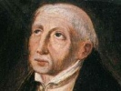

  
[Intangible Textual Heritage](../../index)  [Christianity](../index) 
[Index](index)  [Previous](asm047)  [Next](asm049) 

------------------------------------------------------------------------

[Buy this Book at
Amazon.com](https://www.amazon.com/exec/obidos/ASIN/B002BDV8D2/internetsacredte)

------------------------------------------------------------------------

  
*The Adornment of the Spiritual Marriage*, by Jan van Ruysbroeck,
\[1916\], at Intangible Textual Heritage

------------------------------------------------------------------------

## CHAPTER XVIII

 

### OF THE PURE DELIGHT OF THE HEART AND THE SENSIBLE POWERS

 

From this sweetness there springs a well-being of the heart and of all
the bodily powers, so that a man thinks himself to be inwardly enfolded
in the divine embrace of love. This delight and this consolation are
greater and more pleasant to the soul and the body than all the
satisfactions of the earth, even though one man should enjoy them all
together. In this well-being God sinks into the heart by means of His
gifts; with so much savoury solace and joy that the heart overflows from
within. This makes a man comprehend the misery of those who live outside
love. This well-being melts the heart to such a degree, that the man
cannot contain himself through the fulness of inward joy.

------------------------------------------------------------------------

[Next: Chapter XIX. Of Spiritual Inebriation](asm049)
