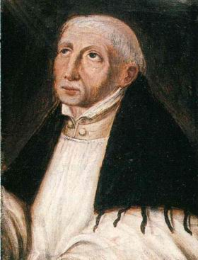

  
[Intangible Textual Heritage](../../index)  [Christianity](../index) 

------------------------------------------------------------------------

[Buy this Book at
Amazon.com](https://www.amazon.com/exec/obidos/ASIN/B002BDV8D2/internetsacredte)

------------------------------------------------------------------------

<table width="75%">
<colgroup>
<col style="width: 50%" />
<col style="width: 50%" />
</colgroup>
<tbody>
<tr class="odd">
<td width="50%" data-valign="TOP"></td>
<td width="50%" data-valign="CENTER"><h1 id="the-adornment-of-the-spiritual-marriage" data-align="CENTER">The Adornment of the Spiritual Marriage</h1>
<h2 id="by-jan-van-ruysbroeck" data-align="CENTER">by Jan van Ruysbroeck</h2>
<h3 id="tr.-by-c.-a.-wynschenk-dom" data-align="CENTER">tr. by C. A. Wynschenk Dom</h3>
<h3 id="ed.-by-evelyn-underhill" data-align="CENTER">ed. by Evelyn Underhill</h3>
<h4 id="section" data-align="CENTER">[1916]</h4></td>
</tr>
</tbody>
</table>

------------------------------------------------------------------------

[Contents](#contents)    [Start Reading](asm000)    [Text
\[Zipped\]](asm.txt.gz)

------------------------------------------------------------------------

|                                                                                                                           |
|---------------------------------------------------------------------------------------------------------------------------|
|  |

Jan van Ruysbroeck \[b. 1293 or 1294, d. 1381\] was a Flemish mystic. He
led a life of asuterity, eventually founding a congregation in
Groenendaal. His writings were widely circulated in his lifetime and he
influenced an entire generation of Christian mystics. He was beatified
on Decmber 1st, 1908, by Pope St. Pius X.

------------------------------------------------------------------------

 [Title Page](asm000)  
[Contents](asm001)  
[Introduction](asm002)  

### The Adornment of the Spiritual Marriage

### First Book

[Prologue](asm003)  
[Chapter I. Of the Active Life](asm004)  
[Chapter II. Showing How We Shall Consider the Coming of Christ in Three
Ways](asm005)  
[Chapter III. Of Humility](asm006)  
[Chapter VI. Of Charity](asm007)  
[Chapter V. Of Patient Endurance](asm008)  
[Chapter VI. Of the Second Coming Of Christ](asm009)  
[Chapter VII. Of the Blessed Sacraments](asm010)  
[Chapter VIII. Of the Third Coming of Christ](asm011)  
[Chapter IX. Showing What Christ Will Do in the Day of Doom](asm012)  
[Chapter X. Of the Five Kinds of Men Who Shall Appear at the
Judgment](asm013)  
[Chapter XI. Of a Spiritual Going Out With All Virtues](asm014)  
[Chapter XII. How Humility is the Foundation of All Other
Virtues](asm015)  
[Chapter XIII. Of Obedience](asm016)  
[Chapter XIV. Of the Renunciation of Self Will](asm017)  
[Chapter XV. Of Patience](asm018)  
[Chapter XVI. Of Meekness](asm019)  
[Chapter XVII. Of Kindliness](asm020)  
[Chapter XVIII. Of Compassion](asm021)  
[Chapter XIX. Of Generosity](asm022)  
[Chapter XX. Of Zeal and Diligence](asm023)  
[Chapter XXI. Of Temperance and Sobriety](asm024)  
[Chapter XXII. Of Purity](asm025)  
[Chapter XXIII. Of Three Enemies to be Overcome by
Righteousness](asm026)  
[Chapter XXIV. Of the Kingdom of the Soul](asm027)  
[Chapter XXV. Of a Spiritual Meeting of God and Ourselves](asm028)  
[Chapter XXVI. Of The Desire to Know the Bridegroom in His
Nature](asm029)  

### Second Book

[Prologue](asm030)  
[Chapter I. How We Achieve Supernatural Sight in Our Inward
Workings](asm031)  
[Chapter II. Of A Three-Fold Unity Which is in Us By Nature](asm032)  
[Chapter III. Of the Inflow of the Grace of God into Our
Spirit](asm033)  
[Chapter IV. Showing How We Should Found Our Inward Life on A Freedom
from Images](asm034)  
[Chapter V. Of a Three-Fold Coming of Our Lord in the Inward
Man](asm035)  
[Chapter VI. Of the Second Coming of Our Lord in the Inward
Man](asm036)  
[Chapter VII. Of the Third Coming of Our Lord](asm037)  
[Chapter VIII. How the First Coming Has Four Degrees](asm038)  
[Chapter IX. Of Unity of Heart](asm039)  
[Chapter X. Of Inwardness](asm040)  
[Chapter XI. Of Sensible Love](asm041)  
[Chapter XII. Of Devotion](asm042)  
[Chapter XIII. Of Gratitude](asm043)  
[Chapter XIV. Of Two Griefs Which Arise From Inward Gratitude](asm044)  
[Chapter XV. A Similitude How We Should Perform the First Degree of Our
Inward Exercise](asm045)  
[Chapter XVI. Another Similitude Concerning the Same Exercise](asm046)  
[Chapter XVII. Of The Second Degree of Our Inward Exercise, Which
Increases Inwardness by Humility](asm047)  
[Chapter XVIII. Of the Pure Delight of the Heart and the Sensible
Powers](asm048)  
[Chapter XIX. Of Spiritual Inebriation](asm049)  
[Chapter XX. What May Hinder a Man in this Inebriation](asm050)  
[Chapter XII. A Similitude How A Man Should Act and Bear Himself in this
Case](asm051)  
[Chapter XXII. Of The Third Degree of the Spiritual Coming of
Christ](asm052)  
[Chapter XXIII. Of the Pain and Restlessness of Love](asm053)  
[Chapter XXIV. Of Ecstacies and Divine Revelations](asm054)  
[Chapter XXV. An Example Showing How One is Hindered in this
Exercise](asm055)  
[Chapter XXVI. Another Example](asm056)  
[Chapter XXVII. A Parable of the Ant](asm057)  
[Chapter XXVIII. Of the Fourth Degree of the Coming of Christ](asm058)  
[Chapter XXIX. Showing What the Forsaken Man Should Do](asm059)  
[Chapter XXX. A Parable: How One May Be Hindered in this Fourth
Degree](asm060)  
[Chapter XXXI. Of Another Hindrance](asm061)  
[Chapter XXXII. Of Four Kinds of Fever Wherewith A Man May Be
Tormented](asm062)  
[Chapter XXXIII. Showing How These Four Degrees in their Perfection are
Found in Christ](asm063)  
[Chapter XXXIV. Showing How a Man Should Live if He Would be
Enlightened](asm064)  
[Chapter XXXV. Of The Second Coming of Christ, or, the Fountain with
Three Rills](asm065)  
[Chapter XXXVI. The First Rill Adorns the Memory](asm066)  
[Chapter XXXVII. The Second Rill Enlightens the Understanding](asm067)  
[Chapter XXXVIII. The Third Rill Establishes the Will to Every
Perfection](asm068)  
[Chapter XXXIX. Showing How the Established Man Shall Go Out in Four
Ways](asm069)  
[Chapter XL. He Shall Go Out Towards God and Towards All
Saints](asm070)  
[Chapter XLI. He Shall Go Out Towards All Sinners](asm071)  
[Chapter XLII. He Shall Go Out Towards His Friends in
Purgatory](asm072)  
[Chapter XLIII. He Shall Go Out Towards Himself and Towards All Good
Men](asm073)  
[Chapter XLIV. Showing How We May Recognise Those Men Who Fail in
Charity to All](asm074)  
[Chapter XLV. How Christ Was, Is, and Ever Will Be the Lover of
All](asm075)  
[Chapter XLVI. Reproving All Those Who Live on Spiritual Goods in an
Inordinate Manner](asm076)  
[Chapter XLVII. Showing How Christ Has Given Himself to all in Common in
the Sacrament of the Altar](asm077)  
[Chapter XLVIII. Of The Unity of the Divine Nature in the Trinity of the
Persons](asm078)  
[Chapter XLIX. Showing How God Possesses and Moves the Soul Both in a
Natural and a Supernatural Way](asm079)  
[Chapter L. Howing How A Man Should Be Adorned if He is to Receive the
Most Inward Exercise](asm080)  
[Chapter LI. Of the Third Coming of Christ](asm081)  
[Chapter LII. Showing how the Spirit Goes Out Through the Divine
Stirring](asm082)  
[Chapter LIII. Of an Eternal Hunger for God](asm083)  
[Chapter LIV. Of A Loving Strife Between the Spirit of God and Our
Spirit](asm084)  
[Chapter LV. Of the Fruitful Works of the Spirit, the Which are
Eternal](asm085)  
[Chapter LVI. Showing the Way in Which We Shall Meet God in a Ghostly
Manner Both with and Without Means](asm086)  
[Chapter LVII. Of the Essential Meeting WITH God Without Means in the
Nakedness of Our Nature](asm087)  
[Chapter LVIII. Showing How One is Like Unto God Through Grace and
Unlike Unto God Through Mortal Sin](asm088)  
[Chapter LIX. Showing How One Possesses God In Union and Rest, Above All
Likeness Through Grace](asm089)  
[Chapter LX. Showing How We Have Need of the Grace of God, Which Makes
Us Like Unto God and Leads Us to God Without Means](asm090)  
[Chapter LIX. of How God and Our Spirit Visit Each Other in the Unity
and in the Likeness](asm091)  
[Chapter LXII. Showing How We Should Go Out to Meet God](asm092)  
[Chapter LXIII. Of the Ordering of All the Virtues Through the Seven
Gifts of the Holy Ghost](asm093)  
[Chapter :LXIV. Of the Highest Degree of the Most Interior
Life](asm094)  
[Chapter LXV. Of Three Kinds of Most Inward Practices](asm095)  
[Chapter LXVI. Showing How Some Men Live Contrary to These
Exercises](asm096)  
[Chapter LXVII. Of Another Kind of Perverted Men](asm097)  

### Third Book

[Chapter I. Showing the Three Ways by Which One Enters into the
God-Seeing Life](asm098)  
[Chapter II. How the Eternal Birth of God is Renewed Without
Interruption in the Nobility of the Spirit](asm099)  
[Chapter III. How Our Spirit is Called to Go Out in Contemplation and
Fruition](asm100)  
[Chapter IV. Of A Divine Meeting Which Takes Place in the Hiddenness of
Our Spirit](asm101)  

### The Sparkling Stone

[Prologue](asm102)  
[Chapter I. Through Three Things A Man Becomes Good](asm103)  
[Chapter II. Through Three Things A Man Becomes Inward](asm104)  
[ChapterIII. Through Three Things A Man Becomes God-Seeing](asm105)  
[Chapter IV. Of the Sparkling Stone, and of the New Name Written in the
Book of the Secrets of God](asm106)  
[Chapter V. Of the Works Which God Works in All in Common and of Five
Kinds of Sinners](asm107)  
[Chapter VI. Of the Difference Between the Hirelings and the Faithful
Servants of God](asm108)  
[Chapter VII. Of The Difference Between the Faithful Servants and the
Secret Friends of God](asm109)  
[Chapter VIII. Of the Difference Between the Secret Friends and the
Hidden Sons of God](asm110)  
[Chapter IX. How We May Become Hidden Sons of God, and Attain to the
God-Seeing Life](asm111)  
[Chapter X. How We, Though One With God, Must Eternally Remain Other
Than God](asm112)  
[Chapter XI. Of the Great Difference Between the Brightness of the
Saints and the Highest Brightness to Which We Can Attain in This
Life](asm113)  
[Chapter XII. Of The Transfiguration of Christ on Mount
Thabor](asm114)  
[Chapter XIII. How We Ought to Have Fruition Of God](asm115)  
[Chapter XIV. Of that Common Life Which Comes from the Contemplation and
Fruition of God](asm116)  

### The Book of Supreme Truth

[Prologue](asm117)  
[Chapter I. Wherefore this Book was Written](asm118)  
[Chapter II. A Short Repetition of All the Highest Teachings Written by
the Author](asm119)  
[Chapter III. Of the Union Through Means](asm120)  
[Chapter IV. Of The Men Who Practise A False Vacancy](asm121)  
[Chapter V. Of the Union Without Means](asm122)  
[Chapter VI. Of Heavenly Weal and Hellish Woe](asm123)  
[Chapter VII. Showing Wherefore All Good Men Do Not Attain to the
Unmediated Union with God](asm124)  
[Chapter VIII. Showing How the Inward Man Should Exercise Himself, That
He May be United with God Without Means](asm125)  
[Chapter IX. Of The Inward Working of God's Grace](asm126)  
[Chapter X. Of the Mutual Contentment of the Divine Persons, and the
Mutual Contentment Between God and Good Men](asm127)  
[Chapter XI. How Good Men in Their Contemplation Have the Love of God
Before Them, and How They are Lifted Up INTO God](asm128)  
[Chapter XII. Of the Highest Union, Without Difference or
Distinction](asm129)  
[Chapter XIII. Of the Threefold Prayer of Christ, That We Might Be One
With God](asm130)  
[Chapter XIV. Here The Author Declares That He Submits All That He Has
Written to the Judgment of Holy Church](asm131)  
[Footnotes](asm132)  
