[Sacred-Texts](../../index) [Christianity](../index) [Index](index) [Previous](bct07) [Next](bct09)

------------------------------------------------------------------------

p. 168

 

> \[THE FIFTH THOUSAND YEARS. FROM THE TWENTY-SIXTH YEAR OF EHUD'S LIFE
> TO THE SECOND YEAR OF THE REIGN OF CYRUS.\]

 

   Nâbhîn (Jabin), who was dried up in body, ruled twenty years.

   Deborah and Barak \[ruled them\] forty years. The children \[Fol. 30*b*, col. 2\] of Israel were in subjection
to the Midianites seven years, and God delivered them by the hands of
Gideon, who ruled them forty years.

   Abimelech his son reigned after him three years.

   Tûla\` (Tola), the son of Puah \[ruled them\] twenty-three years.

   Yâîr, the Gileadite, twenty-two years.

   And again the children of Israel were in subjection to the Ammonites
eighteen years, and God delivered them by the hand of Naphta<u>h</u>
(Jephthah), the man who offered up his daughter as a sacrifice, and he
ruled them six years.

   Abhî<u>s</u>ân (Ibzan of Bethlehem), who is Na<u>h</u>shôn (*sic*),
ruled them seven years.

p. 169

   Alôn (Elon), who was from Zebulon, ruled them ten years.

   \`Abhrôn (Abdon, the son of Hillel, the Pirathonite) ruled them eight
years.

   And the children of Israel were in subjection to the Philistines
forty years, and God delivered them by the hand of Samson, and he ruled
them twenty years.

   And the \[Fol. 31*a*, col. 1\] children of
Israel lived without a governor for eighteen years, and then Eli the
priest rose up and ruled them forty years.

   And Samuel rose up over them and ruled them twenty years. And in the
days of Samuel the children of Israel provoked to wrath God, Who had
delivered them from the servitude of the Egyptians, and they made Saul,
the son of Kish, king, and he reigned over them forty years.

   And in the days of Saul lived Gûlyâdh (Goliath), a giant of the
Philistines. He came nigh and reviled Israel, and blasphemed against
God, and David, the son of Jesse, killed him. And David was praised in
songs by the daughters of Israel, and Saul persecuted him. And the
Philistines slew Saul because he forsook the Lord, and took refuge with
the devils.

 

   **\[**NOTE.--The story of David and Goliath finds an interesting
parallel in the history of Sanehat p. 170 as
found in an Egyptian papyrus in the Royal Library at Berlin. Sanehat
fled from Egypt as the result of some political trouble, and made his
way into Palestine, where he settled down and prospered, and became a
shêkh of great influence and importance. Then a certain man of Thennu
went to Sanehat's tent and reviled him, and challenged him to fight him.
This man was a mighty warrior, and was famed throughout the country for
his strength, and valour, and success. During the following night
Sanehat made ready his dagger, and spear, and bow, and at daybreak all
the tribes came to the place to witness the great duel which was to take
place. The man of Thennu grasped his shield and his battle-axe, and then
began to hurl his spears at Sanehat, but they either went wide or
Sanehat managed in some way to avoid them; in any case, they failed to
touch him. When the man of Thennu saw this, he lost his temper, and made
a rush at Sanehat, meaning to close with him and despatch him with his
battle-axe. But as he came on in his mad rage Sanehat hurled his short
javelin at his head, and it pierced his neck and remained fast in it.
The man of Thennu uttered a prolonged shriek and then fell headlong on
the ground, face downwards. Sanehat went to him, and, taking his foe's
weapons from him, killed him with them. Then p.
171 he took his stand on the dead body, and shouted the cry of
victory, and the onlookers rejoiced in his triumph and applauded
him.**\]**

 

   David reigned over \[Fol. 31*a*, col. 2\]
the children of Israel forty years, and Solomon, his son, reigned forty
years.

   And Solomon did great and wonderful things, and it was he who sent to
Ophir and brought gold from the mountains of gold, and the ships sailed
the sea for thirty-six months, and then came forth (*i.e.* returned). It
was he who built Tadmor (Palmyra) in the wilderness, and he carried out
there great and wonderful works. And when Solomon passed the borders of
the mountain which is called Sâ\`êr, he found there the altar which
Pîôrzâkhâr, and Pîôrzânâi, and Neznâdhôr had built. These were they whom
Nimrod, the giant, sent to Balaam, the priest of the Mountain of Sâ\`êr,
because he heard that he was wont to consult the Signs of the Zodiac,
and when they were passing the skirts of the mountain they built there
an altar to the sun. And when Solomon saw it he built a city there and
called its name "Nîâpôlîs " (more correctly, Heliopolis) \[Fol. 31*b*, col. 1\], that is to say, "City of the
Sun." And Solomon also built Aradus (Arvad) in the midst of the sea, and
he became so famous and renowned p. 172 that
the report of his wise acts went out into all the ends of the earth. And
the Queen of Sheba went to hold converse with him. And Solomon loved
Hiram, king of Tyre, greatly. And Hiram reigned in Tyre five hundred
years, from the days of the kingdom of David to the \[days of\] the
kingdom of Zedekiah and of all the kings of the children of Israel. And
at length he forgot that he was a man, and he blasphemed and said, "I am
God, and I sit upon the throne of God in the middle of the sea." And
Nebuchadnezzar the king killed him.

 

   **\[**NOTE.--Solomon reigned over his large kingdom with the greatest
wisdom ever found. But he did not keep his soul; but inclined his heart
to the love of women, and forsook God, Who had created him and given him
his kingdom. And he died in his denial of Him, and in his sins. *Book of
Adam* (iv. 8.)**\]**

 

\[The purple linen of Tyre.\]

   And in the days of Hiram the purple-\[coloured\] apparel worn by
kings \[first\] appeared. As a dog was running along the sea-shore \[at
Tyre\] he saw a purple shell-fish (*i.e.* the murex) coming up out of
the \[Fol. 31*b*, col. 2\] water, and he bit
it, and straightway his mouth was filled with the blood of that
shell-fish. And a certain p. 173 shepherd who
saw the dog brought a piece of woollen cloth and wiped the dog's mouth
with it. And he made that piece of woollen cloth into a crown (*i.e.* a
*kafîyah* or head-cloth), and set it upon his head, and as he walked
along in the sun, those who saw him thought that rays of fire were
coming forth from his head, and when Hiram heard \[of this\] he sent for
the man. And when he saw the woollen cloth he marvelled, and was
astonished. And all the dyers gathered together and marvelled at it, and
they set out to enquire into the matter; and they found some of these
shell-fish and rejoiced greatly.

 

\[The Apostasy of Solomon.\]

   And Solomon waxed exceedingly great. And the food \[provided for his
table every day\] consisted of forty oxen, one hundred head of sheep,
thirty measures of fine flour, sixty measures of wheat, and three
hundred measures of wine; and besides all this \[Fol. 32*a*, col. 1\], stags, and gazelle, and wild
antelopes, and other creatures of the desert. And he became froward and
transgressed the Law, and hearkened not to the commands of his father,
and he took to wife one thousand women from all the peoples whom God
hated. And in the time of his old age he gave himself up to women, and
he let them play with him, and he hearkened to their words, and did
p. 174 their will. And he denied the God of
David, his father. And he builded altars to devils, and offered up
sacrifices to idols and graven images, and he worshipped the work of the
hands; and God turned away His face from him and he died. And he reigned
in Jerusalem forty-six years.

 

   **\[**NOTE.--Solomon was seduced into idolatry by his wife, the
daughter of Pharaoh. "One day she beautified and scented herself for
him, and she behaved herself haughtily towards him, and treated him
disdainfully. And he said unto her, 'What shall I do? Thou hast made thy
face evil towards me, and thy regard towards me is not as it was
formerly, and thy beautiful form is not as enticing as usual. Ask me,
and I will give thee whatsoever thou wishest, and I will perform it for
thee, so that thou mayest make thy face gracious towards me as
formerly'; but she held her peace and answered him never a word. And he
repeated to her the words that he would do whatsoever she wished. And
she said unto him, 'Swear to me by the God of Israel that thou wilt not
play me false.' And he swore to her that he would give her whatsoever
she asked for, and that he would do for her everything she told him. And
she tied a scarlet thread on the middle of the door of \[the p. 175 house of\] her gods, and she brought three
locusts and set them in the house of her gods. And she said unto
Solomon, 'Come to me without breaking the scarlet thread, bend thyself
and kill these locusts before me, and pull out their necks,' and he did
so. And she said unto him, 'I will henceforward do thy will, for thou
hast sacrificed to my gods and hast worshipped them.' Now he had done
this because of his oath, so that he might not break his oath which she
had made him to swear, even though he knew that it was an offence (or,
sin) to enter into the house of her gods." *Kebra Nagast* (chapter
lxiv).**\]**

 

\[Rehoboam.\]

   And Rehoboam, the son of Solomon, reigned after him. Rehoboam was
forty-one years old when \[he began\] to reign, and he polluted
Jerusalem with fornication, and the altars of devils, and the stink of
heathendom; and the kingdom of Israel was rent in twain. And in the
fifth year \[Fol. 32*a*, col. 2\] of his
kingdom Shishak, the king of Egypt, went up against Jerusalem. And he
carried off all the treasure of the service of the house of the Lord,
and all the treasure of the kingdom of David, and of that of Solomon,
and the vessels of gold and the vessels of silver. And he magnified
himself and said, "I am not p. 176 taking
away treasure which is yours but the wealth which your fathers tok out
of Egypt." And Rehoboam died in the heathen practices of his father
Solomon.

   \[Shishak was the first king of the XXIInd Dynasty and reigned about
20 years (947-928 B.C.): he was of Libyan
origin. The Egyptian form of his name is SHASHANQ 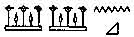, and it is
found with his title "beloved of Amen" in a cartouche thus:
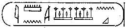.\]

   And Abijah his son reigned after him and he destroyed Jerusalem with
fornication and with heathen works--now, Melkâ, the mother of
\`Abhd-Shâlôm, was his mother--and he died in the heathen practices of
his father.

   And Asa his son reigned after him for forty years in Jerusalem. He
did that which was good before the Lord, and he put away fornication
from Jerusalem, and made an end of the heathen practices of his people,
for he kept the commandments of God \[Fol.
32*b*, col. 1\]. And he drove them (*i.e.* the idolators) out of his
palace (or, kingdom), and made them to be a mockery before all the
people, because they \[taught\] the offering of sacrifices to idols. And
Zerah of Judah went up against him, and God humbled him before Asa. And
Asa died in righteousness like his father David.

p. 177

 

   **\[**NOTE.--The *Book of Adam* (iv. 8) says that Asaph (*i.e.* Asa)
took his mother Anna, who was an adulteress, and cast her down from the
roof of her house, and she died. Zerah, who is called Eleazar, is
described as a "black king" who reigned at Endena. No mention of Zerah
the Cushite has hitherto been found in the cuneiform or hieroglyphic
inscriptions.**\]**

 

   And Jehosaphat his son reigned after him, and he walked in the ways
of Asa his father, and he did that which was pleasing before God. And
God was angry with him because he was a friend of the house of Ahab, and
for this reason God did not permit him to bring out gold from Ophir. Now
he made ships to send thither, and they were broken at Ezion Geber. He
was thirty-two years old when he began to reign, and the name of his
mother was \`Azôbhâ (Azuba ?), the daughter of Shâlâh. And Jehosaphat
died in his righteousness.

   Joram reigned after him, and he was thirty-two years old \[Fol. 32*b*, col. 2\] when he began to reign; he
reigned eight years in Jerusalem. He did not do what was pleasing before
God, for he sacrificed at the altar of devils, and he died in his
heathen practices.

 

   **\[**NOTE.--In the *Book of Adam* he is called Aram. Zambri made war
upon him, and he died denying God.**\]**

p. 178

 

   Ahaziah his son reigned after him, and he was twenty-two years old
when \[he began\] to reign; he lived for one year in Jerusalem, and did
evil things before God in that year. Because of the wickedness and
iniquity which he wrought, God delivered him into the hands of his
enemies and they killed him. When he was dead his mother \[Athaliah\]
killed all the royal children of the house of David, imagining that she
would uproot the children of the Jews. The only person of the seed of
the royal house whom she did not slay was Joash, whom Yôshba\`
(Jehosheba), the daughter of Joram, the son of Jehosaphat, carried away
secretly and hid \[Fol. 33*a*, col. 1\] with
her in her house.

 

\[Reign of Ahab's sister.\]

   And the sister of Ahab reigned seven years in Jerusalem. And she
polluted the city with fornication, for she commanded the women to play
the whore without fear, and the men to commit adultery with the wives of
their neighbours without incurring any penalty. And she herself
committed fornication like Jezebel, and she adopted all the heathen
practices of the house of Ahab in Jerusalem.

 

\[Reign of Joash.\]

   And after seven years the children of Jerusalem considered whom they
should make their king, p. 179 and Jehoiada
the priest gathered them together in the house of the Lord, in the
temple which Solomon had built. And when the captains of thousands and
the captains of hundreds had gathered together, Jehoiada the priest said
unto them, "Whom say ye shall be king and sit upon the throne of David
except \[he be\] a king and the son of a king?" And when he showed him
\[Fol. 33*a*, col. 2\] to them they rejoiced
with an exceedingly great joy. And the captains of thousands, and the
captains of hundreds, and the "runners," and the messengers brought the
kingdom to the house of the Lord, and the soldiers who were armed
surrounded him on all sides; and Jehoiada the priest set him (*i.e.*
Joash) upon the throne of David his father. And \[Joash\] was seven
years old when \[he began\] to reign, and he reigned forty years in
Jerusalem. And the name of his mother was <u>S</u>ûbhâ (Zibea) and she
was from Beersheba. And Athaliah \[the mother of Ahaziah\] was killed.
And Joash requited with evil the kindness which Jehoiada had done him,
and after his death he shed the innocent blood of his sons. And Joash
died, and Amaziah his son reigned after him.

   Amaziah was twenty-five years old when he began to reign, and he
reigned twenty-nine years in Jerusalem; and the name of his mother p. 180 was Yâhô\`adhân (Joadan). And Amaziah died,
and \[Fol. 33*b*, col. 1\] Uzziah his son
reigned after him.

   Uzziah was sixteen years old when \[he began\] to reign, and he
reigned fifty (*sic*) years in Jerusalem; and the name of his mother was
Îkhânyâ (Jechalia). And he did that which was good before the Lord. Now,
he made bold to go into the Holy of Holies, and he took the censer from
the priest of God (Azariah), and burned incense in the temple of the
Lord; and because he did this leprosy covered his face. And because
Isaiah the prophet did not rebuke him, he was prevented from prophesying
until Uzziah died. And Jotham his son reigned in his stead.

   Jotham was twenty-five years old when \[he began\] to reign, and he
reigned sixteen years in Jerusalem; and the name of his mother was
Îrûshâ (Jerusa), the daughter of Zadok. And he did that which was good
before the Lord, and he died and Ahaz his son reigned after him.

 

\[Ahaz a vassal of the King of Assyria.\]

   Ahaz was twenty years old when \[he began\] to reign, and he reigned
sixteen years in Jerusalem \[Fol. 33*b*, col.
2\]; and the name of his mother was \`Aphin, the daughter of Levi. And
he did that which was evil before the Lord, and he p. 181 sacrificed to devils. Tiglath-Pileser, the
king of Assyria, went up against him, and Ahaz wrote himself down in his
letter as his servant, and the Assyrian held him in subjection. And Ahaz
sent to the king of Assyria the gold and silver \[which were in\] the
house of the Lord, \[and in his days\] the children of Israel were
carried off into captivity. And the king sent for the men who had come
from Babel, so that they might dwell in the land instead of the children
of Israel, because they could kill the lions. And the king of Assyria
sent to them Ôrî \[Fol. 34*a*, col. 1\] the
priest, and he taught them the laws. And Ahaz died and Hezekiah his son
reigned after him.

 

   **\[**NOTE.--The Assyrian king who conquered Ahaz was Tiglath Pileser
III, who reigned from 745-727 B.C. In a list
of the kings in the British Museum which were his tributaries we find--

<table style="width:100%;" data-align="center">
<colgroup>
<col style="width: 10%" />
<col style="width: 10%" />
<col style="width: 10%" />
<col style="width: 10%" />
<col style="width: 10%" />
<col style="width: 10%" />
<col style="width: 10%" />
<col style="width: 10%" />
<col style="width: 10%" />
<col style="width: 10%" />
</colgroup>
<tbody>
<tr class="odd">
<td style="text-align: center;"></td>
<td style="text-align: center;">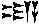</td>
<td style="text-align: center;">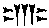</td>
<td style="text-align: center;"></td>
<td style="text-align: center;">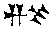</td>
<td style="text-align: center;"></td>
<td style="text-align: center;"></td>
<td style="text-align: center;"></td>
<td style="text-align: center;">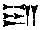</td>
<td style="text-align: center;">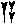 </td>
</tr>
<tr class="even">
<td style="text-align: center;"></td>
<td style="text-align: center;"><em>Ia-</em></td>
<td style="text-align: center;"><em>u-</em></td>
<td style="text-align: center;"><em>kha-</em></td>
<td style="text-align: center;"><em>zi</em></td>
<td style="text-align: center;"><em>(matu)</em></td>
<td style="text-align: center;"><em>Ia-</em></td>
<td style="text-align: center;"><em>u-</em></td>
<td style="text-align: center;"><em>da-</em></td>
<td style="text-align: center;"><em>ai</em></td>
</tr>
<tr class="odd">
<td style="text-align: center;" colspan="10">Ahaz [king of] the country of the Judeans. 
(Brit. Mus. K. 2751.)</td>
</tr>
</tbody>
</table>

Tiglath Pileser's Babylonian name was PU-LU,
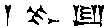, which we find in the Bible under the form of
"Pul." (*See* [II Kings xv. 29](../../bib/kjv/kg2.htm#15:29); [xvi.
7](../../bib/kjv/kg2.htm#16:7), 10; and [I Chron. v.
26](../../bib/kjv/ch1.htm#5:26).)**\]**

p. 182

 

\[Hezekiah.\]

   Hezekiah was twenty-five years old when \[he began\] to reign, and he
reigned twenty-nine years in Jerusalem; and the name of his mother was
Akhi (Abhi ?), the daughter of Zechariah. And he did that which was
pleasing before the Lord, for he smashed the altars, and he cut in
pieces the serpent of brass which Moses made in the wilderness, because
the children of Israel used to worship it, and he abolished heathen
practices in Jerusalem.

   In the fourth year of his reign, Shalmaneser, king of Assyria, came
up and carried away captive the rest of the children of Israel, and he
sent them into Media, beyond Babel.

 

   **\[**NOTE.--Tiglath Pileser III having conquered Syria carried away
into captivity the Israelitish tribes of Reuben and Gad, and the half
tribe of Manasseh. His successor Shelmaneser V, 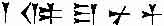
(727-722 B.C.) attacked <u>H</u>osea, king of
Israel, and conquered him and, because he was an ally of the king of
Egypt, carried him off into captivity.**\]**

 

   And in the twentieth year of Hezekiah, Sennacherib, king of Assyria,
came up and took all the cities and towns of Judah, but through the
prayer of Hezekiah Jerusalem was saved.

p. 183

 

   **\[**NOTE.--Sennacherib, , king of Assyria,
705-681 B.C., having brought Padi from
Jerusalem and made him king of Ekron, then marched on to attack

|                                                    |                           |                          |                           |                         |                          |                            |                          |                          |                          |                                                 |
|:--------------------------------------------------:|:-------------------------:|:------------------------:|:-------------------------:|:-----------------------:|:------------------------:|:--------------------------:|:------------------------:|:------------------------:|:------------------------:|:-----------------------------------------------:|
|                          |  | 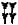 |  |  |  |  |  |  |  |   |
|                                                    |          *Kha-*           |          *za-*           |       *<u>k</u>i-*        |          *a-*           |           *u-*           |          *(matu)*          |          *Ia-*           |           *u-*           |          *da-*           |                      *ai*                       |
| "Hezekiah \[king of\] the country of the Judeans." |                           |                          |                           |                         |                          |                            |                          |                          |                          |                                                 |

He captured 46 of Hezekiah's strongholds, and brought out from them
200,150 people, and horses, mules, asses, camels, oxen, and innumerable
sheep. He then shut up Hezekiah like a caged bird in

|                                          |                          |                          |                          |                          |                          |                           |                            |                          |                                                  |
|:----------------------------------------:|:------------------------:|:------------------------:|:------------------------:|:------------------------:|:------------------------:|:-------------------------:|:--------------------------:|:------------------------:|:------------------------------------------------:|
|        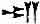        |  | 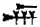 | 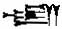 | 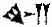 | 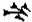 | 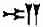 | 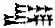 | 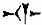 | 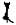  |
|                                          |          *Ur-*           |          *sa-*           |          *li-*           |          *im-*           |           *mu*           |           *ali*           |         *sharru-*          |          *ti-*           |                       *su*                       |
| "Jerusalem the city of his sovereignty." |                          |                          |                          |                          |                          |                           |                            |                          |                                                  |

Hezekiah's soldiers deserted, and he sent his envoy to Nineveh to pay
his tribute to Sennacherib, viz. 30 talents of gold, 800 talents of
silver, precious stones, eye-paint, couches and chairs of ivory, hides,
tusks, precious woods, and his daughters with their attendants and
musicians.**\]**

 

   And Hezekiah became sick unto death \[Fol.
34*a*, col. 2\], and it was grievous unto him, and he wept. And there
were certain men who blamed him, but why \[his sickness\] was grievous
unto him they never troubled to acquaint themselves. Now the sorrow of
Hezekiah \[came upon him\] p. 184 because
when he became sick unto death he had no son to reign after him. And
when he looked with the eyes of his soul and saw that he had no son to
reign after him, he was afflicted, and wept and said, "Woe is me! for I
must die childless, and that blessing which hath been given \[unto us\]
for six and forty generations hath been cut off by me this day. I have
become the destroyer of the kingdom of David, and the succession of the
kings of Judah hath been cut off this day." This was \[the cause of\]
the sorrow of Hezekiah. And after he recovered from his sickness he
waited fourteen years, and \[then\] Manasseh was born to him. And
Hezekiah died in great content, and left a son to sit upon the throne of
David \[Fol. 34*b*, col. 1\] his father.

 

\[Manasseh.\]

   Manasseh was twelve years old when \[he began\] to reign, and he
reigned fifty-five years in Jerusalem; and the name of his mother was
<u>H</u>abh<u>s</u>îbhâh (Hephziba). He was a man who was more evil and
iniquitous than all those who had lived before him; he builded altars to
devils, and sacrificed to idols, and he filled Jerusalem with iniquity
and provoked God to wrath. And because Isaiah the prophet rebuked him,
he threatened him and sent men who were sons of iniquity, and they sawed
Isaiah the prophet in p. 185 twain with a saw
between \[two pieces of\] wood, from his head downwards to his feet. And
Isaiah was one hundred and twenty years old when they sawed him in
twain, and he had been the prophet of God for ninety years. And Manasseh
repented after he had slain Isaiah, and he put sackcloth on his body,
and decreed fasting for himself, and he ate bread with tears all the
days of his life because he had committed iniquity and had \[Fol. 34*b*, col. 2\] slain the prophet. And
Manasseh died, and Ammon reigned after him.

   Ammon was twenty-two years old when \[he began\] to reign, and he
reigned two years in Jerusalem; and the name of his mother was
Mashl<u>e</u>math. And Ammon did evil before the Lord, and he made his
sons to pass through fire; he died, and Josiah his son reigned after
him. Josiah was eight years old when he began to reign, and he reigned
thirty-one years in Jerusalem; and the name of his mother was Yadhîdhâ
(Jedida), the daughter of Azariah (Adaja ?), from Bez<u>k</u>ath. And he
did what was good before the Lord, and he walked in all the way wherein
his father David had walked; and he turned aside neither to the right
hand nor to the left. And Pharaoh, the "Lame" (*i.e.* Necho II) killed
him, and Jehoahaz his son reigned after him.

p. 186

 

   **\[**NOTE.--Pharaoh Necho, king of Egypt 609-593 B.C., was the second king of the XXVlth Dynasty.
His names as "King of the South and North" and "Son of Ra" are

|                              |      |                             |
|------------------------------|------|-----------------------------|
| 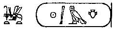  |      |  |
| U<u>h</u>em-a{dot-over}b-R¯a |      | N-Ka-u.**\]**               |

 

   Jehoahaz was twenty-three years old when \[he began\] to reign, and
he reigned three months in Jerusalem; and the name of his mother was
<u>H</u>am<u>t</u>âl, the daughter of \[Fol.
35*a*, col. 1\] Jeremiah from Lebhnâ. And he did what was evil before
the Lord, even as Manasseh had done. And Pharaoh, the Lame, king of
Egypt, took him prisoner in Diblath, in the land of <u>H</u>amath,
whilst he was king in Jerusalem, and he laid tribute on the land, one
hundred talents of silver and ten talents of gold. And Pharaoh, the
Lame, made Eliakim, the son of Jonah, king instead of Josiah his father,
and he made his name to be Jehoiakim. And he carried away Jehoahaz, and
he went to Egypt and died there. And Jehoiakim gave silver and gold to
Pharaoh; he laid \[the payment\] of silver and gold on the land
according to the word (*i.e.* command) of Pharoh's mouth. Every man,
according to what it was right for him \[to pay\], brought silver and
gold from the people of the land, according to the command of the mouth
of Pharaoh, the Lame.

p. 187

   Jehoiakim was twenty-five years old when \[he began\] to reign, and
he reigned eleven \[Fol. 35*a*, col. 2\]
years in Jerusalem; and the name of his mother was Zebhîdhâ, the
daughter of Pedâyâ, from Ramah. And he did that which was evil before
the Lord, even as his fathers had done. In his days Nebuchadnezzar, king
of Babel, went up against Jerusalem, and Jehoiakim became his vassal for
three years. Then he turned and rebelled against him, and the Lord
stirred up bands of robbers against him because of his sins. And
Jehoiakim slept with his fathers, and Jehoiachin his son reigned after
him. And the king of Egypt did not come forth again out of his country;
for the king of Babel captured all the land that belonged to the king of
Egypt, from the river of Egypt to the river Euphrates.

   Jehoiachin was eighteen years old when \[he began\] to reign, and he
reigned three months in Jerusalem; and the name of his mother was
Ne<u>h</u>eshtâ, the daughter of Elyâthân (Elnathan ?), from Jerusalem.
And he did that which was evil before the \[Fol. 35*b*, col. 1\] Lord, even as his father had
done. At that time Nebuchadnezzar, king of Babel, went up against
Jerusalem, and the king of Babel took him with him in the eighth year of
his kingdom. And he brought out from there all the treasure of the house
of the Lord, and the treasure of the king' s house, and he p. 188 carried off into captivity to Babel all
\[the people of\] Jerusalem, and Jehoiachin, and his mother, and his
wives, and his nobles; and the king brought captive to Babel all the men
who had made war. And the king of Babel made Methanyâ, the uncle \[of
Jehoiachin\] king in his stead, and he called his name "Zedekiah."

 

\[The Capture of Jerusalem.\]

   Zedekiah was twenty years old when \[he began\] to reign, and he
reigned eleven years in Jerusalem; and the name of his mother was
<u>H</u>amtâl, the daughter of Jeremiah, from Libnah. And he did that
which was evil before the Lord, even as did Jehoiakim, and the wrath of
the \[Fol. 35*b*, col. 2\] Lord was (*i.e.*
fell upon) Jerusalem. And Zedekiah rebelled against the king of Babel,
and in the ninth year of his kingdom Nebuchadnezzar, king of Babel, came
against Jerusalem, and the city was fettered with affliction (*i.e.*
besieged) until the eleventh year of king Zedekiah. And the city was
rent open (*i.e.* its wall was breached), and all the mighty men of war
fled from the city by night by way of the plain. And the soldiers of the
Chaldeans pursued the king, and they overtook him on the plain of
Jericho, and all his soldiers were driven away from him; and the
Chaldeans captured Zedekiah and took him up to the king of Babel at
p. 189 Debhlath (Riblah), and he passed
judgment upon him. And the king of Babel slew the sons of Zedekiah the
king before his eyes, and he blinded the eyes of Zedekiah, and bound him
in chains, and carried him to Babel \[Fol.
36*a*, col. 1\]. And Simeon the high priest, because he had freedom of
speech with the commander of the \[Chaldean\] army, made entreaty to
him, and the commander of the army gave him all the books of the
Scriptures and did not burn them; and Simeon the high priest gathered
them together and cast them into a pit (or dry well). And Jerusalem was
laid waste and made desolate, and no man remained therein except
Jeremiah, the Prophet, who sat and raised lamentations over it for
twenty years. And Jeremiah, the Prophet, died in Samaria, and the priest
Ûr buried him in Jerusalem, according to the oath which the prophet made
him to swear.

   Now up to the time of the destruction of Jerusalem the Hebrew, Greek,
and Syrian writers were in possession of the truth, and they were able
to produce the registers of the genealogies of the tribes and the
people. But from the destruction of Jerusalem and onwards there has been
no truth in their writings, except as regards the heads of the tribes
(*i.e.* the Patriarchs) \[Fol. 36*a*, col.
2\], and they are unable to prove whence the succession of the priests
took its origin.

p. 190

 

\[Jehoiachin.\]

   And Jehoiachin was bound in prison for thirty-seven years, and after
he came forth from prison he took to wife Gûlîth, the daughter of
Eliakim, and he begot by her in Babel Shalathiel (Salathiel); and
Jehoiachin died in Babel. And Salathiel took to wife He<u>t</u>bath, the
daughter of Hal<u>k</u>ânâ, and he begot by her Zûrbâbhel (Zerubbabel),
who took to wife Malkath, the daughter of Ezra the scribe; but no son
was born to him by her in Babel. In the days of Zerubbabel, the prince
of Judah, Cyrus the Persian reigned in Babel. \[A reproduction of a
sculptured relief of Cyrus is given on [Plate
I](bct_pl01). The official account of his conquest of Babylon is found
on a baked clay cylinder now in the British Museum. See [Plate II](bct_pl02).**\]**

 

\[Cyrus.\]

   And Cyrus took to wife the daughter of Salathiel, the sister of
Zerubbabel, and he took her to wife according to the law of the
Persians, and made her \[his\] queen. And she entreated Cyrus to bring
about the return of the children of Israel \[to Jerusalem\]. And
inasmuch as Zerubbabel was her brother, she was very insistent about
\[Fol. 36*b*, col. 1\] the return \[to
Jerusalem\] of those who had been led away into captivity. Now Cyrus
loved his wife as he loved himself, and he did p.
191 for her what she wished. And he sent forth heralds into all
the land of Babel, ordering all the children of Israel to gather
themselves together. And when they were gathered together Cyrus said
unto Zerubbabel, his wife's brother, "Rise up, and take with thee all
the children of thy people, and go up to Jerusalem in peace; and
\[re\]build the city of thy fathers, and dwell and reign therein. And
because Cyrus brought about the return of the children of Israel \[to
Jerusalem\], God said, "I have taken my servant Cyrus by his right hand"
([Isa. xliv. 28](../../bib/kjv/isa.htm#44:28); xlv. 1). And the name of
Cyrus was called "My shepherd, the anointed of the Lord," because his
seed was received into the seed of David through Meshayyanath, the
sister of Zerubbabel, whom he had taken to wife. And the children of
Israel went up from Babel, and Zerubbabel became king over them; and
Joshua, the son of Yôzâdâk, the son of Aaron, was high priest, even as
the angel showed Zechariah the prophet, and said unto him, "These are
the sons of the oil of consecration."

 

   And the people of the captivity went up in the second year of Cyrus,
and the FIFTH THOUSAND YEARS CAME TO AN END.

------------------------------------------------------------------------

[Next](bct09)
