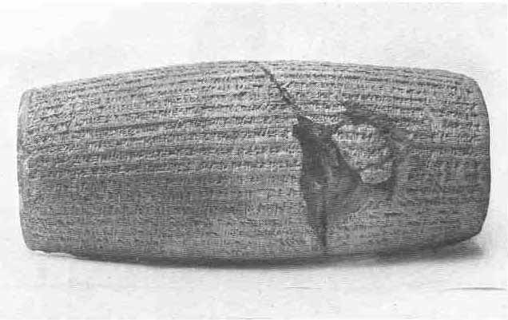
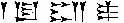

[Sacred-Texts](../../index) [Christianity](../index) [Index](index) [List
of Plates](bct01.htm#page_vii) [Previous Plate](bct_pl01) [Next
Plate](bct_pl03)

------------------------------------------------------------------------

PLATE II

{facing [page 64](bct04.htm#page_64)}

Baked clay cylinder inscribed with an account of the
capture of Babylon by **Cyrus** ( KU-RA-ash) King of Persia, 538 B.C. He restored to their original shrines
throughout the country the images of the gods which a former king
Nabonidus had collected in Babylon and gave the Jews permission to
rebuild their temple. (British Museum No. 90920.). (*See* [page
190](bct08.htm#pl02).)

------------------------------------------------------------------------

[Next Plate](bct_pl03)
