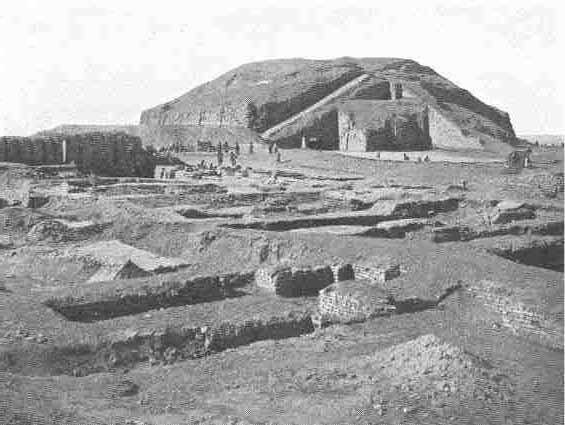

[Sacred-Texts](../../index) [Christianity](../index) [Index](index) [List
of Plates](bct01.htm#page_vii) [Previous Plate](bct_pl02) [Next
Plate](bct_pl04)

------------------------------------------------------------------------

PLATE III

{facing [page 80](bct04.htm#page_80)}

General view of the ziggurat and the excavations at
"Ur of the Chaldees." (*See* [page 275](bct12.htm#pl03).)

------------------------------------------------------------------------

[Next Plate](bct_pl04)
