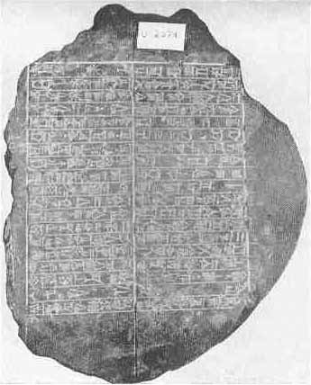
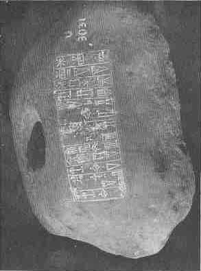

[Sacred-Texts](../../index) [Christianity](../index) [Index](index) [List
of Plates](bct01.htm#page_vii) [Previous Plate](bct_pl07) [Next
Plate](bct_pl09)

------------------------------------------------------------------------

PLATE VIII

{facing [page 160](bct07.htm#page_160)}

|                                                                                                                 |     |                                                                                                                                                            |
|:---------------------------------------------------------------------------------------------------------------:|-----|:----------------------------------------------------------------------------------------------------------------------------------------------------------:|
|                                                                                                  |     |                                                                                                                                             |
| Door socket of Sin-balatsu-ixbi about 650 B.C. (*See* [page 277](bct12.htm#pl08-1).) |     | Door socket of Bur-Sin (about 2200 B.C.), recording the dedication of a temple to Nannar. (*See* [page 279](bct12.htm#pl08-2).) |

------------------------------------------------------------------------

[Next Plate](bct_pl09)
