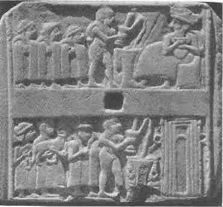
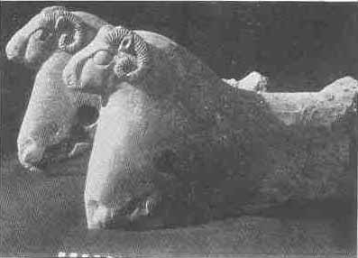

[Sacred-Texts](../../index) [Christianity](../index) [Index](index) [List
of Plates](bct01.htm#page_vii) [Previous Plate](bct_pl12) [Next
Plate](bct_pl14)

------------------------------------------------------------------------

PLATE XIII

{facing [page 240](bct09.htm#page_240)}

|                              |                 |
|------------------------------|-----------------|
| 1 |  |
| 2 |                 |

1. Limestone plaque with reliefs representing the
King and his sons pouring out a libation to Nannar, the Moon-god. (*See*
[page 278](bct12.htm#pl13-1).)  
2. A priest pouring out a libation before a shrine. Behind him is the
high priestess and men bearing offerings. (*See* [page
278](bct12.htm#pl13-1).)

Alabaster rams from a throne. (*See* [page
278](bct12.htm#pl13-2).)

------------------------------------------------------------------------

[Next Plate](bct_pl14)
