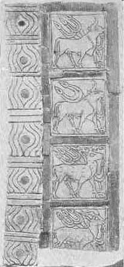
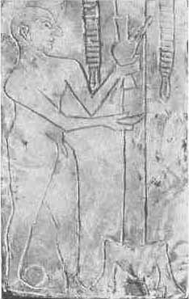
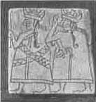

[Sacred-Texts](../../index) [Christianity](../index) [Index](index) [List
of Plates](bct01.htm#page_vii) [Previous Plate](bct_pl14) 

------------------------------------------------------------------------

PLATE XV

{facing [page 272](bct11.htm#page_272)}

|                              |                              |                 |                              |
|:----------------------------:|:----------------------------:|:---------------:|:----------------------------:|
| 1 | 2 |                 |                              |
|               |               |                 |                              |
|                              |                              |  | 3 |

Incised shell plaques from "Ur of the
Chaldees."

<table data-align="center">
<colgroup>
<col style="width: 100%" />
</colgroup>
<tbody>
<tr class="odd">
<td>1. Figures of bulls and stags. 
2. Priest pouring out a libation 
3. Shell plaque of the Ist dynasty of Ur.</td>
</tr>
<tr class="even">
<td style="text-align: center;">(<em>See</em> <a href="bct12.htm#pl15">page 288</a>.)</td>
</tr>
</tbody>
</table>

------------------------------------------------------------------------

[Index](index) [List of Plates](bct01.htm#page_vii)
