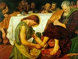

  
[Intangible Textual Heritage](../../index)  [Christianity](../index) 
[Apocrypha](../apo/index)  [Index](index)  [Next](did01) 

------------------------------------------------------------------------

  
*The Didache*, by Charles H. Hoole, \[1894\], at Intangible Textual
Heritage

------------------------------------------------------------------------

# THE DIDACHE

##### OR

### TEACHING OF THE TWELVE APOSTLES

##### RESTORED TO ITS ORIGINAL STATE FROM VARIOUS SOURCES, WITH AN INTRODUCTION TRANSLATION, AND NOTES

###### BY

## CHARLES H. HOOLE, M.A.

###### STUDENT OF CHRIST CHURCH, OXFORD

#### LONDON

#### DAVID NUTT, 2 70-71 STRAND

#### \[1894\]

Scanned, proofed and formatted at Intangible Textual Heritage, January
2010, by John Bruno Hare. This text is in the public domain in the US
because it was published prior to 1923.

------------------------------------------------------------------------

[Next: Introduction](did01)

