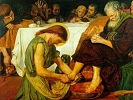

  
[Intangible Textual Heritage](../../index)  [Christianity](../index) 
[Apocrypha](../apo/index)  [Index](index)  [Previous](did01) 
[Next](did03) 

------------------------------------------------------------------------

  
*The Didache*, by Charles H. Hoole, \[1894\], at Intangible Textual
Heritage

------------------------------------------------------------------------

p. 44

THE DIDACHE

OR

TEACHING OF THE APOSTLES

AS DISCOVERED IN MANUSCRIPT BY BRYENNIUS

p. 45

The passages from Barnabas, Hermas, the Apostolic Constitutions, and the
Epitome serve as an introduction to the Didache as discovered by
Bryennius, and published at Constantinople from the Codex
Hierosolymitanus. No other manuscript or version of it has been found,
but there is no reason to doubt that it is a genuine manuscript of the
eleventh century. It contains, besides the first and second Epistles of
Clement, a complete text of the longer recension of Ignatius, "The
Epistle of Barnabas," "The Synopsis of St. Chrysostom," and "The
Teaching of the Apostles," which comes between the Clement and Ignatius.

After a good deal of consideration, I have come to the conclusion that
the Didache is not an original work, but a compilation or series of
excerpts from the treatises already quoted. Any one who will compare the
Didache of Bryennius with the passages taken from Barnabas, Hermas, the
Judicium Petri, and the Apostolic Constitutions, will find it difficult
to avoid the conclusion that the author of the Didache had these works
in his hands, and compiled from them what he supposed to be the
primitive doctrine of the Apostles; and the position of his work is not
that of an original to an enlarged and completed copy, but that of a
condensation and compilation from a number of other works. There seems
some reason to suppose that the work thus composed underwent a further
abbreviation, and that

p. 46

the Didache discovered by Bryennius, which was no doubt the same as that
mentioned by Nicephorus in the ninth century, was a shortened form of
the Didache mentioned by Athanasius, as it does not correspond in length
to the works with which he compared it, such as "The Shepherd of Hermas"
or "The Book of Wisdom," and some mention of the names of the Apostles
themselves would have been expected in it. In my own restoration I have
endeavoured to replace what I supposed might have been found in the
original Didache by giving the names of the Apostles, and bringing the
work a little more into the form used at the assumed period, by
supplying a commencement and conclusion in the style of the second
century. For this purpose the Epitome or Judicium Petri has chiefly been
used, but a complete collation has also been made of the parallel
passages in Barnabas and the Apostolic Constitutions.

Long passage in Greek omitted (pp. 47-72).…

------------------------------------------------------------------------

------------------------------------------------------------------------

[Next: The Didache: Translation](did03)

