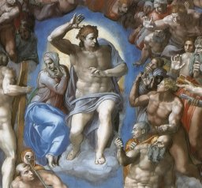

  
[Intangible Textual Heritage](../../index)  [Christianity](../index) 

------------------------------------------------------------------------

<table width="75%">
<colgroup>
<col style="width: 50%" />
<col style="width: 50%" />
</colgroup>
<tbody>
<tr class="odd">
<td width="50%" data-valign="TOP"></td>
<td width="50%" data-valign="CENTER"><h1 id="evidence-from-scripture-and-history-of-the-second-coming-of-christ" data-align="CENTER">Evidence from Scripture and History of the Second Coming of Christ</h1>
<h2 id="by-william-miller" data-align="CENTER">by William Miller</h2>
<h4 id="section" data-align="CENTER">[1842]</h4></td>
</tr>
</tbody>
</table>

------------------------------------------------------------------------

[Contents](#contents)    [Start Reading](esc00)

------------------------------------------------------------------------

This is a collection of lectures by William Miller (1782-1849), a 19th
century preacher who managed to convince himself and thousands of others
that Jesus would return in 1844. Born a Baptist, he became a Deist and
Freemason. After he fought in the war of 1812, he had a spiritual
epiphany, and was called back to Baptism. After much study, Miller
became convinced that Biblical chronology pointed to the immiment end of
the world, and in 1832, was confident enough to publicize his beliefs.

As the deadline approached, his followers grew into a huge movement. The
calculations were refined by his disciples, and October 22, 1844 was
determined to be the day. As that date approached, Millerites sold their
homes and business, and flocked to the hills to await the last
judgement. Of course, nothing out of the ordinary occurred, and most of
Miller's followers melted away as quickly as they had joined. This
became known as 'the Great Disappointment.' However, the concept of the
imminent return of Jesus has been a major component of evangelical
Christian thought for the past century. Few have been so bold as to set
an actual date certain for the end of the world. Most millennialists
today simply point to various signs and portents to suggest that the end
is near.

The source for this electronic text was downloaded from the [Early
SDA](https://www.earlysda.com/) website.

------------------------------------------------------------------------

 [Title Page](esc00)  
[Introduction](esc01)  
[Index](esc02)  
[Lecture I. The Second Appearing of Christ](esc03)  
[Lecture II. The First Resurrection](esc04)  
[Lecture III. The Two Thousand Three Hundred Days](esc05)  
[Lecture IV. Seventy weeks are determined upon thy people...](esc06)  
[Lecture V. Pagan Rome Numbered](esc07)  
[Lecture VI. Daniel's Vision of the Latter Days](esc08)  
[Lecture VII. Daniel's 1260, 1290, and 1335 Days Explained](esc09)  
[Lecture VIII. The Three Woe Trumpets](esc10)  
[Lecture IX. The Epistles to the Seven Churches of Asia, Considered as
Applying to Seven Periods of the Gospel Church, Part I.](esc11)  
[Lecture X. The Epistles to the Seven Churches of Asia, Considered as
Applying to Seven Periods of the Gospel Church, Part II](esc12)  
[Lecture XI. The New Song](esc13)  
[Lecture XII. The Seven Seals, as Representing Events to the End of
Time](esc14)  
[Lecture XIII. The Two Witnesses, as Having Been Slain in the French
Revolution](esc15)  
[Lecture XIV. The Woman in the Wilderness](esc16)  
[Lecture XV. The Seven Last Plagues, or Seven Vials](esc17)  
[Lecture XVI. The Parable of the Ten Virgins](esc18)  
[Lecture XVII. On the Punishment of the People of God Seven Times for
their Sins](esc19)  
[Lecture XVIII. Who is this that cometh up from the wilderness, leaning
upon her beloved?](esc20)  
[Lecture XIX. Signs of the Present Times](esc21)  
[Supplement](esc22)  
