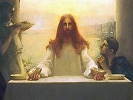

  
[Intangible Textual Heritage](../../index)  [Christianity](../index) 
[Index](index)  [Previous](jae02)  [Next](jae04) 

------------------------------------------------------------------------

[Buy this Book at
Amazon.com](https://www.amazon.com/exec/obidos/ASIN/B001VEI3LW/internetsacredte)

------------------------------------------------------------------------

  
*Jesus An Essene*, by E. Planta Nesbit, \[1895\], at Intangible Textual
Heritage

------------------------------------------------------------------------

p. 1

# CHRIST, CHRISTIANS AND CHRISTIANITY.

#### BOOK I.

### JESUS AN ESSENE.

The Jews, long before the time of Jesus,
were divided into three sects, the Sadducees, the Pharisees, and the
Essenes. It is almost impossible in reading of the last not to be
forcibly struck with the remarkable resemblance between their doctrines,
precepts and practices, and those of Jesus and the early Christians.
Jesus is recorded to have frequently rebuked and denounced both the
Sadducees and Pharisees, but it is not related that he once mentioned
the Essenes by name. Yet we are informed by both Philo and Josephus that
at the period in which John the Baptist and Jesus were born the Essenes
were scattered over Palestine, and that they numbered about four
thousand souls. It should be mentioned that peculiar importance is to be
attached to the testimony of both Philo and Josephus respecting the mode
of life pursued by the Essenes, as these authors were fully acquainted
with it. They speak also with great respect and reverence of this sect,
as surpassing all others in virtue. Josephus informs us that they led
the same kind of life as the Pythagoreans in Greece, and that by their
excellent virtue they were thought worthy even of divine revelations,
while Philo says they were honoured with the appellation of Essenes
because of their exceeding holiness.

As regards the word "Essene," we are informed that there is hardly an
expression the etymology of which has

p. 2

called forth such a diversity of opinion as this name. The Greek and the
Hebrew, the Syriac and the Chaldee names of persons and names of places,
have successively been appealed to, to yield the etymology of this
appellation, and to tell the reason why it has been given to this sect,
and there are no less, if not more, than *nineteen* different
explanations of it. The same authority just cited says that the term
"Essene" was "coined" by Philo and Josephus for the benefit of the
Greeks. [1](#fn_0)

The words Therapeuts and Essenes are convertible terms, and refer
primarily to the art of healing which these devotees professed, as it
was believed in those days that sanctity was closely allied to the
exercise of this power, and that no cure of any sort could be imputed
simply to natural causes. Additional value belongs to the records of
these two historians, because they describe the life of the Essenes *as
it was in the time of Jesus*. Philo was about sixty-two years old when
the Great Teacher commenced his short but important career, and he
survived the latter between ten and fifteen years, the exact period of
his death being unknown. He lived chiefly at Alexandria, though he
mentions having once visited Jerusalem. He does not appear to have met
Jesus, for, being an ardent admirer of virtue himself, he would probably
in that case have left us some record of his excellencies and
sufferings. If he did hear of him, he may possibly have regarded him
simply as a peculiarly enthusiastic member of that sect which he has
described so minutely. Josephus was contemporary with Philo, but lived
to a somewhat later period. There is a reference to the Jesus of
Scripture in the pages of this historian, but it is considered by many

p. 3

to have been interpolated and fathered upon this Jewish writer by some
early Christian copyist. The passage stands thus:—"Now, there was about
this time Jesus, a wise man, if it be lawful to call him a man, for he
was a doer of wonderful works,—a teacher of such men as receive the
truth with pleasure. He drew over to him both many of the Jews, and many
of the Gentiles. He was Christ, and when Pilate, at the suggestion of
the principal men amongst us, had condemned him to the cross, those that
loved him at the first did not forsake him, but he appeared 'to them
again the third day, as the divine prophets had foretold these and ten
thousand other wonderful things concerning him; and the tribe of
Christians, so named after him, are not extinct at this day." [1](#fn_1)

Renan says of the foregoing allusion to Jesus, "I believe the passage
respecting Jesus to be authentic. It is perfectly in the style of
Josephus, and if this historian has made mention of Jesus, it is thus
that he must have spoken of him. We feel only that a Christian hand has
retouched the passage, has added a few words, without which it would
almost have been blasphemous, [2](#fn_2) has
perhaps retrenched or modified some expressions. It must be recollected
that the literary fortune of Josephus was made by the Christians, who
adopted his writings as essential documents to their sacred history.
They made, probably in the second century, an edition according to
Christian ideas." [3](#fn_3) Another French
writer of distinction says, "No one in our day maintains any longer the
entire authenticity of the chapter which Josephus devotes to

p. 4

\[paragraph continues\] Christ in his
Antiquities." [1](#fn_4) Opinions will probably
ever differ respecting the celebrated passage last cited from Josephus.
Thus the Rev. Dr. Giles says, "Those who are best acquainted with the
character of Josephus and the style of his writings, have no hesitation
in condemning this passage as a *forgery;* interpolated in the text,
during the third century, by some pious Christian, who was scandalized
that so famous a writer as Josephus should have taken no notice of the
Gospels or of Christ, their subject." Concerning the same passage, a
still more eminent authority says, "The passage concerning Jesus Christ
was inserted into the text of Josephus between the time of Origen and
that of Eusebius, and may furnish us with an example of a vulgar
forgery." [2](#fn_5) Dr. N. Lardner was also
evidently of opinion that the passage referred to above, in Josephus,
was a forgery. He says, "Who was the first author of this interpolation
cannot be said. Tanaquil Faber suspected Eusebius. I do not charge it
upon him; but I think it was first made about his time, for, if I am not
mistaken, we have seen sufficient reason to believe that this paragraph
was not quoted by Origen, nor by any ancient Christian writer before
Eusebius, that we have any knowledge of." [3](#fn_6)

Admitting there is anything genuine in the allusion in Josephus to
Jesus, we can feel little surprise at the slightness of the notice he
takes of him, for it is the style of this historian not to dwell too
long upon the characters of those he describes. He makes hardly more
than a passing reference to John the Baptist, whom he

p. 5

terms "a good man." [1](#fn_7) But it is worthy
of observation that Josephus does not select either Jesus, in the
doubtful passage we have quoted, or the Baptist, as worthy of special
commendation; he speaks of other men in the same way. Thus, he tells us
of one named Manahem, belonging to the sect of the Essenes, who lived in
the time of Herod the Great, before the temple was rebuilt, that "had
this testimony, that he not only conducted his life after an excellent
manner, but had the foreknowledge of future events given him by God
also," and he assures us that Herod had the Essenes in such high
estimation as to think "higher of them than their mortal state
required." [2](#fn_8) In another place he refers
to a distinguished member of the same sect called Simon, who, he informs
us, interpreted a vision for Archelaus. [3](#fn_9) Most of what will be related of the
Therapeuts or Essenes may be found either in Philo or Josephus; but as a
constant reference to their works would be inconvenient, we beg to refer
the reader, as the sources whence we have chiefly selected our
information respecting these interesting people, to the works mentioned
below. [4](#fn_10)

In almost all ages and countries there have been men anxious to withdraw
themselves from the violence and strife which often disturb the quietude
of our brief existence. In India the Gymnosophists were persons of this
description, in Greece the Pythagoreans, in Egypt the Therapeuts, and in
Syria the Essenes. As the Jews had long been settled in Alexandria, the
two last named

p. 6

sects are regarded by many persons as the same under different
designations. At all events, as they held similar doctrines, taught the
same precepts, and followed the same practices, we shall speak of them
without distinction. Mosheim tells us that he agrees "entirely with
those who regard the Therapeuts as being Jews," [1](#fn_11) although he does not consider it
absolutely certain that they were identical with the Essenes. M. de
Pressensé in his work also expresses it as his opinion that "the sect of
the Essenes forms the link between the Judaism of Palestine and that of
Alexandria." [2](#fn_12) Another writer informs
us that the Essenes of Egypt were divided into two sects: the practical
Essenes, whose mode of life was the same as those of Palestine; and the
contemplative Essenes, who were called Therapeuts. [3](#fn_13) Strauss informs us that the Essenes of
Palestine, notwithstanding their social life being in accordance with
the rules of their order, were especially adapted to spread their
religious principles beyond the exclusive circle of their society, in
consequence of occupying themselves with agriculture and peaceful
trades. He also accounts for the similarity which is observable between
the Pythagoreans and the Essenes by the fact that the members of the
latter sect among the Egyptian Jews, under the name of Therapeuts,
necessarily came in contact with the mental tendency which distinguished
the Grecian sect. By this means he considers it possible that the
peculiar doctrines of the Pythagoreans may have found their way into
Judea, unless, he says, "we prefer to suppose that already in the time
of the amalgamation, the education and

p. 7

cultivation which took place under the Seleucidæ, the Pythagorean system
found an echo in Palestine, this tendency being only strengthened and
further developed by subsequent contact with the Egyptian
Therapeuts." [1](#fn_14)

It is quite certain that before the time of Jesus the Therapeuts were
known in Egypt. Great numbers of them lived in the neighbourhood of the
Mareotic Lake. This inland water is now known as Mareotis or Marioût. It
is situated in the N.–W. of Lower Egypt, and is separated from the
Mediterranean on the west by the long and narrow belt of land on which
Alexandria is built. It is about twenty-eight miles long and twenty
broad, and in the early times of which we write was sufficiently deep
for navigation. The overflowings of the Nile kept it constantly full. It
was fitly chosen by the pious hermits we are describing as their home.
It was a place remote from turmoil, was surrounded by beautiful gardens
and vineyards, and was especially pleasant on account of the salubrity
and mildness of its climate. The breezes from the lake and sea
contributed to their enjoyment, and the occupations in which they were
engaged were such as to promote their health and conduce to their
longevity. The dwellings in which the recluses lived were not placed
near to each other, for it was regarded as inconsistent that men who had
retired from the world should dwell too closely together. On the other
hand, they were sufficiently adjacent for communications to pass easily
between the several habitations, so that help could be had in seasons of
difficulty or of danger. Most of the Therapeuts were men who had
abandoned their property, giving it away as an encumbrance to their
pursuit of peace and rest, and there

p. 8

were few among them who had not, in addition to the renunciation of
wealth, also abandoned brethren, wives, and often numerous families. In
disposing of their means, when considered superfluous to themselves, it
might have been thought they would, at all events, have bestowed what
the greater part of the world considers desirable upon their immediate
relations and friends. But these men, who renounced wealth themselves,
would not give it to those whom they had most occasion to love, but in
the instances where they did not destroy it, as by cutting down their
trees and allowing cattle to devour their estates, gave it to the
utterly poor. Josephus says distinctly of the Essenes that they were
permitted of their own accord to afford succour to such as deserved it,
or to those in distress; but they could not bestow anything on their
kindred without the consent of the curators, that is, of the persons who
had charge of the common property.

The foregoing remarks find illustration in more than one part of the New
Testament. Thus Jesus called upon his disciples to leave all and follow
him; and so Peter is recorded to have once said, "Lo, we have left all,
and followed thee." [1](#fn_15) And Jesus him
self frequently encouraged this utter renunciation of all worldly ties
by the promise of great future happiness. "Verily," he said, "there is
no man that hath left house, or brethren, or sisters, or father, or
mother, or wife, or children, or lands, for my sake, and the gospel's,
but he shall receive an hundredfold now in this time, houses, and
brethren, and sisters, and mothers, and children, and lands, with
persecutions; and in the world to come eternal life." [2](#fn_16) Levi, the publican, afterwards Matthew, is
recorded to have "left

p. 9

all" at the bidding of Jesus. At his word, he rose up and followed
him. [1](#fn_17)

As the language of Jesus, which promised an increase of goods and
relatives on earth to those who would forsake those they already had,
cannot be understood literally, we must regard it as having reference to
that universal spirit of brotherhood which existed among the Essenes,
and which required them, under all circumstances, to help each other.
Philo says, speaking distinctly of the Essenes, "If any of them is sick,
he is cured from the common resources, being attended to by the general
care and anxiety of the whole body. Accordingly, the old men, even if
they happen to be childless, as if they were not only the fathers of
many children, but were even also particularly happy in an affectionate
offspring, are accustomed to end their lives in a most happy and
prosperous and carefully attended old age, being looked upon by such a
number of people as worthy of so much honour and provident regard, that
they think themselves bound to care for them even more from inclination
than from any tie of natural affection."

If we did not know otherwise, we might think the following a sequel to
the above description given us by Philo of the communistic society in
which the Essenes lived. It is certainly highly suggestive that they and
the early Christians were the same. "And the multitude of them that
believed were of one heart and of one soul: neither said any of them
that ought of the things which he possessed was his own; but they had
all things in common. Neither was there any among them that lacked: for
as many as were possessed of lands or

p. 10

houses sold them, and brought the prices of the things that were sold,
and laid them down at the apostles’ feet: and distribution was made unto
every man according as he had need. And Joses … having land, sold it,
and brought the money, and laid it at the apostles’ feet." [1](#fn_18)

The Essenes, as we have seen, were scattered all over Judea, and a
warm-hearted missionary of this sect might well gain disciples to the
cause. A word would often be sufficient to a prepared mind, and confirm
in it the resolution which was perhaps already half-formed. Thus, after
Jesus had for some time preached repentance, he had only to say to Peter
and Andrew, when he saw them fishing, "Follow me," to induce them
instantly to act on his invitation. Nay, the same day, when he called
James, the son of Zebedee, and John his brother, "they immediately left
the ship and their father, and followed him." [2](#fn_19)

A partial renunciation of property, conjoined with the most scrupulous
conduct, was not a sufficient claim for the privilege of discipleship
with Jesus; all must be abandoned, or the sacrifice was insufficient.
Thus, when a young man of irreproachable behaviour asked Jesus what
"good thing" he should do to obtain eternal life, he was told to sell
all that he had and give it to the poor. When this was done, he was
told, treasure in heaven would be his, and he could then follow
Jesus. [3](#fn_20) The conditions were too
severe, he went away sorrowful; for we are told he had great
possessions. It was on this occasion that Jesus said to his disciples,
"It is easier for a camel to go through the eye of a needle,

p. 11

than for a rich man to enter into the kingdom of God." [1](#fn_21) In the same spirit Jesus likened the
kingdom of heaven "unto treasure hid in a field; the which, when a man
hath found, he hideth, and for joy thereof goeth and selleth all that he
hath, and buyeth that field." [2](#fn_22) Again,
he tells us, "The kingdom of heaven is like unto a merchantman, seeking
goodly pearls: who, when he had found one pearl of great price, went and
sold all that he had, and bought it." [3](#fn_23)

So thoroughly was the idea of wealth associated with wickedness and
future misery, and that of poverty with virtue and eternal happiness,
that we find the most important utterances of Jesus pregnant with this
teaching. The rich man, who was clothed in purple and fine linen, and
who fared sumptuously every day, was his conception of one whose future
lot it was to be in hell, lifting up his eyes in torment, because in
this world he had received his "good things"; while virtue, and its
ultimate reward, were typified in the beggar, lying at the rich man's
gate, full of sores, and so utterly abandoned by man, that the only
relief he obtained was from the dogs which licked his ulcerous limbs.
The poor abandoned wretch was rather to be envied than the rich man.
Although nothing evil is related of the latter, it was his misfortune to
be wealthy here. Though nothing excellent is related of Lazarus, it was
his inexpressibly good fortune to be poor on earth; for having there
received "evil things," it was his destiny hereafter to be for ever
"comforted." [4](#fn_24) Well might Jesus say,
"Blessed be ye poor," if for this, and this

p. 12

alone, theirs was the "kingdom of God." [1](#fn_25) And with equal force might he denounce the
wealthy, and say, "Woe unto you that are rich! for you have received
your consolation," [2](#fn_26) if this present
comfort and ease were to comprehend all they might ever hope to receive
from the hands of Him who is equally the God and Father of the rich and
the poor, and who, not they, determines, beyond any one's control, the
destiny of every child of man, and the bounds of his habitation.

A certain class of clergymen sometimes affect a style of exposition
which not unfrequently appears somewhat like a parody on the recorded
words of Jesus, but which fail to command that respect and consideration
from those to whom it is addressed, which early training has taught us
to pay even to those sayings of his which appear upon reflection both
harsh and unreasonable. The consequence is, that ministers throw
themselves open to a *tu quoque* retort. Thus, Dr. Trench expresses the
opinion, in his "Notes on the Parables," that "the course of an unbroken
prosperity is ever a sign and augury of ultimate reprobation." A
reviewer remarks on the atrocious sentiment as follows:—"Doubtless the
heart knows its own bitterness, and there may be many breaks in a life
of outward uninterrupted success; but Dr. Trench's axiom might afford a
grim satisfaction to those who, in the midst of want and wretchedness,
regard the rich and the powerful as unquestionably in the enjoyment of
'unbroken prosperity.' There are probably those who may think that this
dangerous condition is fulfilled in Dr. Trench himself." [3](#fn_27)

A writer, commenting on the question of the disciples,

p. 13

when they heard Jesus say it was easier for a camel to go through the
eye of a needle than for a rich man to enter into the kingdom of God,
and which so amazed them, that they exclaimed, "Who, then, can be
saved?" says, "Truly we can re-echo the question, since every day shows
this to be totally contrary to experience; for the world contains men of
the greatest wealth, and of the strictest morality and piety. But
Jesus," he goes on to say, "was no political economist; and all his
views were absorbed in the ideas—a community of property and the
approach of the end of the world—which the Essenians so strictly carried
out." [1](#fn_28)

The rewards promised by Jesus to the good, and the prospect of suffering
which he held out to the evil, correspond very closely with the ideas
which the best of the Jewish sects are stated to have believed. They
taught that good souls have their habitation beyond the ocean in a
region that is neither oppressed with storms of rain or snow, nor with
intense heat; but that this place is such as is refreshed by the gentle
breathing of a west wind, that is perpetually blowing from the ocean;
while they allotted to bad souls a dark and tempestuous den, full of
never-ceasing punishments. So Jesus taught that the wicked shall "go
away into everlasting punishment: but the righteous into life
eternal." [2](#fn_29) The ultimately rejected
are to be cast into "outer darkness," where "weeping and gnashing of
teeth" [3](#fn_30) will be the only sounds ever
heard amidst the awful profundity of the gloom. The finally-accepted,
the early Christians joyfully believed, will dwell in a city that shall
have no need of the sun, neither of the moon, to shine in it, [4](#fn_31)

p. 14

because the Lord God giveth them light, [1](#fn_32) while softest music shall swell and fall
from celestial harps, [2](#fn_33) a new song
shall ever be sung, [3](#fn_34) and odours of
heavenly fragrance shall be unceasingly poured from golden vials. [4](#fn_35)

"These men," says Josephus, speaking of the Essenes, "are despisers of
riches, and so very communicative as raises our admiration." We might
almost think he is praising those whom Jesus taught in these words,
"Give to him that asketh thee, and from him that would borrow of thee
turn not thou away." [5](#fn_36) We will still
quote the historian last cited, as his description so exactly tallies
with the precepts of Jesus and the customs of his followers. Thus he
continues to write:—"Nor is there any one to be found among them who
hath more than another; for it is a law among them, that those who come
to them must let what they have be common to the whole order, insomuch,
that among them all there is no appearance of poverty or excess of
riches, but every one's possessions are intermingled with every other's
possessions; and so there is, as it were, one patrimony among all the
brethren." So it was with Jesus and the disciples, they all had one
purse. When food was required, the disciples went singly or together to
purchase it. [6](#fn_37)

Among this admirable sect, stewards were appointed to take care of their
secular affairs, that every member might not be occupied in worldly
matters. So we learn that even among the disciples in the time of Jesus
one was appointed to carry the bag containing the common property, [7](#fn_38) and that afterwards, in the first
organized body of believers, "seven men of honest report" were

p. 15

selected by the rest to see justice done to the wants of all, both Jews
and Gentiles, in "the daily ministration." [1](#fn_39)

Those who desired to be enrolled among the Essenes, were made partakers
of "the waters of purification," [2](#fn_40) and
we find that even Jesus did not disdain to be baptized by John. [3](#fn_41) We are informed that the baptism of John
was for "the remission of sins," [4](#fn_42) and
it is well known with what importance this ceremony, sanctioned by
Jesus, was afterwards invested, as a token of affiliation in the Church
which he was said to have established.

The similarity between the right of initiation practised by the Essenes,
and that adopted by Christians, is certainly too striking not to be
suggestive of the idea that they had a common origin. "No question,"
says Dean Milman, "has been more strenuously debated than the origin of
the rite of baptism. The practice of the external washing of the body,
as emblematic of the inward purification of the soul, is almost
universal. The sacred Ganges cleanses all moral pollution from the
Indian; among the Greeks and Romans even the murderer might, it was
supposed, wash the blood 'clean from his hands'; and in many of their
religious rites, lustrations or ablutions, either in the running stream
or in the sea, purified the candidate for divine favour, and made him
fit to approach the shrines of the gods. The perpetual similitude and
connection between the uncleanliness of the body and of the soul, which
ran through the Mosaic Law, and have been interwoven with the common
language and sentiments, the formal enactment of washing in many cases,
which required the cleansing of some

p. 16

unhealthy taint, or more than usual purity, must have familiarized the
mind with the mysterious effect attributed to such a rite; and of all
the Jewish sects, that of the Essenes, to which no doubt popular opinion
associated the Baptists, were most frequent and scrupulous in their
ceremonial ablutions." [1](#fn_43)

Dean Stanley remarks that "the plunge into the bath of purification,
long known among the Jewish nation as the symbol of a change of life,
had been revived with a fresh energy by the Essenes, and it received a
definite signification and impulse from the austere Prophet who derived
his name from the ordinance." He elsewhere remarks, "With the Essenes,
among whom baptism originated, we may almost say that it was
godliness." [2](#fn_44) "Cleanliness next to
godliness," was a maxim of John Wesley.

Among the Jews, from a very early period, two modes of interpreting
scripture existed, the literal and the allegorical or spiritual.
Josephus, in his preface to his "Antiquities of the Jews," says that
Moses wrote "some things wisely, but enigmatically, and others under a
decent allegory." Special education and training were required to apply
in an acceptable and appropriate manner these two methods, according to
the recognised rules of the three Jewish sects: the Pharisees, the
Sadducees, and the Essenes. Jewish writers tell us that those who study
the Pentateuch attentively cannot fail to perceive traces in it of an
Oral Law. They refer us for example to Deuteronomy i. 1, where it is
said, "On this side of Jordan, in the land of Moab, Moses began to
explain the Law." In Deuteronomy xii. 21 we read as follows: "If the

p. 17

place where the Lord thy God hath chosen to put his name there be too
far from thee, then thou shalt kill of thy herd and of thy flock, which
the Lord hath given thee, as I have commanded thee." There is no
*written* command of Moses relating to the circumstance above supposed.
Again, we read in Deuteronomy xvii. 8–11, "If there arise a matter too
hard for thee in judgment, between blood and blood, between plea and
plea, and between stroke and stroke, being matters of controversy within
thy gates: then shalt thou arise, … and thou shalt come unto the
Levites, and the Judge that shall be in those days, and enquire; and
they shall show thee the sentence of judgment: and thou shalt do
according to the sentence, … and thou shalt observe to do according to
all that they inform thee: according to the sentence of the law which
they shall teach thee, and according to the judgment which they shall
tell thee, thou shalt do: thou shalt not decline from the sentence which
they shall shew thee, to the right hand, nor to the left."

It is affirmed that the very nature of the Mosaic Law required from the
beginning of its promulgation an *oral* explanation, or it would not
have been understood at all. The first precept given in Egypt was one
relating to the sanctification of the *first* month of the year, yet no
mention is made anywhere of a calendar. Work was prohibited on the
Sabbath, but it was not stated distinctly what *was* work and what
*not*. Then the law of inheritance is confined to four verses in Numbers
xxviii. 8–11. These in practice required a multitude of regulations,
which are now to be found in a large volume of the Talmud. Even Jesus is
represented as acknowledging the authority of the rulers of his day,
saying, "The

p. 18

scribes and Pharisees sit in Moses’ seat: all therefore whatsoever they
bid you observe, that observe and do." [1](#fn_45)

Notwithstanding the respect which Jesus is related to have paid to the
teachings of the scribes and Pharisees, he is said to have seriously
upbraided them with concealing truths from their listeners relating to
the kingdom of heaven, shutting it up against men, not entering in
themselves, nor yet suffering others to enter in. [2](#fn_46) But the lawyers, scribes, and Pharisees
were not peculiar in their concealment of recondite verities from the
people, the Essenes were also distinguished for a similar practice. One
of the promises required from every proselyte who joined the Essenes was
that he would neither conceal anything from those of his own sect, nor
discover any of their doctrines to others, not though any one should
compel him to do so at the hazard of his life. It is certainly strange,
and more than strange, that though Jesus is represented as denouncing
the lawyers for withholding from the people "the key of
knowledge," [3](#fn_47) it is recorded that he
himself did the very same thing. Thus, we are informed that when "much
people," in fact, "great multitudes," were come to him out of every city
to hear him preach, that he purposely spoke to them in parables, that
seeing they might not perceive, and hearing they might not understand,
lest at any time they should be converted and be healed *by him*, [4](#fn_48) while he said to his disciples that unto
them it was given, by his after explanations, to know the mysteries of
the kingdom of heaven. [5](#fn_49) We are even
told by two of the

p. 19

evangelists that Jesus *never* spoke unto the multitudes except in
parables. [1](#fn_50)

The unwillingness of Jesus, the Great Teacher as he is so often called,
to enlighten the people at large as to the truths so important for them
to know, and which, if accepted by them, would have led to their
conversion, by his own admission, and to their being healed by him, is
quite inexplicable unless we regard Jesus simply as a member of a secret
society or sect, like that of the Essenes. We perceive what extreme care
he took not to enlighten them as to the meaning of his words. How
strange such conduct appears in this Being, whom we are informed is the
Saviour of all mankind, and who was called JESUS expressly because he
was to "save his people from their sins!" [2](#fn_51) Are we really to believe that even in his
own life-time this long-promised Emmanuel, this God-Man, purposely, of
set intention, acted as described, and for the reason stated, viz. that
those who so gladly listened to him, should, nevertheless, not be
converted by his inspired teachings? If so, we have one more, added to
the vast number of those insuperable difficulties which many experience,
and which prevents their accepting, in their integrity, the Gospel
narratives of the life of Jesus. The special difficulty associated with
the preaching of the son of Joseph disappears in a great degree, if we
regard him simply as an Essene.

A modern missionary of Christianity who should act on the same principle
towards those to whom he is sent, as Jesus is said to have done when he
uttered obscure and incomprehensible parables to his own countrymen
expressly that they might not comprehend them, would be considered very
inconsistent, as not truly recognizing

p. 20

the importance of his high calling, and as very unlikely to succeed in
his errand. Nor would he probably be more successful than was Jesus in
making numerous, convinced, and permanent converts to his cause. The
evidence given to us in the Gospels certainly appears to indicate that
Jesus himself had no conception of the future and extensive adoption of
that creed which should in after ages be known as Christianity. His
conduct was that of a sectary and not that of the Founder of a Religion
meant for all mankind.

Obedience to those in authority was a fundamental maxim with the
Essenes, because, as Josephus informs us, they believed no one obtains
the government without God's assistance. This idea corresponds with the
narrative which relates the unwillingness of Jesus to offend the secular
power when collecting tribute money; [1](#fn_52)
and with his precepts to "render unto Cæsar the things which are
Cæsar's;" [2](#fn_53) and also with the
apostolic assurance that "the powers that be are ordained of God." [3](#fn_54) An Essene was, in fact, to show fidelity
to all men, but specially to those in authority. "No one," says Philo,
"not even immoderately cruel tyrants, nor of the more treacherous and
hypocritical oppressors, was ever able to bring any real accusation
against the multitude of those called Essenes or Holy." Such being the
case, we need hardly wonder to find it is recorded that Pilate said to
the chief priests and the people concerning Jesus, "I find no fault in
this man." [4](#fn_55)

There are some who would infer the divinity of Jesus by assuming that no
record exists of shortcomings or sinfulness on his part. And they tell
us he "uniformly

p. 21

expressed a distinct sense of faultlessness and perfection. He never
once reproached himself or regretted anything he had done or said. He
never uttered a word to indicate that he had even taken a wrong step, or
neglected a single opportunity, or that anything could have been done or
said more or better than he had done or said." [1](#fn_56) We see, however, from the above testimony
that there were hundreds of men in the time of Jesus against whom their
bitterest enemies were never "able to bring any real accusation." We
must not forget either, whatever our prepossessions are, that the life
of Jesus was written by those who admired and loved him; and that all
the documents we have respecting him are but traditional; we can never
positively know how he really lived, what words he actually spoke!

Though the writer last quoted assures us Jesus uniformly expressed a
distinct sense of faultlessness and perfection, we are not, therefore,
ourselves rendered incapable of discerning what appear blemishes in his
character, as this is delineated in the Gospels; or, at least, of
noticing that his conduct was sometimes not in accordance with his own
precepts. These latter deprecated revilings, yet he reviled. They
forbade striking, yet he struck. These inconsistencies have been
apparent to thousands of intelligent readers, who have often been
shocked and grieved by them; nay, their faith itself has often been
disturbed by the reflections they suggest. One author says, "In the
Gospels we have the picture of one who, on many occasions, used his
tongue in the very way which St. Peter and St. James both condemned.

p. 22

\[paragraph continues\] St. Peter
described our Lord as one who did no sin, neither was guile found in his
mouth; who, when he was reviled, reviled not again; when he suffered, he
threatened not. In the Gospels of Matthew, Mark, and Luke, we find
reports of sayings of Jesus full of revilings—revilings so hard and
cruel, that Christians could not follow the example of using such
language without forfeiting their Christian character. In St. John,
Jesus is represented as wrangling in a very undignified manner with his
opponents, and actually calling them the children of the devil. Now, I
prefer to accept St. Peter's account of our Lord; but, if I do so, I
must give up the others. Both accounts cannot be equally true." [1](#fn_57)

That Jesus did not always *attract* those who came to him can hardly be
denied. This fact is even admitted by that eminent Churchman, Cardinal
Newman, whom we should naturally expect to be exceedingly careful in a
concession on this subject. Thus, Charles Kingsley writes, "I was
frightened at a sermon of Newman's on 'Christian Reverence,' in which he
tries to show that Christ used to 'deter' people and *repel* them. He
illustrates it by the case of the young ruler, and says that he was
severe on Nicodemus, and that 'he made himself strange and spake
roughly' to those who inquired. This," adds the author whom we are
quoting, "is very dark and dismal;" [2](#fn_58)
which he may truly say, if we are to regard Jesus as the Redeemer of all
mankind, in every age and in every country, without respect of persons.

p. 23

\[paragraph continues\] The behaviour and
language of Jesus to the woman of Canaan [1](#fn_59) is in striking opposition to this
conception.

Dr. Temple, Bishop of London, seems to admit the impossibility of
perceiving a divine element in all the events of the life of Jesus, for
he tells us that "had his revelation been delayed *till now*, assuredly
it would have been hard for us to recognize the Divinity; for the
faculty of Faith has turned inwards, and cannot now accept any outer
manifestations of the truth of God. Our vision of the Son of God is now
aided by the eyes of the Apostles, and by that aid we can recognize the
Express Image of the Father. But in this we are like men who are led
through unknown woods by Indian guides. We recognize the indications by
which the path was known, as soon as those indications are pointed out;
but we feel that it would have been quite vain for us to look for them
unaided." [2](#fn_60) The foregoing is a very
remarkable admission. It brings forcibly to recollection the opinion of
those most intimate with the *private* life of Jesus. In the very
chapter that records the appointment of twelve disciples to the
apostleship, we read that the immediate friends (in the margin,
*kmomen*) of Jesus, so far from perceiving "the Divinity" of him they
knew so well, were persuaded that he was "beside himself," and they even
went so far as to go out with the, no doubt, kindly intention "to lay
hold upon him." [3](#fn_61) This unbelief of
those most intimate with Jesus must have made a lasting impression on
many minds, and have been considered in those apostolic days as highly
significant, for in the Gospel of John, written very many years after
the death of Jesus, we are told that about the period when the apostles
were chosen "many of his

p. 24

disciples went back, and walked no more with him," and that "neither did
his brethren believe in him." [1](#fn_62) These
statements confirm the opinion of Dr. Temple that a personal knowledge
of Jesus would not probably have assisted us "to recognize" his divine
nature.

There is little doubt but that the delineation of the character of Jesus
as gentle and sympathetic in the extreme, full of yearning to
long-suffering humanity, particularly towards the poor and unhappy among
his' own countrymen and women, over whom he so deeply mourned when he
exclaimed, "O Jerusalem, Jerusalem, how often would I have gathered thy
children together, even as a hen gathereth her chickens under her wings,
and ye would not," has tended greatly towards his recognition by so many
as God-Man. Dean Stanley justly remarks that "when Bishop Pearson in his
work of the Creed vindicates the Divinity of Christ without the
slightest mention of those moral qualities by which he has bowed down
the world before him, his grasp on the doctrine is far feebler than that
of Rousseau or Mill, who have seized the very attributes which
constitute the marrow and essence of his nature." [2](#fn_63)

It is certain, however, that the Gospels present us with a two-fold
aspect of the character of Jesus. A careful student of the evangelistic
records remarks, "That whatever there is of simplicity, tenderness, or
encouragement in his discourses is reserved for his disciples, and
spoken to all alike. The hard sayings are uttered in the presence of the
public, almost, as it would seem, to destroy the impression that his
miracles are reported to have produced. It is, in fact, difficult to
form any other conclusion from the fourth Gospel than that Jesus, of set

p. 25

purpose, repelled the Jews lest they should believe in him." [1](#fn_64) This writer is evidently of the same
opinion as Cardinal Newman, already referred to by Kingsley, and who
appears to conclude from the particulars we have of Jesus in the Gospels
that he "used to 'deter' people and 'repel' them."

The evangelists differ greatly in their histories of the life of Jesus.
One orthodox writer tells us that "Very numerous attempts have been made
to construct harmonies of the four Gospels. One plan is to form out of
the whole, in what is supposed to be the true chronological order, a
continuous narrative, embracing all the matter of the four, but without
repetitions of the same or similar words. Another plan is to exhibit in
chronological order, the entire text of the four Gospels arrayed in
parallel columns so far as two or more of them cover the same ground.
The idea is very imposing, but the realization of it is beset with
formidable if not insurmountable difficulties. It is certain that the
evangelists do not always follow the exact order of time, and it is
sometimes impossible to decide between the different arrangements of
events in their record. In the four narratives of the events connected
with the resurrection all harmonists find themselves baffled." [2](#fn_65)

A more recent authority on this subject, who tells us in the
commencement of his "Life of Christ" that the Gospels "are always
truthful, bearing on every page that simplicity which is the stamp of
honest narrative;" [3](#fn_66)

p. 26

afterwards, in answer to the inquiry, "Is it or is it not possible to
construct a harmony of the Gospels which shall remove all difficulties
created by the differing order in which the evangelists narrate the same
events, and by the confessedly fragmentary character of their records,"
replies as follows:—"It is, perhaps, a sufficient answer to this
question that scarcely any two authorities agree in the schemes which
have been elaborated for the purpose. A host of writers, in all
Christian nations, have devoted years—some of them have devoted
well-nigh whole lives—to the consideration of this and similar
questions, and have yet failed to come to any agreement or to command
any general consent. An indisputable or convincing harmony of the
Gospels appears to me impossible. To enter into all the arguments on
this subject would be to undertake a task which would fill volumes and
yet produce no final settlement of the difficulty." [1](#fn_67) There have actually been about two hundred
different harmonies of the four Gospels published since the Reformation,
the whole of which have failed to reconcile the discordant elements and
details of these histories.

The necessary consequence, the inevitable result of conflicting evidence
as to any event, whether related in secular or sacred history, is to
weaken the testimony, and it may be so divergent as to be absolutely
valueless. The impossibility of forming a harmony of the Gospels in
relation to the reputed birth, deeds, death, resurrection, and ascension
of Jesus, which subsequent events have invested with the highest
interest to our race, is a proof to thinking minds that the acceptance
or rejection of his biography as related in them is not of that
paramount

p. 27

importance as regards the eternal destinies of mankind as theologians
would make us believe. He, who, we are told, so controlled all things
from the beginning of the world as to make them culminate in the life of
Jesus, would never certainly, as the final result, have caused the
evidences of it to be so dubious as to render nugatory his vast and
beneficial design for man's well-being; or leave the records of it such
as to cause doubts of every degree in the minds of men in every age,
whose longing for the truth has been of the most ardent and sincere
nature. The whole case is, indeed, put very mildly by the writer, who
says, "When the question is in agitation, whether an alleged fact be
true, or not, our conviction of the truth of it will certainly be
affected by the concurrence or contradiction of the testimonies in its
favour. And if the contradictions are such as to be wholly incapable of
a reconciliation, the proof of the fact will certainly not be so
satisfactory, as it would be, if the witnesses agreed." [1](#fn_68) A more recent and an esteemed author
affirms, when referring to the Bible, that "In a divine book everything
must be true, and as two contradictions cannot both be true, it must not
contain any contradiction." [2](#fn_69) In all
estimates of the life of Jesus we should never forget that we only
possess very imperfect and often contradictory accounts of from two to
four years of it, leaving about twenty-six years of varied incidents
connected with his earthly sojourn totally unrecorded. Were we supplied
with authentic information concerning his whole career, how different
might be our opinion of him as a man, and how fully might we feel the
difficulty which the Bishop of London

p. 28

says we should experience, had his revelation been delayed "till now,"
of recognizing his divinity! As it is, we are not, and unfortunately
never shall be, in a position to form a truthful opinion of the history
of Jesus. We can only glean, from the meagre descriptions of him which
have descended to us through interested sources, some faint ideas
respecting his opinions, his creed and his acts. These, in many
instances, assimilate, we believe, to those which are read of, as
distinguishing the Essenes. One thing is certain, that the Jesus of
Christians is not what Jesus was, but what they conceive he ought to
have been. Their conception of him is far more ideal than real.

"Among those men," says Philo, once more speaking of the Essenes, "you
will find no makers of arrows, or javelins, or swords, or helmets, or
breastplates, or shields; no makers of arms or of military engines; no
one, in short, attending to any employment whatever connected with war,
or even to any of those occupations even in peace which are easily
perverted to wicked purposes; for they are utterly ignorant of all
traffic, and of all commercial dealings, and of all navigation, but they
repudiate and keep from everything which can possibly afford any
inducement to covetousness." Much of the foregoing description would
apply to the disciples whom Jesus gathered around him. Contention and
strife were evidently discountenanced among them, there was nothing
warlike in their ways, and we can readily believe they would have been
averse to the manufacture of martial or of deadly weapons. Nay, Jesus
himself is reported to have said "they that take the sword shall perish
with the sword." [1](#fn_70)

p. 29

Commerce could hardly have existed among those who were required to give
to the asker and lend without interest to the borrower, and who were
forbidden to accumulate treasure. "Lay not up for yourselves," said
Jesus to his disciples, "treasures upon earth, where moth and rust doth
corrupt, and where thieves break through and steal." [1](#fn_71) These sentiments attributed to Jesus, a
recent author remarks, "are, in reality, the sentiments of the poor
Essenian Jews, who placed the sum of human virtue in passive meekness
and rigid self-denial, in poverty, bodily and mental suffering, and a
total dereliction of all worldly concerns. The essence of religion they
believed to consist in peace, quietness and tranquility; and they were
so negligent of all earthly affairs, that if the world had been peopled
with Essenians, it would soon have come to an end." [2](#fn_72)

The utmost equality obtained among the followers of Jesus. "All ye are
brethren," [3](#fn_73) said this teacher to his
disciples. He claimed for himself alone the title of Master, [4](#fn_74) but this term seems to have been chiefly
used to indicate that they were to learn from him lessons of humility
and lowliness, for he said, "he that is greatest among you shall be your
servant." [5](#fn_75) Acting on this principle
he even washed, we are told, his disciples’ feet. In like manner, Philo
informs us that in the sacred feast of the Therapeuts, young men were
selected from the other members with all possible care, on account of
their excellence, to wait on the rest as servants, not on compulsion,
nor in obedience to imperious commands, but as "acting as virtuous and
well-born youths ought to act who are eager to attain to the perfection
of virtue."

p. 30

The conquest of the passions was a primary doctrine among the Essenes.
So Jesus makes the rash display of anger a deadly sin, which placed man
in the greatest imminence, and the utterances of hasty revilings as
putting him in danger of hell-fire. [1](#fn_76)

The Essenes considered pleasures an evil, and this opinion was enforced
by Jesus in the parable of the sower who went forth to sow. The seed
which fell among thorns, we are told by him, are "they, which, when they
have heard, go forth, and are choked with cares and riches and pleasures
of this life, and bring no fruit to perfection." [2](#fn_77)

Remarking on this parable, a recent writer observes that "The rude,
slovenly, careless agriculture which Jesus has depicted in the Parable
of the Sower very correctly typifies the character of his own teaching.
There is no tillage described, no ploughing and preparation of the soil,
and careful harrowing in of the seed; neither is there any watering,
hoeing, and weeding to strengthen the young plant and insure its
satisfactory growth. The husbandman goes forth and scatters the seed
before him indifferently, as a blind man might do, no matter where or
how it falls, and imagines that his work is fitly accomplished. But see
the result: much that he flings carelessly abroad settles in wild and
stony places, where it cannot possibly germinate, and some perishes for
want of sustenance or is carried off by birds, and only a comparatively
small portion strikes root in a good soil, so as to be eventually
productive. Correspondingly poor issues would be sure to come from his
own irregular wayside discourses—wandering from place

p. 31

to place, and imparting to groups of rude, unprepared minds instruction
without education." [1](#fn_78)

The Essenes, again, were particularly averse to oaths on ordinary
occasions; whatever they said was strictly to be credited. Swearing in
order to be believed they regarded as worse than perjury, for they
affirmed that he who could not be trusted without swearing by God, was
already condemned. So Jesus taught his followers. "Swear not at all;" he
said, "neither by heaven; for it is God's throne: nor by the earth; for
it is his footstool: neither by Jerusalem; for it is the city of the
great King." All swearing, in fact, even by the "head," was prohibited,
and whatever asseveration included more than "Yea, yea," or "Nay, nay,"
was said to be evil. [2](#fn_79)

When the Essenes partook of food together a priest always said grace
before meat, and it was unlawful for any one to taste of the food before
this was done. Jesus also, it is recorded, gave thanks on several
occasions before distributing food, [3](#fn_80)
and, in the affecting scene of the last supper, it is said that he took
bread and blessed it, [4](#fn_81) or gave
thanks, [5](#fn_82) previous to handing it to
his disciples.

Josephus describes the Essenes as considering it a good thing to be
clothed in white raiment, and he speaks of them as frequently using
white veils; while Philo remarks of the Therapeuts, that, when they
assembled on religious occasions, they came together clothed in white
garments. And so we are informed that when Jesus was transfigured before
Peter, James and John, "his raiment was white as the light." [6](#fn_83) Another writer

p. 32

says that on the same occasion it was white as snow; so as no fuller on
earth could whiten them. [1](#fn_84) We read,
also, that the raiment of the angel who rolled the stone from the door
of the sepulchre was as "white as snow." [2](#fn_85) The angel spoken of in the Revelation of
St. John promised a few in the church at Sardis that they should walk
with him "in white," [3](#fn_86) and he is
represented as saying generally, "He that overcometh, the same shall be
clothed in white raiment." [4](#fn_87) In the
same book the four and twenty elders who sat round the throne are
described as "clothed in white raiment," [5](#fn_88) and John, who beheld the Apocalyptic
vision, says, "I beheld, and, lo, a great multitude, which no man could
number, of all nations, and kindreds, and people, and tongues, stood
before the Lamb, clothed with white robes." [6](#fn_89) In other parts of the book just quoted we
shall find the same preference given to white garments and to white
objects as that which the Essenes and Therapeuts are said to have
manifested. [7](#fn_90)

In the early ages of Christianity the followers of Jesus still
celebrated some of the Jewish ordinances, in particular that relating to
the feast of Pentecost, so called from the Greek word *pentēkostē*,
fiftieth day, kept up on the fiftieth day after the feast of the
Passover, *see* Leviticus xxiii. 15; Deuteronomy xvi. 9; and Acts ii. 1.
This was a favourite period among them for the observance of the rite of
baptism, which was, as already pointed out, of Essenic origin. As
emblematic of the spiritual purity which this ceremony is supposed to
confer, those who received it were clothed *in white*, and

p. 33

the Pentecostal day received the name of *White Sunday* (Dominica alba),
still retained in the Christian Church under the name of Whit-sunday. It
is the seventh Sunday after Easter, just before which the Jews still
observe their Passover. Thus as this season or Whitsuntide, as it is
called, yearly returns, the partiality of the Essenes and Therapeuts for
white raiment recorded by their Jewish historians is brought
appropriately to our recollection.

Though the Essenes were numerous in Judea, they had no hereditary or
family connexions. They were recruited from without. This fact may
account for the speech which Jesus is reported once to have uttered, and
which has often been accounted unnatural and harsh, especially in one
who was so gentle in his character. It is said that on one occasion a
woman, carried away with her admiration of his teachings, exclaimed,
"Blessed is the womb which bare thee, and the paps which thou hast
sucked." To which Jesus is reported to have replied, "Yea rather,
blessed are they that hear the word of God, and keep it." [1](#fn_91) We may also, in this manner, comprehend
the singular mode in which he is once said to have accosted his mother,
"Woman, what have I to do with thee?" [2](#fn_92) We are not told that this apparently rough
manner offended his mother. On the contrary, she seems to have regarded
it as quite in keeping with the mission upon which he had entered. He
had renounced all family ties himself, or he would not have advised and
required his disciples to do the same.

It is generally conceded that the Gospels nowhere indicate that at any
period the mother of Jesus recognized his divinity. If any with whom he
was intimate knew of

p. 34

it, she, of all others, should have been deeply conscious of it. As
regards his father, Joseph, it is remarkable that after Jesus was twelve
years old we have not a single reference to him in the four Evangelists.
And yet Joseph was the head of a large family of sons and of daughters,
of whom Jesus was the first-born. If Jesus at an early age joined the
Essenes, as is highly probable, he may no longer have recognized Joseph
as "father," any more than he chose to call Mary "mother," and may have
repudiated any natural claim his progenitors had upon him. This seems
not unlikely when we remember the harsh answer which he gave to a
disciple whom he had commanded to follow him. This man's father had just
died, and though anxious to follow Jesus, he very properly said, "Suffer
me first to go and bury my father." The reply he received was, "Let the
dead bury their dead." Are we to presume from this that Jesus himself
would have acted in a similar manner as he required of this disciple,
and not have seen the fitness of paying the last filial rites to his own
father, Joseph, in the event of the latter's decease? Such behaviour in
any ordinary instance would surely call for reprobation, but in the case
of an Essene might simply demonstrate beyond any doubt how thorough was
that renunciation of mere natural obligations which they were required
to make when they became initiated into the secrets and forms of this
self-denying sect. There are few incidents connected with the life of
Jesus that leave such a painful impression, when read, as the objection
Jesus made to this disciple's doing what his natural instinct and love
to his departed father dictated to him as his privilege and his duty.
The history of the behaviour of the patriarch Joseph upon the death of
his father Jacob

p. 35

\[paragraph continues\] (Genesis 1. 1–7)
is in striking contrast to the narrative we have commented upon, as well
as to all Jewish funeral practices in similar instances.

The Essenes, in their renunciation of all worldly ties, may have borne
in mind the example of the old Levites, who, in their entire devotion
unto the service to which they were set apart, are thus referred to in
the person of Levi, their ancestor: "Who said unto his father and to his
mother, I have not seen him; neither did he acknowledge his brethren,
nor knew his own children." (Deuteronomy xxxiii. 9.)

Speaking of the Essenes, one of the historians we have mentioned says
expressly that they were Jews by birth, and that they manifested a
greater affection one to another than did members of the other sects.
How many touching illustrations we could give of the fervent love which
Jesus is said to have expressed towards his friends, of his exhortations
to them to love each other, and himself, their teacher, in particular.
He compares in one place the love which he bore to his disciples to that
which his heavenly Father bore to him, saying, "As the Father hath loved
me, *so* have I loved you." [1](#fn_93) He tells
his followers that love to one another was to be their peculiar
distinction. "By this," he said, "shall all men know that ye are my
disciples, if ye have love one to another." [2](#fn_94) And he excites their affection to himself
by solemnly declaring, that whosoever loved him should be loved by God
himself, saying, "He that loveth me shall be loved of my Father." [3](#fn_95)

The very affection which the brotherhood we are speaking of felt towards
each other, was strictly limited to the male sex. The Essenes, at least
the

p. 36

great bulk of them, did not marry, and they esteemed continence as the
highest virtue. They did not deny the fitness of marriage in others, for
the due preservation of the race, but they avoided it themselves, and,
as a rule, all who joined them had to be single. Josephus, indeed, tells
of one order of Essenes who agreed with the rest as to their way of
living, and in their customs and laws, but differed from them on the
point of matrimony, as thinking that by not marrying they cut off the
principal part of human life, which is the prospect of succession; nay,
rather, that if all me should be of the same opinion, the whole race of
man kind would fail. But he adds further, "They do not use to accompany
with their wives when they are with child, as a demonstration that they
do not marry out of regard to pleasure, but for the sake of posterity."
It appears highly probable that Joseph and Mary, the parents of Jesus,
belonged to this section of the Essenes; and we read expressly of the
former, that when he was fully assured of offspring by his wife, that he
"knew her not till she had brought forth her first-born son." [1](#fn_96)

Archdeacon Farrar, in his beautifully written, poetical, but fallacious
"Life of Christ," ignores the exceedingly numerous instances in which
the teachings and conduct of Jesus were in agreement with what has been
recorded of the Essenes by both Josephus and Philo, but he does not
avoid all allusion to them. He speaks in disparaging terms of Josephus,
but says nothing to invalidate his history, and he admits that Philo was
a good man, a great thinker, and a contemporary of Jesus. He tells us
the Essenes were an exclusive, ascetic, and isolated community, with
whose discouragement

p. 37

of marriage and withdrawal from action, the Gospels have no sympathy,
and to whom Jesus never alluded, unless it be in those passages where he
reprobates those who abstain from anointing themselves with oil when
they fast, and hide their light under a bushel In these instances,
Farrar admits, reference is probably made to the Essenes. He further
remarks that the period in which Jesus lived was an epoch so troubled
and so restless, that it was excusable for an Essene to embrace a life
of celibacy, and to retire from the society of man. This is exactly what
Jesus did. It is undeniable that he was a celibate himself, and
encouraged others to become irretrievably so, and also that he was a
great recluse. Not to dwell on the fact of his long seclusion till he
reached middle age, he often retired from the world; he was not always
preaching, as witness his forty days in "the wilderness," [1](#fn_97) his retirement "into a solitary
place," [2](#fn_98) his departure "into a
mountain to pray," [3](#fn_99) his going "into a
desert place," [4](#fn_100) his going "into a
mountain himself alone," [5](#fn_101) and his
hiding himself on several occasions. [6](#fn_102) In fact, the time came quite early in
his ministry when "he would not walk in Jewry," [7](#fn_103) or, if he did so at all, it was done
secretly, for it is afterwards emphatically said, "He walked no more
openly among the Jews." [8](#fn_104)

Admitting that the parents of Jesus were Essenes, their going into
Egypt, from whatever cause, is easily understood, as it has been shown
there were establishments of this sect in that country. We are not
obliged to connect their journey there with any

p. 38

miraculous incident; it may, in fact, have been no unusual event for
Joseph to go there. Farrar remarks that Egypt has in all ages been the
natural place of refuge for all who were desirous to leave Palestine,
and that even in those times it could have been reached in three days.
Another writer says it was "the simplest thing in those days to step
over the frontier round the corner of the Mediterranean into Egypt—just
as we slip over to Boulogne or Paris; the road from ancient times was so
beaten a track that the very cab and horse fares are mentioned. (*See* 1
Kings x. 29.)" [1](#fn_105) The early years of
Jesus are involved in much obscurity, according to the Scripture; but
not sufficiently so to affect our general argument. Matthew makes the
departure into Egypt to have taken place almost immediately after his
birth, and he is stated to have remained there with his parents till
Herod was dead, supposed to have been about six years afterwards. Luke,
on the contrary, says that Mary, after "the days of her purification
according to the law of Moses," which were one month, during which the
parents of Jesus and himself were apparently unmolested, brought the
latter to Jerusalem openly "to present him to the Lord," and that when
they had performed all things according to the law of the Lord, "they
returned into Galilee, to their own city Nazareth," where it further
appears from his narrative they resided henceforth for years. It is
quite apparent that the accounts of Matthew and of Luke are
irreconcilable; they cannot both of them be true: consequently, possibly
neither of them.

Presuming that Joseph belonged to the Essenes, or that he held
intercourse with them, the earliest education of Jesus may have been
commenced and continued among

p. 39

them, and from them he may have imbibed those doctrines he afterwards
disseminated. So unable, in fact, is Farrar himself to account for the
precociousness of Jesus as recorded in Luke, that he cannot but candidly
admit that "in any case it is clear our Lord, from his earliest infancy,
must have been thrown into close connection with several kinsmen or
brothers, a little older or a little younger than himself, who were men
of marked individuality, of burning zeal, of a simplicity almost
bordering on Essenic asceticism." This is a remarkable admission from
such an authority, and we are entitled to all, and more than all, it
embraces. Surrounded, as it is allowed Jesus must have been in early
life, by men of "an almost Essenic asceticism," is it any wonder that
when he attained to a full age he was fully equipped to impart the
doctrines and to inculcate the practices of the Essenes? Among this
meditative and intelligent sect—gathered from rich and poor, both in
India and Egypt, recruited from men of all ages, and of varied
experiences and attainments—there would doubtless be many cultivated and
educated men, acquainted with various languages and intimately versed in
the literature of their own and of other countries. They would resemble,
in fact, in a great degree, those nobles, scholars, travellers, and
tired, wearied, and battered warriors who, in our Middle Ages, retired
to sequestered valleys or mountain slopes throughout Europe, to spend
the remainder of their days in seclusion, prayers, and pious exercises.
In intercourse with such society as was doubtless to be found among the
Essenes, perhaps passing years at a time among them, it must have been
easy for Jesus, gifted so fully as he was by nature, to have acquired
that knowledge of "the Law and the Prophets," that ability to select and

p. 40

to read from them extracts in the synagogues, which extorted the
admiration and surprise of his hearers, and caused them to exclaim, "How
knoweth this man letters?" assuming, no doubt, that he had "never
learned." [1](#fn_106) No writers have been
hardy enough to assert that the knowledge Jesus manifested was acquired
in any other mode than that which is usual; he must have been taught by
those who at first knew more than himself, though he was probably an
exceedingly apt and intelligent pupil.

It is not our intention to review the entire contents of Farrar's "Life
of Christ," written as it is in the choicest English, and embellished
and illustrated with a profusion of references to the Apocryphal
Gospels, Jewish legends, biblical texts, rabbinical and talmudic lore,
patristic sayings, poetical extracts, and constant allusions to mediæval
monks and the founders or devotees of celibate orders, as St. Thomas of
Aquino, St. Francis, St. Francis of Assisi, St. Francis Xavier, Loyola,
and to the reformers Luther, Calvin, and their contemporaries. Earnestly
as he strives to enforce the teachings of his Church as regards the
divinity of Jesus by the testimony of the evangelical records, he makes,
from time to time, such admissions respecting the Gospel narratives, as
must cause deep reflections in thinking minds as to their absolute value
as fountains of infallible truth. If, indeed, we are permitted to doubt,
first in one direction and then in another, what criteria have those who
consider themselves orthodox, of the historical accuracy of the Gospels
in their most essential and important parts? Thus Farrar tells us, when
writing of the temptations recorded as undergone by Jesus in the
wilderness, that

p. 41

their order "is given differently by St. Matthew and St. Luke; St.
Matthew placing second the scene on the pinnacle of the Temple, and St.
Luke the visions of the kingdoms of the world," and he naïvely adds the
remark, "both orders cannot be true." Writing of the narrative in Luke
viii. 32, 33, concerning the devils who entered into a herd of many
swine, he assures us that "if any reader imagines that in this brief
narrative to a greater extent than in any other, there are certain
*nuances* of expression in which subjective inferences are confused with
exact realities, he is holding a view which has the sanction of many
wise and thoughtful Churchmen, and has a right to do so without the
slightest imputation on the orthodoxy of his belief." Now, it may justly
be asked if, without "the slightest imputation on the orthodoxy" of our
belief, we may doubt the truthfulness of this history, why may we not
doubt the accuracy of other narratives in the Gospels?

It would be interesting to be informed whence Archdeacon Farrar derives
his authority to absolve the readers of the strange narrative of the
devils in the herd of swine from the obligation to believe it, equally
with other remarkable events recorded in the New Testament. It is
certainly an unusual thing for an orthodox writer of such an important
book as a "Life of Christ," not only to disbelieve the plain records of
the Gospels himself, but to encourage others to do this likewise; to
tell them, in fact, that they are dispensed from the literary or
religious duty to credit incidents, narrated apparently in all good
faith, by those we have (after Farrar's admissions, it cannot be truly
said *known*) of the history of Jesus. It is difficult to understand
what the modern "Lives

p. 42

of Christ" or "Pictures of Jesus" written by clergymen are intended for,
so ignored, refined, or explained away are many of the most pronounced
statements of the Gospels, that they become more or less shadowy or
suppressed. Such books are surely not intended to supply their readers
with *evidences* of Christianity. In "The Picture of Jesus," by the Rev.
H. R. Haweis, M.A., published since Farrar's "Life of Christ," what we
speak of here is particularly noticeable. We will cite a few instances
of the perverted criticisms we have observed in his book, premising,
what should never be forgotten, that the whole value of the Gospels, as
a revelation, depends on their literal truthfulness. If the events
narrated did not happen; are to be regarded as merely figurative or
symbolical; or are related by the several evangelists in such different
modes as to throw absolute doubt on their divergent histories, then it
is in vain for expounders of the Scriptures to throw blame on persons
who demur, in any degree, to their fidelity. It is, however, really true
that many have first had their suspicions aroused, that unquestioning
belief is folly, by the laboured efforts of "defenders of the faith" to
explain the unexplainable, or to reconcile absolutely conflicting
accounts of the same events. [1](#fn_107)
Nevertheless, we are often told that "Whosoever will be saved: before
all things it is necessary that he hold the Catholic faith, which faith,
except every one do keep whole and undefiled, without doubt he shall
perish everlastingly." [2](#fn_108) Luke iii.
22, distinctly tells us, speaking of Jesus, that

p. 43

\[paragraph continues\] "the Holy Ghost
descended in a bodily shape like a dove upon him, and a voice came from
heaven, which said, 'Thou art my beloved Son, in thee I am well
pleased.'" Concerning this passage, Haweis says, "The shining dove and
the heavenly voice need not disturb us, since most people gifted with
common sense, following St. Jerome and Theodoret, explain that we need
suppose nothing more than a light—probably a sunbeam—through a cloud,
which, to the spiritual eye, was the holy dove, and a peal of thunder
from the cloud, which, to the spiritual ear, was a heavenly
voice." [1](#fn_109) This sort of exposition
looks very much like charging the evangelist with downright falsehood,
but it corresponds with the views of some of the very earliest of the
Christian fathers; as, before the two writers Haweis refers to, Origen
had written, "It is very easy for any one who pleases to gather out of
Holy Scripture what is recorded indeed as having been done, but what,
nevertheless, cannot be believed as having reasonably and appropriately
occurred according to the historical account," and he gives some
suitable examples from the Old Testament in proof of his assertion;
after which he continues, "The same style of scriptural narrative occurs
abundantly in the Gospels, as when the devil is said to have placed
Jesus on a lofty mountain, that he might show him from thence all the
kingdoms of the world, and the glory of them. How could it literally
come to pass, either that Jesus should be led up by the devil into a
high mountain, or that the latter should show him all the kingdoms of
the world (as if they were lying beneath his bodily eyes and adjacent to
one mountain),

p. 44

*i.e.* the kingdom of the Persians and Scythians and Indians? or how
could he show in what manner the kings of these kingdoms are glorified
by men? And many other instances similar to these will be found in the
Gospels by any one who will read them with attention, and will observe
that in those narratives which appear to be literally recorded there are
inserted and interwoven things which cannot be admitted historically,
but which may be accepted in a spiritual signification." [1](#fn_110)

If teachers in Sunday schools, and curates in village churches, may thus
explain the absolute statements of what so many regard with the utmost
reverence as certain testimonies to the divinity of Jesus, on the
principles of "common sense," then *they* are sceptics, *they* are
unbelievers, and they have no right whatever to denounce others who may
believe either a little more or a little less than themselves, or who
refuse to give credence to any statement of a miraculous character they
find in the Scriptures.

Haweis, like Farrar, throws great doubt upon the history of the
temptation of Jesus in the wilderness, Matthew iv. 1–11; Luke iv. 1–13.
He tells his readers that Church writers from Origen to Schleiermacher
and Neander "have agreed that the whole story is symbolical." In writing
thus he seems to doubt even the veracity of Jesus, and he tells us "the
account can only have come from Jesus himself."

The difficulty of accepting the statement of single individuals who
testify that they have been selected to behold or hear what is concealed
from the world at large

p. 45

has been noticed in most ages. Thus Origen asks the imaginary Jew, to
whom Celsus attributed the objection that the apparition of the dove and
the voice heard by Jesus at his baptism were seen and heard by him
alone, how he would get over similar difficulties when applied to the
Hebrew records? His words, highly suggestive, are as follows:—"One might
say to the Jew, when expressing his disbelief of the appearance, and
thinking to assail it as a fiction, 'How are you able to prove that the
Lord spake to Adam, or to Eve, or to Cain, or to Noah, or to Abraham, or
to Isaac, or to Jacob, those words which he is recorded to have spoken
to these men?' And to compare history with history, I would say to the
Jew, Even your own Ezekiel writes, saying, 'The heavens were opened, and
I saw a vision of God.' After relating which, he adds, 'This was the
appearance of the glory of the Lord; and he said to me,' &c. Now, if
what is related of Jesus be false, since we cannot, as you suppose,
clearly prove it to be true, it being seen or heard by himself alone,
why should we not rather say that Ezekiel also was dealing in the
marvellous when he said, 'The heavens were opened,' &c. Nay, even Isaiah
asserts, 'I saw the Lord of hosts, sitting on a throne, high and lifted
up, and the seraphim stood around about it: one had six wings, and the
other had six wings! How can we tell whether he really saw them or not."

Again, Haweis referring to Matthew xvi. 27, 28, and Matthew xxvii. 31,
in which Jesus spoke of his return to earth within the lifetime of some
of his hearers, says, "If Jesus really foretold his own coming in the
clouds, as one passage implies, within a few years, *he was mistaken*,
for in that way he has not yet come." The

p. 46

examples we have given will suffice to show the inconsistencies of
writers like Farrar and Haweis, who certainly have no right to judge
others for any incredulity they may express regarding the New Testament
history.

Farrar affirms that the Gospels display no sympathy with that
discouragement of marriage which was so often manifested by the Essenes.
We differ from him totally on this point. On the contrary, we are
expressly told that Jesus taught as follows:—"If any man come to me, and
hate not his father, and mother, and wife, and children, and brethren,
and sisters, yea, and his own life also, he cannot be my
disciple." [1](#fn_111) This passage shows that
in order to be a complete disciple of Jesus, a man was to regard *his
wife*, as well as his other relations, even his father and mother, with
the utmost indifference. In such a degree did Jesus require the
renunciation of family obligations, that he is recorded to have refused
an intending follower permission to go and bury his own father; as we
have previously commented upon.

We cannot, in fact, refuse to recognize in the teachings of Jesus a
disposition to exalt, equally with the Essenes, a life of singleness
above that of matrimony. His own example is a striking proof of the
estimation in which he held celibacy, as he never married. He even
commended some who had proceeded so far in their zeal for continence as
to render it impossible for them to retrace their steps, even if they
had afterwards wished to marry. How emphatically is this shown in the
following words, addressed to his disciples:—"There are some eunuchs
which were so from their mother's womb; and there are some eunuchs which
were made eunuchs of men, and

p. 47

*there be eunuchs which have made themselves eunuchs for the kingdom of
heaven's sake*. He that is able to receive it, let him receive
it." [1](#fn_112) And not a few in the early
Church did receive this saying, to the extent of inflicting on
themselves frightful mutilations. This practice reached its height about
the second century. The unnatural usage we speak of became so frequent
in the early Christian ages among the most ardent converts, that
Constantine, the Roman Emperor, was obliged at last to enact a special
law against it.

That Jesus in Matthew xix. 12, referred to a custom not uncommon among
the Essenes, was the opinion of a careful student of the Scriptures,
who, in commenting on the passage, says, "I believe our Lord alludes to
the case of the Essenes, one of the most holy and pure sects among the
Jews." [2](#fn_113) A more recent author
remarks on the same verse as follows:—"This passage clearly shows that
some of the Jewish, as well as the heathen ascetics of that period,
thought it a great merit to become eunuchs, in order to secure
themselves more effectually from temptation to lead an impure life, and,
consequently, obtain an exalted position in Paradise, like that of the
chaste priests whom Æneas met in the Elysian Fields (Æneid, lib. vi.,
661). There can be little doubt that this further instruction which
Jesus gives his followers, is only a delicate and circuitous mode of
enjoining the same practice. It is well known that the early Christians
understood these hard precepts in a literal sense, and some of the more
zealous and austere literally obeyed them, which has been done even here
and there by a

p. 48

fanatic in later times." [1](#fn_114) In our
own day a sect exists in Russia, the members of which regard with
profound reverence the words in Matthew xix. 12. These they are said to
carry out in practice to their legitimate signification, after first
becoming the fathers of one or two children. They justify this actual
renunciation of their wives by quoting the words of Jesus given in Luke
xiv. 26. They go by the name of the Skoptzi, and number at present about
fifty thousand persons. They are described as a harmless people, opposed
to war, industrious, and in many respects admirable in their customs.
But their peculiar tenets render them very obnoxious to the Government,
and they are consequently subject to most severe treatment by it, and
they are also cruelly persecuted by the orthodox church.

Long before the time of Jesus, the rigour of the old Mosaic law in
reference to eunuchs appears to have softened. In that code we find that
such mutilated persons should not even enter into the congregation of
the Lord; [2](#fn_115) but he who is called the
evangelical prophet did not disdain to write, "Thus saith the Lord unto
the eunuchs that keep my Sabbaths, and choose the things that please me,
and take hold of my covenant; even unto them will I give in mine house a
place and a name better than of sons and of daughters: I will give them
an everlasting name, that shall not be cut off." [3](#fn_116) It appears that the prophet Daniel, from
the records we have of him, was, in all probability, himself a
eunuch. [4](#fn_117) In a book, the canonicity
of which is accepted by the largest section of the Christian Church, we
also read,

p. 49

\[paragraph continues\] "Blessed is the
eunuch, which with his hands hath wrought no iniquity, nor imagined
wicked things against God: for unto him shall be given the special gift
of faith and an entrance into the temple of the Lord." [1](#fn_118)

"There can be no doubt," says a writer well versed in Jewish history and
usages, "that Jesus refers to the Essenes in Matthew xix. 12, when he
speaks of those who abstain from marriage for the kingdom of heaven's
sake; since they were the only section of the Jews who voluntarily
imposed upon themselves a state of celibacy, in order that they might
devote themselves more closely to the service of God. And 1 Corinthians
vii. can hardly be understood without bearing in mind the notions about
marriage entertained by this God-fearing and self-denying order." [2](#fn_119)

When we attentively study the history of Jesus imperfectly as it has
come down to us, we cannot fail to notice his entire freedom from the
most important and pre-eminent of all natural emotions;—the usual
placidity and tranquility of his temper, the ease with which he
conversed with women, his frequent interviews with them in all places
and at all times, and the undisturbed serenity with which he received
their most devoted attentions. The latter is particularly noticeable in
the case of the woman in the city of Nain, spoken of as a sinner,
presumably what we call "an unfortunate," and who, while he sat at meat,
washed his feet with her tears, and wiped them with the hairs of her
head, kissing his feet all the

p. 50

time, and anointing them with ointment from a box of alabaster which she
carried with her. [1](#fn_120) This episode
must not be confounded with the somewhat similar incident recorded
elsewhere, and which took place at *Bethany*, in the house of Simon the
leper. The name of the woman in the story related by Luke is not given,
though the compilers of our authorized version in their heading to the
chapter in which it is given, would, without a sufficient reason, have
us believe that it was Mary Magdalene who honoured Jesus in the
warmhearted and affectionate manner described in the Gospel. In the
narrative given us by the evangelist John, it is distinctly stated that
the Mary who anointed Jesus at Bethany was the sister of Lazarus and of
Martha, and that in performing her act of reverential love, she not only
anointed his feet, wiping them also with her hair, but that she likewise
poured the precious ointment of spikenard so liberally upon his head
that the house was filled with the odour of it. [2](#fn_121)

It is certain, if the records are trustworthy, that Jesus by his
gentleness and other amiable qualities attracted to himself numerous
women in very different ranks of life, who considered it a privilege to
personally supply his daily wants and to give him of their substance.
The names of some of these hospitable and sympathetic females have been
transmitted to us. As might be expected, that of Mary Magdalene comes
first, then there is that of Joanna, the wife of Chuza, Herod's steward.
Another was named Susanna. [3](#fn_122) Besides
these

p. 51

we are told there were "many others." [1](#fn_123) It is quite evident Jesus was by no
means the friendless wanderer some have imagined. He had influential
female patrons in various households, able and even anxious to minister
to his need. They took care of him in life, and gathered together around
his grave at the last. Some of them even followed him from Galilee to
Jerusalem. [2](#fn_124) They saw him crucified
and placed in the tomb, and witnessed how his body was laid. They
gathered disconsolately about the sepulchre, and were the first to
discover that he had already risen or been removed from it. Among these
devotees we find named once more Mary Magdalene, the Joanna already
mentioned, Mary the mother of James, and "other women." [3](#fn_125)

A peculiar sanctity appears in all ages to have been attached to
virginity, and special reference has been paid to it in most countries.
The Greeks respected chastity in their priestesses, and the Romans
considered it sacred in their vestals, who were always virgins. The high
priests under the Mosaic ritual were not permitted to take any but
virgins for their wives; [4](#fn_126) the
Hebrews as a nation were often spoken of under the similitude of a
virgin, in such phrases as "the virgin daughter of Zion," [5](#fn_127) "the virgin daughter of my
people," [6](#fn_128) and virgin daughter of
Israel." [7](#fn_129) The essential distinction
of Jesus above all other men is that he is said to have been born of a
virgin; [8](#fn_130) the kingdom of heaven is
"likened unto ten virgins;" [9](#fn_131) and in
the Apocalypse those who are mentioned as privileged to follow the Lamb
whithersoever he goeth are "virgins," *men* who have

p. 52

not been "defiled with women." [1](#fn_132) The
influence of this idea still exists, and a recent author assures us that
"in Christianity scarcely any other single circumstance has contributed
so much to the attraction of the faith as the ascription of virginity to
its female ideal." [2](#fn_133)

Not only did the teachings of Jesus tend to exalt a celibate life over
the married state, but the great apostle of the Gentiles gave the weight
of his example and precept to the same end, as we read in 1 Corinthians
vii. 1, 8, 28, and the influence of these two eminent preachers has
decided from the earliest ages of the Christian dispensation the lot of
untold multitudes of men and women, who otherwise would have been united
together. Even after marriage the precepts of the apostle Paul have in
some instances prevented the consummation of the rite of matrimony. Thus
it is related by an ancient ecclesiastical historian that a devout man
named Ammon was compelled to marry by his family, contrary to his
desire. On leading his bride, with the usual ceremonies, from the
banquet room to the nuptial couch, when their mutual friends had
withdrawn, he read to his wife Paul's Epistle to the Corinthians, and
explained to her the apostle's advice to married persons. He showed her
from the Scriptures that it was good to remain a virgin, and affirmed
that the immaculate purity of a life of continence placed persons in the
nearest relationship to God. She was convinced by his arguments, it is
said, but expressed her unwillingness to be separated from him. They,
therefore, from that time lived together for eighteen years, but reposed
in separate beds. During the whole of this time Ammon

p. 53

occupied himself with monastic exercises, and his wife was at last so
affected by his virtues that she proposed they should live apart. This
they accordingly did in future, and spent the rest of their lives in the
greatest abstinence and seclusion. It is recorded that Ammon was
extremely averse to nudity, and that he never saw himself naked, being
accustomed to say, "It became not a monk to see his own person
exposed." [1](#fn_134)

Celibates, among the primitive Christians, were considered as
"terrestrial seraphs," a "spiritual aristocracy," particularly the
females who took upon themselves the vows of perpetual virginity. The
language of the Song of Solomon was applied to these last by St.
Cyprian, bishop of Carthage, as early as A.D. 240, as expressive of the
love of Christ to them. Probably in this manner first arose the custom
of considering Canticles as referring to the Church at large, and to the
love existing between it and Christ. Cyprian's words are as follows: "We
come now to contemplate the lily blossom: and see, O thou, the virgin of
Christ! see how much fairer is this thy flower, than any other! look at
the special grace which, beyond any other flower of the earth, it hath
obtained! Nay, listen to the commendation bestowed upon it by the Spouse
himself, when he saith—Consider the lilies of the field (the virgins),
how they grow; and yet I say to you, that Solomon in all his glory was
not arrayed like one of these! Read, therefore, O virgin, and read
again, and often read again, and again, this word of thy Spouse, and
understand how, in the commendation of this flower, he commends thy
glory! He, the all-wise Creator, and Architect of all things, veils all!

p. 54

the glory of this world, with thy blossom: nor only is the glory
equalled by the flower: but he sets the flower above all glory. In the
glory of Solomon you are to understand that, whatever is rich and great
on earth, and the choicest of all, is prefigured; and in the bloom of
thy lily, which is thy likeness, and that of all the virgins of Christ,
the glory of virginity is intended.… See how, in this song of loves, the
Spouse insists upon his fondness for thee—the lily—saying, As the lily
among thorns, so is my beloved among the daughters; and again, My
beloved goes up to his spicy flower-beds, and gathers lilies. Admirable
lily! the love of the Spouse! lovely lily! which is gathered by the
Spouse! Not truly, as I ween, is it gathered that it should wither, but
that it should be laid upon the golden altar, which is before the eyes
of the Lord.… Virginity hath indeed a two-fold prerogative, a virtue
which, in others, is single only; for while all the Church is virgin in
soul, having neither spot, nor wrinkle; being incorrupt in faith, hope,
and charity, on which account it is called a virgin, and merits the
praise of the Spouse, what praise, think you, are LILIES worthy of, who
possess this purity of *body*, as well as in soul, which the Church at
large has in soul only! In truth, the virgins of Christ are, as we may
say, the fat and marrow of the Church, and by right of an excellence
altogether peculiar to themselves, they enjoy his most familiar
embraces." [1](#fn_135)

In such impassioned language as the foregoing were men and women,
everywhere, encouraged by the early teachers of Christianity to devote
themselves to lives of celibacy. The men were allured to worship and to
supplicate the Virgin Mary, the immaculate "Mother of

p. 55

\[paragraph continues\] God," and to
consecrate their bodies to that inviolate chastity which distinguished
her Son, and which he so highly extolled; while women were allured to a
spiritual union with him, the Spouse, transcending in its joyous
intimacy all that would have been possible for them when he was on
earth.

St. Cyprian, reproving the criminal excesses which were notorious among
the virgins of his flock, exclaimed, "What have the virgins of the
Church to do at promiscuous baths; and there to violate the commonest
dictates of feminine modesty! Thus it is that the Church so often has to
weep for her virgins; so does she bewail their infamy, and the horrid
tales which get abroad." [1](#fn_136) Long
before the time of Chrysostom, about the close of the second century,
Clement of Alexandria protested against those who, under pretence of
bestowing *the kiss of charity* (1 Peter v. 14), did "nothing but make
the churches resound;" and he says, "This very thing, the shameless use
of the kiss, which ought to be mystic, occasions foul suspicions and
evil reports." [2](#fn_137)

In all the ordinary ecclesiastical histories the infamous irregularities
of the sworn celibates of the first four or five centuries of our era
are glossed over by obscure generalities; so much so, in fact, that we
are informed by a competent authority that "no reader of either Mosheim,
Milner, or Neander, could fully understand the state of things which is
plainly implied in the language of Cyprian and others." [3](#fn_138)

The divinity attributed to Jesus has naturally invested all his words
relative to celibacy, marriage, and the

p. 56

relation of the sexes to each other, with an importance and influence
they would not otherwise have possessed. They have controlled the
marital laws of Christian society and nations for eighteen hundred
years; and the ideas and practices of innumerable men and women, often
to a lamentable extent. Jesus taught the extreme and scarcely true
doctrine, that to look on a woman with desire was the same as actual
adultery, and equally guilty. As a doctrine of perfection this may be;
but, if so, what man has ever been, or is, truly innocent? It is the
control and not the absolute suppression of the passions that really
constitutes virtue. If we were without sexual impulses we should cease
to be men. Much individual mental and physical suffering has arisen by
ignoring the teachings and promptings of nature on this subject.
Wilhelmine von Hillern, the eminent German novelist, in one of her
books, gives a touching description of a young monk of eminent
attainments and piety, who, having been fatally attracted by the
surpassing loveliness and charms of a lady of honour, confided to a
confessor, but also an enemy, his secret infatuation. The latter
directed his attention, with peculiar emphasis, to the words of Jesus:
"If thy right eye offend thee, pluck it out, and cast it from thee," &c.
The unhappy youth took these words, recalled to his recollection in this
manner and on such an occasion, as a divine intimation of the course he
should pursue, and with the divided legs of a pair of compasses,
destroyed his sight in a moment and for ever, by thrusting them
resolutely into both his eyes. The writer of this work can readily
believe that such an event really happened, because a similar occurrence
is within his own knowledge. In this latter instance, a married man of
position was detected in an intrigue

p. 57

with another man's wife. Stung with shame and remorse, and remembering
and applying the words of Jesus last cited to his own case, he hurried
to his home, and, without pausing, destroyed both his eyes with a
needle, to the profound grief of many relatives and friends.

Michaelis says, in speaking of the Sermon on the Mount, that "The
unlearned are not only incapable of comprehending this discourse, but
are in danger, without the assistance of a learned interpreter, of
totally perverting its meaning. It is a known fact that very erroneous
moral doctrines have been deduced from it." [1](#fn_139) Among other examples that could be
adduced in support of Michaelis's observation on the erroneous moral
effects which a literal observance of the precepts of the Sermon on the
Mount has sometimes produced, may be given a story related to us by a
medical man as having come under his own notice while walking one of the
London hospitals. A Roman Catholic servant, in confession, informed her
priest that she had been guilty of taking a little sugar out of her
mistress's sugar basin. He accordingly admonished her, and repeated the
words of Jesus, "If thy right hand offend thee, cut it off, and cast it
from thee," &c. The poor girl took the command in its naked meaning,
went home, and, with a chopper in her left hand, cut the right one clean
off! Not content with doing this, she then thrust the left one into the
fire and burnt it as much as she could.

Another thoughtful writer remarks on the same subject as follows: "In
some of our Lord's discourses he speaks of 'the blessedness of poverty':
of the hardness

p. 58

which they that have riches will experience 'in attaining eternal life.'
'It is easier for a camel to go through a needle's eye;' and, 'Son, thou
in thy lifetime receivedst thy good things;' and again, 'One thing thou
lackest, go, sell all that thou hast.' Precepts like these do not appeal
to our own experience of life; they are unlike anything that we see
around us at the present day, even among good men; to some among us they
will recall the remarkable saying of Lessing,—'that the Christian
religion had been tried for eighteen centuries; the religion of Christ
remained to be tried!' To take them literally would be injurious to
ourselves and to society (at least, so we think). Religious sects or
orders who have seized this aspect of Christianity have come to no good,
and have often ended in extravagance. It will not do to go into 'the
world saying, 'Woe unto you, ye rich men;' or, on entering a noble
mansion, to repeat the denunciations of the prophet about 'cedar and
vermilion;' or, on being shown the prospect of a magnificent estate, to
cry out, 'Woe unto them that lay field to field that they may be placed
alone in the midst of the earth.' Times have altered, we say, since
these denunciations were uttered; what appeared to the prophet or
apostle a visitation of the appointments of Providence, has now become a
part of it. It will not do to make a great supper, and mingle at the
same board the two ends of society, as modern phraseology calls them,
fetching in 'the poor, the maimed, the lame, the blind,' to fill the
vacant places of noble guests. That would be eccentric in modern times,
and even hurtful. Neither is it suitable for us to wash one another's
feet, or to perform any other menial office, because our Lord set us the
example. The customs of society do not admit of it; no

p. 59

good would be done by it, and singularity is of itself an evil. Well,
then, are the precepts of Christ not to be obeyed? Perhaps, in their
fullest sense, they cannot be obeyed." [1](#fn_140) Professor Jowett might fitly have
included in the above remarks the peculiar tenets of Jesus on the
subjects of family obligations, marriage, divorce, and celibacy.

If it were our intention to trace the origin of the unnatural system of
celibacy much anterior to the time of Jesus, we might show it has
existed in Thibet and Tartary from the earliest ages. Even in the
present day, numerous monasteries or "lamaseries," as they are called,
exist in pristine rigour in these countries, filled with secluded
devotees, who dwell in their separate cells or huts just as the
Therapeuts are described by Philo to have formerly done in Egypt. [2](#fn_141) It is more than probable that
monasticism originated in Thibet, India and Tartary, and was introduced
into Egypt, Greece, Italy and Palestine ages before the time of Jesus.

One of the Annalists, so often referred to, speaks of those who forsook
all for the sake of living the life of the Essenes, as sometimes leading
an unusually solitary life. He says, "They take up their abode outside
of walls, or gardens, or solitary lands, seeking for a desert place." In
such a climate as Palestine has, during a great portion of the year,
such a life for a time would not be attended with all the inconvenience
and discomfort which would be the case in colder regions. We need hardly
be surprised then to read of John the

p. 60

\[paragraph continues\] Baptist's
partiality for the wilderness, [1](#fn_142) or
that Jesus, at the outset of his mission, exclaimed, "The foxes have
holes, and the birds of the air have nests; but the Son of man hath not
where to lay his head." [2](#fn_143) That this
was not always the case we learn from the fact that at one time, perhaps
afterwards, he abode in Bethabara (or rather, as it should be, Bethany)
beyond Jordan. [3](#fn_144)

In moving from place to place it was the custom of the Essenes to carry
nothing superfluous with them. The very language of Jesus to his
disciples is just what an experienced follower of this sect may be
conceived to have given to new converts when setting out on their
journeys. "Provide neither gold, nor silver, nor brass in your purses,
nor scrip for your journey, neither two coats, neither shoes, nor yet
staves;" [4](#fn_145) they were not even to
take bread. [5](#fn_146) All this was rendered
unnecessary for the Essenes, which is apparent from what is said of them
by Josephus:—"Nor do they either buy or sell anything to one another:
but every one of them gives what he hath to him that wanteth it, and
receives from him again in lieu of it what may be convenient to himself;
and although there be no requital made, they are fully allowed to take
what they want from whomsoever they please." So Jesus taught his
disciples, and instructed each of them thus, "Give to him that asketh
thee, and from him that would borrow of thee turn not thou away;" [6](#fn_147) and when he was asked by the people what
they should do, after he had exhorted them to bring forth fruits worthy
of repentance, he answered, "He that hath two coats, let him impart to
him that hath none; and he

p. 61

that hath meat let him do likewise." [1](#fn_148) We can easily understand from the
foregoing that the Essenes did not require extensive wardrobes; in fact,
they were not allowed by "the rules of their order," a change of
garments, of sandals or of shoes, till the old habiliments were worn to
pieces or destroyed by age. "They do not own two cloaks or a double set
of shoes," was said of them long after the time of Jesus. [2](#fn_149)

Philo, speaking of the Essenes, says:—"There is no one who has a house
so absolutely his own property, that it does not in some sense also
belong to everyone: for besides that they all dwell together in
companies, the house is open to all those of the same notions, who come
to them from all quarters." Josephus tells us the same thing:—"They
have," he says, "no certain city, but many of them dwell in every city,
and if any of their sect come from other places, what they have lies
open for them, just as if it were their own; and they go into such as
they never knew before, as if they had been ever so long acquainted with
them." Surely these descriptions give an explanation of the command of
Jesus, when he said to the Twelve, "Into whatsoever city or town ye
shall enter, enquire who in it is worthy; and there abide till ye go
thence. And when ye shall come into an house, salute it. And if the
house be worthy, let your peace come upon it: but if it be not worthy,
let your peace return to you. And whosoever shall not receive you, nor
hear your words, when ye depart out of that house or that city, shake
off the dust

p. 62

of your feet." [1](#fn_150) And, with that
terrible intensity of wrath which sometimes seemed to fill his soul,
Jesus adds, "Verily I say unto you, it shall be more tolerable for the
land of Sodom and Gomorrha in the day of judgment, than for that city."
The disciples were specially cautioned against importunity in these
words, "Go not from house to house." [2](#fn_151) Such commands would be incomprehensible
if we were to believe that Jesus intended the disciples to enter
indiscriminately any house. They were to "enquire" as to suitable
houses, enter them, and if refused hospitality were to leave at once,
with what we must regard as equivalent to maledictions. They were to
"shake off the dust" of their feet in departing. This is the strongest
expression of indignation that the Scripture affords, and would be
inappropriate if applied to householders who simply refused to receive
perfect strangers. It must, therefore, apply to those Essenes, who, for
some reason, refused to receive their brethren. Such conduct would be
blameworthy. Essenism was, in fact, a kind of freemasonry, and to be
guilty of a neglect of the duties of brotherhood was the most flagitious
of crimes. Inhospitality and want of kindness to those related by ties
more sacred than the bonds of kindred must have been a most grievous
offence, and this fact will enable us to understand the indignation of
the apostle John against one who had refused to acknowledge his
authority, or to receive some of the disciples. He says, "I wrote unto
the church: but Diotrephes, who loveth to have the preeminence among
them, receiveth us not. Wherefore, if I come, I will remember his deeds
which he

p. 63

doeth, prating against us with malicious words: and not content
therewith, neither doth he himself receive the brethren, and forbiddeth
them that would, and casteth them out of the church." [1](#fn_152)

We read in one of our ancient chronicles that "Those that are caught in
any heinous sins, they (the Essenes) cast out of their society; and he
who is thus separated from them, does often die after a miserable
manner; for as he is bound by the oath he hath been engaged in, he is
not at liberty to partake of that food that he meets with elsewhere, but
is forced to eat grass, and to famish his body till he perish." [2](#fn_153) The foregoing description of the fate
which those who were expelled from "the Church" of the Essenes,
corresponds very closely with the directions given by Jesus himself to
his followers who were offended with any of their brethren, for it must
be observed the rule he prescribes could only apply to such as were
under ecclesiastical control. Thus he says, "If thy brother shall
trespass against thee, go and tell him his' fault between thee and him
alone: if he shall hear thee, thou hast gained thy brother. But if he
will not hear thee, then take with thee one or two more, that in the
mouth of two or three witnesses every word may be established. And if he
shall neglect to hear them, tell it unto the church: but if he neglects
to hear the church, let him be unto thee as an heathen man and a
publican." [3](#fn_154) A very important fact
seems to be proved by the last quotation, which is, that in the time of
Jesus a church existed, and what community could this be but that of the
Essenes? They had, as we learn from

p. 64

\[paragraph continues\] Josephus, an
ecclesiastical system already formed, long before Jesus was born, and
their very mode of excommunication was similar to that prescribed by
him. The term "church" must have been one that was well understood in
his day, or it would not have been used in such a familiar manner. So we
find he uses it on another occasion, when he says, "Upon this rock I
will build *my* church," in contradistinction probably to that of the
Essenes; for, although Jesus evidently resembled them in most
particulars, his teaching was in some respects more defined and personal
than theirs, so that we can perfectly comprehend how he could, in his
desire to build up a separate body, one distinct from all others,
however similar in some respects, speak of *his* church. Accordingly, it
is to be noticed that this word was in constant use immediately after
the death of Jesus. Thus we read of it frequently both in the singular
and plural form in the Acts of the Apostles, in the Epistles, and in the
Book of Revelation. In one place we are informed that persons were
"added to the church," [1](#fn_155) in another
reference is made to "the Churches throughout all Judea and
Galilee." [2](#fn_156) And, again, we read of
elders being ordained "in every church." [3](#fn_157) And as "Grecians" were soon permitted to
join the church which Jesus established, [4](#fn_158) so it was not long before the missionary
zeal of his first followers formed churches over a great portion of Asia
Minor. Consequently we read of the "seven churches" of Ephesus, Smyrna,
Pergamos, Thyatira, Sardis, Philadelphia, and Laodicea, and also of the
church at Corinth, at Rome, &c.

It is worthy, moreover, of remark that the term

p. 65

\[paragraph continues\] "church" used in
all these instances is precisely the same in the original wherever it is
used. We meet with it first in the Gospel of Matthew, and elsewhere it
is always identical with the word said to have been used by Jesus.

When males and females among the Therapeuts joined together in public
worship, the former were divided from the latter. This custom was
general in the early church, and is still practised by the German
Lutherans, the Moravian Brethren, and the Society of Friends. In Jewish
synagogues, likewise, the sexes worship apart. In the earliest period of
our era, as Dean Milman tells us, "the Christian Church was almost
universally formed by a secession from a Jewish synagogue." [1](#fn_159) Thus we need not be surprised that the
first Christians maintained some of the peculiarities of Jewish worship.

The mode of excommunication practised by the Essenes and recommended by
Jesus, was also enforced by Paul and the early Christians. [2](#fn_160) It became customary in all the churches
to act according to that law which deprived of ordinances, and excluded
from the community persons of vile character, or who were addicted to
gross sin, provided they would not reform on being admonished." [3](#fn_161) We think the similarity between the
usage of the Essenes and the early church in the matter of discipline is
sufficient to warrant our belief that the latter copied the former in
their treatment of those who offended against their ecclesiastical
regulations.

Philo gives what M. de Pressensé terms a "poetic

p. 66

picture" [1](#fn_162) of the Essenes. We do not
see why we should not accept as truthful the description which this
Jewish historian has left of the ascetics who congregated on the borders
of Lake Maria. It certainly represents a state of society which would be
impracticable on a large scale, or amidst the contending interests of
modern society; but so would that community of goods which is said in
the Acts to have obtained at first among the converts of the apostles.
For centuries before, as well as since, the time of Jesus, men whose
souls have been filled with a desire for intimate communion with God
have secluded themselves from the world; and it has always been believed
by many that the Deity reveals himself rather to such than to those
whose minds are occupied with mundane affairs. It was when Moses was in
the hinder part of the desert that God appeared to him "in a flame of
fire out of the midst of a bush." [2](#fn_163)
It was on the desolate heights of Sinai that "God answered him by a
voice;" [3](#fn_164) and it was while in a
cave, amidst the solitudes of Horeb, that Elijah heard the "still small
voice." [4](#fn_165) The habitual residence of
the Baptist was the wilderness; and it was in the desert that angels
came and ministered unto Jesus. [5](#fn_166)
The objection of M. de Pressensé, that, by the partiality of the Essenes
for the practice of continence and their habits of cleanliness, they
"showed clearly that they regarded matter as the source of evil," [6](#fn_167) is no more against them as a sect than
the idea which obtained among the ancient Hebrews and early Christians,
that an abstinence from marital rights

p. 67

and washing with "pure water" were conducive to sanctity, and to
communion with God in prayer. [1](#fn_168)

Philo furnishes us with a most interesting account of the sacred
entertainments of the Therapeuts, which, however, we can only epitomize.
He represents them as assembling together in white garments—joyful, but
grave, and as standing in rows before sitting down to meat. Raising
their eyes and hands to heaven, they prayed to God that the
entertainment might be acceptable, welcome, and pleasing. The women
shared in these feasts, the greater number of whom, though old, were
virgins, though not, as lie informs us, through necessity. The men sat
on the right hand, and the women, apart from them, on the left. No soft
cushions to recline on were allowed, but mats and rugs of the coarsest
materials, made from papyrus, were permitted, on which the feasters were
able to rest their elbows. No slaves ever waited on them, for they
looped on the possession of servants or slaves as wholly contrary to
nature. The attendants served the rest of the company of their own free
will, but with eagerness and promptitude, anticipating all orders. The
most excellent of their young men waited on such occasions, and care was
taken that nothing in their appearance should even suggest compulsory or
slavish obligation. Wine was not introduced in these feasts, but only
the clearest water—cold water being offered to the generality, and hot
water to those old men who were accustomed to a luxurious life. On the
table was nothing that contained *blood*, but there was bread to eat and
salt for seasoning. Hyssop was occasionally

p. 68

added as an extra sauce for the sake of those who were delicate in their
eating. After the meal was concluded, one among them found some passage
in the sacred Scriptures to read and explain; and while he did this the
utmost stillness prevailed; no one even whispering or breathing hard.
The person expounding did not aim at display, or try to obtain credit
for cleverness and eloquence, but usually followed a slow method of
instruction, dwelling and lingering over his explanations with
repetitions, in order to imprint his views deeply in the minds of his
hearers. The latter, fixing their eyes and attention on the speaker,
indicated their interest and comprehension by nods and looks, and the
praise which they were inclined to bestow upon him was manifested by a
cheerful demeanour and the gentle manner in which they followed him with
their eyes and the forefinger of the right hand.

What Philo calls the "nocturnal festival" succeeded the ceremonies and
expositions which took place in the day, and was, if possible, of a
still more sacred and spiritual character than the latter. It was
celebrated the whole night. All stood up in the middle of the feast, and
two choruses, one of men and the other of females, were formed, to each
of which there was a leader chosen from the best singers of the band.
Then they sang hymns to the praise and glory of God in different metres
and times, sometimes all singing together, and at other times moving
their hands and dancing in harmony, and uttering in an inspired manner
songs of thanksgiving. Again, after each chorus had feasted separately
by itself, drinking "the pure wine of the love of God," they united
together, and the two became one chorus, forming an excellent concert
and a

p. 69

truly musical symphony. We are told that on these occasions "the ideas
were beautiful, the expressions beautiful, and the chorus-singers were
beautiful," while we are assured the end was piety. Such is the
description we have given to us of these ancient religious devotees in
their solemn festivals, and which forcibly brings to our mind what Jesus
and the apostles did at the termination of the eucharist. Two of the
evangelists tell us that this solemn ceremony was followed by the
singing of "a hymn," after which Jesus and those with him arose and
proceeded to the mount of Olives. [1](#fn_169)

In different ages, when a spirit of revival has moved the Christian
world, the conduct of the Therapeuts has been occasionally imitated, but
such pleasing customs have never been able long to withstand the
selfishness and sensuality which inevitably, sooner or later, display
themselves in all communistic associations of a religious nature, and
which ultimately cause their disintegration.

The Shakers and Junkers of America present many striking points of
resemblance to the Essenes in their habits and modes of thought. The
former live in separate communities, and though the different sexes dine
at the same table, the men and women are, to all intents and purposes,
monks and nuns. When married people join the Shakers, as sometimes
happens, the husband and wife fall into the order of brother and sister.
They live in the same family, but cease to be husband and wife. A
convert who joins them has previously to pay off all his debts,
discharge all bonds and trusts, renounce all contracts, cancel all wills
and settlements, and, like the Essenes of old, give up all

p. 70

relations and friends, as fully as though parted from them by the grave.
The Junkers, or "Harmless People," as they are often called, term
themselves "Brethren." They live in little villages and groups of farms.
They permit marriage, like one sect of the Essenes did, but still hold
celibacy in the highest honour. [1](#fn_170)

Josephus in various places informs us of the firmness with which the
Essenes held to their own views, being willing to endure the most
painful torments and death itself rather than renounce their peculiar
doctrines and practices. The very sufferings which many of the early
Christians endured on account of their religion seem to have been
anticipated by the Essenes.

Martyrdom has often appeared to be a desirable termination to a life of
piety, and we learn that this sect esteemed death better than life if
the former would contribute to their glory. [2](#fn_171) When persecuted by the Romans on account
of their religion, they endured the extremity of suffering rather than
blaspheme their legislator, or partake of what was forbidden them to eat
by the rules of their community. They were tortured, they were burnt and
torn to pieces; but, says Josephus, they could not be made to shed a
tear, for they "smiled in their very pains, and laughed those to scorn
who inflicted the torments upon them, and resigned up their souls with
great alacrity, as expecting to receive them again." These facts, and
many more which history affords, show to us how insufficient is the
argument that Paley employs, when he would infer the divine origin of
the Christian

p. 71

religion merely from the sufferings which its first disciples underwent
rather than abandon it. [1](#fn_172) Such a
proof of honest conviction, as "suffering for conscience’ sake" implies,
thousands of men, professing the most opposite creeds, have afforded in
all ages. The Jews have always been pre-eminent for the fortitude with
which they have refused to forsake the commands of their
law-giver. [2](#fn_173) All the various sects,
besides the Essenes, which arose among them in former times, maintained
the peculiarities of their opinions amidst the utmost pangs of torture,
and the prospect of a cruel death. The Hindoos, again, have, for an
unknown number of centuries, sacrificed themselves and their children in
many painful forms of death to the convictions which they held,
Sutteeism being distinguished above all for the number of its victims;
while, in our own day, a religion professing to be divine, to be founded
on revelations and miracles, and attested by the sufferings of martyrs
and confessors, has made far more rapid progress in its infancy than did
Christianity itself. We refer to Mormonism, that religious wonder of the
nineteenth century, the supernatural origin of which phenomenon learned
professors may seek to prove, five hundred years hence, by the miracle
of its establishment.

Still more recently than Mormonism, a religious movement has taken place
in Persia, which, under the name of Babism, has resulted in frightful
persecutions of its votaries. A man of the name of *Bab*, described as a
mild and unassuming person, in character and opinion a sort of pious and
modest Spinosa, was suddenly and

p. 72

almost in spite of himself, raised to the rank of a worker of miracles
and a divine incarnation. Becoming the head of a numerous and fanatical
sect, Mohammedism itself stood in danger, and a fearful persecution set
in, when thousands of martyrs rushed to death with joyful alacrity,
rather than abandon Bab. In 1852 a wholesale slaughter of these devotees
took place at Teheran, which is thus described in the pages of M. Renan;
"There was on that day in the streets and bazaars of Teheran a spectacle
which the residents will never forget. To this moment, when it is talked
of, the mingled wonder and horror which the citizens then experienced
appears unabated by the lapse of years. They saw women and children
walking forward between their executioners, with great gashes all over
their bodies and burning matches thrust into the wounds. The victims
were dragged along by ropes, and hurried on by strokes of the whip.
Children and women went singing to a verse to this effect, 'Verily we
came from God, and to him shall we return!' Their shrill voices were
loud and clear in the profound silence of the multitude. If one of these
poor wretches fell down, and the guards forced him up again with blows
or bayonet thrusts, as he staggered on with the blood trickling down
every limb, he would spend his remaining strength in dancing and crying
in an excess of zeal, 'Verily we are God's, and to him we return!' Some
of the children expired on the way. The executioners threw their corpses
under the feet of their fathers and sisters, who proudly trampled on
them, giving scarcely a second glance at them. At the place of execution
life was offered them if they would abjure, but to no purpose. One of
the condemned was informed that unless he recanted, the throats of his
two

p. 73

sons should be cut upon his own bosom. The eldest of It little boys was
fourteen years old, and they stood, red with their own blood and with
their flesh burned and blistered, calmly listening to the dialogue. The
father, stretching himself upon the earth, answered that he was ready
and the eldest boy, eagerly claiming his birthright, asked to be
murdered first. Persons who had hardly joined the sect came and
denounced themselves, that they might suffer with the rest. Several of
the sectaries, to compel them to retract, were tied to the mouths of
cannon, with a lighted slow-match attached. The offer was made to them
to cut off the match if they renounced Bab. In reply, they only
stretched out their hands towards the creeping match, and besought it to
hasten and consummate their happiness. A disciple who shared the
tortures of Bab, hanging by his side on the ramparts of Tabriz, and
awaiting a lingering death, had only one word to say,—'Master, are you
satisfied with me?' At length all was over; night closed in upon heaps
of mangled carcases; the heads were suspended in bunches on the
scaffold, and the dogs of the *Faubourgs* were going in troops towards
the place of execution." [1](#fn_174) How
forcibly we are reminded by this remarkable account of those Essenes
described by Josephus, who "smiled in their very pains, and laughed
those to scorn who inflicted the torments upon them," and of the
sufferings of the early Christians who refused at the stake, on the
cross, or in the amphitheatre, to blaspheme the name of Jesus! The early
Christians, indeed, emulated to the full the example of the Essenes,
their predecessors, in their religious endurance and steadfastness.
Eusebius tells us that during a persecution of Christians at Nicomedia,

p. 74

both men and women among them, "with a certain divine and inexpressible
alacrity, rushed into the fire." He also speaks of others voluntarily
offering their own heads to the executioners, during a persecution in
Egypt.

Among the early Christians, martyrdom was regarded as affording an
immediate and glorious entrance into heaven, while those who suffered it
knew they would receive highest honours among their co-religionists on
earth. Thus a desire for martyrdom often became a fixed idea, even in
youths. Eusebius informs us that the love of martyrdom so powerfully
seized the soul of Origen, though yet au almost infant boy, that he
advanced to encounter danger, and was eager to leap forward and rush
upon the conflict. Many candidates for martyrdom in those days rushed in
crowds to the tribunals, and, reminding the magistrates of the laws in
force against Christians, called upon them to execute the decrees in
their utmost severity. Notwithstanding all this, it is believed by many
able historians that the number of Christian martyrs has been greatly
exaggerated by the mistaken zeal of the early fathers and the monkish
writers of the Middle Ages. Pressensé, speaking for himself, says, "With
Pascal, we are ready to believe martyr-witnesses." [1](#fn_175) How, then, does he accept the testimony
of those who, in every age, in all countries, and for the most opposite
creeds, have sanctified their faith by the free outpouring of their best
blood? The Mohammedans themselves had this test for their religion, as
every man who fell in battle while propagating his faith was regarded as
a martyr. Nor did they want their martyrs in the full sense of that
word. It is related that one follower of Mohammed,

p. 75

named Kohobaid Ebn Adu, being perfidiously sold to the Koreish in the
lifetime of the prophet, was put to death by them in a most cruel manner
by mutilation, his flesh being cut off piecemeal. Being asked whether he
did not wish Mohammed was in his place, he answered, "I would not wish
to be with my family, my substance, and my children, on condition that
Mohammed was only to be pricked with a thorn."

Men who themselves have died for their opinions have, nevertheless, been
sometimes perfectly aware that martyrdom is not a correct criterion by
which to judge of the truth of religion. Thus, when fourteen Anabaptists
were burned to death in England in 1535, Latimer, who was so soon
afterwards to suffer in this way himself, in showing that a courageous
and fearless front, and a resistance even unto a fiery death, is no
proof of a perfect cause, spoke as follows to a congregation on this
subject: "This is no good argument, my friends: this is a deceivable
argument: he went to his death boldly—*ergo*, he standeth in a just
quarrel. The Anabaptists that were burnt here in divers towns in England
(as I heard of credible men—I saw them not myself) went to their death
intrepede, as you will say; without any fear in the world—cheerfully:
well, let them go. There was in the old times another kind of poisoned
heretics that were called Donatists; and these heretics went to their
execution as they should have gone to some jolly recreation or
banquet." [1](#fn_176) Latimer was right,—there
is, indeed, a vast difference between the truth of any religion and the
faith of its professors. Suffering, and even martyrdom, may attest
unmistakably to men's conviction of the divine origin of the former,

p. 76

but can by no means prove that it is really of God, however much by
these means sincerity and honesty are removed above all suspicion.
Viewed in this manner, Christianity must be content to take rank, in
this respect, with Essenism and many other forms of belief for which
men, in most ages and countries, have been willing to endure the loss of
all things, even life itself.

The history of the Essenes is of more consequence than is generally
supposed, as it shows that in a great degree they constituted an
important body of reformers and freethinkers in the dogmatic and
unelastic system of the Jewish Church. In an extended extract from
Josephus on their doctrines we shall give further on, this historian
says distinctly that the Essenes "did not offer sacrifices," a statement
of the utmost importance, as showing the little value this virtuous sect
placed upon the objectionable and tedious details of the Mosaic ritual.
Whoever will read carefully the numerous and precise directions relating
to sacrifices contained in the four last books of the Pentateuch must
surely be struck with horror at the sanguinary tendency of the great
majority of them. Blood, blood, blood, almost everywhere. If only half
of the commandments of that fearful code were ever carried out,
slaughter of the most cruel and disgusting description must have been
continually in progress day by day, and the priests of the sanctuary
voluntarily besmeared with gore more disfiguring than that which marks
the workers in our modern abattoirs in the pursuit of their occupation.
Besides all this, the name of God or "the Lord" is continually, and, as
it appears to us, most unrighteously, evoked in connection with the
Jewish sacrificial ordinances, to sanction and justify the most
atrocious events, as we shall prove.

p. 77

\[paragraph continues\] Nothing in
connection with the record of these sacrifices and oblations shows, in
our opinion, the depraving influence of unthinking belief so much as the
fact that millions of highly intelligent men in all civilized countries,
and multitudes of delicately nurtured, cultivated, refined, and pure
women, have read about them throughout many succeeding generations
without protesting and recording their marked repugnance; without seeing
that there is no humanity, justice, or sense in many of the proceedings
said to have had the approval of the Divine Being.

If anyone demurs at the language here used, let him read again, with
thoughtfulness, the minute instructions contained in the Mosaic
directions for the killing and offering up of the various kinds of
domestic animals, and the smearing of their slaughterers, the priests,
with their blood. Also, the instructions about the dismembered parts of
the poor victims of a benighted superstition, their livers, their flesh,
the fat that covered their inwards, their legs, their cauls, their
kidneys, their rumps, their skins and their dung, all of which were duly
ordered to be burnt "as a sweet savour, and offering made by fire to the
Lord." If all the instructions ordained were ever carried out, the camps
of the Israelites, the precincts of their tabernacle, and the courts of
their temple, must have resembled reeking shambles, and the smell of
roast meat been perpetually wafted to and fro in the air. And then
blood, blood, once more and for ever, was to be put upon Aaron, his sons
and their successors, upon the tip of the right ear of Aaron, and upon
the tip of the right ear of his sons, and upon the thumb of their right
hand, and the great toe of their right foot, &c. And, as though all this
were not sufficient, blood had to be

p. 78

\[paragraph continues\] "sprinkled upon
Aaron, and upon his garments, and upon his sons, and upon the garments
of his sons with him."

Dean Stanley thus describes a Jewish sacrifice:—"In the midst of an open
court, so that the smoke of the fire, and the odours of the slain
animals might go up into the air, stood the altar—a huge
platform—detached from all around, and with steps approaching it from
behind and from before, from the right and from the left. Around this
structure, as in the shambles of a great city, were collected, bleating,
lowing, bellowing, the oxen, sheep and goats, in herds and flocks,
which, one by one, were led up to the altar, and with the rapid stroke
of the sacrificer's knife they received their death-wounds. Their dead
carcases lay throughout the court, the pavement streaming with their
blood, their quivering flesh placed on the altar to be burnt, the black
columns of smoke going up to the sky, the remains to be consumed by the
priests or worshippers who were gathered for the occasion as to an
immense feast." [1](#fn_177)

Dr. Adam Clarke, Colenso, Milman, and others, have commented adversely
respecting the improbable, not to say impossible, numbers so frequently
used in the Old Testament in describing events. Similar complaints may
justly be advanced as regards the incredible herds and flocks of large
and small cattle which are mentioned as having often been sacrificed by
the Jewish kings and people. When the ark of the Lord and the tabernacle
of the congregation were installed into the oracle of the temple Solomon
had built, it is recorded the sheep

p. 79

and oxen killed on that occasion could .lot be told or numbered for
multitude. In the same chapter, however, when referring to the sacrifice
of "peace offerings" made by this king unto the Lord, the historian is
more precise. He tells us there were slaughtered at that ceremony "two
and twenty thousand oxen, and an hundred and twenty thousand
sheep." [1](#fn_178) Many persons on reflection
will surely be inclined to doubt this account, especially as all these
animals had to be killed in detail, bled, skinned and disembowelled on
the spot. All this work, and the disposal of the hides, skins, and
offal, not to mention the immense collection of carcases, would have
required quite an army of butchers and labourers, besides extensive and
bulky appliances, such as platforms, hoists, pulleys and ropes for
raising heavy and large beasts to be flayed, and separated into
quarters, for the purpose of carriage and removal. Similar apparatus are
to be found in every modern abattoir, and are absolutely requisite where
even small mobs of oxen have to be slaughtered, skinned and eviscerated,
otherwise they could scarcely be handled when slain. We are informed
that when Hezekiah, on a future occasion, offered up a far less number
of animals as a burnt offering, the priests were too few for the
business and had to call upon their brethren the Levites to help
them. [2](#fn_179)

The most extensive system devised for the slaughtering of animals the
world has ever known is at Chicago. The place where they are killed is
daily a carnival of blood. Large relays of men, clothed in waterproof
apparel, are continually engaged in slaying and dressing

p. 80

cattle and pigs brought by railway from all parts of the United States.
They have the most mechanical and best modern appliances to assist them,
and quick dispatch is made of each animal. And yet to kill and properly
prepare ten thousand oxen in a day is considered a great feat. The hogs
slain have not to be skinned as sheep would have to be, nor have they
pelts, like the latter, to lumber the abattoirs. Yet it is a good day's
work if twenty thousand pigs are disposed of in that time. When these
facts are considered, how utterly incredible appears the history of
Solomon's great offering, in which the animals, besides being killed,
skinned, and cleaned, had all to be consumed on an altar, or else
prepared for food.

The number of oxen consumed by a town and suburban population of about
130,000 people in an Australian colony is nearly 22,000 in twelve
months. The same population, who eat meat almost without restriction,
consume in a year about 360,000 sheep. The number of cattle or oxen used
represents as nearly as possible the same number as Solomon is related
to have slain at *one time*, and the sheep about two-thirds more than
those said to have been killed at the dedication of the temple. Yet all
the Australian animals mentioned have to be brought in, from time to
time, from extensive tracts of country, often hundreds of miles from the
central market, and require for that purpose many men on horseback and
drivers on foot, assisted by well-trained dogs. A large number of
persons in the butchery trade are engaged during the whole year in
killing and distributing these extensive drives; yet Solomon is related
to have slain the creatures forming his "peace offerings" in a few days
at the furthest.

p. 81

David, the father of Solomon, was not allowed by God, we are informed in
Scripture, to build the Temple, because he "bad shed blood abundantly."
If Solomon did not equal him in shedding the blood of innocent men,
women, and children (*see* 1 Samuel xxvii. 9–11), he certainly surpassed
him in the multitude of dumb and helpless creatures he put to a cruel
death, for apparently no suitable cause, unless, indeed, they were, as
the authodox say, really types of that Great Sacrifice to be hereafter
offered up to God in the person of his Son, and their sufferings meant
to prefigure his inconceivable agonies. Surely, however, this conception
of the Jewish sacrifices is far too gross to be in any degree true.

Allowing for exaggeration in the numbers given in the Old Testament in
the records of these wholesale and useless sacrifices, the imagination
cannot but be shocked at the sanguinary scenes that must have been
enacted at such times, the violence used to bring the devoted victims to
the place of their immolation, the seas of gore poured out, and in which
the officials would necessarily have to wade; the waste of valuable food
wantonly destroyed; and at all the after intolerable consequences that
could not but follow from the inevitable putrifaction and noisome
mal-odours that would arise in the localities of such proceedings,
enacted in the name of the Almighty, and to please him! On a full
consideration of the above history, it will not be unsafe to conclude
that such a holocaust as Solomon is said to have made at the dedication
of the Temple never took place, at least on anything equal to the scale
on which it is described in the first Book of Kings and the second of
Chronicles.

p. 82

So long as the consequences involved in the correctness and integrity of
the records of both the Old and New Testaments are stated to be so vital
to the eternal interests of mankind, as is insisted upon by the majority
of Christians, so long such inquiries as the foregoing, as to the value
and trustworthiness of the biblical narratives, will continue to be
made. A very recent writer, in one of our most popular periodicals, has
lately assured the readers of it, that "*The whole history of Israel* is
so closely bound up in the passion of him to whose life that history was
the prelude, that it is impossible to take any great scene out of that
history, without more or less prefiguring to the disciples of Christ
some aspect of the greatest crisis in human history." [1](#fn_180) A statement like this, of course,
appropriately applies to such a prominent event in Hebrew history as the
dedication of Solomon's Temple, itself but a type of that future
spiritual, yet bodily temple, to be laid low and prostrated, and
afterwards to be raised in three days. [2](#fn_181)

The finding of types in the Old Testament history, prefiguring events
relating to the coming dispensation, has been a favourite occupation
with Christians from the time of the apostles. St. Paul was especially
addicted to this practice. Some of the fathers of the Church professed
to consider that "the line of scarlet thread" (Joshua ii. 18) which
Rahab was directed to bind on her window, was typical of the blood of
Jesus Christ. The same custom has not unfrequently been carried to a
grotesque extreme. One writer of modern times, referring to the
patriarch Jacob, says: "His election in the womb signifies how all the
seed of Jacob are

p. 83

chosen to salvation. Was not Esau Jacob's brother? (Malachi i. 2); his
elder brother, and, indeed, a stronger child? for his having hairy skin
portended the vigour of his constitution. Yet was he not chosen to
inherit the patriarchal blessing. The happy persons whom he chooses to
inherit the blessings of eternity, are so far from being better than
their fellow creatures, that, for the most part, they are greatly
inferior, both in the endowments of the mind and outward distinctions.
*Even so, Father:* for so it seemeth good in thy sight! (Matthew xi.
26.)" [1](#fn_182)

This author goes so far as to see a type of the apostles—as chosen,
humble, but efficient orators over more educated and able speakers, to
spread the Gospel—in the jaw-bone of the ass wherewith Samson slew the
Philistines. He tells us that "Samson, who wanted not spears and swords,
was directed to use no other weapon than the jaw-bone of an ass; so
Jesus Christ, who could have commanded the secular arm to spread the
conquest of his gospel, or have ordained strength out of the mouths of
the eloquent orators and profound philosophers, yet chose contemptible
fishermen, and perfected praise out of the mouths of babes and
sucklings." [2](#fn_183)

Wandering missionaries, self-elected, and of a lower educational
standing than the writer last cited, sometimes abuse, almost to a
profane degree, the typical mode of illustrating Scripture we have
described. Such a man from America, called "Californian Taylor," once
exclaimed to his startled congregation in one of the Australian
colonies: "Mutton is selling in the market at 3*d* per pound, and here
am I, offering you the Lamb of God for nothing!" It is possible that the

p. 84

invitation of this uncultured preacher was an unconscious parody on the
teaching of the Roman Catholic Church, that the *actual* body and blood
of Jesus are partaken of by the faithful at the celebration of the
Lord's Supper.

It is a noteworthy fact that at ordinary sacrifices, when daily or
domestic offerings were made, all surplus meat not consumed on the
altars was reserved expressly for the priests, for it was distinctly
ordered that a stranger was not to eat thereof. Any food not consumed as
such, had to be burnt. But at the period of the Passover a regular
saturnalia sometimes commenced, and there was an abundance for all.
Then, in all directions, was roasting, and boiling, and seething of
meat, in pots, caldrons and pans, carried hither and thither by hungry
men, women and children. These feastings lasted seven days. What a time
of rioting and of waste all these details suggest! [1](#fn_184) Occasionally there was an unseemly
contention about the distribution of sacrificial meat, as when the
unruly sons of Eli forcibly insisted on having it raw, to roast, instead
of taking it boiled. [2](#fn_185)

Christian writers, notwithstanding the innumerable sacrifices of the old
dispensation, assure us—

"Not all the blood of beasts  
   On Jewish altars slain,  
 Could give the guilty conscience peace,  
   Nor wash away its stain,"

and that the Passover itself, as well as all the slaughtered animals,
were merely typical of that greater sacrifice to be presented to the
Heavenly Father in the person of his immaculate Son. St. Paul confirms
this view when he tells us that "Christ our Passover is sacrificed for
us."

p. 85

\[paragraph continues\] Thus are bloody
Jewish rites and Christian doctrines inseparably connected together.

If the evil of all the sanguinary oblations just described had ended
only in the often useless and cruel death of innocent creatures, and in
the cultivation of savage and brutal instincts in their destroyers, it
would have been deplorable, but the mischief went much further. From the
killing in sacrifice of bullocks, cows, rams, sheep, goats, calves and
doves, the offering of human beings to Jehovah, on certain occasions,
was provided for in the laws he is said to have given to Moses, and thus
was granted a terrible sanction to their religious immolation. How often
such unnatural events took place among the Israelites is not recorded,
but there is no doubt about the facts themselves, if we may believe the
history handed down to us. Thus, we read in that most frightful chapter
in Numbers (the thirty-first), that after a successful battle, in which
a large number of children and female prisoners were taken alive, to the
great displeasure of the "meek" man Moses, he said in wrath to the
officers who had saved them—Kill "every male among the little ones, and
kill every woman that hath known man by lying with him \[what an
inquisition to be committed to the decision of a rude and brutal
soldiery!\], but all the women children, that have not known a man by
lying with him, keep alive for yourselves"—a fate infinitely worse than
death, we presume many Christian women of the present day would
consider. And, out of the multitude of human beings thus reserved from
immediate slaughter, we read that "the Lord's tribute was thirty and two
persons. And Moses gave the tribute, which was the Lord's
heave-offering, unto Eleazar the priest, as the Lord commanded Moses."

p. 86

\[paragraph continues\] Now, what was
ordained to be done with the Lord's tribute? This most cruel edict had
to be executed to the letter: "No devoted thing, that a man shall devote
unto the Lord of all that he hath, both of man and beast, shall be sold
or redeemed: every devoted thing is most holy unto the Lord. None
devoted, which shall be devoted of men, shall be redeemed; but shall
surely be put to death." [1](#fn_186) Poor
devoted Midianitish maidens, "the Lord's tribute," the consecrated band,
"most holy unto the Lord," what became of them, but that, in obedience
to this most wicked and blasphemous order, they were, with what details
of infamy and barbarity we cannot say, but only imagine, all surely put
to death.

Criticism would willingly suggest that Moses, who married a Midianitish
woman, Zipporah; whose father-in-law was Jethro, the high priest of the
Midianites, and who had hospitably received him when in exile, fleeing
for his life from Egypt; and whose two sons, Gershon and Eliezer, were
half Midianites, was not likely to have given such cruel orders against
the people among whom he had lived for many years. Humanity, also, might
hopefully rejoice to believe that the whole history is utterly false and
untrue. But the ultra orthodox will insist upon our accepting the
hideous narrative in all its naked horrors. They have only recently
assured us, in the most solemn manner, that even such stories as those
of the unholy massacres of the Midianites and other people against whom
the Israelites waged remorseless carnage, is "incontrovertibly the
actual historical truth." [2](#fn_187)

p. 87

Another example of human sacrifice of an enemy offered up to the God of
the Israelites is that made by Samuel, who "hewed Agag in pieces before
the Lord in Gilgal," [1](#fn_188) whom Saul had
mercifully taken alive. How all the remorseless spirit of the
overbearing priest is shown by this cold-blooded murder!

From the immolation of "devoted" human enemies or of their slaughter in
cold blood, to the sacrifice of members of their own families and
nation, was not, apparently, a difficult transition to the Israelites.
The fact that when they relapsed into idolatry (if, indeed, this was not
their normal condition before the great Captivity, as appears very
probable), they often passed their children through fire, or, in other
words, offered them up as burnt sacrifices to their false gods, as did
the nations around them, is referred to in many parts of their history
and prophetic writings, [2](#fn_189) but from
considering such awful sacrifices acceptable to the idols of the
heathen, it is hardly a matter of surprise that they believed their own
national and local deity, or "god of the land" as he was
described, [3](#fn_190) would be well-pleased
with, and appeased by, similar presentations. And here it may
appropriately be remarked, that if the word God, as applied to "Yahve"
or Jehovah in our Bibles, was more commonly printed with a small g, the
word "god" would frequently better represent the idea it conveyed to the
ancient Israelites, than it does to us when commenced with a capital
letter. Jehovah was to be, in particular, *their* god, the especial god
of the Hebrews, as distinguished

p. 88

from the gods of the surrounding tribes, whose gods were similar and
only inferior to their own deity—they were to have "none other gods
*before* him" (Deut. v. 7).

Idolatry, previous to the Babylonian Captivity, was the normal religious
characteristic of the Abramic race, and indications of this exist in its
earliest records. Jerah, the father of Abraham, served "gods." Laban,
the brother of Rebekah and Jacob's uncle, had household images, which
Jacob and his wife stole when they fled from Rachel's father. When Jacob
and Laban finally parted, the latter called on "the god of Abraham, the
god of Nahor, the god of their fathers," to judge between them. Joseph
married an Egyptian wife, used a divining cup, and swore not by God, but
by Pharaoh, his master and king. It is a matter of history that during
their sojourn in Egypt the Israelites served the deities of that
country, [1](#fn_191) and after their exodus
they asked Aaron to make them "gods," and he formed for them the golden
calf. Moses was wrath at this, and destroyed the idol, yet very
inconsistently, and contrary to the absolute prohibition not to make any
graven image, which he is said to have himself given direct from God to
this people, he afterwards, by the command of the same deity, made for
them a brazen serpent. This image was henceforth preserved with other
gods by the Israelites for a period of over seven hundred years, under
the name of "Nehustan," meaning, as explained in the marginal reference,
"a piece of brass." During the whole of this time the children of Israel
burnt incense to it, as to other gods. [2](#fn_192) This very idol is referred to in one of
the Gospels without the slightest disapproval, though Hoshea found it
necessary to destroy it. It is

p. 89

even exalted into a type of the Son of Man. He, by his death, was the
consummation of every past Jewish sacrifice, including all human ones,
slain "before the Lord" or "hung up" unto him, the god of the
Israelites, as propitiatory, acceptable, and "sweet-smelling" offerings
to that sanguinary deity. In the time of the Judges a man named Micah
had a house of gods, and he employed a founder of metals to make him
graven and molten images of silver. Jonathan, the grandson of Moses,
with his sons, afterwards became priests to Micah's graven image, all
the time, in fact, that "the house of god" remained in Shiloh. Images
were not unknown in the house of Saul, for his daughter Michal laid one
in the bed of David. David's son Solomon was a rank idolater, and from
his time, to that of Zedekiah, the last king of an ignoble line,
idolatry of the grossest and most degrading kind was almost the only
worship practised by this self-named "chosen people." The Hebrews, when
carried away to Babylon, were inflexibly idolatrous and polytheistic.
Most of these perverse image-worshippers, all of them most probably,
died there. When two or three generations had passed away, the Jews,
born and brought up in exile, had become a monotheistic and more
spiritual people. It is evident their reformation, which became
permanent in this respect, was begun and accomplished in a foreign land.
They got their better creed and ritual, and even their bigoted reverence
for the Sabbath, from the Babylonians. Their expatriation was to them,
in a religious sense, their salvation from gross heathenism. They never
again became idolaters. The great Captivity is, without doubt, the most
interesting, the most important, and most notable event in the whole
history of this remarkable race.

p. 90

Two of the most affecting histories to be found in the Old Testament
tell us of human sacrifices to Jehovah, of victims who were actually
Hebrews, leaving us without -any doubt that the worshippers in Israel,
however much the offering up of men and women to foreign gods was
forbidden, considered these were sometimes acceptable to their own
Jehovah, and propitiated him when supposed to be angry. Let anyone who
doubts this, read the truly pathetic account of the vow of Jephthah, one
of the rulers of Israel, and of its fulfilment. He is related to have
made a promise that whatsoever came forth (first) out of the doors of
his house to meet him, after his return from a successful foray, should
surely be the Lord's, saying, "I will offer it up for a burnt offering."
Alas! the first object to meet his view on his return to his house at
Mizpah was his daughter, his only child, who, all innocently, went out
joyously to meet and welcome back her father with timbrels and with
dances. No wonder his heart misgave him when he saw her, but, in the
midst of all he must have felt and suffered, in spite of his bitter
sorrow and deep regret, rending his clothes in token of his compunction,
he would not retract his word, but exclaimed, in the spirit of the most
fanatical enthusiast, the most bigoted zealot, "I cannot go back; I have
opened my mouth unto the Lord." And after two months’ delay, which the
poor girl besought might elapse before he executed his fell purpose,
that she might "go up and down upon the mountains," and bewail herself,
she at last yielded herself up in an humble and quiescent spirit, more
touching even than that recorded of Isaac when his father laid him on
the altar on Mount Moriah. A substitute was found for the latter, but
none for the virgin victim, of whom we read that, at the end of the

p. 91

term she had asked for, "she returned unto her father, who did with her
according to hiss vow which he had vowed." We have been mercifully
spared a recital of all the horrors that must have attended this
unnatural sacrifice. It might have been thought that here was a
momentous event calling loudly for divine interference such as is said
to have happened in the case of Isaac, a miraculous intervention against
such a useless, wanton, and cruel dedication of a faithful maiden to so
fearful an end by the hand of her own father, but nothing of the sort
took place: on the contrary, it became a custom for "the daughters of
Israel" to commemorate this atrocious sacrifice four days in the year,
and, as regards Jephthah himself, he was thought worthy, in consequence
of his inhuman deed, to have his name enrolled among the list of those
Jewish saints who for their pious conduct "obtained a good report
through faith." [1](#fn_193)

The history of Jephthah's daughter is so opposed to the first principles
of humanity that attempts have naturally been made to explain away its
revolting termination. But it seems impossible to avoid the conclusion
to which the whole record leads us. Josephus testifies that Jephthah
sacrificed his daughter "as a burnt offering." Dr. Davidson says, "We
cannot hesitate to believe that Jephthah offered up his daughter in
accordance with his vow;" and another learned authority remarks "that
the daughter was really offered up to God (read here 'god') as a
sacrifice—slain by the hand of her father and then burnt—is a horrible
conclusion, but which it seems impossible to avoid." [2](#fn_194) The sacrifice of

p. 92

\[paragraph continues\] Jephthah's
daughter has even been cited as a type of the sacrifice of the Son of
God. So far will fanatics endeavour to find a sacred meaning in the
scriptural narratives which they will not bear. But there are so many
unhappy, shocking, and offensive events recorded in those writings that
one cannot perhaps be surprised at the attempts made to explain away
their natural signification, by importing into them an allegorical or
spiritual meaning. Thus, Origen assures us that even the Gospels contain
things "which, taken in their literal sense, are mere fables and lies."
St. Gregory, who was contemporary with Origen, agreed with him in his
mode of interpreting scripture, and, speaking of the whole of it,
literally, asserted "it is not only dead, but deadly." And Athanasius
affirms that "should we understand sacred writ according to the letter,
we should fall into the most enormous blasphemies."

But a stilt more detestable history of human sacrifice, if that were
possible, than that of Jephthah's daughter, and one on a much larger
scale, is on record, in which "the Lord" himself is made a distinct
participator. It is told in our Bible that a famine of three years’
duration occurred in the days of David, king of Israel, and that this
monarch availed himself of it to get rid of some men, descendants of his
predecessor Saul, of whom he probably stood in some fear, either on his
own account or of that of his heirs. At all events, he "inquired of the
Lord," as to the cause of the famine, and it is related that he was told
that it was because of Saul and of his house, as Saul had slain some
Gibeonites. This answer, invented, no doubt, by David himself, enabled
him to ask the representatives of the deceased Gibeonites "what
atonement" he should make to them,

p. 93

in order to receive their blessing, and, we presume, to induce "the
Lord" to stay the famine. The Gibeonites, thus appealed to, and, we can
readily believe, prompted by David, demanded seven sons of Saul to be
delivered into their hands, that they might "hang them up unto the
Lord." Upon this the king said, and doubtless with much inward
satisfaction, "I will give them." The unhappy men were duly selected *by
the king himself*, and delivered by him unto the Gibeonites, and they
"hanged them in the hill before the Lord, and they fell all seven
together." The sequel is very affecting, for we read that the much-to-be
pitied mother of two of these victims, Rizpah, "took sackcloth and
spread it upon the rock, from the beginning of harvest until water
dropped upon them out of heaven, and suffered neither the birds of the
air to rest on them by day, nor the beasts of the field by night." The
execution of these men was simply a political murder, contrived by David
for his own purposes, and yet this man also is mentioned and numbered
among the select few by the writer of the epistle to the Hebrews "of
whom the world was not worthy."

A modern writer thus refers to this judicial crime of David: "The seven
victims were not, as the Authorised Version implies, hung, they were
crucified. The seven crosses were planted in the rock on the sacred hill
of Gibeah. The victims were sacrificed at the beginning of the barley
harvest—the sacred and festal time of the Passover, and in the full
blaze of the summer sun. They hung till the periodical rain in October.
During the whole of that time Rizpah remained at the foot of the crosses
on which the bodies of her sons were exposed: the *Mater dolorosa*, if
the expression may be allowed, of the ancient dispensation. She had no
tent to shelter her

p. 94

from the scorching sun, which beats on that open spot all day, or from
the drenching dews at night, but she spread on the rocky floor the thick
mourning sackcloth which, as a widow, she wore, and, crouching there,
she watched that neither vulture nor jackal should molest the
bodies." [1](#fn_195)

The opinion we have expressed, that David was influenced by political
motives in his cruel injustice to Rizpah's sons, is now generally
accepted. Thus Dean Stanley says: "There has often arisen a painful
suspicion in later times, as there seems to have been at the time (2
Samuel xvi. 7, 8), that the oracle, which gave as the cause of the
famine Saul's massacre of the Gibeonites, may have been connected with
the desire to extinguish the last remains of the fallen dynasty." [2](#fn_196) Not only was David guilty of the murder
of the seven descendants of Saul, but he broke also that commandment in
Deuteronomy xxi. 22, 23, which ordained that the body of no man who was
hung should remain "all night upon the tree," but should be buried the
same day he was put to death. David's intention to grieve their mother
by his neglect of this ordinance appears truly malevolent. "It was told
David what Rizpah had done," but his pity for her was not awakened, and,
contrary to that divine law for which we are often told he had so much
reverence, and which he himself said he loved so much, he allowed the.
corpses of these unfortunates to be exposed to the fowls of the air for
many days and nights.

At the termination of these atrocities, and when the bodies of the slain
had been removed from their crosses,

p. 95

the writer who gives us this history has the impious assurance to tell
us "*after that*, God was intreated for the land," meaning us to believe
that he was gratified and appeased by a most frightful crime and a
terrible injustice brought about by himself. And this is one of "the
truths of the Bible" we give our children to read, without warning them
of its blasphemous falsehood, and which we send missionaries to teach to
the heathen to wean them from their own equally cruel rites and human
sacrifices!

No doubt there must have been occasional uprisings. of the public
conscience against the execution of rash vows leading to the killing of
human victims. Such a case is mentioned when Saul uttered a curse
against any man who, on a certain day, should eat food before the
evening. It happened, so runs the narrative, that his own son, Jonathan,
ignorant of his father's oath, ill-conceived and foolish, tasted a
little honey, having put the tip of a rod he held in his hand, into a
honeycomb, for that purpose. The story tells us that in consequence of
this act God himself took cognizance of it, and refused to answer Saul
when the latter took counsel of him. Then Saul sought to find out the
offender, whom he did not suspect, by lot, declaring that the
transgressor, though even Jonathan his son, should surely be put to
death. So he besought for this purpose the assistance of Jehovah,
saying, "unto the Lord God of Israel, give a perfect lot." [1](#fn_197) With such powerful and willing aid, of
course Jonathan was soon discovered, and then his devout and
conscientious father exclaimed, "God do so and more also, for thou shalt
surely die, Jonathan." But in this instance the people, more merciful
and, may

p. 96

we not add, also right-minded than Saul, would not have it so, for
happily "they rescued Jonathan that he died not."

The fact that the intended victim in this instance was a full grown and
vigorous young man, protesting strongly against his own immolation, and
capable of resistance, may have had also something to do with his
escape. "I did," he exclaimed, "but taste a little honey with the end of
the rod that was in mine hand, and, lo, I must die."

One cannot but wonder, in reading such histories as the foregoing, at
the ignorance and superstition that, even in those benighted times,
could credit that God would interfere in such trivial incidents as we
find recorded in the Jewish history, and even lend his aid to destroy
innocent men; but our surprise is much increased when we find such
narratives, though absolutely derogatory to the divine character,
accepted as true by really educated men and women of the present day,
who not only profess to believe these stories themselves, but are
anxious for their children to do so also, and would experience much
pious grief and sorrow to learn the latter no longer accepted them as
revealed records; or truthful, in any degree, except in their most
repulsive and inhuman possibilities.

The ancient Jewish mind had a singular faculty in attaching the most
serious consequences to the most innocent of deeds. Accordingly, it is
from Hebrew sources we learn that the eating of an apple "brought death
into the world with all our woe," and the picking up of sticks on a
sabbath day was followed by the death of the offender by stoning, "as
the Lord commanded Moses." And a transaction which now is very common,
and even considered of national importance, against which there was no
prohibition, and which had

p. 97

previously been done by Moses without any evil result (See Numbers
xxvi.) is represented as being afterwards attended with the most
frightful consequences when done by David. Thus, we learn that by his
taking a census of the people he so offended God, that the latter could
only be appeased by the vicarious death of "seventy thousand men" (2
Samuel xxiv.). Is it really imperative that we, in the present age,
shall believe this terrible story of a blameless multitude being
destroyed by Divine wrath, by an implacable and inscrutable vengeance,
for an act in no degree wrong in itself?

The belief that human sacrifice is acceptable to God evidently died a
lingering death among a large section of the Jewish people, even though
educated above the commonalty, and may have been one of the causes
contributing largely to the crucifixion of Jesus, for we have a
manifestation of this idea in the utterance of Caiaphas, the high
priest, recorded in John's Gospel in which he is said to have declared,
when speaking of Jesus, that it was expedient "that one man should die
for the people, and that the whole nation perish not." [1](#fn_198) And it is significantly added, "from
that day forth they took counsel together for to put him to death." The
tendency of the Mosaic teaching, that there is a saving efficacy in the
outpouring of blood, finds a perfect response in the Pauline portions of
the New Testament, the total result being expressed in these words,
"without shedding of blood there is no remission." [2](#fn_199) And, as the Lord is represented as
smelling "a sweet savour" when Noah offered up a burnt sacrifice of
every clean beast and every clean fowl after the flood, [3](#fn_200) and the innumerable outpourings of blood
under

p. 98

the Levitical dispensation are said in the same words to have been
acceptable to him, [1](#fn_201) so the apostle
Paul can find no higher or more suitable language in which to describe
the satisfaction of the Divine Father at the death of Jesus, for he
tells us that it also was "an offering and a sacrifice to God for a
sweetsmelling savour." [2](#fn_202)

It was fortunately the case that—in direct opposition to the idea so
strongly inculcated by the Mosaic code that the shedding of blood could
be acceptable to the Almighty, especially as an atonement for sin and
guilt,—from an early period of the Jewish history men of high humanity,
intelligence, and of "an almost Essenic ascetism," perceived how futile
such offerings as were prescribed by the Israelitish law-giver must ever
be as expiations for moral turpitude—that nothing outward of man could
obliterate what was in man—that as the cause of transgression was in the
will and consciousness of the evil doer, so the reform must begin in
contrition, and be continued by a course and life of well doing. Thus a
highly spiritual writer expressed the conviction of his heart in his
prayer to God when he said, "Sacrifice and offering thou didst not
require;" [3](#fn_203) and the same, or another
penitent, bowing before his Maker, exclaims, "For thou desirest not
sacrifice; else would I give it: thou delightest not in burnt offering.
The sacrifices of God are a broken spirit: a broken and a contrite
heart, O God, thou wilt not despise." [4](#fn_204) And God, represented as speaking through
the mouth of a prophet, is made to exclaim, "To what purpose is the
multitude of your sacrifices unto me? saith the Lord: I am full of the
burnt

p. 99

offerings of rams, and the fat of fed beasts; and I delight not in the
blood of bullocks, or of lambs, or of he goats. When ye come to appear
before me, who hath required this at your hand, to tread my courts?
bring no more vain oblations; incense is an abomination unto me." [1](#fn_205) As an effectual substitute for such
useless offerings he proposed as follows: "Let the wicked forsake his
way, and the unrighteous man his thoughts: and let him return unto the
Lord, and he will have mercy

r upon him; and to our God, for he will abundantly pardon." [2](#fn_206) The prophets all testify more or less,
to the same admirable result of true contrition, of an inward turning
towards God, rather than of oblations. Thus Amos, speaking for the Lord,
says: "Though ye offer me burnt offerings, and your meat offerings, I
will not accept them: neither will I regard the peace offerings of your
fat beasts;" [3](#fn_207) while Hosea, in the
same name and with the same authority, continues, "For I desire mercy,
and not sacrifice; and the knowledge of God more than burnt
offerings." [4](#fn_208) Micah, in the same
strain, asks, "Will, the Lord be pleased with thousands of rams, or with
ten thousands of rivers of oil? shall I give my first-born for my
transgression, the fruit of my body for the sin of my soul? He hath
showed thee, O man, what is good; and what doth the Lord require of
thee, but to do justly, and to love mercy, and to walk humbly with thy
God?" [5](#fn_209)

But Jeremiah is the most decisive and pronounced of all the prophetical
contemners of oblations and of offerings, for in the face of the
positive assurances of Moses, or of those who wrote for him, that he
spake by the direct command of God, in the many ordinances he

p. 100

gave respecting burnt offerings and sacrifices, this prophet gives the
most absolute denial to all those implied Divine precepts, in the
following remarkable words," Thus saith the Lord of hosts, the God of
Israel; … *I spake not unto your fathers, nor commanded them in the day
that I brought them out* of the land of Egypt, concerning burnt
offerings or sacrifices." [1](#fn_210) In these
emphatic words does Jeremiah deny the authenticity, as regards its
multitude of ceremonial regulations respecting all sacrifices whatever,
of the whole of the Mosaic ritual. But so ingrained were the
proclivities of the Jewish people before the Captivity for different
sorts of sacrifices, both of men and of beasts, that they deeply
resented all teachings to the contrary, and "killed the prophets, and
stoned them which were sent unto them," [2](#fn_211) to inculcate more humane doctrines and
practices.

We will now give the passage in full, already referred to, from
Josephus, in which he tells of the views and practices of the Essenes
respecting sacrifices. Having enlarged upon the doctrines, &c., of the
Pharisees and Sadducees, he mentions those of the Essenes, and among
other particulars relating to the latter he writes as follows:—"*When
they send what they have dedicated into the temple, they do not offer
sacrifices*, because they have more pure lustrations of their own, on
which account they are excluded from the common court of the temple, but
offer their sacrifices themselves; yet is their course of life better
than that of other men; and they entirely addict themselves to
husbandry. It also deserves our admiration, how much they exceed all
other men that addict themselves to virtue, and this in righteousness;
and, indeed, to such a degree, that as it hath never

p. 101

appeared among other men, neither Greeks nor barbarians; no, not for a
little time, so hath it endured a long while among them. This is
demonstrated by that institution of theirs which will not suffer
anything to hinder them from having all things in common; so that a rich
man enjoys no more of his own wealth than he who hath nothing at all.
There are about four thousand of them that live in this way, and neither
marry wives, nor are desirous to keep servants, as they think the latter
tempt men to be unjust, and the former give the handle to domestic
quarrels; but, as they live by themselves, they minister one to another.
They also appoint certain stewards to receive the incomes of their
revenues, and of the fruits of the ground; such as are good men and
priests, who are to get their corn and food ready for them. They none of
them differ from others of the Essenes in their way of living, but do
the most resemble those Dacæ who are called Polistæ (dwellers in
cities)." [1](#fn_212)

The one most striking fact in the foregoing account of the Essenes
shows, that although they did not object to send offerings into the
temple (probably such as are mentioned in Matthew xxiii. 23), they never
presented sacrifices there themselves. This appears to agree remarkably
with what is related in the Gospels, of Jesus and his teachings.
Sacrifice was evidently of inferior consequence to him than the practice
of virtue. Twice he is recorded to have quoted the saying of Hosea, "I
will have mercy and not sacrifice;" and to have highly commended the
earnest scribe who professed to believe that to love God and our
neighbour is more than "all whole burnt offerings and sacrifices." [2](#fn_213)

p. 102

As a matter of fact, we do not read in the Scriptures of those extensive
slaughterings of animals after the return of the Jews from the
Babylonian captivity, which are so often described there before that
event. The exiles who went back to Judea were comparatively few
[in](errata.htm#0) number and very poor. Lambs from this period formed,
as a rule, their most important offerings, and these chiefly at the
celebration of the Passover. The denunciations of the prophets against
"vain oblations" had doubtless considerable effect in diminishing the
killing and presentation of the larger quadrupeds. The principal
offerings from the time we mention were pigeons and doves. These were in
great request, especially at the birth of the first-born child, whether
male or female, in families, even to the advent of Jesus. Thus we read
that his parents, who were poor, offered a pair of turtle doves, or two
young pigeons, on his presentation in the temple, as it was decreed
should be done on such occasions in the law of the Lord.

Pigeons in immense quantities were bred expressly for offerings. There
was a large trade done in them at Magdala, near the sea of Gennesareth,
where it is related there were over three hundred shops which dealt
entirely in these birds.

A recent writer, describing the Passover as kept in the time of Jesus,
assures us that as many as 250,000 lambs were sometimes required. These
were slain, skinned, and opened. The tails, generally very heavy, being
from the sheep of Palestine, and the fat, were burned as an offering to
God. The lambs had to be roasted whole, and eaten between three in the
afternoon and nine or twelve at night. Thousands of fires, in

p. 103

special ovens, prepared them; they might not be boiled or cooked except
in this manner. [1](#fn_214)

Josephus tells us that one of the doctrines of the Essenes was "that all
things are best ascribed to God;" and elsewhere he informs us that they
believed every event of life is pre-arranged and controlled by fate or
destiny. These ideas are prevalent in the New Testament, as well as
fully indicated in the older Jewish Scriptures. The followers of Jesus
believed that he was "verily pre-ordained before the foundation of the
world," [2](#fn_215) and that his arrest and
crucifixion were the result of "the determinate counsel and
foreknowledge of God." [3](#fn_216) He himself
taught that even such inferior events as the death of sparrows only
happen in accordance with the permission of the author of all, and that
the very hairs of our heads are numbered by him. The idea of the Divine
selection of persons, times, and circumstances, of the immediate
interference of God in the destinies of individuals and of nations; of
his choosing some, and rejecting others, runs throughout the whole of
our Scriptures. The offering of Abel was accepted in preference to that
of Cain, though why God had "respect" to the one more than to the other
is not stated. That of Cain was certainly the more innocent of the two,
unaccompanied as it was with animal suffering and loss of life. Jacob
was chosen instead of Esau, notwithstanding the latter was, to all
appearance, by far the nobler man. The Hebrews are represented as being
selected by God to be a special people unto Himself, "above all people
that are upon the face of the earth." [4](#fn_217) So little were they superior, however,
to others,

p. 104

that one writer asks, "Why should God take such a stupid, refractory and
totally worthless people for his people?" And he adds, "God seems to
have chosen the worst people in the universe." [1](#fn_218) We cannot agree with this author
altogether in his opinions of the ancient Israelites, but certainly
their subsequent history by no means appears to justify the favour said
to have been shown to them by God, as even their own prophets frequently
testified.

Believing that Providence overrules all events, the Hebrews, like many
other nations, early had recourse to various means to ascertain the
Divine will. Sometimes they sought a sign from God; as Abraham did, even
after his Jehovah had given him a verbal assurance of the inheritance of
Canaan for his descendants, [2](#fn_219) and as
Gideon did after the Lord had made him a promise. [3](#fn_220) But their favourite mode of divination,
the easiest of application, and which the most frequently met with a
supernatural response, was "the lot." The practice of it became a
national custom, it was ordained by their laws, and it was employed to
determine many important events in their domestic, religious and
national history.

The scapegoat had to be chosen by lot. The land of Canaan was portioned
out among the Israelites by lot, as is mentioned in several places in
the Pentateuch, particularly in Joshua xviii. and xix. The people also
went up to fight against Gibeah "by lot." Saul appealed to God in a time
of emergency, and "said unto the Lord God of Israel, Give a perfect lot"
(1 Samuel xiv. 41). Jonah was detected by "lot," and the raiment

p. 105

of Jesus is said to have been disposed of by the same means (Matthew
xxvii. 35). The abiding conviction of the whole Jewish nation as to the
efficacy of this usage is conveyed in the proverb, "The lot is cast into
the lap; but the whole disposing thereof is of the Lord" (Proverbs xvi.
33).

The Jewish method of drawing lots was very similar to that pursued at
the present day, except that marked stones or pebbles were used instead
of paper. These stones, with the names of the objects which were to be
drawn for, on them, were placed in a box or urn, or occasionally, as we
read in the verse last quoted, in "the lap" of some duly appointed
person. Two men, probably priests, stood near, one to the right and one
to the left, and each in succession drew a stone. An old Jewish
commentator, Rabbi Rashi, tells us that in this way the lottery was
conducted in connection with the scapegoat. (See Leviticus xvi. 8). In
drawing the lots, as above described, one official used his right hand
and the other his left hand.

The belief in the virtue of this appeal to God survived in the Church
founded by Jesus, so that in the earliest period of its history, when an
apostle had to be chosen in the place of Judas, and the choice lay
between Barnabas and Matthias, the assembled disciples, numbering in all
about 120, having prayed, saying, "Thou, Lord, which knowest the hearts
of all men, show whether of these two thou hast chosen, that he may take
part of this ministry and apostleship," proceeded to determine the will
of God in the usual Jewish way. "And they gave forth their lots; and the
lot fell upon Matthias; and he was numbered with the eleven apostles"
(Acts i. 24–26) .

p. 106

It is interesting to trace the influence of this original Jewish custom
among Christians in after times. Many persons, in all ages of the
Church, have continued to believe in its efficacy. Encouraged,
doubtless, by the example of the apostles when they selected by lot a
successor to Judas, this mode of choice was occasionally used at the
consecration of bishops, by the practice of bibliomancy, or lottery by
the aid of the Scriptures.

This oracular custom consisted in using the words of the Bible itself to
decide the Church in seasons of doubt and perplexity. It was sometimes
termed *sortes Biblica* or *sortes sanctorum*. It consists in choosing
verses or words of Scripture at hazard, either by putting the finger,
when the eyes are shut and the Bible open, on the exposed leaf, pricking
the verses with a pin at random, or by taking the first line of some
particular verse before determined upon, and thence drawing conclusions
concerning the future. Bibliomancy was prohibited under pain of
excommunication as early as 465 A.D. by the Council of Vannes, and in
the next century the Councils of Agde and Orleans gave their decisions
against it. Election by lot continued to prevail in the Christian Church
till the seventh century. It was introduced into England about the time
of the Norman Conquest. The custom of appealing to the Bible in this
manner became so common among all classes, that the superstition was
denounced from the pulpit as being forbidden by the Divine command,
"Thou shalt not tempt the Lord thy God."

The Puritans often used their Bibles in the same way, and Sir Walter
Scott, in his novel of "Woodstock," represents one of his characters, a
soldier of the Commonwealth, as unwilling to ascend an upper room in the
palace of Woodstock, because "he had consulted the

p. 107

\[paragraph continues\] Scriptures that
morning by way of lot, and his fortune had been to alight on the
passage, 'Eutychus fell down from the third loft.'"

It will surprise many to learn that the Rev. John Wesley himself was
much addicted at one time to the practice of Bibliomancy, and some of
his proceedings he allowed to be determined by lot. Thus we find it
recorded in his journal, March 10th, 1739, when invited by Mr. Whitfield
to go to Bristol, that he was not forward to do so, and he says,
"perhaps a little the less inclined to it because of the remarkable
Scripture which opened as often as we inquired touching the consequences
of this removal." On the following day he writes:—"My journey was
proposed to our society in Fetter Lane, but my brother Charles would
scarce bear the mention of it, till, appealing to the oracles of God, he
received these words as spoken to himself' Son of man, behold, I take
from thee the desire of thine eyes with a stroke, yet shalt thou not
mourn or weep, neither shall thy tears run down.' Our other brethren,
however, continuing the dispute without any probability of their coming
to one conclusion, at length agreed to decide it by lot. And by this it
was determined I should go. Several, afterwards, desiring we might open
the Bible concerning the issue of this, we did so." The passages of
Scripture opened upon are then given.

Numerous other instances are related by Wesley in his journal which show
that he often resorted to the Bible as to an oracle, and his conduct was
not unfrequently actuated by the responses given to his inquiries. Many
other persons have often, since Wesley's time, used the Scriptures as he
and his brother Charles and their followers did; nor can we be surprised
at this, if they

p. 108

believed with Dr. Candlish, that "every word of the Bible is what it is,
and where it is, by the direct will of the Holy Spirit;" or with Dr.
Baylee, who says of it, that "every word, every syllable, every letter
is just what it would be had God spoken from heaven without any humane
intervention," and that the Divine Spirit at all times pervades it, and
directs to suitable words those who, in faith, consult its mysterious
and immutable directions. In the same confidence of perfect reliance,
not long ago, the Scotch cleric Bonar assured us "it is furnished with
superhuman virtue;" and Spurgeon, that it is indeed "a god of books."

Wesley, in all probability, derived his habit of appealing to the Bible
to determine dubious points in his experience, from the Moravians.
Writing of these estimable people in his journal, he says of them, "They
have a peculiar esteem for lots, and accordingly use them in public and
private to decide points of importance when the reasons brought on each
side appear to be of equal weight. And they believe this to be then the
only way of wholly setting aside their own will, of acquitting
themselves of all blame, and clearly knowing what is the will of God."
At the time when this was written, the United Brethren, as the Moravians
are also called, believed so fully in the efficacy of lottery, that it
was not an uncommon event for the wives of their ministers and
missionaries to be selected by this mode. It should also be mentioned
that marriages formed in this confiding spirit generally proved happy
ones, the respective partners consoling themselves for any shortcomings
or deficiencies in one another, by the reflection that their union was
decreed and pointed out by the will of God Himself. The author's own
maternal great grandparents,

p. 109

his grandfather and grandmother, and mother's brother, all members of
this section of the Christian Church, and some of them preachers, were
severally brought together in matrimony by lot; and he well remembers
being present at the marriage of his uncle, a missionary, whose wife was
selected for him from other eligible ladies in this manner.

The United Brethren or Moravians still believe in the efficacy of
lottery. In a history of these simpleminded, devout, and estimable
people, published, in 1876, under their authority in Germany, we read to
the following effect, as translated from that book:—"The conviction of
human shortsightedness and of our ignorance of the future, conjoined
with a firm belief in the overruling superintendence of God, has led the
United Brethren to employ lottery in special cases. This Society has
always been convinced that the Lord rules in their midst by the same
means he still employs to govern his whole Church, that is, by his Holy
Word, his Holy Spirit, and the dispensation of his Providence.
Nevertheless, in many instances where there is an earnest desire to know
more particularly the will of the Lord and to be guided only by him,
they take refuge in 'the lot,' sincerely believing that he will,
according to his promise (Matthew xviii. 19), give them, after sincere
prayer, to understand his purpose in this manner. The example of the
apostles, who elected Matthias by lot, induced the founders of the old
Moravian Society to decide respecting their first presbyters in this
manner. The United Brethren of Herrnhut followed their example when they
selected out of twelve presbyters already set apart, four
super-presbyters or bishops, on May 20th, 1727. Since that time they
have continued to employ the lot when choosing a presbyter

p. 110

or bishop, or when sending out a missionary. Not only so, but it has
become a custom with the leaders of the United Brethren, and one which
they consider indispensable, to employ lottery, with grateful hearts, as
a mode given to them by the Lord to decide those cases where he does not
make known his will in any other more certain way. The decision of 'the
lot' once made, has, in every instance, to be respected and obeyed."

The method of taking a lot in simple cases is to put two papers marked
respectively Yes! and No! into a ballot box. Then, having prayed, the
hand is put into the vessel and a paper taken out, which is the answer
to the request preferred. In important cases the process is more varied.

When a bachelor, or "single brother," desires to marry, and cannot
decide for himself, or is in doubt about the matter, he puts the affair
into the hands of the elders, who draw a lot for him from papers on
which are written the names of "single sisters" who are willing to
marry. The female chosen for the brother in this manner is always
accepted by him without demur as his wife. The author has heard his
mother say that her father, David Collis, prayed earnestly that Anna
Planta might be given to him in this way, and he had the happiness of
having his request granted.

When a number of single brethren and single sisters are lotted at the
same time and from the same boxes, it is apparent there will be more
uncertainty as to the results, but the decision of the lot is equally
accepted in these instances also. The surprise is, however, sometimes
very great when the names are declared. We know of a case in which a
missionary received in this manner a scullery maid in the Moravian
School as

p. 111

his wife. He accepted her as a matter of course, and they lived happily
together in a foreign land.

Verbal omens are of heathen origin. The elevation of Severus is said to
have been foretold by his opening at the 851st line in Virgil's "Æneid,"
VI.,

"Tu regere imperio populos, Romane, memento."

Charles I. and Lord Falkland are both said to have obtained remarkable
responses by consulting their Virgil's before the civil war commenced.
The former opened at "Æneid" IV., where Dido predicts a violent death to
Æneas; while the latter chanced upon "Æneid," XI., at Evander's
lamentation over her son.

The Chinese are still as much addicted to lottery as were the Jews of
old, and the more recent Christians, and not in a very dissimilar way,
to decide their course of conduct. When about to enter upon a new
enterprise, or to take a journey, or when in doubt concerning any
particular line of action, they visit their house of worship, and there
present their request. If the answer required is a simple affirmative or
negative, the worshipper drops a pair of lenticular pieces of wood on
the floor a number of times, and calculates the answer from the number
of times each face turns up. Another method of obtaining responses,
particularly when fuller replies are desired, is by shaking a box filled
with numbered slips of bamboo, one of which will fall out, and then
consulting a book containing numbered answers in Chinese verse.

Perhaps the worst instances in which lottery is resorted to are in cases
where juries cannot agree respecting their verdict; the fate of many a
prisoner has been decided by it—sometimes by the tossing of a coin,
"tossing" itself being but a kind of lottery. Do judges ever decide

p. 112

the fate of criminals by lot? The idea is not a new one. "When
Pantagruel arrived at Myrelingues he found that Judge Bridoye, after
carefully considering all the facts of a case, was accustomed to decide
it by means of dice; and Pantagruel fully admitted the humility, piety,
and impartiality of this method. If our judges before pronouncing
sentence were first to determine the years to be awarded by a solemn
casting of dice, the result might be as good as those reached by the not
very dissimilar system now adopted." By the latter remark, the author
now quoted, refers to the tendency of judges to choose periods of
imprisonment represented by numbers which terminate in the figure five
or a cypher. In England it is remarked the decimal unit is held in chief
favour by judges, and the question is asked, "Do they ever realize what
it means to the man they condemn?"

The most distressing corollary, the inevitable result, in fact, of the
Jewish and Christian doctrine of the Divine choice affecting mankind,
called in theology "election," is the opposite one of rejection, or
"reprobation." "Was not Esau Jacob's brother? saith the Lord: yet I
loved Jacob, and I hated Esau." [1](#fn_221)
And this happened, the apostle Paul tells us, at a period long
antecedent to this birth, "the children being not yet born, neither
having done any good or evil, that the purpose of God according to
election might stand." [2](#fn_222)

The doctrine of election may be, to those who imagine themselves the
peculiar favourites of heaven, "full of sweet, pleasant, and unspeakable
comfort," as the Book of Common Prayer, in its seventeenth Article,
expresses it. But the dogma of reprobation is equally a source,

p. 113

in many minds, of infinite spiritual misery, and has been so in all
Christian ages and countries. It has also been at the root of
innumerable persecutions, and of pitiless exclusion from all the
privileges of brotherly communion. For poor, blind man has often
ventured to fancy that he could detect those whom God had purposely
created and "raised up," that they might afterwards be cast down and
destroyed, being destined, from the very beginning, to be "vessels of
wrath fitted to destruction." And in such a case, how could it be wrong
to unite with God in making them suffer, even before the period of their
final rejection? "Do not I hate them, O Lord, that hate thee? I hate
them with perfect hatred," was the language of the psalmist, and has
been that of many a Christian in succeeding ages, while the sentiment
itself has often been worked out in practice to its legitimate
conclusion, including chains, racks, dungeons, and death. It is
altogether a fearful doctrine, yet one, apparently, inseparable from the
religion of the Essenes of old and that of the Christians represented by
Jesus, the apostles, and the early fathers who succeeded them. The
Essenes might well confound their idea of God with that of fate, of an
invincible necessity existing in the nature of things themselves, but
the latter conception really precludes that of a personal Deity,
influenced by intelligent motives. It also appears to destroy personal
responsibility in man. St. Paul evidently recognized this when he
represents the victim of such a God as he describes, remonstrating
against being held accountable for his actions, and asking, in a most
reasonable manner, "Who, then, hath resisted his will?" [1](#fn_223)

If the doctrine of election, as taught by St. Paul

p. 114

were true, prayer would appear to be useless. Supplication did not
restore to Esau his birthright, pilfered from him by a designing mother
and a supplanting brother. "He sought it carefully with many tears," we
are told; [1](#fn_224) but if he had known how
vain these all were, he would, no doubt, have spared them, with deep
feelings of resentment—against whom, or what? Poor Esau, the
irresponsible victim of an irrevocable fate!

People are often better than their creeds. The belief in the efficacy of
prayer is directly opposed to the idea of an immutable destiny. It is
well that men's better nature revolts at this merciless dogma, and finds
a pleasing refuge from its horrible yet logical deductions, in a belief
that a personal and a loving God does hear and answer prayer. The
Essenes contradicted their own ideas of fate, by constantly praying to
the Eternal and the Supreme Lord of All. Jesus did the same, and the
apostle Paul, notwithstanding his fatalistic teaching,. ever insisted
upon the necessity of "continuing instant in prayer."

Considering the very numerous references and precise particulars we have
of the Therapeuts and Essenes, in both Josephus and Philo, it appears at
first sight remarkable that Christian writers have so seldom referred to
them, as their history, manners, and doctrines seem to throw such a
considerable light on the origin of Christianity itself. Even where
reference is made to them, they are generally spoken of in rather a
slighting manner. We have been puzzled at this neglect, particularly as
these excellent people obtained the unqualified approbation of the two
Jewish authors to whom we are chiefly indebted for what we know of

p. 115

them. An explanation has, however, occurred to us, which accounts in a
great degree for this reticence, caused by reading some passages
concerning the Essenes in a work by De Quincey. It would really appear,
from him, that jealousy of the virtues of these sects is at the bottom
of the neglect they have experienced from Christian writers. The fact is
not to be borne that previous to the time of Jesus thousands of men
existed who taught many of the doctrines which he taught, and lived *his
life* as it has seldom been lived since. That a belief in Essenism will
necessarily affect our view of Christianity, De Quincey admits in the
following words:—"I shall startle the reader a little when I inform him
that, if there were a syllable of truth in the main statement of Joseph
us, then at one blow goes to wreck the whole edifice of
Christianity." [1](#fn_225) And he tells us,
"The Church of Rome has always thrown a backward telescopic glance of
question, of doubt, and *uneasy suspicion*, upon these ridiculous
Essenes, and has repeatedly come to the *right conclusion*—that they
were, and must have been, *Christians* under some mask or other." [2](#fn_226)

And how does the reader imagine De Quincey gets out of the apparently
natural conclusion, that Christianity took its rise from Essenism?
Simply and solely by hypotheses without the slightest foundation
concerning the origin of this sect, and by the most unmeasured abuse of
both Josephus and Philo, writers whose testimony has, in all ages, been
regarded as trustworthy and conscientious. Anyone who will read the
references to the Essenes and Therapeuts which are scattered throughout
the works of these two Jewish writers, will

p. 116

notice that they are spoken of in the most natural way possible, without
apparent design and intention, beyond giving an account of sects who,
from their superior virtue, necessarily attracted attention. Josephus
speaks of the Essenes existing as a sect of the Jews in the time of the
Maccabees, at least 160 years before the Christian era. This first
allusion to them is quite incidental, and occurs in his account of the
patriotic resistance of his countrymen against Antiochus. We will give
the passage, which is as follows:—"At this time there were three sects
among the Jews, who had different opinions concerning human actions; the
one was called the sect of the Pharisees, another the sect of the
Sadducees, and the other the sect of the Essenes. Now for the Pharisees,
they say that some actions, but not all, are the work of fate, and some
of them are in our own power, and that they are liable to fate, but are
not caused by fate. But the sect of the Essenes affirm, that fate
governs all things, and that nothing befalls men but what is according
to its determination. And for the Sadducees, they take away fate and say
there is no such thing, and that the events of human affairs are not at
its disposal; but they suppose that all our actions are in our own
power, so that we are ourselves the causes of what is good, and receive
what is evil from our own folly." [1](#fn_227)
Again, he refers to them as well known in the time of

p. 117

\[paragraph continues\] Herod, or about
twenty-two years before the birth of Jesus. He tells us that Herod
endeavoured to exact a general oath of allegiance from his subjects, but
that the strict Pharisees and Essenes refused to comply with his
request. [1](#fn_228) The reference of Josephus
to the Essenes on this occasion is distinct. He says: "The Essenes,
also, as we call a sect of ours, were excused from this imposition.
These men live the same kind of life as do those whom the Greeks call
Pythagoreans." [2](#fn_229) He further informs
us that Herod, in consequence of the foreknowledge of future events
which he believed one of this sect had manifested, with whom he was
acquainted, ever afterwards " continued to honour all the
Essenes." [3](#fn_230)

The testimony of Josephus is too matter-of-fact to be upset by the abuse
with which he is assailed by De Quincey. It is quite evident the Essenes
were well known as a sect in the time of that historian, and it appears
from the autobiography which he has left us, that he was intimately
acquainted with them. The following extract does not read like
fiction:—"When I was about sixteen years old, I had a mind to make trial
of the several sects that were among us. These sects are three: the
first is that of the Pharisees, the second that of the Sadducees, and
the third that of the Essenes, as we have frequently told you; for I
thought that by this means I might choose the best, if I were once
acquainted with them all; so I contented myself with hard fare, and
underwent great difficulties, and went

p. 118

through them all. Nor did I content myself with these trials only; but
when I was informed that one, whose name was Banus, lived in the desert,
and used no other clothing than grew upon trees, and had no other food
than what grew of its own accord, and bathed himself in cold water
frequently, both by night and day, in order to preserve his chastity, I
imitated him in all things and continued with him three years. So when I
had accomplished my desires, I returned back to the city, being now
nineteen years old, and began to conduct myself according to the rules
of the sect of the Pharisees, which is of kin to the sect of the Stoics,
as the Greeks call them." [1](#fn_231)

A recent writer says of the Essenes that " When one was admitted a
member of this order, and had obtained the *apron*, which, from its
being used to dry oneself with after the baptisms, was the symbol of
purity, he attained—(1.) To the state of *outward* or *bodily* purity by
baptisms. (2.) From bodily purity he progressed to that stage which
imposed abstinence from connubial intercourse. (3.) From this stage
again, he attained to that of *inward* or *spiritual* purity. (4.) From
this stage, again, he advanced to that which required the banishing of
all anger and malice, and the cultivation of a meek and lowly spirit.
(5.) Thence he advanced to that wherein he was fit to be the temple of
the Holy Spirit, and to prophesy. (6.) Thence, again, he advanced to
that state when he could perform miraculous cures and raise the dead;
and (7.) Attained to the position of Elias, the forerunner of the
Messiah. (Compare Talmud, Jerusalem Sabbath, chapter i.; Shekalim,
chapter iii.; Bably Abodu Zara,

p. 119

xx\. 6; Midrash Rabba, Shir Nashirim, at the beginning, and Ben
Chauauga, iv., 374.)" [1](#fn_232)

In reading the allusion of Josephus to Banus we are forcibly reminded of
John the Baptist and of his mode of life. In fact, it was suggested by
Taylor, the editor of "Calmet's Dictionary of the Bible," that the
Baptist really belonged to the sect of the Essenes. Prudence probably
prevented him making the same suggestion in reference to Jesus himself.
Ginsburg, in the article already quoted from, says, "John the Baptist
must have belonged to this holy order, as is evident from his ascetic
life (Luke xi. 22); and when Christ pronounced him to be *Elias*
(Matthew xi. 14), he declared that the Baptist had really attained to
that spirit and power which the Essenes strove to attain in their
highest stage of purity." It is only going a step further to affirm,
what is more than probable, that Jesus himself was likewise an Essene.

It is really impossible, we think, that two such writers as Josephus and
Philo could combine to invent a history of a sect so numerous as were
the Essenes, and to describe in full so many details and particulars
respecting their customs, rites, and mode of life. Such an imposture
would have been impossible, no one would have credited it. Besides, we
have the independent evidence of the Roman Pliny, who makes distinct
mention of them. His allusion to the Essenes is brief, but to the
purpose. He says, "Lying on the west of Asphaltites (the Dead Sea) are
the Essenes, a people that live apart from the world, strange and
different to all others on the earth. They have no women, being averse
to love. They are without money, and dwell in places planted with
palm-trees.

p. 120

\[paragraph continues\] Their number is
increased daily by strangers in large numbers, who, tired of a life of
trouble, follow their example. In this manner they have existed for many
ages, though it is hardly credible, for none are born among them, so
effectual is the weariness of others in enlarging their numbers." [1](#fn_233)

De Quincey does not absolutely deny there were persons who resembled the
sect called Essenes. He asks, "Were there no such people as the
Essenes?" And, answering his own question, ho says, "Why, no; not as
Josephus described them." But the reason he gives for this opinion
betrays the secret motive which prompted all his doubts and desires to
resolve their existence into a myth or fable, for he continues: "If
there were, or could be, then there were Christians without Christ; then
there was a Christianity invented by man." And so, because such a result
would follow the admission of a fact, that a sect described by three
ancient historians really existed, we must disbelieve them all, from a
dread of the conclusion to which we should otherwise be led by their
unbiassed and separate testimony. To reason in this manner seems like
madness, but there is a method in this author's pretended reasoning,
which is very suggestive. It is evident that De Quincey fully perceived
how closely the conduct and precepts of Jesus and of his disciples, as
recorded 'in the New Testament, resemble what is related of the Essenes.
The mode in which this author tries to escape the unavoidable
conclusion, to which many will be led who study the relationship of
early Christianity to Essenism, is singular. He supposes that the early
Christians, being too few to be safely exposed in their earliest days to
persecution,

p. 121

which would probably at once have annihilated them, formed themselves
into a mysterious confederacy. He says, "In this exigency, and with the
sudden illumination which very perplexity will sometimes create, which
the mere inspirations of a deep distress will sometimes suggest, they
devised the scheme of a Secret Society." He goes on to say, "The
Christians selected the name of Essenes for the designation of the new
society, that being the name of a venerated gate in the fortified
cincture of the TEMPLE." [1](#fn_234)

In this manner he endeavours to account for the existence of the
Essenes, making them a mere secret society of Christians, banded
together for mutual preservation, and he informs us, whilst the
institution of the Essenes was thus accomplishing its primary mission of
training up a succession to a Church which durst not show its face to
the world, or avow its own existence, and thus was providing
concurrently for the future growth of that Church, it was also, in a
secondary way, providing for the secret meeting of the Church, and for
its present consolation. The motive of Philo and Josephus for writing
such a tissue of what De Quincey terms "a fable and a lie," he considers
to have been jealousy of the rising power of Christianity, by which "all
the fabric of their national hopes, their visions of an earthly
restoration, were shattered." To lessen the importance of the
Christians, these historians, he tells us, invented the story of the
Essenes. This theory will not bear the slightest examination, and as De
Quincey admits that at the time he wrote these loose ideas he

p. 122

had "no book, no vouchers" with him, but that he relied entirely on his
"memory," we must simply let them pass as the whimsies of a clever but
prejudiced man.

One thing is to be gathered from De Quincey's admissions, viz. the great
similarity between the Essenes, described by Philo, Josephus, and Pliny,
and the early Christians. De Quincey could perceive this, and he was
alarmed at it. He tells us in words similar to those we have already
quoted, it is because we are here "faced suddenly by a Christianity
before Christ, and a Christianity without Christ."

There have been numerous learned men, far better acquainted with ancient
ecclesiastical history than De Quincey was, who have felt necessitated
to accept as truthful the records which have been handed down to us of
the Essenes. Gibbon, in his celebrated history, briefly refers to the
Essenes as follows, when speaking of early Christianity. The latter, he
says, "Was at first embraced by great numbers of the Therapeuts or
Essenians of the Lake Mareotis, a Jewish sect, which had abated much of
its reverence for the Mosaic ceremonies. The austere life of the
Essenians, their fasts and excommunications, the community of goods, the
love of celibacy, their zeal for martyrdom, and the warmth, though not
the purity of their faith, already offered a very lively image of the
primitive discipline." [1](#fn_235) We may
quote here also in particular a modern author, whose acquaintance with
everything that concerned the early history of Christianity was most
extensive. His testimony is point-blank opposed to the rash and
unfounded assertions of De Quincey, for he assures us

p. 123

\[paragraph continues\] "There are few
points of Jewish antiquity the existing evidence relating to which is
more distinct, or more variously supported, than that of the remarkable
institution "and community now in question." [1](#fn_236) Again he says, "The facts, gathered from
independent and authentic sources, are to this effect—that, at the time
of our Lord's ministry, and afterwards, there were, in and about Judea,
several sodalities of devout and abstracted persons, whose temper and
course of life, there is reason to think, were decidedly of a higher
moral tone than that of the mass of their countrymen, such as that, if
they did not provoke rebuke from the Teacher of truth, they seemed
almost to be entitled to the implicit commendation of some neutral
reference, or at least the bare insertion of their name in the evangelic
record." [2](#fn_237) This writer differs from
De Quincey in two important respects—he admits the existence of the
Essenes as a distinct sect long before the time of Jesus, on the
authority of Josephus and Philo whom he quotes, while De Quincey denies
that this religious section of the Jews was known before the time of
Jesus; and, while the latter author asserts that the Essenes and early
Christians were identical in everything but the name, Taylor recognizes
no contact between them. But this last-mentioned writer assumes, we
think, much too hastily, that because the Gospels do not mention any
allusion by Jesus to the Essenes, "whom," as he says, "so often in the
wilderness of Judea he must have personally encountered," that there was
no relationship between the Essenes and the first Christians. He tells
us, "Christ and the apostles lived in the neighbourhood

p. 124

of these religionists, without seeming so much as to know that men of
piety were about them," and, consequently, he infers that the former did
not acknowledge a spiritual consanguinity with the latter. [1](#fn_238) We do not at all agree with such
conclusions. It is possible to conceive many reasons why there is no
allusion to the Essenes by name in the evangelical documents, while
every reader who has perused the parallels we have drawn between the
customs and maxims of the Essenes and Therapeuts as described by the
authors who knew them best, and the teachings and lives of Jesus and his
disciples, will be in a position to judge for himself whether there is
any affinity or not between the former and the latter. Were not the
Essenes considered by those who knew them as worthy of Divine
revelations, and did not Jesus and those he chose profess to have them?
Like the Essenes, did not Jesus frequent the wilderness [2](#fn_239) and practice celibacy, sanctioning the
latter custom not only by saying "There be eunuchs, which have made
themselves eunuchs for the kingdom of heaven's sake," but by adding, "He
that is able to receive it *let him receive it*"*?* Did he not also,
like the Jewish ascetics in question, teach the benefits of poverty, the
risk of being rich, and encourage the utmost liberality towards them who
were in want? Can no connection be traced between the wandering life of
the Essenes, their having no certain city, their liberty to enter the
dwellings of those who were of their own order wherever found, and the
command of Jesus to his disciples that into whatsoever city or town they
should

p. 125

enter, they should inquire who in it was worthy, and that *there* they
should abide? To continue to show the relationship which exists in our
opinion between Essenism and the teachings and practice of Jesus and his
disciples, we should, in fact, have to repeat all we have said upon this
subject. So far as the records go, we can discern a most intimate
likeness between them, and we think the similarity is far beyond being
only apparent. [1](#fn_240)

It will be only just to examine the two or three meagre pleas which
Taylor advances with the intention to prove that the Essenes were not
the precursors of the early Christians. He asks, "With the Acts of the
Apostles and the Epistles in our hands, can we really believe that women
were systematically excluded from the first Christian Societies?" [2](#fn_241) Certainly not; and if, by this question,
he desires us to understand that the Essenes never married, he would
mislead us, for Josephus distinctly affirms, in a passage we have
already partly quoted, that there was one section of the Essenes which
did not discountenance marriage, but practised it with the express
object of getting offspring. We shall now give the passage entire. After
speaking of the ordinary Essenes, Josephus continues thus:—"Moreover,
there is another order of Essenes, who agree with the rest as to their
way of living, and customs, and laws, but differ from them in the point
of marriage, as thinking that, by not marrying, they cut off the
principal part of human

p. 126

life, which is the prospect of succession; nay, rather, that if all men
should be of the same opinion, the whole race of men would fail.
However, they try their spouses for three years; and if they find they
have their natural purgations thrice, as trials that they are likely to
be fruitful, then they actually marry them. [1](#fn_242) But they do not use to accompany with
their wives when they are with child, as a demonstration that they do
not marry out of regard to pleasure, but for the sake of posterity. Now
the women go into the baths with some of their garments on, as the men
do with somewhat girded about them." [2](#fn_243)

We thus learn that there was a difference of opinion and of practice on
the subject of marriage among the Essenes, but that this did not
interfere with their religious unity, and that all of this name agreed
otherwise in "their way of living, and customs and laws."

Again, Taylor reminds us that " the Essenes were noted on account of
their open and vehement condemnation of slavery, and by their refusal to
recognize the servile condition under any circumstances. But the
Christian Churches, as is well known," he tells us, "everywhere included
a proportion, not inconsiderable, of slaves, and who continued such.
'Art thou called being a servant—a slave?' says Paul, 'care not for it,
but if thou mayest be free, choose it rather!—Servants—slaves—be in
subjection to your own masters according to the flesh, in all things.'"
We think Taylor is unfortunate in the exception he takes to Essenism
here, for he shows it to have been, in its purity, superior to

p. 127

what it afterwards became as Christianity, for the latter recognized the
institution of slavery, and commanded bondsmen to obey their masters,
while Philo, speaking of the Essenes, says, "There is not a single slave
among them, but they are all free, aiding one another with a reciprocal
interchange of good offices, and they condemn masters, not only as
unjust, inasmuch as they corrupt the very principle of equality, but
likewise as impious, because they destroy the ordinances of nature,
which generated all equally, and brought them up like a mother; as if
they were all legitimate brethren, not in name only, but in reality and
truth." [1](#fn_244)

Had the leaven of the Essenes been capable of acting effectively on the
mass of the Gentile world by which it was surrounded, slavery would have
been even in those early times abolished, but the system was too
intimately associated with national institutions to be destroyed. As a
sect in the Jewish nation almost unknown beyond Palestine and Egypt, the
Essenes and Therapeuts could enforce their own regulations, but when, as
Christians, they accepted recruits from without, "Greeks and
Barbarians," a compromise became essential, otherwise they would have
failed to secure as converts such as were of "Cæsar's household," and
would have become amenable to the Roman laws, which punished all who
incited slaves to rebel against their masters. It was much safer,
therefore, and more politic, under the new state of things, to advise
slaves to be obedient, with fear and trembling, and in all things, [2](#fn_245) and to recommend masters to remember
that they had a master also in

p. 128

heaven, [1](#fn_246) and to teach that whilst
every one should abide in the same calling wherein he was called [2](#fn_247) all were, both masters and slaves, but
one in Christ Jesus, in whom there was neither bond nor free, male or
female. [3](#fn_248) Acting on these
principles, humane in themselves, and, perhaps, more suited to the
condition of the Roman world in the apostolic times than pure Essenism
would have been, Paul remitted an escaped slave, after he became a
proselyte, to his master, sending by the former a courteous note to
Philemon his owner, in which he recommended he should be received "not
now as a servant, but a brother beloved." [4](#fn_249)

Such a compromise as we have indicated, even on such a subject as
slavery, Paul was eminently fitted to inaugurate. In the first place, he
was originally a Pharisee, and had probably not those strong views on
the subject of liberty which an Essene proper would have had; and, in
the second place, he was essentially a man of expedients, [5](#fn_250) and it was his especial boast that, in
order to gain accessions to the cause he had embraced, he was made all
things to all men, that, [6](#fn_251) in fact,
it was his aim for this purpose to "please all men in all things." [7](#fn_252)

Christianity did, no doubt, ameliorate the condition of slaves, but it
never pronounced affirmatively, like Essenism, against slavery itself,
unless when it spoke by the mouth of Jesus, who said, speaking to his
disciples, "neither be called masters," [8](#fn_253) which must surely mean "be not masters,"
and, if so, then Jesus himself taught similarly to the Essenes on the
subject of slavery. It is

p. 129

worthy of observation here that about the time of Jesus a strong sense
of personal freedom existed among the Jewish people; and other sects, as
well as the Essenes, were distinguished by it. Thus Josephus informs us
of one sect, of which Judas the Galilean was the author, whose members,
agreeing in all other notions with the Pharisees, excelled the latter in
their inviolable attachment to liberty, and who said that God alone was
their Ruler and Lord. These men could not be induced by any means, even
the most violent, to call any man "Lord," and it was quite understood at
the time of Josephus that their resolution upon this point was so
immoveable that the most painful death was insufficient to disturb
it. [1](#fn_254)

It will be apparent to the reader, from the foregoing remarks on
slavery, that modern abolitionists are wrong in claiming for
Christianity the merit of being opposed to this institution. The merit
is due rather to Essenism, which never recognized, but always opposed,
bondage, at a time when slavery was common everywhere. Long after the
Gospel was proclaimed, it was still left to a heathen emperor,
Antoninus, to make that great change in the condition of slaves, by
which their lives were placed under the protection of the law. By
Christianity itself, "The abrogation of slavery was not contemplated as
a remote possibility. A general enfranchisement seems never to have
dawned on the wisest and best of the Christian writers." [2](#fn_255) In the first ages of the Church, in the
Middle Ages, down to the present century, Christians have not thought it
wrong to buy and sell human beings, while the legal punishments for
murdering

p. 130

a slave has often been only a slight pecuniary penalty. In the British
West Indies, Barbadoes for example, as late as 1801, the murder of a
slave was only punishable with a fine of about £11 sterling.

Once more the author of "Ancient Christianity" makes it an argument
against the identity of the Essenes and the first Christians that the
former are recorded by Josephus to have had an objection to oil. The
passage we refer to is as follows:—"They (the Essenes) think that oil is
a defilement, and if any of them be anointed *without his own
approbation* it is wiped off his body." Surely the exception in this
passage is against and not for the objection. Dean Prideaux tells us why
the Essenes did not use oil. He says, "Anointing with oil was much in
use in the East, in those times especially after the use of the bath,
and those who were most delicate anointed themselves with perfumed oil;
but the Essenes rejected all anointing as effeminate." [1](#fn_256) This, of course, would not prevent them
using it on religious occasions. It may be said of thousands in our own
day, speaking generally, that they never take wine, and yet if some
future historian were to relate that the total abstainers were not
Christians, because it was impossible for them under such circumstances
to partake of the Eucharist, he would grievously deceive his readers. It
would appear the Essenes regarded oil as something which should be used
but on solemn occasions, in fact, to anoint with, in a religious manner;
and, understood in this way, we can see no opposition to their practice,
but the contrary, in the command of Jesus when he said, "But thou, when
thou fastest, anoint thy head, and wash thy face," [2](#fn_257) that is, do not use oil daily, but "when
thou

p. 131

fastest." So also we find James the Apostle recommending that the sick
should be anointed with oil, "in the name of the Lord." [1](#fn_258) The objection of the Essene to be
anointed with oil, without his own approbation, may help us to
understand the following passage, "Let not the oil of a *sinner* anoint
my head." (Psalm cxli. 5 (LXX).)

Oil, in the earliest ages, was much esteemed as an article of diet,
almost equally so with bread and wine, and it thus became associated
with them in meat and drink offerings to the gods. It was considered
significant of divine wisdom, health, and immortality. It was a very
ancient custom to pour oil on stones, and the superstitious Greek
worshipped every anointed stone which he passed. The sacred stone of
Delphi received a daily tributary anointment, and Jacob poured a drink
offering and oil on the stone which he set up at Bethel. [2](#fn_259) The vessels and priests of the Hebrew
tabernacle were consecrated with oil. "Through this they became
impregnated with divinity, and every man appointed to a holy office was
made 'a dwelling place' or living incarnation of that divine spirit
inherent in his nature (Numbers xi. 25. Compare Genesis ii. 7, Job
xxxii. 8), which was thus supposed to be quickened and fed with the
emblem of material health and nourishment." [3](#fn_260)

The last objection we shall notice on the part of Taylor is that, while
the Essenes surpassed all their countrymen in the rigid observance of
the sabbath, Jesus, on the contrary, interpreted the fourth commandment
in a more liberal spirit, teaching, "The sabbath was made for man, not
man for the sabbath." It is true that Josephus does inform us that the
Essenes were

p. 132

remarkably strict, even for Jews, in their observance of the sabbath,
and that they got their food ready the day before, that they might not
be obliged to kindle a fire on that day. But we read in the same author,
that on one very essential point, that of marriage, there was a
divergence amongst some of the Essenes which was far from producing a
rupture in that sect, as such a striking difference of practice would
among Christians in the present day. We gather from all we learn of the
Jews, indeed, that considerable personal deviations were not uncommon
from the broad principles which characterized their chief sects, and we
can easily understand that the disciples of Jesus might pluck ears of
corn on the sabbath, and that he himself might affirm that this day was
made for man and not man for it, without any inconsistency as regards
the actual abstaining from work, as such, on this day. We do not learn
that Jesus in any instance countenanced work on the sabbath; he simply
pointed out that necessary employment was no desecration of even a
holy-day, and this view is adopted now by the strictest Sabbatarians,
even those who, like the Essenes, cook their food on the day preceding
the sabbath, that they may do as little work as possible when that day
arrives.

We should never forget, also, that Jesus was a *Reformer*, and was more
concerned in teaching the spiritual meaning of the Jewish religion than
the mere outward observance of its ritual: also that at the best we have
only a report of his words, and that a translation, given to us in quite
a traditional form, after the lapse of several generations. So far from
defending Mosaic teaching on all occasions, he is represented as
excusing it, telling his listeners that it was only as the

p. 133

best thing possible, under the circumstances, that Moses suffered the
Jews to put away their wives. [1](#fn_261) So
on the subject of sabbath observances, we cannot for a moment believe he
would have approved of a man being stoned to death for gathering sticks
on the sabbath day, which, however, we are told was done, "as the Lord
commanded Moses." [2](#fn_262) How emancipated
Jesus was from a slavish regard for Mosaic teaching, is manifest in his
most wise and true saying, "The sabbath was made for man, and not man
for the sabbath." [3](#fn_263) We find also
that Paul, once one of the straightest sect of the Pharisees, of that
sect, in fact, who objected to the disciples of Jesus plucking the ears
of corn, became quite a latitudinarian as regards the sabbath after he
became a Christian, as anyone can readily perceive who will refer to the
passages indicated beneath. [4](#fn_264) It is
thus quite apparent from history, that however strict Essenes and
Pharisees were, as religionists, regarding the observances of the
sabbath, individuals, at least in both these sects, exercised and taught
a wise discretion respecting them. Both the examples and teachings of
Jesus and of Paul fully illustrate this fact.

We think we have now noticed all the objections which Taylor adduces to
show that Essenism and Christianity are "two schemes, irreconcilable and
diametrically opposed to each other—antitheses in principle and
practice." On the contrary, we consider the few points of dissemblance
which Taylor thinks existed between the two systems in the days of Jesus
and of Josephus, capable of easy explanation, at least we

p. 134

consider what we have said as sufficient, while we think the very
numerous instances of resemblance we have shown, incontestably prove
that if Essenism was not Christianity in its germ, there was,
nevertheless, such a correspondence between these two forms of religion
as to indicate a close relationship between them. We are confirmed in
our opinion, in opposition to Isaac Taylor, that the early Christians
were intimately related to the Essenes, from the resemblance between the
habits and customs of the latter and those which the followers of Jesus
displayed a hundred years after his death. In the time of the Emperor
Trajan the Christians had become increasingly numerous in various parts
of the Roman world, and as many of their rites and ceremonies were
practised in secret, they were naturally regarded with suspicion by the
ruling authorities. A persecution followed, and many were put to the
torture with the view of extorting confession from them to their own
detriment, but all that could be obtained from them is contained in the
following admissions which they made to one of the most intelligent of
their inquisitors: "They assured me," says Pliny in his celebrated
letter to Trajan, written about A.D. 112, "that they were wont, on a
stated day, to meet together before it was light, and to sing a hymn to
Christ, as to a god, alternately, and to oblige themselves by a
sacrament (or oath) not to do anything that was ill; and that they would
commit no theft, or pilfering, or adultery; that they would not break
their promises, or deny what was deposited with them, when it was their
custom to depart, and to meet again at a common, but innocent, meal."
Most of the foregoing characteristics of the Christians in the days of
Pliny, and constituting their chief marks of distinction,

p. 135

coincide with the peculiarities recorded of the Essenes by Philo and
Josephus.

Were we thoroughly acquainted with the laws, customs and manners of the
early Christians, we should, no doubt, be able to trace a more intimate
connection between them and the Essenes. Unfortunately, the greater
portion of the religious literature pertaining to the first centuries of
our era was destroyed, either in the various persecutions to which the
followers of Jesus were subjected by their Pagan rulers, or else by the
numerous sects into which they were themselves divided, for they seem to
have felt it a duty incumbent upon them to erase from the writings of
their opponents whatever was in opposition to their own opinions.
Enough, however, remains to afford us some striking undesigned testimony
as to the close similarity which existed between the practices of the
Essenes and those of the primitive Church. In addition to what we have
already given, we may present to the reader one or two additional
examples. Both Josephus and Philo refer to the usage of the Essenes or
Therapeuts, of timing the period of their devotions by the rising and
setting of the sun. Thus, the former historian tells us that the Essenes
would not speak a word about worldly matters until after the appearance
of the earth's luminary, but that they put up, before it appeared,
certain prayers which they had received from their forefathers, as if
they made supplication for its rising; while Philo, in referring to the
devotions of the Therapeuts, says that when the sun was rising these
worshippers were in the habit of raising their hands to heaven,
beseeching God that the happiness of the coming day might be real
happiness, and that their minds might be filled with heavenly light. We

p. 136

have testimony of an unexceptionable character that the Christians of
the second and third centuries paid the same respect as the devotees
just named to the material source of light and heat. Thus, Clement of
Alexandria, who taught in that city about A.D. 189, writing of his
co-religionists and their devotions of that period, says: "In
correspondence with the manner of the sun's rising, prayers are made
looking towards the sunrise in the east. Whence, also, the most ancient
temples looked towards the west, that people might be taught to turn to
the east when facing the images. 'Let my prayer be directed before Thee
as incense, the uplifting of my hands as the evening sacrifice,' say the
Psalms." [1](#fn_265) In the Apostolical
Constitutions, the authorship of which, as Bunsen remarks, places us
unmistakably in the midst of the life of the Church of the second and
third centuries, it is directed that in worship all the people "rise up
with one consent, and, looking towards the east, pray to God
eastward." [2](#fn_266)

The outward respect paid to the sun by the Essenes or Therapeuts and the
early Christians appears to have been an unconscious survival of the
sun-worship of the ancient Israelites, derived, probably, in the first
instance, from the Egyptians. The adoration of the sun, as the most
prominent object in nature, and also the most potent, was general in all
the countries bordering on Palestine. The Arabians paid direct reverence
to this luminary, without the medium of any statue or symbol. The
Egyptians worshipped the sun under the title of Rê or Râ, whence we have
the title of their kings, Pharaoh or Phra, meaning the sun. The central
doctrine in

p. 137

\[paragraph continues\] Egyptian religion
was sun-worship. The Papyrus of Naskhem, unearthed when the Prince of
Wales was in Egypt, is a Litany of the Sun. It has been translated by
Dr. Birch, and belongs to the more modern times of the Egyptian
monarchy.

The sun, moon, stars, and all the host of heaven, are mentioned in
Deuteronomy as likely objects to tempt the Israelites from the worship
of Jehovah, and those of them who were found guilty of this stellar
idolatry were to be put to death. But, even when the outward worship of
the luminaries of heaven was suppressed, if this were ever the case,
which is doubtful, it is certain a private adoration was often rendered
to them. Job refers to this when he makes protestation of his innocence
of such a practice in these words: "If I beheld the sun when it shined,
or the moon walking in brightness, and my heart hath been secretly
enticed, or my mouth hath kissed my hand; this also were an iniquity to
be punished by the judge, for I should have denied the God that is
above."

Pure sun-worship was probably introduced among the Israelites by the
Assyrians. The Phoenicians worshipped the sun under the name of Baal,
the Moabites under that of Chemosh, and the Ammonites under that of
Moloch. The Israelites, inhabitants of the same country as the
Phoenicians, often worshipped the same god, Baal, and sacrificed unto
him.

Solomon is recorded to have gone after Ashtoreth—

     … "whom the Phoenicians call’d  
Astarté, queen of heaven, with crescent horns  
To whose bright image nightly by the moon  
Sidonian virgins paid their vows and songs."

\[paragraph continues\] This "uxorious
king" loved, we are told, many

p. 138

strange women, who turned away his heart. He,

"Beguiled by fair idolatresses, fell."

He built a high place for the abominable and vile god of the Ammonites,
Milcom or Moloch—

    … "horrid king, besmear’d with blood  
Of human sacrifice and parents' tears;  
Though, for the noise of drums and timbrels loud,  
Their children's cries unheard, that pass’d through fire  
To his grim idol."

This monarch also erected an altar for Chemosh on a hill near to
Jerusalem, where his Moabitish and other idolatrous wives burnt incense
and sacrificed to their gods.

Incense was often burned to the sun, moon, planets, and all the host of
heaven, on the tops of high places in the cities of Judah, and on altars
on the flat roofs of upper chambers in Jerusalem. The practice of
burning incense on the house-tops was derived, probably, from the
Arabians, and also the simple act of adoration directed towards the
rising sun.

Horses and chariots consecrated to the sun were given by the kings of
Judah for idolatrous purposes. [1](#fn_267) The
dedication of horses to the service of the sun was borrowed from the
Persians, who honoured this luminary under the name of Mithras.

The Israelites, in the time of Hoshea, served Baal, and caused their
sons and their daughters to pass through the fire to him. They
worshipped, also, the host of heaven. Of Ahaz, king of Judah, is
recorded that he walked in the way of the kings of Israel, and made
molten images to Baalim. He burnt incense on the high places, and
consumed his children in the fire. Manasseh and his son Amon, who
reigned after him, are accused

p. 139

by the biblical historian of equal cruelty and wickedness. They, also,
worshipped all the host of heaven and served them. Up to the eve of the
great Captivity, very terrible deeds were perpetrated on helpless
infants by their idolatrous parents and rulers, for we are told that
Jehoiakim, whose father, the good king Josiah, had done his best, in his
latter years, to reform the evil practices of his subjects, provoked the
judgment of the Lord against the people of Judah, "for the innocent
blood that he shed: for he filled Jerusalem with innocent blood; which
the Lord would not pardon."

Such fearful idolatry as all this indicates must have been exceedingly
common, both in Judea and in Samaria, for the Lord, speaking by the
mouth of Jeremiah, accuses "their kings, their princes, their priests,
their prophets, the men of Judah and the inhabitants of Jerusalem," as
well as the children of Israel, of building the high places of Baal, and
of causing their children to pass through the fire to Moloch. [1](#fn_268) It appears from a passage in Ezekiel,
that it was customary to sacrifice in this manner, as a matter of
course, all the first-born of the families throughout the land. [2](#fn_269) It must have been truly a fearful state
of society, that caused Jeremiah to bemoan "the blood of the souls of
the poor innocents," [3](#fn_270) that was
being continually poured out by every family in the community as an
acceptable sacrifice to Baal and all the stellar world. Ezekiel, also,
reproaches his countrymen for the blood of their children, given unto
"all the idols of abomination." [4](#fn_271)

Sun worship has always been accompanied with human sacrifices. The god
Râ, the sun, is depicted

p. 140

on Egyptian tombs and monuments as in the act of destroying men. The
same delineations are also to be seen on similar structures in Arabia,
Babylon, and Peru.

It is highly probable that in all the burnings of incense, and the
sacrifices of their children made by the kings of Judah and Israel and
their subjects to Baal, prostrations eastward were made to the sun, whom
this idol represented. In fact, Ezekiel tells us he saw, on one
occasion, five and twenty men "with their backs towards the temple of
the Lord, and their faces towards the east; and they worshipped the sun
towards the east." [1](#fn_272)

The similarity of the usage of the Essenes and Therapeuts with the
practice of the early Christians in turning towards the east in prayer,
is too striking to be accidental. It prevailed so generally with the
latter, that the Pagans supposed, as Tertullian, who wrote about 200
A.D., tells us, that the sun was the god of the Christians, because, he
says, "It is well known that we pray towards the east." [2](#fn_273) Elsewhere he remarks, "We shall be
counted Persians, perhaps, though we do not worship the orb of day
painted on a piece of linen cloth, having himself everywhere in his own
disk." [3](#fn_274)

In the Apostolical Constitutions it is directed that the place of
worship for the brethren be built "with its head to the east, with its
vestries on both sides to the east."

The authorship of the Apostolic Constitutions is unknown, but Bunsen
considers "that they place us

p. 141

unmistakably in the midst of the life of the Church of the second and
third centuries."

This custom of the early Christians of turning eastward in prayer became
so fixed, that, after the time of Constantine, the altar in Christian
churches was so placed as to look in the same direction as the portals
of the church, and both were often turned towards the east, consequently
worshippers necessarily had their faces opposite sunrise when they
prayed, or bowed to the consecrated elements resting on the altar.

It was customary for the priests of Râ in Egypt to affix on their altars
a circular metal tablet to remind the worshippers of the daily presence
and influence of the sun. The Peruvians did the same, and in some
Christian temples a silver round plate shines on the altar, a survival
of Egyptian sun-worship.

In 321 A.D., Constantine issued an edict to the following effect, "Let
all judges, inhabitants of the cities and artificers rest on the
venerable day of the Sun." Agriculturists were, however, permitted to
perform necessary works in the fields, such as gathering the crops and
fruits of the earth.

The names of the days of the week naturally recall to the reflective
mind the astral worship, once so common, especially the name of that day
we distinguish above the rest, that on which we take bodily and mental
repose, and which appropriately commences the list of gods by which
each, in succession, is called. This, Sunday, or the day of the SUN,
was, doubtless, in the early ages of the far distant times, often
inaugurated with fearful and bloody rites, such as are so frequently
referred to in our Scriptures, accompanied with devout prostrations
towards the east. Thus closely are the remote and the

p. 142

near epochs of human history interwoven together, so that few hours
seldom pass in our intercourse with each other, without some allusion
being made to the superstition, idolatry, and cruelty of our own
ancestors. We cannot name even one day of all the week without doing so,
in fact.

The practice of turning eastward in public worship has continued to the
present day. When the Pope says Mass on great festivals in St. Peter's
Cathedral at Rome, he looks towards the people, the portals of the
church, and the east, at one and the same time. It is the custom in many
cathedrals and places of worship belonging to the Anglican communion,
for the clergy, or priests, as the officiating officers like to be
termed, and as they frequently subscribe themselves, to turn towards the
east at the consecration of the eucharist. This is especially the case
with the High Church party, who interpret the rubric as enjoining an
eastward position on this occasion. It is recorded that even such a
liberal clergyman as the late Rev. Charles Kingsley was accustomed for
years to celebrate the Communion in this manner, and that he only
discontinued the practice, and that with regret, in obedience to the
Purchas Judgment, which discountenances the usage, because he had
respect to "the law." Few people care to ask themselves why this custom
obtains, the minister himself being probably often quite unconscious of
the reasons. The usage, however, derives its origin from the sun worship
of ancient times, already described; and it is a remarkable instance of
the persistence of long-established customs, even when their beginning
is often lost in the mist and obscurity of pre-historic ages.

The association of Christian times with those of

p. 143

idolatry, is further shown in our English word Easter. Bede tells us it
is derived from *Eostre*, the name of a goddess formerly worshipped by
the Saxons at this period of the year. She was probably the same as the
Syrian Astarté, called in the Bible Ashtoreth. The worship of the sun
still survives in the rites of the Easter bonfires, and its great
festivals in the yule log bonfires of Christmas Day.

The time of the most important religious festival of the year is even
still determined by the position and appearance of the moon in the sky.
Easter Sunday is always the first Sunday after the first full moon,
which happens upon, or is next after the 21st of March. If such full
moon chances to fall on a Sunday, then Easter Sunday is the Sunday
following.

The suggestion that the clergy only turn towards Jerusalem in their
services, and not towards the east, does not explain either the habit
itself, or the universality of it. Solomon, it is true, is said to have
besought, when he dedicated the Temple, special privileges for all his
race who might in the future turn towards it and the holy city in
prayer. Consequently, Jews often turned in that direction in worship,
wherever they happened to be at the hour of devotion. Thus we read that
Daniel, when in great trouble, prayed towards Jerusalem (Daniel vi. 10),
but on that occasion his face must have been towards *the west*,
Babylon, where he then was, being eastward of the former city. Several
allusions to the custom of Jews worshipping towards the Temple are
contained in the Psalms, but these observances of pious Hebrews had no
relation whatever to sun-worship, or to the rites which often
accompanied it.

Multitudes of Christian worshippers in countries eastward

p. 144

of Jerusalem, as in India, Australia, and elsewhere, still turn in their
public devotions towards the direction in which the sun rises, little
thinking of the Pagan origin of the usage to which, of course, they
attach some religious importance, but which they could not probably
explain, if asked to do so.

From the commencement of the Babylonian Captivity, the more doubtful and
mythical narratives of the Old Testament may be said to have closed, and
the practice of idolatrous worship gradually waned, but did not suddenly
cease, as the remonstrances of Jeremiah and Ezekiel abundantly prove.
With the return of the Jews from exile, their history becomes more
reliable, and can be accepted with some degree of confidence. The writer
of the books of Maccabees ceases to deal in the miraculous, and after
the last caravans of Jews returned to Jerusalem, an intense hatred of
all idols and idolatrous practices became, in time, their most marked
characteristic. This change to pure monotheism probably occupied a
period of at least a hundred and fifty years, for the Captivity lasted
seventy years, and the return from Babylon took about another eighty
years, the Jews passing from the land of their exile in small
detachments, and at considerable intervals of time. From the period of
their re-settlement in the land of their forefathers, the Jews became as
fanatical in the observance of their law, as they had previously been
rebellious to the teachings of those who desired to lead them to the
worship of one only god or God, their exhortations being continually
enforced, so it is related, with wonders [and](errata.htm#1) miracles of
the most extraordinary description. A learned author thus expresses
himself on this most striking national religious revolution: "The

p. 145

devout, and even scrupulous attachment to the Mosaic religion, so
conspicuous among the Jews who lived under the second temple, becomes
still more surprising if it is compared with the stubborn incredulity of
their forefathers. When the law was given in thunder from Mount Sinai;
when the tides of the ocean and the course of the planets were suspended
for the convenience of the Israelites; and when temporal rewards and
punishments were the immediate consequences of their piety or
disobedience, they perpetually relapsed into rebellion against the
visible majesty of their divine King, placed the idols of the nations in
the sanctuary of Jehovah, and imitated every fantastic ceremony that was
practised in the tents of the Arabs, or in the cities of Phoenicia. As
the protection of Heaven was deservedly withdrawn from the ungrateful
race, their faith acquired a proportionable degree of vigour and purity.
The contemporaries of Moses and Joshua had beheld with careless
indifference the most amazing miracles. Under the pressure of every
calamity, the belief of these miracles has preserved the Jews of a later
period from the universal contagion of idolatry; and in contradiction to
every known principle of the human mind, that singular people seems to
have yielded a stronger and more ready assent to the traditions of their
remote ancestors, than to the evidence of their own senses." [1](#fn_275)

Intimately associated with sacrifices in ancient times was the burning
of incense. The Egyptians burnt odorous resins in honour of the sun at
its rising, myrrh when at its meridian, and a mixture called rupti at
its setting. Although used extensively and in immense quantities,
incense must have been very expensive, for

p. 146

it was composed of many valuable and scarce vegetable substances,
growing only in a few favoured countries, especially in that peninsula
whence exhaled—

"Sabæan odours from the shores of Araby the
blest."

Arabia has always been noted for its frankincense, myrrh, and other
sweet-smelling drugs. So, also, was Gilead, a mountainous country lying
east of the River Jordan. It was a company of Ishmaelite merchants,
trading from there in balm, myrrh, and other resinous substances, who,
on their way to Egypt to dispose of their precious loads, bought Joseph
from his brethren.

Incense was an absolute necessity in those days when continual bloody
sacrifices were unavoidably followed with noisome results. The vicinity
of the altars must have reeked with vile and disgusting smells from the
decaying flesh, offal, bones, and pools of blood lying about. A small
army of scavengers could not have effectually kept the sacred enclosures
sweet and pleasant. Maimonides regarded incense as simply a perfume
intended to overpower the odious and loathsome effluvia arising from the
beasts killed and burnt in the daily and periodical oblations, and thus
enable the priests and worshippers to perform with less discomfort their
cruel rites. The Jews were commanded to burn it perpetually "before the
Lord," and an elaborate recipe exists for the preparation of this holy
compound, the unauthorized making of which was to be punished with
death. [1](#fn_276) In time the burning of
incense came to be representative of the sacrifices, human or otherwise,
which caused its introduction. Prayer was compared to it. The Psalmist
desired that his supplications should rise up to the Divine presence as
incense. The writer of the

p. 147

apocalyptic vision tells us of vials full of odours, which were the
prayers of the saints, and that he saw an angel, having a golden censer,
to whom much incense was given, "that he should offer it with the
prayers of all saints upon the golden altar which was before the
throne." [1](#fn_277)

From the earliest ages of the Church, incense, whose ignoble origin we
have traced, has been employed at its most solemn celebrations. "O
piety!" exclaimed a converted heathen, "what, or how great, is this
honour which is caused by the odour of a fire, and produced from the gum
of a tree." [2](#fn_278) Incense is still
always used at High Mass by the Roman Catholics, during the performance
of which the priest blesses the burning and smoking fumes: "May the
Lord, by the intercession of blessed Michael, the Archangel, standing at
the right hand of the altar of Incense, and of all his elect, vouchsafe
to bless this incense, and receive it as an odour of sweetness," after
which he incenses the bread and the wine.

The Reformers discouraged the use of incense, as being without "warrant
of Scripture," but it has of late been employed by some Ritualists in
their services.

The fact has been mentioned that the Essenes were accustomed to exact an
oath from every proselyte who joined them, that they would preserve
inviolate all the secrets of their order even at the risk of their
lives. It is interesting to learn from one of the earliest records of
Christianity that the first teachers of this religion also bound their
neophytes by similar solemn obligations not to divulge the mysteries of
their religion. One form of oath administered to Christian disciples
upon their

p. 148

receiving certain books of doctrine has been handed down intact to us,
and is of sufficient importance to be given in full. It is extracted
from a work by Clement of Rome. The writings of this Christian father
are regarded by many learned scholars as of great importance in the
elucidation of the earliest phases of Christianity. The writer of the
"Shepherd of Hermas," a work not later than the episcopate of Pius (A.D.
141–156), claims to have been contemporary with Clement. The particular
vow to which we refer was taken by the new disciple near a river or a
fountain, typical of living water, and where his regeneration might take
place by baptism. The candidate, according to the usual custom on such
occasions, faced westward while he renounced the devil and all his
works. He then turned round to the east, while he made his profession of
faith in Christ. After his baptism he took the following sacred oath: "I
take to witness heaven, earth, water, in which all things are
comprehended, and in addition to all these, that air also which pervades
all things, and without which I cannot breathe, that I shall always be
obedient to him who gives me the books of the preachings; and those same
books which he may give me, I shall not communicate to any one in any
way, either by writing them, or giving them in writing, or giving them
to a writer, either myself or by another, or through any other
initiation, or trick, or method, or by keeping them carelessly, or
placing them before anyone, or granting him to see them, or in any way
or manner whatsoever communicating them to another; unless I shall
ascertain one to be worthy, as I myself have been judged, or even more
so, and that after a probation of not less than six years;

p. 149

but to one who is religious and good, chosen to teach, as I have
received them, so I will commit them, doing these things also according
to the will of my bishop. But otherwise, though he were my son or my
brother, or my friend, or otherwise in any way pertaining to me by
kindred, if he be unworthy, that I will not vouchsafe the favour to him,
as is not meet; and I shall neither be terrified by plot nor mollified
by gifts. But if even it should ever seem to me that the books of the
preachings given to me are not true, I shall not so communicate them,
but shall give them back. And when I go abroad, I shall carry them with
me, whatever of them I happen to possess. But if I be not minded to
carry them about with me, I shall not suffer them to be in my house, but
shall deposit them with my bishop, having the same faith and setting out
from the same persons as myself. But if it befall me to be sick, and in
expectation of death, and if I be childless, I shall act in the same
manner. But if I die having a son who is not worthy, or not yet capable,
I shall act in the same manner. For I shall deposit them with my bishop,
in order that if my son, when he grows up, be worthy of the trust, he
may give them to him as his father's bequest, according to the terms of
this engagement. And that I shall thus do, I again call to witness
heaven, earth, water, in which all things are enveloped, and in addition
to all these, the all-pervading air, without which I cannot breathe,
that I shall always be obedient to him who giveth me these books of the
preachings, and shall observe in all things as I have engaged, or even
something more. To me, therefore, keeping this covenant, there shall be
a part with the holy ones; but to me doing anything contrary to what I
have covenanted, may the universe be hostile

p. 150

to me, and the all-pervading ether, and the God who is over all, to whom
none is superior, than whom none is greater. But if even I should come
to the acknowledgment of another God, I now swear by him also, be he or
be he not, that I shall not do otherwise. And in addition to all these
things, if I shall lie, I shall be accursed living and dying, and shall
be punished with everlasting punishment." [1](#fn_279)

That early Christianity, like Essenism, partook of the nature of a
select and secret society, seems apparent, from a passage in the
"Apostolic Constitutions," in which it is directed that during the
celebration of "the Lord's body and precious blood," that "the door be
watched, lest any unbeliever or one *not initiated* come in."

Even Taylor himself can recognize a likeness, and a strong one too,
between Essenism and a later phase of Christianity, for he says, "Only
let us lead Basil, Ephrem, Palladius, Athanasius, among the ancient
Essenes, and they could not but confess themselves to be at home; " and
he even affirms that "if Philo is to be relied upon, those Jewish
ascetics were in a much higher moral condition than the Christian monks
of the fourth century." [2](#fn_280)

The very fact of the Essenes not being mentioned in the Gospels by name,
as objected by Taylor, is the reason why some think the writers must
themselves have been Essenes, as they partake so essentially of the
spirit which distinguished these ascetics, and, writing for those of
their own body, it would not be necessary to refer to them by name. Thus
a recent author is

p. 151

induced, from a consideration of all the data we possess, to form an
entirely different opinion on the relation of the Essenes to the first
disciples of Jesus, from that entertained by Isaac Taylor. The writer we
refer to says: "The disciples mentioned in the Gospels, there is good
ground to believe, were of the sect of the Essenians, for the following
reasons:—first, they were neither Pharisees nor Sadducees,—secondly,
they were chiefly of the lower orders,—thirdly, the society formed by
them, as described in the Acts, resembles closely the societies of the
Essenians, as described by Josephus,—and lastly, the name of Essenians
never occurs once in the New Testament, whilst the Sadducees and
Pharisees are frequently alluded to, and as frequently abused. This is
singular, *except on the supposition that the disciples were Essenians
themselves;* and tends to the belief that they were the originators of
the new religion, under the name of Ebionites and Nazarenes, and the
writers of the Gospels, in which they had introduced all their own
religious views, and teachings, and movements, and acts." [1](#fn_281)

De Quincey also notices the fact that the Essenes are not mentioned by
name in the Gospels, and says, "I would demand of Josephus why it was
that Christ, who took such reiterated notice of the elder sects, never
once, by word or act, recognized the Essenes even as existing." We think
this question is easily answered by the hypothesis that Jesus, as a Jew,
belonged to the sect of the Essenes. In such a case the non-mention of
this sect is satisfactorily accounted for, as well as his frequent
denunciations of the Pharisees and Sadducees. A sagacious German writer
thus refers to the absence

p. 152

of a specific reference to the Essenes in the first writings of the
Christians. "All deep religious and moral powers, or what was left of
them in the ancient people of God, appear at that time to have taken
refuge rather in the society of the Essenes, of which we find no mention
in the most ancient records of Christianity, probably because the tenets
of the sect bordered too closely upon -those of the Christians." [1](#fn_282)

Taylor tells us that the Essenes seem almost entitled at least to "the
bare mention of their names in the evangelic record." Had we not,
however, possessed the Gospel of Matthew, the same difficulty which
Taylor experiences respecting the absence of any allusion to the Essenes
*by name* in the four Gospels would apply with equal force *to the
Sadducees*, for not once are they referred to in the writings ascribed
to Mark, Luke and John, or even in any of the Epistles. As the Sadducees
were a well-known and prominent sect among the Jews at the time of
Jesus, the omission of their name from the Gospels we have enumerated,
and the apostolic letters to the churches, is quite as remarkable and
unaccountable as that of the Essenes from the four evangelistic records,
and other New Testament records prove how insignificant is the objection
raised by Taylor or others to the, latter being an influential religious
body at that period. This subject of names is an important one, and
deserves a few further remarks. If Jesus had been, or was to the last,
an Essene, but rose to a higher level than the rest of his religious
associates, or seceded from them, we need not be surprised that those
who afterwards espoused his cause, or wrote his history, omitted all
reference to this fact. It may not have been considered

p. 153

desirable to trace the origin of many of the doctrines and practices of
Jesus beyond himself. Coming, apparently, from the founder of their
religion, they would have more weight with his followers. Or the absence
of any reference to the Essenes in the four Gospels may have been simply
accidental, and without design, as the omission of the mention of the
Sadducees in the three last undoubtedly was the case. And we must not
forget that as the word "Essene" does not appear in the Gospels, so
neither does the word "Christian." Those who were taught by Jesus, who
accepted his "yoke" and embraced his discipline, were invariably called
his "disciples" by himself, [1](#fn_283) while
those with whom he chose to have the most intimate communion were
sometimes called "apostles," [2](#fn_284) "the
twelve," [3](#fn_285) and sometimes simply "
disciples." [4](#fn_286)

But the word "disciple" was not alone used by Jesus and his followers.
There were the disciples of Moses, [5](#fn_287)
of the Pharisees, [6](#fn_288) and of
John. [7](#fn_289) The term disciple was not,
we thus see, distinctive of the followers of Jesus, and as regards the
term "apostles," though used in the synoptical Gospels, it does not
occur once in the evangel of John.

For a considerable time even after the death of Jesus his followers seem
to have been known among themselves simply by the appellation of "*the*
disciples," perhaps on the same principle as some in the present day
arrogate

p. 154

to themselves the term "Christians," to distinguish them from others
with an equal right to bear that name. It was at a city far removed from
Jerusalem that the former name began to be changed for a more
significant one, but whether in derision we are not informed, the record
simply telling us that "the disciples were called Christians first at
Antioch." [1](#fn_290) But it must have been a
long time before this word became common, for it occurs only in two
other places in the New Testament. [2](#fn_291)

Paul and the other apostles, writing to "*the* disciples" who joined the
respective Churches which they built up,

p. 155

speak of them as "saints," a term not far removed in signification from
the name given to the Essenes, this latter word, as Philo informs us,
signifying "holy." Were we to give the numerous passages in which the
word "saint" occurs in the New Testament, they would be simply tedious,
but we may safely affirm that this was the term by which the disciples
loved to be known and addressed. A reference to a concordance will give
at least thirty examples of the word "saints" being applied to the
followers of Jesus.

It is true the word "Christ" occurs often in the Gospels and Epistles;
and, this being the case, it seems to us a most significant fact that in
the very days of the apostles themselves another term than that which is
in favour now should have been preferred to designate his followers. The
apostles appear to have been perfectly satisfied with the term "saint,"
and this word in the Epistles seems to be the equivalent of the word
disciple in the Gospels, the former term being only once used by the
evangelists, and that not of the followers of Jesus. [1](#fn_292) The name Jesus Christ had not that
sacredness in the apostolic ages that it acquired afterwards, and that
it has now. Jesus is only the Greek form for the Hebrew Joshua, and
Christ is the equivalent for "anointed," or "anointed one;" thus Jesus
Christ simply meant originally, Joshua the Messiah, or, the anointed.
The name Joshua was a common one among the Jews, and we find it used
twice in its Greek form in the New Testament to designate Joshua the son
of Nun. [2](#fn_293) The name " Messiah,"
again, is not appropriated in the Hebrew Scriptures to any one person.
As it is derived from a Hebrew word—*Mashach*, to anoint, or to
consecrate

p. 156

with oil—the person anointed was naturally termed *Mashiach*, or the
anointed person. Moses anointed Aaron, we are told, "to sanctify
him," [1](#fn_294) and Samuel in like manner,
when Saul was chosen to be the first king of Israel, "took a vial of
oil, and poured it upon his head, and kissed him, and said, Is it not
because the Lord hath anointed thee to be captain ever his
inheritance?" [2](#fn_295) Consequently we find
David, in speaking of Saul, calling him "the Lord's anointed." Before
the death of Saul, David himself was consecrated as future king in his
place by Samuel, who on that occasion "took the horn of oil, and
anointed him in the midst of his brethren." [3](#fn_296) From that time he himself was spoken of
as being anointed, and so he terms himself in one of his last psalms, "I
will give thanks unto thee, O Lord, among the heathen, and I will sing
praises unto thy name. He is the tower of salvation for his king: and
sheweth mercy to his *anointed*, unto David, and to his seed for evermore." [4](#fn_297)

In consequence of persons being set apart for the sacerdotal and kingly
offices by the ceremony of .anointment, it was not unusual to speak of
any distinguished persons, set apart for a particular purpose, as being
" anointed," or as "the anointed," even though they had not formally
received on their heads the "holy oil." [5](#fn_298) An example of this sort we meet in these
words: "Thus saith the Lord to *his anointed*, to Cyrus, whose right
hand I have holden, to subdue nations before him." [6](#fn_299) Another very appropriate one we meet
with in the fourth Gospel, where Andrew, finding Peter his brother, says
to him, "We have found the Messias, which is, being

p. 157

interpreted, the Christ," [1](#fn_300) or, as
the latter word is rendered in the margin, "the anointed," thus showing
that the terms "Messias" and "Christ" were considered as synonymous
expressions by the writer of the Gospel of John. We are thus brought to
the fact that the term Messiah in the Hebrew and Christ in the Greek
were equivalent expressions, and they are so regarded by Eusebius. Thus,
after showing that the word Christ, in. its Hebrew form, *mashach*, to
anoint, and *mashiach*, the anointed one, was used by Moses, David, and
some of the prophets, he says, "Nor was the name Christ among the
Hebrews given solely as an honour to those who were dignified with the
priesthood, in consequence of their being anointed with oil prepared for
the purpose, as a sacred symbol; the same was done also to the kings,
whom the prophets, after anointing them under a divine impulse,
constituted certain typical Christs, and they themselves also were the
shadows of the royal and princely sovereignty of the only and true
Christ." The claim of Jesus to be a Christ, or "the Christ," could not
rest on a real anointing, for it is nowhere recorded that he underwent
this ceremony.

We may state that those who consider the Essenes or Therapeuts to have
been the original of "the disciples" and "saints" of the New Testament
are supported in this view by the opinion of Eusebius, "the very Ezra of
the Christian history and law." This writer lived about 250 years after
Josephus, Philo, and Pliny wrote, and he certainly was pre-eminently
qualified to judge as to the similarity existing between the sect so
fully described by these historians and the early Christians. Besides
traditionary sources of information, books were far from

p. 158

being uncommon in his day, and the period between the time when Essenism
was in full vigour and that when he wrote, was not longer than the
period between our own era and that in which Charles I. lived.

Eusebius appears to have been well acquainted with the works of Philo,
and he considers the descriptions which this writer has left us of the
Therapeuts or Essenes as so applicable to the early disciples of the
Gospel that he does not hesitate to affirm they are one and the
same. [1](#fn_301) A modern well-known author
says, concerning the testimony of Eusebius on this subject, that "it
may, indeed, have been only a strange confusion on the part of the
father of Church history, when he took the Egyptian branch (or tribe) of
the Essenes, the so-called Therapeuts, for regular Christians; still,
the connection between this sect and Christendom in its most ancient
form is *so close* that *it has always given cause for reflection*. On
both sides there is a similar constitution of society with community of
goods and elected rulers, rejections of oaths, respect for poverty and
celibacy, holy washings and meal times." [2](#fn_302)

The description which Tertullian gives of the Agapæ or Cœna of the early
Christians forcibly reminds us of the sacred feasts celebrated by the
Essenes or Therapeuts. He says: "The nature of our Cœna may be gathered
from its name, which is the Greek term for love (*dilectis*). However
much it may cost us, it is real gain to incur such expense in the cause
of piety: for we aid the poor by this refreshment; we do not sit down to
it till we have first tasted of prayer to God; we eat to satisfy our
hunger; we drink no more than befits the temperate;

p. 159

we feast as those who recollect that they are to spend the night in
devotion; we converse as those who know that the Lord is an earwitness.
After water for washing hands, and lights have been brought in, everyone
is required to sing something to the praise of God, either from the
Scriptures or from his own thoughts; by this means if anyone has
indulged in excess, he is detected. The feast is closed with
prayer." [1](#fn_303)

For the information of the reader we will give some extracts from
Eusebius, in which he makes reference to what Strauss calls "the
Egyptian branch of the Essenes." In the first passage we shall cite, we
are informed by Eusebius that Mark, "being the first that was sent to
Egypt, proclaimed the Gospel there, which he had written, and first
established Churches at Alexandria. And so great a multitude of
believers, both of men and women, were collected there at the very
outset, that in consequence of their extreme philosophical discipline
and austerity, Philo has considered their pursuits, their assemblies,
and entertainments, and, in short, their whole manner of life, as
deserving a place in his descriptions." [2](#fn_304) The chapter following that from which we
have just quoted is so much to the purpose as regards the subjects upon
which we are writing, that we shall make several extracts from it. It
commences thus: "The same author (Philo), in the reign of Claudius, is
also said to have had familiar conversation with Peter at Rome, whilst
he was proclaiming the Gospel to the inhabitants of that city. Nor is
this at all improbable; since the work of which we now speak, and which
was subsequently composed by him at a late

p. 160

period, evidently comprehends the regulations that are still observed in
our Churches even to the present time; but at the same time that he
described, with the greatest accuracy, the lives of *our ascetics*, he
evidently shows that he not only knew, but approved, whilst he extolled
and revered the apostolic men of his day, who were sprung *probably from
the Hebrews;* and hence, still continuing to observe their most ancient
customs rather after the Jewish manner. In the book he wrote 'On a
contemplative Life, or those who lead a life of Prayer,' he avers,
indeed, that he would add nothing contrary to the truth, or of his own
invention, in the history that he was about to write, where he says,
that these persons are called Therapeuts, and the women Therapeutrides."

The testimony of Eusebius that the Therapeuts and the first Christians
were in the time of Philo alike, appears to be decisive. He says:
"Whether Philo himself attached this name to them (the Therapeuts) of
his own accord, giving an epithet well suited to the manners of the
people, or whether the founders really called themselves so from the
beginning, as the name of Christians was not yet spread to every place,
are points that need not be so accurately determined. He bears witness,
however, that they renounced their property, saying, as soon as they
commenced a philosophical life, they divested themselves of their
property, giving it up to their relatives; then, laying aside all the
cares of life, they abandon the city and take up their abode in solitary
fields and gardens, well knowing that the intercourse with persons of a
different character is not only unprofitable but injurious.' There were
at this time, in all probability, persons who, under the influence of an
inspired and ardent faith, instituted this mode of life in

p. 161

imitation of the ancient prophets. Wherefore, it is recorded in the Acts
of the Apostles, a book well authenticated, that all the associates of
the apostles, after selling their possessions and substance, distributed
to all according to the necessity of each one, so that there were none
in want among them. 'For as many as had land and houses,' as this
account says, 'selling them, brought the value of the property sold, and
laid it at the apostles’ feet, so as to distribute to each one according
to his necessity.'

"Philo, giving his testimony to facts very much like these, in the same
description superadds the following statement: 'This kind of men is
everywhere scattered over the world, for both Greeks and barbarians
should share in so permanent a benefit. They abound, however, in Egypt,
in each of its districts, and particularly about Alexandria.'"

Eusebius, still referring to Philo, says, "After describing what kind of
habitations they have, he speaks thus of the churches of the place: 'In
every house there is a sacred apartment, which they call the Sennæum, or
*Monasterium*, where, retired from men, they perform the mysteries of a
pious life. Hither they bring nothing with them, neither drink nor food,
nor anything else requisite to the necessities of the body; they only
bring the law and the inspired declarations of the prophets, and hymns,
and such things by which knowledge and piety may be augmented and
perfected.' After other matters, he adds: 'The whole time between the
morning and evening is a constant exercise; for as they are engaged with
the sacred Scriptures, they reason and comment upon them, explaining the
philosophy of their country in an allegorical manner. For they consider
the verbal

p. 162

interpretation as signs indicative of a secret sense communicated in
obscure intimations. They have also commentaries of ancient men, who, as
founders of the sect, have left many monuments of their doctrine in
allegorical representations, which they use as certain models, imitating
the manners of the original institution.' These facts," says Eusebius,
"appear to have been stated by a man, who, at least, has paid attention
to those that have expounded the sacred writings. But it is highly
probable that the ancient commentaries which he (Philo) says they have,
are the very Gospels and writings of the apostles, and probably some
expositions of the ancient prophets, such as are contained in the
Epistle to the Hebrews, and many others of St. Paul's epistles." We
think that in making the last suggestion, Eusebius is probably
incorrect, as, considering the time when Philo wrote, it was hardly
possible for the Gospels and Epistles of the New Testament Canon to have
been written. But there is no doubt that Eusebius was competent to
decide how far the manners and religious customs of the Therapeuts, as
described by Philo, corresponded with those of the Christians of his own
day, and on this point his testimony is emphatic. In summing up his
remarks on the narrative of the Jewish historian last mentioned, he
says: "Whosoever desires to have a more accurate knowledge of these
things, may learn them from the history already cited; but that Philo,
when he wrote these statements, had in view the first heralds of the
Gospel, and the original practices handed down from the apostles, must
be obvious to all." [1](#fn_305)

We have hitherto refrained from expressing any views respecting the
Messiahship of Jesus. Some remarks on

p. 163

this subject may therefore now fitly be made, especially as we consider
the religious views and practices of the Essenes had a marked influence
in causing a spiritual and not a temporal Messiah to be recognized by
many Jews in the time of Jesus, thus moulding all succeeding Christian
thought.

At the period when Jesus was born, the Jews, who had been trodden down
and oppressed for centuries, were, on the strength of certain obscure
passages in their sacred writings, looking, as is well known, to the
advent of a Deliverer, one who should rescue them from the power of
their enemies, and even lead them forth as a nation to supreme dominion.
Such a condition of anticipation does not appear unnatural. Both
individuals and nations often experience hope in the most untoward
circumstances; nay, the more effectually they are cut off from all
visible means of deliverance, the more readily do they inquire for signs
of supernatural aid and interpret them favourably to themselves. No
doubt the prevalence of a faith in omens in most countries has arisen
from such a tendency in human nature. Although the Jewish national hope
in a hero who should arise in their midst was extremely animated, it is
not the only instance of such an expectation that history records. We
read, in the annals of our own country, that for centuries the Welsh
believed King Arthur was still alive in fairy-land, that the prophecies
of Merlin respecting him would ultimately be fulfilled, and that their
ancient and beloved sovereign would once more return to reign over
Britain. The expectation has passed away.

"No more our long-lost Arthur we deplore,"

but are convinced that the predictions of the seer, and the hopes of the
Britons, will ever remain unfulfilled.

p. 164

The Jews appear to have been peculiarly prone to look for the
reappearance of men who had been conspicuous in their history. Thus
Malachi foretold that Elijah the prophet should precede the great and
terrible day of the Lord. The Jews, probably from the similarity
noticeable between the characters of Elijah and John the Baptist,
believed that in the person of the latter they beheld the former, but
the Baptist very justly set them right on this point, if we may rely
implicitly on his answers to the following questions, which certain
priests and Levites are said to have put to him: "Art thou Elias? And he
said, I am not. Art thou that prophet? And he answered, No," [1](#fn_306) Some of the Jews, we are told, thought
that Jesus was "Jeremiah, or one of the prophets." [2](#fn_307)

The belief of the Jews in a coming Messiah, who should exercise temporal
sway over the nations, was so intense that more than one person among
them, perhaps deluded by the hope that he was the individual destined to
emancipate his country and defeat its foes, strove to animate his
compatriots to shake off the Roman yoke. There is no reason to conclude
these individuals were wilful impostors. Josephus tells us of a man
named Theudas, who assured the people he was a prophet, and told them he
would, by his command, divide the Jordan, and give them an easy passage
over it. Multitudes were deluded, and followed him with their effects.
Joadus, the procurator, despatched a troop of horsemen after them. Many
of the misguided people were slain, while some were taken alive. Theudas
was among the latter. His head was cut off and taken to Jerusalem. [3](#fn_308)

p. 165

There is a dispute as to whether the Theudas mentioned by Josephus is
the same as the person of this name referred to by Gamaliel, who,
according to the testimony of the latter, recorded in the Acts of the
Apostles, also "boasted himself to be somebody." [1](#fn_309) We are inclined to think they are
identical, but that a chronological error exists either in Josephus or
in Acts.

About the time of the census, made under Cyrenius, Judas, a Galilean
already referred to, incited the Jews to revolt against the Romans. He
stimulated them to assert their freedom by assuring them of a still
greater good, and by affirming that God would assist them. He succeeded
in animating his followers with such a conviction that the Deity in
future would alone be their Ruler, that in support of this belief they
endured the most severe tortures, and no means that could be devised
were sufficient to make them renounce it. Judas was ultimately slain and
his followers scattered, but not before they had indoctrinated the whole
Jewish people with their own love of personal freedom and with a greater
dislike than ever of foreign domination, which, Josephus affirms, laid
the foundation of the future misery of the Jewish nation. [2](#fn_310)

We cannot be much surprised at the fanaticism of the Jewish sectaries of
the epoch we are speaking of, when we remember the readiness with which
people in all countries and in all ages have followed persons, impostors
or self-deluded, who have pretended to divine powers. We have ourselves
to blush for the thousands of English men and women, many of whom
occupied respectable positions in society, who, in the early part of the
present

p. 166

century, believed that Joanna Southcott, though at the age of sixty-four
and *a virgin*, would bring forth a son, the Shiloh. And no further back
than the year A.D. 1838, large numbers of "the men of Kent" about
Canterbury believed that the self-styled Sir William Courtney was, on
his own assertion, the Saviour of the world. They credited his statement
that no mortal weapons could harm him, and they gazed with devout awe on
certain punctures or scars in his hands, which he said had been caused
by the nails that once fastened him to the cross. He showed, moreover, a
spot in his side where he said he was wounded by the Roman spear. Even
when Courtney was killed by a musket shot, many of his followers
confidently believed he would shortly rise again from the dead! Still
more recently a sect called the Lampeter Brethren has arisen, who are
said to have recognized a certain Mr. Prince as an Incarnation of God.

At the time when Jesus was born, and for many years afterwards, the Jews
lived in the constant expectation of their Messiah appearing. Every word
of their Scripture which could by any ingenuity be made to favour their
hopes was carefully pondered over and considered. But no temporal
Anointed One appeared, and those sectaries who endeavoured to fulfil the
conditions which seemed to them appropriate to that character were
defeated. It is hardly a matter of surprise, then, that at last some
began to conceive the idea that the multitude mistook the signs which
should distinguish the Messiah, and it would especially occur to the
Essenes that the expected One would be very different to the Ruler
anticipated by the people. Thoroughly acquainted, as the Essenes were,
with the sacred writings, profoundly influenced, too, as they
undoubtedly were, by the national

p. 167

hope, they would naturally interpret in their own way all words in the
Jewish Scriptures that seemed to favour their own views. *Their*
Messiah, like themselves, would be pacific, "the Prince of Peace." [1](#fn_311) They regarded war with abhorrence, their
Anointed One should, therefore, teach the people "to learn war no
more." [2](#fn_312) Among them were no makers
of offensive weapons to be found, even defensive armour was disapproved
of by them; God, alone, was their shield, and the Lord their buckler,
while the peaceful pursuits of agriculture formed almost their sole
avocation. How easy was it, then, for them to believe that under Him,
who was to judge the nations, all men should learn to " beat their
swords into plough-shares, and their spears into pruninghooks," and that
nation should soon no longer "lift up sword against nation." [3](#fn_313)

The Essenes, as we have seen, would not be masters. These they regarded
as occupying an unjust position, neither did they tolerate any slaves
amongst them. They regarded all men as equals. With what expectation,
then, must they have read of the time when everywhere " the captive
exile should hasten to be loosed" [4](#fn_314)
under the tranquil rule of Him whose mission should be "to let the
oppressed go free," [5](#fn_315) and who would,
therefore, naturally become, as the universal Deliverer, "the desire of
all nations," [6](#fn_316) or, at least, of
those of their own countrymen who were scattered among all nations.

The principles of peace, and of non-resistance, which were so highly
esteemed by the Essenes, would cause them to anticipate these in their
utmost integrity in

p. 168

their Messiah. Thus, in the eloquent words of Milman, "While the robber
chieftain looked out from his hill-tower to see the blood-red banner of
him whom he literally expected to come 'from Edom, with dyed garments
from Bozrah,' and 'treading the wine-press in his wrath,' the Essene, in
his solitary hermitage, or monastic fraternity of husbandmen, looked to
the reign of the Messiah, when the more peaceful images of the same
prophet would be accomplished, and the Prince of Peace establish his
quiet and uninterrupted reign." [1](#fn_317)

If anyone among the Essenes exhibited at this period, in an unusual
degree, the tokens which they had already selected as those which were
likely to distinguish the Messiah, with what solicitude would they
investigate all the points of his character, debating whether each
unfolding trait of his individuality corresponded with their
pre-conceived ideas. When satisfied that the long expected One was
found, there would be scarcely any bounds to the enthusiasm of the
disciples. No hesitation would exist on the part of the earnest, ardent,
and believing to recognize him as "He that should come," [2](#fn_318) especially after such a well-known and
revered man as John the Baptist gave in his adhesion to the belief that
the tokens of the Messiahship were fully displayed by Jesus. This
eminent preacher of righteousness was so convinced of his own
inferiority to Jesus, that he was reluctant to immerse the latter in the
waters of purification, saying, "I have need to be baptized of thee, and
comest thou to me?" [3](#fn_319)

The possession of one of the most common names among the Jews would not
prevent this even being

p. 169

made into a token of Messiahship. It was true that Isaiah had announced
that the Messiah should be called Emmanuel. He whom they had discovered
did not bear this name, but that of Jesus. This name, common as it was,
corresponded with their hopes, for did it not signify "Saviour"? [1](#fn_320) Thus, we never once find in the Gospels
the Messiah whom the disciples recognized spoken of as "Emmanuel," as it
is said the prophet foretold he would be, but he is everywhere termed
"Jesus." In this instance, as in many others, the prediction does not
appear to have been literally fulfilled.

Where the circumstances pertaining to the birth, parentage, place of
nativity, life and death of Jesus could be readily made to correspond to
what were regarded as Messianic predictions, this would be done. When a
difficulty arose, the latter, by a change of words and speciality of
application, could nevertheless, in accordance with the liberal mode of
interpreting Scripture which was common in the apostolic age, be made to
harmonize, at least sufficiently to satisfy minds already resting on a
foregone conclusion. In all the four Gospels, in that of Matthew in
particular, may be noticed many forced and unnatural adaptations of
Hebrew sentences and descriptions to Jesus. But these sufficed for the
first disciples, and have done for millions since, whose desire, rather
than whose intellect, has been the foundation of their belief. To many
minds, however, the perversion we speak of, the gathering together of
disjointed phrases, now from one part of an ancient book, then from
another, the stringing of these together and terming the whole a
"prophecy," making

p. 170

it applicable to a certain person for a given object, seems an
unjustifiable mode of using the Jewish Scriptures.

In Mark's Gospel, i. 2, are these words, "As it is written *in the
Prophets*, Behold I send my messenger before thy face, which shall
prepare thy way before thee." The words marked in italics are, in the
original, said to be "in Isaiah," though the passage itself is not in
Isaiah but in Malachi. Had the translation in our version been a
faithful one, readers would have noticed the discrepancy, so the
translators of this Gospel have taken a liberty with the text, and put
"in the prophets" instead of "in Isaiah." The intention has been, no
doubt, to save the credit of the evangelist.

It must never be forgotten, in connection with the foregoing remarks,
that the students of sacked literature in the days of Jesus rarely used
the Hebrew copy of Scripture, but commonly made use of the Septuagint.
"In this version," says a recent writer, "Divine Truth has taken the
Greek language as its shrine, and adapted it to the things of God." The
same author likewise tells us that the Septuagint" was manifestly the
chief storehouse from which the apostles drew their proofs and
precepts." [1](#fn_321) The Hebrew copy was not
quite unread, but was neglected for the sake of the translation, though
the original and the Greek version differ in many places, from beginning
to end. Thus it happened that a person in quest of passages which might
apply, or be made to apply, to an individual believed to have the marks
of Messiahship, had a double advantage in being able to consult either
the Septuagint or the Hebrew, or both, for the desired proofs. If the
latter failed to

p. 171

supply the signs sought, the former could be searched; if the Septuagint
was barren, the Hebrew might be fruitful:

"If stubborn Greek refused to be his friend,  
 Hebrew or Syriac could be made to bend."

If all failed, passages could be altered, and "the exact words of a
quotation" could be so mutilated and changed as to make them signify all
that was required. The following are not to be found in the Hebrew
version: "He shall be called a Nazarene " (Matthew ii. 23). "Out of his
belly shall flow rivers of living water" (John vii. 38). "And let all
the angels of God worship him" (Hebrews i. 6). Sometimes there are
compound quotations, as in the following, from two or more authors:
"Tell ye the daughter of Sion, Behold, thy King cometh unto thee, meek,
and sitting upon an ass, and a colt the foal of an ass" (Matthew xxi.
5), pieced together from Isaiah lxii. 11 and Zechariah ix. 8. The words,
"I have found David the son of Jesse, a man after mine own heart, which
shall fulfil my will" (Acts xiii. 22) is from 1 Samuel xiii. 14 and
Psalm lxxxix. 20. The text cited by the Apostle Paul, "God hath given
them the spirit of slumber, eyes that they should not see, and ears that
they should not hear unto this day" (Romans xi. 8) is made up from
Isaiah xxix. 10 and Deuteronomy xxix. 4. This process, once commenced,
was easily imitated, and scribes, each animated with the same spirit,
could readily add to the pile of Messianic proofs. That this was done is
shown by the fact that later evangelical manuscripts contain references
to fulfilled predictions, or rather *said* to be fulfilled, which do not
exist in the earlier copies. Thus we have in Matthew xxvii. 35, these
words: "And they crucified him, and parted his garments, casting

p. 172

lots: *that it might be fulfilled which was spoken by the prophet, They
parted my garments among them, and upon my vesture did they cast lots*."
It is most striking that the words printed in italics are not contained
in any of the most ancient MSS. [1](#fn_322)
So, likewise, the words in Mark xv. 28: "And the Scripture was fulfilled
which saith, And he was numbered with the transgressors." [2](#fn_323) The words in Matthew xxvii. 9, 10: "Then
was fulfilled that which was spoken by Jeremy the prophet, saying, And
they took the price of him that was valued, whorl they of the children
of Israel did value; and gave them for the potter's field, as the Lord
appointed me," are not anywhere in Jeremiah, but are misquoted from
Zechariah, where the words are quite different, especially in the
Septuagint, from which version the evangelists generally cite. The Latin
Vulgate also gives a different rendering, and so also does the Douay
Bible, where the pieces of silver are spoken of as "wages," and then
follow these words: "and I took the thirty pieces of silver; and cast
them into the house of the Lord, *to the statuary*." Speaking of the
early Christian centuries, Neander says, "At that time men were
accustomed to find everywhere in the Old Testament predictions and types
of Christ, whether warranted by the connection or not." [3](#fn_324)

To anyone unaccustomed to the subtleties of theologians, the ardour of
zealots, and the unscrupulousness of devotees, such a course as we have
indicated would

p. 173

hardly appear justifiable, however sacred the cause. It is,
nevertheless, admitted by modern divines that the citations from the
Jewish writings said to have a Messianic meaning which are scattered
throughout the New Testament, and which are derived, indifferently, both
from the Hebrew and the Septuagint, though chiefly from the latter, have
frequently been changed to make their application to Jesus more
appropriate. Nay, theologians even justify and defend the principle upon
which many passages have been mutilated,. divided, abbreviated, or added
to, so as to make them include ideas, and indicate a meaning which,
primarily, to all appearance, they were never intended to bear. The fact
is simply as we state. Numerous divines, unable to recognize a literal
fulfilment of prophecy in the history of Jesus, although this is
affirmed by the evangelists and apostles, tell us that a secondary and
fuller meaning was involved in the Old Testament writings beyond their
primary signification. And, in explanation of the extensive mutilations
and perversions of the Hebrew and Septuagint texts which were rendered
necessary to make them agree in any way,. literally or figuratively,
with the recorded life of Jesus, Bishop Ellicott claims for the New
Testament writers a right to make what he calls "an authoritative change
in the exact words of a quotation." He admits such alterations were made
purposely, the object being to adapt old words to recent events, or, as
he puts it, "the change being *designed* to bring up the underlying
meaning." And he gives us an express example in which the Apostle Paul
himself "alters the words of the original, so as to make its application
to our Lord more

p. 174

pertinent and telling." [1](#fn_325) Another
writer tells us the evangelists and apostles "only explain what they
quote or accommodate the passage to the facts in question." And he asks,
"Who will say that the Holy Spirit has not a right, in any subsequent
period, to explain and illustrate his own meaning, by showing that it
had a greater extension in the Divine mind than could have been
perceived by men? And has he not a right to add to what he has formerly
said, if it seem right in his sight!" [2](#fn_326) One more author tells us that "under the
guidance of the Holy Spirit, the New Testament writers went straight
forward, without stopping to notice or criticize deviations from the
Hebrew;" [3](#fn_327) while yet another
authority instructs us that "When a text is rendered from the Hebrew
into the Septuagint and quoted from thence into the New Testament, it is
to be regarded as legitimated by apostolic inspiration, even if it
should differ from the Hebrew reading." [4](#fn_328)

It seems to follow, from the mode of interpretation sanctioned by such
writers as have just been cited, that where the Hebrew differs from the
Septuagint quotations of the New Testament the value of the Hebrew
originals is altered, and, in some instances, rendered null. Wherein,
then, it may be asked, consists the inspiration of such parts of the Old
Testament? Surenhusius, a learned professor of Hebrew at Amsterdam,
published a treatise on this subject in 1713, in which he gives a

p. 175

number of rules collected with great pains from the Talmud and Rabbins,
which he applies to explain and justify all the quotations used from the
Old Testament in the New, which bring to our recollection the words of
one of our poets—

"They have hard words ready, to show why,  
 And tell what rules they do it by."

\[paragraph continues\] Some of the rules
collected by Surenhusius are as follows:—

"Changing the letters, as done by St. Paul, Romans ix. 33; 1 Corinthians
ix. 9, &c.; Hebrew viii. 9; Hebrew x. 5."

"Adding some letters and retrenching others."

"Transferring words and letters."

"Dividing one word into two."

"Adding other words to make the sense more complete."

"Changing the original order of the words."

"Changing the original order and adding other words."

"Changing the original order, and adding and retrenching words," which
he maintains is a method often used by St. Paul. [1](#fn_329)

"These rules," says a candid writer, "speak for themselves most
significantly; for what is there that cannot be proved from the Old
Testament or any other book, yea, from Euclid's Elements! or even an old
almanac!” by the help of "altering words and sentences; adding;
retrenching; and transposing, and cutting words in two, as is stated
above by a learned and good man, and

p. 176

sincere Christian, who found out, and brought forward these rules, as
the best means of getting the authors of the New Testament out of a
difficulty which had long shocked and grieved their best friends." [1](#fn_330) The idea of this author of a life of
Jesus being compiled and proved from other books than those of
Scripture, is not so far fetched as might at first appear, for it is
said that by adopting a somewhat similar method as that used by the New
Testament writers in their quotations from the Old Testament, and made
applicable to Jesus, the Empress Eudoxia wrote out a history of Jesus in
verses, *put together* and borrowed out of—HOMER! and that Proba
Falconia compiled a similar book in verses, and words taken out
of—VIRGIL.

This is a very serious subject, and one to be treated as such. We have
read of " the unpardonable sin " against the Holy Ghost (Matthew xxxi.
32). Surely, men like Bishop Ellicott, Dr. Adam Clarke, Dr. G. Smith,
Dr. E. P. Barrows, and similar apologists for the fact that the passages
of the Old Testament are often misquoted in the New, or that words, not
to be found at all in the former, are sometimes cited as though really
there, and are said by them to be examples of the completion of
prophecies, come perilously near to that SIN, in ascribing the
application of these apparently irrelevant portions of Scripture, or of
words not there at all, to the direct influence of the Holy Ghost! It is
said by them that he "legitimated" them, made "an authoritative change
in the exact words of a quotation," and brought "up the underlaying
meaning," never to

p. 177

be suspected or imagined by simple and truthful minds. Such jesuitical
casuistry, such unwarrantable accommodation of ancient records to after
events with which they appear to have not the most remote connection;
such forging and alteration of words and meanings to sustain any cause
whatever, are calculated to call down upon the supporters and advocates
of such teaching the unmitigated scorn and disapprobation of all honest
men, more especially as they are not afraid to ascribe them, as does
Bishop Ellicott, to the "very Eternal Spirit of God." Is not such
language sinful? Were the Divine Spirit to reply to this bishop, we can
readily believe it would be in the words of old, "Thou thoughtest that I
was altogether such an one as thyself; but I will reprove thee."

A learned, sincere, and conscientious authority on Scripture, expresses,
in suitable language, an absolute repudiation of such unworthy and
dishonourable doctrines as those of the last-mentioned theologians. He
says, "The Jews may be indulged in their idle speculations, and the
vainglory of discovering seventy sentences in a single period; but that
an upright and impartial lover of the truth, and even persons
commissioned by the Deity to preach it to mankind, should have recourse
to such miserable artifices, is a matter inconceivable to sound reason,
which must ever retain the privilege of deciding on revelation itself.
Whatever term be adopted to apologize for this mode of reasoning,
whether we term it Œconomy with the Fathers, or Medrash with the Jews, I
am unable to comprehend how a set of writings, in which arguments of
this nature are admitted, can be thought to proceed from the Deity, and
how those who allow the principle can reconcile falsehood

p. 178

with divine inspiration. All errors are proofs against the divinity of
the book which contains them; but none are so inexcusable as an author's
not understanding his own writings; yet it follows, from the admission
of the above premises, that the Deity, speaking in the New Testament,
misunderstood the meaning of the Old." [1](#fn_331)

If the Essenes allowed themselves the latitude of application which the
evangelists and apostles manifest in the use of the Jewish Scripture,
especially the Septuagint version, they would have little difficulty in
finding some individual amongst their pious and self-denying community
to whom they might apply many detached and descriptive passages. How
eagerly would his words now be listened to, how carefully treasured up!
The most ordinary principles of morality, the most' familiar precepts of
religion, would gather increased importance when enunciated by him, and

"Truth from his lips prevail with doubled
sway."

It is well known that all the teachings contained in the Sermon on the
Mount were more or less familiar to the Jews before the time of Jesus.
Hillel, a Babylonian rabbi, called the second Ezra, or the restorer of
the Law, who settled in Jerusalem about 36 B.C., was the author of
sayings analogous to those of Jesus. This teacher had at one time as
many as a thousand pupils. He taught, as a cardinal doctrine, the
necessity of gentleness, "shewing all meekness to all men." He
instructed his disciples "when reviled not to revile again." On one
occasion a man laid a wager that he would excite the Rabbi to anger. He
found Hillel out, teased him

p. 179

with silly questions, and, finding this did not disturb his meekness,
began to insult him. Hillel answered him with gentleness, treated him
with kindness, and uttered not a word in reply to his opprobrious
language. When asked by a heathen to express by one sentence the whole
law, Hillel replied, "Whatsoever thou wouldst not that a man should do
to thee, do not thou to him: this is the whole law." The saying recorded
of Jesus, "Whatsoever ye would that men should do to you, do ye even so
to them: for this is the law and the prophets," is but an extension of
Hillel's maxim, and was perhaps suggested by it.

It was among men taught by Hillel that Jesus was brought up. Need we,
then, be surprised to find that the precepts of the latter correspond
with those of the former, or that the words of Jesus have been
transmitted to us in a discourse which embodies maxims well known to his
countrymen long before his advent? Morality, after all, can never be
invented; it can only be taught and disseminated. Its obligations are
always the same, and perhaps there have been some men in every age who
have been influenced by its highest principles, and who have fulfilled
its most ennobling and self-denying requirements.

In such a condition of national expectation as existed in the time of
Jesus, we should not have been surprised, after reading the history of
Theudas and of Judas the Galilean, to find that a distinct and reliable
record existed, relating that some Essene, supported by the opinion and
suffrages of his brethren, also announced himself as the Messiah. We
should have looked upon such a narrative as very probable indeed. What
we might have looked for we seem actually to find in the

p. 180

\[paragraph continues\] New Testament. We
read there of one who was compelled, as it were, by his associates, to
stand forth as the Messiah, and to assume that character. John, we are
told, pointed him out to his disciples. [1](#fn_332) One of these, Andrew, finding his
brother Simon, accosts him with these words, "We have found the
Messiah." [2](#fn_333) In the mind of a person
selected by the suffrages of his co-religionists as the Messiah, a
conviction in his own Messiahship might easily alternate with doubt and
uncertainty. When the latter prevailed, it would be by no means unlikely
for him to put to one or more of his followers the question, "Whom do
men say that I the son of man am?" [3](#fn_334)
In the case of Jesus the reply was probably not what he expected, for it
was as follows: "Some say that thou art John the Baptist; some Elias;
and others Jeremias, or one of the prophets." This answer did not
encourage him, so he makes a direct appeal to his disciples, and asks
them, "But whom say *ye* that I am?" This inquiry evoked from Peter the
confident and memorable assertion, "Thou art the Christ, the son of the
living God." Can we be surprised that when Jesus heard this that he
became unconcerned as to what the world without said of him, unable, as
they were, to recognize him as the Messiah? Filled with joy at the
announcement of Peter, he exclaimed in reply, "Blessed art thou, Simon
Barjona: for flesh and blood bath not revealed it unto thee, but my
Father which is in heaven." [4](#fn_335)

Jesus does not appear to have realized the extent of his mission, as
afterwards understood by the evangelists and apostles, for although we
read in one of the Gospels [5](#fn_336)

p. 181

that even in infancy he was recognized as the future light of the
Gentiles, he himself declared that he was not sent save to the lost
children of the house of Israel, [1](#fn_337)
and it is even said that he instructed the twelve apostles whom he had
chosen not to go in the way of the Gentiles, but to seek out the lost
and unknown sheep of the dispersed Ten Tribes. [2](#fn_338)

The Essenes were strenuous denouncers of evil doers and of evil works,
and we need hardly point out fully, how continually Jesus resembled them
in this respect. Dean Milman has thought it necessary to combat such an
idea, with what success our readers can judge from the following passage
from his "History of Christianity." Speaking of Jesus, he says: "He was
scarcely more congenial to the severe and ascetic practices of the
Essenes, than to the fierce followers of the Galilean Judas. Though the
Essene might admire the exquisite purity of his moral teaching, and the
uncompromising firmness with which he repressed the vices of all ranks
and parties; however he might be prepared for the abrogation of the
ceremonial law, and the substitution of the religion of the heart for
that of the prevalent outward forms, on his own side he was too closely
bound by his own monastic rules; his whole existence was recluse and
contemplative. His religion was altogether unfitted for aggression, so
that, however apparently it might coincide with Christianity in some
material points, in fact its vital system was repugnant to that of the
new faith." [3](#fn_339)

In the foregoing quotation we have the plain admission

p. 182

that in "some material points" there was a coincidence between Essenism
and Christianity; and in reference to the former religion not being
adapted for aggression, Dean Milman evidently forgot what Josephus
records, viz. that every Essene, when he was admitted into full union
with his community at the end of his long noviciate, had to bind himself
by tremendous oaths to "hate the wicked," and "to reprove those that
tell lies." To do the latter alone would require the constant exercise
of a very aggressive spirit, such, in fact, as Jesus often exhibited,
especially if he was in the habit of using such language as the
following: "Ye are of your father the devil, and the lusts of your
father ye will do. He was a murderer from the beginning, and abode not
in the truth, because there is no truth in him. When he speaketh a lie,
he speaketh of his own: for he is a liar, and the father of it." [1](#fn_340)

If we accept the outlines of the life of Jesus given in the Gospels as
in the main correct, we cannot but be struck with the fact that his
favourite title, when speaking of himself, was "the son of man." He
required his disciples not to announce him as the Messiah, [2](#fn_341) though their opinion of him was probably
known. His own brothers did not believe in him, [3](#fn_342) while on one occasion, it is said, his
friends went out with the intention of arresting him, believing him to
be deranged. [4](#fn_343) But while neither the
world nor his relations accepted him as the Christ, and though many who
had at one time followed him ceased to believe and walked no more with
him, [5](#fn_344) the twelve remained faithful,

p. 183

and once more Peter, as their mouth-piece, in response to his inquiry,
"Will ye also go away?" exclaimed, "Lord, to whom shall we go? Thou hast
the words of eternal life, and we believe and are sure that thou art
that Christ, the Son of the living God." [1](#fn_345)

In a person partially or fully persuaded that the Messianic prophecies
must needs be fulfilled in him, there would be an almost unconscious
effort to adapt himself, as far as possible, to what he understood to be
their import, and to satisfy the conditions they seemed to foreshadow.
In such a case we might reasonably expect to find an occasional want of
accommodation between the predictions and their alleged accomplishment,
similar to what is clearly discernible in the Gospel narratives of
Jesus. If the idea became entertained that a violent death was the
fitting termination to the Messianic mission, not only would such a
death not be avoided, but it would even be sought, and those means
adopted to bring it about which would most likely be successful. None
can deny that the course pursued by Jesus was one calculated to
exasperate his countrymen, and he might, therefore, without much risk of
making a mistake, announce to his disciples that men would betray and
kill him.

Dangers, as a matter of course, began gradually to gather around Jesus.
Many were offended with him, and, when he spoke to them in parables
concerning the kingdom of heaven, they would remember his origin and his
former occupation, saying, "Is not this the carpenter's son? is not his
mother called Mary? and his brethren, James, and Joses, and Simon, and
Judas? and his sisters, are they not all with us?" [2](#fn_346)

p. 184

He gave the greatest offence to the scribes and pharisees, whose
hypocrisy he reproved, while they retaliated by denying his Messiahship.
The idea which the Jews generally entertained that Jesus considered
himself equal with God, [1](#fn_347) made them
regard him as a blasphemer, and, when distinctly charged with this
pretension, instead of either denying it, or absolutely and
unmistakingly affirming it, he answered their indignant, and, from their
standpoint, just accusations, in words which read to some impartial
persons very much like designed equivocations. [2](#fn_348) It is quite evident that the Jews were
puzzled by the claims of Jesus, and could not understand whether he
wished to be regarded as the Messiah or not. No wonder, therefore, that
on one occasion they are recorded to have asked him, almost imploringly,
"If thou be the Christ, tell us plainly." [3](#fn_349)

Any person might have foreseen the result. Jesus himself anticipated it,
and although he persevered in the course which he had commenced, the
prospect of future suffering filled him with sorrow. He even prayed
that, if it was the will of God, the cup might be taken from him. The
final moment at last arrived, and then, in the agony of his mental and
bodily suffering, the cry, so hopeless and despairing, was extorted from
him: "My God, my God, why hast thou forsaken me?" Let us be glad to
believe that these were not the final words of Jesus. Once more his
confidence revived, and his last cry, as he turned to God, was, "Father,
into thy hands I commend my spirit." [4](#fn_350)

Then, says Matthew, in describing the crucifixion,

p. 185

that mournful event, big with the destinies of untold millions of our
race, "the earth did quake, and the rocks rent; and the graves were
opened; and many bodies of the saints which slept arose, and came out of
the graves after his resurrection, and went into the holy city, and
appeared unto many." [1](#fn_351) This account
is literal and exact to a degree, but Farrar evidently finds it too
severe a trial of "his belief," for this is how he refers to it: "An
earthquake shook the earth and split the rocks, and as it rolled away
from their places the great stones which closed and covered the cavern
sepulchres of the Jews, so it seemed to the imagination of many to have
disimprisoned the spirits of the dead, and to have filled the air with
ghostly visitants, who, after Christ had risen, appeared to linger in
the holy city." [2](#fn_352) Thus does Farrar
speak of one of the most precise accounts of what took place after the
crucifixion, as only "the imagination of many," as far as the risen
bodies of the saints are concerned and their appearance in Jerusalem. He
is quite willing to believe in one resurrection, but not in more than
one, though both events are recorded in the same Gospel. And yet, after
this manifestation of his own unbelief, he has the hardihood to term the
opinion of the Jews, expressed at that time, that the body of Jesus was
stolen from the sepulchre, "one of the blaspheming follies which was
repeated and amplified twelve centuries afterwards in the Toldôth
Jeshu." [3](#fn_353) Nevertheless, this divine
disclaims "a right to scathe the rejector of miracles by abuse and
anathemas." [4](#fn_354) What does he term the
expression "blaspheming follies," we should like to know? And where is
his own faith in

p. 186

the miraculous resurrection of "the saints?" Great confusion is apparent
in the Gospel accounts of the time of the crucifixion. The three first
evangelists make it occur on the day *after* the Passover. In the Gospel
of John the execution of Jesus is made to take place *before* that
event. Innumerable attempts have been made to explain this discrepancy,
but without success. Compare Matthew xxvi. 17; Mark xiv. 12; and Luke
xxii. 7, with John xviii. 28.

We have seen how Jesus is said to have died, but his history ends not
here. Disappointed as the disciples were at the reign of peace they had
anticipated not being inaugurated, frightened by the cruelties inflicted
on Jesus, and dismayed by his apparent death, they would not part with
their hopes. These simply took another form. Jesus would rise again. The
Gospels tell us he did so. But when we come to compare the various
relations we have of the re-appearance and ascension of Jesus, what are
we to think? No two histories of these events agree or can be made to
agree. "Theologians," says a recent and well-known author, "have noticed
no less than ten discrepancies in the Evangelic narrative." [1](#fn_355) So environed with doubt, in fact, is
everything connected with Jesus, that even his decease while on the
cross is considered by many to be a matter of great uncertainty. One of
the first of modern English historians, a man accustomed carefully to
weigh transmitted testimony, and to separate in written records the
probable from the improbable, has affirmed, respecting the death of
Jesus at the hands of the Jews and Romans, that "there is no evidence
which a jury could admit that he was ever actually dead. So

p. 187

unusual was it for persons crucified to die so soon, that Pilate, we are
told, 'marvelled.'" [1](#fn_356)

Death by crucifixion was a fearful and most painful punishment, and had
long been in use as such by both the Persians and Carthaginians before
it was adopted by the Romans. The ordinary cross was of rough
construction, and not of that elaborate description so often represented
in the mediæval paintings of the artists of the Middle Ages, neither was
it of the great size they sometimes delineate. In some of their pictures
of the crucifixion of Jesus the cross is shown so tall as to require a
ladder to be placed against it, when his body was being taken down. This
does not correspond with the Gospel statement that he was made to bear
his own cross. Sawn and squared timber was far too expensive in those
days to be used for the crosses on which to place criminals and
rebellious slaves, especially when large numbers were not unfrequently
put to death on them at one time. Ordinary wood in a rough state had to
serve instead, and was often so light that the malefactors had
themselves to carry their instrument of punishment to the place of
execution. The horizontal bar forming the cross was sometimes only tied
to the upright post by a strong cord, which material was occasionally
used likewise as an extra support for the victim fastened on the pieces
of timber. There was generally a rough peg of wood let into the cross to
form a kind of seat, intended merely, however, to bear up the body, and
to prevent its weight tearing the hands from the cruel nails. Those
condemned to be crucified were not uncommonly fastened to the cross
while it lay flat on the ground. The hands were secured with great

p. 188

nails. The legs were bent till the soles of the feet touched the
perpendicular upright, to which they were fixed also by a big nail. The
feet, as a rule, were lapped one over the other. Then the whole fixture,
with the unhappy being upon it, was raised, and suddenly jerked into the
hole prepared to receive it, without regard to the extra indescribable
agony this would cause to the unfortunate one upon it. When planted in
the ground the heads of the crucified were consequently and generally
not much above those of the spectators gathered to witness the
melancholy and fatal ceremony.

The lowness of a cross would greatly facilitate the removal of a body,
living or dead, from it, when this was permitted or became necessary.
The nails in both hands and feet could then, in all ordinary cases, be
readily extracted by a person standing on the ground. In some instances,
it can readily be conceived, they were only slightly driven into the
wood. Perhaps this was even so at the crucifixion of Jesus.

In answer to the question, "Did Jesus die on the cross?" it has been
suggested that the crucifixion of Jesus was intended merely as an
exposure, to frighten him out of what was considered a delusion, as
there were so many impostors going about at that time, all aspirants to
the Messiahship. And it is said this view is corroborated by Pilate
declaring that he found no fault in him, and his desire to liberate him;
by the giving him vinegar to quench his thirst; by the alarm of the
guards when he fainted, and by their running to report the matter to the
Procurator. And, lastly, by their not proceeding to the deathblow by
breaking his legs, and by his being taken down from the cross after
being there only a few hours. "Nothing," says a

p. 189

writer on this subject, "is more probable than that fatigue, loss of
blood, and mental anguish, should have produced extreme exhaustion and
syncope—in which state Jesus was placed at the disposal of his friends,
who, after rubbing the body with aromatics (the very best means of
restoring animation), had left him to his repose in the quiet of the
sepulchre. On his recovering from this state of suspended animation, he
was privately removed by his friends during the night, and as he left
word to his disciples, 'After that I am risen, I will go before you into
Galilee,' he most probably returned thither." [1](#fn_357)

In the last chapter of Mark's Gospel we have an account of the two Marys
going to the sepulchre, and there meeting a young man, who told them not
to . be afraid, that Jesus was risen, and who, after showing where their
beloved friend had lain, instructed them to go and tell the disciples
that he had gone into Galilee. Mary Magdalene shortly afterwards, we are
informed, saw Jesus himself, and told the disciples that "he was
alive." [2](#fn_358)

There is certainly no improbability in the idea that Jesus survived his
crucifixion, for he was only *three hours* on the cross, and instances
have occurred of complete recovery when persons have been removed from
their agonising position in time. Thus Josephus tells us that after the
siege of Jerusalem, when numbers of Jews were crucified by Titus, he
recognized among them three of his friends or former acquaintances. At
his earnest solicitation the Roman general ordered them to be taken
down. Two of them died under the physician's

p. 190

care, but the third was restored to health. [1](#fn_359) It is probable that these men were on
the cross many hours longer than Jesus was.

"The cruelty of death by crucifixion depended very much upon its
lingering character. If there were a support for the weight of the body,
as not unfrequently was the practice, the pain during the first hours of
the infliction was not, necessarily, extreme, nor need any serious
physical symptoms, at once, arise from the wounds made by the nails in
the hands and feet, supposing they were nailed, which was not invariably
the case. When exhaustion set in, and hunger, thirst, and nervous
irritation had done their work, the agony of the sufferer must have been
terrible; and the more terrible that, in the absence of any effectual
disturbance of the machinery of physical life, it might be prolonged for
many hours, or even days. Temperate, strong men, such as were the
ordinary Galilean peasants, might live for several days on the
cross." [2](#fn_360)

During the reign of Louis XV. of France, several women, religious
enthusiasts, called convulsionaires, voluntarily underwent crucifixion.
Dr. Meraud relates that he was present at the crucifixion of two
females, named Sister Rachel and Sister Felicité. They were laid down,
fixed by nails five inches long, *driven firmly through both hands and
feet* into the wood of which the crosses were made. The crosses were
then raised to a vertical position. In this manner they remained nailed,
while other ceremonies of these fanatics proceeded. Sister Rachel, who
had been first crucified, was then

p. 191

taken down; *she lost very little blood*. Sister Felicité was afterwards
taken from her cross. Three small basons, called palettes, full of
blood, flowed from her hands and feet. Their wounds were then dressed,
and the meeting terminated. Sister Felicité declared that it was the
twenty-first time *she had undergone crucifixion*. [1](#fn_361)

It has apparently been overlooked that, *primâ facie*, *biblical
evidence* exists to prove the body of Jesus was not seriously injured on
the cross, in those narratives which record his being able to walk so
soon after his release from it. There is no reason to suppose anything
miraculous in the power of locomotion he then possessed. Had the
injuries to his feet been extreme, the inflammation caused by the wound
would doubtless have obliged him to rest until they were healed. Had
walking caused much distress we may properly conclude he could not, or
would not have walked. He had at all times been liable to the ordinary
accidents and pains of humanity. Doubtless had he cut himself while
working at his carpenter's bench bleeding would have resulted, and if
seriously hurt, even faintness or swooning. We know he felt hunger when,
with his disciples, he wandered in need and in search of food along the
by-ways of Judea, [2](#fn_362) just as he
languished for nourishment after his temporary repose or sleep in the
cool seclusion of the sepulchre.

One can hardly help surmising what would have been the result had Jesus
met a similar fate to that of John the Baptist, instead of being
crucified. In such a case no possible doubt could have existed as to his
decease, had sufficient proof of his decapitation existed.

p. 192

\[paragraph continues\] As it is, some
anxious and conscientious persons, longing above all things for the
truth, will in every age, justly question whether Jesus ever really died
"the death of the cross." The fact recorded that the legs of Jesus were
not broken, as were those of the two malefactors crucified at the same
time, indicates apparently a marked exception in his favour, and seems
to show his death was not really intended.

If Jesus did survive his crucifixion, as we conceive is most probable,
he may himself have entertained the idea that his restoration from a
state of insensibility was an actual return from death to life, a true
resurrection as far as this means revivification. For it seems
impossible to regard the return of Jesus from the tomb before corruption
had even begun its work upon him, as in the slightest degree emblematic
of that victory over the grave which is promised to the just in some
parts of the Scripture. The bodies of these have been dissolved into
their primitive elements, the earthly particles have returned to the
earth, the gaseous constituents to the atmosphere. The bodies of
millions, who lived long ago, have, since they walked the earth, become,
over and over again, portions of other organic and animated existences,
on land, in the air and in water. Doubtless could we trace individual
atoms we should find that what once formed parts of the bodies of men,
women and children in times of old, are now sustaining vegetable and
animal life, giving strength to the oak, fragrance to the rose, speed to
the antelope, and power to the lion.

"The very dust we tread upon was once alive;" and our great poet, who
was one of Nature's true prophets and interpreters, must have been
influenced by a

p. 193

consciousness of the perpetual mutation of terrestrial atoms when he
wrote of Ophelia—

                  "Lay her in the earth;  
And from her fair and unpolluted flesh  
May violets spring!"

The resurrection of Jesus was not "the first fruits" of bodies whose
constituents have been dispersed in the usual way, nor even typical of
such a one as Ezekiel describes as taking place in the valley of dry
bones, when, "behold a shaking, and the bones came together, bone to his
bone." And "the sinews and the flesh came up upon them, and the skin
covered them above: but there was no breath in them." The vital wind was
called for by the prophet in these words, "Come from the four winds, O
breath, and breathe upon these slain, that they may live." Then "the
breath came into them, and they lived, and stood up upon their feet, an
exceeding great army." [1](#fn_363)

The resurrection of Jesus was not like this, when the bones came
together, bone to bone; much less did it resemble that which John saw in
the apocalyptic vision, when "the sea gave up the dead which were in it;
and death and hell (marginal reading, 'the grave') delivered up the dead
which were in them." [2](#fn_364) The body of
Jesus was in the cave-sepulchre—in which there was room to stand, sit
and move about [3](#fn_365)—but a few hours,
*if even so long as this*. Death froze it not with his icy fingers; the
grace of manhood never left his face, though when he came forth the
holes made by the nails, could be seen in his hands. If death was really
conquered, the signs of his

p. 194

temporary triumph were not effaced in the body Jesus once more presented
to his disciples, and which might reasonably have been expected to
become incomparably more celestial than the one which had been so
ignominiously fastened to the cross. Thus, although the saints are
themselves promised "glorified bodies" in the general resurrection,
Jesus himself had, when *he* rose, the same natural body as he laid
down, and it appears from what is afterwards recorded, that it still
required the same sustenance as it was accustomed to before for its
support and comfort. If sown "a natural body," it presented no signs
whatever of being a spiritual body," [1](#fn_366) but quite the reverse. Keim, in his
exhaustive history of Jesus of Nazara, pertinently points out the
inconsistency of ascribing to one who has crept half-dead out of the
grave, the ability to figure as one who has victoriously risen, and this
incongruity, he says, has been noticed by several writers, among others,
by Strauss and Neander.

Though Jesus is recorded to have said, "As Jonas was three days and
three nights in the whale's belly; so shall the Son of man be three days
and three nights in the heart of the earth" (Matthew xii. 40); this, in
fact, according to subsequent narratives, was not so, as we learn he was
placed in the sepulchre late on Friday, and was not to be found there
"early" on the day after the Jewish sabbath (Luke xxiv. 22). How long he
was in the tomb we know not—it may have been only a few hours—there is
nothing to show the contrary.

John's Gospel, as veracious history, is greatly doubted by scholars.
This is an important fact, as the piercing

p. 195

of the side of Jesus with a spear is only recorded in this book, and
appears really to have been related in order to show the fulfilment of a
presumed prophecy, "They shall look on him whom they pierced;" which
sentence, though in our version of Psalms xxii. 16, is not in the
original Hebrew. These words, like many others in the New Testament, are
taken from the Septuagint. This circumstance is of great importance, as
it bears seriously on the question as to whether the injuries Jesus
suffered on the cross were sufficient to cause his death. John, also, is
the only evangelist to mention the embalming of Jesus. Matthew says he
was simply wrapped "in a clean linen cloth," Matthew xxvii. 59. See also
to the same effect Mark xv. 46, and Luke xxiii. 53. Compare, as regards
the embalming, Mark xvi. 1, with John xix. 39, 40.

As the four Gospels are the only source whence is derived the history of
Jesus, we have, necessarily, in studying them, to eliminate from these
records, as far as we can, the improbable and the impossible, at all
events humanly speaking. They abound, as we all know, with numerous
instances of both these conditions. Not the least extraordinary of them
are those statements which tell us Jesus was not recognized by the very
persons who had known him long and intimately, when they first saw him
on his reappearance, after his short seclusion in the sepulchre.
Matthew, it is true, is free from this difficulty, as he informs us that
when Mary Magdalene, and "the other Mary," met Jesus on the first
occasion, they knew and worshipped him. The evangelist John, on the
contrary, narrates that when Mary Magdalene first saw Jesus, she thought
he was the

p. 196

gardener, and only knew him when he addressed her by name. But the most
remarkable of all is the history of this last-named writer, respecting
the appearance of Jesus to the apostles. He first shows himself, St.
John tells us, to them in the evening, when they were assembled together
on the first day of the week, after the crucifixion. He makes himself
known to them all, except to Thomas, called Didymus, who was not with
them on this occasion, and who was quite incredulous when informed that
Jesus was risen. But *eight days afterwards*, when all the disciples
were once more gathered together, Jesus came and stood in their midst,
and convinced Thomas by manual proof of his identity. How interesting it
would be now if we had a reliable narrative of, the events of those
eight days as regards Jesus, where he lodged, with whom he ate, drank
and conversed. Doubtless, after all he had gone through during the
previous and recent days, rest, seclusion, peace and quietness would be
doubly acceptable to him. That Jesus needed food from the first, after
his presumed resurrection, is admitted in the New Testament, and will be
further dwelt upon as we proceed. After the two interviews with Jesus
last recorded, in which the apostles all recognized and acknowledged him
their master and now risen teacher, we are told further on, that when he
presented himself to them shortly afterwards at the sea of Tiberias, the
very same Thomas already mentioned, Peter, Nathaniel of Cana, the two
sons of Zebedee, and two other disciples not named, each and all failed
to perceive who he was. It was only after the miraculous draught of
fishes that Peter knew him, and said, "It is the Lord."

It seems evident that these discordant details in the

p. 197

several Gospels have arisen from their writers being desirous to give a
dramatic effect to their histories. Not one of them probably conceived
that accounts would be given by others of the transactions each related,
different to his own, or that in times to come, doubters would arise to
dispute and question what they so confidently wrote for the information
of the Church at large.

Luke, relating what he had been told by others concerning Jesus,
represents him as doing his utmost to persuade the apostles, who were
frightened at his reappearance among them, of his bodily existence,—that
he was not a spirit. He asked them to handle him, he showed his hands
and his feet; but it is very significant that not a word is said of the
wound in the side as described by John, and which would doubtless have
been also alluded to in this place, had the writer of the Gospel
ascribed to Luke ever heard of it.

Then we are further told, "He said unto them, Have ye here any meat? And
they gave him a piece of a broiled fish, and of an honeycomb. And he
took it, and did eat before them." [1](#fn_367)
Surely, Jesus ate on this occasion because his body was yet subject to
the pain of gnawing want—to hunger, the inseparable condition of mortal
existence. John also tells us that on one occasion, after the
resuscitation of Jesus, when the disciples left their boat at his
invitation, that as soon as they were come to land, "they saw a fire of
coals there, and fish laid thereon, and bread," [2](#fn_368) which certainly suggests the idea that
Jesus had been dining, or was about to dine, alone, before they came.
Assuredly, it is difficult to understand why a body that henceforth

p. 198

was to be beyond the reach of death, one that shortly was to be
translated to heaven itself, should require or even receive food again,
for eating implies hunger, desire, digestion, renovation of parts, and
the elimination of waste products.

The writer of the fourth Gospel tells us that when the disciples were
assembled together in the evening of the reputed resurrection day, Jesus
appeared among them, and, after saluting them, he "breathed on
them." [1](#fn_369) The act thus mentioned,
that of breathing, is one performed by all, at least, of the higher
orders of creation, and is essential to life. Not to breathe is to die.
"Whatever breathes and draws in draughts of air," says one of the
earliest Christian writers, "to be sent back in the same way, must be
mortal, by feeding on the atmosphere." [2](#fn_370) A modern chemist tells us exactly the
same thing. He says, "The true external cause of death is the
respiratory process, that is, the action of the atmosphere." [3](#fn_371) And he further remarks that "the first
conditions of animal life are nutritious matters and oxygen introduced
into the system." [4](#fn_372)

It appears, from all we read, that at the exact time Jesus is said to
have been the conqueror of death, the very cause of death, as the sequel
of life, that is, the destructive action of the oxygen of the air, was
acting on the body so lately raised from the tomb; asserting its power
over its several members, altering its substance, disintegrating its
parts, and acting on the brain itself. All this is implied in the
accounts we have of Jesus partaking of food. Even to the last, we know,
from the

p. 199

accounts given us, that his wants were actual, and that sustenance was
necessary to prevent a real death ensuing from starvation.

If the dead faint that supervened at the extremity of the sufferings
felt by Jesus on the cross had been fatal, then instantly would the work
of decomposition, invisibly but most surely, have commenced its work, as
in all other instances of real death. If such a return of his body to
its original constituents did not begin, then his apparent decease was
simply a case of suspended animation, and it cannot, in honest
truthfulness, be considered as a death, nor his revival from it a
resurrection from the dead. The fact that any creature needed but a
single meal would be an all-convincing evidence of its mortal nature,
and of the ultimate triumph of death over its vital energies.

Admitting that Jesus did not expire on the cross, but that he revived in
the sepulchre, and shortly afterwards left the scene of his sufferings,
retiring to Galilee, we can readily understand what is recorded of his
several interviews with his disciples at different and lengthened
periods of time. Both he and they may have really cherished the
delusion, and propagated the belief, that death had been actually
conquered by him, ignoring the conclusions to the contrary which his
eating and drinking would, to thoughtful and dispassionate minds,
naturally suggest. In such a case, while the expectation of a temporal
Messianic reign over Israel was abandoned, that of a spiritual and more
extended dominion over both Jews and Gentiles exalted their hopes and
stimulated their zeal. This mode of viewing the meagre accounts we have
of his acts before and after he left Jerusalem is

p. 200

not unreasonable. And if, some time afterwards, Jesus really died, alone
or with some of his disciples with him to soothe his last moments, the
report of his ascension could easily have arisen among that
superstitious sect, always on the look-out for prodigies, and willing to
believe anything rather than yield up their anticipations. In
confirmation of these thoughts, it may be mentioned that neither Matthew
nor John gives us any particulars respecting the ascension of Jesus,
while the reference to it in the second Gospel is contained in an
interpolated passage. Besides, Mark was not an eye-witness of the life
or death of Jesus. We are thus thrown upon what is related of the
ascension in the third Gospel and in Acts, both of which books are
ascribed, perhaps correctly, to the same author, Luke. But Luke himself
was not an eye-witness of what he relates; he speaks only of what others
had "delivered" unto him, as he informs us himself. [1](#fn_373)

Jesus was only "seen" occasionally by his disciples, and not by "all the
people," after his supposed resurrection; but it is distinctly recorded
that he both ate and drank with Peter and other chosen apostles and
"witnesses," [2](#fn_374) which categorical
statement quite disposes of the idea, so commonly entertained, that he
disappeared from the world almost immediately after his first interviews
with them. Even if the literal accuracy of the Acts of the Apostles is
impugned, the passage we have cited, with others in the Gospels already
noticed, certainly goes to prove that the members of the early Church
firmly believed that Jesus lived for a considerable

p. 201

time among his most intimate and former associates and followers, and
performed while with them all the functions essential to a true human
existence. The evidences, in fact, that Jesus was "alive" actually, like
others, after his passion, are so numerous, that they are spoken of as
"*many infallible* proofs." [1](#fn_375)

Besides the forty days mentioned in Acts during which Jesus lived,
eating and drinking with his disciples, there were traditions in the
early Church which show there were those in it who believed that he was
not finally removed from earth till many months or years after his
supposed resurrection. The Rev. Dr. Martineau, in his recent review of
the Gospel of St. Peter, cites three authorities bearing upon this
subject, for which he makes acknowledgment to a German critic, Harnack.
These are as follows:—

"Valentinians, according to Iren. I. iii. 2: A year and a half after
resurrection."

"Ascensio Isaiae (a Christianized Jewish apocalypse): 545 days after
resurrection."

"Pistis Sophia (a Christianized Jewish apocalypse): eleven years after
resurrection." [2](#fn_376)

The bodily system of Jesus probably suffered such a shock from the
tortures of the cross as to prevent him from displaying his former
energy of character, never of a very marked degree. He lived henceforth
in that solitude to which he had been partial in former days. When he
did again meet with his disciples, from time to time, he may have kept
up, by "the breaking of bread," the remembrance of the night of his
betrayal. Luke

p. 202

records one such touching interview; and Paul, as we shall have further
to notice, tells us that he "received" personally and direct from Jesus
the full details of that solemn memorial festival. This interview
between Jesus and Paul, so distinctly spoken of by the latter in the
passage to which we refer, must have been a considerable period after
the time of the exit of the former from the sepulchre. If we are allowed
to ignore the various narratives of Paul's conversion, as related in the
Acts of the Apostles, and may depend solely and simply on *his own
account* of this event as given in his epistles, we think the evidence,
indubitably, points to the conclusion that Paul both saw and conversed
with Jesus, while the latter was on earth. Thus, after telling how Jesus
was seen, of Cephas, of all the apostles, of five hundred brethren at
once, of James, and a second time of all the apostles (compare verses 5
and 7 of 1 Corinthians xv.), who all, of course, saw Jesus *in the
flesh;* some of them, if not all, eating and drinking with him as
already mentioned; he says that Jesus was seen finally by himself. [1](#fn_377) Now, Paul does not distinguish the way
in which he saw Jesus from the mode in which the other apostles and
brethren saw him; he merely tells us he beheld Jesus last in the order
of time.

It has been proved from New Testament data that Jesus lived a
considerable time after his crucifixion. One passage says "forty
days," [2](#fn_378) or nearly six weeks. But
this term was a very undecided one with the Jews; with them almost any
uncertain period was thus described. The chief fact brought to our
conviction,

p. 203

is that Jesus moved from time to time among the apostles as in the days
of old. There is nothing whatever to show that he did not live two, or
even three years in their society after he retired to Galilee. It is
quite probable that he did so. There is no chronological difficulty in
the belief that the conversion of St. Paul took place in the lifetime of
Jesus. The ordinary reference Bible gives a period of two years between
the crucifixion and that event, making the first to have occurred A.D.
33, and the latter A.D. 35. St. Paul may, in previous days, have been
among the incredulous Jews who listened to the teachings of Jesus, and,
as an ardent and unbelieving Pharisee, rejected them, becoming at last a
persecutor of the brethren. Thus, when writing to the Galatians, he
reminds them how in times past he persecuted the Church of God and
wasted it. [1](#fn_379) But he declares in the
same epistle that he received the Gospel *only* "by the revelation of
Jesus Christ." Then he confirms the impression that Jesus himself
conversed with him, when he wrote as follows to the Corinthians: "For,"
he says, "*I have received of the Lord* that which also I delivered unto
you, That the Lord Jesus the same night in which he was betrayed took
bread: And when he had given thanks, he brake it, and said, Take, eat:
this is my body, which is broken for you: this do in remembrance of me.
After the same manner also he took the cup, when he had supped, saying,
This cup is the new testament in my blood: this do ye, as oft as ye
drink it, in remembrance of me. For as often as ye eat this bread, and
drink this cup, ye do shew the Lord's death till he come." [2](#fn_380)

p. 204

The foregoing, without doubt, reads like the result of an actual
conversation between Jesus and the apostle, and the idea that they met
in intimate intercourse more than once, is confirmed by what St. Paul
also wrote to the Thessalonians. In his first epistle to them, he says,
"For this we say unto you by *the word of the Lord*, that we which are
alive and remain unto the coming of the Lord shall not prevent them
which are asleep. For the Lord himself shall descend from heaven with a
shout, with the voice of the archangel, and with the trump of God: and
the dead in Christ shall rise first: then we which are alive and remain
shall be caught up together with them in the clouds, to meet the Lord in
the air: and so shall we ever be with the Lord." [1](#fn_381)

What other conclusion can be drawn from the foregoing, than that St.
Paul received verbally from Jesus himself the history of the Eucharistic
sacrament, and also the assurance of his second advent, fallacious as
the latter promise has turned out to be, at least, as occurring in the
lifetime of the apostle.

Had Paul known anything that was positive and convincing about the
circumstances of the reported ascension, he would surely have
strengthened his arguments respecting the doctrine of the general
resurrection when writing to the Corinthians on this subject, by
pointing to, and dwelling upon this manifest victory on the part of
Jesus over the powers of death and of the grave. For the ascension of
Jesus is of far more consequence to the perfection of the Christian
system than even his apparent resurrection. But Paul has

p. 205

nothing to tell us of his own knowledge of this last and crowning event
in the history of Jesus. Immediately after his conversion, he tells us,
quite contrary to the apocryphal account in the Acts, [1](#fn_382) that he did not go up to Jerusalem to
them that were apostles before him, but that he went forthwith in
Arabia. [2](#fn_383) It is most likely that
during his absence in that country Jesus finally died, and was privately
interred in the usual manner, among his own people.

We must necessarily prefer Paul's own account of his conversion to that
of any other person. His conduct in going into Arabia is in strict
accordance with the instructions which the synoptical Gospels represent
Jesus as giving to the apostles, when he reappeared again among them,
that they should "teach all nations."

To return, however, to the ascension. Paul's knowledge of this mythical
event was no doubt similar to that possessed by Luke, it was "delivered"
to him by others. Whenever he refers to it, he simply assumes the truth
of this extraordinary phenomenon. Thus, he tells us Jesus is at the
right hand of God; [3](#fn_384) that he
ascended up on high; [4](#fn_385) and that he
was received up into glory. [5](#fn_386) We
have, in fact, nowhere an apostle's own testimony that he saw Jesus
ascend into heaven. All is traditional or hearsay. Peter speaks of Jesus
as having gone into heaven, [6](#fn_387) but he
does not say he saw him arise; and John, if the author of the Gospels
and Epistles that bear his name, gives no evidence in them on this
subject.

Jesus was on earth at least forty days or *nearly six* 

p. 206

*weeks* after his reappearance to his disciples, and probably for a much
longer period. He would not, of course, go in and out among them in a
state of nudity, he would necessarily wear habiliments, having, it may
be presumed, occasionally to dress and undress, and sometimes to assume
fresh attire. The account in Luke certainly indicates he ascended
dressed as usual, thus taking not only his own material body, but also
his material clothes into heaven! The whole of the Gospel history of the
ascension, meagre though it is, is in remarkable contradiction to the
assurance of the Apostle Paul when writing of the same event, for the
latter believer positively assures us that "flesh and blood cannot
inherit the kingdom of heaven." [1](#fn_388) It
appears quite apparent from these words that he was unacquainted with
the accounts of the ascension as given in the Gospels and the Acts of
the Apostles.

How the history of the ascension originated no one can now tell, but it
appears that once it was circulated, to have passed unquestioned among
the disciples. In Mark we read that Jesus "was received up into
heaven," [2](#fn_389) but this is in a
disputed, or rather we may say in a spurious passage. Luke says that
when Jesus had blessed his disciples "he was parted from them, and
carried up into heaven," but he saw not this himself. Then the place of
the ascension is left very dubious. Matthew appears to indicate a
mountain in Galilee as the proper locality. Luke says it occurred in
Bethany, and the Acts of the Apostles tell us that, at another time and
another place, viz., the Mount of Olives, Jesus

p. 207

\[paragraph continues\] "was taken up, and
a cloud received him out of their sight."

This is all the historical evidence, if indeed it is worthy of that
name, which exists of the most miraculous and important event ever said
to have happened, and which, if true, puts the seal to the affirmed
atonement of Jesus for the sins of mankind, and of God's reconcilement
to the human race. The ascension of Jesus is undoubtedly of infinitely
more consequence than his resurrection, if either be necessary to prove
that God is no longer man's implacable foe, his consuming adversary,
although at the same time the Author of his being, and the First Cause
of all the circumstances, conditions and tendencies which from birth to
death mould his life, and determine every deed of his mysterious and
ephemeral existence. "Criticism has shown," says Keim, one of the most
recent and impartial writers on the life of Jesus, "that the visible
ascension is one of the latest and most untrustworthy of the offshoots
of the resurrection myth; and that, therefore, Christianity need not
exhaust itself in struggles with the laws of the universe, of gravity,
of the atmosphere and telluric attraction, or in explanations of the
nature of heaven, which is to be sought, not in the mere clouds or in
the blue sky, but at most only in the totality of myriads of individual
stars.… And though the popular imagination is still most fascinated by
the incomprehensible, in a material clothing, the simplest understanding
can in these days perceive that the ascension miracle, with all its
pretence and all its audacity, is merely a miracle of illusion.…
Consequently, modern Christians, compelled to give up thus completely,
the greatest miracle, must *believe* in Jesus’s

p. 208

entrance into heaven simply upon the assurance of the angels, or
better—like the apostles themselves, on the evidence of their own
spiritual conviction." [1](#fn_390)

It need not surprise us that we have no further record of the life of
Jesus after he revived from the injuries suffered in his crucifixion,
beyond his living with his disciples privately, but not displaying
himself "to all the people" (Acts x. 41), any more than the fact that we
have no details of about thirty years of his history previous to his
being arraigned before Pilate. The writers of the Gospels and of the
Acts of the Apostles were not skilled biographers, and besides could not
have had the slightest idea of the critical skill future generations
would direct towards these writings, nor of the imperfections they most
certainly contain. It is often forgotten, moreover, that as the
evangelists and apostles expected the bodily return of Jesus during the
lifetime of some of themselves, the object of writing a full history of
his life, presuming it was known to them, would not be apparent—the
world and all in it being doomed to an early dissolution or
transformation. "Behold," said one of them, "we look for new heavens and
a new earth."

The true history of the life and death of Jesus will never be fully
known, but it is very probable that he retired into some secluded
retreat among those who had loved him so well and who still gathered
around him in reverential admiration and worship, and was, sooner or
later, like the rest of our race, gathered to his permanent repose in
some obscure and retired spot. A modern

p. 209

poet expresses these ideas in the words which follow:—

"But he is dead. Far hence he lies  
   In some lone Syrian town,  
 And on his grave, with shining eyes,  
   The Syrian stars look down." [1](#fn_391)

Whatever difficulties offer themselves to the natural and rational
presentation we have made of the history of the founder of Christianity
in the foregoing pages, they are infinitesimal to those still more
formidable ones that intrude themselves in battalions upon the least
unthinking orthodox student of the New Testament. Such a one is,
however, generally bound inextricably in spiritual fetters by the
teachings of the Christian rabbis, to whose influence he has been
subjected, perhaps from infancy. The Gospels, as has been abundantly
shown, abound with the most irreconcilable narratives, although to doubt
them in the slightest degree is rank and unpardonable heresy. Believe!
believe! believe! is ever the ecclesiastical cry, though extended
knowledge, physical science, exalted morality, refined taste, and an
enlightened conscience all protest and rebel against this attempted
suppression and usurpation of thought by often ignorant and, generally,
tyrannical, clerics and priests.

Doubtless, many readers of this work will differ from what it contains,
and are welcome to do so; but we are persuaded that not a few
intelligent, upright and independent thinkers will be seriously
influenced in favour of some, if not all, of the suggestions,
hypotheses,

p. 210

and conclusions that have been advanced, and based on such evidence of
all kinds as is accessible in the present day. To use this evidence
fairly, and as far as possible with an unbiassed judgment, is the only
way to arrive at even an approximate conception of the birth, life, and
death of Jesus.

------------------------------------------------------------------------

### Footnotes

[2:1](jae03.htm#fr_0) Christian D. Ginsburg, in
Kitto's "Cyclopedia of Biblical Literature."

[3:1](jae03.htm#fr_1) "Antiquities of the Jews."
Book xviii., chapter 3.

[3:2](jae03.htm#fr_2) "If it be lawful to call
him a man."

[3:3](jae03.htm#fr_3) "Life of Jesus."

[4:1](jae03.htm#fr_4) M. de Pressensé in his
"Jesus Christ, his times, Life and Work."

[4:2](jae03.htm#fr_5) Gibbon's "Decline and
Fall." Chapter 6.

[4:3](jae03.htm#fr_6) "The Credibility of the
Gospel History." Vol. iii., p. 542. Edition of 1815.

[5:1](jae03.htm#fr_7) Antiqui. Book xviii.,
chapter 5.

[5:2](jae03.htm#fr_8) Antiqui. Book xv., chapter
10.

[5:3](jae03.htm#fr_9) Antiqui. Book xvii.,
chapter 13.

[5:4](jae03.htm#fr_10) The treatise of Philo
Judæus entitled, "To prove that every man who is virtuous is also free";
his treatise "On a contemplative life," and the "Fragments" in the
eighth book of the same author. Also "The Antiquities of the Jews," by
Josephus, Book xv., chapter 15, and his "Wars of the Jews," Book ii.,
chapter 8.

[6:1](jae03.htm#fr_11) Ecclesiastical History,
First Century.

[6:2](jae03.htm#fr_12) "Jesus Christ, his Times,
Life, and Work."

[6:3](jae03.htm#fr_13) See note in Pliny's
"Natural History." Book v., chapter 16. Bohn's Edition.

[7:1](jae03.htm#fr_14) "A New Life of Jesus."

[8:1](jae03.htm#fr_15) Mark x. 28.

[8:2](jae03.htm#fr_16) Mark x. 29, 30.

[9:1](jae03.htm#fr_17) Luke v. 28

[10:1](jae03.htm#fr_18) Acts iv. 32–37.

[10:2](jae03.htm#fr_19) Matthew iv. 18–22.

[10:3](jae03.htm#fr_20) Matthew xix. 21.

[11:1](jae03.htm#fr_21) Matthew xix. 24. Mark x.
21, 22. Luke xviii. 22, 23, 24.

[11:2](jae03.htm#fr_22) Matthew xiii. 44.

[11:3](jae03.htm#fr_23) Matthew xiii. 45, 46.

[11:4](jae03.htm#fr_24) Luke xvi. 19–25.

[12:1](jae03.htm#fr_25) Luke vi. 20.

[12:2](jae03.htm#fr_26) Luke vi. 24, *see also*
James v. 1.

[12:3](jae03.htm#fr_27) *National Review*,
January, 1863.

[13:1](jae03.htm#fr_28) "A Voice from the
Ganges," p. 56.

[13:2](jae03.htm#fr_29) Matthew xxv. 46.

[13:3](jae03.htm#fr_30) Matthew viii. 12.

[13:4](jae03.htm#fr_31) Revelation xxi. 23.

[14:1](jae03.htm#fr_32) Revelation xxii. 5.

[14:2](jae03.htm#fr_33) Revelation v. 8.

[14:3](jae03.htm#fr_34) Ibid.

[14:4](jae03.htm#fr_35) Ibid.

[14:5](jae03.htm#fr_36) Matthew v. 42.

[14:6](jae03.htm#fr_37) John iv. 8, and xiii.
29.

[14:7](jae03.htm#fr_38) John xii. 6, and xiii.
29.

[15:1](jae03.htm#fr_39) Acts vi. 1–3.

[15:2](jae03.htm#fr_40) Josephus.

[15:3](jae03.htm#fr_41) Matthew iii. 15.

[15:4](jae03.htm#fr_42) Mark i. 4.

[16:1](jae03.htm#fr_43) Milman's "History of
Early Christianity." Vol. i., p. 135.

[16:2](jae03.htm#fr_44) "Christian
Institutions."

[18:1](jae03.htm#fr_45) Matthew xxiii. 2, 3.

[18:2](jae03.htm#fr_46) Matthew xxiii. 13.

[18:3](jae03.htm#fr_47) Luke xi. 52.

[18:4](jae03.htm#fr_48) Matthew xiii. 15, and
Luke v. 10.

[18:5](jae03.htm#fr_49) Matthew xiii. 11.

[19:1](jae03.htm#fr_50) Matthew xiii. 34, and
Mark iv, 34.

[19:2](jae03.htm#fr_51) Matthew i. 21.

[20:1](jae03.htm#fr_52) Matthew xvii. 27.

[20:2](jae03.htm#fr_53) Matthew xxii. 21.

[20:3](jae03.htm#fr_54) Romans xiii. 1.

[20:4](jae03.htm#fr_55) Luke ii. 3, 4.

[21:1](jae03.htm#fr_56) "The Christ of History,"
by John Young, M.A.

[22:1](jae03.htm#fr_57) Sermon by the Rev.
Charles Voysey. *See also* Appendix No. 11 of his "Defence," delivered
on December 1st, 1869, before the Chancery Court of York.

[22:2](jae03.htm#fr_58) "Charles Kingsley,"
edited by his wife, p. 29.

[23:1](jae03.htm#fr_59) Matthew xv. 22–26.

[23:2](jae03.htm#fr_60) "Essays and Reviews."

[23:3](jae03.htm#fr_61) Mark iii. 21.

[24:1](jae03.htm#fr_62) John vii. 5.

[24:2](jae03.htm#fr_63) "Christian
Institutions."

[25:1](jae03.htm#fr_64) "The Jesus of History,"
by Sir R. D. Hanson, late Chief Justice of South Australia.

[25:2](jae03.htm#fr_65) "A New Introduction to
the Study of the Bible," by E. P. Barrow, D.D.

[25:3](jae03.htm#fr_66) Farrar's "Popular Life
of Christ." Chapter 5.

[26:1](jae03.htm#fr_67) Farrar's "Life of
Christ," p. 102 (popular edition).

[27:1](jae03.htm#fr_68) See notes to Vol. iii.,
chapter 2, section 1, of Michaelis’s "Introduction to the New
Testament," translated by Bishop Marsh.

[27:2](jae03.htm#fr_69) Renan.

[28:1](jae03.htm#fr_70) Matthew xxvi. 52.

[29:1](jae03.htm#fr_71) Matthew vi. 19.

[29:2](jae03.htm#fr_72) "A voice from the
Ganges."

[29:3](jae03.htm#fr_73) Matthew xxiii. 8.

[29:4](jae03.htm#fr_74) Matthew xxiii. 8.

[29:5](jae03.htm#fr_75) Matthew xxiii. 11.

[30:1](jae03.htm#fr_76) Matthew v. 22.

[30:2](jae03.htm#fr_77) Luke viii. 14.

[31:1](jae03.htm#fr_78) "The Real Jesus," by
John Vickers (1891).

[31:2](jae03.htm#fr_79) Matthew v. 34–37.

[31:3](jae03.htm#fr_80) Matthew xiv. 19, and xv.
39.

[31:4](jae03.htm#fr_81) Matthew xxvi. 26.

[31:5](jae03.htm#fr_82) Luke xxii. 19.

[31:6](jae03.htm#fr_83) Matthew xvii. 2, and
Luke ix. 29.

[32:1](jae03.htm#fr_84) Mark ix.

[32:2](jae03.htm#fr_85) Matthew xxviii. 3.

[32:3](jae03.htm#fr_86) Revelation iii. 4.

[32:4](jae03.htm#fr_87) Revelation iii. 5.

[32:5](jae03.htm#fr_88) Revelation iv. 4.

[32:6](jae03.htm#fr_89) Revelation vii. 9.

[32:7](jae03.htm#fr_90) *See* Revelation vi. 2;
vii. 13, 14; xv. 6; six. 8, 11, 14; xx. 11.

[33:1](jae03.htm#fr_91) Luke xi. 27, 28.

[33:2](jae03.htm#fr_92) John ii. 4.

[35:1](jae03.htm#fr_93) John xv. 9.

[35:2](jae03.htm#fr_94) John xiii. 35.

[35:3](jae03.htm#fr_95) John xiv. 21.

[36:1](jae03.htm#fr_96) Matthew i. 25.

[37:1](jae03.htm#fr_97) Matthew iv. 1, 2.

[37:2](jae03.htm#fr_98) Mark i. 35.

[37:3](jae03.htm#fr_99) Mark vi. 46.

[37:4](jae03.htm#fr_100) Luke iv. 42.

[37:5](jae03.htm#fr_101) John vi. 15.

[37:6](jae03.htm#fr_102) John viii. 59; xii.
36.

[37:7](jae03.htm#fr_103) John vii. 1.

[37:8](jae03.htm#fr_104) John xi. 54.

[38:1](jae03.htm#fr_105) "The Picture of
Jesus," by Haweis, p. 18.

[40:1](jae03.htm#fr_106) John vii. 15.

[42:1](jae03.htm#fr_107) "To a mind which has
never nourished objections to revelation, a book of evidences may be the
means of first suggesting them."—Mark Pattison, B.D, in "Essays and Reviews."

[42:2](jae03.htm#fr_108) Athanasian Creed, in
Book of Common Prayer.

[43:1](jae03.htm#fr_109) "The Picture of
Jesus," p. 29.

[44:1](jae03.htm#fr_110) "De principiis."
Chapter 1, section 16.

[46:1](jae03.htm#fr_111) Luke xiv. 26.

[47:1](jae03.htm#fr_112) Matthew xix. 12.

[47:2](jae03.htm#fr_113) Read Dr. A. Clarke's
remarks on this verse in his "Commentary of the Old and New Testaments."

[48:1](jae03.htm#fr_114) "The Real Jesus," by
Vickers, 1891.

[48:2](jae03.htm#fr_115) Deuteronomy xxiii. 1.

[48:3](jae03.htm#fr_116) Isaiah lvi. 4, 5.

[48:4](jae03.htm#fr_117) Compare 2 Kings xx.
17, 18, and Isaiah xxxix. 7, with Daniel i. 3, 6, 7.

[49:1](jae03.htm#fr_118) "Wisdom of Solomon,"
iii. 14. The author of this book probably lived about the year 140 B.C.

[49:2](jae03.htm#fr_119) *See* Art. "Essene,"
by Dr. C. D. Ginsburg, in Kitto's "Cyclopedia of Biblical Literature."

[50:1](jae03.htm#fr_120) Luke vii. 37–48.

[50:2](jae03.htm#fr_121) Matthew xxvi. 6. Mark
xiv. 3; and John xii. 3.

[50:3](jae03.htm#fr_122) Luke viii. 3.

[51:1](jae03.htm#fr_123) Luke viii. 3.

[51:2](jae03.htm#fr_124) Luke xxiii. 55.

[51:3](jae03.htm#fr_125) Luke xxiv. 10.

[51:4](jae03.htm#fr_126) Leviticus xxi. 14.

[51:5](jae03.htm#fr_127) Isaiah xxxvii. 22.

[51:6](jae03.htm#fr_128) Jeremiah xiv. 17.

[51:7](jae03.htm#fr_129) Jeremiah xxxi. 4.

[51:8](jae03.htm#fr_130) Luke i. 27–31.

[51:9](jae03.htm#fr_131) Matthew xxv. 1.

[52:1](jae03.htm#fr_132) Revelation xiv. 4.

[52:2](jae03.htm#fr_133) Lecky's "History of
European Morals." Vol. i., p. 111.

[53:1](jae03.htm#fr_134) For further
particulars concerning Ammon consult the Ecclesiastical Histories of
Socrates and Sozomen.

[54:1](jae03.htm#fr_135) "De Passime Domini."
Chapter 28.

[55:1](jae03.htm#fr_136) "On the Dress of
Virgins" (*De Habitu Virginum*).

[55:2](jae03.htm#fr_137) "Pædagogus." Book
iii., chapter 11.

[55:3](jae03.htm#fr_138) "Ancient
Christianity."

[57:1](jae03.htm#fr_139) "Introduction to the
New Testament." Vol. iii., p. 313.

[59:1](jae03.htm#fr_140) Professor Jowett "On
the Interpretation of Scripture," in Essays and Reviews.

[59:2](jae03.htm#fr_141) For further
information on this subject the reader is referred to "Travels in
Tartary, Thibet and China," by M. Hue.

[60:1](jae03.htm#fr_142) Matthew iii. 1.

[60:2](jae03.htm#fr_143) Matthew viii. 20.

[60:3](jae03.htm#fr_144) John i. 28, and x. 40.

[60:4](jae03.htm#fr_145) Matthew x. 9, 10.

[60:5](jae03.htm#fr_146) Mark vi. 8, and Luke
ix. 1.

[60:6](jae03.htm#fr_147) Matthew v. 42.

[61:1](jae03.htm#fr_148) Luke iii. 11.

[61:2](jae03.htm#fr_149) The Tenets of the
Esseni, in "The Refutation of all the Heresies," by Hyppolytus. Book
ix., chapter 15 (A.D. 222).

[62:1](jae03.htm#fr_150) Matthew x. 11–14.

[62:2](jae03.htm#fr_151) Luke x. 7.

[63:1](jae03.htm#fr_152) 3 John 9, 10.

[63:2](jae03.htm#fr_153) Josephus.

[63:3](jae03.htm#fr_154) Matthew xviii. 15, 16,
17.

[64:1](jae03.htm#fr_155) Acts ii. 47.

[64:2](jae03.htm#fr_156) Acts ix. 31.

[64:3](jae03.htm#fr_157) Acts xiv. 23.

[64:4](jae03.htm#fr_158) Acts vi. 1.

[65:1](jae03.htm#fr_159) "History of Early
Christianity." Vol. ii., p. 16.

[65:2](jae03.htm#fr_160) 1 Corinthians v. 11.

[65:3](jae03.htm#fr_161) Mosheim's
"Ecclesiastical History, First Century."

[66:1](jae03.htm#fr_162) See "Jesus Christ, his
times, life and work."

[66:2](jae03.htm#fr_163) Exodus iii. 2.

[66:3](jae03.htm#fr_164) Exodus xix. 19.

[66:4](jae03.htm#fr_165) 1 Kings xix. 12.

[66:5](jae03.htm#fr_166) Matthew iv. 11.

[66:6](jae03.htm#fr_167) "Jesus Christ, his
times, life, and work."

[67:1](jae03.htm#fr_168) See Exodus xix. 14,
15. 1 Samuel xxi. 4, 5. Ezekiel xxxvi. 25. 2. Corinthians vii. 1; and
Hebrews x. 22.

[69:1](jae03.htm#fr_169) *See* Matthew xxvi.
30; and Mark xiv. 26.

[70:1](jae03.htm#fr_170) For further
particulars of the "Shakers" and "Junkers" the reader is referred to
"New America," by W. Hepworth Dixon.

[70:2](jae03.htm#fr_171) "Wars of the Jews."
Book ii., chapter 8.

[71:1](jae03.htm#fr_172) The reader is referred
for Paley's reasoning in full on this subject to the first nine chapters
of his "Evidences of Christianity."

[71:2](jae03.htm#fr_173) For a striking
instance of this, see 2 Maccabeus 7.

[73:1](jae03.htm#fr_174) "The Apostles," by M.
Renan.

[74:1](jae03.htm#fr_175) "Life of Jesus."

[75:1](jae03.htm#fr_176) "Latimer's Sermons,"
page 160.

[78:1](jae03.htm#fr_177) "Christian
Institutes."

[79:1](jae03.htm#fr_178) 1 Kings vii. 63.

[79:2](jae03.htm#fr_179) 2 Chronicles xxix. 34.

[82:1](jae03.htm#fr_180) *The Spectator*,
February 4th, 1893, page 156.

[82:2](jae03.htm#fr_181) John ii. 19–21.

[83:1](jae03.htm#fr_182) McEwen "On the Types."

[83:2](jae03.htm#fr_183) Ibid.

[84:1](jae03.htm#fr_184) 2 Chronicles xxxv. 18.

[84:2](jae03.htm#fr_185) 1 Samuel ii. 13–16.

[86:1](jae03.htm#fr_186) Leviticus xxvii. 28,
29.

[86:2](jae03.htm#fr_187) *See* "Declaration on
the truth of Holy Scripture," signed by about forty clergymen of the
Church of England, and published in the London *Weekly Times* of
December 25th, 1891.

[87:1](jae03.htm#fr_188) Samuel xv. 33.

[87:2](jae03.htm#fr_189) 1 Kings xi. 7, 8. 2
Kings xvii. 17, and xxi. 6. 2 Chronicles xxviii. 3, and xxxiii. 6.
Jeremiah xxxii. 35. Ezekiel xvi. 20, 21, 36, and xx. 26, 31. Micah vi.
7.

[87:3](jae03.htm#fr_190) 2 Kings xvii 26.

[88:1](jae03.htm#fr_191) Joshua xxiv. 14.

[88:2](jae03.htm#fr_192) 2 Kings xviii. 4.

[91:1](jae03.htm#fr_193) Hebrews xi. 32.

[91:2](jae03.htm#fr_194) Smith's "Dictionary of
the Bible," article "Jephthah," by the Rev. W. T. Bullock, M.A

[94:1](jae03.htm#fr_195) See article "Rizpah,"
by George Groves, in Smith's "Dictionary of the Bible."

[94:2](jae03.htm#fr_196) See also Smith's
"Dictionary of the Bible," article "David," by the Rev. Dr. Stanley.

[95:1](jae03.htm#fr_197) 1 Samuel xiv.

[97:1](jae03.htm#fr_198) John xi. 50.

[97:2](jae03.htm#fr_199) Hebrews ix. 22.

[97:3](jae03.htm#fr_200) Genesis viii. 27.

[98:1](jae03.htm#fr_201) Leviticus i. 9.

[98:2](jae03.htm#fr_202) Ephesians v. 2.

[98:3](jae03.htm#fr_203) Psalms xl. 6.

[98:4](jae03.htm#fr_204) Psalms li. 16. 17.

[99:1](jae03.htm#fr_205) Isaiah i. 11, 12, 13.

[99:2](jae03.htm#fr_206) Isaiah v. 7.

[99:3](jae03.htm#fr_207) Amos vi. 22.

[99:4](jae03.htm#fr_208) Hosea vi.

[99:5](jae03.htm#fr_209) Micah vi. 6, 7, 8.

[100:1](jae03.htm#fr_210) Jeremiah vii. 21, 22.

[100:2](jae03.htm#fr_211) Matthew xxiii. 37.

[101:1](jae03.htm#fr_212) Antiqui. Book xviii.
chap. i. sec. 5.

[101:2](jae03.htm#fr_213) Mark xii. 33, 34.

[103:1](jae03.htm#fr_214) Geikie's " Life and
Words of Christ."

[103:2](jae03.htm#fr_215) 1 Peter i. 20.

[103:3](jae03.htm#fr_216) Acts ii. 23.

[103:4](jae03.htm#fr_217) Deuteronomy vii. 6.

[104:1](jae03.htm#fr_218) *See* D. L. Clarke's
comment on Numbers xxiii. 20, in his Commentary.

[104:2](jae03.htm#fr_219) Genesis xv. 8.

[104:3](jae03.htm#fr_220) Judges vi. 36–40.

[112:1](jae03.htm#fr_221) Malachi i.

[112:2](jae03.htm#fr_222) Romans ix. 1.

[113:1](jae03.htm#fr_223) Romans ix. 19.

[114:1](jae03.htm#fr_224) Hebrews xii. 17.

[115:1](jae03.htm#fr_225) "Secret Societies."

[115:2](jae03.htm#fr_226) Ibid.

[116:1](jae03.htm#fr_227) "Antiquities of the
Jews." Book xiii., chapter 5.

It is quite evident if we are to credit the testimony of Josephus at
all, that the Essenes were an ancient sect of the Jews, possibly as
ancient as the Pharisees, who are first noticed in history shortly after
the return from the Babylonish captivity. Some have supposed the Essenes
to be the descendants of the Rechabites mentioned by Jeremiah, chapter
xxxv. 5–10, but their tenets were probably a mixture of the doctrines of
Moses and Pythagoras.

[117:1](jae03.htm#fr_228) Dean Milman, in his
account of this portion of Jewish history, terms the Essenes "an ascetic
fraternity," and he accepts, without the slightest reserve, the
authority of Josephus concerning this sect. *See* his "History of the
Jews." Vol. ii., p. 76.

[117:2](jae03.htm#fr_229) "Antiquities of the
Jews." Book xv., chapter 10.

[117:3](jae03.htm#fr_230) Ibid.

[118:1](jae03.htm#fr_231) "The Autobiography of
Flavius Josephus."

[119:1](jae03.htm#fr_232) Christian D.
Ginsburg, in Kitto's "Cyclopædia of Biblical Literature." Article
"Essenes."

[120:1](jae03.htm#fr_233) "Nat. History." Book
v., chapter 15 (14).

[121:1](jae03.htm#fr_234) It is noticeable that
De Quincey refers us to no authorities whatever for his various
statements respecting the Essenes. The reason is obvious—he had none.

[122:1](jae03.htm#fr_235) "Decline and Fall of
the Roman Empire." Chapter 15.

[123:1](jae03.htm#fr_236) Taylor's "Ancient
Christianity." Supplement, Vol. ii., p. 62.

[123:2](jae03.htm#fr_237) Ibid. Vol. ii., p.
517.

[124:1](jae03.htm#fr_238) Taylor's "Ancient
Christianity." Vol. i., p. 520.

[124:2](jae03.htm#fr_239) Though the Essenes
affected solitude, Josephus distinctly says, "many of them dwell in
every city."

[125:1](jae03.htm#fr_240) Referring to the
Essenes a writer says, "As to their connection with Christianity, there
can be no difficulty in admitting that Christ and the apostles
recognized those principles and practices of the Essenes, which were
true and useful."—*Dr. Ginsburg, in Kitto's* "*Cyclopædia of Biblical
Literature*."

[125:2](jae03.htm#fr_241) "Ancient
Christianity." Supplement, Vol. ii., p. 64.

[126:1](jae03.htm#fr_242) Does the above
passage throw any light on a curious and much disputed verse, 1
Corinthians vii. 36?

[126:2](jae03.htm#fr_243) "Wars of the Jews."
Book ii., chapter 8, section 13.

[127:1](jae03.htm#fr_244) "On the Virtuous
being also Free."

[127:2](jae03.htm#fr_245) Ephesians vi. 5.
Colossians iii. 22.

[128:1](jae03.htm#fr_246) Ephesians vi. 9.
Colossians iv. 1.

[128:2](jae03.htm#fr_247) 1 Corinthians vii.
20.

[128:3](jae03.htm#fr_248) Galatians iii. 28.

[128:4](jae03.htm#fr_249) Philemon 16.

[128:5](jae03.htm#fr_250) 1 Corinthians vi. 12,
and x. 23.

[128:6](jae03.htm#fr_251) 1 Corinthians ix. 22.

[128:7](jae03.htm#fr_252) 1 Corinthians x. 33.

[128:8](jae03.htm#fr_253) Matthew xxiii. 10.

[129:1](jae03.htm#fr_254) "Antiquities of the
Jews." Book xviii., chapter 1, section 6.

[129:2](jae03.htm#fr_255) Milman's "Latin
Christianity." Vol. ii., p. 14.

[130:1](jae03.htm#fr_256) "Connection of the
Old and New Testament."

[130:2](jae03.htm#fr_257) Matthew vi. 17.

[131:1](jae03.htm#fr_258) James v. 14. Genesis
xxxv. 14, 15.

[131:2](jae03.htm#fr_259) Genesis xxxv. 14, 15.

[131:3](jae03.htm#fr_260) Mackay's "Progress of
the Intellect." Vol. ii., p. 199.

[133:1](jae03.htm#fr_261) Matthew xix. 8.

[133:2](jae03.htm#fr_262) Numbers xv. 32–36.

[133:3](jae03.htm#fr_263) Mark ii. 27.

[133:4](jae03.htm#fr_264) Romans xiv. 5, 6, and
Colossians ii.

[136:1](jae03.htm#fr_265) "The Miscellanies."
Book viii.

[136:2](jae03.htm#fr_266) Ibid. Book ii., p.
27.

[138:1](jae03.htm#fr_267) 2 Kings xxiii. 11.

[139:1](jae03.htm#fr_268) Jeremiah xxxii.
32–35; also note Ezekiel xvi. 20, and xx. 31.

[139:2](jae03.htm#fr_269) Ezekiel xx. 26.

[139:3](jae03.htm#fr_270) Jeremiah ii. 34.

[139:4](jae03.htm#fr_271) Ezekiel xvi. 36.

[140:1](jae03.htm#fr_272) Ezekiel viii. 16.

[140:2](jae03.htm#fr_273) "To the Nations."

[140:3](jae03.htm#fr_274) "Apologeticus."
Section 16.

[145:1](jae03.htm#fr_275) Gibbon's "Decline and
Fall of the Roman Empire." Chapter 15.

[146:1](jae03.htm#fr_276) Exodus xxx. 34–38.

[147:1](jae03.htm#fr_277) Revelation viii. 3.

[147:2](jae03.htm#fr_278) "Arnobius adversus
Gentes." Book vii.

[150:1](jae03.htm#fr_279) See the Epistle of
Peter to James, in the " Clementine Epistles."

[150:2](jae03.htm#fr_280) "Ancient
Christianity." Volume i., p. 520.

[151:1](jae03.htm#fr_281) "A Voice from the
Ganges," by an Indian officer.

[152:1](jae03.htm#fr_282) Strauss, in his "New
Life of Jesus."

[153:1](jae03.htm#fr_283) Matthew x. 24. Luke
xiv. 26, 27, 33. John viii. 31; xiii. 35 xv. 8.

[153:2](jae03.htm#fr_284) Matthew x. 2. Mark
vi. 30. Luke vi. 13.

[153:3](jae03.htm#fr_285) Matthew xxvi. 20.
Mark xiv. 17. Luke xxii. 14.

[153:4](jae03.htm#fr_286) Matthew xxvi. 18, 26.
John xiii. 5.

[153:5](jae03.htm#fr_287) John ix. 28.

[153:6](jae03.htm#fr_288) Matthew xxii. 15, 16.

[153:7](jae03.htm#fr_289) Matthew ix. 14. Mark
ii. 18.

[154:1](jae03.htm#fr_290) Acts xi. 26.

It is worthy of note here that the term *good*, in Greek *chrestos*,
was, in its plural form, applied to the disciples of Jesus in the second
century by Clemens Alexandrinus. He says in his "Miscellanies," Book
ii., chapter 4, "Now those who have believed in Christ both are and are
called *chrestoi*." Christos and Chrestos are very often compared in the
writings of the early fathers.

[154:2](jae03.htm#fr_291) Acts xxvi. 28; and 1
Peter iv. 16.

Is it, we may here inquire, *only accidental* that the supreme
incarnated god of the Hindoos is called *Chrishna*. This name occurs in
a very ancient poem in the Sanscrit language, called "Gitagovinda, or
songs of Tayadeva." This poet flourished before the Christian era, and
the pastoral celebrates the loves of Chrishna and Radha, or the
reciprocal attraction between the divine goodness and the human soul.
"That the name CHRISHNA and the general outline of this story," says the
learned and pious Sir William Jones, "was long anterior to the birth of
our Saviour, and probably to the time of Homer, we know certainly."
Again, he informs us that the celebrated poem "Bhágavet," contains a
very tedious account of the life of Chrishna, and he says that
"Chrishna, the incarnate deity of the Sanscrit romance, continues to
this day the darling god of the Indian women. The sect of Hindoos who
adore him with enthusiastic and almost exclusive devotion, have broached
a doctrine which they maintain with eagerness, that he was distinct from
all the avatars (or prophets) who had only a portion of his divinity,
whereas Chrishna was the person of Vishnu (God) *himself in a human
form*."—*Asiatic Researches*, Volume i., pp. 259 and 256.

[155:1](jae03.htm#fr_292) Matthew xxvii. 52.

[155:2](jae03.htm#fr_293) Acts vii. 45. Hebrews
iv. 8.

[156:1](jae03.htm#fr_294) Leviticus viii. 12.

[156:2](jae03.htm#fr_295) 1 Samuel x. 1.

[156:3](jae03.htm#fr_296) 1 Samuel xvi. 13.

[156:4](jae03.htm#fr_297) 2 Samuel xxii. 50,
51.

[156:5](jae03.htm#fr_298) Psalms lxxxix. 20.

[156:6](jae03.htm#fr_299) Isaiah xlv. 1.

[157:1](jae03.htm#fr_300) John i. 41.

[158:1](jae03.htm#fr_301) "Ecclesiastical
History." Book i., chapter 3.

[158:2](jae03.htm#fr_302) "A New Life of
Jesus," by Strauss.

[159:1](jae03.htm#fr_303) Tertullian, "Apol."
Section 39.

[159:2](jae03.htm#fr_304) "Ecclesiastical
History." Book ii., chapter 16.

[162:1](jae03.htm#fr_305) "Ecclesiastical
History." Book ii., chapter 17.

[164:1](jae03.htm#fr_306) John i. 21.

[164:2](jae03.htm#fr_307) Matthew xvi. 14.

[164:3](jae03.htm#fr_308) "Antiquities of the
Jews." Book xx., chapter 5. Section 1.

[165:1](jae03.htm#fr_309) Acts v. 36.

[165:2](jae03.htm#fr_310) "Antiquities of the
Jews." Book xviii., chapter i. Section 1.

[167:1](jae03.htm#fr_311) Isaiah ix. 6.

[167:2](jae03.htm#fr_312) Isaiah ii. 4.

[167:3](jae03.htm#fr_313) Ibid.

[167:4](jae03.htm#fr_314) Isaiah li. 4.

[167:5](jae03.htm#fr_315) Isaiah lviii. 6.

[167:6](jae03.htm#fr_316) Haggai ii. 7.

[168:1](jae03.htm#fr_317) "History of
Christianity." Vol. i., p. 81.

[168:2](jae03.htm#fr_318) Matthew xi. 3.

[168:3](jae03.htm#fr_319) Matthew iii. 14.

[169:1](jae03.htm#fr_320) Matthew i. 21
(marginal reading).

[170:1](jae03.htm#fr_321) Rev. William Selwyn,
D.D., in Smith's "Dictionary of the Bible."
Article "Septuagint."

[172:1](jae03.htm#fr_322) See note on this
verse in Dean Alford's Edition of the New Testament.

[172:2](jae03.htm#fr_323) Dean Alford omits
this verse from his New Testament, saying in a note, verse twenty-eight
is not found in any of the five most ancient MSS.

[172:3](jae03.htm#fr_324) "Life of Christ."
Bohn's edition, p. 23.

[174:1](jae03.htm#fr_325) See his contribution
to "Aids to Faith."

[174:2](jae03.htm#fr_326) See Dr. Adam Clarke's
notes on Matthew ii. 23, in his "Commentary."

[174:3](jae03.htm#fr_327) "A New Introduction
to the Study of the Bible," by E. P. Barrows, D.D., 1869.

[174:4](jae03.htm#fr_328) "The Book of
Prophecy," by George Smith, LL.D., 1866.

[175:1](jae03.htm#fr_329) The above Rules, with
additions, will be found in Dr. Adam Clarke's "Commentary."

[176:1](jae03.htm#fr_330) "The Grounds of
Christianity examined, by comparing the New Testament with the Old," by
George Bethune English, A.M.

[178:1](jae03.htm#fr_331) "Introduction to the
New Testament," by Michaelis. Vol. L, p. 205.

[180:1](jae03.htm#fr_332) John i. 36.

[180:2](jae03.htm#fr_333) John i. 41.

[180:3](jae03.htm#fr_334) Matthew xvi. 13.

[180:4](jae03.htm#fr_335) Matthew xvi. 17.

[180:5](jae03.htm#fr_336) Luke ii, 32.

[181:1](jae03.htm#fr_337) Matthew xv. 24.

[181:2](jae03.htm#fr_338) Matthew x. 6.

[181:3](jae03.htm#fr_339) "History of
Christianity." Vol. i., p. 275.

[182:1](jae03.htm#fr_340) John viii. 44.

[182:2](jae03.htm#fr_341) Matthew xvi. 20.

[182:3](jae03.htm#fr_342) 8 John vii. 5.

[182:4](jae03.htm#fr_343) Mark iii. 21.

[182:5](jae03.htm#fr_344) John vi, 66.

[183:1](jae03.htm#fr_345) John vi. 67–69.

[183:2](jae03.htm#fr_346) Matthew xiii. 55–56.

[184:1](jae03.htm#fr_347) John x. 30.

[184:2](jae03.htm#fr_348) John x. 32–36.

[184:3](jae03.htm#fr_349) John x. 24.

[184:4](jae03.htm#fr_350) Luke xxiii. 46.

[185:1](jae03.htm#fr_351) Matthew xxvii. 51–53.

[185:2](jae03.htm#fr_352) "Life of Christ," p.
450.

[185:3](jae03.htm#fr_353) "Life of Christ," p.
459.

[185:4](jae03.htm#fr_354) Ibid., p. 79.

[186:1](jae03.htm#fr_355) The Picture of
Jesus," by the Rev. H. R. Haweis, M.A., p.
264.

[187:1](jae03.htm#fr_356) Froude's "Plea for
Free Discussion of Theological Difficulties."

[189:1](jae03.htm#fr_357) "A Voice from the
Ganges."

[189:2](jae03.htm#fr_358) Mark xvi. 1–11.

[190:1](jae03.htm#fr_359) See "Life of Flavius
Josephus."

[190:2](jae03.htm#fr_360) "Science and
Christian Tradition," p. 279, in Vol. v. of Huxley's collected works,
published by Macmillan & Co., 1894.

[191:1](jae03.htm#fr_361) "Penny Cyclopedia,"
article Cross."

[191:2](jae03.htm#fr_362) 4 Matthew xxi. 18;
and Mark xi. 12.

[193:1](jae03.htm#fr_363) Ezekiel xxxvii. 1–10.

[193:2](jae03.htm#fr_364) Revelation xx. 13.

[193:3](jae03.htm#fr_365) Mark xvi. 5.

[194:1](jae03.htm#fr_366) Corinthians xv. 44.

[197:1](jae03.htm#fr_367) Luke xxiv. 41–43.

[197:2](jae03.htm#fr_368) John xxi. 9.

[198:1](jae03.htm#fr_369) John xxi. 22.

[198:2](jae03.htm#fr_370) "Arnobius adversus
Gentes."

[198:3](jae03.htm#fr_371) Liebig's "Animal
Chemistry."

[198:4](jae03.htm#fr_372) Ibid.

[200:1](jae03.htm#fr_373) Luke i. 2.

[200:2](jae03.htm#fr_374) Acts x. 41.

[201:1](jae03.htm#fr_375) Acts i. 3.

[201:2](jae03.htm#fr_376) See "The Nineteenth
Century," June 1893, p. 921.

[202:1](jae03.htm#fr_377) 1 Corinthians xv. 8

[202:2](jae03.htm#fr_378) Acts i. 3.

[203:1](jae03.htm#fr_379) Galatians i. 3.

[203:2](jae03.htm#fr_380) 1 Corinthians xi.
23–26.

[204:1](jae03.htm#fr_381) 1 Thessalonians iv.
15–17.

[205:1](jae03.htm#fr_382) Acts ix. 26, 27, 28.

[205:2](jae03.htm#fr_383) Galatians i. 17.

[205:3](jae03.htm#fr_384) Romans viii. 34.

[205:4](jae03.htm#fr_385) Ephesians iv. 9.

[205:5](jae03.htm#fr_386) 1 Timothy iii. 16.

[205:6](jae03.htm#fr_387) 1 Peter iii. 22.

[206:1](jae03.htm#fr_388) 1 Corinthians xv. 50.

[206:2](jae03.htm#fr_389) Mark xvi. 19.

[208:1](jae03.htm#fr_390) "The History of Jesus
of Nazara," by Dr. Theodor Keim, translated by Arthur Ransom. Vol. vi.,
pp. 380–382. Published 1883.

[209:1](jae03.htm#fr_391) Matthew Arnold.

------------------------------------------------------------------------

[Next: Index](jae04)
