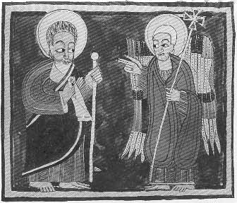

  
[Intangible Textual Heritage](../../index)  [Christianity](../index) 
[Africa](../../afr/index)  [Index](index)  [Previous](04)  [Next](06) 

------------------------------------------------------------------------

  
*The Kebra Nagast*, by E.A. Wallis Budge, \[1932\], at Intangible
Textual Heritage

------------------------------------------------------------------------

PLATE V

 

The Angel of God appearing to Moses

*From Brit. Mus. Orient. No. 481, fol. 73 b*

------------------------------------------------------------------------

[Next: VI.](06)

